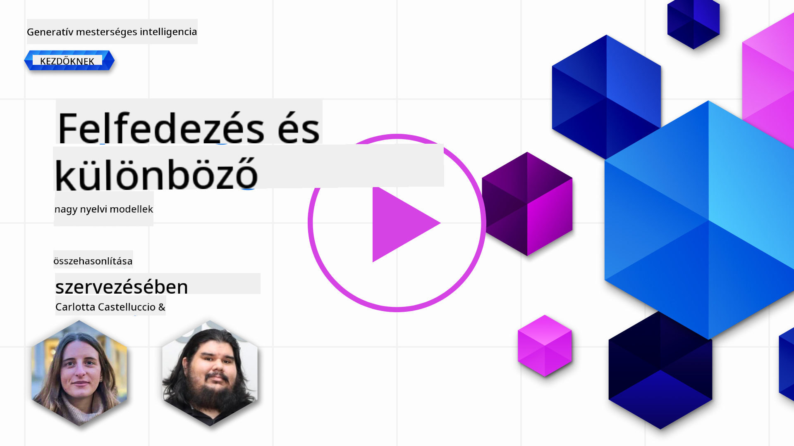
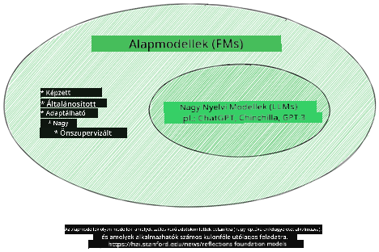
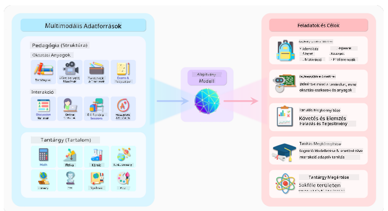
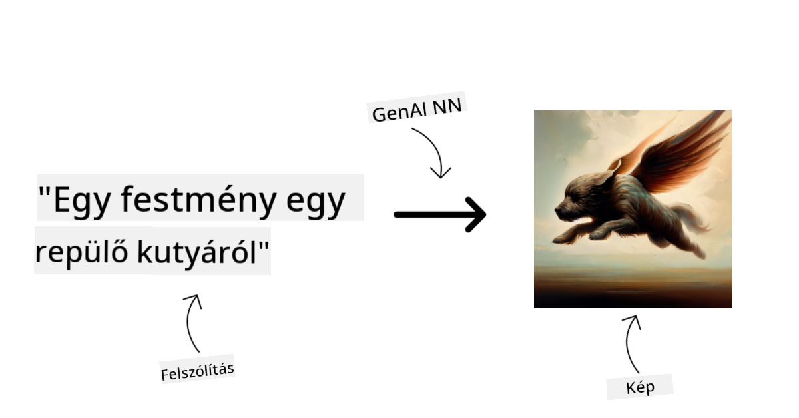
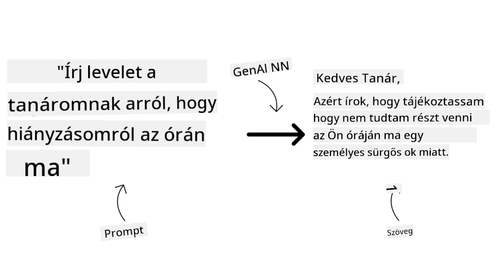
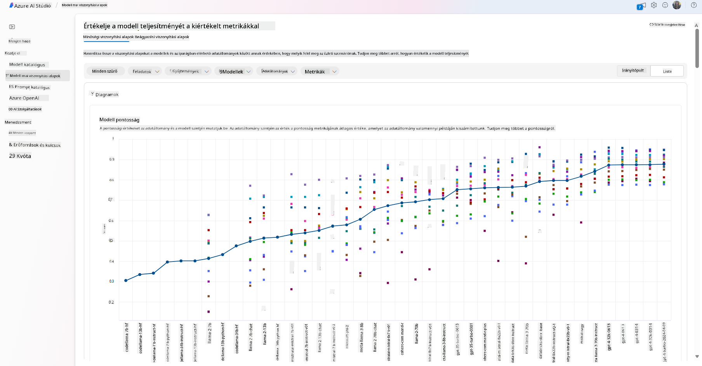
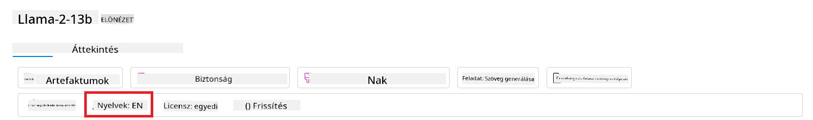
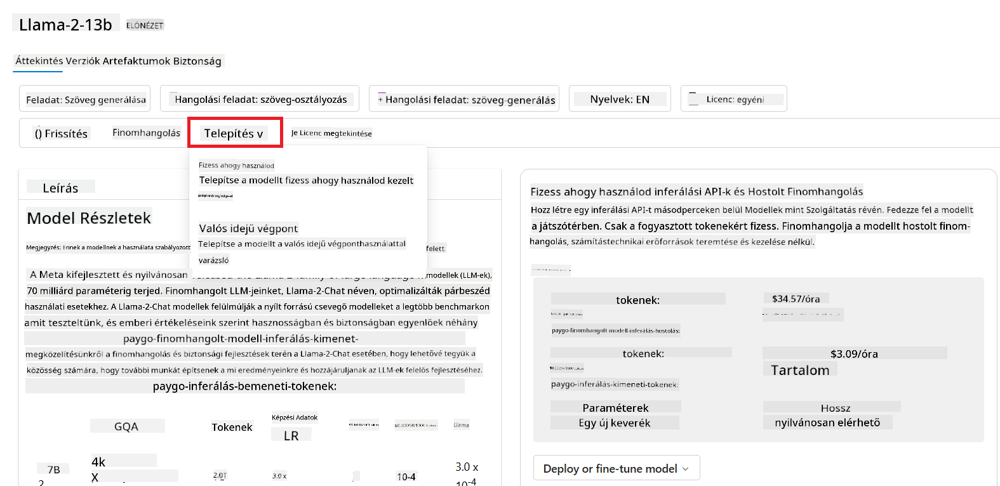

<!--
CO_OP_TRANSLATOR_METADATA:
{
  "original_hash": "e2f686f2eb794941761252ac5e8e090b",
  "translation_date": "2025-05-19T14:18:24+00:00",
  "source_file": "02-exploring-and-comparing-different-llms/README.md",
  "language_code": "hu"
}
-->
# Felfedezés és összehasonlítás különböző LLM-ekkel

> _Kattintson a fenti képre, hogy megnézze a leckéről készült videót_

Az előző leckében láttuk, hogyan változtatja meg a generatív AI a technológiai környezetet, hogyan működnek a nagy nyelvi modellek (LLM-ek), és hogyan alkalmazhatja egy vállalkozás - például a startupunk - azokat a saját eseteikben és növekedhet! Ebben a fejezetben különböző típusú nagy nyelvi modelleket (LLM-eket) hasonlítunk össze, hogy megértsük azok előnyeit és hátrányait.

Startupunk következő lépése az LLM-ek jelenlegi környezetének feltérképezése és annak megértése, hogy melyek alkalmasak a mi felhasználási esetünkre.

## Bevezetés

Ez a lecke kiterjed:

- Különböző típusú LLM-ekre a jelenlegi környezetben.
- Modellek tesztelésére, iterálására és összehasonlítására az Azure-ban.
- Hogyan telepítsünk egy LLM-et.

## Tanulási célok

A lecke befejezése után képes leszel:

- Kiválasztani a megfelelő modellt a felhasználási esetedhez.
- Megérteni, hogyan tesztelheted, iterálhatod és javíthatod a modelled teljesítményét.
- Tudni, hogyan telepítenek modelleket a vállalkozások.

## Különböző típusú LLM-ek megértése

Az LLM-eket többféleképpen kategorizálhatjuk az architektúrájuk, a képzési adataik és a felhasználási esetük alapján. Ezeknek a különbségeknek a megértése segít startupunknak kiválasztani a megfelelő modellt az adott helyzethez, és megérteni, hogyan tesztelhetjük, iterálhatjuk és javíthatjuk a teljesítményt.

Sokféle LLM modell létezik, a modell kiválasztása attól függ, hogy mire szeretnéd használni őket, milyen adatokat használsz, mennyit vagy hajlandó fizetni és még sok más tényezőtől.

Attól függően, hogy a modelleket szöveg, hang, videó, kép generálására és így tovább szeretnéd használni, választhatsz különböző típusú modellt.

- **Hang- és beszédfelismerés**. Erre a célra a Whisper típusú modellek kiváló választás, mivel általános célúak és a beszédfelismerésre irányulnak. Különböző hangokon képzett és képes többnyelvű beszédfelismerésre. Tudj meg többet a [Whisper típusú modellekről itt](https://platform.openai.com/docs/models/whisper?WT.mc_id=academic-105485-koreyst).

- **Kép generálás**. Kép generálásra a DALL-E és a Midjourney két nagyon ismert választás. A DALL-E az Azure OpenAI által kínált. [Olvass többet a DALL-E-ről itt](https://platform.openai.com/docs/models/dall-e?WT.mc_id=academic-105485-koreyst) és a tananyag 9. fejezetében.

- **Szöveg generálás**. A legtöbb modell szöveg generálásra van kiképezve, és nagy választékot kínál a GPT-3.5-től a GPT-4-ig. Különböző költségekkel járnak, a GPT-4 a legdrágább. Érdemes megnézni az [Azure OpenAI játszóteret](https://oai.azure.com/portal/playground?WT.mc_id=academic-105485-koreyst), hogy kiértékeld, mely modellek illeszkednek legjobban a szükségleteidhez képesség és költség szempontjából.

- **Multi-modalitás**. Ha többféle adatot szeretnél kezelni bemenetként és kimenetként, érdemes megfontolni modelleket, mint például [gpt-4 turbo with vision vagy gpt-4o](https://learn.microsoft.com/azure/ai-services/openai/concepts/models#gpt-4-and-gpt-4-turbo-models?WT.mc_id=academic-105485-koreyst) - az OpenAI modellek legújabb kiadásai - amelyek képesek kombinálni a természetes nyelv feldolgozást a vizuális megértéssel, lehetővé téve a multi-modális interfészekkel való interakciókat.

A modell kiválasztása azt jelenti, hogy kapsz néhány alapvető képességet, amelyek azonban lehet, hogy nem elegendőek. Gyakran van cégspecifikus adat, amelyet valahogy el kell mondanod az LLM-nek. Számos különböző lehetőség van arra, hogyan közelítsd meg ezt, erről többet az elkövetkező szakaszokban.

### Alapmodellek versus LLM-ek

Az Alapmodell kifejezést [a Stanford kutatói alkották](https://arxiv.org/abs/2108.07258?WT.mc_id=academic-105485-koreyst), és úgy definiálták, mint egy AI modellt, amely bizonyos kritériumokat követ, mint például:

- **Nem felügyelt tanulással vagy önfelügyelt tanulással vannak kiképezve**, ami azt jelenti, hogy címkézetlen multi-modális adatokon vannak kiképezve, és nem igényelnek emberi annotációt vagy adatcímkézést a képzési folyamatukhoz.
- **Nagyon nagy modellek**, amelyek nagyon mély neurális hálózatokon alapulnak, milliárd paraméterekkel képzett.
- **Általában más modellek 'alapjaként' szolgálnak**, ami azt jelenti, hogy kiindulópontként használhatók más modellek építésére, amit finomhangolással lehet elérni.

Kép forrása: [Alapvető útmutató az Alapmodellekhez és Nagy Nyelvi Modellekhez | Babar M Bhatti | Medium
](https://thebabar.medium.com/essential-guide-to-foundation-models-and-large-language-models-27dab58f7404)

A megkülönböztetés további tisztázása érdekében vegyük példának a ChatGPT-t. Az első verziójának felépítéséhez egy GPT-3.5 nevű modell szolgált alapmodellként. Ez azt jelenti, hogy az OpenAI használt néhány chat-specifikus adatot, hogy létrehozzon egy hangolt verziót a GPT-3.5-ből, amely specializálódott a beszélgetési helyzetekben, mint például a chatbotok, való jó teljesítményre.

Kép forrása: [2108.07258.pdf (arxiv.org)](https://arxiv.org/pdf/2108.07258.pdf?WT.mc_id=academic-105485-koreyst)

### Nyílt forráskódú versus Tulajdonosi modellek

Az LLM-ek másik módja, hogy nyílt forráskódúak vagy tulajdonosiak.

A nyílt forráskódú modellek olyan modellek, amelyeket nyilvánosságra hoznak, és bárki használhatja őket. Gyakran a létrehozó vállalat vagy a kutatói közösség teszi őket elérhetővé. Ezek a modellek lehetővé teszik az ellenőrzést, módosítást és testreszabást a különböző LLM felhasználási esetekhez. Azonban nem mindig optimalizáltak termelési használatra, és lehet, hogy nem olyan teljesítményesek, mint a tulajdonosi modellek. Továbbá, a nyílt forráskódú modellek finanszírozása korlátozott lehet, és lehet, hogy nem tartják fenn hosszú távon, vagy nem frissítik a legújabb kutatásokkal. Népszerű nyílt forráskódú modellek példái közé tartozik [Alpaca](https://crfm.stanford.edu/2023/03/13/alpaca.html?WT.mc_id=academic-105485-koreyst), [Bloom](https://huggingface.co/bigscience/bloom) és [LLaMA](https://llama.meta.com).

A tulajdonosi modellek olyan modellek, amelyeket egy vállalat birtokol, és nem teszik őket elérhetővé a nyilvánosság számára. Ezek a modellek gyakran optimalizáltak termelési használatra. Azonban nem engedélyezett az ellenőrzés, módosítás vagy testreszabás különböző felhasználási esetekhez. Továbbá, nem mindig elérhetők ingyen, és előfizetést vagy fizetést igényelhetnek a használatukhoz. Továbbá, a felhasználók nem rendelkeznek az adatok felett, amelyeket a modell képzéséhez használnak, ami azt jelenti, hogy a modell tulajdonosának kell bízniuk az adatok adatvédelmének és az AI felelős használatának biztosításában. Népszerű tulajdonosi modellek példái közé tartozik [OpenAI modellek](https://platform.openai.com/docs/models/overview?WT.mc_id=academic-105485-koreyst), [Google Bard](https://sapling.ai/llm/bard?WT.mc_id=academic-105485-koreyst) vagy [Claude 2](https://www.anthropic.com/index/claude-2?WT.mc_id=academic-105485-koreyst).

### Beágyazás versus Kép generálás versus Szöveg és Kód generálás

Az LLM-eket az általuk generált kimenet alapján is kategorizálhatjuk.

A beágyazások olyan modellek, amelyek képesek szöveget numerikus formába, úgynevezett beágyazásba konvertálni, amely a bemeneti szöveg numerikus reprezentációja. A beágyazások megkönnyítik a gépek számára a szavak vagy mondatok közötti kapcsolatok megértését, és más modellek, mint például osztályozási modellek vagy csoportosítási modellek, amelyek jobban teljesítenek numerikus adatokon, bemenetként fogyaszthatók. A beágyazási modelleket gyakran használják átvitel tanulásra, ahol egy modellt egy helyettesítő feladatra építenek, amelyhez bőséges adat áll rendelkezésre, majd a modell súlyait (beágyazásokat) újra felhasználják más lefelé irányuló feladatokra. Ennek a kategóriának egy példája az [OpenAI beágyazások](https://platform.openai.com/docs/models/embeddings?WT.mc_id=academic-105485-koreyst).

A kép generálási modellek olyan modellek, amelyek képeket generálnak. Ezeket a modelleket gyakran használják kép szerkesztésre, kép szintézisre és kép fordításra. A kép generálási modellek gyakran nagy képadatkészleteken, például [LAION-5B](https://laion.ai/blog/laion-5b/?WT.mc_id=academic-105485-koreyst) képzett, és új képek generálására vagy meglévő képek szerkesztésére használhatók festés, szuperfelbontás és színezési technikák segítségével. Példák közé tartozik a [DALL-E-3](https://openai.com/dall-e-3?WT.mc_id=academic-105485-koreyst) és a [Stable Diffusion modellek](https://github.com/Stability-AI/StableDiffusion?WT.mc_id=academic-105485-koreyst).

A szöveg és kód generálási modellek olyan modellek, amelyek szöveget vagy kódot generálnak. Ezeket a modelleket gyakran használják szöveg összefoglalásra, fordításra és kérdés megválaszolásra. A szöveg generálási modellek gyakran nagy szövegadatkészleteken, például [BookCorpus](https://www.cv-foundation.org/openaccess/content_iccv_2015/html/Zhu_Aligning_Books_and_ICCV_2015_paper.html?WT.mc_id=academic-105485-koreyst) képzett, és új szöveg generálására vagy kérdések megválaszolására használhatók. A kód generálási modellek, mint például [CodeParrot](https://huggingface.co/codeparrot?WT.mc_id=academic-105485-koreyst), gyakran nagy kódadatkészleteken, például GitHub képzett, és új kód generálására vagy meglévő kód hibáinak javítására használhatók.

### Kódoló-Dekódoló versus Csak dekódoló

Az LLM-ek különböző architektúráinak megvitatásához használjunk egy analógiát.

Képzeld el, hogy a vezetőd adott neked egy feladatot, hogy írj egy kvízt a diákok számára. Két kollégád van; az egyik a tartalom létrehozásáért felelős, a másik a felülvizsgálatért.

A tartalom létrehozó olyan, mint egy Csak dekódoló modell, megnézheti a témát és azt, amit már írtál, majd az alapján írhat egy kurzust. Nagyon jók az érdekes és informatív tartalom írásában, de nem nagyon jók a téma és a tanulási célok megértésében. A dekódoló modellek példái a GPT család modellek, például a GPT-3.

A felülvizsgáló olyan, mint egy Csak kódoló modell, megnézi az írt kurzust és a válaszokat, észreveszi a kapcsolatot közöttük és megérti a kontextust, de nem jó a tartalom generálásában. A kódoló modellek példája a BERT.

Képzeld el, hogy lehetne valaki, aki létrehozhatja és felülvizsgálhatja a kvízt, ez egy Kódoló-Dekódoló modell. Néhány példa lenne a BART és a T5.

### Szolgáltatás versus Modell

Most beszéljünk a szolgáltatás és a modell közötti különbségről. A szolgáltatás egy termék, amelyet egy Felhő Szolgáltató kínál, és gyakran modellek, adatok és más összetevők kombinációja. A modell a szolgáltatás központi eleme, és gyakran alapmodell, mint például egy LLM.

A szolgáltatások gyakran optimalizáltak termelési használatra, és gyakran könnyebben használhatók, mint a modellek, grafikus felhasználói felületen keresztül. Azonban a szolgáltatások nem mindig elérhetők ingyen, és előfizetést vagy fizetést igényelhetnek a használatukért, cserébe a szolgáltatás tulajdonosának felszerelése és erőforrásai, költségek optimalizálása és könnyű skálázás. Példa egy szolgáltatásra az [Azure OpenAI Service](https://learn.microsoft.com/azure/ai-services/openai/overview?WT.mc_id=academic-105485-koreyst), amely pay-as-you-go díjtervet kínál, ami azt jelenti, hogy a felhasználókat arányosan terhelik azzal, hogy mennyit használják a szolgáltatást. Továbbá, az Azure OpenAI Service vállalati szintű biztonságot és felelős AI keretrendszert kínál a modellek képességein felül.

A modellek csak a Neurális Hálózat, a paraméterekkel, súlyokkal és másokkal. Lehetővé teszi a vállalatoknak, hogy helyileg futtassák, azonban szükség lenne felszerelés vásárlására, struktúra építésére a skálázáshoz és licenc vásárlására vagy nyílt forráskódú modell használatára. Egy modell, mint a LLaMA, elérhető a használatra, számítási teljesítményt igényelve a modell futtatásához.

## Hogyan teszteljük és iteráljuk különböző modellekkel a teljesítmény megértés
- Hasonlítsa össze az iparágban elérhető modellek és adathalmazok benchmarkjait, hogy felmérje, melyik felel meg az üzleti forgatókönyvnek, a [Model Benchmarks](https://learn.microsoft.com/azure/ai-studio/how-to/model-benchmarks?WT.mc_id=academic-105485-koreyst) panelen keresztül.

- Finomhangolja a modellt egyedi képzési adatokon, hogy javítsa a modell teljesítményét egy adott munkaterhelésben, az Azure AI Studio kísérletezési és nyomon követési képességeit kihasználva.

- Telepítse az eredeti előre betanított modellt vagy a finomhangolt verziót távoli valós idejű következtetéshez - kezelt számítási kapacitás - vagy szerver nélküli API végpontra - [pay-as-you-go](https://learn.microsoft.com/azure/ai-studio/how-to/model-catalog-overview#model-deployment-managed-compute-and-serverless-api-pay-as-you-go?WT.mc_id=academic-105485-koreyst) - hogy az alkalmazások felhasználhassák azt.

> [!NOTE]
> Nem minden modell elérhető jelenleg a katalógusban finomhangolásra és/vagy pay-as-you-go telepítésre. Ellenőrizze a modell kártyáját a modell képességeiről és korlátairól.

## LLM eredmények javítása

Startup csapatunkkal különböző típusú LLM-eket és egy felhőplatformot (Azure Machine Learning) vizsgáltunk, amely lehetővé teszi számunkra, hogy összehasonlítsunk különböző modelleket, tesztadatokon értékeljük őket, javítsuk a teljesítményt és telepítsük őket következtetési végpontokra.

De mikor érdemes inkább finomhangolni egy modellt, mint egy előre betanítottat használni? Vannak más megközelítések is a modell teljesítményének javítására konkrét munkaterhelések esetén?

Számos megközelítést alkalmazhat egy vállalkozás, hogy elérje a kívánt eredményeket egy LLM segítségével. Különböző típusú modelleket választhat, különböző képzési fokozatokkal, amikor egy LLM-et telepít a termelésbe, különböző komplexitási, költség- és minőségi szintekkel. Íme néhány különböző megközelítés:

- **Prompt tervezés kontextussal**. Az ötlet az, hogy elegendő kontextust biztosítunk a promptnál, hogy biztosítsuk a szükséges válaszok elérését.

- **Retrieval Augmented Generation, RAG**. Az adatai például egy adatbázisban vagy webes végponton létezhetnek, hogy biztosítsák ezen adatok vagy azok részhalmazának bevonását a prompt időpontjában, lekérheti a releváns adatokat, és a felhasználói prompt részévé teheti.

- **Finomhangolt modell**. Itt tovább képezte a modellt saját adataival, ami pontosabbá és reagálóbbá tette a modell az igényeire, de költséges lehet.

Kép forrása: [Négy mód, ahogyan a vállalatok telepítik az LLM-eket | Fiddler AI Blog](https://www.fiddler.ai/blog/four-ways-that-enterprises-deploy-llms?WT.mc_id=academic-105485-koreyst)

### Prompt tervezés kontextussal

Az előre betanított LLM-ek nagyon jól működnek általánosított természetes nyelvi feladatokban, még akkor is, ha rövid prompttal hívják meg őket, mint például egy befejezendő mondat vagy kérdés – az úgynevezett „zero-shot” tanulás.

Azonban minél inkább képes a felhasználó megfogalmazni kérdését, részletes kéréssel és példákkal – a kontextussal –, annál pontosabb és a felhasználó elvárásaihoz legközelebb álló lesz a válasz. Ebben az esetben „one-shot” tanulásról beszélünk, ha a prompt csak egy példát tartalmaz, és „few-shot” tanulásról, ha több példát tartalmaz. A prompt tervezés kontextussal a legköltséghatékonyabb megközelítés a kezdéshez.

### Retrieval Augmented Generation (RAG)

Az LLM-eknek az a korlátja, hogy csak azokat az adatokat tudják felhasználni, amelyek a képzésük során rendelkezésre álltak a válasz generálásához. Ez azt jelenti, hogy nem tudnak semmit azokról a tényekről, amelyek a képzési folyamatuk után történtek, és nem férnek hozzá nem nyilvános információkhoz (például vállalati adatok).
Ezt a RAG segítségével lehet áthidalni, egy olyan technikával, amely külső adatokkal egészíti ki a promptot dokumentumok darabjaival, figyelembe véve a prompt hosszúsági korlátait. Ezt a vektor adatbázis eszközök támogatják (mint például [Azure Vector Search](https://learn.microsoft.com/azure/search/vector-search-overview?WT.mc_id=academic-105485-koreyst)), amelyek hasznos darabokat keresnek vissza különböző előre meghatározott adatforrásokból, és hozzáadják őket a prompt kontextusához.

Ez a technika nagyon hasznos, amikor egy vállalkozásnak nincs elegendő adata, elegendő ideje vagy erőforrása egy LLM finomhangolására, de még mindig szeretné javítani a teljesítményt egy adott munkaterhelésben, és csökkenteni a kitalálások, azaz a valóság elferdítésének vagy káros tartalom kockázatát.

### Finomhangolt modell

A finomhangolás egy olyan folyamat, amely a transzfer tanulást kihasználva „alkalmazza” a modellt egy lefelé irányuló feladatra vagy egy adott probléma megoldására. Ellentétben a few-shot tanulással és a RAG-gal, új modell jön létre, frissített súlyokkal és torzításokkal. Szüksége van egy képzési példák halmazára, amely egyetlen bemenetből (a promptból) és a hozzá kapcsolódó kimenetből (a befejezésből) áll.
Ez lenne a preferált megközelítés, ha:

- **Finomhangolt modellek használata**. Egy vállalkozás inkább kevésbé képes finomhangolt modelleket (mint például beágyazási modellek) szeretne használni, mint magas teljesítményű modelleket, ami költséghatékonyabb és gyorsabb megoldást eredményez.

- **Késleltetés figyelembevétele**. A késleltetés fontos egy adott felhasználási esetben, ezért nem lehetséges nagyon hosszú promptokat használni, vagy a példák száma, amelyeket a modellnek meg kell tanulnia, nem illeszkedik a prompt hosszúsági korlátjához.

- **Naprakész maradás**. Egy vállalkozásnak sok kiváló minőségű adata és valóságbeli címkéje van, valamint az erőforrások, amelyek szükségesek ezeknek az adatoknak a folyamatos naprakészen tartásához.

### Betanított modell

Egy LLM-et a semmiből betanítani kétségtelenül a legnehezebb és legösszetettebb megközelítés, amely hatalmas mennyiségű adatot, képzett erőforrásokat és megfelelő számítási kapacitást igényel. Ezt az opciót csak akkor érdemes fontolóra venni, ha egy vállalkozásnak van egy terület-specifikus felhasználási esete és nagy mennyiségű területközpontú adata.

## Tudás ellenőrzése

Mi lehet egy jó megközelítés az LLM befejezési eredmények javítására?

1. Prompt tervezés kontextussal
1. RAG
1. Finomhangolt modell

A:3, ha van ideje és erőforrásai, valamint kiváló minőségű adatai, a finomhangolás a jobb opció, hogy naprakész maradjon. Azonban, ha a dolgok javítására törekszik, és nincs elég ideje, érdemes először a RAG-ot fontolóra venni.

## 🚀 Kihívás

Olvasson többet arról, hogyan tudja [használni a RAG-ot](https://learn.microsoft.com/azure/search/retrieval-augmented-generation-overview?WT.mc_id=academic-105485-koreyst) vállalkozásában.

## Remek munka, folytassa a tanulást

A lecke befejezése után tekintse meg [Generative AI Learning gyűjteményünket](https://aka.ms/genai-collection?WT.mc_id=academic-105485-koreyst), hogy tovább növelje a Generative AI tudását!

Lépjen tovább a 3. leckére, ahol megnézzük, hogyan lehet [felelősségteljesen építeni Generative AI-vel](../03-using-generative-ai-responsibly/README.md?WT.mc_id=academic-105485-koreyst)!

**Jogi nyilatkozat**:  
Ez a dokumentum az AI fordítási szolgáltatás [Co-op Translator](https://github.com/Azure/co-op-translator) használatával készült. Bár törekszünk a pontosságra, kérjük, vegye figyelembe, hogy az automatikus fordítások hibákat vagy pontatlanságokat tartalmazhatnak. Az eredeti dokumentum a saját nyelvén tekintendő hiteles forrásnak. Fontos információk esetén javasolt a professzionális emberi fordítás igénybevétele. Nem vállalunk felelősséget a fordítás használatából eredő félreértésekért vagy félremagyarázásokért.