<!--
CO_OP_TRANSLATOR_METADATA:
{
  "original_hash": "e2f686f2eb794941761252ac5e8e090b",
  "translation_date": "2025-07-09T08:37:10+00:00",
  "source_file": "02-exploring-and-comparing-different-llms/README.md",
  "language_code": "hu"
}
-->
# Különböző LLM-ek felfedezése és összehasonlítása

[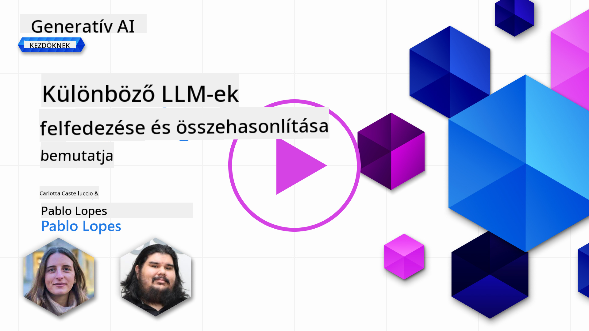](https://aka.ms/gen-ai-lesson2-gh?WT.mc_id=academic-105485-koreyst)

> _Kattints a fenti képre a lecke videójának megtekintéséhez_

Az előző leckében láttuk, hogyan alakítja át a Generatív AI a technológiai környezetet, hogyan működnek a Nagy Nyelvi Modellek (LLM-ek), és hogyan alkalmazhatja egy vállalkozás – például a mi startupunk – ezeket az eseteihez, hogy növekedjen! Ebben a fejezetben különböző típusú nagy nyelvi modelleket hasonlítunk össze, hogy megértsük az előnyeiket és hátrányaikat.

A következő lépés a startupunk útján az LLM-ek jelenlegi kínálatának feltérképezése, és annak megértése, hogy melyek alkalmasak a mi felhasználási esetünkhöz.

## Bevezetés

Ebben a leckében a következőkről lesz szó:

- Az LLM-ek különböző típusai a jelenlegi piacon.
- Különböző modellek tesztelése, iterálása és összehasonlítása az Azure környezetében a saját felhasználási esethez.
- Hogyan lehet egy LLM-et telepíteni.

## Tanulási célok

A lecke elvégzése után képes leszel:

- Kiválasztani a megfelelő modellt a saját felhasználási esetedhez.
- Megérteni, hogyan kell tesztelni, iterálni és javítani a modell teljesítményét.
- Tudni, hogyan telepítenek modelleket a vállalkozások.

## Különböző LLM típusok megértése

Az LLM-ek többféleképpen kategorizálhatók az architektúrájuk, a tanító adatok és a felhasználási eset alapján. Ezeknek a különbségeknek az ismerete segít a startupunknak a megfelelő modell kiválasztásában, valamint abban, hogy hogyan teszteljük, iteráljuk és javítsuk a teljesítményt.

Számos különböző LLM modell létezik, a választás attól függ, mire szeretnéd használni őket, milyen adataid vannak, mennyit vagy hajlandó fizetni, és még sok más tényezőtől.

Attól függően, hogy szöveg, hang, videó, kép generálására vagy másra szeretnéd használni a modelleket, más-más típusú modellt választhatsz.

- **Hang- és beszédfelismerés**. Ehhez a célra a Whisper típusú modellek kiválóak, mivel általános célúak és beszédfelismerésre vannak optimalizálva. Sokféle hanganyagon tanították őket, és többnyelvű beszédfelismerésre képesek. Tudj meg többet a [Whisper típusú modellekről itt](https://platform.openai.com/docs/models/whisper?WT.mc_id=academic-105485-koreyst).

- **Képalkotás**. Képalkotásra a DALL-E és a Midjourney a legismertebb választások. A DALL-E az Azure OpenAI szolgáltatás része. [Olvass többet a DALL-E-ről itt](https://platform.openai.com/docs/models/dall-e?WT.mc_id=academic-105485-koreyst), valamint a tananyag 9. fejezetében.

- **Szöveg generálás**. A legtöbb modell szöveg generálásra van tanítva, és széles választék áll rendelkezésre a GPT-3.5-től a GPT-4-ig. Ezek különböző árkategóriákban érhetők el, a GPT-4 a legdrágább. Érdemes megnézni az [Azure OpenAI playgroundot](https://oai.azure.com/portal/playground?WT.mc_id=academic-105485-koreyst), hogy felmérd, mely modellek felelnek meg leginkább a képességeidnek és költségvetésednek.

- **Többmodalitás**. Ha többféle adatot szeretnél kezelni bemenetként és kimenetként is, érdemes megnézni olyan modelleket, mint a [gpt-4 turbo visionnal vagy gpt-4o](https://learn.microsoft.com/azure/ai-services/openai/concepts/models#gpt-4-and-gpt-4-turbo-models?WT.mc_id=academic-105485-koreyst) – ezek az OpenAI legújabb modelljei –, amelyek képesek a természetes nyelv feldolgozását vizuális megértéssel kombinálni, lehetővé téve a többmodalitású felületeken való interakciót.

Egy modell kiválasztása alapvető képességeket ad, de ez nem mindig elég. Gyakran vannak céges specifikus adatok, amelyeket valahogy be kell táplálni az LLM-be. Többféle megközelítés létezik erre, erről a következő szakaszokban lesz szó.

### Foundation Model-ek és LLM-ek

A Foundation Model kifejezést [Stanford kutatók alkották meg](https://arxiv.org/abs/2108.07258?WT.mc_id=academic-105485-koreyst), és olyan AI modellt jelöl, amely megfelel bizonyos kritériumoknak, például:

- **Önfelügyelt vagy önálló tanulással tanítják**, azaz címkézetlen, többmodalitású adatokon tanulnak, emberi annotáció vagy címkézés nélkül.
- **Nagyon nagy modellek**, mély neurális hálózatokon alapulnak, amelyeket milliárdnyi paraméteren tanítottak.
- **Általában más modellek „alapjaként” szolgálnak**, vagyis kiindulópontként használhatók további modellek építéséhez, finomhangolással.

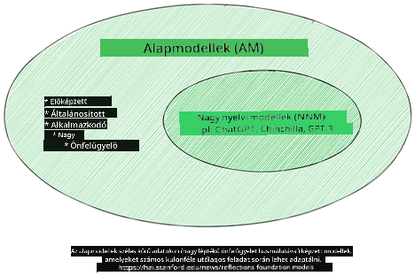

Kép forrása: [Essential Guide to Foundation Models and Large Language Models | by Babar M Bhatti | Medium](https://thebabar.medium.com/essential-guide-to-foundation-models-and-large-language-models-27dab58f7404)

A különbség további tisztázásához vegyük példaként a ChatGPT-t. A ChatGPT első verziójának megalkotásához a GPT-3.5 modellt használták alapmodellként. Ez azt jelenti, hogy az OpenAI chat-specifikus adatokkal finomhangolta a GPT-3.5-öt, hogy az jól teljesítsen beszélgetős helyzetekben, például chatbotoknál.

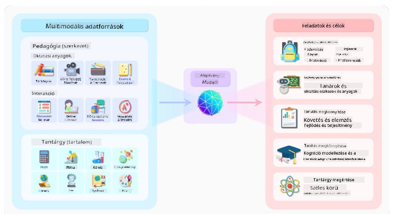

Kép forrása: [2108.07258.pdf (arxiv.org)](https://arxiv.org/pdf/2108.07258.pdf?WT.mc_id=academic-105485-koreyst)

### Nyílt forráskódú és zárt modellek

Az LLM-ek másik kategorizálási módja, hogy nyílt forráskódúak vagy zártak-e.

A nyílt forráskódú modellek nyilvánosan elérhetők, bárki használhatja őket. Ezeket gyakran a fejlesztő cég vagy a kutatóközösség teszi elérhetővé. Ezek a modellek megtekinthetők, módosíthatók és testreszabhatók különböző felhasználási esetekhez. Ugyanakkor nem mindig optimalizáltak éles használatra, és nem biztos, hogy olyan teljesítményt nyújtanak, mint a zárt modellek. A nyílt forráskódú modellek finanszírozása korlátozott lehet, és előfordulhat, hogy nem tartják őket hosszú távon karban, vagy nem frissítik őket a legújabb kutatásokkal. Népszerű nyílt forráskódú modellek például az [Alpaca](https://crfm.stanford.edu/2023/03/13/alpaca.html?WT.mc_id=academic-105485-koreyst), [Bloom](https://huggingface.co/bigscience/bloom) és a [LLaMA](https://llama.meta.com).

A zárt modellek egy cég tulajdonában vannak, és nem nyilvánosak. Ezeket gyakran éles használatra optimalizálják. Nem engedélyezett a megtekintésük, módosításuk vagy testreszabásuk különböző esetekhez. Nem mindig ingyenesek, előfizetés vagy fizetés szükséges a használatukhoz. A felhasználók nem rendelkeznek kontrollal a modell tanításához használt adatok felett, ezért a modell tulajdonosára kell bízni az adatvédelem és a felelős AI használat biztosítását. Népszerű zárt modellek például az [OpenAI modellek](https://platform.openai.com/docs/models/overview?WT.mc_id=academic-105485-koreyst), a [Google Bard](https://sapling.ai/llm/bard?WT.mc_id=academic-105485-koreyst) vagy a [Claude 2](https://www.anthropic.com/index/claude-2?WT.mc_id=academic-105485-koreyst).

### Embedding, képalkotás, szöveg- és kódgenerálás

Az LLM-eket a kimenetük alapján is csoportosíthatjuk.

Az embedding modellek olyan modellek, amelyek szöveget alakítanak át numerikus formába, az úgynevezett embeddingbe, ami a bemeneti szöveg numerikus reprezentációja. Az embeddingek megkönnyítik a gépek számára a szavak vagy mondatok közötti kapcsolatok megértését, és más modellek bemeneteként használhatók, például osztályozó vagy klaszterező modellekhez, amelyek jobban teljesítenek numerikus adatokon. Az embedding modelleket gyakran használják transfer learninghez, amikor egy modellt egy helyettesítő feladatra tanítanak, amelyhez sok adat áll rendelkezésre, majd a modell súlyait (embeddingeket) újrafelhasználják más, későbbi feladatokhoz. Ennek a kategóriának példája az [OpenAI embeddingek](https://platform.openai.com/docs/models/embeddings?WT.mc_id=academic-105485-koreyst).

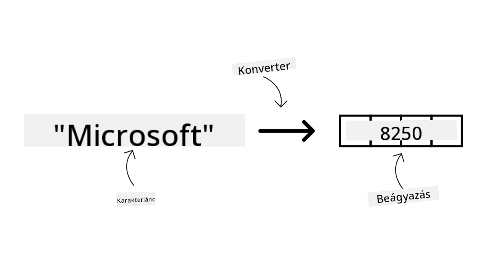

A képalkotó modellek képeket generálnak. Ezeket gyakran használják képszerkesztésre, képszintézisre és képátalakításra. Ezeket a modelleket nagy képadatbázisokon, például a [LAION-5B](https://laion.ai/blog/laion-5b/?WT.mc_id=academic-105485-koreyst) tanították, és új képek generálására vagy meglévő képek szerkesztésére használhatók, például inpainting, szuperfelbontás vagy színezés technikákkal. Példák: [DALL-E-3](https://openai.com/dall-e-3?WT.mc_id=academic-105485-koreyst) és a [Stable Diffusion modellek](https://github.com/Stability-AI/StableDiffusion?WT.mc_id=academic-105485-koreyst).

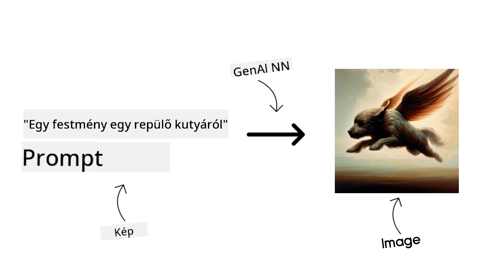

A szöveg- és kódgeneráló modellek szöveget vagy kódot hoznak létre. Ezeket gyakran használják szövegösszefoglalásra, fordításra és kérdés-válasz feladatokra. A szöveg generáló modelleket nagy szöveges adatbázisokon, például a [BookCorpus](https://www.cv-foundation.org/openaccess/content_iccv_2015/html/Zhu_Aligning_Books_and_ICCV_2015_paper.html?WT.mc_id=academic-105485-koreyst) tanították, és új szövegek generálására vagy kérdések megválaszolására használhatók. A kódgeneráló modelleket, mint például a [CodeParrot](https://huggingface.co/codeparrot?WT.mc_id=academic-105485-koreyst), nagy kódadatbázisokon, például a GitHubon tanították, és új kód generálására vagy meglévő kód hibáinak javítására használhatók.

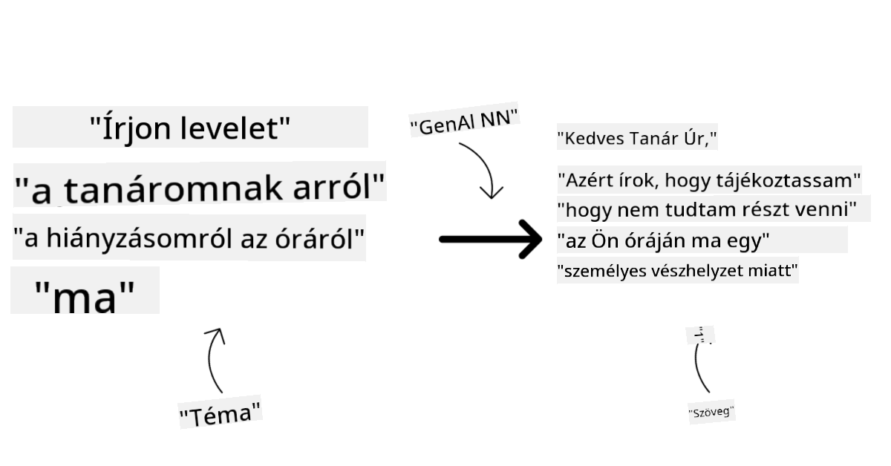

### Encoder-Decoder és csak Decoder architektúrák

Az LLM-ek különböző architektúráiról egy analógiával beszéljünk.

Képzeld el, hogy a vezetőd feladatul adta, hogy írj egy kvízt a diákoknak. Két kollégád van; az egyik a tartalom létrehozásáért felel, a másik a tartalom átnézéséért.

A tartalomkészítő olyan, mint egy csak Decoder modell: megnézi a témát és azt, amit már írtál, majd ennek alapján ír egy leckét. Nagyon jók abban, hogy érdekes és informatív tartalmat írjanak, de nem annyira jók a téma és a tanulási célok megértésében. Példák a csak Decoder modellekre a GPT család tagjai, például a GPT-3.

Az átnéző olyan, mint egy csak Encoder modell: megnézi a megírt leckét és a válaszokat, észleli a köztük lévő kapcsolatot, megérti a kontextust, de nem jó tartalom generálásában. Példa az csak Encoder modellre a BERT.

Képzeld el, hogy lenne valaki, aki egyszerre tudna létrehozni és átnézni is egy kvízt – ez az Encoder-Decoder modell. Példák erre a BART és a T5.

### Szolgáltatás és modell közötti különbség

Most beszéljünk a szolgáltatás és a modell közötti különbségről. A szolgáltatás egy termék, amelyet egy felhőszolgáltató kínál, és gyakran modellek, adatok és egyéb összetevők kombinációja. A modell a szolgáltatás magja, gyakran egy alapmodell, például egy LLM.

A szolgáltatásokat gyakran éles használatra optimalizálják, és általában könnyebben használhatók, például grafikus felületen keresztül. Ugyanakkor nem mindig ingyenesek, előfizetés vagy fizetés szükséges a használatukhoz, cserébe a szolgáltatás tulajdonosának eszközeit és erőforrásait használhatod, optimalizálva a költségeket és könnyen skálázva. Példa egy szolgáltatásra az [Azure OpenAI Service](https://learn.microsoft.com/azure/ai-services/openai/overview?WT.mc_id=academic-105485-koreyst), amely fogyasztás alapú díjszabást kínál, vagyis a felhasználók arányosan fizetnek a szolgáltatás használatáért. Az Azure OpenAI Service vállalati szintű biztonságot és felelős AI keretrendszert is biztosít a modellek képességei mellett.

A modellek csak a neurális hálózatok, paraméterekkel, súlyokkal és egyebekkel. A cégek helyben is futtathatják őket, de ehhez eszközöket kell vásárolniuk, infrastruktúrát építeniük a skálázáshoz, és licencet kell venniük, vagy nyílt forráskódú modellt használniuk. Például a LLaMA modell elérhető használatra, de futtatásához számítási kapacitás szükséges.

## Hogyan teszteljünk és iteráljunk különböző modellekkel az Azure-on a teljesítmény megértéséhez

Miután a csapat feltérképezte az LLM-ek jelenlegi kínálatát és kiválasztott néhány ígéretes modellt a saját eseteikhez, a következő lépés, hogy teszteljék őket a saját adataikon és munkaterhelésükön. Ez egy iteratív folyamat, amely kísérletezéssel és mérési eredményekkel zajlik.
A legtöbb, az előző bekezdésekben említett modell (OpenAI modellek, nyílt forráskódú modellek, mint a Llama2, és a Hugging Face transzformerek) elérhető a [Model Catalog](https://learn.microsoft.com/azure/ai-studio/how-to/model-catalog-overview?WT.mc_id=academic-105485-koreyst) alatt az [Azure AI Studio](https://ai.azure.com/?WT.mc_id=academic-105485-koreyst) platformon.

Az [Azure AI Studio](https://learn.microsoft.com/azure/ai-studio/what-is-ai-studio?WT.mc_id=academic-105485-koreyst) egy felhőalapú platform, amely fejlesztők számára készült generatív AI alkalmazások építésére és a teljes fejlesztési életciklus kezelésére – a kísérletezéstől az értékelésig –, az összes Azure AI szolgáltatás egyetlen központba integrálásával, kényelmes grafikus felülettel. Az Azure AI Studio Model Catalog lehetővé teszi a felhasználó számára, hogy:

- Megtalálja az érdeklődésének megfelelő Foundation Modelt a katalógusban – akár saját fejlesztésű, akár nyílt forráskódú, szűrve feladat, licenc vagy név szerint. A jobb kereshetőség érdekében a modelleket gyűjteményekbe szervezték, mint például az Azure OpenAI gyűjtemény, Hugging Face gyűjtemény és mások.

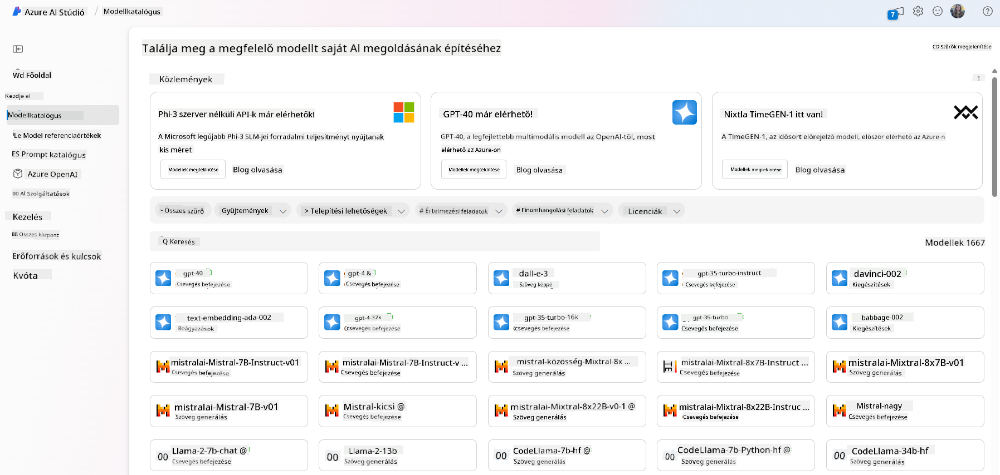

- Áttekintheti a modellkártyát, amely tartalmazza a részletes leírást a tervezett felhasználásról és a tanító adathalmazról, kódrészleteket és értékelési eredményeket az belső értékelési könyvtárból.

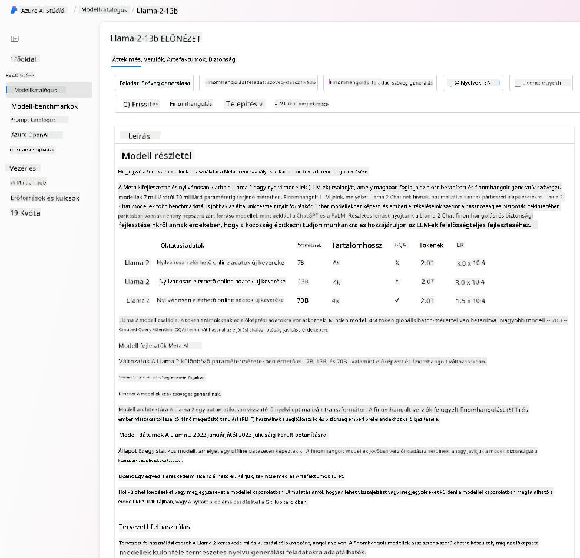

- Összehasonlíthatja az iparágban elérhető modellek és adathalmazok benchmark eredményeit, hogy felmérje, melyik felel meg leginkább az üzleti forgatókönyvnek, a [Model Benchmarks](https://learn.microsoft.com/azure/ai-studio/how-to/model-benchmarks?WT.mc_id=academic-105485-koreyst) panel segítségével.

- Finomhangolhatja a modellt egyedi tanító adatokon, hogy javítsa a modell teljesítményét egy adott feladatra, kihasználva az Azure AI Studio kísérletezési és nyomonkövetési képességeit.

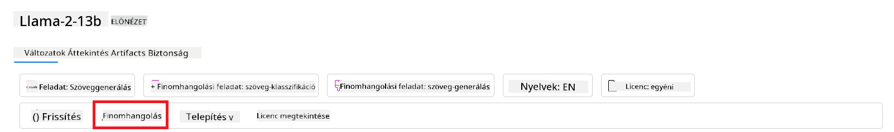

- Telepítheti az eredeti előre betanított modellt vagy a finomhangolt verziót távoli valós idejű lekérdezésre – menedzselt számítási környezetbe – vagy szerver nélküli API végpontra – [fizess a használat alapján](https://learn.microsoft.com/azure/ai-studio/how-to/model-catalog-overview#model-deployment-managed-compute-and-serverless-api-pay-as-you-go?WT.mc_id=academic-105485-koreyst) –, hogy az alkalmazások képesek legyenek használni azt.

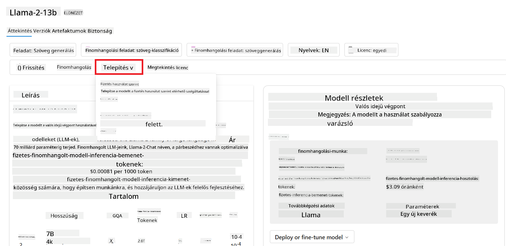

> [!NOTE]
> Nem minden modell érhető el jelenleg finomhangolásra és/vagy fizess a használat alapján történő telepítésre. A modellkártyán ellenőrizze a modell képességeit és korlátait.

## LLM eredmények javítása

Startup csapatunkkal különböző típusú LLM-eket és egy felhőplatformot (Azure Machine Learning) vizsgáltunk, amely lehetővé teszi számunkra, hogy összehasonlítsuk a modelleket, tesztadatokon értékeljük őket, javítsuk a teljesítményt, és telepítsük őket lekérdezési végpontokra.

De mikor érdemes inkább finomhangolni egy modellt, mint előre betanítottat használni? Vannak más módszerek is a modell teljesítményének javítására adott feladatokon?

Számos megközelítés létezik, amelyeket egy vállalkozás alkalmazhat, hogy megkapja a kívánt eredményeket egy LLM-től. Különböző típusú modelleket választhatunk, különböző mértékű tanítással, amikor egy LLM-et éles környezetbe telepítünk, eltérő komplexitással, költséggel és minőséggel. Íme néhány megközelítés:

- **Prompt tervezés kontextussal**. Az ötlet az, hogy elegendő kontextust adjunk a promptban, hogy biztosan megkapjuk a szükséges válaszokat.

- **Retrieval Augmented Generation, RAG**. Az adatok például adatbázisban vagy webes végponton lehetnek tárolva, és hogy ezek az adatok vagy azok egy része beépüljön a promptba, lekérhetjük a releváns adatokat, és beilleszthetjük a felhasználó promptjába.

- **Finomhangolt modell**. Itt a modellt tovább tanítottuk a saját adatainkon, ami pontosabbá és jobban reagálóvá tette a modellt az igényeinkre, de ez költséges lehet.

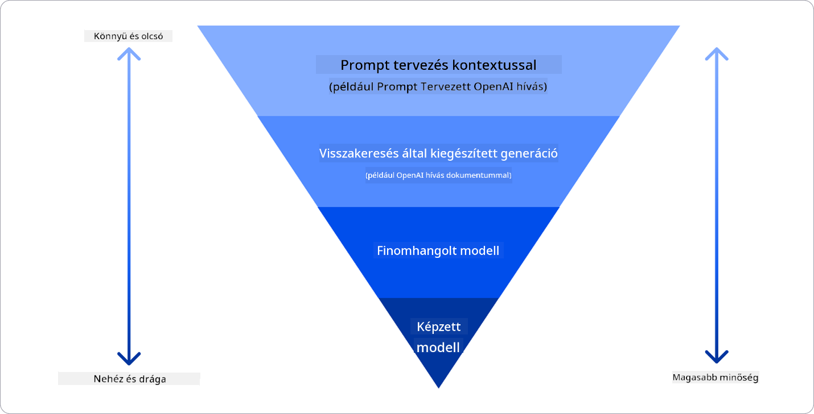

Kép forrása: [Four Ways that Enterprises Deploy LLMs | Fiddler AI Blog](https://www.fiddler.ai/blog/four-ways-that-enterprises-deploy-llms?WT.mc_id=academic-105485-koreyst)

### Prompt tervezés kontextussal

Az előre betanított LLM-ek nagyon jól működnek általános természetes nyelvi feladatokon, még akkor is, ha csak egy rövid prompttal hívjuk meg őket, például egy befejezendő mondattal vagy kérdéssel – ezt hívjuk „zero-shot” tanulásnak.

Azonban minél jobban képes a felhasználó megfogalmazni a kérését részletesen, példákkal – vagyis a Kontextussal –, annál pontosabb és a felhasználó elvárásaihoz közelebb álló lesz a válasz. Ebben az esetben „one-shot” tanulásról beszélünk, ha a prompt csak egy példát tartalmaz, és „few-shot” tanulásról, ha több példát is tartalmaz.
A prompt tervezés kontextussal a legköltséghatékonyabb megközelítés a kezdéshez.

### Retrieval Augmented Generation (RAG)

Az LLM-ek korlátja, hogy csak azokat az adatokat használhatják fel válasz generálására, amelyek a tanításuk során rendelkezésre álltak. Ez azt jelenti, hogy nem tudnak semmit a tanításuk után történt eseményekről, és nem férnek hozzá nem nyilvános információkhoz (például vállalati adatokhoz).
Ezt a problémát oldja meg a RAG, amely egy technika, amely külső adatokat illeszt be a promptba dokumentumdarabok formájában, figyelembe véve a prompt hosszának korlátait. Ezt támogatják a vektor adatbázis eszközök (például az [Azure Vector Search](https://learn.microsoft.com/azure/search/vector-search-overview?WT.mc_id=academic-105485-koreyst)), amelyek előre meghatározott adatforrásokból kinyerik a releváns darabokat, és hozzáadják azokat a prompt Kontextusához.

Ez a technika különösen hasznos, ha egy vállalkozásnak nincs elegendő adata, ideje vagy erőforrása egy LLM finomhangolására, de mégis szeretné javítani a teljesítményt egy adott feladaton, és csökkenteni a téves információk vagy káros tartalom kockázatát.

### Finomhangolt modell

A finomhangolás egy olyan folyamat, amely a transfer learninget használja arra, hogy a modellt egy adott feladathoz vagy problémához „igazítsa”. A few-shot tanulástól és a RAG-tól eltérően ez egy új modellt eredményez, frissített súlyokkal és torzításokkal. Ehhez egy tanító példakészlet szükséges, amely egy bemenetből (a promptból) és a hozzá tartozó kimenetből (a befejezésből) áll.
Ez a megközelítés előnyös, ha:

- **Finomhangolt modelleket használnak**. Egy vállalkozás inkább finomhangolt, kevésbé erőforrás-igényes modelleket (például embedding modelleket) szeretne használni a nagy teljesítményű modellek helyett, ami költséghatékonyabb és gyorsabb megoldást eredményez.

- **Fontos a késleltetés**. Egy adott felhasználási esetben a késleltetés kritikus, ezért nem lehet nagyon hosszú promptokat használni, vagy a tanulandó példák száma nem fér bele a prompt hosszkorlátjába.

- **Friss adatokkal dolgoznak**. Egy vállalkozásnak sok magas minőségű adata és valós címkéje van, valamint megvannak az erőforrásai ezeknek az adatoknak a folyamatos frissítésére.

### Betanított modell

Egy LLM-et a nulláról betanítani kétségtelenül a legnehezebb és legösszetettebb megközelítés, amely hatalmas mennyiségű adatot, képzett szakembereket és megfelelő számítási kapacitást igényel. Ezt a lehetőséget csak akkor érdemes megfontolni, ha egy vállalkozásnak speciális, adott szakterületre fókuszáló esete van, és nagy mennyiségű, szakterület-specifikus adata áll rendelkezésre.

## Tudásellenőrzés

Mi lehet egy jó megközelítés az LLM befejezési eredmények javítására?

1. Prompt tervezés kontextussal  
1. RAG  
1. Finomhangolt modell

Válasz: 3, ha van időd, erőforrásod és magas minőségű adatod, a finomhangolás a jobb választás a naprakészség fenntartásához. Azonban, ha gyors javításra van szükség és kevés az idő, érdemes először a RAG-et megfontolni.

## 🚀 Kihívás

Olvass utána, hogyan használhatod a [RAG-et](https://learn.microsoft.com/azure/search/retrieval-augmented-generation-overview?WT.mc_id=academic-105485-koreyst) a vállalkozásodban.

## Szép munka, folytasd a tanulást!

A lecke elvégzése után nézd meg a [Generative AI Learning gyűjteményünket](https://aka.ms/genai-collection?WT.mc_id=academic-105485-koreyst), hogy tovább fejleszd generatív AI ismereteidet!

Lépj tovább a 3. leckébe, ahol megnézzük, hogyan lehet [felelősségteljesen építeni generatív AI-val](../03-using-generative-ai-responsibly/README.md?WT.mc_id=academic-105485-koreyst)!

**Jogi nyilatkozat**:  
Ez a dokumentum az AI fordító szolgáltatás, a [Co-op Translator](https://github.com/Azure/co-op-translator) segítségével készült. Bár a pontosságra törekszünk, kérjük, vegye figyelembe, hogy az automatikus fordítások hibákat vagy pontatlanságokat tartalmazhatnak. Az eredeti dokumentum az anyanyelvén tekintendő hiteles forrásnak. Fontos információk esetén professzionális emberi fordítást javaslunk. Nem vállalunk felelősséget a fordítás használatából eredő félreértésekért vagy téves értelmezésekért.