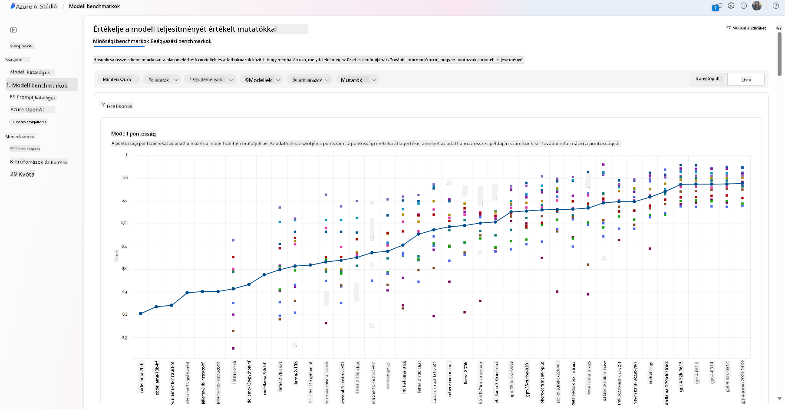
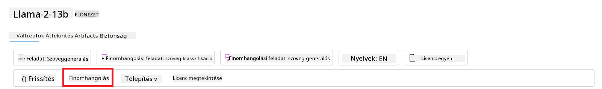
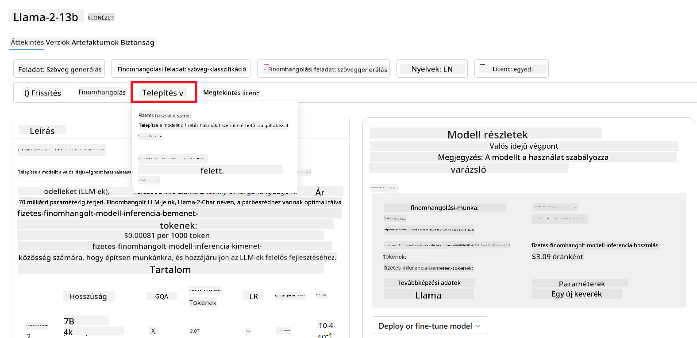
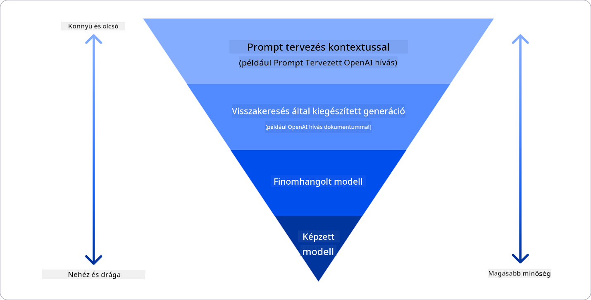

<!--
CO_OP_TRANSLATOR_METADATA:
{
  "original_hash": "e2f686f2eb794941761252ac5e8e090b",
  "translation_date": "2025-06-25T10:57:13+00:00",
  "source_file": "02-exploring-and-comparing-different-llms/README.md",
  "language_code": "hu"
}
-->
# Felfedezni és összehasonlítani különböző LLM-eket

> _Kattints a fenti képre a videó megtekintéséhez_

Az előző leckében láttuk, hogyan változtatja meg a Generatív AI a technológiai környezetet, hogyan működnek a Nagy Nyelvi Modellek (LLM-ek), és hogyan alkalmazhatja egy vállalkozás - mint a mi startupunk - ezeket a saját eseteire, hogy növekedjen! Ebben a fejezetben összehasonlítjuk a különböző típusú nagy nyelvi modelleket (LLM-eket), hogy megértsük azok előnyeit és hátrányait.

A következő lépés a startupunk útján az LLM-ek jelenlegi környezetének feltérképezése és annak megértése, melyek alkalmasak a mi esetünkre.

## Bevezetés

Ez a lecke az alábbiakat foglalja magában:

- Különböző típusú LLM-ek a jelenlegi környezetben.
- Különböző modellek tesztelése, iterálása és összehasonlítása az Azure-ban.
- Hogyan telepítsünk egy LLM-et.

## Tanulási célok

A lecke befejezése után képes leszel:

- Kiválasztani a megfelelő modellt a saját esetedhez.
- Megérteni, hogyan teszteld, iteráld és javítsd a modell teljesítményét.
- Tudni, hogyan telepítik a vállalkozások a modelleket.

## Különböző típusú LLM-ek megértése

Az LLM-eket többféleképpen lehet kategorizálni az architektúrájuk, a tanítási adataik és a használati esetük alapján. Ezeknek a különbségeknek a megértése segíteni fog a startupunknak a megfelelő modell kiválasztásában a szcenárióhoz, és megérteni, hogyan teszteljük, iteráljuk és javítsuk a teljesítményt.

Számos különböző típusú LLM modell létezik, a modell választása attól függ, hogy mire szeretnéd használni őket, milyen adatod van, mennyit vagy hajlandó fizetni és más tényezők.

Attól függően, hogy a modelleket szöveg, hang, videó, kép generálására stb. szeretnéd használni, különböző típusú modellt választhatsz.

- **Hang- és beszédfelismerés**. Erre a célra a Whisper-típusú modellek nagyszerű választás, mivel általános célúak és a beszédfelismerésre irányulnak. Különböző hangokra van kiképezve, és többnyelvű beszédfelismerést tud végrehajtani. Tudj meg többet a [Whisper típusú modellekről itt](https://platform.openai.com/docs/models/whisper?WT.mc_id=academic-105485-koreyst).

- **Kép generálás**. A kép generálásához a DALL-E és a Midjourney két nagyon ismert választás. A DALL-E az Azure OpenAI által kínált. [Olvass többet a DALL-E-ről itt](https://platform.openai.com/docs/models/dall-e?WT.mc_id=academic-105485-koreyst) és a tananyag 9. fejezetében is.

- **Szöveg generálás**. A legtöbb modell szöveg generálásra van kiképezve, és számos választási lehetőséged van a GPT-3.5-től a GPT-4-ig. Különböző költségekkel járnak, a GPT-4 a legdrágább. Érdemes megnézni az [Azure OpenAI játszóteret](https://oai.azure.com/portal/playground?WT.mc_id=academic-105485-koreyst), hogy értékelhesd, mely modellek felelnek meg legjobban az igényeidnek képességek és költségek szempontjából.

- **Multi-modality**. Ha többféle adatot szeretnél kezelni bemenetként és kimenetként, akkor érdemes megnézni olyan modelleket, mint a [gpt-4 turbo with vision vagy gpt-4o](https://learn.microsoft.com/azure/ai-services/openai/concepts/models#gpt-4-and-gpt-4-turbo-models?WT.mc_id=academic-105485-koreyst) - az OpenAI modellek legújabb kiadásai - amelyek képesek kombinálni a természetes nyelvi feldolgozást a vizuális megértéssel, lehetővé téve a többmodális interfészeken keresztüli interakciókat.

Egy modell kiválasztása alapvető képességeket biztosít, amelyek azonban nem biztos, hogy elegendőek. Gyakran van céges specifikus adat, amit valahogyan el kell mondani az LLM-nek. Van néhány különböző lehetőség arra, hogyan közelítsük meg ezt, erről bővebben az elkövetkező szakaszokban.

### Alapmodellek versus LLM-ek

Az Alapmodell kifejezést [Stanford kutatók alkották](https://arxiv.org/abs/2108.07258?WT.mc_id=academic-105485-koreyst) és úgy definiálták, mint egy AI modellt, amely követ néhány kritériumot, például:

- **Nem felügyelt tanulással vagy önfelügyelt tanulással van kiképezve**, ami azt jelenti, hogy címkézetlen többmodális adatokon van kiképezve, és nem igényel emberi annotációt vagy adatcímkézést a képzési folyamatához.
- **Nagyon nagy modellek**, nagyon mély neurális hálózatokon alapulnak, amelyek milliárd paramétereken vannak kiképezve.
- **Általában 'alapként' szolgálnak más modellek számára**, ami azt jelenti, hogy kiindulópontként használhatók más modellek építéséhez, amit finomhangolással lehet elvégezni.

A ChatGPT-t példaként véve, az első verzió megépítéséhez egy GPT-3.5 nevű modell szolgált alapmodellként. Ez azt jelenti, hogy az OpenAI chat-specifikus adatokat használt a GPT-3.5 egy hangolt verziójának létrehozásához, amely specializálódott a jól teljesítésre beszélgetési szcenáriókban, például chatbotokban.

### Nyílt forráskódú versus saját modellek

Az LLM-ek másik kategorizálási módja, hogy nyílt forráskódúak vagy saját tulajdonúak.

Nyílt forráskódú modellek azok, amelyeket a nyilvánosság számára tesznek elérhetővé, és bárki használhatja őket. Gyakran a létrehozó vállalat vagy a kutatói közösség teszi elérhetővé őket. Ezek a modellek lehetővé teszik, hogy különböző LLM-esetekhez vizsgálják, módosítsák és testreszabják őket. Azonban nem mindig optimalizáltak a termelési használatra, és nem biztos, hogy olyan teljesítményűek, mint a saját modellek. Továbbá, a nyílt forráskódú modellek finanszírozása korlátozott lehet, és nem biztos, hogy hosszú távon karbantartják őket, vagy nem biztos, hogy frissítik őket a legújabb kutatásokkal. Népszerű nyílt forráskódú modellek példái közé tartozik az [Alpaca](https://crfm.stanford.edu/2023/03/13/alpaca.html?WT.mc_id=academic-105485-koreyst), [Bloom](https://huggingface.co/bigscience/bloom) és [LLaMA](https://llama.meta.com).

Saját modellek azok, amelyeket egy vállalat birtokol, és nem teszik elérhetővé a nyilvánosság számára. Ezek a modellek gyakran optimalizáltak a termelési használatra. Azonban nem engedik meg a vizsgálatot, módosítást vagy testreszabást különböző használati esetekre. Továbbá, nem mindig érhetők el ingyenesen, és előfizetést vagy fizetést igényelhetnek a használathoz. Emellett a felhasználók nem rendelkeznek azzal a kontrollal az adatok felett, amelyeket a modell képzéséhez használnak, ami azt jelenti, hogy a modell tulajdonosára kell bízniuk az adatvédelem és a felelős AI használatának biztosítását. Népszerű saját modellek példái közé tartozik az [OpenAI modellek](https://platform.openai.com/docs/models/overview?WT.mc_id=academic-105485-koreyst), [Google Bard](https://sapling.ai/llm/bard?WT.mc_id=academic-105485-koreyst) vagy [Claude 2](https://www.anthropic.com/index/claude-2?WT.mc_id=academic-105485-koreyst).

### Beágyazás versus kép generálás versus szöveg és kód generálás

Az LLM-eket az általuk generált kimenet alapján is kategorizálhatjuk.

A beágyazások olyan modellek halmaza, amelyek szöveget numerikus formává, azaz beágyazássá tudnak alakítani, amely a bemeneti szöveg numerikus reprezentációja. A beágyazások megkönnyítik a gépek számára a szavak vagy mondatok közötti kapcsolatok megértését, és más modellek bemeneteként is felhasználhatók, mint például osztályozási modellek vagy klaszterezési modellek, amelyek jobban teljesítenek numerikus adatokon. A beágyazási modelleket gyakran használják átviteli tanulásra, ahol egy modellt építenek egy helyettesítő feladatra, amelyhez bőséges adat áll rendelkezésre, majd a modell súlyait (beágyazásokat) újrafelhasználják más utólagos feladatokhoz. Ennek a kategóriának a példája az [OpenAI beágyazások](https://platform.openai.com/docs/models/embeddings?WT.mc_id=academic-105485-koreyst).

A kép generálás modellek képeket generálnak. Ezeket a modelleket gyakran használják kép szerkesztésre, kép szintézisre és kép fordításra. A kép generálás modelleket gyakran nagy képadatbázisokon képezik, mint például a [LAION-5B](https://laion.ai/blog/laion-5b/?WT.mc_id=academic-105485-koreyst), és új képek generálására vagy meglévő képek szerkesztésére használhatók inpainting, szuperfelbontás és színezési technikákkal. Példák közé tartozik a [DALL-E-3](https://openai.com/dall-e-3?WT.mc_id=academic-105485-koreyst) és a [Stable Diffusion modellek](https://github.com/Stability-AI/StableDiffusion?WT.mc_id=academic-105485-koreyst).

A szöveg és kód generálás modellek szöveget vagy kódot generálnak. Ezeket a modelleket gyakran használják szöveg összefoglalásra, fordításra és kérdések megválaszolására. A szöveg generálás modelleket gyakran nagy szöveges adatbázisokon képezik, mint például a [BookCorpus](https://www.cv-foundation.org/openaccess/content_iccv_2015/html/Zhu_Aligning_Books_and_ICCV_2015_paper.html?WT.mc_id=academic-105485-koreyst), és új szöveg generálására vagy kérdések megválaszolására használhatók. A kód generálás modellek, mint például a [CodeParrot](https://huggingface.co/codeparrot?WT.mc_id=academic-105485-koreyst), gyakran nagy kód adatbázisokon képezik, mint például a GitHub, és új kód generálására vagy meglévő kód hibáinak javítására használhatók.

### Encoder-Decoder versus csak Decoder

Az LLM-ek különböző típusú architektúráiról beszélve használjunk egy analógiát.

Képzeld el, hogy a menedzsered feladatot adott neked egy kvíz megírására a diákok számára. Két kollégád van; az egyik a tartalom létrehozásáért, a másik a tartalom átnézéséért felelős.

A tartalomkészítő olyan, mint egy csak Decoder modell, meg tudja nézni a témát és látja, mit írtál már, majd ez alapján tud egy kurzust írni. Nagyon jók az érdekes és informatív tartalom írásában, de nem nagyon értik a témát és a tanulási célokat. Néhány példa a Decoder modellekre a GPT család modellek, mint például a GPT-3.

A lektor olyan, mint egy csak Encoder modell, megvizsgálja az írt kurzust és a válaszokat, észreveszi a kapcsolatot közöttük és megérti a kontextust, de nem jó a tartalom generálásban. Egy példa az Encoder modellekre a BERT.

Képzeld el, hogy van valaki, aki tudna kvízt készíteni és átnézni is, ez egy Encoder-Decoder modell. Néhány példa a BART és T5.

### Szolgáltatás versus Modell

Most beszéljünk a különbségről egy szolgáltatás és egy modell között. Egy szolgáltatás egy termék, amelyet egy Felhő Szolgáltató kínál, és gyakran modellek, adatok és más összetevők kombinációja. Egy modell a szolgáltatás központi összetevője, és gyakran egy alapmodell, mint egy LLM.

A szolgáltatások gyakran optimalizáltak a termelési használatra, és gyakran könnyebben használhatók, mint a modellek, grafikus felhasználói felületen keresztül. Azonban a szolgáltatások nem mindig érhetők el ingyenesen, és előfizetést vagy fizetést igényelhetnek a használathoz, cserébe a szolgáltatás tulajdonosának eszközeinek és erőforrásainak kihasználásáért, a költségek optimalizálásáért és a könnyű skálázásért. Egy példa egy szolgáltatásra az [Azure OpenAI Service](https://learn.microsoft.com/azure/ai-services/openai/overview?WT.mc_id=academic-105485-koreyst), amely pay-as-you-go díjtervet kínál, ami azt jelenti, hogy a felhasználókat arányosan terhelik az alapján, hogy mennyit használnak a szolgáltatást. Emellett az Azure OpenAI Service vállalati szintű biztonságot és felelős AI keretrendszert kínál a modellek képességei felett.

A modellek csak a Neurális Hálózat, a paraméterekkel, súlyokkal és másokkal. Lehetővé teszik a vállalatok számára, hogy helyben futtassák, azonban eszközöket kell vásárolniuk, struktúrát kell építeniük a skálázáshoz és licencet kell vásárolniuk, vagy nyílt forráskódú modellt kell használniuk. Egy modell, mint a LLaMA elérhető a használatra, számítógépes erőforrást igényelve a modell futtatásához.

## Hogyan teszteljünk és iteráljunk különböző modellekkel az Azure-ban a teljesítmény megértéséhez

Miután csapatunk feltérképezte az LLM-ek jelenlegi környezetét és azonosított néhány jó jelöltet a szcenárióikhoz, a következő lépés az, hogy teszteljük őket az adatainkon és a munkaterhelésünkön. Ez egy iteratív folyamat, amely kísérletekkel és mérésekkel történik.
A legtöbb modell, amit az előző bekezdésekben említettünk (OpenAI modellek, nyílt forráskódú modellek, mint a Llama2, és Hugging Face transzformerek) elérhetők a [Model Catalog](https://learn.microsoft.com/azure/ai-studio/how-to/model-catalog-overview?WT.mc_id=academic-105485-koreyst) az [Azure AI Studio](https://ai.azure.com/?WT.mc_id=academic-105485-koreyst) keretében.

Az [Azure AI Studio](https://learn.microsoft.com/azure/ai-studio/what-is-ai-studio?WT.mc_id=academic-105485-koreyst) egy Felhő Platform, amelyet fejlesztők számára terveztek generatív AI alkalmazások építésére és a teljes fejlesztési életciklus kezelésére - a kísérletezéstől az értékelésig - az összes Azure AI szolgáltatás egyetlen központba való kombinálásával, egy praktikus GUI-val. Az Azure AI Studio
- Hasonlítsa össze az iparágban elérhető modelleket és adathalmazokat a [Model Benchmarks](https://learn.microsoft.com/azure/ai-studio/how-to/model-benchmarks?WT.mc_id=academic-105485-koreyst) panelen keresztül, hogy felmérje, melyik felel meg a üzleti forgatókönyvnek.

- Finomhangolja a modellt egyedi képzési adatokkal, hogy javítsa a modell teljesítményét egy adott munkaterhelésben, kihasználva az Azure AI Studio kísérleti és nyomkövetési képességeit.

- Telepítse az eredeti előre betanított modellt vagy a finomhangolt verziót távoli valós idejű következtetésre - kezelt számítógépre - vagy szerver nélküli api végpontra - [fizessen használat szerint](https://learn.microsoft.com/azure/ai-studio/how-to/model-catalog-overview#model-deployment-managed-compute-and-serverless-api-pay-as-you-go?WT.mc_id=academic-105485-koreyst) - hogy lehetővé tegye az alkalmazások számára annak fogyasztását.

> [!NOTE]
> A katalógusban szereplő modellek közül nem mindegyik érhető el jelenleg finomhangolásra és/vagy fizetés használat szerint telepítésre. Ellenőrizze a modell kártyáját a modell képességeinek és korlátainak részleteiről.

## Az LLM eredmények javítása

Startup csapatunkkal különféle LLM-eket és egy felhőplatformot (Azure Machine Learning) vizsgáltunk meg, amelyek lehetővé teszik számunkra, hogy különböző modelleket hasonlítsunk össze, tesztadatokon értékeljük őket, javítsuk a teljesítményt, és telepítsük őket következtetési végpontokra.

De mikor érdemes a modellt finomhangolni az előre betanított helyett? Vannak más megközelítések a modell teljesítményének javítására specifikus munkaterheléseknél?

Számos megközelítés létezik, amelyet egy vállalkozás használhat az LLM-ből származó eredmények elérésére. Különböző típusú modelleket választhat különböző képzési fokozatokkal, amikor LLM-et telepít a termelésbe, különböző összetettségi, költség- és minőségi szintekkel. Íme néhány különböző megközelítés:

- **Prompt engineering kontextussal**. Az ötlet az, hogy elegendő kontextust biztosítson a kérdés feltevésekor, hogy biztosítsa a szükséges válaszok megszerzését.

- **Retrieval Augmented Generation, RAG**. Az adatai például egy adatbázisban vagy webes végponton létezhetnek, hogy biztosítsa, hogy ezek az adatok, vagy azok egy részhalmaza szerepeljen a kérdés feltevésekor, lekérheti a releváns adatokat, és azokat a felhasználó kérésének részévé teheti.

- **Finomhangolt modell**. Itt tovább képezte a modellt a saját adataival, ami a modell pontosabbá és az igényeire reagálóbbá vált, de költséges lehet.

Kép forrása: [Négy mód, ahogyan a vállalatok LLM-eket telepítenek | Fiddler AI Blog](https://www.fiddler.ai/blog/four-ways-that-enterprises-deploy-llms?WT.mc_id=academic-105485-koreyst)

### Prompt Engineering kontextussal

Az előre betanított LLM-ek nagyon jól működnek általánosított természetes nyelvi feladatokon, még akkor is, ha rövid kérdéssel hívják meg őket, például egy befejezendő mondattal vagy kérdéssel – az úgynevezett "zero-shot" tanulás.

Azonban minél inkább képes a felhasználó keretbe foglalni kérdését, részletes kéréssel és példákkal – a kontextussal –, annál pontosabb és a felhasználó elvárásaihoz közelebb álló lesz a válasz. Ebben az esetben "one-shot" tanulásról beszélünk, ha a kérés csak egy példát tartalmaz, és "few-shot" tanulásról, ha több példát is tartalmaz. A prompt engineering kontextussal a legköltséghatékonyabb megközelítés a kezdéshez.

### Retrieval Augmented Generation (RAG)

Az LLM-eknek az a korlátja, hogy csak azokat az adatokat tudják felhasználni, amelyeket a képzésük során használtak, hogy választ generáljanak. Ez azt jelenti, hogy nem tudnak semmit azokról a tényekről, amelyek a képzési folyamatuk után történtek, és nem férhetnek hozzá nem nyilvános információkhoz (mint például vállalati adatok).
Ezt a korlátot RAG segítségével lehet áthidalni, egy technikával, amely külső adatokkal bővíti a kérdést dokumentumok darabjaival, figyelembe véve a kérdés hosszhatárát. Ezt támogatják a vektor adatbázis eszközök (mint például az [Azure Vector Search](https://learn.microsoft.com/azure/search/vector-search-overview?WT.mc_id=academic-105485-koreyst)), amelyek a hasznos darabokat különböző előre meghatározott adatforrásokból lekérik, és hozzáadják a kérdés kontextusához.

Ez a technika nagyon hasznos, amikor egy vállalkozásnak nincs elegendő adata, ideje vagy erőforrása, hogy finomhangoljon egy LLM-et, de mégis szeretné javítani a teljesítményt egy specifikus munkaterhelésben, és csökkenteni a hamisítások kockázatát, azaz a valóság vagy káros tartalom elferdítését.

### Finomhangolt modell

A finomhangolás egy olyan folyamat, amely a transzfer tanulást használja a modell „adaptálására” egy downstream feladatra vagy egy specifikus probléma megoldására. Eltérően a few-shot tanulástól és a RAG-tól, egy új modell generálását eredményezi, frissített súlyokkal és torzításokkal. Egy olyan képzési példakészletet igényel, amely egyetlen bemenetből (a kérdés) és a hozzá tartozó kimenetből (a befejezés) áll.
Ez lenne az előnyben részesített megközelítés, ha:

- **Finomhangolt modellek használata**. Egy vállalkozás szeretne finomhangolt kevésbé képes modelleket (mint például beágyazó modelleket) használni a nagy teljesítményű modellek helyett, ami költséghatékonyabb és gyorsabb megoldást eredményez.

- **Késleltetés figyelembevétele**. A késleltetés fontos egy adott használati esetben, így nem lehetséges nagyon hosszú kérdéseket használni, vagy a modellel megtanulandó példák száma nem fér el a kérdés hosszhatárán belül.

- **Naprakész maradás**. Egy vállalkozásnak sok kiváló minőségű adata és valós címkéje van, valamint az erőforrások, amelyek szükségesek ahhoz, hogy ezeket az adatokat idővel naprakészen tartsa.

### Betanított modell

Egy LLM nulláról való betanítása kétségtelenül a legnehezebb és legösszetettebb megközelítés, amely hatalmas mennyiségű adatot, képzett erőforrásokat és megfelelő számítási teljesítményt igényel. Ezt az opciót csak akkor érdemes megfontolni, ha egy vállalkozásnak van egy domain-specifikus használati esete és nagy mennyiségű domain-centrikus adata.

## Tudás ellenőrzése

Mi lehet egy jó megközelítés az LLM befejezési eredmények javítására?

1. Prompt engineering kontextussal
1. RAG
1. Finomhangolt modell

A:3, ha van ideje és erőforrásai, valamint kiváló minőségű adatai, a finomhangolás a jobb opció, hogy naprakész maradjon. Azonban, ha a javításon gondolkodik és nincs ideje, érdemes először a RAG-ot fontolóra venni.

## 🚀 Kihívás

Olvasson többet arról, hogyan használhatja a [RAG-ot](https://learn.microsoft.com/azure/search/retrieval-augmented-generation-overview?WT.mc_id=academic-105485-koreyst) az üzletében.

## Nagyszerű munka, folytassa a tanulást

Miután befejezte ezt a leckét, nézze meg a [Generative AI Learning gyűjteményünket](https://aka.ms/genai-collection?WT.mc_id=academic-105485-koreyst), hogy tovább növelje Generative AI ismereteit!

Lépjen tovább a 3. leckére, ahol megvizsgáljuk, hogyan lehet [felelősségteljesen építeni a Generative AI-val](../03-using-generative-ai-responsibly/README.md?WT.mc_id=academic-105485-koreyst)!

**Jogi nyilatkozat**:  
Ezt a dokumentumot az AI fordítási szolgáltatás, a [Co-op Translator](https://github.com/Azure/co-op-translator) segítségével fordították le. Bár törekszünk a pontosságra, kérjük, vegye figyelembe, hogy az automatikus fordítások hibákat vagy pontatlanságokat tartalmazhatnak. Az eredeti dokumentum az eredeti nyelvén tekintendő hiteles forrásnak. Kritikus információk esetén javasolt a professzionális emberi fordítás igénybevétele. Nem vállalunk felelősséget a fordítás használatából eredő félreértésekért vagy félremagyarázásokért.