# Különböző LLM-ek felfedezése és összehasonlítása

[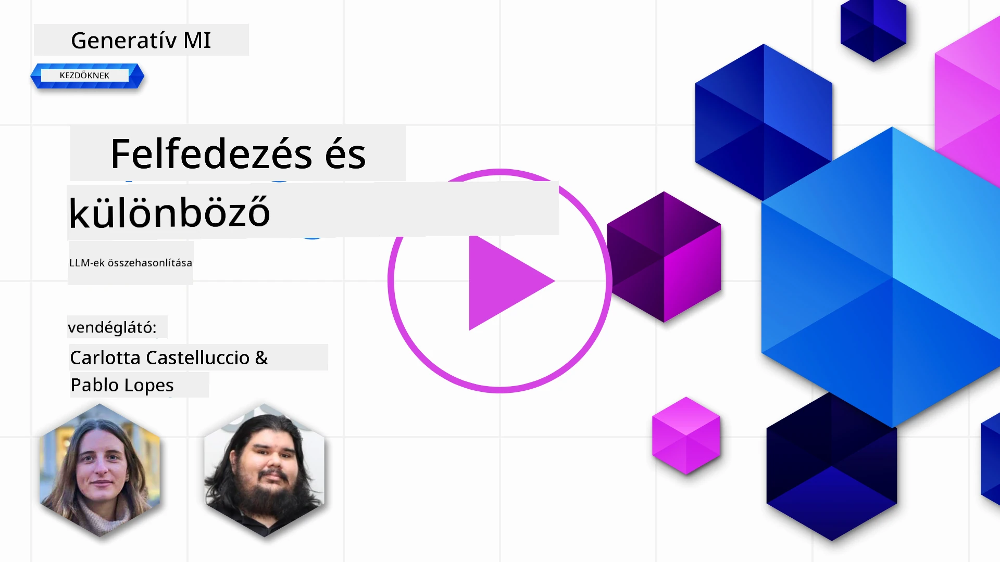](https://youtu.be/KIRUeDKscfI?si=8BHX1zvwzQBn-PlK)

> _A videó megtekintéséhez kattints a fenti képre_

Az előző leckében már láttuk, hogyan változtatja meg a Generatív MI a technológiai tájat, hogyan működnek a Nagy Nyelvi Modellek (LLM-ek), és hogyan alkalmazhatja egy vállalkozás – mint például a mi startupunk – ezeket az esetükre, hogy növekedjen! Ebben a fejezetben különféle nagy nyelvi modelleket (LLM-eket) fogunk összehasonlítani és összevetni, hogy megértsük az előnyeiket és hátrányaikat.

A startupunk következő lépése az LLM-ek jelenlegi tájképének felfedezése és annak megértése, hogy melyek alkalmasak a használati esetünkhöz.

## Bevezetés

Ez a lecke a következőket tartalmazza:

- Különböző típusú LLM-ek a jelenlegi tájképen.
- Különböző modellek tesztelése, iterálása és összehasonlítása az Azure-ban az adott használati esethez.
- Hogyan telepítsünk LLM-et.

## Tanulási célok

A lecke elvégzése után képes leszel:

- Kiválasztani a megfelelő modellt az adott használati esetre.
- Megérteni, hogyan kell tesztelni, iterálni és javítani a modell teljesítményét.
- Tudni, hogyan telepítenek modelleket a vállalkozások.

## A különböző LLM-típusok megértése

Az LLM-ek többféleképpen kategorizálhatók az architektúrájuk, a tanító adatok és a használati eset alapján. E különbségek megértése segít a startupunknak a megfelelő modell kiválasztásában, valamint abban, hogyan kell tesztelni, iterálni és javítani a teljesítményt.

Sokféle LLM modell létezik, a modellválasztás attól függ, mire szeretnéd használni őket, milyen adataid vannak, mennyit vagy hajlandó fizetni, és egyéb tényezők.

Attól függően, hogy szöveg, hang, videó, kép generálására szeretnéd használni a modelleket, más típusú modellt választhatsz.

- **Hang- és beszédfelismerés**. A Whisper-stílusú modellek még mindig hasznosak általános beszédfelismerésre, de a termelési választások között most már újabb beszéd-szöveg modellek is szerepelnek, mint például a `gpt-4o-transcribe`, `gpt-4o-mini-transcribe` és a beszélőtér-időzítéses (diarizációs) változatok. Értékeld a nyelvi lefedettséget, diarizációt, valós idejű támogatást, késleltetést és költséget az esetedhez. Tudj meg többet az [OpenAI beszéd-szöveg dokumentációjában](https://platform.openai.com/docs/guides/speech-to-text?WT.mc_id=academic-105485-koreyst).

- **Képalkotás**. A DALL-E és a Midjourney ismert képalkotó megoldások, de az aktuális OpenAI kép-API-k főként GPT Image modellekre, mint a `gpt-image-2` középpontúak, miközben a Stable Diffusion, Imagen, Flux és más modellcsaládok is gyakori választások. Hasonlítsd össze a prompt hűségét, szerkesztési támogatást, stílusvezérlést, biztonsági követelményeket és licencelést. Tudj meg többet az [OpenAI képalkotó útmutatójában](https://platform.openai.com/docs/guides/images?WT.mc_id=academic-105485-koreyst) és a tananyag 9. fejezetében.

- **Szöveggenerálás**. A szövegmodellek jelenleg frontier modelleket, érvelő modelleket, kisebb késleltetésű modelleket, nyílt súlyú modelleket is magukban foglalnak. Aktuális példák az OpenAI GPT-5.x modellek, a Anthropic Claude 4.x modellek, Google Gemini 3.x modellek, Meta Llama 4 modellek és Mistral modellek. Ne csak a megjelenési dátum vagy ár alapján válassz; hasonlítsd össze a feladatminőséget, késleltetést, kontextusablakot, eszközhasználatot, biztonsági viselkedést, regionális elérhetőséget és teljes költséget. A [Microsoft Foundry modell katalógus](https://ai.azure.com/catalog?WT.mc_id=academic-105485-koreyst) jó hely az Azure-on elérhető modellek összehasonlítására.

- **Multimodalitás**. Sok jelenlegi modell többféle bemenetet tud feldolgozni, nem csak szöveget. Egyesek képet, hangot vagy videót fogadnak; némelyek eszközöket is hívhatnak; és speciális modellek képeket, hangot vagy videót is generálhatnak. Például a jelenlegi OpenAI modellek támogatják a szöveg- és képbemenetet, a Gemini modellek a variánstól függően szöveg, kód, kép, hang és videó bemenetet támogatnak, az Llama 4 Scout és Maverick pedig nyílt súlyú natív multimodális modellek. Mindig ellenőrizd minden modell adatlapját a támogatott bemeneti és kimeneti modalitásokra vonatkozóan, mielőtt munkafolyamatot építenél köréjük.

Egy modell kiválasztásakor kapsz alapvető képességeket, amelyek néha nem elegendőek. Gyakran rendelkezel cégspecifikus adatokkal, amiket valahogy el kell juttatni az LLM-hez. Többféle megközelítés létezik erre, ezekről többet a következő szakaszokban.

### Alap-modellek versus LLM-ek

Az Alapmodell (Foundation Model) kifejezést [Stanford kutatók alkották meg](https://arxiv.org/abs/2108.07258?WT.mc_id=academic-105485-koreyst), és olyan MI-modellekként definiálták, amelyek bizonyos kritériumokat követnek, mint például:

- **Önfelügyelt vagy önfelügyeletes tanulással kerülnek betanításra**, vagyis címkézetlen multimodális adatokat használnak, és emberi annotáció vagy címkézés nem szükséges a betanítás során.
- **Nagyon nagy modellek**, mély neurális hálózatok alapján, milliárdnyi paraméterrel.
- **Általában 'alapkövként' szolgálnak más modellekhez**, vagyis kiindulási pontként használhatók más modellek építésére, finomhangolással.

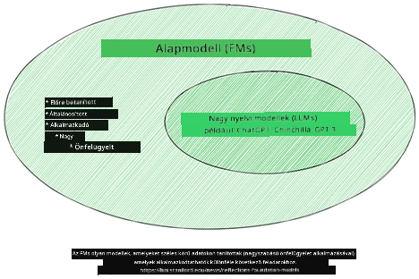

Kép forrása: [Essential Guide to Foundation Models and Large Language Models | by Babar M Bhatti | Medium
](https://thebabar.medium.com/essential-guide-to-foundation-models-and-large-language-models-27dab58f7404)

Hogy jobban megértsük ezt a különbséget, vegyük példaként a ChatGPT-t történelmi kontextusban. A ChatGPT korai verziói a GPT-3.5 alapmodellre épültek. Az OpenAI ezt követően chat-specifikus adatokat és igazítási technikákat használt egy hangolt verzió létrehozásához, ami jobb teljesítményt mutatott beszélgetési helyzetekben, például chatbotoknál. A korszerű MI szolgáltatások gyakran több modellváltozaton keresztül irányítanak, ezért a szolgáltatás neve és az alapul szolgáló modell neve nem mindig ugyanaz.

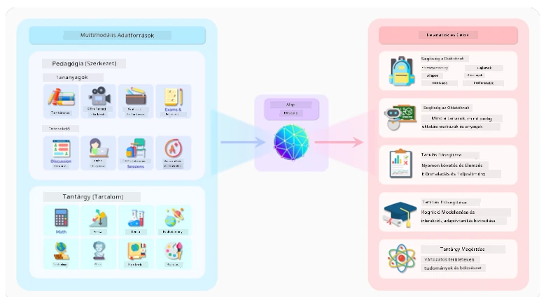

Kép forrása: [2108.07258.pdf (arxiv.org)](https://arxiv.org/pdf/2108.07258.pdf?WT.mc_id=academic-105485-koreyst)

### Nyílt-súlyú/nyílt-forráskódú versus Proprietáris modellek

Egy másik LLM-kategorizálási módszer, hogy nyílt-súlyú, nyílt forráskódú vagy kizárólagos (proprietáris) modellekről beszélünk.

A nyílt forráskódú és nyílt súlyú modellek elérhetővé teszik a modell artefaktumaikat megtekintésre, letöltésre vagy testreszabásra, bár licencük eltérő lehet. Egyesek teljesen nyílt forráskódúak, míg mások nyílt súlyú modellek felhasználási korlátozásokkal. Ezek hasznosak lehetnek, ha egy vállalkozás nagyobb ellenőrzést szeretne a telepítés, az adathely, a költségek vagy az egyedi igények felett. Azonban a csapatnak továbbra is át kell tekintenie a licencfeltételeket, a működtetési költségeket, a karbantartást, a biztonsági frissítéseket és az értékelési minőséget, mielőtt gyártási környezetben használná őket. Példák: [Meta Llama 4](https://ai.meta.com/blog/llama-4-multimodal-intelligence/?WT.mc_id=academic-105485-koreyst), néhány [Mistral modell](https://docs.mistral.ai/models/overview?WT.mc_id=academic-105485-koreyst) és számos modell a [Hugging Face](https://huggingface.co/models?WT.mc_id=academic-105485-koreyst) platformon.

A kizárólagos (proprietáris) modellek egy szolgáltató tulajdonában vannak és általa hosztoltak. Ezek a modellek gyakran optimalizáltak menedzselt termelési használatra, erős támogatást, biztonsági rendszereket, eszközintegrációt és skálázhatóságot kínálnak. Az ügyfelek általában nem tekinthetik meg vagy módosíthatják a modell súlyokat, és át kell tekinteniük a szolgáltató adatvédelmi, megőrzési, megfelelőségi feltételeit, illetve az elfogadható használati szabályokat. Példák: [OpenAI modellek](https://platform.openai.com/docs/models?WT.mc_id=academic-105485-koreyst), [Google Gemini](https://deepmind.google/models/gemini/pro/?WT.mc_id=academic-105485-koreyst) és [Anthropic Claude](https://platform.claude.com/docs/en/about-claude/models/overview?WT.mc_id=academic-105485-koreyst).

### Beágyazás, képalkotás, szöveg- és kód generálás

Az LLM-ek szintén kategorizálhatók az alapján, milyen kimenetet generálnak.

A beágyazások olyan modellek csoportja, amelyek képesek szöveget numerikus formára, ún. beágyazásra alakítani, ami a bemeneti szöveg numerikus reprezentációja. A beágyazások megkönnyítik a gépek számára a szavak vagy mondatok közötti kapcsolatok megértését, és más modellek bemeneteként szolgálhatnak, például osztályozó vagy klaszterező modellekként, amelyek jobban teljesítenek numerikus adatokon. A beágyazó modelleket gyakran használják transzfer-tanulásra, ahol egy modellt egy segédfeladatra képeznek ki, amelyhez bőség adatok állnak rendelkezésre, majd a modell súlyait (beágyazásokat) újrahasznosítják más, alárendelt feladatokra. Példa erre a kategóriára az [OpenAI beágyazások](https://platform.openai.com/docs/models/embeddings?WT.mc_id=academic-105485-koreyst).

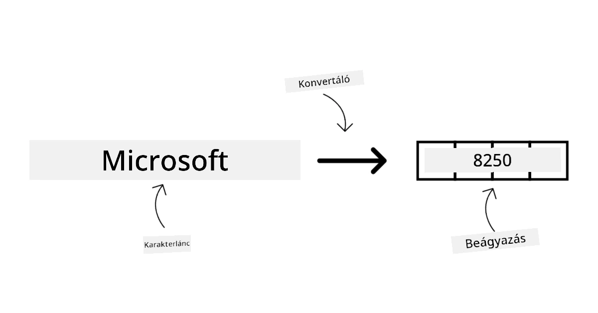

A képalkotó modellek képek generálására alkalmas modellek. Ezeket gyakran használják kép szerkesztésére, kép szintézisre és kép fordításra. Ezek a modellek nagy kép adatbázisokon vannak betanítva, mint például a [LAION-5B](https://laion.ai/blog/laion-5b/?WT.mc_id=academic-105485-koreyst), és képesek új képeket generálni vagy meglévő képeket szerkeszteni inpainting, felbontásnövelés és színezés technikákkal. Példák: [GPT Image modellek](https://platform.openai.com/docs/guides/images?WT.mc_id=academic-105485-koreyst), [Stable Diffusion modellek](https://github.com/Stability-AI/StableDiffusion?WT.mc_id=academic-105485-koreyst) és Imagen modellek.

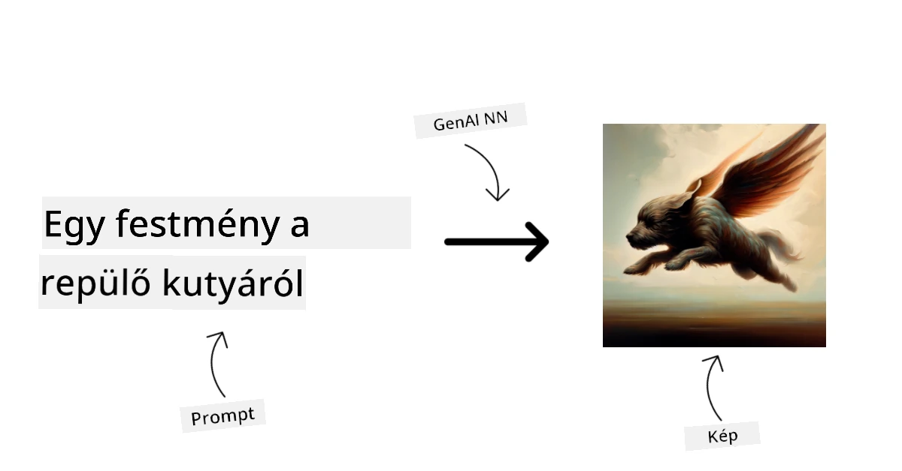

A szöveg- és kód generáló modellek képesek szöveget vagy kódot generálni. Ezeket gyakran használják szöveg összefoglalásra, fordításra és kérdés-válasz feladatokra. A szöveggeneráló modelleket nagy szöveg adatbázisokon tanították, például [BookCorpus](https://www.cv-foundation.org/openaccess/content_iccv_2015/html/Zhu_Aligning_Books_and_ICCV_2015_paper.html?WT.mc_id=academic-105485-koreyst), és új szövegek generálására vagy kérdések megválaszolására használhatók. A kódgeneráló modelleket, mint például a [CodeParrot](https://huggingface.co/codeparrot?WT.mc_id=academic-105485-koreyst), nagyméretű kód adatbázisokon, például GitHub-on tanították, és új kód generálására vagy meglévő kód hibáinak javítására alkalmasak.

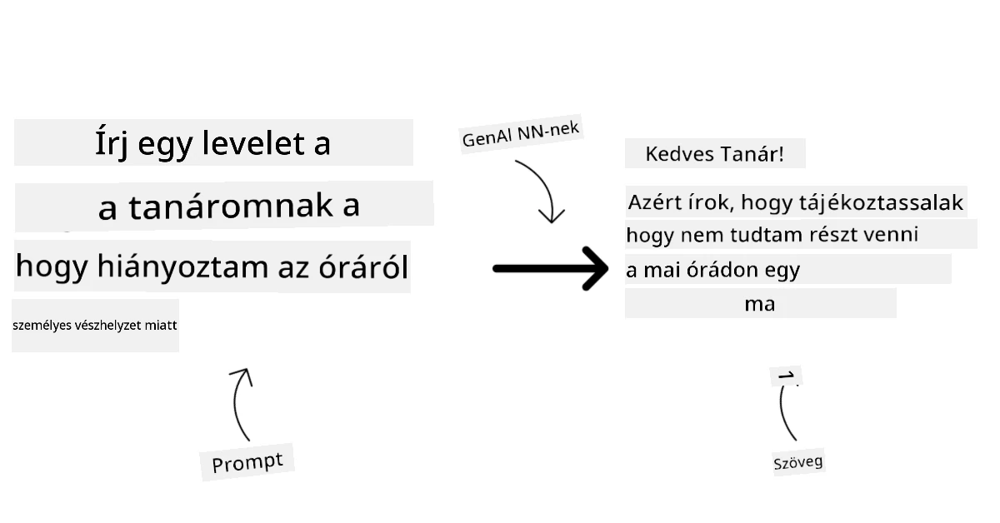

### Encoder-Decoder versus csak Decoder

Hogy beszéljünk az LLM-ek különböző architektúráiról, használjunk egy analógiát.

Képzeld el, hogy a vezetőd feladatot adott neked egy diákok számára írandó kvíz elkészítésére. Két kollégád van; az egyik a tartalom létrehozásáért felel, a másik a tartalom átnézéséért.

A tartalomgyártó olyan, mint a csak Decoder modell: megnézi a témát, látja, mit írtál, majd folytatja a tartalom generálását ennek a kontextusnak alapján. Nagyon jók az érdekes és informatív tartalom írásában, de nem mindig a legjobb választás, ha csak osztályozni, visszakeresni vagy kódolni kell az információt. Példák csak Decoder modellcsaládokra: GPT és Llama modellek.

Az átnéző a csak Encoder modellhez hasonlít: átnézi a megírt anyagot és a válaszokat, észleli köztük a kapcsolatot, érti a kontextust, de nem jó tartalom generálásában. Példa csak Encoder modellre a BERT.

Képzeld el, hogy van valaki, aki egyszerre készíti és ellenőrzi is a kvízt, ez az Encoder-Decoder modell. Példák erre a BART és T5.

### Szolgáltatás vagy modell

Beszéljünk most arról a különbségről, hogy mi a szolgáltatás és mi a modell. A szolgáltatás egy termék, amelyet egy felhőszolgáltató kínál, és általában modellek, adatok és egyéb összetevők kombinációja. A modell a szolgáltatás magja, gyakran alapmodell, például LLM.

A szolgáltatásokat gyakran gyártásra optimalizálják, és általában egyszerűbb használni, mint a modelleket, grafikus kezelőfelületen keresztül. Azonban a szolgáltatások nem mindig ingyenesek, és előfizetést vagy díjat igényelhetnek, hogy a felhasználók hozzáférhessenek a szolgáltatás tulajdonosának eszközeihez, erőforrásaihoz, optimalizálva a költségeket és könnyen skálázódva. Példa szolgáltatásra az [Azure OpenAI Service](https://learn.microsoft.com/azure/ai-foundry/openai/overview?WT.mc_id=academic-105485-koreyst), amely díjfizetés-alapú árképzést kínál, azaz a felhasználó arányosan fizet az általa használt szolgáltatásért. Az Azure OpenAI Service vállalati szintű biztonságot és felelős MI keretrendszert is kínál a modellek képességei mellett.

A modellek neurális hálózati artefaktumok: paraméterek, súlyok, architektúra, tokenizáló és egyéb konfigurációk. A modell futtatása helyben vagy privát környezetben megfelelő hardvert, kiszolgáló infrastruktúrát, monitorozást, illetve kompatibilis nyílt forráskódú/nyílt súlyú licencet vagy kereskedelmi licencet igényel. Nyílt súlyú modellek, mint a Llama 4 vagy Mistral modellek önálló hosztolhatók, de számítási teljesítményre és üzemeltetési szakértelemre továbbra is szükség van.

## Hogyan teszteljük és iteráljunk különböző modellekkel a teljesítmény megértéséhez az Azure-ban

Miután csapatunk feltérképezte a jelenlegi LLM-ek (nagyméretű nyelvi modellek) kínálatát és kiválasztott néhány jó jelöltet a saját szcenárióikhoz, a következő lépés az, hogy teszteljük őket a saját adataikon és munkaterhelésükön. Ez egy iteratív folyamat, amely kísérletezéssel és mérésekkel történik.
A korábbi bekezdésekben említett legtöbb modell (OpenAI modellek, nyílt súlyú modellek, mint a Llama 4 és Mistral, valamint a Hugging Face modellek) elérhetőek a [Microsoft Foundry Models](https://learn.microsoft.com/azure/foundry/concepts/foundry-models-overview?WT.mc_id=academic-105485-koreyst) platformon.

A [Microsoft Foundry](https://learn.microsoft.com/azure/foundry/what-is-foundry?WT.mc_id=academic-105485-koreyst), korábban Azure AI Studio/Azure AI Foundry néven ismert, egy egységes Azure platform AI alkalmazások és ügynökök építésére. Segíti a fejlesztőket a teljes életciklus kezelésében az kísérletezéstől és értékeléstől kezdve a telepítésen, monitorozáson és irányításon át. A Microsoft Foundry modell katalógusa lehetővé teszi, hogy a felhasználó:

- Megtalálja az érdeklődési körébe tartozó alapmodellt a katalógusban, beleértve az Azure által értékesített modelleket, valamint partnerek és közösségi szolgáltatók modelljeit. A felhasználók szűrhetnek feladat, szolgáltató, licenc, telepítési opció vagy név alapján.

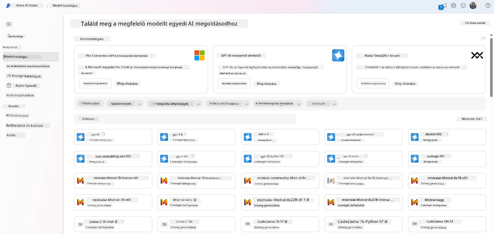

- Áttekintheti a modellkártyát, amely tartalmazza a részletes leírást a várható felhasználásról és a tanító adatokról, kód mintákat és a belső értékelési könyvtárban elvégzett értékelési eredményeket.

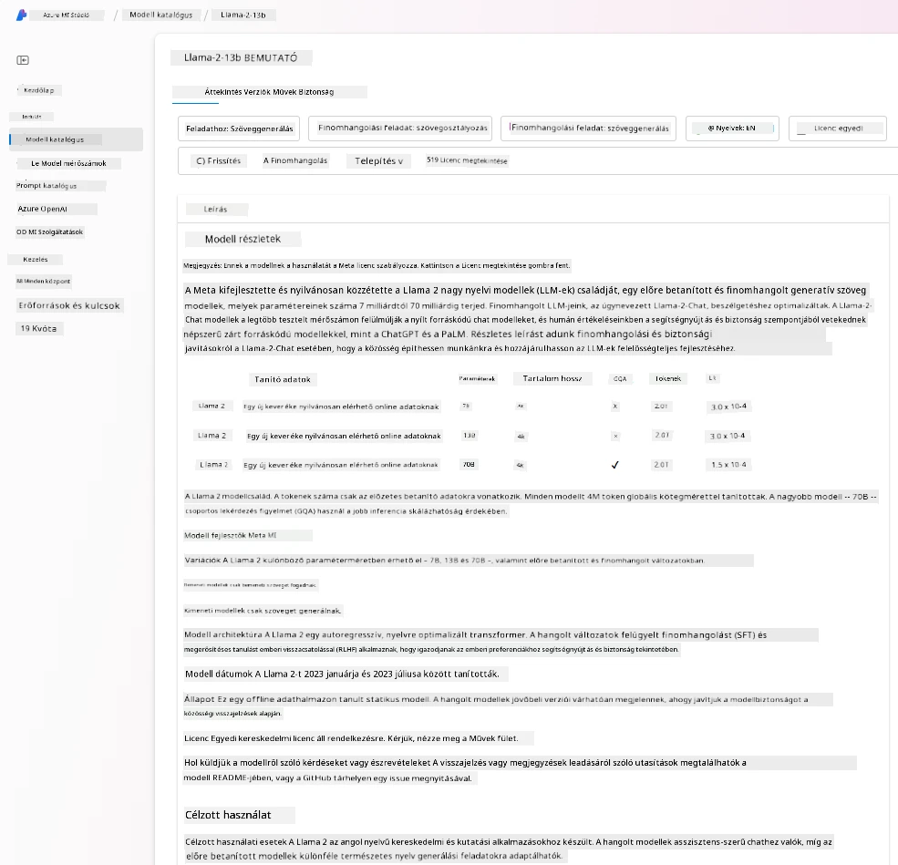

- Összehasonlíthatja a modellek és iparági adatkészletek közötti benchmarkokat annak felmérésére, hogy melyik igazodik legjobban az üzleti szcenárióhoz, a [Model Benchmarks](https://learn.microsoft.com/azure/ai-foundry/concepts/model-benchmarks?WT.mc_id=academic-105485-koreyst) fülön keresztül.

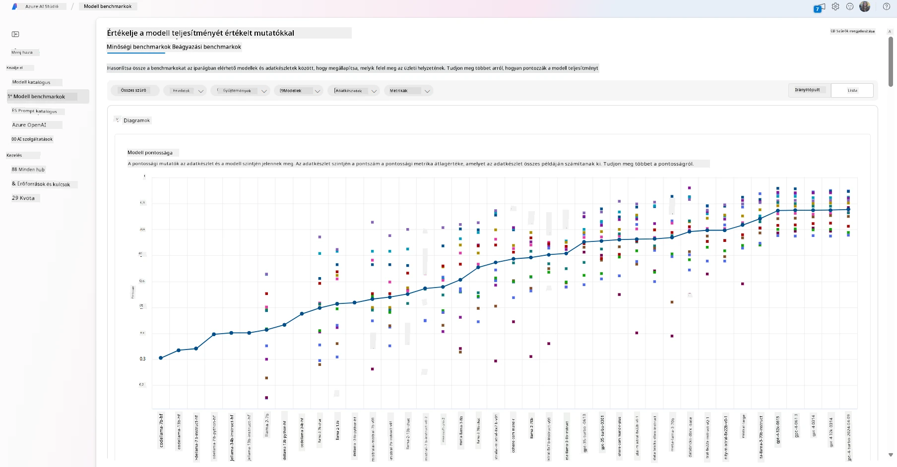

- Finomhangolhatja a támogatott modelleket egyedi tanító adatokon a modell teljesítményének javítása érdekében egy adott munkaterhelésnél, kihasználva a Microsoft Foundry kísérletezési és nyomonkövetési képességeit.

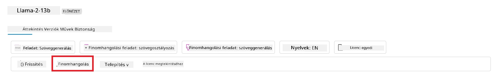

- Telepítheti az eredeti előre betanított modellt vagy a finomhangolt verziót egy távoli valós idejű lekérdezési végpontra menedzselt számítási erőforrás vagy szerver nélküli telepítési lehetőségek használatával, hogy az alkalmazások hozzáférhessenek.

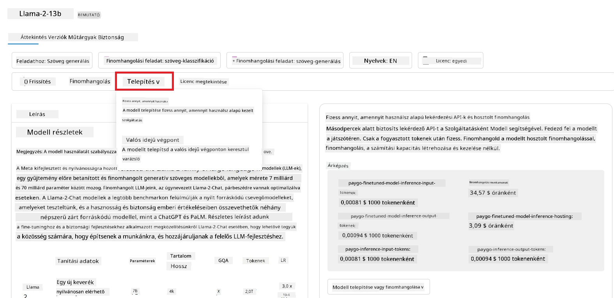

> [!NOTE]
> Nem minden modell érhető el jelenleg finomhangolásra és/vagy fizess-amikor-használsz telepítésre a katalógusban. Ellenőrizze a modellkártyát a modell képességeinek és korlátainak részleteiért.

## LLM eredmények javítása

Csapatunk a startup környezetben különböző típusú LLM-eket és egy felhőplatformot (Microsoft Foundry) is felfedezett, amely lehetővé teszi különféle modellek összehasonlítását, tesztadatokon való értékelését, a teljesítmény javítását és végpontokra történő telepítését.

De mikor érdemes egy modellt finomhangolni egy előre betanított modell helyett? Vannak más megközelítések is, amelyek javíthatják a modell teljesítményét egy adott munkaterhelésen?

Többféle megközelítést használhat egy vállalkozás az LLM-ből származó eredmények javítására. Különböző típusú modelleket választhat különböző mértékű tanítással, amikor LLM-et telepít termelési környezetbe, különböző szinteken komplexitás, költség és minőség szempontjából. Íme néhány különböző megközelítés:

- **Prompt engineering kontextussal**. A lényeg az, hogy elegendő kontextust adjon meg a promptban annak érdekében, hogy megkapja a szükséges válaszokat.

- **Retrieval Augmented Generation, RAG**. Az adatai lehetnek például adatbázisban vagy webes végponton, hogy biztosítsa ezen adatok vagy azok részhalmazának elérését a promptolás időpontjában, lekérheti a releváns adatokat és beépítheti ezeket a felhasználói prompt részévé.

- **Finomhangolt modell**. Ebben az esetben a modellt tovább tanította a saját adataival, ami pontosabbá és jobban reagálóvá tette az igényeihez, de ez költséges lehet.

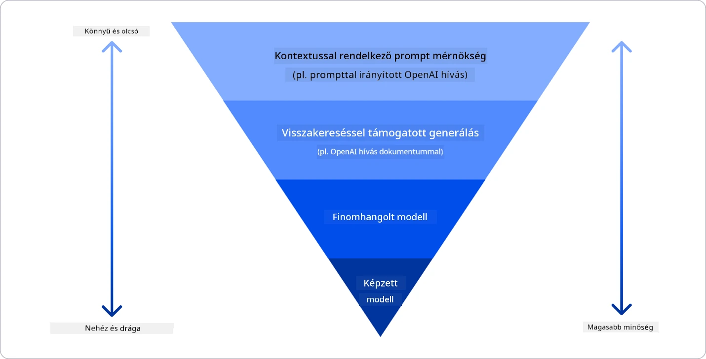

Kép forrása: [Four Ways that Enterprises Deploy LLMs | Fiddler AI Blog](https://www.fiddler.ai/blog/four-ways-that-enterprises-deploy-llms?WT.mc_id=academic-105485-koreyst)

### Kontextus alapú prompt tervezés

Az előre betanított LLM-ek nagyon jól működnek általánosított természetes nyelvi feladatokon, akár egy rövid prompttal hívva is, mint például egy befejezendő mondat vagy kérdés – ezt nevezik „zero-shot” tanulásnak.

Azonban minél jobban tudja a felhasználó keretezni a kérdését részletes kéréssel és példákkal – a kontextussal –, annál pontosabb és a felhasználó elvárásaihoz közelebb álló válasz születik. Ebben az esetben „one-shot” tanulásról beszélünk, ha a prompt csak egy példát tartalmaz, és „few-shot” tanulásról, ha több példát foglal magában.
A kontextus alapú prompt tervezés a legköltséghatékonyabb megközelítés a kezdéshez.

### Retrieval Augmented Generation (RAG)

Az LLM-eknek az a korlátja, hogy csak azokat az adatokat használhatják fel válasz generálására, amelyekkel a tanításuk során találkoztak. Ez azt jelenti, hogy nem tudnak semmit a tanításuk utáni tényekről, és nem érhetnek el nem nyilvános információkat (például céges adatokat).
Ezt a korlátot hidalja át a RAG, egy olyan technika, amely külső adatokat ad hozzá a prompthoz dokumentum darabkák formájában, odafigyelve arra, hogy a prompt hossza ne lépje túl a megengedettet. Ezt vektor adatbázis eszközök támogatják (például [Azure Vector Search](https://learn.microsoft.com/azure/search/vector-search-overview?WT.mc_id=academic-105485-koreyst)), amelyek lekérik a hasznos dokumentum darabokat különböző előre meghatározott adatforrásokból, majd hozzáadják őket a prompt kontextusához.

Ez a technika nagyon hasznos, ha egy vállalkozásnak nincs elegendő adata, ideje vagy erőforrása a finomhangoláshoz, de szeretné javítani egy specifikus munkaterhelés teljesítményét, és csökkenteni a téves, elavult vagy nem támogatott válaszok kockázatát.

### Finomhangolt modell

A finomhangolás egy olyan folyamat, amely átviteli tanulást használ arra, hogy a modellt egy alárendelt feladathoz vagy egy adott problémához igazítsa. Ellentétben a few-shot tanulással és a RAG-gel, ezt új modell létrehozása követi, frissített súlyokkal és torzításokkal. Ehhez szükség van egy tanító példakészletre, amely egyetlen bemenetből (a promptból) és az ahhoz kapcsolódó kimenetből (a befejezésből) áll.
Ez a megközelítés az előnyös, ha:

- **Kisebb, feladatspecifikus modellek használata.** Egy vállalkozás inkább finomhangol egy kisebb modellt egy szűk feladatra, mint hogy egy nagyobb modellt ismételten promptoljon, így költséghatékonyabb és gyorsabb megoldást kap.

- **Késleltetés fontossága.** Ha egy adott felhasználási esetben fontos a késleltetés, nem lehet nagyon hosszú promptokat használni, vagy a modellnek tanulandó példák száma nem fér bele a prompt hosszkorlátjába.

- **Stabil viselkedéshez való alkalmazkodás.** Egy vállalkozásnak sok magas minőségű példája van, és azt szeretné, hogy a modell következetesen egy feladatmintát, kimeneti formátumot, hangnemet vagy domén-specifikus stílust kövessen. Ha a fő probléma friss tények vagy gyakran változó privát tudás, inkább a RAG-et használja a finomhangolás önmagában történő alkalmazása helyett.

### Betanított modell

Egy LLM-et a nulláról betanítani kétségtelenül a legnehezebb és legösszetettebb megközelítés, amely hatalmas mennyiségű adatot, képzett erőforrásokat és megfelelő számítási kapacitást igényel. Ezt a lehetőséget csak akkor érdemes fontolóra venni, ha egy vállalkozásnak doménspecifikus felhasználási esete van és nagy mennyiségű, doménközpontú adat áll rendelkezésre.

## Tudásellenőrzés

Mi lehet egy jó megközelítés az LLM kimeneti eredmények javítására?

1. Kontextus alapú prompt tervezés
1. RAG
1. Finomhangolt modell

V: Mindhárom segíthet. Kezdj prompt tervezéssel és kontextussal a gyors javulásért, és használd a RAG-et, amikor a modellnek aktuális tényekre vagy üzleti privát adatokra van szüksége. Válaszd a finomhangolást, ha elegendő magas minőségű példád van, és szükséges, hogy a modell következetesen egy feladatot, formátumot, hangnemet vagy domén mintát kövessen.

## 🚀 Kihívás

Olvass bővebben arról, hogyan tudod [használni a RAG-et](https://learn.microsoft.com/azure/search/retrieval-augmented-generation-overview?WT.mc_id=academic-105485-koreyst) az üzletedhez.

## Nagyszerű munka, folytasd a tanulást!

A lecke elvégzése után nézd meg a [Generative AI tanulási gyűjteményünket](https://aka.ms/genai-collection?WT.mc_id=academic-105485-koreyst), hogy tovább fejleszd a generatív AI ismereteidet!

Indulj a 3. leckéhez, ahol megnézzük, hogyan lehet [felelősségteljesen építeni generatív AI-val](../03-using-generative-ai-responsibly/README.md?WT.mc_id=academic-105485-koreyst)!

---

<!-- CO-OP TRANSLATOR DISCLAIMER START -->
**Jogi nyilatkozat**:
Ez a dokumentum az AI fordítási szolgáltatás, a [Co-op Translator](https://github.com/Azure/co-op-translator) segítségével készült. Bár az pontosságra törekszünk, kérjük, vegye figyelembe, hogy az automatikus fordítások hibákat vagy pontatlanságokat tartalmazhatnak. Az eredeti dokumentum az anyanyelvén tekintendő hiteles forrásnak. Fontos információk esetén professzionális emberi fordítást javasolunk. Nem vállalunk felelősséget semmilyen félreértésért vagy téves értelmezésért, amely ebből a fordításból ered.
<!-- CO-OP TRANSLATOR DISCLAIMER END -->