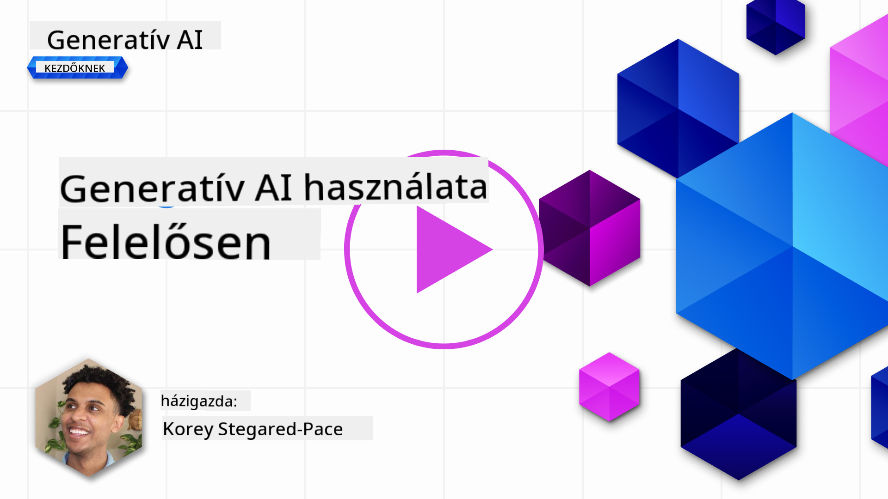
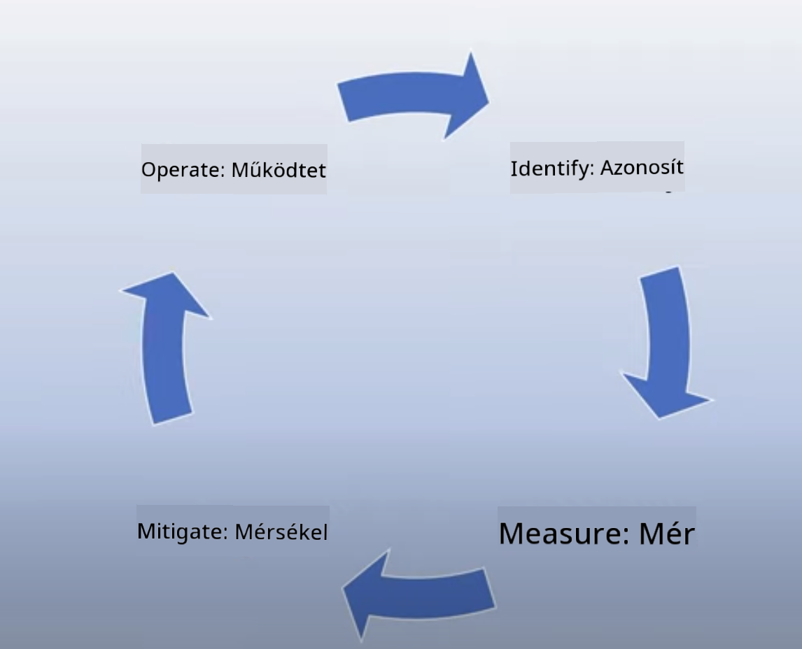

<!--
CO_OP_TRANSLATOR_METADATA:
{
  "original_hash": "13084c6321a2092841b9a081b29497ba",
  "translation_date": "2025-05-19T14:48:06+00:00",
  "source_file": "03-using-generative-ai-responsibly/README.md",
  "language_code": "hu"
}
-->
# Generatív mesterséges intelligencia felelősségteljes használata

> _Kattints a fenti képre a lecke videójának megtekintéséhez_

Könnyű lenyűgöződni a mesterséges intelligenciától, különösen a generatív mesterséges intelligenciától, de fontos megfontolni, hogyan használjuk azt felelősségteljesen. Fontos figyelembe venni például, hogyan biztosíthatjuk, hogy a kimenet igazságos, nem ártalmas és még sok más szempontot. Ez a fejezet célja, hogy megadja az említett kontextust, mit kell figyelembe venni, és hogyan tehetünk aktív lépéseket a mesterséges intelligencia használatának javítása érdekében.

## Bevezetés

Ez a lecke kiterjed:

- Miért kell előtérbe helyezni a Felelős AI-t, amikor generatív mesterséges intelligencia alkalmazásokat építünk.
- A Felelős AI alapelvei és hogyan kapcsolódnak a generatív mesterséges intelligenciához.
- Hogyan lehet ezeket a Felelős AI alapelveket gyakorlatba ültetni stratégiával és eszközökkel.

## Tanulási célok

A lecke elvégzése után tudni fogod:

- A Felelős AI fontosságát generatív mesterséges intelligencia alkalmazások építésekor.
- Mikor kell gondolkodni és alkalmazni a Felelős AI alapelveit generatív mesterséges intelligencia alkalmazások építésekor.
- Milyen eszközök és stratégiák állnak rendelkezésedre, hogy a Felelős AI koncepcióját gyakorlatba ültesd.

## Felelős AI alapelvek

A generatív mesterséges intelligencia iránti izgalom soha nem volt nagyobb. Ez az izgalom sok új fejlesztőt, figyelmet és finanszírozást hozott ebbe a térbe. Míg ez nagyon pozitív bárki számára, aki generatív mesterséges intelligenciát használó termékeket és vállalatokat akar építeni, fontos, hogy felelősségteljesen haladjunk előre.

A tanfolyam során a startupunk és az AI oktatási termékünk építésére összpontosítunk. A Felelős AI alapelveit fogjuk használni: Igazságosság, Befogadás, Megbízhatóság/Biztonság, Biztonság és Magánélet, Átláthatóság és Felelősség. Ezekkel az elvekkel megvizsgáljuk, hogyan kapcsolódnak a generatív mesterséges intelligencia használatához a termékeinkben.

## Miért kell előtérbe helyezni a Felelős AI-t

Amikor egy terméket építünk, az emberközpontú megközelítés, amely a felhasználó legjobb érdekeit tartja szem előtt, vezet a legjobb eredményekhez.

A generatív mesterséges intelligencia egyedisége abban rejlik, hogy képes hasznos válaszokat, információkat, útmutatást és tartalmat létrehozni a felhasználók számára. Ez megtehető sok manuális lépés nélkül, ami nagyon lenyűgöző eredményekhez vezethet. Megfelelő tervezés és stratégiák nélkül azonban sajnos káros eredményekhez is vezethet a felhasználóid, a terméked és az egész társadalom számára.

Nézzük meg néhány (de nem az összes) potenciálisan káros eredményt:

### Hallucinációk

A hallucinációk kifejezést akkor használjuk, amikor egy LLM olyan tartalmat állít elő, amely vagy teljesen értelmetlen, vagy amit más források alapján tudunk, hogy tényszerűen hibás.

Tegyük fel például, hogy építünk egy funkciót a startupunk számára, amely lehetővé teszi a diákok számára, hogy történelmi kérdéseket tegyenek fel egy modellnek. Egy diák felteszi a kérdést: `Who was the sole survivor of Titanic?`

A modell egy olyan választ ad, mint az alábbi:

> _(Forrás: [Flying bisons](https://flyingbisons.com?WT.mc_id=academic-105485-koreyst))_

Ez egy nagyon magabiztos és alapos válasz. Sajnos, helytelen. Még minimális kutatás esetén is kiderülne, hogy több mint egy túlélője volt a Titanic katasztrófának. Egy diák számára, aki éppen most kezdi el kutatni ezt a témát, ez a válasz elég meggyőző lehet ahhoz, hogy ne kérdőjelezze meg, és tényként kezelje. Ennek következményei lehetnek, hogy a mesterséges intelligencia rendszer megbízhatatlanná válik, és negatívan befolyásolja a startupunk hírnevét.

Bármely adott LLM minden iterációjával láttunk teljesítményjavulásokat a hallucinációk minimalizálása terén. Még ezzel a javulással is, alkalmazásépítőként és felhasználóként továbbra is tisztában kell lennünk ezekkel a korlátokkal.

### Káros tartalom

Az előző szakaszban tárgyaltuk, amikor egy LLM helytelen vagy értelmetlen válaszokat ad. Egy másik kockázat, amellyel tisztában kell lennünk, amikor egy modell káros tartalommal válaszol.

A káros tartalom meghatározható mint:

- Utasítások adása vagy önkárosításra vagy bizonyos csoportok elleni károkozásra való bátorítás.
- Gyűlöletkeltő vagy lealacsonyító tartalom.
- Bármilyen típusú támadás vagy erőszakos cselekmény tervezésének irányítása.
- Utasítások adása illegális tartalom megtalálására vagy illegális cselekmények elkövetésére.
- Szexuálisan explicit tartalom megjelenítése.

A startupunk számára biztosítani szeretnénk, hogy megfelelő eszközökkel és stratégiákkal rendelkezünk az ilyen típusú tartalmak megelőzésére, hogy a diákok ne lássák őket.

### Igazságtalanság hiánya

Az igazságtalanságot úgy határozzák meg, hogy "biztosítva, hogy egy AI rendszer mentes legyen az elfogultságtól és diszkriminációtól, és mindenkit igazságosan és egyenlően kezeljen". A generatív mesterséges intelligencia világában biztosítani akarjuk, hogy a marginalizált csoportok kizáró világképei ne erősödjenek meg a modell kimenetében.

Ezek a típusú kimenetek nemcsak rombolóak a felhasználóink pozitív terméktapasztalatainak építésében, hanem további társadalmi károkat is okoznak. Alkalmazásépítőként mindig széles és sokszínű felhasználói bázist kell szem előtt tartanunk, amikor megoldásokat építünk generatív mesterséges intelligenciával.

## Hogyan használjuk a generatív mesterséges intelligenciát felelősségteljesen

Most, hogy azonosítottuk a felelősségteljes generatív mesterséges intelligencia fontosságát, nézzük meg a 4 lépést, amelyeket megtehetünk, hogy felelősségteljesen építsük AI megoldásainkat:

### Potenciális károk mérése

A szoftvertesztelés során a felhasználó várt cselekedeteit teszteljük egy alkalmazáson. Hasonlóan, a felhasználók által legvalószínűbben használt változatos kérések tesztelése jó módja a potenciális károk mérésének.

Mivel a startupunk oktatási terméket épít, jó lenne egy listát készíteni oktatással kapcsolatos kérésekről. Ez lehetne egy bizonyos tantárgy lefedése, történelmi tények, és a diákélettel kapcsolatos kérések.

### Potenciális károk enyhítése

Most itt az ideje megtalálni azokat a módokat, ahol megakadályozhatjuk vagy korlátozhatjuk a modell és a válaszai által okozott potenciális károkat. Ezt 4 különböző rétegben vizsgálhatjuk:

- **Modell**. A megfelelő modell kiválasztása a megfelelő használati esethez. Nagyobb és összetettebb modellek, mint a GPT-4, nagyobb kockázatot jelenthetnek káros tartalom szempontjából, amikor kisebb és specifikusabb használati esetekre alkalmazzák őket. A képzési adatok használata a finomhangoláshoz szintén csökkenti a káros tartalom kockázatát.

- **Biztonsági rendszer**. A biztonsági rendszer egy eszközkészlet és konfigurációk a modellt kiszolgáló platformon, amelyek segítenek enyhíteni a károkat. Példa erre az Azure OpenAI szolgáltatás tartalomszűrő rendszere. A rendszereknek detektálniuk kell a jailbreak támadásokat és a nem kívánt tevékenységeket, mint például a botoktól érkező kéréseket.

- **Metaprompt**. A metapromptek és a földelés olyan módok, ahogyan irányíthatjuk vagy korlátozhatjuk a modellt bizonyos viselkedések és információk alapján. Ez lehet rendszerbemenetek használata a modell bizonyos határainak meghatározására. Emellett relevánsabb kimenetek biztosítása a rendszer terjedelméhez vagy területéhez.

Ez lehet olyan technikák használata is, mint a Retrieval Augmented Generation (RAG), hogy a modell csak egy kiválasztott megbízható forrásból húzzon információt. Van egy lecke később ebben a kurzusban a [keresési alkalmazások építéséről](../08-building-search-applications/README.md?WT.mc_id=academic-105485-koreyst).

- **Felhasználói élmény**. Az utolsó réteg, ahol a felhasználó közvetlenül a modellel lép kapcsolatba az alkalmazásunk felületén keresztül valamilyen módon. Ilyen módon tervezhetjük a UI/UX-et, hogy korlátozzuk a felhasználót azokra a bemenetekre, amelyeket a modellnek küldhet, valamint a felhasználó számára megjelenített szövegekre vagy képekre. Az AI alkalmazás telepítésekor átláthatónak kell lennünk arról, hogy a generatív mesterséges intelligencia alkalmazásunk mit tud és mit nem tud megtenni.

Van egy teljes leckénk a [AI alkalmazások UX tervezéséről](../12-designing-ux-for-ai-applications/README.md?WT.mc_id=academic-105485-koreyst).

- **Modell értékelése**. Az LLM-ekkel való munka kihívást jelenthet, mert nem mindig van kontrollunk a modell képzésére használt adatok felett. Ennek ellenére mindig értékelnünk kell a modell teljesítményét és kimeneteit. Fontos mérni a modell pontosságát, hasonlóságát, megalapozottságát és a kimenet relevanciáját. Ez segít átláthatóságot és bizalmat biztosítani az érdekelt felek és a felhasználók számára.

### Felelős generatív mesterséges intelligencia megoldás működtetése

Az AI alkalmazások körüli működési gyakorlat kiépítése az utolsó szakasz. Ez magában foglalja az együttműködést a startupunk más részeivel, például a jogi és biztonsági részlegekkel, hogy biztosítsuk, hogy megfelelünk minden szabályozási politikának. Az indítás előtt terveket is szeretnénk készíteni a szállítás, az incidensek kezelése és a visszagörgetés körül, hogy megakadályozzuk bármilyen kárt a felhasználóink számára.

## Eszközök

Bár a Felelős AI megoldások fejlesztése sok munkának tűnhet, ez a munka megéri az erőfeszítést. Ahogy a generatív mesterséges intelligencia területe növekszik, egyre több eszköz segíti a fejlesztőket, hogy hatékonyan integrálják a felelősséget a munkafolyamataikba. Például az [Azure AI Content Safety](https://learn.microsoft.com/azure/ai-services/content-safety/overview?WT.mc_id=academic-105485-koreyst) segíthet káros tartalom és képek észlelésében egy API kérésen keresztül.

## Tudásellenőrzés

Milyen dolgokra kell figyelned, hogy biztosítsd a felelős AI használatát?

1. Hogy a válasz helyes legyen.
2. Káros használat, hogy az AI-t ne használják bűnözői célokra.
3. Biztosítani, hogy az AI mentes legyen az elfogultságtól és diszkriminációtól.

A: 2 és 3 helyes. A Felelős AI segít megfontolni, hogyan lehet enyhíteni a káros hatásokat és elfogultságokat és még sok mást.

## 🚀 Kihívás

Olvass utána az [Azure AI Content Safety](https://learn.microsoft.com/azure/ai-services/content-safety/overview?WT.mc_id=academic-105485-koreyst) szolgáltatásnak, és nézd meg, mit tudsz alkalmazni a saját használatodra.

## Nagyszerű munka, folytasd a tanulást

A lecke befejezése után nézd meg a [Generatív AI Tanulási gyűjteményünket](https://aka.ms/genai-collection?WT.mc_id=academic-105485-koreyst), hogy tovább fejleszd a generatív mesterséges intelligencia tudásodat!

Lépj tovább a 4. leckére, ahol megvizsgáljuk a [Prompt Engineering Alapjait](../04-prompt-engineering-fundamentals/README.md?WT.mc_id=academic-105485-koreyst)!

**Felelősség kizárása**:  
Ez a dokumentum az AI fordítási szolgáltatás [Co-op Translator](https://github.com/Azure/co-op-translator) segítségével készült. Bár törekszünk a pontosságra, kérjük, vegye figyelembe, hogy az automatikus fordítások hibákat vagy pontatlanságokat tartalmazhatnak. Az eredeti dokumentum a saját nyelvén tekintendő a hiteles forrásnak. Kritikus információk esetén ajánlott a professzionális emberi fordítás. Nem vállalunk felelősséget a fordítás használatából eredő félreértésekért vagy téves értelmezésekért.