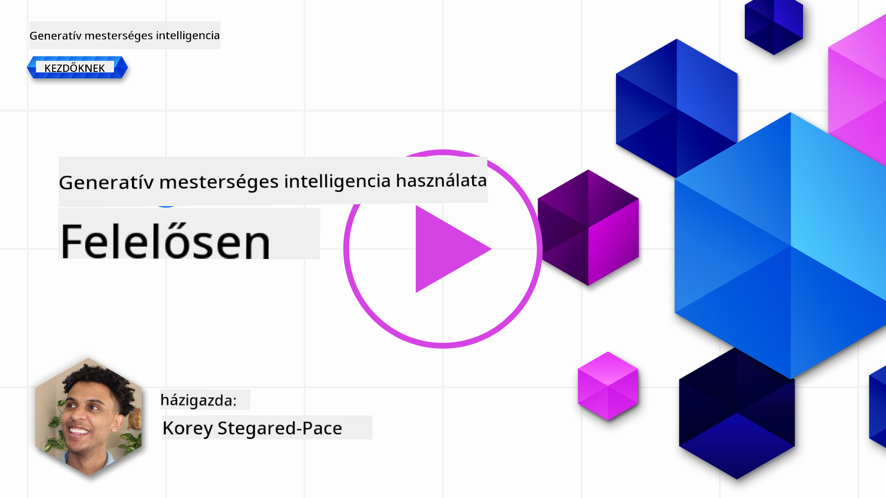
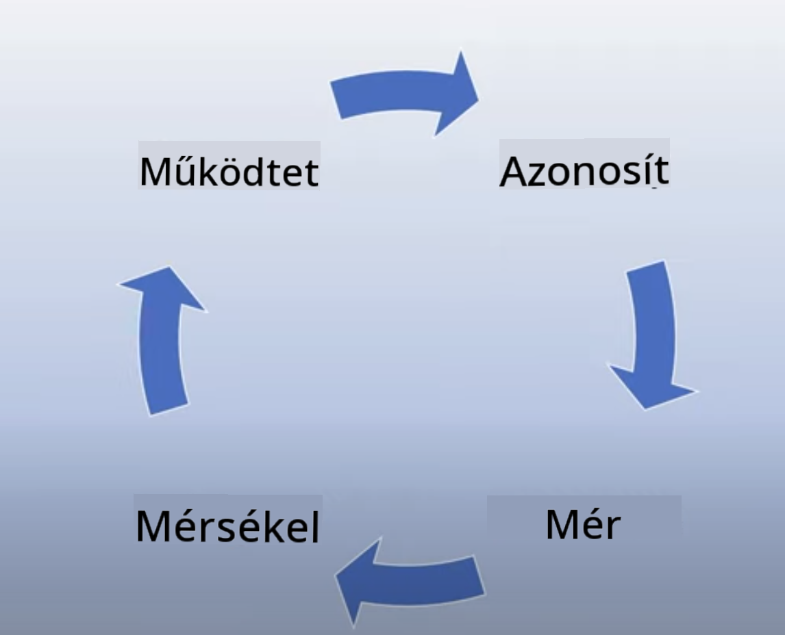
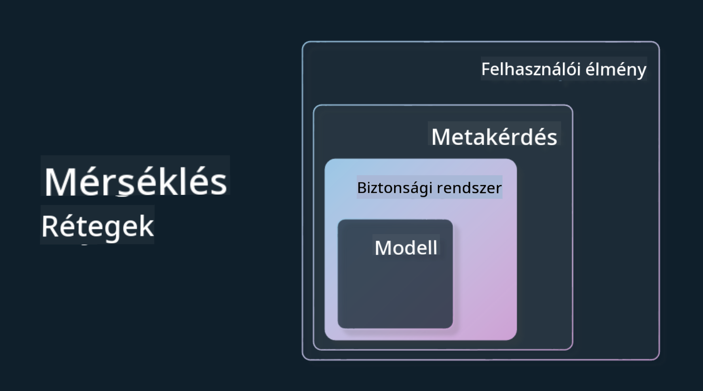

<!--
CO_OP_TRANSLATOR_METADATA:
{
  "original_hash": "7f8f4c11f8c1cb6e1794442dead414ea",
  "translation_date": "2025-07-09T09:01:39+00:00",
  "source_file": "03-using-generative-ai-responsibly/README.md",
  "language_code": "hu"
}
-->
# Generatív MI felelősségteljes használata

> _Kattints a fenti képre a lecke videójának megtekintéséhez_

Könnyű lenyűgöződni az MI-től, különösen a generatív MI-től, de fontos átgondolni, hogyan használhatod felelősségteljesen. Figyelembe kell venni például, hogyan biztosítható, hogy a kimenet igazságos, ártalmatlan legyen és még sok más szempontot. Ez a fejezet azt a célt szolgálja, hogy megadja a szükséges hátteret, mire kell figyelni, és hogyan tehetsz aktív lépéseket az MI használatod javítása érdekében.

## Bevezetés

Ebben a leckében a következőkről lesz szó:

- Miért fontos a Felelős MI előtérbe helyezése generatív MI alkalmazások fejlesztésekor.
- A Felelős MI alapelvei és ezek kapcsolata a generatív MI-vel.
- Hogyan lehet ezeket az alapelveket gyakorlatba ültetni stratégiák és eszközök segítségével.

## Tanulási célok

A lecke elvégzése után tudni fogod:

- Milyen jelentősége van a Felelős MI-nek generatív MI alkalmazások fejlesztésekor.
- Mikor és hogyan kell alkalmazni a Felelős MI alapelveit generatív MI fejlesztésekor.
- Milyen eszközök és stratégiák állnak rendelkezésedre a Felelős MI gyakorlati megvalósításához.

## Felelős MI alapelvek

A generatív MI iránti lelkesedés soha nem volt még ilyen nagy. Ez a lelkesedés sok új fejlesztőt, figyelmet és finanszírozást hozott a területre. Ez nagyon pozitív mindazok számára, akik generatív MI-t használva szeretnének termékeket és vállalkozásokat építeni, ugyanakkor fontos, hogy felelősségteljesen járjunk el.

A tanfolyam során a startupunk és az MI oktatási termékünk fejlesztésére koncentrálunk. A Felelős MI alapelveit fogjuk alkalmazni: igazságosság, befogadás, megbízhatóság/biztonság, biztonság és adatvédelem, átláthatóság és elszámoltathatóság. Ezekkel az alapelvekkel vizsgáljuk meg, hogyan kapcsolódnak a generatív MI használatához a termékeinkben.

## Miért fontos a Felelős MI előtérbe helyezése?

Egy termék fejlesztésekor az emberközpontú megközelítés, amely a felhasználók érdekeit tartja szem előtt, vezet a legjobb eredményekhez.

A generatív MI egyedisége abban rejlik, hogy képes hasznos válaszokat, információkat, útmutatást és tartalmat létrehozni a felhasználók számára. Ez sok manuális lépés nélkül történik, ami lenyűgöző eredményekhez vezethet. Ugyanakkor megfelelő tervezés és stratégia nélkül sajnos káros következményekkel is járhat a felhasználókra, a termékre és a társadalomra nézve.

Nézzünk meg néhány (de nem minden) ilyen potenciálisan káros következményt:

### Hallucinációk

A hallucinációk kifejezést arra használjuk, amikor egy LLM olyan tartalmat állít elő, ami vagy teljesen értelmetlen, vagy amit más források alapján tévesnek tudunk.

Például képzeljük el, hogy a startupunk egy olyan funkciót fejleszt, amely lehetővé teszi a diákok számára, hogy történelmi kérdéseket tegyenek fel egy modellnek. Egy diák megkérdezi: `Ki volt a Titanic egyetlen túlélője?`

A modell az alábbihoz hasonló választ ad:

> _(Forrás: [Flying bisons](https://flyingbisons.com?WT.mc_id=academic-105485-koreyst))_

Ez egy nagyon magabiztos és részletes válasz. Sajnos azonban helytelen. Egy minimális kutatással kiderül, hogy a Titanic katasztrófájának több túlélője is volt. Egy olyan diák számára, aki csak most kezd el kutatni a témában, ez a válasz elég meggyőző lehet ahhoz, hogy ne kérdőjelezze meg, és tényként kezelje. Ennek következménye, hogy az MI rendszer megbízhatatlanná válhat, és negatívan befolyásolhatja a startupunk hírnevét.

Minden egyes LLM iterációval láttunk előrelépéseket a hallucinációk minimalizálásában. Ennek ellenére nekünk, alkalmazásfejlesztőknek és felhasználóknak tisztában kell lennünk ezekkel a korlátokkal.

### Káros tartalom

Az előző részben arról volt szó, amikor egy LLM helytelen vagy értelmetlen válaszokat ad. Egy másik kockázat, amire figyelni kell, ha a modell káros tartalommal válaszol.

A káros tartalom alatt értjük:

- Önkárosításra vagy bizonyos csoportok elleni ártalomra vonatkozó utasítások vagy bátorítás.
- Gyűlöletkeltő vagy megalázó tartalom.
- Bármilyen támadás vagy erőszakos cselekmény tervezésének irányítása.
- Illegális tartalom keresésére vagy illegális cselekmények elkövetésére vonatkozó utasítások.
- Szexuálisan explicit tartalom megjelenítése.

A startupunk számára fontos, hogy megfelelő eszközökkel és stratégiákkal megakadályozzuk, hogy a diákok ilyen tartalmakat lássanak.

### Igazságosság hiánya

Az igazságosság azt jelenti, hogy „biztosítjuk, hogy az MI rendszer mentes legyen elfogultságtól és diszkriminációtól, és mindenkit igazságosan, egyenlően kezeljen.” A generatív MI világában azt szeretnénk elérni, hogy a marginalizált csoportok kizáró nézőpontjai ne erősödjenek meg a modell kimenetében.

Az ilyen típusú kimenetek nemcsak a pozitív felhasználói élmények építését teszik tönkre, hanem további társadalmi károkat is okoznak. Alkalmazásfejlesztőként mindig széles és sokszínű felhasználói bázist kell szem előtt tartanunk, amikor generatív MI megoldásokat készítünk.

## Hogyan használjuk felelősségteljesen a generatív MI-t?

Most, hogy tisztáztuk a Felelős Generatív MI fontosságát, nézzük meg a 4 lépést, amellyel felelősségteljesen építhetjük AI megoldásainkat:

### Mérd fel a potenciális károkat

A szoftvertesztelés során a felhasználó várható viselkedését teszteljük az alkalmazásban. Hasonlóan, egy változatos, a felhasználók által legvalószínűbben használt promptok tesztelése jó módja a potenciális károk mérésének.

Mivel a startupunk oktatási terméket fejleszt, érdemes összeállítani egy listát oktatással kapcsolatos promptokból. Ezek lefedhetnek bizonyos tantárgyakat, történelmi tényeket, vagy a diákélettel kapcsolatos kérdéseket.

### Csökkentsd a potenciális károkat

Most itt az ideje megtalálni azokat a módokat, amelyekkel megelőzhetjük vagy korlátozhatjuk a modell és válaszai által okozott károkat. Ezt négy különböző rétegben vizsgálhatjuk:

- **Modell**. A megfelelő modell kiválasztása a megfelelő feladathoz. Nagyobb és összetettebb modellek, mint a GPT-4, nagyobb kockázatot jelenthetnek káros tartalom előállítására, ha kisebb, specifikusabb feladatokra alkalmazzuk őket. A tanítóadatokkal történő finomhangolás szintén csökkenti a káros tartalom kockázatát.

- **Biztonsági rendszer**. A biztonsági rendszer olyan eszközök és beállítások összessége a platformon, amely a modellt szolgálja, és segít a károk mérséklésében. Például az Azure OpenAI szolgáltatás tartalomszűrő rendszere. Ezek a rendszerek képesek felismerni a jailbreak támadásokat és nem kívánt tevékenységeket, például botoktól érkező kéréseket.

- **Metaprompt**. A metapromptok és a grounding olyan módszerek, amelyekkel a modellt bizonyos viselkedések és információk alapján irányíthatjuk vagy korlátozhatjuk. Ez lehet például rendszerbemenetek használata a modell bizonyos korlátainak meghatározására. Emellett olyan kimenetek biztosítása, amelyek jobban illeszkednek a rendszer hatóköréhez vagy témájához.

Használhatunk olyan technikákat is, mint a Retrieval Augmented Generation (RAG), amely lehetővé teszi, hogy a modell csak megbízható forrásokból húzza az információkat. Erről a tanfolyam későbbi részében lesz szó a [keresőalkalmazások építéséről](../08-building-search-applications/README.md?WT.mc_id=academic-105485-koreyst).

- **Felhasználói élmény**. Az utolsó réteg, ahol a felhasználó közvetlenül az alkalmazás felületén keresztül lép kapcsolatba a modellel. Itt a UI/UX tervezésével korlátozhatjuk a felhasználó által a modellnek küldhető bemenetek típusát, valamint a felhasználónak megjelenített szövegeket vagy képeket. Az AI alkalmazás bevezetésekor átláthatónak kell lennünk abban, hogy mit tud és mit nem tud a generatív MI alkalmazásunk.

Egy egész lecke foglalkozik a [UX tervezésével AI alkalmazásokhoz](../12-designing-ux-for-ai-applications/README.md?WT.mc_id=academic-105485-koreyst).

- **Modell értékelése**. Az LLM-ekkel való munka kihívást jelenthet, mert nem mindig van kontrollunk a modell tanítóadatai felett. Ennek ellenére mindig értékelnünk kell a modell teljesítményét és kimeneteit. Fontos mérni a modell pontosságát, hasonlóságát, megalapozottságát és a kimenet relevanciáját. Ez átláthatóságot és bizalmat teremt a résztvevők és a felhasználók számára.

### Felelős generatív MI megoldás működtetése

Az AI alkalmazások köré egy működési gyakorlat kiépítése a végső lépés. Ez magában foglalja a startup más területeivel, például a jogi és biztonsági részlegekkel való együttműködést annak érdekében, hogy megfeleljünk minden szabályozási előírásnak. A bevezetés előtt terveket kell készíteni a szolgáltatás nyújtására, az incidensek kezelésére és a visszaállításra, hogy megakadályozzuk a felhasználók károsodását.

## Eszközök

Bár a Felelős MI megoldások fejlesztése sok munkának tűnhet, ez a befektetés megéri. Ahogy a generatív MI területe növekszik, egyre több eszköz áll majd rendelkezésre, amelyek segítik a fejlesztőket a felelősség beépítésében a munkafolyamatokba. Például az [Azure AI Content Safety](https://learn.microsoft.com/azure/ai-services/content-safety/overview?WT.mc_id=academic-105485-koreyst) API-kéréseken keresztül képes felismerni káros tartalmakat és képeket.

## Tudásellenőrzés

Milyen dolgokra kell figyelned a felelős MI használat biztosításához?

1. Hogy a válasz helyes legyen.
1. A káros használat elkerülése, hogy az MI ne legyen bűncselekmények eszköze.
1. Annak biztosítása, hogy az MI mentes legyen elfogultságtól és diszkriminációtól.

Válasz: 2 és 3 helyes. A Felelős MI segít átgondolni, hogyan csökkentsük a káros hatásokat, az elfogultságokat és még sok mást.

## 🚀 Kihívás

Olvasd el az [Azure AI Content Safety](https://learn.microsoft.com/azure/ai-services/content-safety/overview?WT.mc_id=academic-105485-koreyst) dokumentációját, és nézd meg, mit tudsz alkalmazni a saját használatodban.

## Szép munka, folytasd a tanulást!

A lecke elvégzése után nézd meg a [Generatív MI tanulási gyűjteményünket](https://aka.ms/genai-collection?WT.mc_id=academic-105485-koreyst), hogy tovább fejleszd a generatív MI ismereteidet!

Lépj tovább a 4. leckére, ahol a [Prompt tervezés alapjaival](../04-prompt-engineering-fundamentals/README.md?WT.mc_id=academic-105485-koreyst) foglalkozunk!

**Jogi nyilatkozat**:  
Ez a dokumentum az AI fordító szolgáltatás, a [Co-op Translator](https://github.com/Azure/co-op-translator) segítségével készült. Bár a pontosságra törekszünk, kérjük, vegye figyelembe, hogy az automatikus fordítások hibákat vagy pontatlanságokat tartalmazhatnak. Az eredeti dokumentum az anyanyelvén tekintendő hiteles forrásnak. Fontos információk esetén szakmai, emberi fordítást javaslunk. Nem vállalunk felelősséget a fordítás használatából eredő félreértésekért vagy téves értelmezésekért.