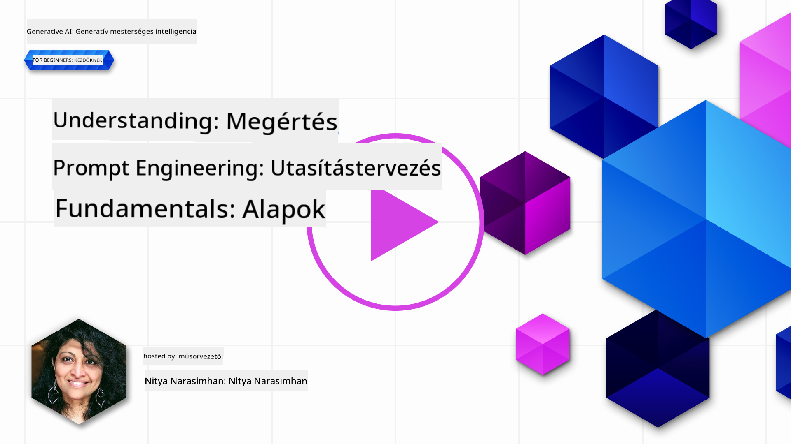
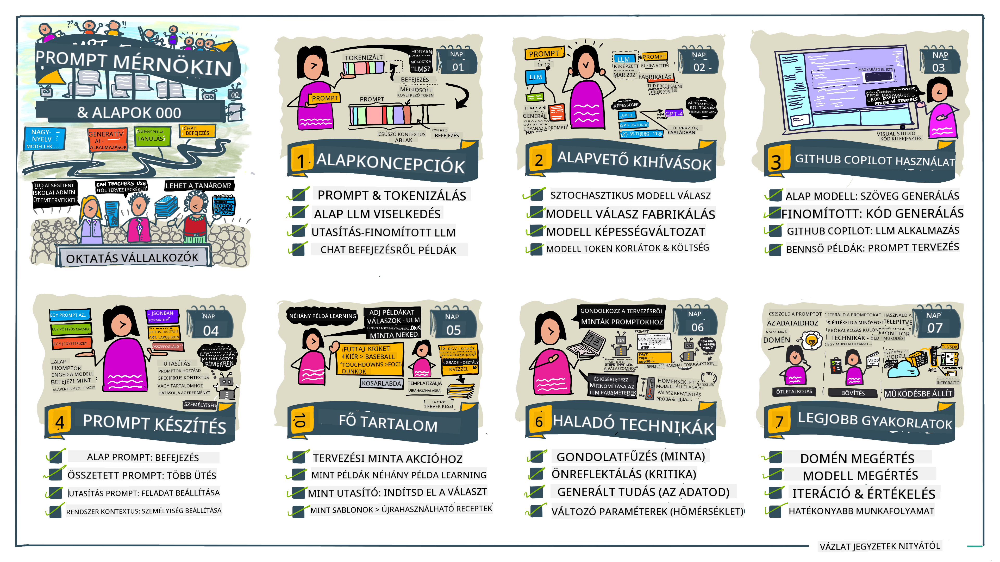
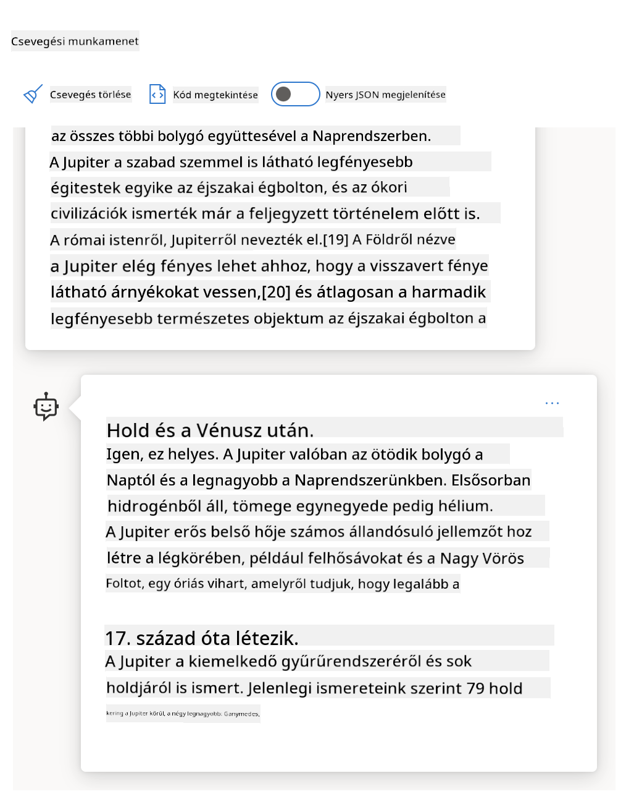
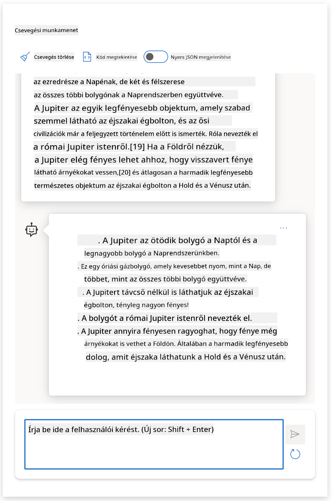
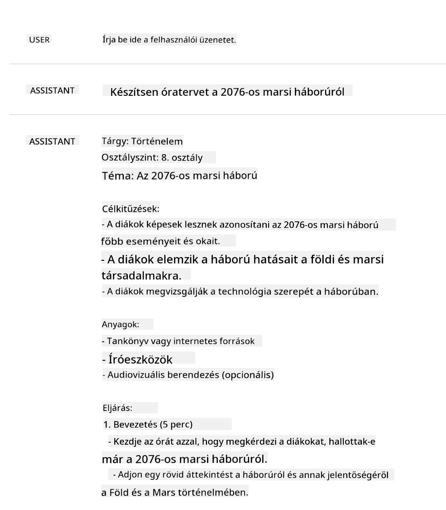
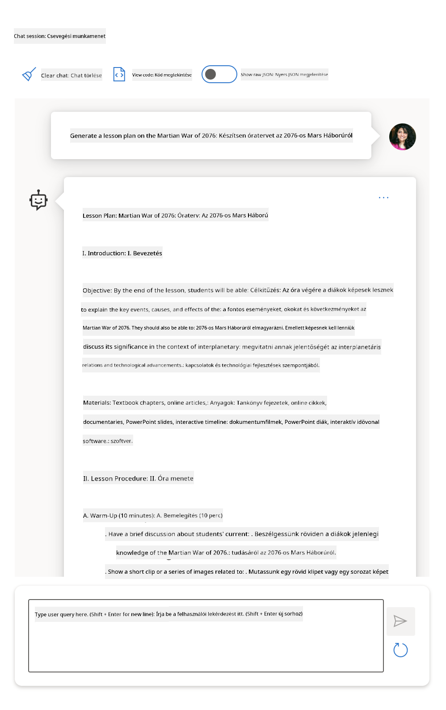
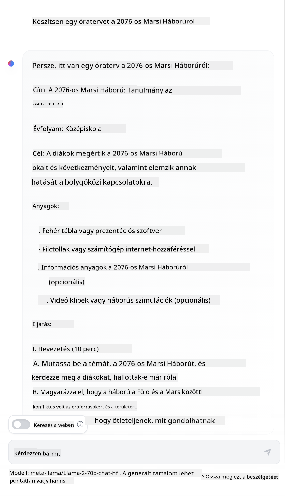

<!--
CO_OP_TRANSLATOR_METADATA:
{
  "original_hash": "dcbaaae026cb50fee071e690685b5843",
  "translation_date": "2025-08-26T18:52:07+00:00",
  "source_file": "04-prompt-engineering-fundamentals/README.md",
  "language_code": "hu"
}
-->
# Prompt Engineering Alapjai

[](https://aka.ms/gen-ai-lesson4-gh?WT.mc_id=academic-105485-koreyst)

## Bevezetés
Ez a modul bemutatja azokat a kulcsfontosságú fogalmakat és technikákat, amelyekkel hatékonyabb promptokat készíthetünk generatív AI modellek számára. Nem mindegy, hogyan írjuk meg a promptot egy LLM-nek. Egy gondosan megfogalmazott prompt jobb minőségű választ eredményezhet. De mit is jelentenek pontosan az olyan kifejezések, mint _prompt_ és _prompt engineering_? És hogyan javíthatom a prompt _inputot_, amit az LLM-nek küldök? Ezekre a kérdésekre keressük a választ ebben és a következő fejezetben.

A _generatív AI_ képes új tartalmakat létrehozni (pl. szöveg, kép, hang, kód stb.) a felhasználói kérésekre válaszul. Ezt olyan _nagy nyelvi modellek_ (Large Language Models) segítségével éri el, mint például az OpenAI GPT ("Generative Pre-trained Transformer") sorozata, amelyeket természetes nyelv és kód kezelésére tanítottak.

A felhasználók most már ismerős felületeken, például csevegésen keresztül kommunikálhatnak ezekkel a modellekkel, anélkül, hogy technikai tudásra vagy képzésre lenne szükségük. A modellek _prompt-alapúak_ – a felhasználó szöveges inputot (promptot) küld, és az AI válaszol (completion). Ezután többször is "beszélgethetnek" az AI-val, több körben finomítva a promptot, amíg a válasz megfelel az elvárásaiknak.

A "promptok" így a generatív AI alkalmazások elsődleges _programozási felületévé_ válnak, meghatározva, mit csináljon a modell, és befolyásolva a válaszok minőségét. A "Prompt Engineering" egy gyorsan fejlődő terület, amely a promptok _tervezésére és optimalizálására_ fókuszál, hogy megbízható és minőségi válaszokat kapjunk nagy mennyiségben.

## Tanulási célok

Ebben a leckében megtanuljuk, mi az a Prompt Engineering, miért fontos, és hogyan készíthetünk hatékonyabb promptokat egy adott modellhez és alkalmazási célhoz. Megismerjük a prompt engineering alapfogalmait és bevált gyakorlatait – valamint egy interaktív Jupyter Notebook "homokozó" környezetet, ahol ezek a fogalmak valódi példákon keresztül láthatók.

A lecke végére képesek leszünk:

1. Elmagyarázni, mi az a prompt engineering és miért fontos.
2. Leírni, milyen részekből áll egy prompt, és hogyan használjuk őket.
3. Megtanulni a prompt engineering legjobb gyakorlatait és technikáit.
4. Alkalmazni a tanultakat valódi példákon, egy OpenAI végponton keresztül.

## Kulcsfogalmak

Prompt Engineering: Az a gyakorlat, amikor úgy tervezünk és finomítunk inputokat, hogy az AI modellek a kívánt eredményeket adják.
Tokenizáció: Az a folyamat, amikor a szöveget kisebb egységekre, ún. tokenekre bontjuk, amelyeket a modell képes értelmezni és feldolgozni.
Instruction-Tuned LLMs: Olyan nagy nyelvi modellek (LLM-ek), amelyeket speciális utasításokkal finomhangoltak, hogy pontosabb és relevánsabb válaszokat adjanak.

## Tanulási Homokozó

A prompt engineering jelenleg inkább művészet, mint tudomány. A legjobb módja, hogy fejlesszük az intuíciót, ha _sokat gyakorlunk_, és próbálgatással, hibázással, az alkalmazási terület ismeretével, ajánlott technikákkal és modell-specifikus optimalizálással kombináljuk.

A leckéhez tartozó Jupyter Notebook egy _homokozó_ környezetet biztosít, ahol kipróbálhatod, amit tanulsz – akár menet közben, akár a kódos kihívás részeként a végén. A feladatok futtatásához szükséged lesz:

1. **Egy Azure OpenAI API kulcsra** – a szolgáltatás végpontjára, ahol egy LLM fut.
2. **Egy Python futtatókörnyezetre** – amiben a Notebook futtatható.
3. **Helyi környezeti változókra** – _végezd el most a [BEÁLLÍTÁS](./../00-course-setup/02-setup-local.md?WT.mc_id=academic-105485-koreyst) lépéseit, hogy készen állj_.

A notebookban _kezdő_ feladatok vannak – de bátran egészítsd ki saját _Markdown_ (leírás) és _Kód_ (prompt kérések) részekkel, hogy még több példát vagy ötletet kipróbálhass – és fejleszd a prompt tervezési érzékedet.

## Illusztrált útmutató

Szeretnéd először átlátni, miről szól ez a lecke? Nézd meg ezt az illusztrált útmutatót, amely bemutatja a fő témákat és a legfontosabb tanulságokat, amiket érdemes átgondolni. A lecke útvonala végigvezet a kulcsfogalmak és kihívások megértésétől azok kezeléséig, releváns prompt engineering technikákkal és bevált gyakorlatokkal. Figyelj rá, hogy az "Advanced Techniques" rész ebben az útmutatóban a tananyag _következő_ fejezetében lesz részletesen tárgyalva.



## A mi startupunk

Most nézzük meg, hogyan kapcsolódik _ez a téma_ a startup küldetésünkhöz, hogy [AI innovációt hozzunk az oktatásba](https://educationblog.microsoft.com/2023/06/collaborating-to-bring-ai-innovation-to-education?WT.mc_id=academic-105485-koreyst). AI-alapú, _személyre szabott tanulást_ támogató alkalmazásokat szeretnénk építeni – gondoljuk át, hogyan "tervezhetnek" promptokat az alkalmazásunk különböző felhasználói:

- **Adminisztrátorok** kérhetik az AI-t, hogy _elemezze a tantervi adatokat, és azonosítsa a lefedettségi hiányosságokat_. Az AI összefoglalhatja az eredményeket vagy kóddal vizualizálhatja őket.
- **Oktatók** kérhetik az AI-t, hogy _készítsen óravázlatot egy adott célcsoportnak és témára_. Az AI a megadott formátumban elkészítheti a személyre szabott tervet.
- **Diákok** kérhetik az AI-t, hogy _segítsen nekik egy nehéz tantárgyban_. Az AI most már személyre szabott órákkal, tippekkel és példákkal segítheti őket.

Ez csak a jéghegy csúcsa. Nézd meg a [Prompts For Education](https://github.com/microsoft/prompts-for-edu/tree/main?WT.mc_id=academic-105485-koreyst) oldalt – egy nyílt forráskódú prompt könyvtárat, amelyet oktatási szakértők válogattak össze – hogy átfogóbb képet kapj a lehetőségekről! _Próbálj ki néhány promptot a homokozóban vagy az OpenAI Playgroundban, és nézd meg, mi történik!_

<!--
LESSON TEMPLATE:
Ez az egység az alapfogalom #1-et mutatja be.
Példákkal és hivatkozásokkal erősítsd meg a fogalmat.

FOGALOM #1:
Prompt Engineering.
Határozd meg és magyarázd el, miért van rá szükség.
-->

## Mi az a Prompt Engineering?

A lecke elején úgy határoztuk meg a **Prompt Engineering**-et, mint azt a folyamatot, amikor _megtervezzük és optimalizáljuk_ a szöveges inputokat (promptokat), hogy egy adott alkalmazási célhoz és modellhez következetes és minőségi válaszokat (completions) kapjunk. Ez egy kétlépéses folyamatként is elképzelhető:

- _megtervezzük_ az első promptot az adott modellhez és célhoz
- _finomítjuk_ a promptot többször, hogy javítsuk a válasz minőségét

Ez szükségszerűen próbálgatásból és felhasználói intuícióból áll, hogy a lehető legjobb eredményt érjük el. De miért fontos ez? Ehhez először három fogalmat kell megértenünk:

- _Tokenizáció_ = hogyan "látja" a modell a promptot
- _Alap LLM-ek_ = hogyan "dolgozza fel" a promptot az alapmodell
- _Instruction-Tuned LLM-ek_ = hogyan látja a modell a "feladatokat"

### Tokenizáció

Egy LLM a promptokat _tokenek sorozataként_ látja, ahol különböző modellek (vagy ugyanazon modell különböző verziói) eltérően tokenizálhatják ugyanazt a promptot. Mivel az LLM-eket tokenekre tanítják (nem nyers szövegre), a prompt tokenizálásának módja közvetlenül befolyásolja a generált válasz minőségét.

Ha szeretnéd megérteni, hogyan működik a tokenizáció, próbáld ki például az [OpenAI Tokenizer](https://platform.openai.com/tokenizer?WT.mc_id=academic-105485-koreyst) eszközt. Másold be a promptodat – és nézd meg, hogyan alakulnak tokenekké, figyelve arra, hogyan kezeli a szóközöket és írásjeleket. Ez a példa egy régebbi LLM-et (GPT-3) mutat – egy újabb modellel más eredményt kaphatsz.


### Fogalom: Alapmodellek

Miután a prompt tokenizálva lett, az ["Alap LLM"](https://blog.gopenai.com/an-introduction-to-base-and-instruction-tuned-large-language-models-8de102c785a6?WT.mc_id=academic-105485-koreyst) (vagy alapmodell) fő feladata, hogy megjósolja a következő tokeneket a sorozatban. Mivel az LLM-ek hatalmas szöveg-adathalmazokon tanultak, jól ismerik a tokenek közötti statisztikai összefüggéseket, és magabiztosan tudnak jósolni. Fontos, hogy nem értik a promptban vagy tokenben lévő szavak _jelentését_; csak egy mintát látnak, amit "kiegészíthetnek" a következő jóslattal. A sorozatot addig folytatják, amíg a felhasználó le nem állítja, vagy el nem érnek egy előre beállított feltételt.

Szeretnéd látni, hogyan működik a prompt-alapú completion? Írd be a fenti promptot az Azure OpenAI Studio [_Chat Playground_](https://oai.azure.com/playground?WT.mc_id=academic-105485-koreyst) felületére az alapértelmezett beállításokkal. A rendszer úgy van beállítva, hogy a promptokat információkérésként kezelje – így olyan completion-t kapsz, ami megfelel ennek a kontextusnak.

De mi van, ha a felhasználó valami konkrétat szeretne, ami megfelel bizonyos feltételeknek vagy feladati célnak? Itt jönnek képbe az _instruction-tuned_ LLM-ek.



### Fogalom: Instruction Tuned LLM-ek

Egy [Instruction Tuned LLM](https://blog.gopenai.com/an-introduction-to-base-and-instruction-tuned-large-language-models-8de102c785a6?WT.mc_id=academic-105485-koreyst) az alapmodellből indul ki, és példákkal vagy input/output párokkal (pl. többszörös "üzenetekkel") finomhangolják, amelyekben világos utasítások szerepelnek – és az AI válasza igyekszik követni ezeket az utasításokat.

Ehhez olyan technikákat használnak, mint a Reinforcement Learning with Human Feedback (RLHF), amely megtanítja a modellt _utasítások követésére_ és _visszajelzésekből tanulásra_, így a válaszok jobban megfelelnek a gyakorlati alkalmazásoknak és relevánsabbak a felhasználói célokhoz.

Próbáljuk ki – nézzük meg újra a fenti promptot, de most módosítsuk a _rendszerüzenetet_, hogy az alábbi utasítást adjuk meg kontextusként:

> _Foglalja össze a kapott tartalmat egy második osztályos diák számára. Az eredmény legyen egy bekezdés, 3-5 felsorolással._

Látható, hogy az eredmény most már igazodik a kívánt célhoz és formátumhoz? Egy oktató ezt a választ közvetlenül felhasználhatja az óráján.



## Miért van szükség Prompt Engineeringre?

Most, hogy tudjuk, hogyan dolgozzák fel a promptokat az LLM-ek, beszéljünk arról, _miért_ van szükség prompt engineeringre. A válasz abban rejlik, hogy a jelenlegi LLM-ek számos kihívást jelentenek, amelyek miatt _megbízható és következetes completions_ elérése nehezebb, ha nem fektetünk energiát a promptok megalkotásába és optimalizálásába. Például:

1. **A modell válaszai sztochasztikusak.** Ugyanaz a _prompt_ valószínűleg eltérő válaszokat ad különböző modellekkel vagy modellverziókkal. Sőt, akár _ugyanazzal_ a modellel is különböző eredményeket kaphatunk különböző időpontokban. _A prompt engineering technikák segítenek minimalizálni ezeket a változásokat, jobb korlátokat adva._

1. **A modellek kitalált válaszokat adhatnak.** A modellek _nagy, de véges_ adathalmazokon tanultak, így nem ismerik azokat a fogalmakat, amelyek kívül esnek ezen a körön. Emiatt előfordulhat, hogy pontatlan, képzelt vagy akár ellentmondásos completions-t adnak. _A prompt engineering technikák segítenek felismerni és csökkenteni az ilyen kitalációkat, például ha hivatkozásokat vagy indoklást kérünk az AI-tól._

1. **A modellek képességei eltérőek lesznek.** Az újabb modellek vagy generációk gazdagabb képességekkel rendelkeznek, de egyedi sajátosságokat és kompromisszumokat is hoznak költségben és összetettségben. _A prompt engineering segít olyan bevált gyakorlatokat és munkafolyamatokat kialakítani, amelyek elrejtik a különbségeket, és rugalmasan alkalmazkodnak a modell-specifikus igényekhez, skálázható és zökkenőmentes módon._

Nézzük meg ezt a gyakorlatban az OpenAI vagy Azure OpenAI Playgroundban:

- Használd ugyanazt a promptot különböző LLM-ekkel (pl. OpenAI, Azure OpenAI, Hugging Face) – láttad a különbségeket?
- Használd ugyanazt a promptot többször _ugyanazzal_ az LLM-mel (pl. Azure OpenAI playground) – hogyan tértek el az eredmények?

### Fabrications példa

Ebben a kurzusban a **"fabrication"** kifejezést használjuk arra a jelenségre, amikor az LLM-ek néha tényszerűen hibás információkat generálnak a tanítási korlátok vagy egyéb okok miatt. Ezt a jelenséget néha _"hallucinációnak"_ is nevezik cikkekben vagy kutatásokban. Mi azonban javasoljuk, hogy inkább a _"fabrication"_ szót használd, hogy ne ruházzuk fel a gépi viselkedést emberi tulajdonsággal. Ez összhangban van a [Responsible AI ir
> **Feladat:** Készíts óravázlatot a 2076-os marsi háborúról.

# Óravázlat: A 2076-os marsi háború

## Célkitűzések
- Megérteni a 2076-os marsi háború főbb eseményeit és okait
- Elemzni a háború hatását a Földre és a Marsra
- Fejleszteni a kritikus gondolkodást a történelmi események értékelésében

## Bevezetés (10 perc)
- Rövid áttekintés a Mars kolonizációjáról a 21. században
- A feszültségek kialakulása a földi és marsi kolóniák között

## Fő események (20 perc)
- A háború kitörésének közvetlen okai
- Fontos csaták és fordulópontok
- A technológia szerepe a konfliktusban

## Hatások és következmények (15 perc)
- Politikai változások a Mars és a Föld között
- Társadalmi és gazdasági hatások
- Hosszú távú következmények a bolygóközi kapcsolatokra

## Vita és elemzés (15 perc)
- Mi vezetett a háborúhoz?
- Hogyan lehetett volna elkerülni a konfliktust?
- Milyen tanulságokat vonhatunk le a jövőre nézve?

## Feladatok
- Készíts egy idővonalat a háború főbb eseményeiről
- Írj egy rövid esszét arról, hogy szerinted mi volt a legfontosabb tanulság

## Összefoglalás (5 perc)
- A főbb pontok áttekintése
- Kérdések és válaszok

## Ajánlott források
- "Mars: A háború krónikája, 2076" (könyv)
- Interaktív térképek a marsi csatákról
- Dokumentumfilmek a marsi kolóniákról
Egy webes keresés alapján kiderült, hogy léteznek fiktív beszámolók (például tévésorozatok vagy könyvek) marsi háborúkról – de egyik sem 2076-ban játszódik. A józan ész is azt mondja, hogy 2076 _a jövőben van_, tehát nem köthető valós eseményhez.

Mi történik, ha ezt a promptot különböző LLM szolgáltatókkal futtatjuk le?

> **Válasz 1**: OpenAI Playground (GPT-35)



> **Válasz 2**: Azure OpenAI Playground (GPT-35)



> **Válasz 3**: : Hugging Face Chat Playground (LLama-2)



Ahogy várható volt, minden modell (vagy modellverzió) kicsit eltérő választ ad, mivel a működésük véletlenszerű és a képességeik is különböznek. Például az egyik modell 8. osztályos közönségnek szól, míg a másik középiskolásnak. De mindhárom válasz olyan, hogy egy tájékozatlan felhasználót könnyen meggyőzhetne arról, hogy az esemény valódi.

A prompt engineering technikák, mint például a _metaprompting_ vagy a _hőmérséklet beállítása_, bizonyos mértékig csökkenthetik a modellek téves válaszait. Az új prompt engineering _architektúrák_ pedig zökkenőmentesen építenek be új eszközöket és technikákat a prompt folyamatba, hogy mérsékeljék vagy csökkentsék ezeket a hatásokat.

## Esettanulmány: GitHub Copilot

Zárjuk le ezt a részt azzal, hogy megnézzük, hogyan használják a prompt engineeringet a való életben egy esettanulmányon keresztül: [GitHub Copilot](https://github.com/features/copilot?WT.mc_id=academic-105485-koreyst).

A GitHub Copilot az „AI páros programozód” – szöveges promptokat alakít át kódkiegészítésekké, és be van építve a fejlesztői környezetedbe (például Visual Studio Code), hogy gördülékeny legyen a felhasználói élmény. Az alábbi blogbejegyzésekből kiderül, hogy a legelső verzió az OpenAI Codex modellen alapult – a mérnökök pedig hamar rájöttek, hogy finomhangolni kell a modellt és jobb prompt engineering technikákat kell kidolgozni a kódminőség javítása érdekében. Júliusban [bemutattak egy továbbfejlesztett AI modellt, ami túlmutat a Codexen](https://github.blog/2023-07-28-smarter-more-efficient-coding-github-copilot-goes-beyond-codex-with-improved-ai-model/?WT.mc_id=academic-105485-koreyst), még gyorsabb javaslatokkal.

Olvasd el a bejegyzéseket sorrendben, hogy nyomon követhesd a tanulási folyamatukat.

- **2023. május** | [A GitHub Copilot egyre jobban érti a kódodat](https://github.blog/2023-05-17-how-github-copilot-is-getting-better-at-understanding-your-code/?WT.mc_id=academic-105485-koreyst)
- **2023. május** | [A GitHub belülről: Munka a Copilot mögötti LLM-ekkel](https://github.blog/2023-05-17-inside-github-working-with-the-llms-behind-github-copilot/?WT.mc_id=academic-105485-koreyst).
- **2023. június** | [Hogyan írj jobb promptokat a GitHub Copilothoz](https://github.blog/2023-06-20-how-to-write-better-prompts-for-github-copilot/?WT.mc_id=academic-105485-koreyst).
- **2023. július** | [.. A GitHub Copilot túlmutat a Codexen, továbbfejlesztett AI modellel](https://github.blog/2023-07-28-smarter-more-efficient-coding-github-copilot-goes-beyond-codex-with-improved-ai-model/?WT.mc_id=academic-105485-koreyst)
- **2023. július** | [Fejlesztői útmutató a prompt engineeringhez és LLM-ekhez](https://github.blog/2023-07-17-prompt-engineering-guide-generative-ai-llms/?WT.mc_id=academic-105485-koreyst)
- **2023. szeptember** | [Hogyan építs vállalati LLM alkalmazást: Tanulságok a GitHub Copilottól](https://github.blog/2023-09-06-how-to-build-an-enterprise-llm-application-lessons-from-github-copilot/?WT.mc_id=academic-105485-koreyst)

Böngészheted az [Engineering blogjukat](https://github.blog/category/engineering/?WT.mc_id=academic-105485-koreyst) is, ahol további bejegyzéseket találsz, például [ezt](https://github.blog/2023-09-27-how-i-used-github-copilot-chat-to-build-a-reactjs-gallery-prototype/?WT.mc_id=academic-105485-koreyst), ami bemutatja, hogyan alkalmazzák ezeket a modelleket és technikákat a való életben.

---

<!--
LECKE SABLON:
Ez az egység a 2. alapfogalmat kell, hogy lefedje.
Erősítsd meg a fogalmat példákkal és hivatkozásokkal.

FOGALOM #2:
Prompt tervezés.
Példákkal illusztrálva.
-->

## Prompt felépítése

Láttuk, miért fontos a prompt engineering – most nézzük meg, hogyan _épülnek fel_ a promptok, hogy értékelni tudjuk a különböző technikákat a hatékonyabb prompt tervezéshez.

### Alapvető Prompt

Kezdjük az alapvető prompttal: egy szöveges bemenet, amit minden további kontextus nélkül küldünk a modellnek. Például, ha az USA himnuszának első néhány szavát küldjük az OpenAI [Completion API](https://platform.openai.com/docs/api-reference/completions?WT.mc_id=academic-105485-koreyst) felé, azonnal _kiegészíti_ a választ a következő sorokkal, bemutatva az alapvető predikciós működést.

| Prompt (Bemenet)     | Kiegészítés (Kimenet)                                                                                                                        |
| :------------------- | :------------------------------------------------------------------------------------------------------------------------------------------- |
| Oh say can you see   | Úgy tűnik, az „The Star-Spangled Banner”, az Amerikai Egyesült Államok himnuszának szövegét kezdted el. A teljes szöveg a következő...        |

### Összetett Prompt

Most adjunk kontextust és utasításokat az alap prompthoz. A [Chat Completion API](https://learn.microsoft.com/azure/ai-services/openai/how-to/chatgpt?WT.mc_id=academic-105485-koreyst) lehetővé teszi, hogy összetett promptot alkossunk _üzenetek_ gyűjteményeként:

- Bemenet/kimenet párok, amelyek a _felhasználó_ kérdését és az _asszisztens_ válaszát tükrözik.
- Rendszerüzenet, amely beállítja az asszisztens viselkedésének vagy személyiségének kontextusát.

A kérés most az alábbi formában van, ahol a _tokenizáció_ hatékonyan rögzíti a releváns információkat a kontextusból és a beszélgetésből. A rendszer kontextusának megváltoztatása ugyanolyan nagy hatással lehet a kiegészítések minőségére, mint a felhasználói bemenetek.

```python
response = openai.chat.completions.create(
    model="gpt-3.5-turbo",
    messages=[
        {"role": "system", "content": "You are a helpful assistant."},
        {"role": "user", "content": "Who won the world series in 2020?"},
        {"role": "assistant", "content": "The Los Angeles Dodgers won the World Series in 2020."},
        {"role": "user", "content": "Where was it played?"}
    ]
)
```

### Utasítás Prompt

A fenti példákban a felhasználói prompt egy egyszerű szöveges lekérdezés volt, amit információkérésként lehet értelmezni. Az _utasítás_ promptokkal részletesebben megadhatjuk a feladatot, így az AI pontosabb útmutatást kap. Íme egy példa:

| Prompt (Bemenet)                                                                                                                                                                                                                         | Kiegészítés (Kimenet)                                                                                                        | Utasítás típusa     |
| :--------------------------------------------------------------------------------------------------------------------------------------------------------------------------------------------------------------------------------------- | :--------------------------------------------------------------------------------------------------------------------------- | :------------------ |
| Írj leírást a polgárháborúról                                                                                                                                                                      | _egyszerű bekezdést adott vissza_                                                                                            | Egyszerű            |
| Írj leírást a polgárháborúról. Adj meg kulcsdátumokat és eseményeket, és írd le a jelentőségüket.                                                                                                 | _bekezdést adott vissza, majd egy listát a kulcsdátumokról és leírásokról_                                                   | Összetett           |
| Írj leírást a polgárháborúról 1 bekezdésben. Adj 3 felsorolást kulcsdátumokkal és jelentőségükkel. Adj további 3 felsorolást kulcs történelmi szereplőkkel és hozzájárulásukkal. Az eredményt JSON fájlban add vissza. | _részletesebb információkat ad vissza egy szövegdobozban, JSON formátumban, amit kimásolhatsz és ellenőrizhetsz, ha szükséges_ | Összetett. Formázott.|

## Elsődleges tartalom

A fenti példákban a prompt még elég nyitott volt, így az LLM maga dönthette el, hogy a betanított adathalmaz mely része releváns. Az _elsődleges tartalom_ mintában a bemeneti szöveg két részre oszlik:

- egy utasítás (cselekvés)
- releváns tartalom (ami befolyásolja a cselekvést)

Íme egy példa, ahol az utasítás: „foglalja össze ezt 2 mondatban”.

| Prompt (Bemenet)                                                                                                                                                                                                                                                                                                                                                                                                                                                                                                                                                                                                                                                                                      | Kiegészítés (Kimenet)                                                                                                                                                                                                                                                                             |
| :-------------------------------------------------------------------------------------------------------------------------------------------------------------------------------------------------------------------------------------------------------------------------------------------------------------------------------------------------------------------------------------------------------------------------------------------------------------------------------------------------------------------------------------------------------------------------------------------------------------------------------------------------------------------------------------------------- | :---------------------------------------------------------------------------------------------------------------------------------------------------------------------------------------------------------------------------------------------------------------------------------------------- |
| A Jupiter az ötödik bolygó a Naptól, és a legnagyobb a Naprendszerben. Gázóriás, tömege az ezredrésze a Napénak, de két és félszerese a Naprendszer többi bolygójának együttvéve. A Jupiter az egyik legfényesebb szabad szemmel látható objektum az éjszakai égbolton, és már az ókori civilizációk is ismerték. A római Jupiter istenről kapta a nevét.[19] A Földről nézve a Jupiter elég fényes lehet ahhoz, hogy visszavert fénye látható árnyékokat vessen,[20] és átlagosan a harmadik legfényesebb természetes objektum az éjszakai égbolton a Hold és a Vénusz után. <br/> **Foglalja össze ezt 2 rövid mondatban** | A Jupiter az ötödik bolygó a Naptól, a Naprendszer legnagyobb bolygója, és az egyik legfényesebb objektum az éjszakai égbolton. A római Jupiter istenről kapta a nevét, gázóriás, amelynek tömege két és félszerese a többi bolygóénak együttvéve. |

Az elsődleges tartalom szegmens különböző módokon használható a hatékonyabb utasításokhoz:

- **Példák** – ahelyett, hogy explicit utasítást adnánk a modellnek, példákat mutatunk, és hagyjuk, hogy maga következtesse ki a mintát.
- **Cues** – az utasítás után egy „jelzést” adunk, ami előkészíti a kiegészítést, és a modellt relevánsabb válaszok felé tereli.
- **Sablonok** – ismétlődő „recept” promptok, amelyekben helykitöltők (változók) vannak, és konkrét adatokkal testre szabhatók.

Nézzük meg ezeket a gyakorlatban.

### Példák használata

Ez egy olyan megközelítés, ahol az elsődleges tartalommal „megtanítjuk a modellnek” néhány példát a kívánt kimenetre, és hagyjuk, hogy maga következtesse ki a mintát. A példák számától függően beszélhetünk zero-shot, one-shot, few-shot promptingról stb.

A prompt most három részből áll:

- Feladatleírás
- Néhány példa a kívánt kimenetre
- Egy új példa kezdete (ami implicit feladatleírásként működik)

| Tanulási típus | Prompt (Bemenet)                                                                                                                                        | Kiegészítés (Kimenet)         |
| :------------- | :------------------------------------------------------------------------------------------------------------------------------------------------------ | :---------------------------- |
| Zero-shot      | "The Sun is Shining". Translate to Spanish                                                                                                              | "El Sol está brillando".      |
| One-shot       | "The Sun is Shining" => ""El Sol está brillando". <br> "It's a Cold and Windy Day" =>                                                                   | "Es un día frío y ventoso".   |
| Few-shot       | The player ran the bases => Baseball <br/> The player hit an ace => Tennis <br/> The player hit a six => Cricket <br/> The player made a slam-dunk =>   | Basketball                    |
|                |                                                                                                                                                         |                               |

Látható, hogy zero-shot promptingnál explicit utasítást kellett adni („Translate to Spanish”), de one-shot promptingnál már a példából következtet a modell. A few-shot példában több példa segíti a modellt, hogy pontosabb következtetéseket vonjon le, utasítás nélkül.

### Prompt Cues

Egy másik technika az elsődleges tartalom használatára, ha _cues_-t, azaz jelzéseket adunk példák helyett. Ilyenkor egy kis részletet adunk, ami a kívánt válasz formátumát tükrözi, és a modell „veszi a jelzést”, hogy abban a stílusban folytassa.

| Cues száma      | Prompt (Bemenet)                                                                                                                                                                                                                                                                                                                                                                                                                                               | Kiegészítés (Kimenet)                                                                                                                                                                                                                                                                                       |
| :-------------- | :----------------------------------------------------------------------------------------------------------------------------------------------------------------------------------------------------------------------------------------------------------------------------------------------------------------------------------------------------------------------------------------------------------------------------------------------------------- | :-------------------------------------------------------------------------------------------------------------------------------------------------------------------------------------------------------------------------------------------------------------------------------------------------------- |
| 0               | A Jupiter az ötödik bolygó a Naptól, és a legnagyobb a Naprendszerben. Gázóriás, tömege az ezredrésze a Napénak, de két és félszerese a Naprendszer többi bolygójának együttvéve. A Jupiter az egyik legfényesebb szabad szemmel látható objektum az éjszakai égbolton, és már az ókori civilizációk is ismerték.

**Foglaljuk össze**                                       | A Jupiter a Naprendszer legnagyobb bolygója, az ötödik a Naptól számítva. Gázóriás, tömege az ezredrésze a Napénak, de nehezebb, mint az összes többi bolygó együttvéve. Az ókori civilizációk már régóta ismerték a Jupitert, és könnyen látható az éjszakai égbolton. |
| 1              | A Jupiter az ötödik bolygó a Naptól, és a legnagyobb a Naprendszerben. Gázóriás, tömege az ezredrésze a Napénak, de két és félszerese az összes többi bolygó tömegének együttvéve. A Jupiter az egyik legfényesebb objektum, amit szabad szemmel is láthatunk az éjszakai égbolton, és már az írott történelem előtti időkben is ismerték. <br/>**Foglaljuk össze** <br/> Amit megtanultunk: a Jupiter | az ötödik bolygó a Naptól, és a legnagyobb a Naprendszerben. Gázóriás, tömege az ezredrésze a Napénak, de két és félszerese az összes többi bolygó tömegének együttvéve. Könnyen látható szabad szemmel, és már az ókorban is ismerték.                        |
| 2              | A Jupiter az ötödik bolygó a Naptól, és a legnagyobb a Naprendszerben. Gázóriás, tömege az ezredrésze a Napénak, de két és félszerese az összes többi bolygó tömegének együttvéve. A Jupiter az egyik legfényesebb objektum, amit szabad szemmel is láthatunk az éjszakai égbolton, és már az írott történelem előtti időkben is ismerték. <br/>**Foglaljuk össze** <br/> Top 3 tény, amit megtanultunk:         | 1. A Jupiter az ötödik bolygó a Naptól, és a legnagyobb a Naprendszerben. <br/> 2. Gázóriás, tömege az ezredrésze a Napénak...<br/> 3. A Jupitert már az ókor óta szabad szemmel is láthatjuk ...                                                                       |
|                |                                                                                                                                                                                                                                                                                                                                                                                                                                                              |                                                                                                                                                                                                                                                                                                           |

### Prompt sablonok

A prompt sablon egy _előre meghatározott prompt recept_, amelyet el lehet menteni és újra felhasználni, hogy nagyobb léptékben is következetes felhasználói élményt biztosítsunk. A legegyszerűbb formájában ez egy prompt példákból álló gyűjtemény, mint [ez az OpenAI-tól](https://platform.openai.com/examples?WT.mc_id=academic-105485-koreyst), amely tartalmazza az interaktív prompt elemeket (felhasználói és rendszerüzenetek) és az API-alapú kérésformátumot is – így támogatva az újrahasznosítást.

Komplexebb formában, mint [ez a LangChain példája](https://python.langchain.com/docs/concepts/prompt_templates/?WT.mc_id=academic-105485-koreyst), _helyettesítő mezőket_ tartalmaz, amelyeket különböző forrásokból (felhasználói input, rendszerkörnyezet, külső adatforrások stb.) származó adatokkal lehet kitölteni, hogy dinamikusan generáljunk promptokat. Így létrehozhatunk egy újrahasznosítható prompt könyvtárat, amely programozottan is következetes felhasználói élményt biztosít nagy léptékben.

A sablonok igazi értéke abban rejlik, hogy _prompt könyvtárakat_ hozhatunk létre és publikálhatunk speciális alkalmazási területekre – ahol a prompt sablon már _optimalizált_ az adott alkalmazási kontextusra vagy példákra, így a válaszok relevánsabbak és pontosabbak lesznek a célközönség számára. A [Prompts For Edu](https://github.com/microsoft/prompts-for-edu?WT.mc_id=academic-105485-koreyst) repó remek példa erre, ahol az oktatási területhez gyűjtenek promptokat, kiemelve a fő célokat, mint az óratervezés, tantervfejlesztés, diákok segítése stb.

## Kiegészítő tartalom

Ha a prompt összeállítását úgy képzeljük el, hogy van egy utasítás (feladat) és egy cél (elsődleges tartalom), akkor a _másodlagos tartalom_ olyan további kontextus, amit azért adunk meg, hogy **valamilyen módon befolyásolja a kimenetet**. Lehetnek ezek finomhangolási paraméterek, formázási utasítások, témakategóriák stb., amelyek segítenek a modellnek _testreszabni_ a válaszát a kívánt felhasználói célokhoz vagy elvárásokhoz.

Például: Ha van egy tantárgykatalógusunk részletes metaadatokkal (név, leírás, szint, metaadat címkék, oktató stb.) az összes elérhető kurzusról:

- megadhatjuk utasításként, hogy "foglalja össze a 2023 őszi tantárgykatalógust"
- az elsődleges tartalommal példákat adhatunk a kívánt kimenetre
- a másodlagos tartalommal kiválaszthatjuk az 5 legfontosabb "címkét", ami érdekel minket.

Így a modell a példákban megadott formátumban tud összefoglalást adni – de ha egy eredményhez több címke tartozik, akkor előnyben részesítheti az 5 kiemelt címkét a másodlagos tartalom alapján.

---

<!--
LECKE SABLON:
Ez az egység az 1. alapfogalmat kell, hogy lefedje.
Erősítsd meg a fogalmat példákkal és hivatkozásokkal.

3. FOGALOM:
Prompt engineering technikák.
Mik az alapvető prompt engineering technikák?
Mutasd be néhány gyakorlattal.
-->

## Promptolási legjobb gyakorlatok

Most, hogy tudjuk, hogyan lehet promptokat _összeállítani_, elkezdhetünk azon gondolkodni, hogyan _tervezzük_ meg őket a legjobb gyakorlatok szerint. Ezt két részre bonthatjuk – a megfelelő _hozzáállásra_ és a megfelelő _technikák_ alkalmazására.

### Prompt engineering szemlélet

A prompt engineering próbálgatásos folyamat, ezért három fő irányelvet érdemes szem előtt tartani:

1. **A szakterület ismerete számít.** A válaszok pontossága és relevanciája attól függ, hogy _milyen területen_ működik az alkalmazás vagy a felhasználó. Használd az intuíciódat és szaktudásodat, hogy **tovább testreszabhasd a technikákat**. Például határozz meg _szakterületi személyiségeket_ a rendszer promptjaiban, vagy használj _szakterületi sablonokat_ a felhasználói promptokban. Adj meg másodlagos tartalmat, ami tükrözi a szakterületi kontextust, vagy használj _szakterületi jeleket és példákat_, hogy a modellt a megszokott használati minták felé tereld.

2. **A modell ismerete számít.** Tudjuk, hogy a modellek alapvetően sztochasztikusak. De a modell implementációk is eltérhetnek abban, hogy milyen tanító adathalmazt használnak (előtanult tudás), milyen képességeket kínálnak (pl. API vagy SDK), és milyen tartalomra vannak optimalizálva (pl. kód, képek vagy szöveg). Ismerd meg az általad használt modell erősségeit és korlátait, és ezt a tudást használd fel _feladatok priorizálására_ vagy _testreszabott sablonok_ készítésére, amelyek a modell képességeihez igazodnak.

3. **Az iteráció és validáció számít.** A modellek gyorsan fejlődnek, ahogy a prompt engineering technikák is. Szakértőként lehet, hogy van olyan kontextusod vagy kritériumod _a saját_ alkalmazásodhoz, ami nem feltétlenül érvényes a szélesebb közösségre. Használd a prompt engineering eszközöket és technikákat, hogy "beindítsd" a prompt összeállítást, majd iterálj és validáld az eredményeket a saját intuícióddal és szaktudásoddal. Jegyezd fel a tapasztalataidat, és hozz létre egy **tudásbázist** (pl. prompt könyvtárakat), amit mások is használhatnak kiindulási alapként, hogy a jövőben gyorsabban tudjanak iterálni.

## Legjobb gyakorlatok

Nézzük meg, melyek a leggyakoribb ajánlott legjobb gyakorlatok az [OpenAI](https://help.openai.com/en/articles/6654000-best-practices-for-prompt-engineering-with-openai-api?WT.mc_id=academic-105485-koreyst) és [Azure OpenAI](https://learn.microsoft.com/azure/ai-services/openai/concepts/prompt-engineering#best-practices?WT.mc_id=academic-105485-koreyst) szakértői szerint.

| Mi                              | Miért                                                                                                                                                                                                                                               |
| :-------------------------------- | :------------------------------------------------------------------------------------------------------------------------------------------------------------------------------------------------------------------------------------------------ |
| Értékeld a legújabb modelleket.       | Az új modellgenerációk valószínűleg jobb funkciókat és minőséget kínálnak – de lehet, hogy drágábbak is. Értékeld a hatásukat, majd dönts a váltásról.                                                                                |
| Válaszd szét az utasítást és a kontextust   | Nézd meg, hogy a modell/szolgáltató definiál-e _elválasztókat_, amelyekkel az utasításokat, elsődleges és másodlagos tartalmat egyértelműbben el lehet különíteni. Ez segíthet a modelleknek pontosabban súlyozni a tokeneket.                                                         |
| Légy konkrét és egyértelmű             | Adj meg minél több részletet a kívánt kontextusról, eredményről, hosszúságról, formátumról, stílusról stb. Ez javítja a válaszok minőségét és következetességét. Rögzítsd a recepteket újrahasznosítható sablonokban.                                                          |
| Légy leíró, használj példákat      | A modellek jobban reagálhatnak a "mutasd és magyarázd" megközelítésre. Kezdd egy `zero-shot` módszerrel, amikor csak utasítást adsz (példák nélkül), majd finomítsd `few-shot` példákkal, ahol néhány kívánt kimenetet is megadsz. Használj analógiákat. |
| Használj jeleket a válasz beindításához | Tereld a kívánt eredmény felé úgy, hogy megadsz néhány kezdő szót vagy kifejezést, amit a modell kiindulási pontként használhat a válaszhoz.                                                                                                               |
| Ismételd meg                       | Előfordulhat, hogy többször is el kell mondanod a modellnek az utasítást. Adj utasítást az elsődleges tartalom előtt és után, használj utasítást és jelet stb. Iterálj és validáld, hogy mi működik.                                                         |
| Számít a sorrend                     | Az információk sorrendje, ahogy a modellnek bemutatod, befolyásolhatja a kimenetet, akár a tanulási példákban is, a frissességi torzítás miatt. Próbálj ki több lehetőséget, hogy lásd, mi működik a legjobban.                                                               |
| Adj a modellnek "menekülő utat"           | Adj a modellnek egy _alternatív_ válaszlehetőséget, amit akkor adhat, ha valamiért nem tudja teljesíteni a feladatot. Ez csökkentheti a hamis vagy kitalált válaszok esélyét.                                                         |
|                                   |                                                                                                                                                                                                                                                   |

Mint minden legjobb gyakorlatnál, itt is igaz, hogy _az eredmény változhat_ a modelltől, a feladattól és a szakterülettől függően. Használd ezeket kiindulási alapként, és iterálj, hogy megtaláld, mi működik neked a legjobban. Folyamatosan értékeld újra a prompt engineering folyamatodat, ahogy új modellek és eszközök jelennek meg, a folyamat skálázhatóságára és a válaszok minőségére koncentrálva.

<!--
LECKE SABLON:
Ez az egység adjon kódos kihívást, ha releváns

KIHÍVÁS:
Link egy Jupyter Notebookhoz, ahol csak a kód kommentek vannak az utasításokban (a kód részek üresek).

MEGOLDÁS:
Link egy példányhoz, ahol a Notebookban a promptok ki vannak töltve és futtatva, bemutatva egy példát.
-->

## Feladat

Gratulálunk! Eljutottál a lecke végére! Itt az idő, hogy néhány fogalmat és technikát valódi példákon is kipróbálj!

A feladathoz egy Jupyter Notebookot fogunk használni, amelyben interaktívan végezhetsz gyakorlatokat. A Notebookot saját Markdown és kód cellákkal is bővítheted, hogy saját ötleteket és technikákat is kipróbálj.

### Kezdéshez forkold a repót, majd

- (Ajánlott) Indítsd el a GitHub Codespaces-t
- (Alternatív) Klónozd a repót a saját gépedre, és használd Docker Desktop-pal
- (Alternatív) Nyisd meg a Notebookot a kedvenc Notebook futtatókörnyezeteddel.

### Ezután állítsd be a környezeti változókat

- Másold a `.env.copy` fájlt a repó gyökeréből `.env`-be, és töltsd ki az `AZURE_OPENAI_API_KEY`, `AZURE_OPENAI_ENDPOINT` és `AZURE_OPENAI_DEPLOYMENT` értékeket. Térj vissza a [Learning Sandbox szekcióhoz](../../../04-prompt-engineering-fundamentals/04-prompt-engineering-fundamentals), hogy megtudd, hogyan.

### Ezután nyisd meg a Jupyter Notebookot

- Válaszd ki a futtató kernelt. Ha az 1. vagy 2. opciót használod, egyszerűen válaszd a dev konténer által biztosított alapértelmezett Python 3.10.x kernelt.

Már készen állsz a gyakorlatok futtatására. Fontos, hogy itt nincsenek _helyes vagy helytelen_ válaszok – csak próbálkozol, hogy megtaláld, mi működik az adott modellnél és alkalmazási területen.

_Ezért ebben a leckében nincsenek kódos megoldás szegmensek. Ehelyett a Notebookban lesznek "Saját megoldásom:" című Markdown cellák, amelyek egy példát mutatnak referenciaként._

 <!--
LECKE SABLON:
Zárd le az egységet összefoglalással és önálló tanulási forrásokkal.
-->

## Tudásellenőrzés

Melyik a jó prompt, amely megfelel néhány ésszerű legjobb gyakorlatnak?

1. Mutass egy piros autó képét
2. Mutass egy piros autó képét, Volvo márkájú, XC90 modell, egy szikla mellett parkol, naplementében
3. Mutass egy piros autó képét, Volvo márkájú, XC90 modell

A: A 2-es, mert részletezi, hogy "mit" szeretnénk, konkrét márkát és modellt ad meg, és leírja a környezetet is. A 3-as a következő legjobb, mert szintén sok leírást tartalmaz.

## 🚀 Kihívás

Próbáld ki, hogy tudod-e használni a "jel" technikát ezzel a prompttal: Fejezd be a mondatot: "Mutass egy piros autó képét, Volvo márkájú és ". Mit válaszol rá, és hogyan javítanád?

## Szép munka! Folytasd a tanulást

Szeretnél többet megtudni a Prompt Engineering különböző fogalmairól? Látogass el a [folytatólagos tanulás oldalra](https://aka.ms/genai-collection?WT.mc_id=academic-105485-koreyst), ahol további remek forrásokat találsz a témában.

Menj tovább az 5. leck

---

**Jogi nyilatkozat**:
Ez a dokumentum AI fordítási szolgáltatás, a [Co-op Translator](https://github.com/Azure/co-op-translator) segítségével készült. Bár törekszünk a pontosságra, kérjük, vegye figyelembe, hogy az automatikus fordítások hibákat vagy pontatlanságokat tartalmazhatnak. Az eredeti dokumentum eredeti nyelvű változata tekintendő hiteles forrásnak. Kritikus információk esetén javasoljuk a professzionális, emberi fordítást. Nem vállalunk felelősséget a fordítás használatából eredő félreértésekért vagy félreértelmezésekért.