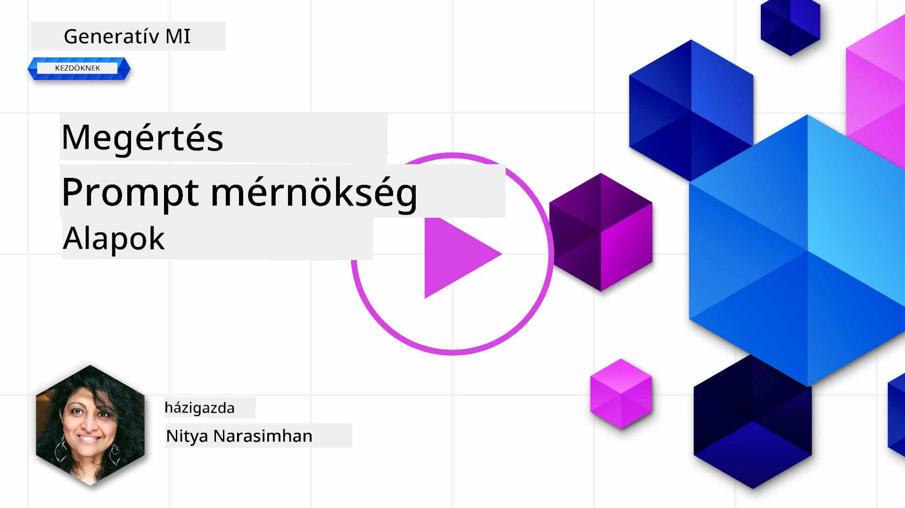
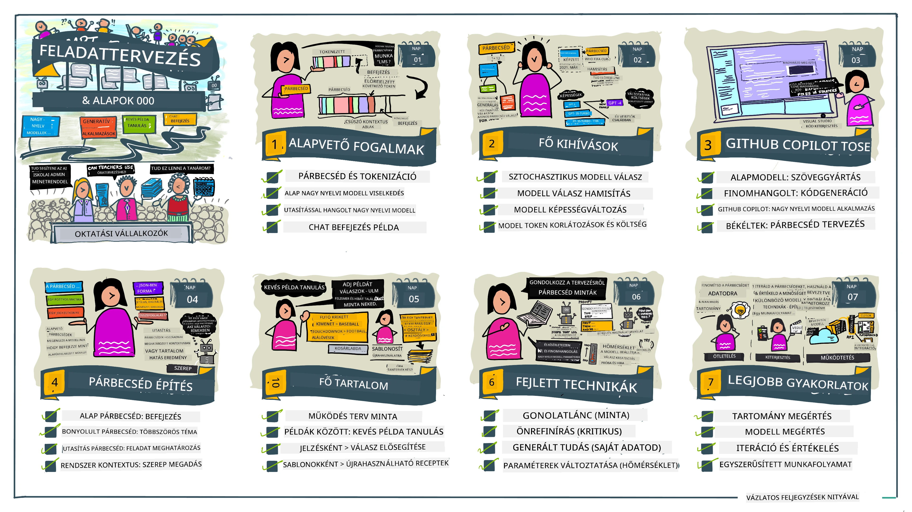
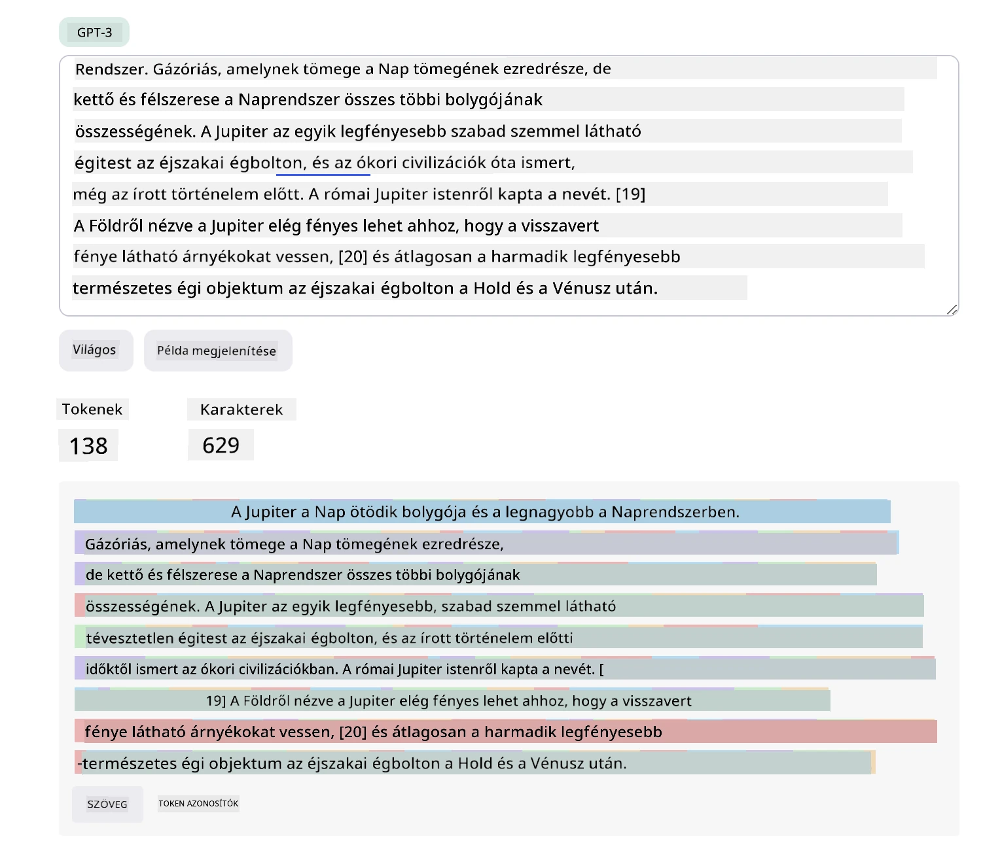
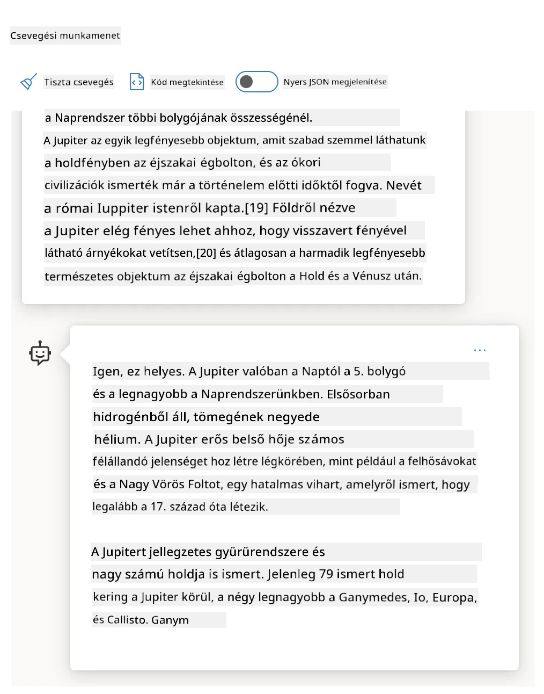
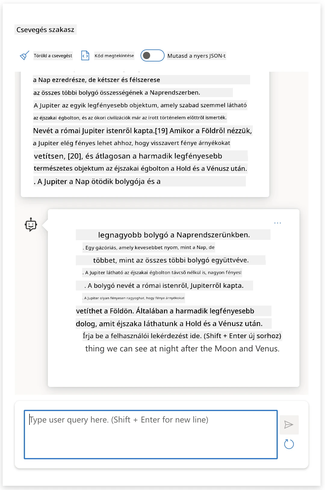
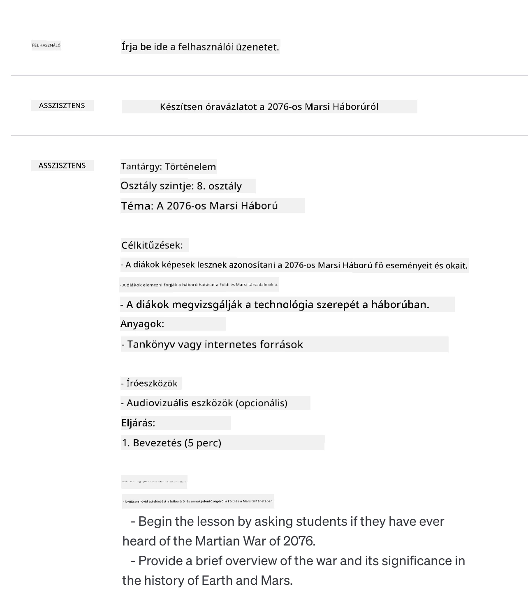
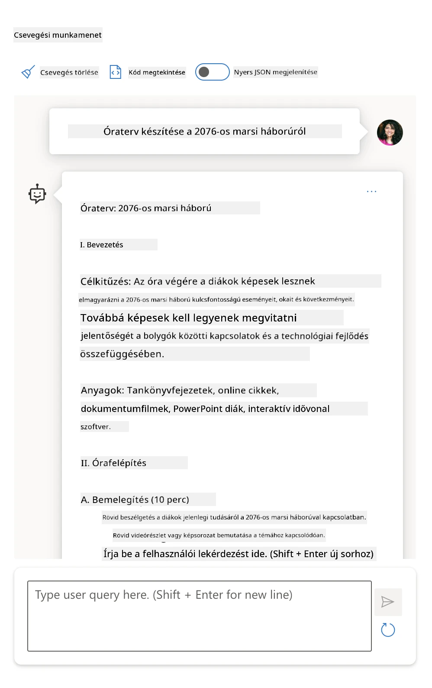
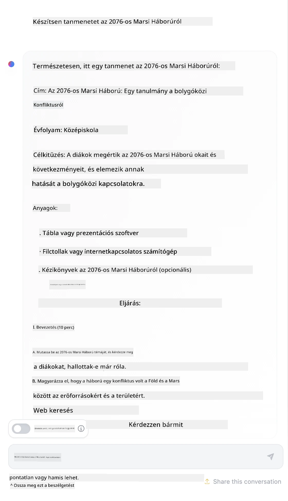

# Prompt mérnökség alapjai

[](https://youtu.be/GElCu2kUlRs?si=qrXsBvXnCW12epb8)

## Bevezetés
Ez a modul azokat az alapvető fogalmakat és technikákat tárgyalja, amelyek szükségesek hatékony promptok létrehozásához generatív AI modellekben. Az, hogy hogyan írjuk meg a promptunkat egy LLM-nek, szintén számít. Egy gondosan megtervezett prompt jobb minőségű választ eredményezhet. De pontosan mit jelentenek az olyan kifejezések, mint a _prompt_ és a _prompt mérnökség_? És hogyan fejleszthetem a prompt _bemenetet_, amit az LLM-nek küldök? Ezekre a kérdésekre próbálunk választ találni ebben a fejezetben és a következőben.

A _generatív AI_ képes új tartalmakat létrehozni (pl. szöveget, képeket, hangot, kódot stb.) a felhasználói kérésre reagálva. Ezt olyan _nagy nyelvi modelleken_ (Large Language Models) keresztül valósítja meg, mint az OpenAI GPT ("Generative Pre-trained Transformer") sorozata, amelyek természetes nyelvet és kódot is használnak a tanulás során.

A felhasználók most már ismerős párbeszédes formátumban léphetnek kapcsolatba ezekkel a modellekkel, bármiféle technikai tudás vagy tréning nélkül. A modellek _prompt alapúak_ – a felhasználók egy szöveges bemenetet (promptot) küldenek, és visszakapják az AI válaszát (completion). Ezután iteratív módon "beszélgethetnek az AI-val" többszörös fordulókban, finomítva a promptot, amíg a válasz nem felel meg az elvárásaiknak.

A „promptok” most a generatív AI alkalmazások elsődleges _programozási felületévé_ válnak, megmondva a modelleknek, hogy mit tegyenek, és befolyásolva a visszakapott válaszok minőségét. A „prompt mérnökség” egy gyorsan növekvő tudományterület, amely a promptok _tervezésére és optimalizálására_ fókuszál, hogy következetes és minőségi válaszokat nyújtson nagy léptékben.

## Tanulási célok

Ebben az leckében megtanuljuk, mi az a Prompt mérnökség, miért fontos, és hogyan készíthetünk hatékonyabb promptokat adott modell- és alkalmazási célokra. Megértjük az alapvető fogalmakat és legjobb gyakorlatokat a prompt mérnökséghez, és megismerkedünk egy interaktív Jupyter Notebook "sandbox" környezettel, ahol láthatjuk ezeknek a fogalmaknak a megvalósítását valós példákon.

A lecke végére képesek leszünk:

1. Elmagyarázni, mi a prompt mérnökség és miért fontos.
2. Leírni egy prompt elemeit és azok használatát.
3. Megtanulni a legjobb gyakorlatokat és technikákat a prompt mérnökségben.
4. Alkalmazni a megtanult technikákat valós példákon, OpenAI végponton keresztül.

## Főbb kifejezések

Prompt mérnökség: Az a gyakorlat, amely a bemenetek megtervezésére és finomhangolására fókuszál az AI modellek irányításához, hogy kívánt kimeneteket generáljanak.
Tokenizáció: A szöveg kisebb egységekre, úgynevezett tokenekre bontásának folyamata, amelyeket a modell képes értelmezni és feldolgozni.
Utasításokra hangolt LLM-ek: Olyan nagy nyelvi modellek, amelyeket speciális utasításokkal finomhangoltak, javítva a válaszok pontosságát és relevanciáját.

## Tanulási környezet

A prompt mérnökség jelenleg inkább művészet, mint tudomány. A legjobb módja annak, hogy javítsuk az intuíciót, ha _többet gyakorolunk_, és alkalmazunk egy próba-szerencse megközelítést, amely ötvözi az adott alkalmazási terület szakértelmét a javasolt technikákkal és a modell-specifikus optimalizálásokkal.

A tananyaghoz tartozó Jupyter Notebook biztosít egy _sandbox_ környezetet, ahol kipróbálhatod, amit tanultál – menet közben vagy a leckevégi kód kihívás részeként. A gyakorlatok futtatásához szükséges:

1. **Egy Azure OpenAI API kulcs** – a telepített LLM szolgáltatásvégpontja.
2. **Python futtatókörnyezet** – amelyben a Notebook futtatható.
3. **Helyi környezeti változók** – _most végezd el a [BEÁLLÍTÁS](./../00-course-setup/02-setup-local.md?WT.mc_id=academic-105485-koreyst) lépéseit, hogy készen állj_.

A notebook alap _gyakorlatokat_ tartalmaz – de bátorítunk, hogy adj hozzá saját _Markdown_ (leírás) és _Code_ (prompt kérések) szekciókat, hogy több példát vagy ötletet próbálj ki, és fejleszd a prompt tervezési intuíciódat.

## Illusztrált útmutató

Szeretnéd látni a leckében tárgyalt témák nagy képét, mielőtt belevágsz? Nézd meg ezt az illusztrált útmutatót, amely bemutatja a lefedett fő témákat és a kulcsfontosságú tanulságokat, amelyeket érdemes megfontolnod. Az útiterv végigvezet a főbb fogalmak és kihívások megértésétől azok kezelése felé, az érintett prompt mérnökségi technikákkal és legjobb gyakorlattal. Megjegyzendő, hogy a „Haladó technikák” szakasz az anyag ebben a tantervben a _következő_ fejezetében tárgyalt tartalomra utal.



## Startupunk

Most beszéljünk arról, hogy _ez a téma_ miként kapcsolódik startupunk küldetéséhez, hogy [AI innovációt hozzunk az oktatásba](https://educationblog.microsoft.com/2023/06/collaborating-to-bring-ai-innovation-to-education?WT.mc_id=academic-105485-koreyst). Személyre szabott tanulást támogató AI-alapú alkalmazásokat szeretnénk fejleszteni – nézzük meg, hogy az alkalmazásunk különböző felhasználói miként "tervezhetnek" promptokat:

- **Rendszergazdák** kérhetik az AI-t, hogy _elemezze a tanterv adatait, és azonosítsa a lefedetlenségeket_. Az AI összegezheti az eredményeket vagy kód segítségével vizualizálhatja azokat.
- **Oktatók** kérhetik az AI-t, hogy _készítsen tanmenetet egy célközönség és téma számára_. Az AI személyre szabott tervet készít előírt formátumban.
- **Diákok** kérhetik az AI-t, hogy _segítse őket nehéz tantárgyakban_. Az AI most oktatási anyagot, tippeket és példákat nyújt a szintjükre szabva.

Ez csak a jéghegy csúcsa. Nézd meg a [Prompts For Education](https://github.com/microsoft/prompts-for-edu/tree/main?WT.mc_id=academic-105485-koreyst) nevű nyílt forráskódú prompt könyvtárat, melyet oktatási szakértők válogattak össze – hogy szélesebb képet kapj a lehetőségekről! _Próbáld ki ezeket a promptokat a sandboxban vagy az OpenAI Playgroundban, hogy lásd, mi történik!_

<!--
LESSON TEMPLATE:
Ez az egység az alapvető koncepció #1-et tárgyalja.
Erősítse meg a koncepciót példákkal és hivatkozásokkal.

KONCEPCIÓ #1:
Prompt mérnökség.
Határozd meg és magyarázd meg, miért szükséges.
-->

## Mi az a Prompt mérnökség?

Ezt a leckét azzal kezdtük, hogy a **Prompt mérnökséget** úgy határoztuk meg, mint a szöveges bemenetek (promptok) _tervezésének és optimalizálásának_ folyamatát, amellyel következetes és minőségi válaszokat (completionöket) adhatunk adott alkalmazási célnak és modellnek. Ezt kétlépéses folyamatként képzelhetjük el:

- az adott modellre és célra vonatkozó kezdeti prompt _megtervezése_
- a prompt _finomítása_ iteratív módon a válasz minőségének javítása érdekében

Ez szükségszerűen egy próba-szerencse folyamat, amely felhasználói intuíciót és erőfeszítést igényel az optimális eredmény elérése érdekében. Miért fontos hát? Ehhez először három fogalmat kell megértenünk:

- _Tokenizáció_ = hogyan "látja" a promptot a modell
- _Alap LLM-ek_ = hogyan "dolgozza fel" egy alapmodell a promptot
- _Utasításokra hangolt LLM-ek_ = hogyan képes a modell most már "feladatokat" látni

### Tokenizáció

Az LLM a promptokat egy _tokenek sorozataként_ kezeli, ahol különböző modellek (vagy egy modell változatai) eltérő módon tokenizálhatják ugyanazt a promptot. Mivel az LLM-ek tokeneken (nem nyers szövegen) tanulnak, a promptok tokenizálásának módja közvetlen hatással van a generált válasz minőségére.

Ahhoz, hogy intuíciót szerezz a tokenizálásról, próbáld ki az alábbi [OpenAI Tokenizer](https://platform.openai.com/tokenizer?WT.mc_id=academic-105485-koreyst) eszközt. Másold be a promptodat – és nézd meg, hogyan alakul tokenekké, figyelve a szóköz karakterek és írásjelek kezelésére. Megjegyzendő, hogy ez a példa egy régebbi LLM-et (GPT-3) mutat – így egy újabb modellel eltérő eredményt kaphatsz.



### Fogalom: Alapmodellek

Ha a prompt tokenizálva lett, az ["Alap LLM"](https://blog.gopenai.com/an-introduction-to-base-and-instruction-tuned-large-language-models-8de102c785a6?WT.mc_id=academic-105485-koreyst) (vagy Alapmodell) elsődleges feladata előrejelezni a sorozat következő tokenjét. Mivel az LLM-ek hatalmas szövegkorpuszokon lettek tanítva, jól ismerik a tokenek közötti statisztikai összefüggéseket és képesek meglehetősen biztosan előre jelezni a sort. Fontos megérteni, hogy nem értik a szavak _jelentését_ a promptban vagy tokenben; csak egy mintát látnak, amit a következő előrejelzésükkel befejezhetnek. Addig folytatják az előrejelzést, amíg a felhasználó le nem állítja vagy valamilyen előre meghatározott feltétel nem teljesül.

Szeretnéd látni, hogyan működik egy prompt alapú befejezés? Írd be a fent említett promptot az Azure OpenAI Studio [_Chat Playground_](https://oai.azure.com/playground?WT.mc_id=academic-105485-koreyst) alapesetben lévő beállításaival. A rendszer úgy van konfigurálva, hogy a promptokat információkérésként értelmezze – így olyan befejezést kapsz, amely kielégíti ezt a kontextust.

De mi van akkor, ha a felhasználó valami specifikust akar látni, ami megfelel egy adott kritériumnak vagy feladatnak? Ekkor lépnek a képbe az _utasításokra hangolt_ LLM-ek.



### Fogalom: Utasításokra hangolt LLM-ek

Egy [utasításokra hangolt LLM](https://blog.gopenai.com/an-introduction-to-base-and-instruction-tuned-large-language-models-8de102c785a6?WT.mc_id=academic-105485-koreyst) az alapmodellre épül, de további finomhangolást kap példák vagy bemenet/kimenet párok (pl. többszörös fordulós „üzenetek”) alapján, amelyek egyértelmű utasításokat tartalmazhatnak – és az AI válasza megpróbál ezeknek az utasításoknak megfelelni.

Ez olyan technikákat használ, mint az Emberi Visszacsatolásos Megerősítéses Tanulás (Reinforcement Learning with Human Feedback, RLHF), ami megtaníthatja a modellt arra, hogy _kövesse az utasításokat_ és _tanuljon a visszacsatolásból_, így olyan válaszokat adjon, amelyek jobban megfelelnek a gyakorlati alkalmazásoknak és relevánsabbak a felhasználó céljaihoz.

Próbáljuk ki – térj vissza a fent említett prompthoz, de most változtasd meg a _rendszer üzenetet_, hogy az alábbi utasítást adja meg kontextusként:

> _Foglald össze a megadott tartalmat egy második osztályos diáknak. Tartsd egy bekezdésben 3-5 pontban._

Látod, hogyan hangolódtak a válaszok, hogy megfeleljenek a kívánt célnak és formátumnak? Egy oktató közvetlenül felhasználhatja ezt a választ az adott óra diáiban.



## Miért van szükség prompt mérnökségre?

Most, hogy tudjuk, hogyan dolgozzák fel a promptokat az LLM-ek, beszéljünk arról, _miért_ szükséges a prompt mérnökség. A válasz abban rejlik, hogy a jelenlegi LLM-eknek számos kihívása van, amelyek megnehezítik a _megbízható és következetes befejezéseket_ anélkül, hogy erőfeszítést fektetnénk a prompt felépítésébe és optimalizálásába. Például:

1. **A modellválaszok sztochasztikusak.** Ugyanaz a _prompt_ eltérő válaszokat eredményezhet különböző modelleknél vagy modellekkel. Sőt, ugyanazzal a _modellel_ is más eredmény jöhet ki különböző időpontokban. _A prompt mérnökség technikái segítenek minimalizálni ezeket a változásokat, jobb kereteket adva._

1. **A modellek hamis válaszokat generálhatnak.** A modelleket _nagy, de véges_ adatkészleteken tanították, tehát hiányzik a tudásuk a tanítási környezeten kívüli fogalmakról. Emiatt előfordulhat, hogy pontatlan, kitalált vagy közvetlenül ismert tényekkel ellentétes befejezéseket adnak. _A prompt mérnökség technikái segítenek a felhasználóknak ezek azonosításában és mérséklésében, például kérve az AI-t idézetekre vagy érvelésre._

1. **A modellek képességei eltérőek lehetnek.** Az újabb modellek vagy generációk gazdagabb képességeket hoznak, de egyedi furcsaságokat és költség- és bonyolultság-változásokat is. _A prompt mérnökség segít kialakítani legjobb gyakorlatokat és munkafolyamatokat, amelyek elvonatkoztatják a különbségeket és alkalmazkodnak a modell-specifikus követelményekhez skálázható és zökkenőmentes módon._

Nézzük meg, hogyan működik ez az OpenAI vagy Azure OpenAI Playgroundban:

- Használd ugyanazt a promptot különböző LLM telepítésekkel (pl. OpenAI, Azure OpenAI, Hugging Face) – láttad a különbségeket?
- Használd ugyanazt a promptot többször ugyanazzal az LLM telepítéssel (pl. Azure OpenAI playground) – hogyan változtak az eredmények?

### Hamis válaszok példája

Ebben a tanfolyamban a **„hamis válasz”** kifejezést használjuk arra a jelenségre, amikor az LLM-ek néha téves információkat generálnak a tanítási korlátaik vagy egyéb megszorításaik miatt. Ezt a jelenséget sokan _„hallucinációként”_ is említik populáris cikkekben vagy kutatási anyagokban. Azonban erősen ajánljuk a _„hamis válasz”_ kifejezés használatát, hogy elkerüljük az emberi vonások tulajdonítását egy gép által generált eredményre. Ez a megközelítés összhangban van a [Felelős AI irányelvekkel](https://www.microsoft.com/ai/responsible-ai?WT.mc_id=academic-105485-koreyst), fenntartva egy olyan terminológiát, amely nem sértő, és nem kizáró.

Szeretnéd megérteni, hogyan működnek a hamis válaszok? Gondolj egy promptjára, amely arra utasítja az AI-t, hogy generáljon tartalmat egy nem létező témában (így biztosan nincs benne a tanító adatok között). Például – én ezt a promptot próbáltam:

> **Prompt:** készíts tanmenetet a Marsi Háborúról 2076-ban.
A webes keresés azt mutatta, hogy voltak fiktív beszámolók (pl. televíziós sorozatok vagy könyvek) Marsi háborúkról – de egyik sem 2076-ban. Az észérvek is azt mondják, hogy 2076 _a jövőben van_, így tehát nem kapcsolható valós eseményhez.

Szóval mi történik, ha ezt a promptot különböző LLM szolgáltatókkal futtatjuk?

> **1. válasz**: OpenAI Playground (GPT-35)



> **2. válasz**: Azure OpenAI Playground (GPT-35)



> **3. válasz**: : Hugging Face Chat Playground (LLama-2)



Ahogy várható volt, minden modell (vagy modellváltozat) kissé eltérő válaszokat generál a sztochasztikus viselkedés és a modell-képességek változásai miatt. Például az egyik modell egy 8. osztályos közönséget céloz meg, míg a másik egy középiskolást feltételez. De mindhárom modell olyan válaszokat adott, amelyek képesek voltak meggyőzni egy tájékozatlan felhasználót, hogy az esemény valós volt.

A prompt tervezési technikák, mint például a _metaprompting_ és a _temperature konfiguráció_ bizonyos mértékben csökkenthetik a modell által generált hamis információkat. Új prompt tervezési _architektúrák_ is zökkenőmentesen beépítik az új eszközöket és technikákat a prompt folyamatába, hogy mérsékeljék vagy csökkentsék ezen hatásokat.

## Esettanulmány: GitHub Copilot

Zárjuk le ezt a részt azzal, hogy megismerjük, hogyan használják a prompt tervezést valós megoldásokban egy Esettanulmány segítségével: [GitHub Copilot](https://github.com/features/copilot?WT.mc_id=academic-105485-koreyst).

A GitHub Copilot az „AI Páros Programozód” – amely szöveges promptokat kód-kiegészítésekké alakít át, és integrált fejlesztői környezetedben (pl. Visual Studio Code) biztosít zökkenőmentes felhasználói élményt. Az alábbi blog-sorozat dokumentálja, hogy a korai verzió az OpenAI Codex modellen alapult – a fejlesztők gyorsan felismerték a modell finomhangolásának és jobb prompt mérnöki technikák kidolgozásának szükségességét, hogy javítsák a kód minőségét. Júliusban [bemutatták az Codex-en túlmutató továbbfejlesztett AI modellt](https://github.blog/2023-07-28-smarter-more-efficient-coding-github-copilot-goes-beyond-codex-with-improved-ai-model/?WT.mc_id=academic-105485-koreyst) az még gyorsabb javaslatok érdekében.

Olvasd el a bejegyzéseket sorrendben, hogy kövesd tanulási útjukat.

- **2023. május** | [A GitHub Copilot egyre jobb a kódod megértésében](https://github.blog/2023-05-17-how-github-copilot-is-getting-better-at-understanding-your-code/?WT.mc_id=academic-105485-koreyst)
- **2023. május** | [A GitHub belülről: a GitHub Copilot mögötti LLM-ek működése](https://github.blog/2023-05-17-inside-github-working-with-the-llms-behind-github-copilot/?WT.mc_id=academic-105485-koreyst)
- **2023. június** | [Hogyan írj jobb promptokat a GitHub Copilot számára](https://github.blog/2023-06-20-how-to-write-better-prompts-for-github-copilot/?WT.mc_id=academic-105485-koreyst)
- **2023. július** | [GitHub Copilot a Codex-en túl továbbfejlesztett AI modellel](https://github.blog/2023-07-28-smarter-more-efficient-coding-github-copilot-goes-beyond-codex-with-improved-ai-model/?WT.mc_id=academic-105485-koreyst)
- **2023. július** | [Fejlesztők útmutatója a prompt mérnökséghez és az LLM-ekhez](https://github.blog/2023-07-17-prompt-engineering-guide-generative-ai-llms/?WT.mc_id=academic-105485-koreyst)
- **2023. szeptember** | [Hogyan építsünk vállalati LLM alkalmazást: tanulságok a GitHub Copilotból](https://github.blog/2023-09-06-how-to-build-an-enterprise-llm-application-lessons-from-github-copilot/?WT.mc_id=academic-105485-koreyst)

Nézhetsz még bele a [Mérnöki blogjukba](https://github.blog/category/engineering/?WT.mc_id=academic-105485-koreyst), ahol további bejegyzéseket találsz, mint például [ez itt](https://github.blog/2023-09-27-how-i-used-github-copilot-chat-to-build-a-reactjs-gallery-prototype/?WT.mc_id=academic-105485-koreyst), amely bemutatja, hogyan _alkalmazzák_ ezeket a modelleket és technikákat valós alkalmazások fejlesztéséhez.

---

<!--
LESSON TEMPLATE:
This unit should cover core concept #2.
Reinforce the concept with examples and references.

CONCEPT #2:
Prompt Design.
Illustrated with examples.
-->

## Prompt építés

Már láttuk, miért fontos a prompt mérnökség – most értsük meg, hogyan _épülnek fel_ a promptok, hogy értékelni tudjuk a különböző technikákat a hatékonyabb prompt tervezés érdekében.

### Alap prompt

Kezdjük az alap prompttal: egy szöveges bemenet, ami más kontextus nélkül kerül a modellhez. Íme egy példa - amikor az Egyesült Államok nemzeti himnuszának első néhány szavát küldjük az OpenAI [Completion API](https://platform.openai.com/docs/api-reference/completions?WT.mc_id=academic-105485-koreyst)-nek, az azonnal _kiegészíti_ a választ a következő néhány sorral, bemutatva az alapvető előrejelző viselkedést.

| Prompt (Bemenet)     | Válasz (Kimenet)                                                                                                                        |
| :----------------- | :----------------------------------------------------------------------------------------------------------------------------------------- |
| Oh say can you see | Úgy hangzik, mintha az „A csillagos lobogó” című dal szövegét kezdenéd el, amely az Egyesült Államok nemzeti himnusza. A teljes dalszöveg ... |

### Összetett prompt

Most adjunk hozzá kontextust és utasításokat az alap prompthoz. A [Chat Completion API](https://learn.microsoft.com/azure/ai-services/openai/how-to/chatgpt?WT.mc_id=academic-105485-koreyst) lehetővé teszi összetett prompt összeállítását _üzenetek_ gyűjteményeként:

- Bemenet/kimenet párok, amelyek a _felhasználói_ inputot és _asszisztens_ választ tükrözik.
- Rendszerüzenet, amely beállítja az asszisztens viselkedésének vagy személyiségének kontextusát.

A kérés így az alábbi formában érkezik, ahol a _tokenizáció_ hatékonyan megragadja a releváns információkat a kontextusból és a beszélgetésből. A rendszerkontextus megváltoztatása egyaránt befolyásolhatja a válaszok minőségét, mint a felhasználói bemenetek.

```python
response = openai.chat.completions.create(
    model="gpt-3.5-turbo",
    messages=[
        {"role": "system", "content": "You are a helpful assistant."},
        {"role": "user", "content": "Who won the world series in 2020?"},
        {"role": "assistant", "content": "The Los Angeles Dodgers won the World Series in 2020."},
        {"role": "user", "content": "Where was it played?"}
    ]
)
```

### Instrukciós prompt

A fenti példákban a felhasználói prompt egyszerű, lekérdező jellegű volt, amely információkérésként értelmezhető. Az _utasítás_ promptokkal az adott szöveget arra használhatjuk, hogy egy feladatot részletesebben adjunk meg, és jobb iránymutatást nyújtsunk az AI-nak. Íme egy példa:

| Prompt (Bemenet)                                                                                                                                                                                                                         | Válasz (Kimenet)                                                                                                        | Instrukció típusa   |
| :------------------------------------------------------------------------------------------------------------------------------------------------------------------------------------------------------------------------------------- | :------------------------------------------------------------------------------------------------------------------------- | :------------------ |
| Írj leírást az amerikai polgárháborúról                                                                                                                                                                                                   | _egyszerű bekezdést adott vissza_                                                                                              | Egyszerű            |
| Írj leírást az amerikai polgárháborúról. Adj meg kulcsfontosságú dátumokat és eseményeket, valamint írd le azok jelentőségét                                                                                                                                     | _bekezdést adott, majd kulcsfontosságú események dátumait és leírásait listaként_                                             | Összetett           |
| Írj leírást az amerikai polgárháborúról 1 bekezdésben. Adj meg 3 felsorolást kulcsfontosságú dátumokról és jelentőségükről. Adj még 3 felsorolást fontos történelmi alakokról és hozzájárulásaikról. Add vissza az eredményt JSON fájlként | _részletesebb szöveges kimenetet ad vissza, JSON formátumban, amit másolni lehet fájlba és szükség szerint validálni_ | Összetett. Formázott. |

## Elsődleges tartalom

A fenti példákban a prompt még eléggé nyitott volt, engedve, hogy az LLM maga válassza meg, mely részek relevánsak a tanított adathalmazából. Az _elsődleges tartalom_ tervezési minta esetén a bemeneti szöveget két részre osztjuk:

- egy utasítás (művelet)
- releváns tartalom (ami befolyásolja a műveletet)

Íme egy példa, ahol az utasítás: „fogalmazd meg 2 mondatban”.

| Prompt (Bemenet)                                                                                                                                                                                                                                                                                                                                                                                                                                                                                                                                                                                                                                                                                      | Válasz (Kimenet)                                                                                                                                                                                                                                                                             |
| :-------------------------------------------------------------------------------------------------------------------------------------------------------------------------------------------------------------------------------------------------------------------------------------------------------------------------------------------------------------------------------------------------------------------------------------------------------------------------------------------------------------------------------------------------------------------------------------------------------------------------------------------------------------------------------------------------- | :---------------------------------------------------------------------------------------------------------------------------------------------------------------------------------------------------------------------------------------------------------------------------------------------- |
| A Jupiter az ötödik bolygó a Naptól, és a Naprendszer legnagyobb bolygója. Gáznagybolygó, amelynek tömege a Nap tömegének ezredrésze, de majdnem két és félszerese az összes többi bolygó tömegének együttvéve a Naprendszerben. A Jupiter az egyik legfényesebb tárgy, amit szabad szemmel lehet látni az éjszakai égbolton, és már az ókor óta ismert az emberiség előtt. Nevét a római Jupiter istenről kapta.[19] Amikor a Földről nézzük, a Jupiter fényes lehet annyira, hogy visszavert fénye látható árnyékokat vet,[20] és átlagosan a Hold és a Vénusz után a harmadik legfényesebb égi tárgy az éjszakai égbolton. <br/> **Fogalmazd meg ezt 2 rövid mondatban**             | A Jupiter, a Naprendszer ötödik bolygója, a legnagyobb a bolygók között, és az éjszakai égbolt egyik legfényesebb objektuma. Nevét a római Jupiter istenről kapta; gáznagybolygó, amelynek tömege több mint kétszerese az összes többi bolygó együttes tömegének. |

Az elsődleges tartalom szegmentezés különféleképpen használható a hatékonyabb utasítások megvalósítására:

- **Példák** – ahelyett, hogy expliciten mondanánk meg a modellnek, mit csináljon, példákat adunk, hogy mit várunk el, és hagyjuk, hogy felismerje a mintát.
- **Jelek** – az utasítás után olyan „jelzést” adunk, ami előkészíti a választ, és a modellt relevánsabb válaszok felé tereli.
- **Sablonok** – ismételhető „receptek” promptokhoz, változóhelyekkel, amelyeket adott adatokkal lehet személyre szabni specifikus esetekhez.

Nézzük meg ezeket a gyakorlatban!

### Példák használata

Ez az az eljárás, amely során az elsődleges tartalmat használjuk, hogy „etetjük a modellt” néhány példával a kívánt kimenetből egy adott utasításhoz, és hagyjuk, hogy felismerje a kimeneti mintát. Az alapján, hogy hány példát adunk, lehet nullalövéssel, egyetlen lövéssel, vagy több lövéssel promptolni.

A prompt most három részből áll:

- Egy feladatleírás
- Néhány példa a kívánt kimenetre
- Egy új példa kezdete (ami implikált feladatleírásként funkcionál)

| Tanulási típus | Prompt (Bemenet)                                                                                                                                               | Válasz (Kimenet)         |
| :------------ | :------------------------------------------------------------------------------------------------------------------------------------------------------------ | :------------------------ |
| Nullalövés    | „The Sun is Shining”. Fordítsd le spanyolra                                                                                                                  | „El Sol está brillando”.  |
| Egy lövés     | „The Sun is Shining” => „El Sol está brillando”. <br> „It's a Cold and Windy Day” =>                                                                          | „Es un día frío y ventoso”. |
| Több lövés   | A játékos végigfutotta az alapokat => Baseball <br/> A játékos ásszal ütött => Tenisz <br/> A játékos hatost ütött => Krikett <br/> A játékos zsákolt =>          | Kosárlabda                |
|               |                                                                                                                                                              |                           |

Vegyük észre, hogy nullalövéses promptolásnál expliciten kellett megadni az utasítást („Fordítsd le spanyolra”), de egy lövéses példánál ez már belátható. A több lövéses példánál pedig látható, hogy több példa megadása pontosabb következtetések levonását segíti elő anélkül, hogy további utasítást adnánk.

### Prompt jelek

Az elsődleges tartalom egy másik technikája a _jelek_ használata példák helyett. Ebben az esetben a modellt óvatosan irányítjuk úgy, hogy egy olyan töredékkel _indítjuk el_ a választ, ami visszatükrözi a várt válasz formátumát. A modell ezt a „jelet” követve folytatja a választ az adott stílusban vagy struktúrában.

| Jelek száma | Prompt (Bemenet)                                                                                                                                                                                                                                                                                                                                                                                                                                         | Válasz (Kimenet)                                                                                                                                                                                                                                                                                                   |
| :---------- | :------------------------------------------------------------------------------------------------------------------------------------------------------------------------------------------------------------------------------------------------------------------------------------------------------------------------------------------------------------------------------------------------------------------------------------------------------- | :----------------------------------------------------------------------------------------------------------------------------------------------------------------------------------------------------------------------------------------------------------------------------------------------------------------- |
| 0           | A Jupiter az ötödik bolygó a Naptól, és a Naprendszer legnagyobb bolygója. Gáznagybolygó, amelynek tömege a Nap tömegének ezredrésze, de majdnem két és félszerese az összes többi bolygó tömegének együttvéve a Naprendszerben. A Jupiter az egyik legfényesebb tárgy, amit szabad szemmel lehet látni az éjszakai égbolton, és már az ókor óta ismert az emberiség előtt. <br/>**Fogalmazd meg**                                                                                             | A Jupiter a Naprendszer legnagyobb bolygója és ötödik a Naptól. Gáznagybolygó, amelynek tömege a Nap tömegének ezredrésze, de nehezebb, mint az összes többi bolygó együttvéve. Az ókori civilizációk régóta ismerik, és jól látható az éjszakai égbolton.                                                                                                         |
| 1              | A Jupiter a Naprendszer ötödik bolygója és a legnagyobb a Naprendszerben. Egy gázóriás, amelynek tömege a Nap tömegének ezredrésze, de a többi bolygó együttes tömegének két és félszerese. A Jupiter az egyik legfényesebb égitest, amely szabad szemmel látható az éjszakai égbolton, és az ősi civilizációk óta ismert az írott történelem előtt is. <br/>**Összefoglaló** <br/> Amit megtudtunk, hogy a Jupiter | a Naprendszer ötödik bolygója és a legnagyobb a Naprendszerben. Egy gázóriás, amelynek tömege a Nap tömegének ezredrésze, de a többi bolygó együttes tömegének két és félszerese. Szabad szemmel könnyen látható, és az ókor óta ismert.                        |
| 2              | A Jupiter a Naprendszer ötödik bolygója és a legnagyobb a Naprendszerben. Egy gázóriás, amelynek tömege a Nap tömegének ezredrésze, de a többi bolygó együttes tömegének két és félszerese. A Jupiter az egyik legfényesebb égitest, amely szabad szemmel látható az éjszakai égbolton, és az ősi civilizációk óta ismert az írott történelem előtt is. <br/>**Összefoglaló** <br/> A 3 legfontosabb tény, amit megtanultunk:         | 1. A Jupiter a Naprendszer ötödik bolygója és a legnagyobb a Naprendszerben. <br/> 2. Egy gázóriás, amelynek tömege a Nap tömegének ezredrésze...<br/> 3. A Jupiter szabad szemmel látható az ókor óta ...                                                                       |
|                |                                                                                                                                                                                                                                                                                                                                                                                                                                                              |                                                                                                                                                                                                                                                                                                           |

### Prompt Sablonok

Egy prompt sablon egy _előre definiált recept egy prompthoz_, amely tárolható és újra felhasználható szükség szerint, hogy nagyobb következetességgel biztosítson felhasználói élményt. Egyszerű formájában ez egyszerűen egy gyűjtemény prompt példákból, mint például [ez az OpenAI-tól](https://platform.openai.com/examples?WT.mc_id=academic-105485-koreyst), amely tartalmazza az interaktív prompt komponenseket (felhasználói és rendszerüzenetek) és az API-alapú kérésformátumot - a könnyű újrafelhasználás érdekében.

Bonyolultabb formájában, mint például [ez a LangChain példája](https://python.langchain.com/docs/concepts/prompt_templates/?WT.mc_id=academic-105485-koreyst), tartalmaz _helyőrzőket_, amelyeket különböző forrásokból (felhasználói bemenet, rendszerkontextus, külső adatforrások stb.) származó adatokkal lehet helyettesíteni, így dinamikusan létrehozva egy promptot. Ez lehetővé teszi számunkra, hogy egy újrahasznosítható prompt könyvtárat hozzunk létre, amely **programozottan** támogatja a következetes felhasználói élményeket nagy léptékben.

Végül a sablonok valódi értéke az, hogy képesek vagyunk függőleges alkalmazási területekre _prompt könyvtárakat_ létrehozni és publikálni - ahol a prompt sablon _optimalizált_ az adott alkalmazás-specifikus kontextus vagy példák tükrözésére, így relevánsabbá és pontosabbá téve a válaszokat a célzott felhasználói közönség számára. A [Prompts For Edu](https://github.com/microsoft/prompts-for-edu?WT.mc_id=academic-105485-koreyst) tárhely jó példa erre a megközelítésre, oktatási célú prompt könyvtárakat gyűjt össze, különös tekintettel a fontos célokra, mint az óra tervezés, tanterv kialakítás, diákok oktatása stb.

## Támogató Tartalom

Ha úgy tekintünk a prompt létrehozására, hogy van egy utasítás (feladat) és egy cél (elsődleges tartalom), akkor a _másodlagos tartalom_ olyan, mint egy további kontextus, amit adunk, hogy **befolyásolja valamilyen módon a kimenetet**. Ez lehet hangolási paraméterek, formázási utasítások, témakörösztönzők stb., amelyek segítenek a modellnek _testreszabni_ a válaszát, hogy megfeleljen a kívánt felhasználói céloknak vagy elvárásoknak.

Például: Van egy kurzuskatalógus kiterjedt metaadatokkal (név, leírás, szint, metaadat címkék, oktató stb.) az összes tantermi kurzusról:

- Megadhatunk egy utasítást, hogy "foglalja össze a 2023 ősz kurzuskatalógusát"
- Az elsődleges tartalomban megadhatunk néhány példát a kívánt kimenetre
- A másodlagos tartalomban megjelölhetjük az 5 legfontosabb "címkét".

Most a modell összefoglalót tud adni a néhány példa alapján – de ha több címke van egy eredményben, előnyben részesítheti a másodlagos tartalomban megadott 5 címkét.

---

<!--
ÓRATERV SABLON:
Ez az egység a #1 alapfogalmat kell, hogy lefedje.
Erősítse a fogalmat példák és hivatkozások segítségével.

FELFOGALOM #3:
Prompttervezési technikák.
Melyek az alapvető prompttervezési módszerek?
Mutassa be néhány gyakorlat segítségével.
-->

## Promptolási Legjobb Gyakorlatok

Most, hogy tudjuk, hogyan lehet promptokat _felépíteni_, elkezdhetjük gondolkodni arról, hogyan _tervezzük_ meg ezeket, hogy tükrözzék a legjobb gyakorlatokat. Ezt két részre bonthatjuk - a megfelelő _gondolkodásmód_ kialakítására és a helyes _technikák_ alkalmazására.

### Prompttervezési Gondolkodásmód

A promptternyezés egy próbálkozás-alapú folyamat, ezért tarts három tág irányelvet szem előtt:

1. **A domain megértése számít.** A válasz pontossága és relevanciája olyan _területtől_ függ, ahol az alkalmazás vagy a felhasználó működik. Használd az intuíciódat és a domén szakértelmedet a **technikák testreszabására**. Például definiálj _domén-specifikus személyiségeket_ a rendszer promptjaidban, vagy használj _domén-specifikus sablonokat_ a felhasználói promptokban. Adj másodlagos tartalmat, amely tükrözi a domén-specifikus kontextust, vagy használj _domén-specifikus jelzéseket és példákat_, hogy a modellt irányítsd ismerős használati minták felé.

2. **A modell megértése számít.** Tudjuk, hogy a modellek természetükből adódóan sztocasztikusak. De a modellek implementációi is változhatnak az alapján, hogy milyen tanító adatállományt használnak (előre betanult tudás), milyen képességeket nyújtanak (pl. API vagy SDK), és milyen tartalomtípusra optimalizáltak (pl. kód vs. képek vs. szöveg). Ismerd meg az általad használt modell erősségeit és korlátait, és használd ezt az ismeretet, hogy _priorizáld a feladatokat_ vagy hozz létre _testreszabott sablonokat_, amelyek optimalizáltak a modell képességeire.

3. **Iteráció és validáció számít.** A modellek gyorsan fejlődnek, akárcsak a prompttervezési technikák. Domén szakértőként lehet, hogy van további kontextusod vagy kritériumod _a saját_ alkalmazásodra, ami nem feltétlenül érvényes a szélesebb közösségre. Használj prompttervezési eszközöket és technikákat a prompt készítés „gyors elindításához”, majd ismételj és validálj a saját intuíciód és szakértelmed alapján. Rögzítsd a tanulságaidat, és hozz létre egy **tudásbázist** (pl. prompt könyvtárakat), amely mások számára új alapként szolgálhat a későbbi gyorsabb iterációkhoz.

## Legjobb Gyakorlatok

Most nézzük meg a leggyakoribb, a [OpenAI](https://help.openai.com/en/articles/6654000-best-practices-for-prompt-engineering-with-openai-api?WT.mc_id=academic-105485-koreyst) és az [Azure OpenAI](https://learn.microsoft.com/azure/ai-services/openai/concepts/prompt-engineering#best-practices?WT.mc_id=academic-105485-koreyst) szakértői által ajánlott legjobb gyakorlatokat.

| Mi                              | Miért                                                                                                                                                                                                                                               |
| :------------------------------ | :------------------------------------------------------------------------------------------------------------------------------------------------------------------------------------------------------------------------------------------------- |
| Értékeld a legújabb modelleket. | Az új modellgenerációk valószínűleg jobb funkciókat és minőséget kínálnak – de nagyobb költséget is jelenthetnek. Értékeld hatásukat, és dönts a migrációról.                                                                                        |
| Válaszd szét az utasításokat és a kontextust. | Ellenőrizd, hogy a modell vagy a szolgáltató megad-e _elválasztókat_, hogy jobban elkülönítse az utasítást, az elsődleges és a másodlagos tartalmat. Ez segíthet a modelleknek pontosabban súlyozni a tokeneket.                                   |
| Légy pontos és világos.          | Adj több részletet a kívánt kontextusról, eredményről, hosszúságról, formátumról, stílusról stb. Ez javítja a válaszok minőségét és következetességét. Készíts eljárásokat újrahasználható sablonokban.                                              |
| Légy leíró, használj példákat    | A modellek jobban reagálhatnak a "mutasd és mondd el" megközelítésre. Kezdd egy „nulla-lövéses” (zero-shot) utasítással (példák nélkül), majd próbáld ki a „néhány-lövésest” (few-shot), több példa megadásával a kívánt kimenetre. Használj analógiákat.|
| Használj jelzéseket a kimenet felgyorsításához | Lökést adj egy kívánt eredmény felé, néhány vezető szó vagy kifejezés megadásával, amit a modell kiindulópontként használhat a válaszhoz.                                                                                                       |
| Ismételj meg többször            | Néha meg kell ismételned magad a modell számára. Adj utasítást az elsődleges tartalom előtt és után, használj utasítást és jelzést stb. Ismételj és ellenőrizz, mi működik.                                                                       |
| A sorrend számít                 | Az információ sorrendje, ahogy a modellhez kerül, befolyásolhatja a választ, még a tanulási példákban is, a friss emlékhatás (recency bias) miatt. Próbálj ki különböző lehetőségeket, hogy megtaláld a legjobbat.                                       |
| Adj kiút a modellnek             | Adj meg egy _visszaesési_ választási lehetőséget a modellnek, ha valamiért nem tudja teljesíteni a feladatot. Ez csökkentheti hamis vagy kitalált válaszok esélyét.                                                                                |
|                                 |                                                                                                                                                                                                                                                    |

Mint minden legjobb gyakorlat esetén, ne feledd, hogy _az eredmény változó_ a modell, a feladat és a domén függvényében. Használd ezeket kiindulópontként, majd ismételj, hogy megtaláld, mi működik a legjobban neked. Folyamatosan értékeld újra a prompttervezési folyamatot, ahogy új modellek és eszközök válnak elérhetővé, különös tekintettel a folyamat skálázhatóságára és a válaszok minőségére.

<!--
ÓRATERV SABLON:
Ez az egység rendelkezik kód kihívással, ha alkalmazható

KIHÍVÁS:
Hivatkozás egy Jupyter Notebookra, amelyben csak kód kommentek vannak az utasításokban (kódrészek üresek).

MEGOLDÁS:
Hivatkozás egy ilyen notebook másolatára, amelyben a promptok kitöltöttek és lefuttatottak, megmutatva egy példakimenetet.
-->

## Feladat

Gratulálunk! Eljutottál az óra végére! Itt az idő, hogy néhány fogalmat és technikát valós példákon tesztelj!

A feladatnál egy Jupyter notebookot fogunk használni, ahol interaktívan oldhatod meg a feladatokat. A notebookot saját Markdown és Kód cellákkal is bővítheted, hogy önállóan fedezd fel az ötleteket és technikákat.

### Kezdéshez készíts egy forkot a repóból, majd

- (Ajánlott) Indítsd el a GitHub Codespace-t
- (Alternatív) Klónozd a repót a helyi gépedre és használd Docker Desktop-tal
- (Alternatív) Nyisd meg a Notebookot kedvenc környezetedben.

### Ezután állítsd be a környezeti változókat

- Másold a .env.copy fájlt a repó gyökérkönyvtárába .env néven, és töltsd ki az `AZURE_OPENAI_API_KEY`, `AZURE_OPENAI_ENDPOINT` és `AZURE_OPENAI_DEPLOYMENT` értékeket. Térj vissza a [Learning Sandbox részhez](../../../04-prompt-engineering-fundamentals), hogy megtudd, hogyan.

### Ezután nyisd meg a Jupyter Notebookot

- Válaszd ki a futtató kernelt. Ha az 1. vagy 2. opciót használod, egyszerűen válaszd az alapértelmezett Python 3.10.x kernelt, amely a fejlesztői konténerben érhető el.

Készen állsz a feladatok futtatására. Ne feledd, itt nincs _helyes vagy helytelen_ válasz - inkább próbálgatásról és tapasztalatszerzésről szól az adott modell és alkalmazási domén esetén.

_Ezért nincs Kód Megoldás szakasz ebben az órában. Ehelyett a Notebook tartalmaz majd „Az én megoldásom:” című Markdown cellákat, amelyek az egyik példakimenetet mutatják be referencia gyanánt._

 <!--
ÓRATERV SABLON:
Összefoglalóval és önálló tanulási forrásokkal zárd a szakaszt.
-->

## Tudásellenőrzés

Melyik az alábbiak közül egy jó prompt, amely követ néhány ésszerű legjobb gyakorlatot?

1. Mutass egy képet egy piros autóról  
2. Mutass egy képet egy piros Volvó XC90-es autóról, amely egy sziklaperemen parkol, miközben a Nap lemegy  
3. Mutass egy képet egy piros Volvó XC90-es autóról

Válasz: 2, ez a legjobb prompt, mert részletezi, „mit”, és konkrét (nem csak bármilyen autó, hanem konkrét márka és modell), valamint leírja az egész környezetet is. A 3 következik, mert az is sok leírást tartalmaz.

## 🚀 Kihívás

Próbáld ki a „jelzés” technikát ezzel a promptra: Fejezd be a mondatot: „Mutass egy képet egy piros Volvó típusú autóról és...”. Mit válaszol rá a modell, és hogyan javítanád?

## Szép munka! Folytasd a tanulást

Szeretnél többet megtudni a különböző Prompttervezési fogalmakról? Látogass el a [folytató tanulási oldalra](https://aka.ms/genai-collection?WT.mc_id=academic-105485-koreyst), ahol további nagyszerű forrásokat találsz ebben a témában.

Most pedig irány az 5. lecke, ahol a [fejlett promptolási technikákat](../05-advanced-prompts/README.md?WT.mc_id=academic-105485-koreyst) veszünk szemügyre!

---

<!-- CO-OP TRANSLATOR DISCLAIMER START -->
**Nyilatkozat**:
Ezt a dokumentumot a [Co-op Translator](https://github.com/Azure/co-op-translator) AI fordítási szolgáltatás segítségével fordítottuk. Bár igyekszünk pontosak lenni, kérjük, vegye figyelembe, hogy az automatikus fordítás hibákat vagy pontatlanságokat tartalmazhat. Az eredeti, anyanyelvi dokumentum tekintendő hiteles forrásnak. Kritikus információk esetén professzionális, emberi fordítást javaslunk. Nem vállalunk felelősséget az ebből eredő félreértésekért vagy téves értelmezésekért.
<!-- CO-OP TRANSLATOR DISCLAIMER END -->