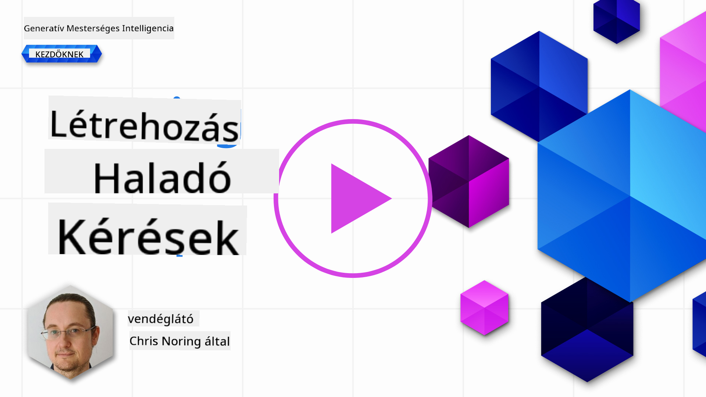

<!--
CO_OP_TRANSLATOR_METADATA:
{
  "original_hash": "b2651fb16bcfbc62b8e518751ed90fdb",
  "translation_date": "2025-10-17T21:21:40+00:00",
  "source_file": "05-advanced-prompts/README.md",
  "language_code": "hu"
}
-->
# Haladó promptok létrehozása

[](https://youtu.be/BAjzkaCdRok?si=NmUIyRf7-cDgbjtt)

Ismételjük át az előző fejezet tanulságait:

> A prompt _mérnöki munka_ az a folyamat, amely során **irányítjuk a modellt relevánsabb válaszok felé**, hasznosabb utasítások vagy kontextus megadásával.

A promptok írásának két lépése van: a prompt megalkotása, releváns kontextus megadásával, és az _optimalizálás_, azaz a prompt fokozatos javítása.

Ezen a ponton már van némi alapvető ismeretünk arról, hogyan kell promptokat írni, de mélyebbre kell ásnunk. Ebben a fejezetben a különböző promptok kipróbálásától eljutunk annak megértéséig, hogy miért jobb az egyik prompt a másiknál. Megtanuljuk, hogyan kell promptokat alkotni néhány alapvető technika követésével, amelyeket bármely LLM-re alkalmazhatunk.

## Bevezetés

Ebben a fejezetben az alábbi témákat fogjuk tárgyalni:

- Bővítse a prompt mérnöki ismereteit különböző technikák alkalmazásával.
- Állítsa be a promptokat az eltérő kimenetek érdekében.

## Tanulási célok

A lecke elvégzése után képes lesz:

- Olyan prompt mérnöki technikákat alkalmazni, amelyek javítják a promptok eredményét.
- Olyan promptokat létrehozni, amelyek vagy változatosak, vagy determinisztikusak.

## Prompt mérnöki munka

A prompt mérnöki munka olyan promptok létrehozásának folyamata, amelyek a kívánt eredményt hozzák létre. A prompt mérnöki munka több, mint egyszerű szöveges prompt írása. Ez nem egy mérnöki diszciplína, hanem inkább egy technikák halmaza, amelyeket alkalmazhatunk a kívánt eredmény eléréséhez.

### Egy példa egy promptra

Vegyünk egy alapvető promptot, például ezt:

> Generálj 10 kérdést a földrajzról.

Ebben a promptban valójában különböző prompt technikákat alkalmazunk.

Nézzük meg részletesen.

- **Kontextus**, megadjuk, hogy "földrajzról" szóljon.
- **Kimenet korlátozása**, legfeljebb 10 kérdést szeretnénk.

### Egyszerű promptok korlátai

Lehet, hogy nem kapjuk meg a kívánt eredményt. A kérdések generálva lesznek, de a földrajz nagy téma, és lehet, hogy nem azt kapjuk, amit szeretnénk, az alábbi okok miatt:

- **Nagy téma**, nem tudjuk, hogy országokról, fővárosokról, folyókról stb. fog szólni.
- **Formátum**, mi van, ha a kérdéseket egy bizonyos formátumban szeretnénk?

Ahogy látható, sok mindent figyelembe kell venni a promptok létrehozásakor.

Eddig láttunk egy egyszerű prompt példát, de a generatív AI sokkal többre képes, hogy segítsen az embereknek különböző szerepekben és iparágakban. Nézzük meg a következő alapvető technikákat.

### Prompt technikák

Először is meg kell értenünk, hogy a promptolás az LLM egy _felmerülő_ tulajdonsága, ami azt jelenti, hogy ez nem egy beépített funkció a modellben, hanem valami, amit a modell használata során fedezünk fel.

Van néhány alapvető technika, amelyeket használhatunk egy LLM promptolásához. Nézzük meg őket.

- **Zero-shot promptolás**, ez a promptolás legegyszerűbb formája. Ez egyetlen prompt, amely az LLM-től választ kér kizárólag a tanulási adatai alapján.
- **Few-shot promptolás**, ez a promptolás irányítja az LLM-t azáltal, hogy 1 vagy több példát ad, amelyekre támaszkodhat a válasz generálásához.
- **Chain-of-thought**, ez a promptolás arra utasítja az LLM-t, hogy bontsa le a problémát lépésekre.
- **Generált tudás**, a prompt válaszának javítása érdekében generált tényeket vagy tudást adhatunk hozzá a prompthoz.
- **Legkevesebbtől a legtöbbig**, hasonlóan a chain-of-thought-hoz, ez a technika arról szól, hogy egy problémát lépések sorozatára bontunk, majd kérjük, hogy ezeket a lépéseket sorrendben hajtsa végre.
- **Önrefinálás**, ez a technika az LLM kimenetének kritizálásáról szól, majd kérjük, hogy javítsa azt.
- **Maieutikus promptolás**, itt az a cél, hogy biztosítsuk az LLM válaszának helyességét, és kérjük, hogy magyarázza el a válasz különböző részeit. Ez az önrefinálás egyik formája.

### Zero-shot promptolás

Ez a promptolási stílus nagyon egyszerű, egyetlen promptból áll. Ez a technika valószínűleg az, amit használ, amikor elkezdi tanulni az LLM-eket. Íme egy példa:

- Prompt: "Mi az algebra?"
- Válasz: "Az algebra a matematika egy ága, amely a matematikai szimbólumokkal és azok manipulálásának szabályaival foglalkozik."

### Few-shot promptolás

Ez a promptolási stílus segíti a modellt azáltal, hogy néhány példát ad a kérés mellé. Egyetlen promptból áll, amelyhez további feladatspecifikus adatokat adunk. Íme egy példa:

- Prompt: "Írj egy verset Shakespeare stílusában. Íme néhány példa Shakespeare szonettjeire:
  Szonett 18: 'Hasonlítsalak-e egy nyári naphoz? Te szebb vagy és szelídebb...'
  Szonett 116: 'Ne engedj akadályt az igaz lelkek házasságában. A szerelem nem szerelem, ha változik, amikor változást talál...'
  Szonett 132: 'Szeretem szemeidet, és ők, mintha sajnálnának engem, tudván, hogy szíved megvetéssel gyötör...'
  Most írj egy szonettet a hold szépségéről."
- Válasz: "Az égen lágyan ragyog a hold, Ezüstös fényével, amely gyengéd kegyelmet áraszt..."

A példák segítenek az LLM-nek megérteni a kívánt kimenet kontextusát, formátumát vagy stílusát. Segítenek a modellnek pontosabb és relevánsabb válaszokat generálni.

### Chain-of-thought

A Chain-of-thought egy nagyon érdekes technika, mivel arról szól, hogy az LLM-et lépések sorozatán keresztül vezessük. Az ötlet az, hogy az LLM-et úgy utasítsuk, hogy megértse, hogyan kell valamit megtenni. Vegyük a következő példát, láncolt gondolatmenet nélkül és azzal:

    - Prompt: "Alice-nek 5 almája van, eldob 3 almát, ad 2-t Bobnak, és Bob visszaad egyet, hány almája van Alice-nek?"
    - Válasz: 5

Az LLM 5-tel válaszol, ami helytelen. A helyes válasz 1 alma, a számítás alapján (5 -3 -2 + 1 = 1).

Hogyan taníthatjuk meg az LLM-et, hogy ezt helyesen végezze el?

Próbáljuk ki a láncolt gondolatmenetet. A láncolt gondolatmenet alkalmazása azt jelenti:

1. Adjunk az LLM-nek egy hasonló példát.
1. Mutassuk meg a számítást, és hogyan kell helyesen kiszámítani.
1. Adjuk meg az eredeti promptot.

Így néz ki:

- Prompt: "Lisa-nak 7 almája van, eldob 1 almát, ad 4 almát Bartnak, és Bart visszaad egyet:
  7 -1 = 6
  6 -4 = 2
  2 +1 = 3  
  Alice-nek 5 almája van, eldob 3 almát, ad 2-t Bobnak, és Bob visszaad egyet, hány almája van Alice-nek?"
  Válasz: 1

Figyeljük meg, hogy lényegesen hosszabb promptokat írunk egy másik példával, egy számítással, majd az eredeti prompttal, és eljutunk a helyes válaszhoz, ami 1.

Ahogy látható, a láncolt gondolatmenet nagyon hatékony technika.

### Generált tudás

Sokszor, amikor promptot szeretnénk alkotni, azt a saját cégünk adataival szeretnénk megtenni. A prompt egy részének a cégből kell származnia, míg a másik résznek az aktuális promptnak kell lennie, amely iránt érdeklődünk.

Például, ha az biztosítási üzletágban dolgozik, a prompt így nézhet ki:

```text
{{company}}: {{company_name}}
{{products}}:
{{products_list}}
Please suggest an insurance given the following budget and requirements:
Budget: {{budget}}
Requirements: {{requirements}}
```

Fent látható, hogy a prompt hogyan van felépítve egy sablon segítségével. A sablonban számos változó található, amelyeket `{{variable}}` jelöl, és amelyeket a cég API-jából származó tényleges értékekkel helyettesítenek.

Íme egy példa arra, hogyan nézhet ki a prompt, miután a változókat a cég tartalmával helyettesítették:

```text
Insurance company: ACME Insurance
Insurance products (cost per month):
- Car, cheap, 500 USD
- Car, expensive, 1100 USD
- Home, cheap, 600 USD
- Home, expensive, 1200 USD
- Life, cheap, 100 USD

Please suggest an insurance given the following budget and requirements:
Budget: $1000
Requirements: Car, Home, and Life insurance
```

Ha ezt a promptot egy LLM-en keresztül futtatjuk, az alábbi választ kapjuk:

```output
Given the budget and requirements, we suggest the following insurance package from ACME Insurance:
- Car, cheap, 500 USD
- Home, cheap, 600 USD
- Life, cheap, 100 USD
Total cost: $1,200 USD
```

Ahogy látható, az LLM javasolja az életbiztosítást is, amit nem kellene. Ez az eredmény azt jelzi, hogy optimalizálnunk kell a promptot, hogy egyértelműbb legyen, mit engedhet meg. Néhány _próba és hiba_ után eljutunk a következő prompthoz:

```text
Insurance company: ACME Insurance
Insurance products (cost per month):
- type: Car, cheap, cost: 500 USD
- type: Car, expensive, cost: 1100 USD
- type: Home, cheap, cost: 600 USD
- type: Home, expensive, cost: 1200 USD
- type: Life, cheap, cost: 100 USD

Please suggest an insurance given the following budget and requirements:
Budget: $1000 restrict choice to types: Car, Home
```

Figyeljük meg, hogy a _típus_ és _költség_ hozzáadása, valamint a _korlátozás_ kulcsszó használata segít az LLM-nek megérteni, mit szeretnénk.

Most a következő választ kapjuk:

```output
Given the budget and requirements, we suggest the Car, Cheap insurance product which costs 500 USD per month.
```

Ennek a példának az volt a célja, hogy megmutassa, hogy bár egy alapvető technikát, például a _generált tudást_ használjuk, a legtöbb esetben még mindig optimalizálnunk kell a promptot a kívánt eredmény eléréséhez.

### Legkevesebbtől a legtöbbig

A Legkevesebbtől a legtöbbig promptolás ötlete az, hogy egy nagyobb problémát kisebb alproblémákra bontunk. Így segítünk az LLM-nek "meghódítani" a nagyobb problémát. Jó példa lehet az adatkutatás, ahol az LLM-től kérhetjük, hogy ossza fel a problémát így:

> Prompt: Hogyan végezzünk adatkutatást 5 lépésben?

Az AI asszisztens válasza:

1. Adatok gyűjtése
1. Adatok tisztítása
1. Adatok elemzése
1. Adatok ábrázolása
1. Adatok bemutatása

### Önrefinálás, az eredmények kritizálása

A generatív AI-k és LLM-ek esetében nem lehet megbízni a kimenetben. Ellenőrizni kell. Végül is az LLM csak azt mutatja meg, hogy mi a következő legvalószínűbb dolog, amit mondani kell, nem pedig azt, hogy mi a helyes. Ezért jó ötlet, ha megkérjük az LLM-et, hogy kritizálja önmagát, ami az önrefinálás technikájához vezet.

Hogyan működik? Kövesse az alábbi lépéseket:

1. Kezdeti prompt, amelyben az LLM-től kérünk egy probléma megoldását
1. Az LLM válaszol
1. Kritizáljuk a választ, és kérjük az AI-t, hogy javítsa
1. Az LLM újra válaszol, ezúttal figyelembe véve a kritikát, és javaslatokat tesz a megoldásra

Ezt a folyamatot annyiszor ismételheti, ahányszor csak szeretné.

Íme egy példa erre a technikára:

> Prompt: "Hozz létre egy Python Web API-t a termékek és ügyfelek útvonalával"

AI válasz:

```python
import flask
app = Flask(__name__)

@app.route('/products')
def products():
    return 'Products'

@app.route('/customers')
def customers():
    return 'Customers'
```

> Prompt: javasolj 3 javítást a fenti kódhoz

AI válasz:

```text
Sure, here are three suggestions to improve the code:

Import the correct module: The first line should import Flask instead of flask. The correct import statement should be from flask import Flask.

Add a main function: Add a if __name__ == '__main__': block to the end of the file to run the application when the file is executed.

Use f-strings: Use f-strings to format the return statements in the route functions. For example, return 'Products' can be changed to return f'This is the {request.path} page'.
```

```python
from flask import Flask, request

app = Flask(__name__)

@app.route('/products')
def products():
    return f'This is the {request.path} page'

@app.route('/customers')
def customers():
    return f'This is the {request.path} page'

if __name__ == '__main__':
    app.run()
```

Ahogy látható, a fenti AI válasz javítja az első javasolt kódot az első válasz kritikájának köszönhetően.

### Maieutikus promptolás

A maieutikus promptolás egy technika, amely hasonló az önrefináláshoz, de inkább arról szól, hogy az LLM-től kérjük, hogy magyarázza el önmagát. A cél az, hogy csökkentsük az LLM kimenetének ellentmondásait, és biztosítsuk, hogy helyes válaszra jusson. Az alábbi munkafolyamatot kell követni:

1. Kérje az LLM-t, hogy válaszoljon egy kérdésre
1. A válasz minden részéhez kérje az LLM-t, hogy magyarázza el részletesebben.
1. Ha vannak ellentmondások, dobja el az ellentmondásos részeket.

Ismételje meg a 2. és 3. lépést, amíg át nem ment az összes részen, és elégedett nem lesz a válasszal.

Íme egy példa prompt:

> prompt: Hogyan hozhatok létre válságtervet egy pandémia enyhítésére 5 lépésben?
> LLM válasz:

```text
1. Identify the risks
1. Identify the stakeholders
1. Identify the resources
1. Identify the actions
1. Identify the communication channels
```

Az LLM azonosított 5 lépést, de meg tudjuk-e határozni, hogy ez helyes? Kérjük meg az LLM-et, hogy magyarázza el az egyes lépéseket részletesebben:

> prompt: Magyarázd el az első lépést részletesebben, milyen kockázatok vannak részletesen egy pandémia esetén?

```text
The risks are the following:

- Loss of life
- Loss of business
- Loss of reputation
- Loss of customers
- Loss of employees
```

Ezen a ponton meg akarjuk győződni arról, hogy az LLM helyes, ezért kérjük, hogy magyarázza el az első kockázatot részletesebben, és reméljük, hogy következetes a fenti válasszal:

> prompt: Egy pandémia esetén mi a legnagyobb kockázat és miért?

```text
The biggest risk is loss of life because it's the most important thing to protect.
```

> Melyek a két legnagyobb kockázat egy pandémia esetén?

```text
The two biggest risks are loss of life and loss of business.
```

Ezen a ponton az LLM következetes, és megemlíti az "életet" és az "üzletet" mint a két legnagyobb kockázatot. Most folytathatjuk a következő lépéssel, és viszonylag magabiztosak lehetünk. Azonban nem szabad vakon megbízni az LLM-ben, mindig ellenőrizni kell a kimenetet.

## Változatos kimenet

Az LLM-ek természetüknél fogva nem determinisztikusak, ami azt jelenti, hogy minden alkalommal más eredményt kapunk, amikor ugyanazt a promptot futtatjuk. Próbálja ki például a következő promptot:

> "Generálj kódot egy Python Web API-hoz"

```python
# Import necessary modules
import flask
from flask import request, jsonify

# Create a Flask app
app = flask.Flask(__name__)

# Create a route for the API
@app.route('/api', methods=['GET'])
def api():
    # Get the data from the request
    data = request.args

    # Process the data
    result = process_data(data)

    # Return the result as JSON
    return jsonify(result)

# Function to process the data
def process_data(data):
    # Do something with the data
    result = data + 1

    # Return the result
    return result

# Run the app
if __name__ == '__main__':
    app.run()

```

Ugyanazt a promptot újra futtatva kissé eltérő választ kapunk:

```python
#import necessary packages
import flask
from flask import request, jsonify

#create the Flask application
app = flask.Flask(__name__)
app.config["DEBUG"] = True

#create a list of books
books = [
    {'id': 0,
     'title': 'A Fire Upon the Deep',
     'author': 'Vernor Vinge',
     'first_sentence': 'The coldsleep itself was dreamless.',
     'year_published': '1992'},
    {'id': 1,
     'title': 'The Ones Who Walk Away From Omelas',
     'author': 'Ursula K. Le Guin',
     'first_sentence': 'With a clamor of bells that set the swallows soaring, the Festival of Summer came to the city Omelas, bright-towered by the sea.',
     'published': '1973'},
    {'id': 2,
     'title': 'Dhalgren',
     'author': 'Samuel R. Delany',
     'first_sentence': 'to wound the autumnal city.',
     'published': '1975'}
]

#create an endpoint for the API
@app.route('/', methods=['GET'])
def home():
    return '''<h1>Books API</h1>
<p>A prototype API for retrieving books.</p>'''

#create an endpoint to return all books
@app.route('/api/v1/resources/books/all', methods=['GET'])
def api_all():
    return jsonify(books)

#create an endpoint to return a single book
@app.route('/api/v1/resources/books', methods=['GET'])
def api_id():
    #check if an ID was provided as part of the URL
    #if ID is provided, assign it to a variable
    #if no ID is provided, display an error
    if 'id' in request.args:
        id = int(request.args['id'])
    else:
        return "Error: No id field provided. Please specify an id."

    #create an empty list for our results
    results = []

    #loop through the data and match results that fit the requested ID
    #IDs are unique, but other fields might return many results
    for book in books:
        if book['id'] == id:
            results.append(book)

    #use the jsonify function from Flask to convert our list of
    #Python dictionaries to the JSON format
    return jsonify(results)

app.run()
```

> Tehát probléma a változatos kimenet?

Attól függ, hogy mit szeretne elérni. Ha konkrét választ szeretne, akkor ez probléma. Ha rendben van a változatos kimenet, például "Generálj bármilyen 3 kérdést a földrajzról", akkor ez nem probléma.

### A hőmérséklet használata a kimenet változatosságának szabályozására

Rendben, tehát eldöntöttük, hogy korlátozni szeretnénk a kimenetet, hogy kiszámíthatóbb, azaz inkább determinisztikus legyen. Hogyan érhetjük ezt el?

A hőmérséklet egy
Ahogy látható, az eredmények nem is lehettek volna változatosabbak.

> Ne feledd, hogy több paramétert is megváltoztathatsz az output variálásához, mint például top-k, top-p, ismétlési büntetés, hosszúsági büntetés és diverzitási büntetés, de ezek kívül esnek ennek a tananyagnak a keretein.

## Jó gyakorlatok

Számos gyakorlatot alkalmazhatsz annak érdekében, hogy elérd, amit szeretnél. Ahogy egyre többet használod a promptokat, megtalálod a saját stílusodat.

Az általunk tárgyalt technikákon túl van néhány jó gyakorlat, amit érdemes figyelembe venni, amikor egy LLM-et promptolsz.

Íme néhány jó gyakorlat, amit érdemes megfontolni:

- **Határozd meg a kontextust**. A kontextus számít, minél többet tudsz megadni, mint például a terület, téma stb., annál jobb.
- Korlátozd az outputot. Ha egy adott számú elemet vagy konkrét hosszúságot szeretnél, add meg.
- **Határozd meg, mit és hogyan**. Ne felejtsd el megemlíteni, hogy mit szeretnél és hogyan szeretnéd, például: "Hozz létre egy Python Web API-t, amely tartalmazza a termékek és ügyfelek útvonalait, oszd fel 3 fájlra".
- **Használj sablonokat**. Gyakran szeretnéd gazdagítani a promptjaidat a céged adataival. Használj sablonokat ehhez. A sablonok tartalmazhatnak változókat, amelyeket tényleges adatokkal helyettesíthetsz.
- **Írj helyesen**. Az LLM-ek valószínűleg helyes választ adnak, de ha helyesen írsz, jobb választ kapsz.

## Feladat

Itt van egy Python kód, amely bemutatja, hogyan lehet egyszerű API-t építeni Flask használatával:

```python
from flask import Flask, request

app = Flask(__name__)

@app.route('/')
def hello():
    name = request.args.get('name', 'World')
    return f'Hello, {name}!'

if __name__ == '__main__':
    app.run()
```
  
Használj egy AI asszisztenst, mint például GitHub Copilot vagy ChatGPT, és alkalmazd az "önfinomítás" technikát a kód javítására.

## Megoldás

Próbáld meg megoldani a feladatot úgy, hogy megfelelő promptokat adsz a kódhoz.

> [!TIP]  
> Fogalmazz meg egy promptot, amelyben javítást kérsz, jó ötlet korlátozni, hogy hány javítást kérsz. Kérheted, hogy bizonyos módon javítsa, például architektúra, teljesítmény, biztonság stb.

[Megoldás](../../../05-advanced-prompts/python/aoai-solution.py)

## Tudásellenőrzés

Miért használnám a chain-of-thought promptolást? Mutass egy helyes választ és két helytelen választ.

1. Azért, hogy megtanítsam az LLM-et egy probléma megoldására.  
1. B, Azért, hogy megtanítsam az LLM-et hibák keresésére a kódban.  
1. C, Azért, hogy utasítsam az LLM-et különböző megoldások kidolgozására.

A: 1, mert a chain-of-thought arról szól, hogy megmutatjuk az LLM-nek, hogyan oldjon meg egy problémát lépések sorozatával, valamint hasonló problémákat és azok megoldásait.

## 🚀 Kihívás

Az előző feladatban alkalmaztad az önfinomítás technikát. Vegyél egy programot, amit készítettél, és gondold át, milyen javításokat szeretnél alkalmazni rajta. Most használd az önfinomítás technikát a javasolt változtatások alkalmazására. Mit gondolsz az eredményről, jobb lett vagy rosszabb?

## Szép munka! Folytasd a tanulást

A lecke befejezése után nézd meg a [Generatív AI Tanulási gyűjteményt](https://aka.ms/genai-collection?WT.mc_id=academic-105485-koreyst), hogy tovább fejleszd a generatív AI tudásodat!

Lépj tovább a 6. leckére, ahol alkalmazzuk a Prompt Engineering ismereteinket [szöveggeneráló alkalmazások építésével](../06-text-generation-apps/README.md?WT.mc_id=academic-105485-koreyst).

---

**Felelősség kizárása**:  
Ez a dokumentum az [Co-op Translator](https://github.com/Azure/co-op-translator) AI fordítási szolgáltatás segítségével lett lefordítva. Bár törekszünk a pontosságra, kérjük, vegye figyelembe, hogy az automatikus fordítások hibákat vagy pontatlanságokat tartalmazhatnak. Az eredeti dokumentum az eredeti nyelvén tekintendő hiteles forrásnak. Kritikus információk esetén javasolt professzionális emberi fordítást igénybe venni. Nem vállalunk felelősséget semmilyen félreértésért vagy téves értelmezésért, amely a fordítás használatából eredhet.