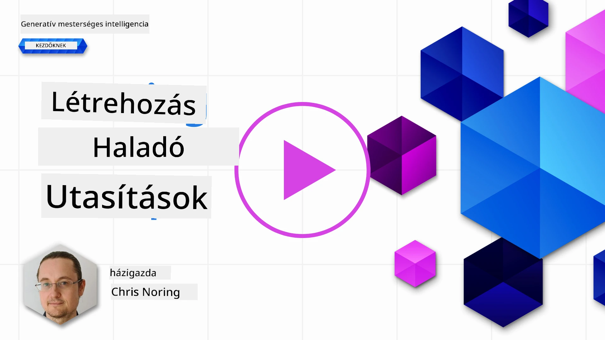

# Fejlett promptok létrehozása

[](https://youtu.be/BAjzkaCdRok?si=NmUIyRf7-cDgbjtt)

Tekintsük át a korábbi fejezet tanulságait:

> A prompt _tervezése_ az a folyamat, mely során **azzal irányítjuk a modellt relevánsabb válaszok felé**, hogy hasznosabb utasításokat vagy kontextust adunk meg.

A promptok írásának két lépése van: a prompt összeállítása, releváns kontextus megadásával, és az _optimalizálás_, vagyis hogyan fejlesszük fokozatosan a promptot.

Eddig alapvető ismereteket szereztünk a promptírásról, de mélyebbre kell mennünk. Ebben a fejezetben a különböző promptok kipróbálásától eljutunk addig, hogy megértsük, miért jobb az egyik prompt a másiknál. Megtanulod, hogyan építs fel promptokat alapvető technikákat követve, melyeket bármely LLM-re alkalmazhatsz.

## Bevezetés

Ebben a fejezetben a következő témákat tárgyaljuk:

- Bővítsd prompttervezési ismereteidet különböző technikák alkalmazásával.
- Állítsd be a promptjaidat, hogy változatos kimenetet kapj.

## Tanulási célok

A lecke elvégzése után képes leszel:

- Olyan prompttervezési technikákat alkalmazni, amelyek javítják a prompt kimenetelét.
- Változatos vagy determinisztikus promptot végrehajtani.

## Prompttervezés

A prompttervezés a promptok létrehozásának folyamata, melyek a kívánt eredményt hozzák létre. Nem csupán szöveges prompt írásáról van szó. A prompttervezés nem mérnöki tudományág, hanem egy technikák halmaza, amelyeket alkalmazhatsz, hogy elérd a kívánt eredményt.

### Egy példa egy promptra

Vegyük ezt az egyszerű promptot:

> Hozz létre 10 kérdést a földrajzról.

Ebben a promptban több különböző prompttechnika is megjelenik.

Nézzük szét.

- **Kontextus**, megadod, hogy „földrajzról” legyen szó.
- **Kimenet korlátozása**, nem szeretnél 10 kérdésnél többet.

### Az egyszerű promptolás korlátai

Lehet, hogy megkapod, amit szeretnél, de az is előfordulhat, hogy nem. A kérdések létrejönnek, de a földrajz egy nagy téma, és lehet, hogy nem azt kapod, amit szeretnél, a következő okok miatt:

- **Nagy téma**, nem tudhatod, hogy országokról, fővárosokról, folyókról vagy másról lesz szó.
- **Formátum**, mi van, ha a kérdések formázása is számít?

Láthatod, sok szempontot kell figyelembe venni prompt létrehozásakor.

Eddig egy egyszerű példát láttunk, de a generatív MI ennél sokkal többre képes, hogy segítsen különböző szerepekben és iparágakban. Vizsgáljunk meg néhány alapvető technikát.

### Promptolási technikák

Először meg kell értenünk, hogy a promptolás egy _emergens_ tulajdonsága az LLM-nek, vagyis nem egy beépített funkció, hanem olyasmi, amit használat közben fedezünk fel.

Vannak alapvető technikák, amiket használhatunk egy LLM promptolására. Nézzük őket.

- **Zero-shot promptolás**, ez a legáltalánosabb forma. Egyetlen prompt, amely a modell tanulási adatain alapuló választ kér.
- **Few-shot promptolás**, ebben a promptolási típusban egy vagy több példát adsz a modellnek, amire támaszkodhat a válasz generálásánál.
- **Gondolatmenet (chain-of-thought)**, ez a prompt típus az LLM-et arra tanítja, hogyan bontson le egy problémát lépésekre.
- **Generált tudás**, egy prompt válasz javítására kiegészítő generált tényeket vagy tudást adhatsz a promptod mellé.
- **Least to most (kevésől a legtöbbhöz)**, mint a gondolatmenet, itt a nagy problémát lépésekre bontod és ezek sorrendben végrehajtását kéred.
- **Önkritika (self-refine)**, ez a technika arról szól, hogy a modell kimenetét kritikával illeted, majd javítást kérsz tőle.
- **Maieutikus promptolás**. Itt a cél, hogy az LLM válaszát helyesnek biztosítsd, miközben arra kérd, magyarázza meg a válasz különböző részeit. Ez egyfajta önkritisztika.

### Zero-shot promptolás

Ez a promptolási mód nagyon egyszerű: egyetlen promptból áll. Ez valószínűleg az, amit akkor használsz, amikor elkezdesz megtanulni egy LLM használatát. Példa:

- Prompt: „Mi az algebra?”
- Válasz: „Az algebra a matematika egy ága, amely matematikai szimbólumokat és azok műveleti szabályait vizsgálja.”

### Few-shot promptolás

Ez a promptolási stílus példákat ad a kérés mellé, hogy segítsen a modellnek. Egyetlen prompt, kiegészítve bizonyos, feladatspecifikus adatokkal. Példa:

- Prompt: „Írj egy verset Shakespeare stílusában! Íme néhány példa Shakespeare-i szonettekre.:
  18. szonett: 'Hasonlítsalak-é nyár napjához? Szebb vagy mint a tűző nyár...'
  116. szonett: 'Ne engedjem szerelem útját akadályozni...'
  132. szonett: 'Szeretem szemeid, melyek engem sajnálnak...'
  Most írj egy szonettet a hold szépségéről.”
- Válasz: „Az égen holdfény puhán ragyog, Ezüstös fény, mely gyengéden ontja...”

A példák kontextust, formát és stílust adnak a modellnek. Segítenek megérteni a konkrét feladatot, így pontosabb, relevánsabb válaszokat ad.

### Gondolatmenet (Chain-of-thought)

A gondolatmenet egy érdekes technika, amely során az LLM-et lépéssorozaton keresztül vezeted. Az ötlet az, hogy az LLM-et úgy oktatod, hogy megértse, hogyan kell valamit lépésekre bontva megoldani. Nézzünk egy példát, gondolatmenettel és anélkül:

    - Prompt: „Alice-nek 5 almája van, dob 3-at, 2-t ad Bobnak, Bob pedig visszad ad egyet, hány almája van Alice-nek?”
    - Válasz: 5

Az LLM 5-öt ad válasznak, ami helytelen. A helyes válasz 1 alma, mert (5 -3 -2 + 1 = 1).

Hogyan tanítsuk meg helyesen oldani?

Próbáljuk meg a gondolatmenetet. Ez azt jelenti:

1. Adj az LLM-nek egy hasonló példát.
1. Mutasd meg a számítás menetét, hogyan kell helyesen számolni.
1. Add meg az eredeti promptot.

Így:

- Prompt: „Lisa-nek 7 almája van, dob 1 almát, 4-et ad Bartnak, Bart visszaad egyet:
  7 -1 = 6
  6 -4 = 2
  2 +1 = 3  
  Alice-nek 5 almája van, dob 3-at, 2-t ad Bobnak, Bob visszaad egyet, hány almája van Alice-nek?”
  Válasz: 1

Láthatod, hogy sokkal hosszabb promptot írunk még egy példával és számítással, majd az eredeti kérdéssel, így a helyes 1-es válaszhoz jutunk.

A gondolatmenet nagyon hatékony technika.

### Generált tudás

Gyakran, ha promptot akarsz építeni, saját céged adatait szeretnéd használni. A prompt egy része a cégtől származik, a másik rész pedig a valós prompt, ami érdekel.

Például, ha biztosítási üzletágban vagy, a prompt így is kinézhet:

```text
{{company}}: {{company_name}}
{{products}}:
{{products_list}}
Please suggest an insurance given the following budget and requirements:
Budget: {{budget}}
Requirements: {{requirements}}
```

Fent láthatod, hogy a prompt sablonból épül fel. A sablonban több változó van, `{{variable}}` formátumban, melyeket a cég API-ja valós értékekkel helyettesít.

Íme egy példa arra, hogyan nézhet ki egy prompt, amikor a változókat a céged tartalma helyettesíti:

```text
Insurance company: ACME Insurance
Insurance products (cost per month):
- Car, cheap, 500 USD
- Car, expensive, 1100 USD
- Home, cheap, 600 USD
- Home, expensive, 1200 USD
- Life, cheap, 100 USD

Please suggest an insurance given the following budget and requirements:
Budget: $1000
Requirements: Car, Home, and Life insurance
```

Ennek az LLM-en futtatva ilyen válasz születik:

```output
Given the budget and requirements, we suggest the following insurance package from ACME Insurance:
- Car, cheap, 500 USD
- Home, cheap, 600 USD
- Life, cheap, 100 USD
Total cost: $1,200 USD
```

Láthatod, az is javasolja az életbiztosítást, amit nem kellene. Ez arra utal, hogy optimalizálni kell a promptot úgy, hogy tisztábban jelezze, mit enged meg. Néhány _próba-hiba_ után a következő promptnál kötünk ki:

```text
Insurance company: ACME Insurance
Insurance products (cost per month):
- type: Car, cheap, cost: 500 USD
- type: Car, expensive, cost: 1100 USD
- type: Home, cheap, cost: 600 USD
- type: Home, expensive, cost: 1200 USD
- type: Life, cheap, cost: 100 USD

Please suggest an insurance given the following budget and requirements:
Budget: $1000 restrict choice to types: Car, Home
```

Figyeld meg, hogy a _típus_ és _költség_ hozzáadása, valamint a _restrict_ kulcsszó segít az LLM-nek megérteni a kérést.

Most az alábbi válasz érkezik:

```output
Given the budget and requirements, we suggest the Car, Cheap insurance product which costs 500 USD per month.
```

A példa célja megmutatni, hogy bár egy egyszerű technikát használunk, mint a _generált tudás_, a promptot gyakran optimalizálni kell a kívánt eredmény eléréséhez.

### Least-to-most (kevésől a legtöbbhöz)

A Least-to-most promptolási ötlet az, hogy egy nagyobb problémát kisebb alproblémákra bontasz. Így segíted az LLM-et, hogyan "hódítsa meg" a nagy problémát. Jó példa lehet az adat tudomány, ahol az LLM-et megkérdezed, hogy bontsa szét 5 lépésben a feladatot:

> Prompt: Hogyan végezzünk adat tudományt 5 lépésben?

Az AI segéd a következő választ adja:

1. Adatok gyűjtése
1. Adatok megtisztítása
1. Adatok elemzése
1. Adatok ábrázolása
1. Adatok bemutatása

### Önkritika, az eredmények kritikája

A generatív MI-k és LLM-ek esetében nem bízhatsz vakon a kimenetben. Ellenőrizned kell. Az LLM csak a legvalószínűbb következő szót vagy kifejezést adja, nem a helyes választ. Ezért jó ötlet, ha magát az LLM-et kéred önkritikára, ami az önkritika technikája.

A folyamat így működik:

1. Kezdeti prompt, amely megoldást kér a modelltől
1. LLM válaszol
1. Kritikát írsz a válaszra, és kéred az AI-t, hogy javítsa
1. LLM újra válaszol, figyelembe véve a kritikát, és javaslatokat tesz

Ezt a folyamatot akárhányszor megismételheted.

Példa erre a technikára:

> Prompt: „Készíts Python Web API-t a termékek és vásárlók útvonalaival”

AI válasza:

```python
import flask
app = Flask(__name__)

@app.route('/products')
def products():
    return 'Products'

@app.route('/customers')
def customers():
    return 'Customers'
```

> Prompt: javasolj 3 javítást a fenti kódon

AI válasza:

```text
Sure, here are three suggestions to improve the code:

Import the correct module: The first line should import Flask instead of flask. The correct import statement should be from flask import Flask.

Add a main function: Add a if __name__ == '__main__': block to the end of the file to run the application when the file is executed.

Use f-strings: Use f-strings to format the return statements in the route functions. For example, return 'Products' can be changed to return f'This is the {request.path} page'.
```

```python
from flask import Flask, request

app = Flask(__name__)

@app.route('/products')
def products():
    return f'This is the {request.path} page'

@app.route('/customers')
def customers():
    return f'This is the {request.path} page'

if __name__ == '__main__':
    app.run()
```

Láthatod, hogy az AI az első javasolt kódot javítja a kritika alapján.

### Maieutikus promptolás

A maieutikus promptolás egy technika, amely hasonló az önkritikához, de inkább arra kérd az LLM-et, magyarázza meg magát. A cél, hogy csökkentsük a válasz következetlenségeit és biztosítsuk a helyes választ. A folyamat:

1. Kérd meg az LLM-et, hogy válaszoljon egy kérdésre
1. A válasz minden részletét kérd meg mélyebb magyarázatra.
1. Ha következetlenség van, dobd el az ellentmondó részeket.

Ismételd a 2. és 3. lépéseket, amíg a teljes választ végig nem vetted és elégedett vagy.

Példa prompt:

> prompt: Hogyan készíthetek válságtervet egy járvány mérséklésére 5 lépésben?
> LLM válasz:

```text
1. Identify the risks
1. Identify the stakeholders
1. Identify the resources
1. Identify the actions
1. Identify the communication channels
```

Megadta az 5 lépést, de meg tudjuk állapítani, helyes-e? Kérjük meg az LLM-et, hogy magyarázza a lépéseket:

> prompt: Magyarázd el az első lépést részletesebben, mik a kockázatok egy járvány esetén?

```text
The risks are the following:

- Loss of life
- Loss of business
- Loss of reputation
- Loss of customers
- Loss of employees
```

Ebben a pontban biztosra akarunk menni, ezért megkérjük, magyarázza az első kockázatot részletesen, és reméljük, hogy következetes az előző válasszal:

> prompt: Egy járványban mi a legnagyobb kockázat és miért?

```text
The biggest risk is loss of life because it's the most important thing to protect.
```

> Mik a két legnagyobb kockázat egy járvány esetén?

```text
The two biggest risks are loss of life and loss of business.
```

Ekkor az LLM következetes, és az „élet” és az „üzlet” szavakat említi a két legnagyobb kockázatként. Folytathatjuk a következő lépéssel és viszonylag magabiztosak lehetünk. Ugyanakkor soha ne bízzunk vakon az LLM-ben, mindig ellenőrizd a kimenetet.

## Változtasd a kimenetet

Az LLM-ek nem determinisztikusak, vagyis ugyanazt a promptot többször futtatva más-más eredményt adnak. Próbáld ki az alábbi promptot:

> „Generálj kódot Python Web API-hoz”

```python
# Szükséges modulok importálása
import flask
from flask import request, jsonify

# Flask alkalmazás létrehozása
app = flask.Flask(__name__)

# Útvonal létrehozása az API-hoz
@app.route('/api', methods=['GET'])
def api():
    # Adatok lekérése a kérésből
    data = request.args

    # Az adatok feldolgozása
    result = process_data(data)

    # Az eredmény visszaadása JSON formátumban
    return jsonify(result)

# Függvény az adatok feldolgozásához
def process_data(data):
    # Valami végrehajtása az adatokkal
    result = data + 1

    # Az eredmény visszaadása
    return result

# Az alkalmazás futtatása
if __name__ == '__main__':
    app.run()

```

Ugyanaz a prompt futtatva ismét némileg eltérő választ ad:

```python
#szükséges csomagok importálása
import flask
from flask import request, jsonify

#a Flask alkalmazás létrehozása
app = flask.Flask(__name__)
app.config["DEBUG"] = True

#egy könyvek listájának létrehozása
books = [
    {'id': 0,
     'title': 'A Fire Upon the Deep',
     'author': 'Vernor Vinge',
     'first_sentence': 'The coldsleep itself was dreamless.',
     'year_published': '1992'},
    {'id': 1,
     'title': 'The Ones Who Walk Away From Omelas',
     'author': 'Ursula K. Le Guin',
     'first_sentence': 'With a clamor of bells that set the swallows soaring, the Festival of Summer came to the city Omelas, bright-towered by the sea.',
     'published': '1973'},
    {'id': 2,
     'title': 'Dhalgren',
     'author': 'Samuel R. Delany',
     'first_sentence': 'to wound the autumnal city.',
     'published': '1975'}
]

#egy végpont létrehozása az API számára
@app.route('/', methods=['GET'])
def home():
    return '''<h1>Books API</h1>
<p>A prototype API for retrieving books.</p>'''

#egy végpont létrehozása az összes könyv visszaadásához
@app.route('/api/v1/resources/books/all', methods=['GET'])
def api_all():
    return jsonify(books)

#egy végpont létrehozása egyetlen könyv visszaadásához
@app.route('/api/v1/resources/books', methods=['GET'])
def api_id():
    #ellenőrizze, hogy az URL részeként megadtak-e azonosítót
    #ha meg van adva az azonosító, rendelje egy változóhoz
    #ha nincs azonosító megadva, hibát jelenít meg
    if 'id' in request.args:
        id = int(request.args['id'])
    else:
        return "Error: No id field provided. Please specify an id."

    #egy üres lista létrehozása az eredményeinknek
    results = []

    #végigiterál a adatain, és egyező találatokat keres az igényelt azonosító alapján
    #az azonosítók egyediek, de más mezők sok találatot adhatnak vissza
    for book in books:
        if book['id'] == id:
            results.append(book)

    #a Flask jsonify függvényét használja a listánk
    #Python szótárak JSON formátumba konvertálásához
    return jsonify(results)

app.run()
```

> Akkor a változó kimenet probléma?

Attól függ, mit akarsz. Ha konkrét választ szeretnél, az probléma. Ha elfogadod, hogy eltérő válaszokat kapsz, pl. „Generálj bármilyen 3 kérdést földrajzról”, akkor nem gond.

### A "temperature" (hőmérséklet) használata a kimenet változtatásához

Rendben, eldöntöttük, hogy akarjuk a kimenetet kiszámíthatóbbá, vagyis determinisztikusabbá tenni. Hogyan csináljuk?

A hőmérséklet értéke 0 és 1 között van, ahol 0 a legdeterministább, 1 pedig a legváltozatosabb. Az alapértelmezett érték 0.7. Nézzük meg, mi történik, ha kétszer lefuttatjuk ugyanazt a promptot 0.1-es hőmérséklettel:

> „Generálj kódot Python Web API-hoz”

```python
#szükséges könyvtárak importálása
import flask
from flask import request, jsonify

#egy Flask osztály példányának létrehozása
app = flask.Flask(__name__)

#egy végpont létrehozása az API-hoz
@app.route('/api/v1/endpoint', methods=['GET'])
def api_endpoint():
    #a kérés adatainak lekérése
    data = request.get_json()

    #az adatok feldolgozása
    result = process_data(data)

    #az eredmény visszaadása
    return jsonify(result)

#függvény az adatok feldolgozásához
def process_data(data):
    #az adatok feldolgozása
    result = {'result': 'success'}

    #az eredmény visszaadása
    return result

#a Flask alkalmazás futtatása
if __name__ == '__main__':
    app.run()

```

Ismét futtatva ez a válasz érkezik:

```python
#szükséges könyvtárak importálása
import flask
from flask import request, jsonify

#Flask alkalmazás létrehozása
app = flask.Flask(__name__)

#útvonal létrehozása az API-hoz
@app.route('/api', methods=['GET'])
def api_call():
    #adatok lekérése a kérésből
    data = request.get_json()

    #adatok feldolgozása
    result = process_data(data)

    #eredmény visszaadása
    return jsonify(result)

#a process_data függvény definiálása
def process_data(data):
    #valami végrehajtása az adatokkal
    result = data + 1

    #eredmény visszaadása
    return result

#az alkalmazás futtatása
if __name__ == '__main__':
    app.run()

```

Alig van különbség a két kimenet között. Most csináljuk fordítva: állítsuk be a hőmérsékletet 0.9-re:

```python
# Szükséges könyvtárak importálása
import flask
from flask import request, jsonify

# Flask alkalmazás létrehozása
app = flask.Flask(__name__)

# Egy útvonal létrehozása az API számára
@app.route('/api', methods=['GET'])
def api_call():
    # Az adatok lekérése a kérésből
    data = request.args

    # Az adatok feldolgozása
    result = process_data(data)

    # Az eredmény visszaadása
    return jsonify(result)

# Függvény az adatok feldolgozásához
def process_data(data):
    # Valamit csinálni az adatokkal
    result = data + 1

    # Az eredmény visszaadása
    return result

# Az alkalmazás futtatása
if __name__ == '__main__':
    app.run()

```

és a második próbálkozás 0.9-es hőmérséklettel:

```python
import flask
from flask import request, jsonify

# hozd létre a Flask alkalmazást
app = flask.Flask(__name__)
app.config['DEBUG'] = True

# hozz létre néhány tesztadatot
books = [
    {'id': 0, 'title': 'A Fire Upon The Deep', 'author': 'Vernor Vinge', 'first_sentence': 'The coldsleep itself was dreamless.', 'year_published': '1992'},
    {'id': 1, 'title': 'The Ones Who Walk Away From Omelas', 'author': 'Ursula K. Le Guin', 'first_sentence': 'With a clamor of bells that set the swallows soaring, the Festival of Summer came to the city Omelas, bright-towered by the sea.', 'published': '1973'},
    {'id': 2, 'title': 'Dhalgren', 'author': 'Samuel R. Delany', 'first_sentence': 'to wound the autumnal city.', 'published': '1975'}
]

# hozz létre egy végpontot
@app.route('/', methods=['GET'])
def home():
    return '''<h1>Welcome to our book API!</h1>'''

@app.route('/api/v1/resources/books

```

Láthatod, hogy az eredmények sokkal eltérőbbek.
> Megjegyzés: több paramétert is megváltoztathatsz az output variálásához, mint például top-k, top-p, ismétlési büntetés, hosszúsági büntetés és sokszínűségi büntetés, de ezek nincsenek belefoglalva ebbe a tananyagba.

## Jó gyakorlatok

Számos gyakorlat létezik, amit alkalmazhatsz, hogy megkapd, amit szeretnél. Ahogy egyre többet használsz promptokat, kialakul a saját stílusod.

A technikák mellett, amiket áttekintettünk, van néhány jó gyakorlat, amit érdemes figyelembe venni, amikor egy LLM-et promptolsz.

Íme néhány jó gyakorlat, amit érdemes megfontolni:

- **Pontosan add meg a kontextust**. A kontextus számít, minél pontosabban meg tudod határozni, például domén, téma, stb., annál jobb.
- Korlátozd a kimenetet. Ha meghatározott számú elemet vagy konkrét hosszúságot szeretnél, tüntesd fel.
- **Határozd meg, hogy mit és hogyan**. Ne felejtsd el megemlíteni mindazt, amit szeretnél, és hogy hogyan, például: „Hozz létre egy Python Web API-t a products és customers route-okkal, bontsd 3 fájlra”.
- **Használj sablonokat**. Gyakran szeretnéd az üzleti adataiddal bővíteni a promptokat. Használj sablonokat erre. A sablonok tartalmazhatnak változókat, amiket valódi adatokra cserélsz.
- **Írj helyesen**. Az LLM-ek jó válaszokat adhatnak, de ha helyesen írsz, jobb válaszokat fogsz kapni.

## Feladat

Íme egy Python kód, amely megmutatja, hogyan lehet egyszerű API-t építeni Flask használatával:

```python
from flask import Flask, request

app = Flask(__name__)

@app.route('/')
def hello():
    name = request.args.get('name', 'World')
    return f'Hello, {name}!'

if __name__ == '__main__':
    app.run()
```

Használj AI asszisztenst, például GitHub Copilot vagy ChatGPT-t, és alkalmazd a „self-refine” technikát a kód javításához.

## Megoldás

Próbáld meg megoldani a feladatot, úgy, hogy megfelelő promptokat adsz a kódhoz.

> [!TIP]
> Fogalmazz meg egy promptot, amiben kéred a javítást, érdemes korlátozni a javítások számát. Kérheted azt is, hogy milyen módon javítsa, például architektúra, teljesítmény, biztonság stb.

[Solution](../../../05-advanced-prompts/python/aoai-solution.py)

## Tudásellenőrzés

Miért használnám a láncolt gondolkodás (chain-of-thought) promptolást? Mutass 1 helyes és 2 helytelen választ.

1. Megtanítani az LLM-et egy probléma megoldására.
1. B, Megtanítani az LLM-et, hogy találjon hibákat a kódban.
1. C, Utasítani az LLM-et, hogy találjon ki különböző megoldásokat.

A: 1, mert a láncolt gondolkodás arról szól, hogy megmutatjuk az LLM-nek, hogyan oldjon meg egy problémát egy lépéssorozaton keresztül, hasonló problémákkal és azok megoldásával.

## 🚀 Kihívás

Most épp a self-refine technikát alkalmaztad a feladatban. Vegyél elő bármilyen programot, amit írtál, és gondold át, milyen javításokat szeretnél alkalmazni rajta. Most használd a self-refine technikát a javasolt változtatások végrehajtására. Szerinted jobb vagy rosszabb lett az eredmény?

## Nagyszerű munka! Folytasd a tanulást!

A lecke elvégzése után nézd meg a [Generatív AI Tanuló gyűjteményünket](https://aka.ms/genai-collection?WT.mc_id=academic-105485-koreyst), hogy tovább fejleszd a generatív AI ismereteidet!

Lépj tovább a 6. leckéhez, ahol a promptfejlesztési tudásunkat alkalmazzuk[szöveggeneráló alkalmazások készítésével](../06-text-generation-apps/README.md?WT.mc_id=academic-105485-koreyst)

---

<!-- CO-OP TRANSLATOR DISCLAIMER START -->
**Jogi nyilatkozat**:
Ez a dokumentum az AI fordítási szolgáltatás, a [Co-op Translator](https://github.com/Azure/co-op-translator) segítségével készült. Bár az pontosságra törekszünk, kérjük, vegye figyelembe, hogy az automatikus fordítások hibákat vagy pontatlanságokat tartalmazhatnak. Az eredeti dokumentum az anyanyelvén tekintendő hiteles forrásnak. Fontos információk esetén professzionális emberi fordítást javasolunk. Nem vállalunk felelősséget semmilyen félreértésért vagy téves értelmezésért, amely ebből a fordításból ered.
<!-- CO-OP TRANSLATOR DISCLAIMER END -->