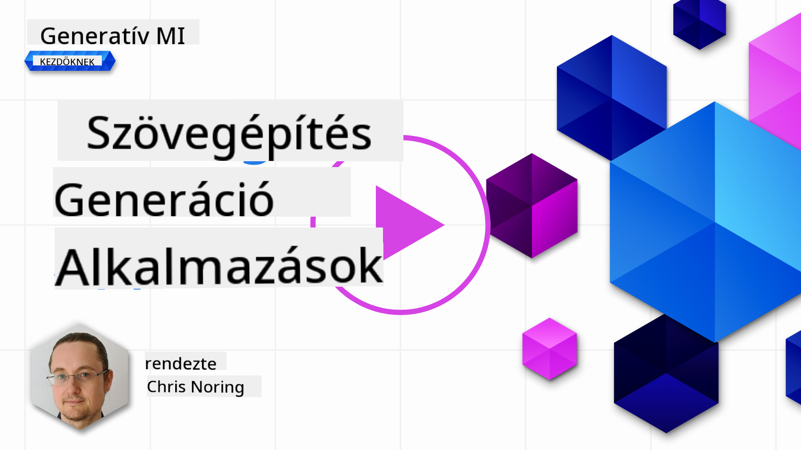

<!--
CO_OP_TRANSLATOR_METADATA:
{
  "original_hash": "ce8224073b86b728ed52b19bed7932fd",
  "translation_date": "2025-07-09T12:06:03+00:00",
  "source_file": "06-text-generation-apps/README.md",
  "language_code": "hu"
}
-->
# Szövegalkotó alkalmazások készítése

[](https://aka.ms/gen-ai-lesson6-gh?WT.mc_id=academic-105485-koreyst)

> _(Kattints a fenti képre a lecke videójának megtekintéséhez)_

Eddig a tananyag során láthattad, hogy léteznek alapvető fogalmak, mint a promptok, és van egy egész tudományág, amit „prompt mérnökségnek” hívnak. Sok eszköz, amivel dolgozhatsz, például a ChatGPT, az Office 365, a Microsoft Power Platform és még sok más, támogatja a promptok használatát valamilyen feladat elvégzéséhez.

Ahhoz, hogy ilyen élményt adj egy alkalmazáshoz, értened kell olyan fogalmakat, mint a promptok, a kiegészítések, és ki kell választanod egy könyvtárat, amivel dolgozol. Pontosan ezt fogod megtanulni ebben a fejezetben.

## Bevezetés

Ebben a fejezetben:

- Megismerkedsz az openai könyvtárral és annak alapfogalmaival.
- Felépítesz egy szövegalkotó alkalmazást az openai segítségével.
- Megérted, hogyan használhatod a prompt, a hőmérséklet és a tokenek fogalmait egy szövegalkotó alkalmazás készítéséhez.

## Tanulási célok

A lecke végére képes leszel:

- Elmagyarázni, mi az a szövegalkotó alkalmazás.
- Egy szövegalkotó alkalmazást készíteni openai segítségével.
- Beállítani az alkalmazásodat úgy, hogy több vagy kevesebb token használatával, illetve a hőmérséklet változtatásával eltérő kimenetet kapj.

## Mi az a szövegalkotó alkalmazás?

Általában, amikor egy alkalmazást készítesz, az valamilyen felülettel rendelkezik, például:

- Parancs alapú. A konzolos alkalmazások tipikus példák, ahol beírsz egy parancsot, és az elvégzi a feladatot. Például a `git` egy parancs alapú alkalmazás.
- Felhasználói felület (UI). Néhány alkalmazás grafikus felülettel (GUI) rendelkezik, ahol gombokat kattintasz, szöveget írsz be, opciókat választasz stb.

### A konzolos és UI alkalmazások korlátai

Hasonlítsd össze egy parancs alapú alkalmazással, ahol beírsz egy parancsot:

- **Korlátozott**. Nem írhatod be bármilyen parancsot, csak azokat, amiket az alkalmazás támogat.
- **Nyelvspecifikus**. Néhány alkalmazás több nyelvet is támogat, de alapból egy adott nyelvre épül, még ha hozzá is adhatsz további nyelvi támogatást.

### A szövegalkotó alkalmazások előnyei

Miben más egy szövegalkotó alkalmazás?

Egy szövegalkotó alkalmazásban nagyobb a rugalmasság, nem vagy korlátozva egy adott parancskészletre vagy bemeneti nyelvre. Természetes nyelvet használhatsz az alkalmazással való interakcióhoz. Egy másik előny, hogy már egy olyan adatforrással dolgozol, amelyet hatalmas mennyiségű információn képeztek ki, míg egy hagyományos alkalmazás adatbázisának tartalma korlátozott lehet.

### Mit építhetek egy szövegalkotó alkalmazással?

Sokféle dolgot készíthetsz, például:

- **Chatbot**. Egy chatbot, amely kérdésekre válaszol cégedről és termékeiről, jó választás lehet.
- **Segéd**. A nagy nyelvi modellek (LLM-ek) remekül alkalmasak szöveg összefoglalására, betekintések nyújtására, önéletrajzok vagy más szövegek készítésére.
- **Kódsegéd**. A használt nyelvi modelltől függően készíthetsz kódsegédet, amely segít kódot írni. Például használhatod a GitHub Copilotot vagy a ChatGPT-t kódírás támogatására.

## Hogyan kezdjek hozzá?

Két fő megközelítés van az LLM-mel való integrációra:

- API használata. Itt webkéréseket építesz a promptoddal, és visszakapod a generált szöveget.
- Könyvtár használata. A könyvtárak az API hívásokat becsomagolják, így könnyebben használhatók.

## Könyvtárak/SDK-k

Néhány ismert könyvtár az LLM-ekhez:

- **openai**, ez a könyvtár megkönnyíti a modellhez való kapcsolódást és a promptok küldését.

Vannak magasabb szintű könyvtárak is, például:

- **Langchain**. A Langchain jól ismert és támogatja a Pythont.
- **Semantic Kernel**. A Semantic Kernel a Microsoft könyvtára, amely támogatja a C#, Python és Java nyelveket.

## Első alkalmazás openai használatával

Nézzük meg, hogyan építhetjük fel első alkalmazásunkat, milyen könyvtárakra van szükség, mennyi kód kell, és így tovább.

### openai telepítése

Számos könyvtár létezik az OpenAI vagy Azure OpenAI-val való interakcióhoz. Több programozási nyelv is használható, például C#, Python, JavaScript, Java és mások. Mi az `openai` Python könyvtárat választottuk, ezért `pip`-pel telepítjük.

```bash
pip install openai
```

### Erőforrás létrehozása

A következő lépéseket kell elvégezned:

- Hozz létre egy fiókot az Azure-on [https://azure.microsoft.com/free/](https://azure.microsoft.com/free/?WT.mc_id=academic-105485-koreyst).
- Szerezz hozzáférést az Azure OpenAI-hoz. Látogass el ide: [https://learn.microsoft.com/azure/ai-services/openai/overview#how-do-i-get-access-to-azure-openai](https://learn.microsoft.com/azure/ai-services/openai/overview#how-do-i-get-access-to-azure-openai?WT.mc_id=academic-105485-koreyst) és kérj hozzáférést.

  > [!NOTE]
  > A cikk írásakor hozzáférést kell kérni az Azure OpenAI használatához.

- Telepítsd a Python-t <https://www.python.org/>
- Hozz létre egy Azure OpenAI Service erőforrást. Erről itt találsz útmutatót: [erőforrás létrehozása](https://learn.microsoft.com/azure/ai-services/openai/how-to/create-resource?pivots=web-portal?WT.mc_id=academic-105485-koreyst).

### API kulcs és végpont megtalálása

Most meg kell mondanod az `openai` könyvtárnak, melyik API kulcsot használja. Az API kulcs megtalálásához menj az Azure OpenAI erőforrásod „Kulcsok és végpont” szekciójába, és másold ki az „1. kulcs” értékét.


Miután ezt az információt kimásoltad, utasítsuk a könyvtárakat, hogy használják azt.

> [!NOTE]
> Érdemes az API kulcsot elkülöníteni a kódtól. Ezt megteheted környezeti változók használatával.
>
> - Állítsd be az `OPENAI_API_KEY` környezeti változót az API kulcsodra.
>   `export OPENAI_API_KEY='sk-...'`

### Azure konfiguráció beállítása

Ha Azure OpenAI-t használsz, így állíthatod be a konfigurációt:

```python
openai.api_type = 'azure'
openai.api_key = os.environ["OPENAI_API_KEY"]
openai.api_version = '2023-05-15'
openai.api_base = os.getenv("API_BASE")
```

Fent a következőket állítjuk be:

- `api_type` értéke `azure`. Ez jelzi a könyvtárnak, hogy Azure OpenAI-t használjon, nem pedig OpenAI-t.
- `api_key`, ez az Azure Portalban talált API kulcsod.
- `api_version`, az API verziója, amit használni szeretnél. A cikk írásakor a legfrissebb verzió a `2023-05-15`.
- `api_base`, az API végpontja. Ezt az Azure Portalban találod az API kulcs mellett.

> [!NOTE]
> Az `os.getenv` egy függvény, amely környezeti változókat olvas be. Ezzel olvashatod be például az `OPENAI_API_KEY` és `API_BASE` változókat. Állítsd be ezeket a terminálodban vagy használj olyan könyvtárat, mint a `dotenv`.

## Szöveg generálása

A szöveg generálásához a `Completion` osztályt használjuk. Íme egy példa:

```python
prompt = "Complete the following: Once upon a time there was a"

completion = openai.Completion.create(model="davinci-002", prompt=prompt)
print(completion.choices[0].text)
```

A fenti kódban létrehozunk egy completion objektumot, megadjuk a használni kívánt modellt és a promptot, majd kiírjuk a generált szöveget.

### Chat kiegészítések

Eddig a `Completion` osztályt használtuk szöveg generálására. Van azonban egy másik osztály, a `ChatCompletion`, amely jobban alkalmas chatbotokhoz. Íme egy példa a használatára:

```python
import openai

openai.api_key = "sk-..."

completion = openai.ChatCompletion.create(model="gpt-3.5-turbo", messages=[{"role": "user", "content": "Hello world"}])
print(completion.choices[0].message.content)
```

Erről a funkcióról bővebben egy későbbi fejezetben lesz szó.

## Gyakorlat – az első szövegalkotó alkalmazásod

Most, hogy megtanultuk, hogyan állítsuk be és konfiguráljuk az openai-t, ideje elkészíteni az első szövegalkotó alkalmazásodat. A következő lépéseket kövesd:

1. Hozz létre egy virtuális környezetet és telepítsd az openai-t:

   ```bash
   python -m venv venv
   source venv/bin/activate
   pip install openai
   ```

   > [!NOTE]
   > Windows esetén a `source venv/bin/activate` helyett írd be: `venv\Scripts\activate`.

   > [!NOTE]
   > Az Azure OpenAI kulcsodat az alábbi módon találhatod meg: menj a [https://portal.azure.com/](https://portal.azure.com/?WT.mc_id=academic-105485-koreyst) oldalra, keresd meg az `Open AI` erőforrást, válaszd ki az `Open AI resource`-ot, majd a `Keys and Endpoint` résznél másold ki az `1. kulcs` értékét.

1. Hozz létre egy _app.py_ fájlt, és írd bele a következő kódot:

   ```python
   import openai

   openai.api_key = "<replace this value with your open ai key or Azure OpenAI key>"

   openai.api_type = 'azure'
   openai.api_version = '2023-05-15'
   openai.api_base = "<endpoint found in Azure Portal where your API key is>"
   deployment_name = "<deployment name>"

   # add your completion code
   prompt = "Complete the following: Once upon a time there was a"
   messages = [{"role": "user", "content": prompt}]

   # make completion
   completion = openai.chat.completions.create(model=deployment_name, messages=messages)

   # print response
   print(completion.choices[0].message.content)
   ```

   > [!NOTE]
   > Ha Azure OpenAI-t használsz, állítsd az `api_type` értékét `azure`-ra, és az `api_key`-t az Azure OpenAI kulcsodra.

   A kimeneted valami ilyesmi lesz:

   ```output
    very unhappy _____.

   Once upon a time there was a very unhappy mermaid.
   ```

## Különböző prompt típusok különböző feladatokra

Most már láttad, hogyan generálhatsz szöveget egy prompt segítségével. Van egy működő programod, amit módosíthatsz, hogy különböző típusú szövegeket generáljon.

A promptokat sokféle feladatra használhatod, például:

- **Szöveg típus generálása**. Például verset, kvízkérdéseket stb. generálhatsz.
- **Információ keresése**. Használhatsz promptokat információk lekérdezésére, például: „Mit jelent a CORS a webfejlesztésben?”.
- **Kód generálása**. Promptokkal kódot is generálhatsz, például reguláris kifejezést e-mailek ellenőrzésére, vagy akár egy teljes programot, például egy webalkalmazást.

## Egy gyakorlatiasabb példa: receptgenerátor

Képzeld el, hogy otthon vannak alapanyagaid, és valami finomat szeretnél főzni. Ehhez recept kell. Receptet kereshetsz keresőmotorral, vagy használhatsz egy LLM-et is.

Írhatsz egy ilyen promptot:

> „Mutass 5 receptet egy ételhez a következő alapanyagokból: csirke, burgonya és sárgarépa. Minden receptnél sorold fel az összes felhasznált hozzávalót.”

A fenti prompt alapján egy válasz hasonló lehet ehhez:

```output
1. Roasted Chicken and Vegetables:
Ingredients:
- 4 chicken thighs
- 2 potatoes, cut into cubes
- 2 carrots, cut into cubes
- 2 tablespoons olive oil
- 2 cloves garlic, minced
- 1 teaspoon dried thyme
- 1 teaspoon dried oregano
- Salt and pepper, to taste

2. Chicken and Potato Stew:
Ingredients:
- 2 tablespoons olive oil
- 1 onion, diced
- 2 cloves garlic, minced
- 2 chicken breasts, cut into cubes
- 2 potatoes, cut into cubes
- 2 carrots, cut into cubes
- 1 teaspoon dried oregano
- 1 teaspoon dried thyme
- 1 cup chicken broth
- Salt and pepper, to taste

3. Chicken and Potato Bake:
Ingredients:
- 2 tablespoons olive oil
- 2 chicken breasts, cut into cubes
- 2 potatoes, cut into cubes
- 2 carrots, cut into cubes
- 1 onion, diced
- 2 cloves garlic, minced
- 1 teaspoon dried oregano
- 1 teaspoon dried thyme
- 1 cup chicken broth
- Salt and pepper, to taste

4. Chicken and Potato Soup:
Ingredients:
- 2 tablespoons olive oil
- 1 onion, diced
- 2 cloves garlic, minced
- 2 chicken breasts, cut into cubes
- 2 potatoes, cut into cubes
- 2 carrots, cut into cubes
- 1 teaspoon dried oregano
- 1 teaspoon dried thyme
- 4 cups chicken broth
- Salt and pepper, to taste

5. Chicken and Potato Hash:
Ingredients:
- 2 tablespoons olive oil
- 2 chicken breasts, cut into cubes
- 2 potatoes, cut into cubes
- 2 carrots, cut into cubes
- 1 onion, diced
- 2 cloves garlic, minced
- 1 teaspoon dried oregano
```

Ez nagyszerű eredmény, tudom, mit főzzek. Itt hasznos lehet még:

- Kiszűrni azokat az összetevőket, amiket nem szeretek vagy amire allergiás vagyok.
- Bevásárlólistát készíteni, ha nincs meg minden hozzávaló otthon.

Ehhez adjunk egy további promptot:

> „Kérlek, távolítsd el a receptek közül a fokhagymát, mert allergiás vagyok rá, és helyettesítsd valamivel. Emellett készíts bevásárlólistát a receptekhez, figyelembe véve, hogy otthon már van csirke, burgonya és sárgarépa.”

Most egy új eredményt kapsz, ami így néz ki:

```output
1. Roasted Chicken and Vegetables:
Ingredients:
- 4 chicken thighs
- 2 potatoes, cut into cubes
- 2 carrots, cut into cubes
- 2 tablespoons olive oil
- 1 teaspoon dried thyme
- 1 teaspoon dried oregano
- Salt and pepper, to taste

2. Chicken and Potato Stew:
Ingredients:
- 2 tablespoons olive oil
- 1 onion, diced
- 2 chicken breasts, cut into cubes
- 2 potatoes, cut into cubes
- 2 carrots, cut into cubes
- 1 teaspoon dried oregano
- 1 teaspoon dried thyme
- 1 cup chicken broth
- Salt and pepper, to taste

3. Chicken and Potato Bake:
Ingredients:
- 2 tablespoons olive oil
- 2 chicken breasts, cut into cubes
- 2 potatoes, cut into cubes
- 2 carrots, cut into cubes
- 1 onion, diced
- 1 teaspoon dried oregano
- 1 teaspoon dried thyme
- 1 cup chicken broth
- Salt and pepper, to taste

4. Chicken and Potato Soup:
Ingredients:
- 2 tablespoons olive oil
- 1 onion, diced
- 2 chicken breasts, cut into cubes
- 2 potatoes, cut into cubes
- 2 carrots, cut into cubes
- 1 teaspoon dried oregano
- 1 teaspoon dried thyme
- 4 cups chicken broth
- Salt and pepper, to taste

5. Chicken and Potato Hash:
Ingredients:
- 2 tablespoons olive oil
- 2 chicken breasts, cut into cubes
- 2 potatoes, cut into cubes
- 2 carrots, cut into cubes
- 1 onion, diced
- 1 teaspoon dried oregano

Shopping List:
- Olive oil
- Onion
- Thyme
- Oregano
- Salt
- Pepper
```

Ez az öt recept fokhagyma nélkül, és egy bevásárlólista is, amely figyelembe veszi, mi van már otthon.

## Gyakorlat – receptgenerátor készítése

Most, hogy lejátszottuk a forgatókönyvet, írjunk kódot, ami megfelel ennek. Ehhez kövesd az alábbi lépéseket:

1. Használd kiindulópontként a meglévő _app.py_ fájlt.
1. Keresd meg a `prompt` változót, és módosítsd a kódját az alábbiak szerint:

   ```python
   prompt = "Show me 5 recipes for a dish with the following ingredients: chicken, potatoes, and carrots. Per recipe, list all the ingredients used"
   ```

   Ha most futtatod a kódot, hasonló kimenetet kell látnod:

   ```output
   -Chicken Stew with Potatoes and Carrots: 3 tablespoons oil, 1 onion, chopped, 2 cloves garlic, minced, 1 carrot, peeled and chopped, 1 potato, peeled and chopped, 1 bay leaf, 1 thyme sprig, 1/2 teaspoon salt, 1/4 teaspoon black pepper, 1 1/2 cups chicken broth, 1/2 cup dry white wine, 2 tablespoons chopped fresh parsley, 2 tablespoons unsalted butter, 1 1/2 pounds boneless, skinless chicken thighs, cut into 1-inch pieces
   -Oven-Roasted Chicken with Potatoes and Carrots: 3 tablespoons extra-virgin olive oil, 1 tablespoon Dijon mustard, 1 tablespoon chopped fresh rosemary, 1 tablespoon chopped fresh thyme, 4 cloves garlic, minced, 1 1/2 pounds small red potatoes, quartered, 1 1/2 pounds carrots, quartered lengthwise, 1/2 teaspoon salt, 1/4 teaspoon black pepper, 1 (4-pound) whole chicken
   -Chicken, Potato, and Carrot Casserole: cooking spray, 1 large onion, chopped, 2 cloves garlic, minced, 1 carrot, peeled and shredded, 1 potato, peeled and shredded, 1/2 teaspoon dried thyme leaves, 1/4 teaspoon salt, 1/4 teaspoon black pepper, 2 cups fat-free, low-sodium chicken broth, 1 cup frozen peas, 1/4 cup all-purpose flour, 1 cup 2% reduced-fat milk, 1/4 cup grated Parmesan cheese

   -One Pot Chicken and Potato Dinner: 2 tablespoons olive oil, 1 pound boneless, skinless chicken thighs, cut into 1-inch pieces, 1 large onion, chopped, 3 cloves garlic, minced, 1 carrot, peeled and chopped, 1 potato, peeled and chopped, 1 bay leaf, 1 thyme sprig, 1/2 teaspoon salt, 1/4 teaspoon black pepper, 2 cups chicken broth, 1/2 cup dry white wine

   -Chicken, Potato, and Carrot Curry: 1 tablespoon vegetable oil, 1 large onion, chopped, 2 cloves garlic, minced, 1 carrot, peeled and chopped, 1 potato, peeled and chopped, 1 teaspoon ground coriander, 1 teaspoon ground cumin, 1/2 teaspoon ground turmeric, 1/2 teaspoon ground ginger, 1/4 teaspoon cayenne pepper, 2 cups chicken broth, 1/2 cup dry white wine, 1 (15-ounce) can chickpeas, drained and rinsed, 1/2 cup raisins, 1/2 cup chopped fresh cilantro
   ```

   > MEGJEGYZÉS: az LLM nem determinisztikus, így minden futtatáskor eltérő eredményt kaphatsz.

Szuper, nézzük, hogyan javíthatunk még rajta. Ahhoz, hogy rugalmas legyen a kód, szeretnénk, ha a hozzávalók és a receptek száma is változtatható lenne.

1. Módosítsuk a kódot az alábbiak szerint:

   ```python
   no_recipes = input("No of recipes (for example, 5): ")

   ingredients = input("List of ingredients (for example, chicken, potatoes, and carrots): ")

   # interpolate the number of recipes into the prompt an ingredients
   prompt = f"Show me {no_recipes} recipes for a dish with the following ingredients: {ingredients}. Per recipe, list all the ingredients used"
   ```

Egy tesztfuttatás így nézhet ki:

```output
   No of recipes (for example, 5): 3
   List of ingredients (for example, chicken, potatoes, and carrots): milk,strawberries

   -Strawberry milk shake: milk, strawberries, sugar, vanilla extract, ice cubes
   -Strawberry shortcake: milk, flour, baking powder, sugar, salt, unsalted butter, strawberries, whipped cream
   -Strawberry milk: milk, strawberries, sugar, vanilla extract
   ```

### Fejlesztés szűrő és bevásárlólista hozzáadásával

Most már van egy működő alkalmazásunk, amely képes recepteket generálni, és rugalmas, mert a felhasználó adhat meg hozzávalókat és receptek számát.

További fejlesztésként a következőket szeretnénk hozzáadni:

- **Összetevők szűrése**. Szeretnénk kiszűrni azokat az összetevőket, amiket nem szeretünk vagy amire allergiásak vagyunk. Ehhez módosíthatjuk a meglévő promptot, és a végére hozzáadhatunk egy szűrőfeltételt, például így:

  ```python
  filter = input("Filter (for example, vegetarian, vegan, or gluten-free): ")

  prompt = f"Show me {no_recipes} recipes for a dish with the following ingredients: {ingredients}. Per recipe, list all the ingredients used, no {filter}"
  ```

Fent a prompt végére hozzáadtuk a `{filter}` változót, és a felhasználótól is bekérjük a szűrőfeltételt.

Egy példa a program futtatására most így nézhet ki:

```output
  No of recipes (for example, 5): 3
  List of ingredients (for example, chicken, potatoes, and carrots): onion,milk
  Filter (for example, vegetarian, vegan, or gluten-free): no milk

  1. French Onion Soup

  Ingredients:

  -1 large onion, sliced
  -3 cups beef broth
  -1 cup milk
  -6 slices french bread
  -1/4 cup shredded Parmesan cheese
  -1 tablespoon butter
  -1 teaspoon dried thyme
  -1/4 teaspoon salt
  -1/4 teaspoon black pepper

  Instructions:

  1. In a large pot, sauté onions in butter until golden brown.
  2. Add beef broth, milk, thyme, salt, and pepper. Bring to a boil.
  3. Reduce heat and simmer for 10 minutes.
  4. Place french bread slices on soup bowls.
  5. Ladle soup over bread.
  6. Sprinkle with Parmesan cheese.

  2. Onion and Potato Soup

  Ingredients:

  -1 large onion, chopped
  -2 cups potatoes, diced
  -3 cups vegetable broth
  -1 cup milk
  -1/4 teaspoon black pepper

  Instructions:

  1. In a large pot, sauté onions in butter until golden brown.
  2. Add potatoes, vegetable broth, milk, and pepper. Bring to a boil.
  3. Reduce heat and simmer for 10 minutes.
  4. Serve hot.

  3. Creamy Onion Soup

  Ingredients:

  -1 large onion, chopped
  -3 cups vegetable broth
  -1 cup milk
  -1/4 teaspoon black pepper
  -1/4 cup all-purpose flour
  -1/2 cup shredded Parmesan cheese

  Instructions:

  1. In a large pot, sauté onions in butter until golden brown.
  2. Add vegetable broth, milk, and pepper. Bring to a boil.
  3. Reduce heat and simmer for 10 minutes.
  4. In a small bowl, whisk together flour and Parmesan cheese until smooth.
  5. Add to soup and simmer for an additional 5 minutes, or until soup has thickened.
  ```

Ahogy látod, a tejjel készült receptek ki lettek szűrve. Ha például laktózérzékeny vagy, akkor a sajtos recepteket is szeretnéd kiszűrni, ezért fontos, hogy egyértelmű legyen a szűrés.

- **Bevásárlólista készítése**. Szeretnénk bevásárlólistát készíteni, figyelembe véve, mi van már otthon.

Ehhez vagy egy promptban oldjuk meg az egészet, vagy ketté bontjuk két promptra. Próbáljuk meg a második megközelítést. Ehhez egy új promptot adunk hozzá, de ehhez szükség van arra, hogy az első prompt eredményét kontextusként átadjuk a második promptnak.

Keresd meg a kódban azt a részt, ahol az első prompt eredményét kiírod, és alá illeszd be a következő kódot:

```python
  old_prompt_result = completion.choices[0].message.content
  prompt = "Produce a shopping list for the generated recipes and please don't include ingredients that I already have."

  new_prompt = f"{old_prompt_result} {prompt}"
  messages = [{"role": "user", "content": new_prompt}]
  completion = openai.Completion.create(engine=deployment_name, messages=messages, max_tokens=1200)

  # print response
  print("Shopping list:")
  print(completion.choices[0].message.content)
  ```

Figyeld meg a következőket:

1. Új promptot építünk úgy, hogy az első prompt eredményét hozzáadjuk az új prompt szövegéhez:

   ```python
     new_prompt = f"{old_prompt_result} {prompt}"
     ```
1. Új kérést indítunk, de figyelembe vesszük az első promptban kért tokenek számát is, így most a `max_tokens` értéke 1200 lesz.

```python
     completion = openai.Completion.create(engine=deployment_name, prompt=new_prompt, max_tokens=1200)
     ```

Ha lefuttatjuk ezt a kódot, a következő eredményt kapjuk:

```output
     No of recipes (for example, 5): 2
     List of ingredients (for example, chicken, potatoes, and carrots): apple,flour
     Filter (for example, vegetarian, vegan, or gluten-free): sugar


     -Apple and flour pancakes: 1 cup flour, 1/2 tsp baking powder, 1/2 tsp baking soda, 1/4 tsp salt, 1 tbsp sugar, 1 egg, 1 cup buttermilk or sour milk, 1/4 cup melted butter, 1 Granny Smith apple, peeled and grated
     -Apple fritters: 1-1/2 cups flour, 1 tsp baking powder, 1/4 tsp salt, 1/4 tsp baking soda, 1/4 tsp nutmeg, 1/4 tsp cinnamon, 1/4 tsp allspice, 1/4 cup sugar, 1/4 cup vegetable shortening, 1/4 cup milk, 1 egg, 2 cups shredded, peeled apples
     Shopping list:
     -Flour, baking powder, baking soda, salt, sugar, egg, buttermilk, butter, apple, nutmeg, cinnamon, allspice
     ```

## Fejleszd a beállításaidat

Ami eddig van, az működő kód, de van néhány finomítás, amivel tovább javíthatunk rajta. Néhány teendő:

- **Titkok elkülönítése a kódtól**, például az API kulcs. A titkok nem valóak a kódba, biztonságos helyen kell tárolni őket. A titkok elkülönítéséhez használhatunk környezeti változókat és olyan könyvtárakat, mint a `python-dotenv`, amivel fájlból tölthetjük be őket. Így nézne ki ez kódban:

  1. Hozz létre egy `.env` fájlt a következő tartalommal:

     ```bash
     OPENAI_API_KEY=sk-...
     ```

     
> Megjegyzés: Azure esetén a következő környezeti változókat kell beállítani:

     ```bash
     OPENAI_API_TYPE=azure
     OPENAI_API_VERSION=2023-05-15
     OPENAI_API_BASE=<replace>
     ```

     Kódban így töltenéd be a környezeti változókat:

     ```python
     from dotenv import load_dotenv

     load_dotenv()

     openai.api_key = os.environ["OPENAI_API_KEY"]
     ```

- **Egy szó a token hosszáról**. Fontoljuk meg, hány tokenre van szükségünk a kívánt szöveg generálásához. A tokenek pénzbe kerülnek, ezért ahol lehet, takarékoskodjunk a tokenek számával. Például megfogalmazhatjuk a promptot úgy, hogy kevesebb tokenre legyen szükség?

  A használt tokenek számát a `max_tokens` paraméterrel szabályozhatod. Például, ha 100 tokent szeretnél használni, így tennéd:

  ```python
  completion = client.chat.completions.create(model=deployment, messages=messages, max_tokens=100)
  ```

- **Kísérletezés a temperature paraméterrel**. A temperature-ről eddig nem beszéltünk, pedig fontos, mert befolyásolja a program viselkedését. Minél magasabb az érték, annál véletlenszerűbb lesz a kimenet. Ezzel szemben minél alacsonyabb, annál kiszámíthatóbb. Gondold át, szeretnél-e változatosságot az eredményben vagy sem.

  A temperature értékét a `temperature` paraméterrel állíthatod. Például, ha 0.5-öt szeretnél használni, így tennéd:

  ```python
  completion = client.chat.completions.create(model=deployment, messages=messages, temperature=0.5)
  ```

  > Megjegyzés: minél közelebb van az érték 1.0-hoz, annál változatosabb lesz a kimenet.

## Feladat

Ehhez a feladathoz te választhatod meg, mit szeretnél építeni.

Íme néhány ötlet:

- Finomítsd tovább a receptgeneráló alkalmazást. Játssz a temperature értékekkel és a promptokkal, hogy meglásd, mit tudsz kihozni belőle.
- Készíts egy "tanulótársat". Ez az alkalmazás képes legyen válaszolni egy témával kapcsolatos kérdésekre, például Pythonról. Lehetnek promptok, mint „Mi az adott téma Pythonban?”, vagy „Mutass kódot egy adott témához” stb.
- Történelmi bot, keltsd életre a történelmet, utasítsd a botot, hogy játsszon el egy bizonyos történelmi személyt, és kérdezd meg az életéről, koráról.

## Megoldás

### Tanulótárs

Az alábbiakban egy kezdő promptot találsz, nézd meg, hogyan használhatod és alakíthatod a saját ízlésed szerint.

```text
- "You're an expert on the Python language

    Suggest a beginner lesson for Python in the following format:

    Format:
    - concepts:
    - brief explanation of the lesson:
    - exercise in code with solutions"
```

### Történelmi bot

Íme néhány prompt, amit használhatsz:

```text
- "You are Abe Lincoln, tell me about yourself in 3 sentences, and respond using grammar and words like Abe would have used"
- "You are Abe Lincoln, respond using grammar and words like Abe would have used:

   Tell me about your greatest accomplishments, in 300 words"
```

## Tudásellenőrzés

Mit csinál a temperature fogalma?

1. Szabályozza, mennyire véletlenszerű a kimenet.
1. Szabályozza, mekkora a válasz.
1. Szabályozza, hány token kerül felhasználásra.

## 🚀 Kihívás

A feladat megoldása közben próbáld változtatni a temperature értékét, állítsd 0-ra, 0.5-re és 1-re. Ne feledd, 0 a legkevésbé változatos, 1 a leginkább. Melyik érték működik a legjobban a te alkalmazásodban?

## Szép munka! Folytasd a tanulást

A lecke befejezése után nézd meg a [Generative AI Learning collection](https://aka.ms/genai-collection?WT.mc_id=academic-105485-koreyst) gyűjteményünket, hogy tovább fejleszd a Generatív AI tudásodat!

Lépj tovább a 7. leckére, ahol megnézzük, hogyan lehet [chat alkalmazásokat építeni](../07-building-chat-applications/README.md?WT.mc_id=academic-105485-koreyst)!

**Jogi nyilatkozat**:  
Ez a dokumentum az AI fordító szolgáltatás, a [Co-op Translator](https://github.com/Azure/co-op-translator) segítségével készült. Bár a pontosságra törekszünk, kérjük, vegye figyelembe, hogy az automatikus fordítások hibákat vagy pontatlanságokat tartalmazhatnak. Az eredeti dokumentum az anyanyelvén tekintendő hiteles forrásnak. Fontos információk esetén szakmai, emberi fordítást javaslunk. Nem vállalunk felelősséget a fordítás használatából eredő félreértésekért vagy téves értelmezésekért.