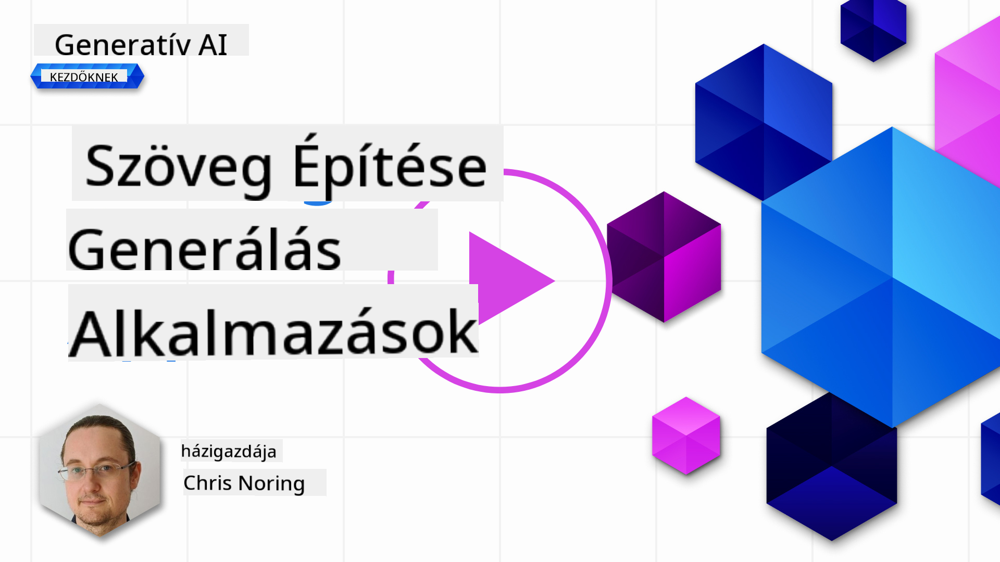

<!--
CO_OP_TRANSLATOR_METADATA:
{
  "original_hash": "5ec6c92b629564538ef397c550adb73e",
  "translation_date": "2025-05-19T17:14:52+00:00",
  "source_file": "06-text-generation-apps/README.md",
  "language_code": "hu"
}
-->
# Szöveggeneráló alkalmazások építése

[](https://aka.ms/gen-ai-lesson6-gh?WT.mc_id=academic-105485-koreyst)

> _(Kattints a fenti képre a leckéhez tartozó videó megtekintéséhez)_

Eddig láthattad, hogy vannak alapvető fogalmak, mint például a promptok, és van egy egész tudományág, amit "prompt mérnökségnek" neveznek. Sok eszköz, amivel interakcióba léphetsz, mint például a ChatGPT, Office 365, Microsoft Power Platform és még sok más, támogatja a promptok használatát valami elérésére.

Ahhoz, hogy ilyen élményt adj hozzá egy alkalmazáshoz, meg kell értened a fogalmakat, mint a promptok, kiegészítések, és ki kell választanod egy könyvtárat, amivel dolgozol. Pontosan ezt fogod megtanulni ebben a fejezetben.

## Bevezetés

Ebben a fejezetben:

- Megismerkedsz az openai könyvtárral és annak alapvető fogalmaival.
- Építesz egy szöveggeneráló alkalmazást openai használatával.
- Megérted, hogyan használhatod a fogalmakat, mint a prompt, hőmérséklet, és tokenek, hogy szöveggeneráló alkalmazást építs.

## Tanulási célok

A lecke végére képes leszel:

- Elmagyarázni, mi az a szöveggeneráló alkalmazás.
- Építeni egy szöveggeneráló alkalmazást openai használatával.
- Konfigurálni az alkalmazásodat, hogy több vagy kevesebb tokent használjon, valamint megváltoztatni a hőmérsékletet a változatos kimenet érdekében.

## Mi az a szöveggeneráló alkalmazás?

Általában, amikor építesz egy alkalmazást, van valamilyen felülete, mint például:

- Parancsalapú. Konzol alkalmazások tipikus példái, ahol beírsz egy parancsot, és az végrehajt egy feladatot. Például, `git` egy parancsalapú alkalmazás.
- Felhasználói felület (UI). Néhány alkalmazásnak grafikus felhasználói felülete van (GUI), ahol gombokra kattintasz, szöveget írsz be, opciókat választasz, és így tovább.

### Konzol és UI alkalmazások korlátai

Hasonlítsd össze egy parancsalapú alkalmazással, ahol beírsz egy parancsot:

- **Korlátozott**. Nem írhatsz be bármilyen parancsot, csak azokat, amelyeket az alkalmazás támogat.
- **Nyelv specifikus**. Néhány alkalmazás több nyelvet is támogat, de alapértelmezés szerint az alkalmazás egy adott nyelvre van építve, még akkor is, ha hozzáadhatsz több nyelvi támogatást.

### Szöveggeneráló alkalmazások előnyei

Hogyan különbözik egy szöveggeneráló alkalmazás?

Egy szöveggeneráló alkalmazásban több rugalmasságod van, nem vagy korlátozva egy parancskészletre vagy egy specifikus bemeneti nyelvre. Ehelyett természetes nyelvet használhatsz az alkalmazással való interakcióra. Egy másik előny, hogy mivel már egy adatforrással lépsz interakcióba, amely egy hatalmas információ korpuszon lett kiképezve, míg egy hagyományos alkalmazás korlátozott lehet abban, ami egy adatbázisban van.

### Mit építhetek egy szöveggeneráló alkalmazással?

Sok mindent építhetsz. Például:

- **Chatbot**. Egy chatbot, amely válaszol kérdésekre témákról, mint például a céged és annak termékei, jó választás lehet.
- **Segítő**. Az LLM-ek nagyszerűek olyan dolgokban, mint szöveg összefoglalása, betekintések nyerése a szövegből, szöveg előállítása, mint például önéletrajzok és még sok más.
- **Kód asszisztens**. A nyelvi modelltől függően építhetsz egy kód asszisztenst, amely segít neked kódot írni. Például használhatsz egy terméket, mint a GitHub Copilot, valamint a ChatGPT-t, hogy segítsen kódot írni.

## Hogyan kezdhetek neki?

Nos, meg kell találnod egy módot, hogy integrálódj egy LLM-mel, amely általában a következő két megközelítést jelenti:

- Használj API-t. Itt webes kéréseket konstruálsz a promptoddal és visszakapod a generált szöveget.
- Használj könyvtárat. A könyvtárak segítenek az API hívások becsomagolásában és könnyebbé teszik azok használatát.

## Könyvtárak/SDK-k

Van néhány jól ismert könyvtár az LLM-ekkel való munkához, mint például:

- **openai**, ez a könyvtár megkönnyíti a modellhez való csatlakozást és a promptok küldését.

Aztán vannak könyvtárak, amelyek magasabb szinten működnek, mint például:

- **Langchain**. A Langchain jól ismert és támogatja a Pythont.
- **Semantic Kernel**. A Semantic Kernel egy Microsoft által támogatott könyvtár, amely támogatja a C#, Python és Java nyelveket.

## Első alkalmazás openai használatával

Nézzük meg, hogyan építhetjük meg az első alkalmazásunkat, milyen könyvtárakra van szükségünk, mennyire van szükség és így tovább.

### Openai telepítése

Számos könyvtár létezik az OpenAI vagy Azure OpenAI-val való interakcióra. Számos programozási nyelvet is használhatsz, mint például C#, Python, JavaScript, Java és így tovább. Mi a `openai` Python könyvtárat választottuk, ezért a `pip` segítségével telepítjük.

```bash
pip install openai
```

### Erőforrás létrehozása

Végezd el a következő lépéseket:

- Hozz létre egy fiókot az Azure-on [https://azure.microsoft.com/free/](https://azure.microsoft.com/free/?WT.mc_id=academic-105485-koreyst).
- Szerezz hozzáférést az Azure OpenAI-hoz. Lépj a [https://learn.microsoft.com/azure/ai-services/openai/overview#how-do-i-get-access-to-azure-openai](https://learn.microsoft.com/azure/ai-services/openai/overview#how-do-i-get-access-to-azure-openai?WT.mc_id=academic-105485-koreyst) oldalra és kérj hozzáférést.

  > [!NOTE]
  > A jelen írás idején, hozzáférést kell kérni az Azure OpenAI-hoz.

- Telepítsd a Python-t <https://www.python.org/>
- Hozz létre egy Azure OpenAI Service erőforrást. Lásd ezt az útmutatót, hogyan [hozz létre erőforrást](https://learn.microsoft.com/azure/ai-services/openai/how-to/create-resource?pivots=web-portal?WT.mc_id=academic-105485-koreyst).

### API kulcs és végpont megtalálása

Ezen a ponton meg kell mondanod a `openai` könyvtáradnak, hogy melyik API kulcsot használja. Az API kulcs megtalálásához menj az Azure OpenAI erőforrás "Kulcsok és végpont" szekciójába és másold ki az "1. kulcs" értéket.


Most, hogy ezt az információt lemásoltad, utasítsuk a könyvtárakat, hogy használják azt.

> [!NOTE]
> Érdemes különválasztani az API kulcsot a kódtól. Ezt megteheted környezeti változók használatával.
>
> - Állítsd be a környezeti változót `OPENAI_API_KEY` to your API key.
>   `export OPENAI_API_KEY='sk-...'`

### Azure konfiguráció beállítása

Ha az Azure OpenAI-t használod, így állíthatod be a konfigurációt:

```python
openai.api_type = 'azure'
openai.api_key = os.environ["OPENAI_API_KEY"]
openai.api_version = '2023-05-15'
openai.api_base = os.getenv("API_BASE")
```

Fent beállítjuk a következőket:

- `api_type` to `azure`. This tells the library to use Azure OpenAI and not OpenAI.
- `api_key`, this is your API key found in the Azure Portal.
- `api_version`, this is the version of the API you want to use. At the time of writing, the latest version is `2023-05-15`.
- `api_base`, this is the endpoint of the API. You can find it in the Azure Portal next to your API key.

> [!NOTE] > `os.getenv` is a function that reads environment variables. You can use it to read environment variables like `OPENAI_API_KEY` and `API_BASE`. Set these environment variables in your terminal or by using a library like `dotenv`.

## Generate text

The way to generate text is to use the `Completion` osztály. Íme egy példa:

```python
prompt = "Complete the following: Once upon a time there was a"

completion = openai.Completion.create(model="davinci-002", prompt=prompt)
print(completion.choices[0].text)
```

A fenti kódban létrehozunk egy kiegészítés objektumot, és átadjuk a modellt, amit használni akarunk, és a promptot. Ezután kiírjuk a generált szöveget.

### Chat kiegészítések

Eddig láttad, hogyan használtuk a `Completion` to generate text. But there's another class called `ChatCompletion`, ami inkább chatbotokhoz illik. Íme egy példa annak használatára:

```python
import openai

openai.api_key = "sk-..."

completion = openai.ChatCompletion.create(model="gpt-3.5-turbo", messages=[{"role": "user", "content": "Hello world"}])
print(completion.choices[0].message.content)
```

Többet erről a funkcióról egy közelgő fejezetben.

## Gyakorlat - az első szöveggeneráló alkalmazásod

Most, hogy megtanultuk, hogyan állítsuk be és konfiguráljuk az openai-t, itt az ideje, hogy építsd meg az első szöveggeneráló alkalmazásodat. Az alkalmazás építéséhez kövesd ezeket a lépéseket:

1. Hozz létre egy virtuális környezetet és telepítsd az openai-t:

   ```bash
   python -m venv venv
   source venv/bin/activate
   pip install openai
   ```

   > [!NOTE]
   > Ha Windows-t használsz, írd be `venv\Scripts\activate` instead of `source venv/bin/activate`.

   > [!NOTE]
   > Locate your Azure OpenAI key by going to [https://portal.azure.com/](https://portal.azure.com/?WT.mc_id=academic-105485-koreyst) and search for `Open AI` and select the `Open AI erőforrás` and then select `Kulcsok és végpont` and copy the `1. kulcs` érték.

1. Hozz létre egy _app.py_ fájlt, és add neki a következő kódot:

   ```python
   import openai

   openai.api_key = "<replace this value with your open ai key or Azure OpenAI key>"

   openai.api_type = 'azure'
   openai.api_version = '2023-05-15'
   openai.api_base = "<endpoint found in Azure Portal where your API key is>"
   deployment_name = "<deployment name>"

   # add your completion code
   prompt = "Complete the following: Once upon a time there was a"
   messages = [{"role": "user", "content": prompt}]

   # make completion
   completion = openai.chat.completions.create(model=deployment_name, messages=messages)

   # print response
   print(completion.choices[0].message.content)
   ```

   > [!NOTE]
   > Ha az Azure OpenAI-t használod, be kell állítanod az `api_type` to `azure` and set the `api_key` értékét az Azure OpenAI kulcsodra.

   Egy ilyen kimenetet kell látnod:

   ```output
    very unhappy _____.

   Once upon a time there was a very unhappy mermaid.
   ```

## Különböző típusú promptok, különböző dolgokhoz

Most láttad, hogyan generálhatsz szöveget egy prompt segítségével. Még van egy programod is, amit módosíthatsz és változtathatsz, hogy különböző típusú szövegeket generálj.

A promptok sokféle feladatra használhatók. Például:

- **Szöveg típus generálása**. Például generálhatsz egy verset, kérdéseket egy kvízhez stb.
- **Információ keresése**. Promptokat használhatsz információ keresésére, mint például a következő példa 'Mit jelent a CORS a webfejlesztésben?'.
- **Kód generálása**. Promptokat használhatsz kód generálására, például egy reguláris kifejezés fejlesztésére, amelyet e-mailek érvényesítésére használnak, vagy akár egy teljes program generálására, mint egy webalkalmazás?

## Egy gyakorlatiasabb felhasználási eset: recept generátor

Képzeld el, hogy van otthon hozzávalóid, és szeretnél főzni valamit. Ehhez szükséged van egy receptre. A receptek keresésének egyik módja a keresőmotor használata, vagy használhatsz egy LLM-et.

Írhatsz egy promptot így:

> "Mutass 5 receptet egy ételhez a következő hozzávalókkal: csirke, burgonya és sárgarépa. Receptenként sorold fel az összes felhasznált hozzávalót"

A fenti prompt alapján egy ilyen választ kaphatsz:

```output
1. Roasted Chicken and Vegetables:
Ingredients:
- 4 chicken thighs
- 2 potatoes, cut into cubes
- 2 carrots, cut into cubes
- 2 tablespoons olive oil
- 2 cloves garlic, minced
- 1 teaspoon dried thyme
- 1 teaspoon dried oregano
- Salt and pepper, to taste

2. Chicken and Potato Stew:
Ingredients:
- 2 tablespoons olive oil
- 1 onion, diced
- 2 cloves garlic, minced
- 2 chicken breasts, cut into cubes
- 2 potatoes, cut into cubes
- 2 carrots, cut into cubes
- 1 teaspoon dried oregano
- 1 teaspoon dried thyme
- 1 cup chicken broth
- Salt and pepper, to taste

3. Chicken and Potato Bake:
Ingredients:
- 2 tablespoons olive oil
- 2 chicken breasts, cut into cubes
- 2 potatoes, cut into cubes
- 2 carrots, cut into cubes
- 1 onion, diced
- 2 cloves garlic, minced
- 1 teaspoon dried oregano
- 1 teaspoon dried thyme
- 1 cup chicken broth
- Salt and pepper, to taste

4. Chicken and Potato Soup:
Ingredients:
- 2 tablespoons olive oil
- 1 onion, diced
- 2 cloves garlic, minced
- 2 chicken breasts, cut into cubes
- 2 potatoes, cut into cubes
- 2 carrots, cut into cubes
- 1 teaspoon dried oregano
- 1 teaspoon dried thyme
- 4 cups chicken broth
- Salt and pepper, to taste

5. Chicken and Potato Hash:
Ingredients:
- 2 tablespoons olive oil
- 2 chicken breasts, cut into cubes
- 2 potatoes, cut into cubes
- 2 carrots, cut into cubes
- 1 onion, diced
- 2 cloves garlic, minced
- 1 teaspoon dried oregano
```

Ez az eredmény nagyszerű, tudom, mit főzzek. Ezen a ponton hasznos fejlesztések lehetnek:

- Kiszűrni azokat a hozzávalókat, amiket nem szeretek vagy allergiás vagyok rájuk.
- Bevásárlólista készítése, ha nincs otthon minden hozzávalóm.

A fenti esetekhez adjunk hozzá egy további promptot:

> "Kérlek, távolítsd el a recepteket fokhagymával, mert allergiás vagyok rá, és cseréld le valamire. Kérlek, készíts egy bevásárlólistát a receptekhez, figyelembe véve, hogy már van otthon csirke, burgonya és sárgarépa."

Most van egy új eredményed, nevezetesen:

```output
1. Roasted Chicken and Vegetables:
Ingredients:
- 4 chicken thighs
- 2 potatoes, cut into cubes
- 2 carrots, cut into cubes
- 2 tablespoons olive oil
- 1 teaspoon dried thyme
- 1 teaspoon dried oregano
- Salt and pepper, to taste

2. Chicken and Potato Stew:
Ingredients:
- 2 tablespoons olive oil
- 1 onion, diced
- 2 chicken breasts, cut into cubes
- 2 potatoes, cut into cubes
- 2 carrots, cut into cubes
- 1 teaspoon dried oregano
- 1 teaspoon dried thyme
- 1 cup chicken broth
- Salt and pepper, to taste

3. Chicken and Potato Bake:
Ingredients:
- 2 tablespoons olive oil
- 2 chicken breasts, cut into cubes
- 2 potatoes, cut into cubes
- 2 carrots, cut into cubes
- 1 onion, diced
- 1 teaspoon dried oregano
- 1 teaspoon dried thyme
- 1 cup chicken broth
- Salt and pepper, to taste

4. Chicken and Potato Soup:
Ingredients:
- 2 tablespoons olive oil
- 1 onion, diced
- 2 chicken breasts, cut into cubes
- 2 potatoes, cut into cubes
- 2 carrots, cut into cubes
- 1 teaspoon dried oregano
- 1 teaspoon dried thyme
- 4 cups chicken broth
- Salt and pepper, to taste

5. Chicken and Potato Hash:
Ingredients:
- 2 tablespoons olive oil
- 2 chicken breasts, cut into cubes
- 2 potatoes, cut into cubes
- 2 carrots, cut into cubes
- 1 onion, diced
- 1 teaspoon dried oregano

Shopping List:
- Olive oil
- Onion
- Thyme
- Oregano
- Salt
- Pepper
```

Ez az öt recepted, fokhagyma nélkül, és van egy bevásárlólistád is, figyelembe véve, hogy mi van már otthon.

## Gyakorlat - recept generátor építése

Most, hogy eljátszottunk egy forgatókönyvet, írjunk kódot, amely megfelel a bemutatott forgatókönyvnek. Ehhez kövesd ezeket a lépéseket:

1. Használd a meglévő _app.py_ fájlt kiindulópontként
1. Keresse meg a `prompt` változót és változtassa meg a kódját a következőre:

   ```python
   prompt = "Show me 5 recipes for a dish with the following ingredients: chicken, potatoes, and carrots. Per recipe, list all the ingredients used"
   ```

   Ha most futtatod a kódot, egy hasonló kimenetet kell látnod:

   ```output
   -Chicken Stew with Potatoes and Carrots: 3 tablespoons oil, 1 onion, chopped, 2 cloves garlic, minced, 1 carrot, peeled and chopped, 1 potato, peeled and chopped, 1 bay leaf, 1 thyme sprig, 1/2 teaspoon salt, 1/4 teaspoon black pepper, 1 1/2 cups chicken broth, 1/2 cup dry white wine, 2 tablespoons chopped fresh parsley, 2 tablespoons unsalted butter, 1 1/2 pounds boneless, skinless chicken thighs, cut into 1-inch pieces
   -Oven-Roasted Chicken with Potatoes and Carrots: 3 tablespoons extra-virgin olive oil, 1 tablespoon Dijon mustard, 1 tablespoon chopped fresh rosemary, 1 tablespoon chopped fresh thyme, 4 cloves garlic, minced, 1 1/2 pounds small red potatoes, quartered, 1 1/2 pounds carrots, quartered lengthwise, 1/2 teaspoon salt, 1/4 teaspoon black pepper, 1 (4-pound) whole chicken
   -Chicken, Potato, and Carrot Casserole: cooking spray, 1 large onion, chopped, 2 cloves garlic, minced, 1 carrot, peeled and shredded, 1 potato, peeled and shredded, 1/2 teaspoon dried thyme leaves, 1/4 teaspoon salt, 1/4 teaspoon black pepper, 2 cups fat-free, low-sodium chicken broth, 1 cup frozen peas, 1/4 cup all-purpose flour, 1 cup 2% reduced-fat milk, 1/4 cup grated Parmesan cheese

   -One Pot Chicken and Potato Dinner: 2 tablespoons olive oil, 1 pound boneless, skinless chicken thighs, cut into 1-inch pieces, 1 large onion, chopped, 3 cloves garlic, minced, 1 carrot, peeled and chopped, 1 potato, peeled and chopped, 1 bay leaf, 1 thyme sprig, 1/2 teaspoon salt, 1/4 teaspoon black pepper, 2 cups chicken broth, 1/2 cup dry white wine

   -Chicken, Potato, and Carrot Curry: 1 tablespoon vegetable oil, 1 large onion, chopped, 2 cloves garlic, minced, 1 carrot, peeled and chopped, 1 potato, peeled and chopped, 1 teaspoon ground coriander, 1 teaspoon ground cumin, 1/2 teaspoon ground turmeric, 1/2 teaspoon ground ginger, 1/4 teaspoon cayenne pepper, 2 cups chicken broth, 1/2 cup dry white wine, 1 (15-ounce) can chickpeas, drained and rinsed, 1/2 cup raisins, 1/2 cup chopped fresh cilantro
   ```

   > NOTE, az LLM nem determinisztikus, így minden alkalommal más eredményt kaphatsz, amikor futtatod a programot.

   Nagyszerű, nézzük meg, hogyan tudjuk javítani a dolgokat. A dolgok javításához biztosítani szeretnénk, hogy a kód rugalmas legyen, így a hozzávalók és a receptek száma javítható és változtatható.

1. Változtassuk meg a kódot a következő módon:

   ```python
   no_recipes = input("No of recipes (for example, 5): ")

   ingredients = input("List of ingredients (for example, chicken, potatoes, and carrots): ")

   # interpolate the number of recipes into the prompt an ingredients
   prompt = f"Show me {no_recipes} recipes for a dish with the following ingredients: {ingredients}. Per recipe, list all the ingredients used"
   ```

   A kód tesztfuttatása így nézhet ki:

   ```output
   No of recipes (for example, 5): 3
   List of ingredients (for example, chicken, potatoes, and carrots): milk,strawberries

   -Strawberry milk shake: milk, strawberries, sugar, vanilla extract, ice cubes
   -Strawberry shortcake: milk, flour, baking powder, sugar, salt, unsalted butter, strawberries, whipped cream
   -Strawberry milk: milk, strawberries, sugar, vanilla extract
   ```

### Javítás szűrő és bevásárlólista hozzáadásával

Most van egy működő alkalmazásunk, amely képes recepteket előállítani, és rugalmas, mivel a felhasználó bemeneteire támaszkodik, mind a receptek számát, mind a felhasznált hozzávalókat illetően.

További javítás érdekében a következőket szeretnénk hozzáadni:

- **Hozzávalók kiszűrése**. Szeretnénk kiszűrni azokat a hozzávalókat, amelyeket nem szeretünk vagy allergiásak vagyunk rájuk. Ehhez a változtatáshoz módosíthatjuk a meglévő promptunkat, és a végére hozzáadhatunk egy szűrési feltételt, így:

  ```python
  filter = input("Filter (for example, vegetarian, vegan, or gluten-free): ")

  prompt = f"Show me {no_recipes} recipes for a dish with the following ingredients: {ingredients}. Per recipe, list all the ingredients used, no {filter}"
  ```

  Fent hozzáadjuk a `{filter}` a prompt végére, és a szűrő értéket is begyűjtjük a felhasználótól.

  A program futtatásának példája most így nézhet ki:

  ```output
  No of recipes (for example, 5): 3
  List of ingredients (for example, chicken, potatoes, and carrots): onion,milk
  Filter (for example, vegetarian, vegan, or gluten-free): no milk

  1. French Onion Soup

  Ingredients:

  -1 large onion, sliced
  -3 cups beef broth
  -1 cup milk
  -6 slices french bread
  -1/4 cup shredded Parmesan cheese
  -1 tablespoon butter
  -1 teaspoon dried thyme
  -1/4 teaspoon salt
  -1/4 teaspoon black pepper

  Instructions:

  1. In a large pot, sauté onions in butter until golden brown.
  2. Add beef broth, milk, thyme, salt, and pepper. Bring to a boil.
  3. Reduce heat and simmer for 10 minutes.
  4. Place french bread slices on soup bowls.
  5. Ladle soup over bread.
  6. Sprinkle with Parmesan cheese.

  2. Onion and Potato Soup

  Ingredients:

  -1 large onion, chopped
  -2 cups potatoes, diced
  -3 cups vegetable broth
  -1 cup milk
  -1/4 teaspoon black pepper

  Instructions:

  1. In a large pot, sauté onions in butter until golden brown.
  2. Add potatoes, vegetable broth, milk, and pepper. Bring to a boil.
  3. Reduce heat and simmer for 10 minutes.
  4. Serve hot.

  3. Creamy Onion Soup

  Ingredients:

  -1 large onion, chopped
  -3 cups vegetable broth
  -1 cup milk
  -1/4 teaspoon black pepper
  -1/4 cup all-purpose flour
  -1/2 cup shredded Parmesan cheese

  Instructions:

  1. In a large pot, sauté onions in butter until golden brown.
  2. Add vegetable broth, milk, and pepper. Bring to a boil.
  3. Reduce heat and simmer for 10 minutes.
  4. In a small bowl, whisk together flour and Parmesan cheese until smooth.
  5. Add to soup and simmer for an additional 5 minutes, or until soup has thickened.
  ```

  Ahogy látod, minden recept, amiben tej van, ki lett szűrve. De ha laktózérzékeny vagy, lehet, hogy ki szeretnéd szűrni azokat a recepteket is, amelyekben sajt van, így szükség van a világosságra.

- **Bevásárlólista készítése**. Szeretnénk egy bevásárlólistát készíteni, figyelembe véve, hogy mi van már otthon.

  Ehhez a funkcióhoz megpróbálhatjuk megoldani mindent egy promptban, vagy két promptra oszthatjuk. Próbáljuk meg az utóbbi megközelítést. Itt javasoljuk, hogy adjunk hozzá egy további promptot, de ehhez a munkához hozzá kell adnunk az első prompt eredményét kontextusként a második prompthoz.

  Keresse meg a kódban azt a részt, amely az első prompt eredményét nyomtatja ki, és adja hozzá a következő kódot alatta:

  ```python
  old_prompt_result = completion.choices[0].message.content
  prompt = "Produce a shopping list for the generated recipes and please don't include ingredients that I already have."

  new_prompt = f"{old_prompt_result} {prompt}"
  messages = [{"role": "user", "content": new_prompt}]
  completion = openai.Completion.create(engine=deployment_name, messages=messages, max_tokens=1200)

  # print response
  print("Shopping list:")
  print(completion.choices[0].message.content)
  ```

  Jegyezd meg a következőket:

  1. Új promptot konstruálunk az első prompt eredményének hozzáadásával az új prompt

**Felelősség kizárása**:  
Ez a dokumentum az AI fordítási szolgáltatás [Co-op Translator](https://github.com/Azure/co-op-translator) használatával lett lefordítva. Bár törekszünk a pontosságra, kérjük, vegye figyelembe, hogy az automatikus fordítások hibákat vagy pontatlanságokat tartalmazhatnak. Az eredeti dokumentum a saját nyelvén tekintendő hiteles forrásnak. Fontos információk esetén javasolt a professzionális emberi fordítás igénybevétele. Nem vállalunk felelősséget a fordítás használatából eredő félreértésekért vagy félremagyarázásokért.