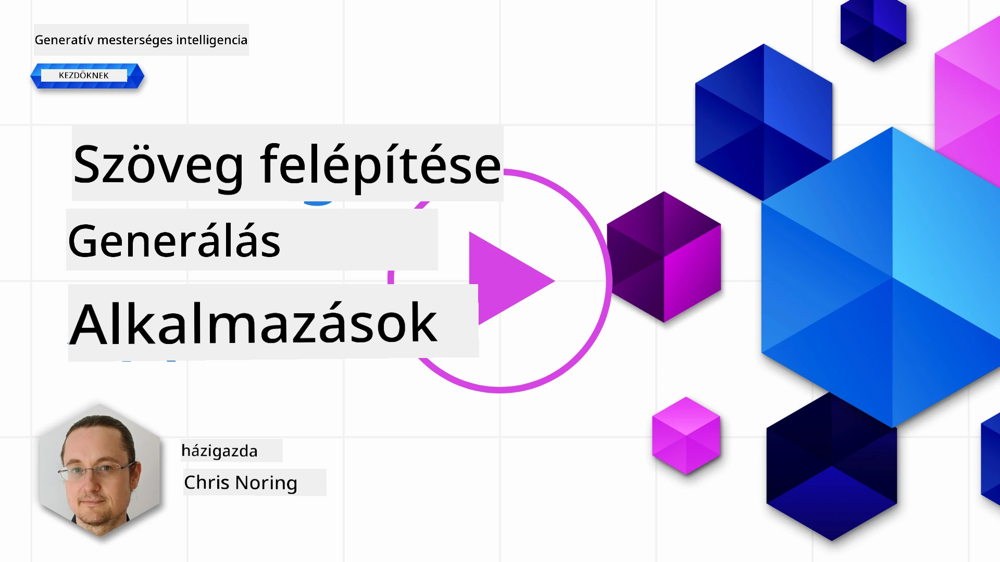

# Szöveg generáló alkalmazások fejlesztése

[](https://youtu.be/0Y5Luf5sRQA?si=t_xVg0clnAI4oUFZ)

> _(Kattintson a fenti képre, hogy megtekinthesse az óra videóját)_

Eddig a tananyag során láttad, hogy vannak alapvető fogalmak, mint például a promptok, és létezik egy egész diszciplína, amit "prompt tervezésnek" hívnak. Számos eszköz, amivel interakcióba léphetsz, mint a ChatGPT, Office 365, Microsoft Power Platform és mások, promptok használatát támogatják, hogy valamilyen célt elérj.

Ahhoz, hogy ilyen élményt adj egy alkalmazáshoz, értened kell olyan fogalmakat, mint a promptok, befejezések, és ki kell választanod egy könyvtárat, amivel dolgozol. Pontosan ezt fogod megtanulni ebben a fejezetben.

## Bevezetés

Ebben a fejezetben a következőket fogod megtanulni:

- Megismerkedsz az openai könyvtárral és annak alapvető fogalmaival.
- Egy szöveg generáló alkalmazást építesz openai segítségével.
- Megérted, hogyan használhatók olyan fogalmak, mint a prompt, temperature és tokenek egy szöveg generáló alkalmazás építéséhez.

## Tanulási célok

A lecke végére képes leszel:

- Elmagyarázni, mi az a szöveg generáló alkalmazás.
- Szöveg generáló alkalmazást építeni az openai segítségével.
- Konfigurálni az alkalmazásodat, hogy több vagy kevesebb tokennel működjön és változtasd meg a temperature értékét a változatosabb kimenet érdekében.

## Mi az a szöveg generáló alkalmazás?

Általában, amikor egy alkalmazást építesz, annak valamilyen felülete van, például ilyen:

- Parancs-alapú. A konzol alkalmazások azok az alkalmazások, ahol beírsz egy parancsot, és az elvégzi a feladatot. Például a `git` egy parancs-alapú alkalmazás.
- Felhasználói felület (UI). Néhány alkalmazás grafikusan felhasználói felülettel rendelkezik, ahol gombokat kattintasz, szöveget írsz be, választhatsz opciókat és így tovább.

### A konzol és UI alkalmazások korlátozottak

Hasonlítsuk ezt össze egy parancs-alapú alkalmazással, ahol beírsz egy parancsot:

- **Korlátozott**. Nem írhatsz be akármilyen parancsot, csak azokat, amiket az alkalmazás támogat.
- **Nyelvspecifikus**. Néhány alkalmazás több nyelvet is támogat, de alapértelmezésben egy adott nyelvre épül, még ha hozzá is adható több nyelvi támogatás.

### A szöveg generáló alkalmazások előnyei

Miben más egy szöveg generáló alkalmazás?

Egy szöveg generáló alkalmazásban több a szabadságod, nem vagy korlátozva egy parancskészletre vagy egy adott bemeneti nyelvre. Helyette természetes nyelvet használhatsz az alkalmazással való interakcióra. Egy másik előny, hogy már egy olyan adatforrással dolgozol, amit egy hatalmas információs korpuszra képeztek ki, míg egy hagyományos alkalmazás adatai egy adatbázis tartalmára korlátozódhatnak.

### Mit építhetek egy szöveg generáló alkalmazással?

Sok mindent építhetsz, például:

- **Egy csevegőrobotot (chatbotot)**. Egy chatbot, ami kérdésekre válaszol témakörökről, például a cégedről és termékeiről, jó példa lehet.
- **Segítőt**. A nyelvi modellek kiválóak szöveg összefoglalására, betekintések kinyerésére, szöveg előállítására, például önéletrajzok létrehozására és más feladatokra.
- **Kódtámogatót**. Attól függően, melyik nyelvi modellt használod, készíthetsz kódtámogató eszközt, ami segít kód írni. Például használhatod a GitHub Copilotot vagy a ChatGPT-t kódírás támogatására.

## Hogyan kezdhetek neki?

Nos, találni kell egy módot az LLM-mel (nagy nyelvi modellel) való integrációra, ami általában a következő két megközelítést jelenti:

- Használj API-t. Itt webkéréseket állítasz össze a promptoddal, és visszakapod a generált szöveget.
- Használj egy könyvtárat. A könyvtárak segítenek kapszulázni az API hívásokat és megkönnyítik a használatot.

## Könyvtárak/SDK-k

Néhány jól ismert könyvtár a nagy nyelvi modellekkel való munkához:

- **openai**, ez a könyvtár megkönnyíti a modellhez való kapcsolódást és promptok küldését.

Vannak emellett magasabb szintű könyvtárak is, mint például:

- **Langchain**. A Langchain jól ismert és támogatja a Pythont.
- **Semantic Kernel**. A Semantic Kernel egy Microsoft könyvtár, amely támogatja a C#, Python és Java nyelveket.

## Első alkalmazás openai-val

Nézzük meg, hogyan építhetjük fel az első alkalmazásunkat, milyen könyvtárak kellenek, mennyi beállítás szükséges és így tovább.

### openai telepítése

Számos könyvtár létezik az OpenAI vagy az Azure OpenAI-val való interakcióhoz. Több programozási nyelv is használható, mint C#, Python, JavaScript, Java és mások. Mi a `openai` Python könyvtárat választottuk, ezért a `pip` segítségével telepítjük.

```bash
pip install openai
```

### Erőforrás létrehozása

A következő lépéseket kell megtenned:

- Hozz létre egy fiókot az Azure-on [https://azure.microsoft.com/free/](https://azure.microsoft.com/free/?WT.mc_id=academic-105485-koreyst).
- Szerezd meg az Azure OpenAI hozzáférést. Látogass el a [https://learn.microsoft.com/azure/ai-foundry/openai/overview#how-do-i-get-access-to-azure-openai](https://learn.microsoft.com/azure/ai-foundry/openai/overview#how-do-i-get-access-to-azure-openai?WT.mc_id=academic-105485-koreyst) oldalra és igényeld a hozzáférést.

  > [!NOTE]
  > A cikk írásakor hozzáférést kell kérned az Azure OpenAI-hoz.

- Telepítsd a Pythont <https://www.python.org/>
- Hozd létre az Azure OpenAI Szolgáltatás erőforrást. A következő útmutatóban olvashatsz arról, hogyan [hozz létre egy erőforrást](https://learn.microsoft.com/azure/ai-foundry/openai/how-to/create-resource?pivots=web-portal?WT.mc_id=academic-105485-koreyst).

### Találd meg az API kulcsot és az endpoint címet

Itt meg kell mondanod az `openai` könyvtárnak, melyik API kulcsot használja. Az API kulcsot az Azure OpenAI erőforrás "Kulcsok és végpont" szekciójában találod, másold ki a "Kulcs 1" értéket.


Ha megvan ez az információ, adjuk meg a könyvtáraknak a használathoz.

> [!NOTE]
> Érdemes az API kulcsot külön tartani a kódtól. Ezt megteheted környezeti változók használatával.
>
> - Állítsd be az `OPENAI_API_KEY` környezeti változót az API kulcsodra.
>   `export OPENAI_API_KEY='sk-...'`

### Azure konfiguráció beállítása

Ha Azure OpenAI-t használsz (most a Microsoft Foundry része), így kell beállítanod a konfigurációt. A szokásos `OpenAI` klienssel dolgozunk, ami az Azure OpenAI `/openai/v1/` végpontjára mutat, ami kompatibilis a Responses API-val és nem igényel `api_version` megadását:

```python
import os
from openai import OpenAI

client = OpenAI(
    api_key=os.environ["AZURE_OPENAI_API_KEY"],
    base_url=f"{os.environ['AZURE_OPENAI_ENDPOINT'].rstrip('/')}/openai/v1/",
)
```

Fent a következőket állítjuk be:

- `api_key`, ez az API kulcsod, amit az Azure Portalban vagy a Microsoft Foundry portálon találsz meg.
- `base_url`, ez az Foundry erőforrásod végpontja, `/openai/v1/`-el kiegészítve. A stabil v1 végpont működik az OpenAI és az Azure OpenAI esetén is, `api_version` kezelés nélkül.

> [!NOTE] > Az `os.environ` olvassa a környezeti változókat. Használhatod, hogy beolvasd például az `AZURE_OPENAI_API_KEY` és `AZURE_OPENAI_ENDPOINT` változókat. Ezeket a terminálodban állítsd be vagy egy olyan könyvtárral, mint a `dotenv`.

## Szöveg generálása

Szöveget a Responses API `responses.create` metódusán keresztül lehet generálni. Például:

```python
prompt = "Complete the following: Once upon a time there was a"

response = client.responses.create(
    model="gpt-5-mini",  # ez a modell telepítésének neve
    input=prompt,
    store=False,
)
print(response.output_text)
```

A fenti kódban elkészítünk egy választ, megadva a használni kívánt modellt és a promptot. Ezután kiírjuk a generált szöveget az `response.output_text` segítségével.

### Többfordulós beszélgetések

A Responses API jól használható egyfordulós szöveg generálásra és többfordulós chatbotokhoz is - egy üzenetlistát adsz meg az `input` mezőben, hogy építsd a beszélgetést:

```python
from openai import OpenAI

client = OpenAI(api_key="sk-...")

response = client.responses.create(model="gpt-5-mini", input="Hello world", store=False)
print(response.output_text)
```

Erről a funkcióról többet olvashatsz a következő fejezetben.

## Gyakorlat - az első szöveg generáló alkalmazásod

Miután megtanultuk, hogyan állítsuk be és konfiguráljuk az openai-t, itt az ideje megépíteni az első szöveg generáló alkalmazásodat. Kövesd a következő lépéseket:

1. Hozz létre egy virtuális környezetet és telepítsd az openai-t:

   ```bash
   python -m venv venv
   source venv/bin/activate
   pip install openai
   ```

   > [!NOTE]
   > Windows esetén a `venv\Scripts\activate` parancsot írd be a `source venv/bin/activate` helyett.

   > [!NOTE]
   > Az Azure OpenAI kulcsod megtalálásához menj a [https://portal.azure.com/](https://portal.azure.com/?WT.mc_id=academic-105485-koreyst) oldalra, keress rá az `Open AI`-ra, válaszd ki az `Open AI erőforrást`, majd a `Kulcsok és végpont` részt és másold ki a `Kulcs 1` értéket.

1. Hozz létre egy _app.py_ fájlt, és írd bele a következő kódot:

   ```python
   import os
   from openai import OpenAI

   client = OpenAI(
       api_key="<replace this value with your Azure OpenAI key>",
       base_url="<endpoint found in Azure Portal>/openai/v1/",
   )
   deployment_name = "<deployment name>"

   # írd be a befejező kódodat
   prompt = "Complete the following: Once upon a time there was a"

   # készíts egy kérést a Responses API használatával
   response = client.responses.create(model=deployment_name, input=prompt, store=False)

   # írd ki a választ
   print(response.output_text)
   ```

   > [!NOTE]
   > Ha sima OpenAI-t használsz (nem Azure-t), akkor a `client = OpenAI(api_key="<cseréld le ezt az OpenAI kulcsodra>")` parancsot használd `base_url` nélkül, és a telepítési név helyett add meg a modellt, például `gpt-5-mini`.

   Erre egy ilyen outputot kellene kapnod:

   ```output
    very unhappy _____.

   Once upon a time there was a very unhappy mermaid.
   ```

## Különböző típusú promptok, különböző feladatokra

Most már láttad, hogyan generálhatók szövegek prompt használatával. Van egy futó programod, amit módosíthatsz és változatos szöveg típusokat generálhatsz.

A promptokat sokféle feladatra használhatod. Például:

- **Szöveg egy adott típusa generálása**. Például egy vers generálása, kvízkérdések megalkotása stb.
- **Információk keresése**. Promtok segítségével kereshetsz információkat, mint például a következő példa: 'Mit jelent a CORS a webfejlesztésben?'.
- **Kód generálása**. Promptokkal kódot generálhatsz, például egy reguláris kifejezést e-mailek ellenőrzésére, vagy akár egy teljes programot, például webalkalmazást.

## Egy praktikus példa: receptgenerátor

Képzeld el, hogy otthon vannak alapanyagaid, és főzni szeretnél. Ehhez recept kell. Receptet kereshetsz keresőmotorral, vagy használhatsz LLM-et.

Írhatsz egy ilyen promptot:

> "Mutass 5 receptet, amelyben a következő alapanyagok vannak: csirke, burgonya és sárgarépa. Minden recept esetében sorold fel az összes felhasznált alapanyagot."

A fenti prompt alapján egy ilyen választ kaphatsz:

```output
1. Roasted Chicken and Vegetables:
Ingredients:
- 4 chicken thighs
- 2 potatoes, cut into cubes
- 2 carrots, cut into cubes
- 2 tablespoons olive oil
- 2 cloves garlic, minced
- 1 teaspoon dried thyme
- 1 teaspoon dried oregano
- Salt and pepper, to taste

2. Chicken and Potato Stew:
Ingredients:
- 2 tablespoons olive oil
- 1 onion, diced
- 2 cloves garlic, minced
- 2 chicken breasts, cut into cubes
- 2 potatoes, cut into cubes
- 2 carrots, cut into cubes
- 1 teaspoon dried oregano
- 1 teaspoon dried thyme
- 1 cup chicken broth
- Salt and pepper, to taste

3. Chicken and Potato Bake:
Ingredients:
- 2 tablespoons olive oil
- 2 chicken breasts, cut into cubes
- 2 potatoes, cut into cubes
- 2 carrots, cut into cubes
- 1 onion, diced
- 2 cloves garlic, minced
- 1 teaspoon dried oregano
- 1 teaspoon dried thyme
- 1 cup chicken broth
- Salt and pepper, to taste

4. Chicken and Potato Soup:
Ingredients:
- 2 tablespoons olive oil
- 1 onion, diced
- 2 cloves garlic, minced
- 2 chicken breasts, cut into cubes
- 2 potatoes, cut into cubes
- 2 carrots, cut into cubes
- 1 teaspoon dried oregano
- 1 teaspoon dried thyme
- 4 cups chicken broth
- Salt and pepper, to taste

5. Chicken and Potato Hash:
Ingredients:
- 2 tablespoons olive oil
- 2 chicken breasts, cut into cubes
- 2 potatoes, cut into cubes
- 2 carrots, cut into cubes
- 1 onion, diced
- 2 cloves garlic, minced
- 1 teaspoon dried oregano
```

Ez remek eredmény, tudom, mit főzzek. Ezen a ponton hasznos lehet a következő fejlesztés:

- Kiszűrni azokat az alapanyagokat, amiket nem szeretek vagy amire allergiás vagyok.
- Bevásárlólistát készíteni, ha netán nincs meg otthon valamennyi alapanyag.

Ehhez a következő kiegészítő promptot adjuk hozzá:

> "Kérlek, távolítsd el a receptek közül a fokhagymát, mert arra allergiás vagyok, és cseréld valami másra. Készíts kérlek egy bevásárlólistát is a receptekhez, tekintettel arra, hogy otthon már van csirkém, burgonyám és sárgarépám."

Most ez az új válaszod lesz:

```output
1. Roasted Chicken and Vegetables:
Ingredients:
- 4 chicken thighs
- 2 potatoes, cut into cubes
- 2 carrots, cut into cubes
- 2 tablespoons olive oil
- 1 teaspoon dried thyme
- 1 teaspoon dried oregano
- Salt and pepper, to taste

2. Chicken and Potato Stew:
Ingredients:
- 2 tablespoons olive oil
- 1 onion, diced
- 2 chicken breasts, cut into cubes
- 2 potatoes, cut into cubes
- 2 carrots, cut into cubes
- 1 teaspoon dried oregano
- 1 teaspoon dried thyme
- 1 cup chicken broth
- Salt and pepper, to taste

3. Chicken and Potato Bake:
Ingredients:
- 2 tablespoons olive oil
- 2 chicken breasts, cut into cubes
- 2 potatoes, cut into cubes
- 2 carrots, cut into cubes
- 1 onion, diced
- 1 teaspoon dried oregano
- 1 teaspoon dried thyme
- 1 cup chicken broth
- Salt and pepper, to taste

4. Chicken and Potato Soup:
Ingredients:
- 2 tablespoons olive oil
- 1 onion, diced
- 2 chicken breasts, cut into cubes
- 2 potatoes, cut into cubes
- 2 carrots, cut into cubes
- 1 teaspoon dried oregano
- 1 teaspoon dried thyme
- 4 cups chicken broth
- Salt and pepper, to taste

5. Chicken and Potato Hash:
Ingredients:
- 2 tablespoons olive oil
- 2 chicken breasts, cut into cubes
- 2 potatoes, cut into cubes
- 2 carrots, cut into cubes
- 1 onion, diced
- 1 teaspoon dried oregano

Shopping List:
- Olive oil
- Onion
- Thyme
- Oregano
- Salt
- Pepper
```

Ez az öt recept fokhagyma nélkül, és egy bevásárlólistád is van, ami figyelembe veszi az otthoni alapanyagokat.

## Gyakorlat - építs recept generátort

Miután eljátszottuk a szituációt, írjunk kódot a bemutatott forgatókönyv megvalósítására. Kövesd az alábbi lépéseket:

1. Használd kiindulópontként a meglévő _app.py_ fájlt.
1. Keresd meg a `prompt` változót, és módosítsd a kódját az alábbiakra:

   ```python
   prompt = "Show me 5 recipes for a dish with the following ingredients: chicken, potatoes, and carrots. Per recipe, list all the ingredients used"
   ```

   Ha most lefuttatod a kódot, az output hasonló lesz a következőhöz:

   ```output
   -Chicken Stew with Potatoes and Carrots: 3 tablespoons oil, 1 onion, chopped, 2 cloves garlic, minced, 1 carrot, peeled and chopped, 1 potato, peeled and chopped, 1 bay leaf, 1 thyme sprig, 1/2 teaspoon salt, 1/4 teaspoon black pepper, 1 1/2 cups chicken broth, 1/2 cup dry white wine, 2 tablespoons chopped fresh parsley, 2 tablespoons unsalted butter, 1 1/2 pounds boneless, skinless chicken thighs, cut into 1-inch pieces
   -Oven-Roasted Chicken with Potatoes and Carrots: 3 tablespoons extra-virgin olive oil, 1 tablespoon Dijon mustard, 1 tablespoon chopped fresh rosemary, 1 tablespoon chopped fresh thyme, 4 cloves garlic, minced, 1 1/2 pounds small red potatoes, quartered, 1 1/2 pounds carrots, quartered lengthwise, 1/2 teaspoon salt, 1/4 teaspoon black pepper, 1 (4-pound) whole chicken
   -Chicken, Potato, and Carrot Casserole: cooking spray, 1 large onion, chopped, 2 cloves garlic, minced, 1 carrot, peeled and shredded, 1 potato, peeled and shredded, 1/2 teaspoon dried thyme leaves, 1/4 teaspoon salt, 1/4 teaspoon black pepper, 2 cups fat-free, low-sodium chicken broth, 1 cup frozen peas, 1/4 cup all-purpose flour, 1 cup 2% reduced-fat milk, 1/4 cup grated Parmesan cheese

   -One Pot Chicken and Potato Dinner: 2 tablespoons olive oil, 1 pound boneless, skinless chicken thighs, cut into 1-inch pieces, 1 large onion, chopped, 3 cloves garlic, minced, 1 carrot, peeled and chopped, 1 potato, peeled and chopped, 1 bay leaf, 1 thyme sprig, 1/2 teaspoon salt, 1/4 teaspoon black pepper, 2 cups chicken broth, 1/2 cup dry white wine

   -Chicken, Potato, and Carrot Curry: 1 tablespoon vegetable oil, 1 large onion, chopped, 2 cloves garlic, minced, 1 carrot, peeled and chopped, 1 potato, peeled and chopped, 1 teaspoon ground coriander, 1 teaspoon ground cumin, 1/2 teaspoon ground turmeric, 1/2 teaspoon ground ginger, 1/4 teaspoon cayenne pepper, 2 cups chicken broth, 1/2 cup dry white wine, 1 (15-ounce) can chickpeas, drained and rinsed, 1/2 cup raisins, 1/2 cup chopped fresh cilantro
   ```

   > MEGJEGYZÉS: az LLM-ed nem determinisztikus, ezért minden futtatásnál eltérő eredmény születhet.

   Remek, nézzük, hogyan lehetne tovább fejleszteni. Arra törekszünk, hogy a kód rugalmas legyen, tehát a recept alapanyagok és a receptek száma is módosítható legyen.

1. Módosítsuk a kódot az alábbiak szerint:

   ```python
   no_recipes = input("No of recipes (for example, 5): ")

   ingredients = input("List of ingredients (for example, chicken, potatoes, and carrots): ")

   # szúrja be a receptek számát a bemeneti szövegbe és az összetevőkbe
   prompt = f"Show me {no_recipes} recipes for a dish with the following ingredients: {ingredients}. Per recipe, list all the ingredients used"
   ```

   Egy teszt lefutása így nézhet ki:

   ```output
   No of recipes (for example, 5): 3
   List of ingredients (for example, chicken, potatoes, and carrots): milk,strawberries

   -Strawberry milk shake: milk, strawberries, sugar, vanilla extract, ice cubes
   -Strawberry shortcake: milk, flour, baking powder, sugar, salt, unsalted butter, strawberries, whipped cream
   -Strawberry milk: milk, strawberries, sugar, vanilla extract
   ```

### Fejlesztés szűrő és bevásárlólista hozzáadásával

Most már van egy működő alkalmazásunk, ami képes receptek előállítására, és rugalmas is, mivel a felhasználótól kap bemeneteket, így a receptek száma és az alapanyagok is változtathatók.

További fejlesztéshez szeretnénk az alábbiakat hozzáadni:

- **Alapanyagok szűrése**. Szeretnénk kiszűrni azokat az összetevőket, amiket nem szeretünk vagy allergiásak vagyunk rájuk. Ehhez szerkeszthetjük meglévő promptunkat és a végére egy szűrőfeltételt tehetünk, így:

  ```python
  filter = input("Filter (for example, vegetarian, vegan, or gluten-free): ")

  prompt = f"Show me {no_recipes} recipes for a dish with the following ingredients: {ingredients}. Per recipe, list all the ingredients used, no {filter}"
  ```

  Fent hozzáadtuk a `{filter}`-t a prompt végére, és meg is fogjuk kapni a felhasználótól a szűrő értéket.

  Egy példa a program futtatására most így nézhet ki:

  ```output
  No of recipes (for example, 5): 3
  List of ingredients (for example, chicken, potatoes, and carrots): onion,milk
  Filter (for example, vegetarian, vegan, or gluten-free): no milk

  1. French Onion Soup

  Ingredients:

  -1 large onion, sliced
  -3 cups beef broth
  -1 cup milk
  -6 slices french bread
  -1/4 cup shredded Parmesan cheese
  -1 tablespoon butter
  -1 teaspoon dried thyme
  -1/4 teaspoon salt
  -1/4 teaspoon black pepper

  Instructions:

  1. In a large pot, sauté onions in butter until golden brown.
  2. Add beef broth, milk, thyme, salt, and pepper. Bring to a boil.
  3. Reduce heat and simmer for 10 minutes.
  4. Place french bread slices on soup bowls.
  5. Ladle soup over bread.
  6. Sprinkle with Parmesan cheese.

  2. Onion and Potato Soup

  Ingredients:

  -1 large onion, chopped
  -2 cups potatoes, diced
  -3 cups vegetable broth
  -1 cup milk
  -1/4 teaspoon black pepper

  Instructions:

  1. In a large pot, sauté onions in butter until golden brown.
  2. Add potatoes, vegetable broth, milk, and pepper. Bring to a boil.
  3. Reduce heat and simmer for 10 minutes.
  4. Serve hot.

  3. Creamy Onion Soup

  Ingredients:

  -1 large onion, chopped
  -3 cups vegetable broth
  -1 cup milk
  -1/4 teaspoon black pepper
  -1/4 cup all-purpose flour
  -1/2 cup shredded Parmesan cheese

  Instructions:

  1. In a large pot, sauté onions in butter until golden brown.
  2. Add vegetable broth, milk, and pepper. Bring to a boil.
  3. Reduce heat and simmer for 10 minutes.
  4. In a small bowl, whisk together flour and Parmesan cheese until smooth.
  5. Add to soup and simmer for an additional 5 minutes, or until soup has thickened.
  ```

  Ahogy látod, azokat a recepteket kiszűrtük, amiben tej szerepel. De ha laktózérzékeny vagy, akkor akár a sajtot is kiszűrheted, tehát egyértelműen kell kommunikálnod.


- **Állíts össze egy bevásárlólistát**. Szeretnénk összeállítani egy bevásárlólistát, figyelembe véve, hogy mi van már itthon.

  Ehhez a funkcióhoz vagy megpróbálhatunk mindent egyetlen promptban megoldani, vagy két promptra bonthatjuk. Próbáljuk ki az utóbbi megközelítést. Itt egy további prompt hozzáadását javasoljuk, de ahhoz, hogy ez működjön, az első prompt eredményét hozzá kell adnunk a második prompt kontextusához.

  Találd meg a kódban azt a részt, ahol az első prompt eredményét írja ki, és add hozzá alá a következő kódot:

  ```python
  old_prompt_result = response.output_text
  prompt = "Produce a shopping list for the generated recipes and please don't include ingredients that I already have."

  new_prompt = f"{old_prompt_result} {prompt}"
  response = client.responses.create(model=deployment_name, input=new_prompt, max_output_tokens=1200, store=False)

  # válasz kiíratása
  print("Shopping list:")
  print(response.output_text)
  ```

  Figyeld meg a következőket:

  1. Egy új promptot építünk, az első prompt eredményét hozzáadva az új prompthoz:

     ```python
     new_prompt = f"{old_prompt_result} {prompt}"
     ```

  1. Új kérést indítunk, figyelembe véve az első promptnál kért tokenek számát, ezért most `max_output_tokens` értéke 1200 lesz.

     ```python
     response = client.responses.create(model=deployment_name, input=new_prompt, max_output_tokens=1200, store=False)
     ```

     Ezen a kódon futtatva most az alábbi kimenetet kapjuk:

     ```output
     No of recipes (for example, 5): 2
     List of ingredients (for example, chicken, potatoes, and carrots): apple,flour
     Filter (for example, vegetarian, vegan, or gluten-free): sugar


     -Apple and flour pancakes: 1 cup flour, 1/2 tsp baking powder, 1/2 tsp baking soda, 1/4 tsp salt, 1 tbsp sugar, 1 egg, 1 cup buttermilk or sour milk, 1/4 cup melted butter, 1 Granny Smith apple, peeled and grated
     -Apple fritters: 1-1/2 cups flour, 1 tsp baking powder, 1/4 tsp salt, 1/4 tsp baking soda, 1/4 tsp nutmeg, 1/4 tsp cinnamon, 1/4 tsp allspice, 1/4 cup sugar, 1/4 cup vegetable shortening, 1/4 cup milk, 1 egg, 2 cups shredded, peeled apples
     Shopping list:
     -Flour, baking powder, baking soda, salt, sugar, egg, buttermilk, butter, apple, nutmeg, cinnamon, allspice
     ```

## Fejleszd tovább a beállításaidat

Amit eddig csináltunk, az egy működő kód, de van néhány módosítás, amit érdemes elvégezni a további javítás érdekében. Néhány teendő:

- **Titkok elkülönítése a kódtól**, például az API kulcs. A titkok nem tartoznak a kódba, és biztonságos helyen kell tárolni őket. A titkok elkülönítésére környezeti változókat használhatunk, illetve olyan könyvtárakat mint a `python-dotenv`, hogy fájlból töltsük be őket. Így nézhet ki ez kódban:

  1. Hozz létre egy `.env` fájlt a következő tartalommal:

     ```bash
     OPENAI_API_KEY=sk-...
     ```

     > Megjegyzés: Azure OpenAI használata esetén, Microsoft Foundry-ban, helyette az alábbi környezeti változókat kell beállítani:

     ```bash
     AZURE_OPENAI_API_KEY=<replace>
     AZURE_OPENAI_ENDPOINT=<replace>
     AZURE_OPENAI_API_VERSION=2024-10-21
     ```

     Kódban így töltjük be a környezeti változókat:

     ```python
     import os
     from dotenv import load_dotenv
     from openai import OpenAI

     load_dotenv()

     client = OpenAI(api_key=os.environ["OPENAI_API_KEY"])
     ```

- **Szó a token hosszúságról**. Fontoljuk meg, mennyi tokenre van szükségünk a kívánt szöveg generálásához. A tokenek pénzbe kerülnek, ezért lehetőség szerint takarékonynak kell lennünk a felhasznált tokenek számával. Például: le lehet-e rövidíteni a promptot, hogy kevesebb tokenből megússzuk?

  A felhasznált tokenek számát a `max_output_tokens` paraméterrel állíthatod. Ha például 100 tokenre van szükséged, ezt használhatod:

  ```python
  response = client.responses.create(model=deployment, input=prompt, max_output_tokens=100, store=False)
  ```

- **Kísérletezés a hőmérséklettel**. A hőmérséklet (temperature) egy fontos paraméter, amit eddig nem említettünk, de fontos a program teljesítményének alakításában. Minél magasabb a hőmérséklet értéke, annál véletlenszerűbb lesz a kimenet. Fordítva, minél alacsonyabb a hőmérséklet, annál kiszámíthatóbb a kimenet. Gondold át, hogy szeretnél-e változatosságot a válaszodban.

  A hőmérséklet beállítására a `temperature` paramétert használhatod. Például, ha 0.5 értéket szeretnél adni:

  ```python
  response = client.responses.create(model=deployment, input=prompt, temperature=0.5, store=False)
  ```

  > Megjegyzés: minél közelebb van 1.0-hez, annál változatosabb a kimenet.

- **Az érvényes következtető modellek nem használják a `temperature` paramétert**. Ez egy fontos 2026-os változás. A Microsoft Foundry jelenleg nem elavult, jelenlegi modellei **következtető modellek** (GPT-5 család, o-sorozat) - és ezek **nem támogatják a `temperature` vagy `top_p` paramétereket** (sem a `max_tokens`-t; helyette a `max_output_tokens` használatos). Ha a `temperature`-t küldöd a `gpt-5-mini`-nek, "nem támogatott paraméter" hiba lesz az eredmény. Ezért a fent említett hőmérséklet példát olyan modellnél próbáld ki, amely még támogatja a mintavételezési vezérlőket - például egy nyílt **Llama** modell, mint a `Llama-3.3-70B-Instruct` a [Microsoft Foundry modellkatalógusából](https://ai.azure.com/catalog/models?WT.mc_id=academic-105485-koreyst), használva a Foundry Models / Azure AI Inference végpontot (ugyanúgy, mint a `githubmodels-*` minták esetében). A GPT-5-höz hasonló következtető modelleknél másképpen irányítod a kimenetet:
  - **Prompt tervezés** - világos utasítások, példák és strukturált kimenet (lásd a [04 - Prompt Engineering](../04-prompt-engineering-fundamentals/README.md?WT.mc_id=academic-105485-koreyst) leckét) végzik el azt, amit a mintavételezési beállítások korábban.
  - **Következtető vezérlők** - olyan paraméterek, mint a következtetési erőfeszítés/terjedelem, amelyek mérlegelik a következtetés mélységét a késleltetés és költség ellenében.

  Röviden: a `temperature`/`top_p` még mindig érvényes sok modellen (Llama, Mistral, Phi és a GPT-4.x család - bár utóbbi deprekálódó), de az irány a prompt tervezés + következtetési vezérlők használata a GPT-5-höz hasonló következtető modelleknél.

## Feladat

Ez a feladat szabadon választható, hogy mit építesz.

Íme néhány javaslat:

- Finomítsd tovább a recept generátor alkalmazást. Játssz a hőmérséklet értékekkel és a promptokkal, hogy lássad, mit tudsz kihozni belőle.
- Építs egy "tanulótársat". Ez az app tudjon kérdésekre válaszolni egy témában, például Python, ilyen prompt lehet "Mi az adott téma Pythonban?", vagy kérhetsz kódot egy adott témához stb.
- Történelmi bot, elevenítsd meg a történelmet, utasítsd a botot, hogy játsszon el egy adott történelmi szereplőt, és kérdezd meg az életéről és koráról.

## Megoldás

### Tanulótárs

Lent egy kezdő prompt látható, nézd meg, hogyan tudod használni és a kedved szerint módosítani.

```text
- "You're an expert on the Python language

    Suggest a beginner lesson for Python in the following format:

    Format:
    - concepts:
    - brief explanation of the lesson:
    - exercise in code with solutions"
```

### Történelmi bot

Íme néhány prompt, amit használhatsz:

```text
- "You are Abe Lincoln, tell me about yourself in 3 sentences, and respond using grammar and words like Abe would have used"
- "You are Abe Lincoln, respond using grammar and words like Abe would have used:

   Tell me about your greatest accomplishments, in 300 words"
```

## Tudásellenőrzés

Mit csinál a hőmérséklet koncepció?

1. Szabályozza, hogy mennyire véletlenszerű a kimenet.
1. Szabályozza, hogy mekkora legyen a válasz.
1. Szabályozza, hogy hány token legyen felhasználva.

## 🚀 Kihívás

A feladaton dolgozva próbáld változtatni a hőmérsékletet: állítsd 0-ra, 0.5-re és 1-re. Ne feledd, 0 a legkevésbé változatos, 1 a leginkább változatos. Melyik érték működik legjobban az alkalmazásodban?

## Nagyszerű munka! Folytasd a tanulást

A lecke elvégzése után nézd meg [a Generatív AI tanulási gyűjteményünket](https://aka.ms/genai-collection?WT.mc_id=academic-105485-koreyst), hogy tovább fejleszd a generatív MI tudásodat!

Lépj tovább a 7. leckére, ahol megnézzük, hogyan lehet [chat alkalmazásokat építeni](../07-building-chat-applications/README.md?WT.mc_id=academic-105485-koreyst)!

---

<!-- CO-OP TRANSLATOR DISCLAIMER START -->
**Jogi nyilatkozat**:
Ez a dokumentum az AI fordítási szolgáltatás, a [Co-op Translator](https://github.com/Azure/co-op-translator) segítségével készült. Bár az pontosságra törekszünk, kérjük, vegye figyelembe, hogy az automatikus fordítások hibákat vagy pontatlanságokat tartalmazhatnak. Az eredeti dokumentum az anyanyelvén tekintendő hiteles forrásnak. Fontos információk esetén professzionális emberi fordítást javasolunk. Nem vállalunk felelősséget semmilyen félreértésért vagy téves értelmezésért, amely ebből a fordításból ered.
<!-- CO-OP TRANSLATOR DISCLAIMER END -->