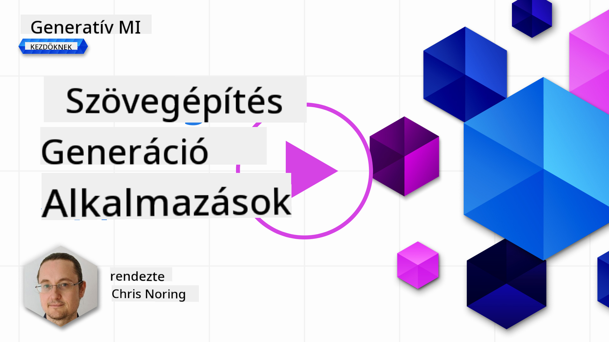

<!--
CO_OP_TRANSLATOR_METADATA:
{
  "original_hash": "5ec6c92b629564538ef397c550adb73e",
  "translation_date": "2025-06-25T14:43:57+00:00",
  "source_file": "06-text-generation-apps/README.md",
  "language_code": "hu"
}
-->
# Szövegalkotó alkalmazások építése

[](https://aka.ms/gen-ai-lesson6-gh?WT.mc_id=academic-105485-koreyst)

> _(Kattints a fenti képre a lecke videójának megtekintéséhez)_

Eddig láthattad ebben a tananyagban, hogy vannak alapvető fogalmak, mint például a promptok, és még egy egész tudományág is létezik, amit "prompt mérnökségnek" neveznek. Számos eszközzel, mint a ChatGPT, az Office 365, a Microsoft Power Platform és mások, használhatsz promptokat, hogy valamit elérj.

Ahhoz, hogy ilyen élményt adhass egy alkalmazáshoz, meg kell értened a promptok, a befejezések fogalmát, és ki kell választanod egy könyvtárat, amivel dolgozni fogsz. Pontosan ezt fogod megtanulni ebben a fejezetben.

## Bevezetés

Ebben a fejezetben:

- Megismered az openai könyvtárat és annak alapvető fogalmait.
- Szövegalkotó alkalmazást építesz az openai segítségével.
- Megérted, hogyan használhatod a prompt, a hőmérséklet és a tokenek fogalmát egy szövegalkotó alkalmazás létrehozásához.

## Tanulási célok

A lecke végére képes leszel:

- Megmagyarázni, mi az a szövegalkotó alkalmazás.
- Szövegalkotó alkalmazást építeni az openai segítségével.
- Beállítani az alkalmazásodat, hogy több vagy kevesebb tokent használjon, és megváltoztasd a hőmérsékletet a változatosabb kimenet érdekében.

## Mi az a szövegalkotó alkalmazás?

Általában, amikor alkalmazást építesz, valamilyen interfésze van, például az alábbiak:

- Parancsalapú. Konzol alkalmazások tipikus példák, ahol beírsz egy parancsot, és az végrehajt egy feladatot. Például a `git` egy parancsalapú alkalmazás.
- Felhasználói felület (UI). Egyes alkalmazások grafikus felhasználói felületekkel (GUI) rendelkeznek, ahol gombokra kattintasz, szöveget írsz be, opciókat választasz és így tovább.

### Konzol és UI alkalmazások korlátai

Hasonlítsd össze egy parancsalapú alkalmazással, ahol beírsz egy parancsot:

- **Korlátozott**. Nem írhatod be bármelyik parancsot, csak azokat, amelyeket az alkalmazás támogat.
- **Nyelv specifikus**. Néhány alkalmazás támogat több nyelvet, de alapértelmezetten az alkalmazás egy adott nyelvre épül, még akkor is, ha hozzáadhatsz több nyelvi támogatást.

### Szövegalkotó alkalmazások előnyei

Tehát miben különbözik egy szövegalkotó alkalmazás?

Egy szövegalkotó alkalmazásban nagyobb rugalmasságod van, nem vagy korlátozva egy parancskészletre vagy egy adott bemeneti nyelvre. Ehelyett természetes nyelvet használhatsz az alkalmazással való interakcióhoz. Egy másik előnye, hogy mivel már egy adatforrással dolgozol, amelyet hatalmas információkorpuszra képeztek ki, míg egy hagyományos alkalmazás korlátozott lehet az adatbázisban lévő információk tekintetében.

### Mit építhetek szövegalkotó alkalmazással?

Sok mindent építhetsz. Például:

- **Chatbot**. Egy chatbot, amely kérdésekre válaszol témákról, mint például a vállalatod és annak termékei, jó párosítás lehet.
- **Segítő**. Az LLM-ek kiválóak olyan dolgokban, mint a szövegek összefoglalása, betekintések szerzése szövegekből, szövegek előállítása, mint például önéletrajzok és így tovább.
- **Kód asszisztens**. Az alkalmazott nyelvi modelltől függően építhetsz egy kód asszisztenst, amely segít a kódírásban. Például használhatsz egy terméket, mint a GitHub Copilot vagy a ChatGPT, hogy segítsen kódot írni.

## Hogyan kezdhetek neki?

Nos, meg kell találnod a módját, hogy integrálódj egy LLM-mel, ami általában a következő két megközelítést jelenti:

- Használj egy API-t. Itt webes kéréseket készítesz a promptoddal, és visszakapod a generált szöveget.
- Használj egy könyvtárat. A könyvtárak segítenek kapszulázni az API hívásokat, és könnyebbé teszik a használatukat.

## Könyvtárak/SDK-k

Van néhány jól ismert könyvtár az LLM-ekkel való munkához, mint például:

- **openai**, ez a könyvtár megkönnyíti a modellhez való csatlakozást és a promptok küldését.

Aztán vannak könyvtárak, amelyek magasabb szinten működnek, mint például:

- **Langchain**. A Langchain jól ismert és támogatja a Pythont.
- **Semantic Kernel**. A Semantic Kernel egy Microsoft által támogatott könyvtár, amely a C#, Python és Java nyelveket támogatja.

## Első alkalmazás openai használatával

Nézzük meg, hogyan építhetjük meg az első alkalmazásunkat, milyen könyvtárakra van szükségünk, mennyire van szükségünk és így tovább.

### openai telepítése

Számos könyvtár létezik az OpenAI vagy az Azure OpenAI-val való interakcióra. Lehetőség van számos programozási nyelv, például C#, Python, JavaScript, Java és mások használatára is. Mi a `openai` Python könyvtárat választottuk, így a `pip` segítségével telepítjük.

```bash
pip install openai
```

### Erőforrás létrehozása

A következő lépéseket kell elvégezned:

- Hozz létre egy fiókot az Azure-on [https://azure.microsoft.com/free/](https://azure.microsoft.com/free/?WT.mc_id=academic-105485-koreyst).
- Szerezz hozzáférést az Azure OpenAI-hoz. Látogasd meg a [https://learn.microsoft.com/azure/ai-services/openai/overview#how-do-i-get-access-to-azure-openai](https://learn.microsoft.com/azure/ai-services/openai/overview#how-do-i-get-access-to-azure-openai?WT.mc_id=academic-105485-koreyst) oldalt, és kérj hozzáférést.

  > [!NOTE]
  > A cikk írásakor kérelmezni kell a hozzáférést az Azure OpenAI-hoz.

- Telepítsd a Python-t <https://www.python.org/>
- Hozz létre egy Azure OpenAI Service erőforrást. Lásd ezt az útmutatót, hogyan lehet [erőforrást létrehozni](https://learn.microsoft.com/azure/ai-services/openai/how-to/create-resource?pivots=web-portal?WT.mc_id=academic-105485-koreyst).

### API kulcs és végpont megkeresése

Ezen a ponton meg kell mondanod a `openai` könyvtáradnak, hogy melyik API kulcsot használja. Az API kulcs megtalálásához menj az Azure OpenAI erőforrásod "Kulcsok és Végpont" szakaszába, és másold le az "1. kulcs" értékét.


Most, hogy ezt az információt kimásoltad, utasítsuk a könyvtárakat, hogy használják.

> [!NOTE]
> Érdemes az API kulcsodat elválasztani a kódtól. Ezt környezeti változók használatával teheted meg.
>
> - Állítsd be a környezeti változót `OPENAI_API_KEY` to your API key.
>   `export OPENAI_API_KEY='sk-...'`

### Azure konfiguráció beállítása

Ha az Azure OpenAI-t használod, itt van, hogyan állíthatod be a konfigurációt:

```python
openai.api_type = 'azure'
openai.api_key = os.environ["OPENAI_API_KEY"]
openai.api_version = '2023-05-15'
openai.api_base = os.getenv("API_BASE")
```

A fentiekben a következőket állítjuk be:

- `api_type` to `azure`. This tells the library to use Azure OpenAI and not OpenAI.
- `api_key`, this is your API key found in the Azure Portal.
- `api_version`, this is the version of the API you want to use. At the time of writing, the latest version is `2023-05-15`.
- `api_base`, this is the endpoint of the API. You can find it in the Azure Portal next to your API key.

> [!NOTE] > `os.getenv` is a function that reads environment variables. You can use it to read environment variables like `OPENAI_API_KEY` and `API_BASE`. Set these environment variables in your terminal or by using a library like `dotenv`.

## Generate text

The way to generate text is to use the `Completion` osztály. Íme egy példa:

```python
prompt = "Complete the following: Once upon a time there was a"

completion = openai.Completion.create(model="davinci-002", prompt=prompt)
print(completion.choices[0].text)
```

A fenti kódban létrehozunk egy completion objektumot, és megadjuk a használni kívánt modellt és promptot. Ezután kiírjuk a generált szöveget.

### Chat befejezések

Eddig láthattad, hogyan használtuk a `Completion` to generate text. But there's another class called `ChatCompletion`-t, ami inkább a chatbotokhoz illik. Íme egy példa a használatára:

```python
import openai

openai.api_key = "sk-..."

completion = openai.ChatCompletion.create(model="gpt-3.5-turbo", messages=[{"role": "user", "content": "Hello world"}])
print(completion.choices[0].message.content)
```

Többet erről a funkcióról a következő fejezetben.

## Gyakorlat - az első szövegalkotó alkalmazásod

Most, hogy megtanultuk, hogyan állítsuk be és konfiguráljuk az openai-t, itt az ideje, hogy megépítsd az első szövegalkotó alkalmazásod. Az alkalmazás megépítéséhez kövesd az alábbi lépéseket:

1. Hozz létre egy virtuális környezetet és telepítsd az openai-t:

   ```bash
   python -m venv venv
   source venv/bin/activate
   pip install openai
   ```

   > [!NOTE]
   > Ha Windows-t használsz, írd be `venv\Scripts\activate` instead of `source venv/bin/activate`.

   > [!NOTE]
   > Locate your Azure OpenAI key by going to [https://portal.azure.com/](https://portal.azure.com/?WT.mc_id=academic-105485-koreyst) and search for `Open AI` and select the `Open AI resource` and then select `Keys and Endpoint` and copy the `Key 1` értéket.

1. Hozz létre egy _app.py_ fájlt, és add meg a következő kódot:

   ```python
   import openai

   openai.api_key = "<replace this value with your open ai key or Azure OpenAI key>"

   openai.api_type = 'azure'
   openai.api_version = '2023-05-15'
   openai.api_base = "<endpoint found in Azure Portal where your API key is>"
   deployment_name = "<deployment name>"

   # add your completion code
   prompt = "Complete the following: Once upon a time there was a"
   messages = [{"role": "user", "content": prompt}]

   # make completion
   completion = openai.chat.completions.create(model=deployment_name, messages=messages)

   # print response
   print(completion.choices[0].message.content)
   ```

   > [!NOTE]
   > Ha az Azure OpenAI-t használod, be kell állítanod az `api_type` to `azure` and set the `api_key`-et az Azure OpenAI kulcsodra.

   Olyan kimenetet kell látnod, mint a következő:

   ```output
    very unhappy _____.

   Once upon a time there was a very unhappy mermaid.
   ```

## Különböző típusú promptok, különböző dolgokra

Most láthattad, hogyan lehet szöveget generálni egy prompt használatával. Még egy programod is fut, amit módosíthatsz és megváltoztathatsz, hogy különböző típusú szövegeket generáljon.

A promptok mindenféle feladatra használhatók. Például:

- **Egy típusú szöveg generálása**. Például generálhatsz egy verset, kvízkérdéseket stb.
- **Információ keresése**. Használhatsz promptokat információ keresésére, mint a következő példa: 'Mit jelent a CORS a webfejlesztésben?'.
- **Kód generálása**. Használhatsz promptokat kód generálására, például egy reguláris kifejezés fejlesztésére, amelyet e-mailek érvényesítésére használnak, vagy akár egy teljes program generálására, mint például egy webalkalmazás.

## Egy gyakorlati példa: receptgenerátor

Képzeld el, hogy vannak otthon hozzávalóid, és szeretnél főzni valamit. Ehhez szükséged van egy receptre. Egyik módja a receptek keresésének, hogy keresőmotort használsz, vagy használhatsz egy LLM-et is.

Írhatsz egy promptot így:

> "Mutass 5 receptet olyan ételhez, amely a következő hozzávalókat tartalmazza: csirke, burgonya és répa. Receptenként sorold fel az összes felhasznált hozzávalót"

A fenti prompt alapján a válaszod hasonló lehet:

```output
1. Roasted Chicken and Vegetables:
Ingredients:
- 4 chicken thighs
- 2 potatoes, cut into cubes
- 2 carrots, cut into cubes
- 2 tablespoons olive oil
- 2 cloves garlic, minced
- 1 teaspoon dried thyme
- 1 teaspoon dried oregano
- Salt and pepper, to taste

2. Chicken and Potato Stew:
Ingredients:
- 2 tablespoons olive oil
- 1 onion, diced
- 2 cloves garlic, minced
- 2 chicken breasts, cut into cubes
- 2 potatoes, cut into cubes
- 2 carrots, cut into cubes
- 1 teaspoon dried oregano
- 1 teaspoon dried thyme
- 1 cup chicken broth
- Salt and pepper, to taste

3. Chicken and Potato Bake:
Ingredients:
- 2 tablespoons olive oil
- 2 chicken breasts, cut into cubes
- 2 potatoes, cut into cubes
- 2 carrots, cut into cubes
- 1 onion, diced
- 2 cloves garlic, minced
- 1 teaspoon dried oregano
- 1 teaspoon dried thyme
- 1 cup chicken broth
- Salt and pepper, to taste

4. Chicken and Potato Soup:
Ingredients:
- 2 tablespoons olive oil
- 1 onion, diced
- 2 cloves garlic, minced
- 2 chicken breasts, cut into cubes
- 2 potatoes, cut into cubes
- 2 carrots, cut into cubes
- 1 teaspoon dried oregano
- 1 teaspoon dried thyme
- 4 cups chicken broth
- Salt and pepper, to taste

5. Chicken and Potato Hash:
Ingredients:
- 2 tablespoons olive oil
- 2 chicken breasts, cut into cubes
- 2 potatoes, cut into cubes
- 2 carrots, cut into cubes
- 1 onion, diced
- 2 cloves garlic, minced
- 1 teaspoon dried oregano
```

Ez az eredmény nagyszerű, tudom, mit főzzek. Ezen a ponton hasznos fejlesztések lehetnek:

- Szűrni azokat a hozzávalókat, amelyeket nem szeretek vagy allergiás vagyok rájuk.
- Bevásárlólistát készíteni, ha esetleg nincs meg minden hozzávaló otthon.

A fenti esetekhez adjunk hozzá egy további promptot:

> "Kérlek, távolítsd el a recepteket, amelyek fokhagymát tartalmaznak, mert allergiás vagyok, és cseréld ki valami másra. Emellett készíts egy bevásárlólistát a receptekhez, figyelembe véve, hogy már van csirkém, burgonyám és répám otthon."

Most van egy új eredményed, nevezetesen:

```output
1. Roasted Chicken and Vegetables:
Ingredients:
- 4 chicken thighs
- 2 potatoes, cut into cubes
- 2 carrots, cut into cubes
- 2 tablespoons olive oil
- 1 teaspoon dried thyme
- 1 teaspoon dried oregano
- Salt and pepper, to taste

2. Chicken and Potato Stew:
Ingredients:
- 2 tablespoons olive oil
- 1 onion, diced
- 2 chicken breasts, cut into cubes
- 2 potatoes, cut into cubes
- 2 carrots, cut into cubes
- 1 teaspoon dried oregano
- 1 teaspoon dried thyme
- 1 cup chicken broth
- Salt and pepper, to taste

3. Chicken and Potato Bake:
Ingredients:
- 2 tablespoons olive oil
- 2 chicken breasts, cut into cubes
- 2 potatoes, cut into cubes
- 2 carrots, cut into cubes
- 1 onion, diced
- 1 teaspoon dried oregano
- 1 teaspoon dried thyme
- 1 cup chicken broth
- Salt and pepper, to taste

4. Chicken and Potato Soup:
Ingredients:
- 2 tablespoons olive oil
- 1 onion, diced
- 2 chicken breasts, cut into cubes
- 2 potatoes, cut into cubes
- 2 carrots, cut into cubes
- 1 teaspoon dried oregano
- 1 teaspoon dried thyme
- 4 cups chicken broth
- Salt and pepper, to taste

5. Chicken and Potato Hash:
Ingredients:
- 2 tablespoons olive oil
- 2 chicken breasts, cut into cubes
- 2 potatoes, cut into cubes
- 2 carrots, cut into cubes
- 1 onion, diced
- 1 teaspoon dried oregano

Shopping List:
- Olive oil
- Onion
- Thyme
- Oregano
- Salt
- Pepper
```

Ez az öt recepted, fokhagyma nélkül, és van egy bevásárlólistád is, figyelembe véve, hogy mi van már otthon.

## Gyakorlat - receptgenerátor építése

Most, hogy lejátszottunk egy forgatókönyvet, írjunk kódot a bemutatott forgatókönyv megvalósításához. Ehhez kövesd az alábbi lépéseket:

1. Használd a meglévő _app.py_ fájlt kiindulópontként
1. Keressd meg a `prompt` változót, és módosítsd a kódját a következőre:

   ```python
   prompt = "Show me 5 recipes for a dish with the following ingredients: chicken, potatoes, and carrots. Per recipe, list all the ingredients used"
   ```

   Ha most futtatod a kódot, a következőhöz hasonló kimenetet kell látnod:

   ```output
   -Chicken Stew with Potatoes and Carrots: 3 tablespoons oil, 1 onion, chopped, 2 cloves garlic, minced, 1 carrot, peeled and chopped, 1 potato, peeled and chopped, 1 bay leaf, 1 thyme sprig, 1/2 teaspoon salt, 1/4 teaspoon black pepper, 1 1/2 cups chicken broth, 1/2 cup dry white wine, 2 tablespoons chopped fresh parsley, 2 tablespoons unsalted butter, 1 1/2 pounds boneless, skinless chicken thighs, cut into 1-inch pieces
   -Oven-Roasted Chicken with Potatoes and Carrots: 3 tablespoons extra-virgin olive oil, 1 tablespoon Dijon mustard, 1 tablespoon chopped fresh rosemary, 1 tablespoon chopped fresh thyme, 4 cloves garlic, minced, 1 1/2 pounds small red potatoes, quartered, 1 1/2 pounds carrots, quartered lengthwise, 1/2 teaspoon salt, 1/4 teaspoon black pepper, 1 (4-pound) whole chicken
   -Chicken, Potato, and Carrot Casserole: cooking spray, 1 large onion, chopped, 2 cloves garlic, minced, 1 carrot, peeled and shredded, 1 potato, peeled and shredded, 1/2 teaspoon dried thyme leaves, 1/4 teaspoon salt, 1/4 teaspoon black pepper, 2 cups fat-free, low-sodium chicken broth, 1 cup frozen peas, 1/4 cup all-purpose flour, 1 cup 2% reduced-fat milk, 1/4 cup grated Parmesan cheese

   -One Pot Chicken and Potato Dinner: 2 tablespoons olive oil, 1 pound boneless, skinless chicken thighs, cut into 1-inch pieces, 1 large onion, chopped, 3 cloves garlic, minced, 1 carrot, peeled and chopped, 1 potato, peeled and chopped, 1 bay leaf, 1 thyme sprig, 1/2 teaspoon salt, 1/4 teaspoon black pepper, 2 cups chicken broth, 1/2 cup dry white wine

   -Chicken, Potato, and Carrot Curry: 1 tablespoon vegetable oil, 1 large onion, chopped, 2 cloves garlic, minced, 1 carrot, peeled and chopped, 1 potato, peeled and chopped, 1 teaspoon ground coriander, 1 teaspoon ground cumin, 1/2 teaspoon ground turmeric, 1/2 teaspoon ground ginger, 1/4 teaspoon cayenne pepper, 2 cups chicken broth, 1/2 cup dry white wine, 1 (15-ounce) can chickpeas, drained and rinsed, 1/2 cup raisins, 1/2 cup chopped fresh cilantro
   ```

   > MEGJEGYZÉS, az LLM nem determinisztikus, így minden futtatáskor más eredményt kaphatsz.

   Nagyszerű, nézzük meg, hogyan javíthatunk a dolgokon. A dolgok javítása érdekében biztosítani szeretnénk, hogy a kód rugalmas legyen, így a hozzávalók és a receptek száma javítható és változtatható.

1. Változtassuk meg a kódot a következő módon:

   ```python
   no_recipes = input("No of recipes (for example, 5): ")

   ingredients = input("List of ingredients (for example, chicken, potatoes, and carrots): ")

   # interpolate the number of recipes into the prompt an ingredients
   prompt = f"Show me {no_recipes} recipes for a dish with the following ingredients: {ingredients}. Per recipe, list all the ingredients used"
   ```

   A kód tesztelése így nézhet ki:

   ```output
   No of recipes (for example, 5): 3
   List of ingredients (for example, chicken, potatoes, and carrots): milk,strawberries

   -Strawberry milk shake: milk, strawberries, sugar, vanilla extract, ice cubes
   -Strawberry shortcake: milk, flour, baking powder, sugar, salt, unsalted butter, strawberries, whipped cream
   -Strawberry milk: milk, strawberries, sugar, vanilla extract
   ```

### Javítás szűrő és bevásárlólista hozzáadásával

Most már van egy működő alkalmazásunk, amely képes recepteket készíteni, és rugalmas, mivel a felhasználó bemeneteire támaszkodik, mind a receptek számában, mind a felhasznált hozzávalókban.

A további javításhoz a következőket szeretnénk hozzáadni:

- **Hozzávalók kiszűrése**. Szeretnénk kiszűrni azokat a hozzávalókat, amelyeket nem szeretünk vagy allergiásak vagyunk rájuk. Ennek a változtatásnak az eléréséhez módosíthatjuk a meglévő promptunkat, és hozzáadhatunk egy szűrő feltételt a végéhez, így:

  ```python
  filter = input("Filter (for example, vegetarian, vegan, or gluten-free): ")

  prompt = f"Show me {no_recipes} recipes for a dish with the following ingredients: {ingredients}. Per recipe, list all the ingredients used, no {filter}"
  ```

  A fentiekben `{filter}`-t adunk a prompt végéhez, és rögzítjük a szűrő értékét a felhasználótól.

  A program futtatásának példája most így nézhet ki:

  ```output
  No of recipes (for example, 5): 3
  List of ingredients (for example, chicken, potatoes, and carrots): onion,milk
  Filter (for example, vegetarian, vegan, or gluten-free): no milk

  1. French Onion Soup

  Ingredients:

  -1 large onion, sliced
  -3 cups beef broth
  -1 cup milk
  -6 slices french bread
  -1/4 cup shredded Parmesan cheese
  -1 tablespoon butter
  -1 teaspoon dried thyme
  -1/4 teaspoon salt
  -1/4 teaspoon black pepper

  Instructions:

  1. In a large pot, sauté onions in butter until golden brown.
  2. Add beef broth, milk, thyme, salt, and pepper. Bring to a boil.
  3. Reduce heat and simmer for 10 minutes.
  4. Place french bread slices on soup bowls.
  5. Ladle soup over bread.
  6. Sprinkle with Parmesan cheese.

  2. Onion and Potato Soup

  Ingredients:

  -1 large onion, chopped
  -2 cups potatoes, diced
  -3 cups vegetable broth
  -1 cup milk
  -1/4 teaspoon black pepper

  Instructions:

  1. In a large pot, sauté onions in butter until golden brown.
  2. Add potatoes, vegetable broth, milk, and pepper. Bring to a boil.
  3. Reduce heat and simmer for 10 minutes.
  4. Serve hot.

  3. Creamy Onion Soup

  Ingredients:

  -1 large onion, chopped
  -3 cups vegetable broth
  -1 cup milk
  -1/4 teaspoon black pepper
  -1/4 cup all-purpose flour
  -1/2 cup shredded Parmesan cheese

  Instructions:

  1. In a large pot, sauté onions in butter until golden brown.
  2. Add vegetable broth, milk, and pepper. Bring to a boil.
  3. Reduce heat and simmer for 10 minutes.
  4. In a small bowl, whisk together flour and Parmesan cheese until smooth.
  5. Add to soup and simmer for an additional 5 minutes, or until soup has thickened.
  ```

  Ahogy látod, a tejjel készült recepteket kiszűrtük. De ha laktózérzékeny vagy, akkor talán a sajttal készült recepteket is ki akarod szűrni, így szükség van az egyértelműségre.

- **Bevásárlólista készítése**. Szeretnénk bevásárlólistát készíteni, figyelembe véve, hogy mi van már otthon.

  Ehhez a funkcióhoz megpróbálhatnánk mindent egy promptban megoldani, vagy két promptra oszthatnánk. Próbáljuk meg az utóbbi megközelítést. Itt azt javasoljuk, hogy adjunk hozzá egy további promptot, de ahhoz, hogy ez működjön, hozzá kell adnunk az első prompt eredményét kontextusként a második prompthoz.

  Keressük meg a kód azon részét, amely kiírja az első prompt eredményét, és adjuk hozzá a következő

**Jogi nyilatkozat**:  
Ez a dokumentum az AI fordítási szolgáltatás [Co-op Translator](https://github.com/Azure/co-op-translator) segítségével lett lefordítva. Miközben törekszünk a pontosságra, kérjük, vegye figyelembe, hogy az automatikus fordítások hibákat vagy pontatlanságokat tartalmazhatnak. Az eredeti dokumentum az anyanyelvén tekintendő hiteles forrásnak. Kritikus információk esetén javasolt a professzionális emberi fordítás igénybevétele. Nem vállalunk felelősséget a fordítás használatából eredő félreértésekért vagy félremagyarázásokért.