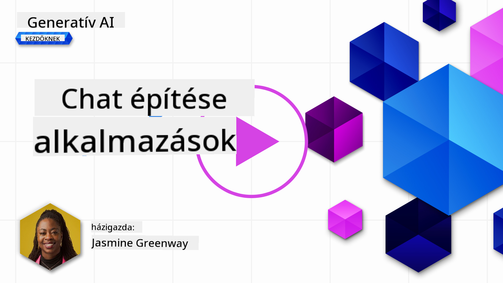
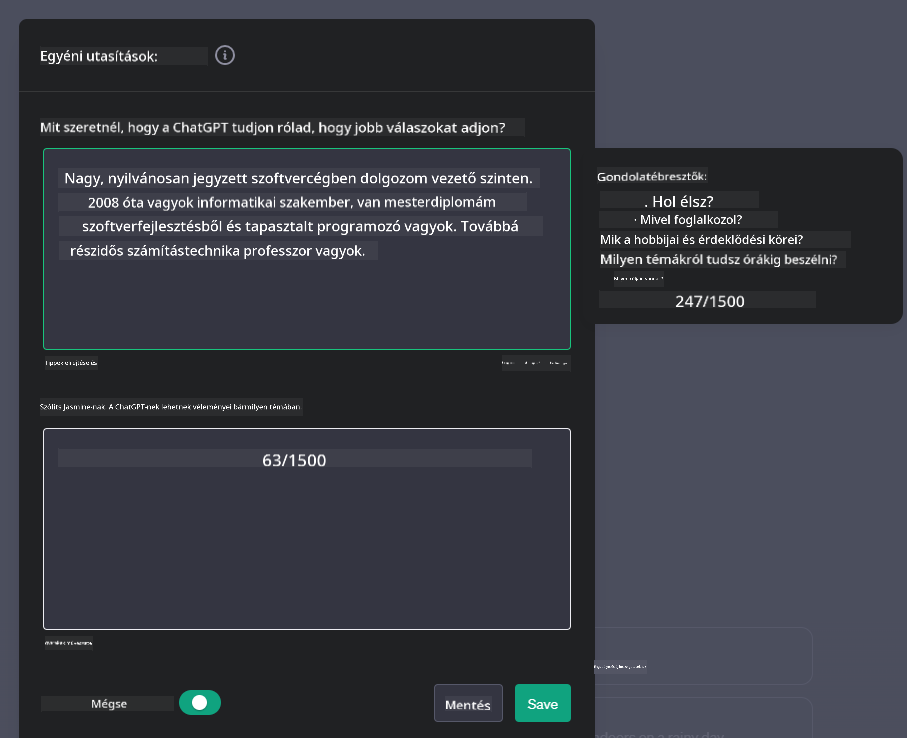
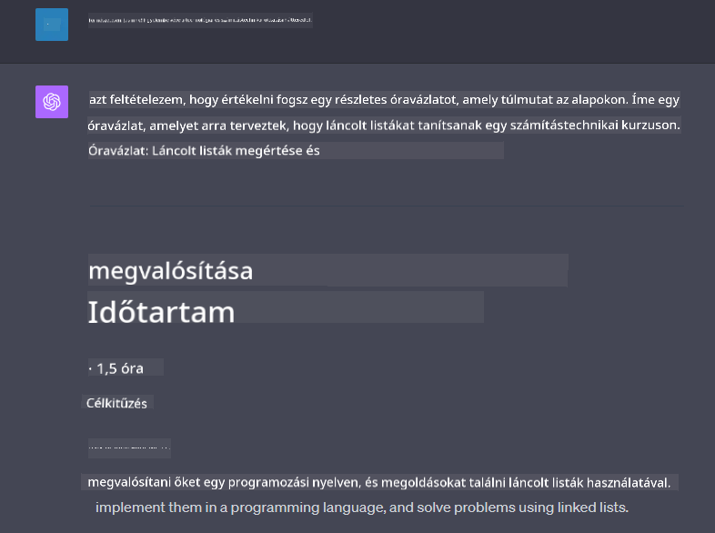

<!--
CO_OP_TRANSLATOR_METADATA:
{
  "original_hash": "ea4bbe640847aafbbba14dae4625e9af",
  "translation_date": "2025-05-19T18:05:29+00:00",
  "source_file": "07-building-chat-applications/README.md",
  "language_code": "hu"
}
-->
# Generatív AI-alapú csevegőalkalmazások építése

[](https://aka.ms/gen-ai-lessons7-gh?WT.mc_id=academic-105485-koreyst)

> _(Kattintson a fenti képre a lecke videójának megtekintéséhez)_

Most, hogy láttuk, hogyan építhetünk szöveg-generáló alkalmazásokat, nézzük meg a csevegőalkalmazásokat.

A csevegőalkalmazások a mindennapjaink részévé váltak, nemcsak alkalmi beszélgetések eszközeként szolgálnak. Fontos részei az ügyfélszolgálatnak, a műszaki támogatásnak, sőt, még a kifinomult tanácsadó rendszereknek is. Valószínű, hogy nemrégiben Ön is kapott segítséget egy csevegőalkalmazástól. Ahogy egyre fejlettebb technológiákat, például generatív AI-t integrálunk ezekbe a platformokba, a komplexitás és a kihívások is növekednek.

Néhány kérdés, amire választ kell találnunk:

- **Az alkalmazás építése**. Hogyan építhetjük meg hatékonyan és integrálhatjuk zökkenőmentesen ezeket az AI-alapú alkalmazásokat adott felhasználási esetekhez?
- **Monitorozás**. Miután bevezetésre kerültek, hogyan figyelhetjük és biztosíthatjuk, hogy az alkalmazások a legmagasabb szintű minőségben működjenek, mind a funkcionalitás, mind a [felelősségteljes AI hat alapelveinek](https://www.microsoft.com/ai/responsible-ai?WT.mc_id=academic-105485-koreyst) való megfelelés szempontjából?

Ahogy az automatizálás és a zökkenőmentes ember-gép interakciók korába lépünk, alapvető fontosságú megérteni, hogyan alakítja át a generatív AI a csevegőalkalmazások hatókörét, mélységét és alkalmazkodóképességét. Ez a lecke megvizsgálja azokat az architekturális aspektusokat, amelyek támogatják ezeket a bonyolult rendszereket, belemerül a módszertanokba, amelyekkel finomhangolhatjuk őket adott területekhez, és értékeli azokat a mérőszámokat és megfontolásokat, amelyek fontosak a felelősségteljes AI bevezetés biztosítása érdekében.

## Bevezetés

Ez a lecke lefedi:

- Technikák a csevegőalkalmazások hatékony építésére és integrálására.
- Hogyan alkalmazzuk a testreszabást és finomhangolást az alkalmazásokra.
- Stratégiák és megfontolások a csevegőalkalmazások hatékony monitorozásához.

## Tanulási célok

A lecke végére képes lesz:

- Leírni a csevegőalkalmazások építésének és meglévő rendszerekbe való integrálásának megfontolásait.
- Testreszabni csevegőalkalmazásokat adott felhasználási esetekhez.
- Azonosítani a kulcsfontosságú mérőszámokat és megfontolásokat a AI-alapú csevegőalkalmazások minőségének hatékony monitorozásához és fenntartásához.
- Biztosítani, hogy a csevegőalkalmazások felelősségteljesen használják az AI-t.

## Generatív AI integrálása csevegőalkalmazásokba

A csevegőalkalmazások generatív AI-vel való fejlesztése nem csak arról szól, hogy okosabbá tegyük őket; a felhasználói élmény minőségének biztosítása érdekében az architektúrájuk, teljesítményük és felhasználói felületük optimalizálásáról is. Ez magában foglalja az architekturális alapok, API integrációk és felhasználói felület megfontolások vizsgálatát. Ez a rész átfogó útmutatót kíván nyújtani ezen összetett területek navigálásához, akár meglévő rendszerekbe integráljuk őket, akár önálló platformként építjük meg őket.

A rész végére rendelkezni fog azzal a szakértelemmel, amely szükséges a csevegőalkalmazások hatékony megépítéséhez és beépítéséhez.

### Chatbot vagy csevegőalkalmazás?

Mielőtt belevágunk a csevegőalkalmazások építésébe, hasonlítsuk össze a 'chatbotokat' az 'AI-alapú csevegőalkalmazásokkal', amelyek különböző szerepeket és funkciókat töltenek be. A chatbot fő célja adott beszélgetési feladatok automatizálása, mint például a gyakran ismételt kérdések megválaszolása vagy egy csomag nyomon követése. Általában szabályalapú logika vagy összetett AI algoritmusok irányítják. Ezzel szemben egy AI-alapú csevegőalkalmazás sokkal tágabb környezetet biztosít különféle digitális kommunikációs formák megkönnyítésére, mint például szöveges, hang- és videóbeszélgetések emberi felhasználók között. Meghatározó jellemzője egy generatív AI modell integrálása, amely árnyalt, emberihez hasonló beszélgetéseket szimulál, és a válaszokat különféle inputok és kontextuális jelek alapján generálja. Egy generatív AI-alapú csevegőalkalmazás képes nyílt domainű beszélgetésekre, alkalmazkodik a változó beszélgetési kontextusokhoz, sőt, kreatív vagy összetett párbeszédeket is létrehozhat.

Az alábbi táblázat bemutatja a fő különbségeket és hasonlóságokat, hogy megértsük egyedi szerepüket a digitális kommunikációban.

| Chatbot                               | Generatív AI-alapú csevegőalkalmazás |
| ------------------------------------- | ------------------------------------ |
| Feladat-orientált és szabályalapú     | Kontextusérzékeny                   |
| Gyakran nagyobb rendszerekbe integrált | Egy vagy több chatbotot is tartalmazhat |
| Programozott funkciókra korlátozódik  | Generatív AI modelleket integrál    |
| Speciális és strukturált interakciók  | Képes nyílt domainű beszélgetésekre |

### Előre elkészített funkciók kihasználása SDK-kkal és API-kkal

Amikor csevegőalkalmazást építünk, nagyszerű első lépés felmérni, mi áll már rendelkezésre. Az SDK-k és API-k használata a csevegőalkalmazások építésére előnyös stratégia számos okból. Jól dokumentált SDK-k és API-k integrálásával stratégiailag pozicionálja alkalmazását a hosszú távú siker érdekében, kezelve a skálázhatóság és karbantarthatóság kérdéseit.

- **Felgyorsítja a fejlesztési folyamatot és csökkenti a költségeket**: Az előre elkészített funkciókra támaszkodás ahelyett, hogy drága folyamat lenne az építésük, lehetővé teszi, hogy az alkalmazás más aspektusaira koncentráljon, amelyeket fontosabbnak talál, mint például az üzleti logika.
- **Jobb teljesítmény**: Amikor a funkciókat a semmiből építjük, végül felmerül a kérdés: "Hogyan skálázódik? Képes az alkalmazás kezelni a hirtelen felhasználói beáramlást?" A jól karbantartott SDK-k és API-k gyakran beépített megoldásokat kínálnak ezekre a kérdésekre.
- **Könnyebb karbantartás**: A frissítések és fejlesztések könnyebben kezelhetők, mivel a legtöbb API és SDK egyszerűen egy könyvtár frissítését igényli, amikor újabb verzió jelenik meg.
- **Hozzáférés a legmodernebb technológiához**: Olyan modellek kihasználása, amelyek finomhangoltak és kiterjedt adatbázisokon lettek betanítva, természetes nyelvi képességekkel ruházza fel alkalmazását.

Egy SDK vagy API funkcionalitásának elérése általában a biztosított szolgáltatások használatára való jogosultság megszerzését vonja maga után, ami gyakran egy egyedi kulcs vagy hitelesítési token használatával történik. Az OpenAI Python könyvtárat fogjuk használni, hogy megvizsgáljuk, hogyan néz ki ez. Ön is kipróbálhatja a következő [OpenAI notebookban](../../../07-building-chat-applications/python/oai-assignment.ipynb) vagy az [Azure OpenAI Services notebookban](../../../07-building-chat-applications/python/aoai-assignment.ipynb) ehhez a leckéhez.

```python
import os
from openai import OpenAI

API_KEY = os.getenv("OPENAI_API_KEY","")

client = OpenAI(
    api_key=API_KEY
    )

chat_completion = client.chat.completions.create(model="gpt-3.5-turbo", messages=[{"role": "user", "content": "Suggest two titles for an instructional lesson on chat applications for generative AI."}])
```

A fenti példa a GPT-3.5 Turbo modellt használja a prompt befejezéséhez, de vegye észre, hogy az API kulcs beállítása előtte történik. Hibát kapna, ha nem állítaná be a kulcsot.

## Felhasználói élmény (UX)

Általános UX elvek érvényesek a csevegőalkalmazásokra, de itt van néhány további megfontolás, amelyek különösen fontosak a gépi tanulási komponensek miatt.

- **Mechanizmus az egyértelműség kezelésére**: A generatív AI modellek időnként kétértelmű válaszokat generálnak. Egy funkció, amely lehetővé teszi a felhasználók számára, hogy tisztázást kérjenek, hasznos lehet, ha ilyen problémába ütköznek.
- **Kontextus megtartása**: Az előrehaladott generatív AI modellek képesek emlékezni a beszélgetés kontextusára, ami szükséges eszköz lehet a felhasználói élményhez. A felhasználóknak a kontextus kezelésére és irányítására való képesség biztosítása javítja a felhasználói élményt, de bevezeti az érzékeny felhasználói információk megőrzésének kockázatát. Az információ tárolásának időtartamára vonatkozó megfontolások, mint például egy megőrzési politika bevezetése, kiegyensúlyozhatják a kontextus iránti igényt a magánélet ellen.
- **Személyre szabás**: Az AI modellek tanulási és alkalmazkodási képessége egyéni élményt kínál a felhasználónak. A felhasználói élmény testreszabása olyan funkciókkal, mint a felhasználói profilok, nemcsak azt az érzést kelti a felhasználóban, hogy megértették, hanem segíti őket a konkrét válaszok megtalálásában, hatékonyabbá és kielégítőbbé téve az interakciót.

Egy ilyen személyre szabási példa az OpenAI ChatGPT "Egyedi utasítások" beállítása. Lehetővé teszi, hogy információt adjon meg magáról, amely fontos kontextus lehet a promptokhoz. Íme egy példa egy egyedi utasításra.



Ez a "profil" arra készteti a ChatGPT-t, hogy készítsen egy lecketervezetet a láncolt listákról. Vegye észre, hogy a ChatGPT figyelembe veszi, hogy a felhasználó mélyebb lecketervezetet szeretne a tapasztalata alapján.



### A Microsoft rendszerüzenet-keretrendszere nagy nyelvi modellekhez

[A Microsoft útmutatást nyújtott](https://learn.microsoft.com/azure/ai-services/openai/concepts/system-message#define-the-models-output-format?WT.mc_id=academic-105485-koreyst) a hatékony rendszerüzenetek írásához LLM-ekből származó válaszok generálásakor, amely négy területre oszlik:

1. Meghatározza, hogy kinek szól a modell, valamint képességeit és korlátait.
2. Meghatározza a modell kimeneti formátumát.
3. Konkrét példákat nyújt, amelyek bemutatják a modell szándékolt viselkedését.
4. További viselkedési korlátokat biztosít.

### Hozzáférhetőség

Akár látási, hallási, mozgási vagy kognitív károsodással rendelkező felhasználóról van szó, egy jól megtervezett csevegőalkalmazásnak mindenki számára használhatónak kell lennie. Az alábbi lista az egyes felhasználói károsodások hozzáférhetőségének javítására irányuló konkrét funkciókat bontja le.

- **Funkciók látássérültek számára**: Nagy kontrasztú témák és átméretezhető szöveg, képernyőolvasó kompatibilitás.
- **Funkciók hallássérültek számára**: Szöveg-beszéd és beszéd-szöveg funkciók, vizuális jelzések az audio értesítésekhez.
- **Funkciók mozgássérültek számára**: Billentyűzet-navigáció támogatás, hangparancsok.
- **Funkciók kognitív károsodással rendelkezők számára**: Egyszerűsített nyelvi lehetőségek.

## Testreszabás és finomhangolás terület-specifikus nyelvi modellekhez

Képzeljen el egy csevegőalkalmazást, amely megérti cége zsargonját és előre látja a felhasználói bázis által gyakran felvetett kérdéseket. Két megközelítés érdemes megemlíteni:

- **DSL modellek kihasználása**. A DSL a terület-specifikus nyelvet jelenti. Úgynevezett DSL modellt használhat, amelyet egy adott területre képeztek ki annak fogalmainak és forgatókönyveinek megértésére.
- **Finomhangolás alkalmazása**. A finomhangolás az a folyamat, amikor a modellt továbbképzik adott adatokkal.

## Testreszabás: DSL használata

A terület-specifikus nyelvi modellek (DSL modellek) kihasználása fokozhatja a felhasználói elkötelezettséget azáltal, hogy speciális, kontextusban releváns interakciókat biztosít. Ez egy olyan modell, amelyet egy adott területhez, iparághoz vagy témához kapcsolódó szöveg megértésére és generálására képeztek ki vagy finomhangoltak. A DSL modell használatának lehetőségei változhatnak a semmiből való képzésen át a meglévők SDK-kkal és API-kkal történő használatáig. Egy másik lehetőség a finomhangolás, amely egy meglévő előre betanított modell adaptálását jelenti egy adott területhez.

## Testreszabás: Finomhangolás alkalmazása

A finomhangolást gyakran akkor veszik fontolóra, amikor egy előre betanított modell egy speciális területen vagy adott feladatnál alulmarad.

Például az orvosi kérdések összetettek és sok kontextust igényelnek. Amikor egy orvosi szakember diagnosztizál egy beteget, az számos tényezőn alapul, mint például életmód vagy meglévő állapotok, és akár a legfrissebb orvosi folyóiratokra is támaszkodhat a diagnózisának érvényesítésére. Ilyen árnyalt forgatókönyvekben egy általános célú AI csevegőalkalmazás nem lehet megbízható forrás.

### Forgatókönyv: egy orvosi alkalmazás

Gondoljunk egy csevegőalkalmazásra, amely orvosi szakembereket segít a kezelési irányelvek, gyógyszerkölcsönhatások vagy legújabb kutatási eredmények gyors referenciáinak biztosításával.

Egy általános célú modell megfelelő lehet alapvető orvosi kérdések megválaszolására vagy általános tanácsok nyújtására, de nehézségekbe ütk

**Felelősség kizárása**:  
Ezt a dokumentumot AI fordítási szolgáltatással, a [Co-op Translator](https://github.com/Azure/co-op-translator) segítségével fordítottuk le. Bár igyekszünk a pontosságra, kérjük, vegye figyelembe, hogy az automatikus fordítások hibákat vagy pontatlanságokat tartalmazhatnak. Az eredeti dokumentum a saját nyelvén tekintendő a hiteles forrásnak. Kritikus információk esetén javasolt a professzionális emberi fordítás. Nem vállalunk felelősséget semmilyen félreértésért vagy félremagyarázásért, amely a fordítás használatából ered.