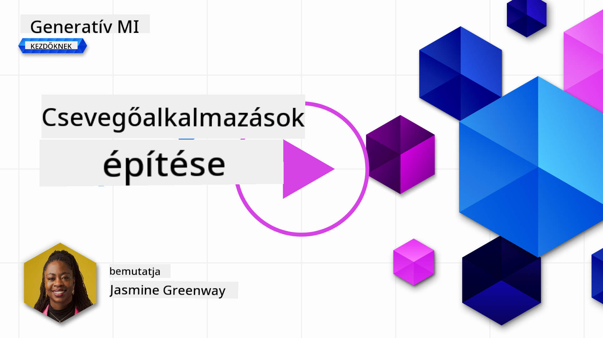
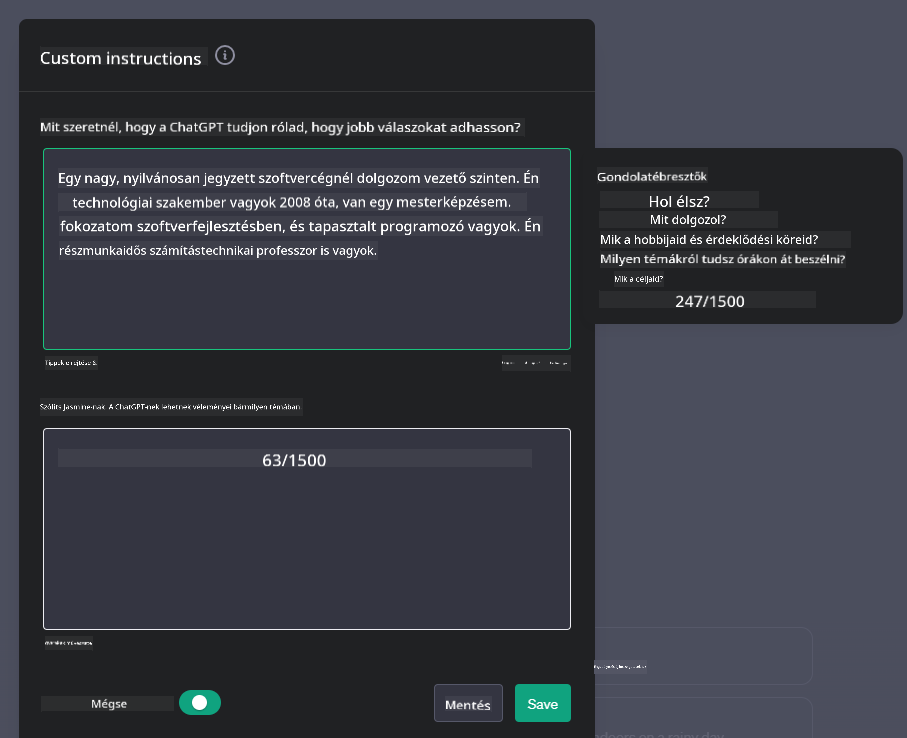
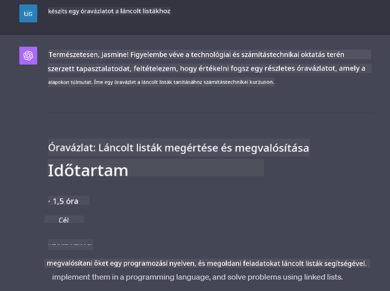

<!--
CO_OP_TRANSLATOR_METADATA:
{
  "original_hash": "ea4bbe640847aafbbba14dae4625e9af",
  "translation_date": "2025-06-25T15:52:14+00:00",
  "source_file": "07-building-chat-applications/README.md",
  "language_code": "hu"
}
-->
# Generatív AI-alapú Chat Alkalmazások Építése

[](https://aka.ms/gen-ai-lessons7-gh?WT.mc_id=academic-105485-koreyst)

> _(Kattints a fenti képre az óra videójának megtekintéséhez)_

Miután láttuk, hogyan építhetünk szöveg-generáló alkalmazásokat, nézzük meg a chat alkalmazásokat.

A chat alkalmazások a mindennapi életünk részévé váltak, és többet kínálnak, mint pusztán alkalmi beszélgetést. Fontos szerepet játszanak az ügyfélszolgálatban, technikai támogatásban és még kifinomult tanácsadó rendszerekben is. Valószínű, hogy nemrégiben kaptál segítséget egy chat alkalmazástól. Ahogy egyre fejlettebb technológiákat, például generatív AI-t integrálunk ezekbe a platformokba, a komplexitás növekszik, és vele együtt a kihívások is.

Néhány kérdés, amire választ kell kapnunk:

- **Az alkalmazás építése**. Hogyan építhetjük hatékonyan és integrálhatjuk zökkenőmentesen ezeket az AI-alapú alkalmazásokat konkrét felhasználási esetekhez?
- **Monitorozás**. Miután telepítettük, hogyan monitorozhatjuk és biztosíthatjuk, hogy az alkalmazások a legmagasabb minőségben működjenek, mind funkcionálisan, mind a [felelős AI hat elveinek](https://www.microsoft.com/ai/responsible-ai?WT.mc_id=academic-105485-koreyst) betartásával?

Ahogy tovább lépünk egy automatizálás és zökkenőmentes ember-gép interakciók által meghatározott korba, elengedhetetlen megérteni, hogyan alakítja át a generatív AI a chat alkalmazások hatókörét, mélységét és alkalmazkodóképességét. Ez az óra megvizsgálja azokat az architektúra-aspektusokat, amelyek támogatják ezeket a bonyolult rendszereket, mélyebben belemegy a domain-specifikus feladatokhoz való finomhangolás módszertanaiba, és értékeli azokat a metrikákat és szempontokat, amelyek a felelős AI telepítésének biztosításához szükségesek.

## Bevezetés

Ez az óra lefedi:

- Technikák a chat alkalmazások hatékony építéséhez és integrálásához.
- Hogyan alkalmazzuk a testreszabást és finomhangolást az alkalmazásokhoz.
- Stratégiák és szempontok a chat alkalmazások hatékony monitorozásához.

## Tanulási Célok

Az óra végére képes leszel:

- Leírni a chat alkalmazások építésének és meglévő rendszerekbe való integrálásának szempontjait.
- Testreszabni a chat alkalmazásokat konkrét felhasználási esetekhez.
- Azonosítani a kulcsfontosságú metrikákat és szempontokat a AI-alapú chat alkalmazások minőségének hatékony monitorozásához és fenntartásához.
- Biztosítani, hogy a chat alkalmazások felelősen használják az AI-t.

## Generatív AI Integrálása Chat Alkalmazásokba

A chat alkalmazások generatív AI általi fejlesztése nemcsak azok intelligensebbé tételére összpontosít; a minőségi felhasználói élmény biztosítása érdekében optimalizálni kell az architektúrájukat, teljesítményüket és felhasználói felületüket. Ez magában foglalja az architektúra alapjainak, API integrációknak és felhasználói felület szempontjainak vizsgálatát. Ez a szakasz átfogó útmutatót kínál, amely segít eligazodni ezekben a bonyolult tájakban, akár meglévő rendszerekbe illeszted őket, akár önálló platformként építed.

A szakasz végére fel leszel készülve a chat alkalmazások hatékony építésére és integrálására.

### Chatbot vagy Chat alkalmazás?

Mielőtt belevágunk a chat alkalmazások építésébe, hasonlítsuk össze a 'chatbotokat' és az 'AI-alapú chat alkalmazásokat', amelyek különböző szerepeket és funkciókat töltenek be. A chatbot fő célja konkrét beszélgetési feladatok automatizálása, mint például gyakran ismételt kérdések megválaszolása vagy csomagkövetés. Általában szabályalapú logika vagy összetett AI algoritmusok irányítják. Ezzel szemben az AI-alapú chat alkalmazás sokkal tágabb környezetet jelent, amely különböző digitális kommunikációs formákat, például szöveges, hang- és videóbeszélgetéseket tesz lehetővé emberi felhasználók között. Meghatározó jellemzője egy generatív AI modell integrálása, amely árnyalt, emberi-szerű beszélgetéseket szimulál, válaszokat generálva különféle bemeneti és kontextuális jelek alapján. Egy generatív AI-alapú chat alkalmazás képes nyílt tartományú beszélgetésekre, alkalmazkodik a változó beszélgetési kontextusokhoz, és akár kreatív vagy összetett párbeszédet is létrehozhat.

Az alábbi táblázat bemutatja a főbb különbségeket és hasonlóságokat, hogy segítsen megérteni a digitális kommunikációban betöltött egyedi szerepüket.

| Chatbot                               | Generatív AI-alapú Chat Alkalmazás     |
| ------------------------------------- | -------------------------------------- |
| Feladatorientált és szabályalapú      | Kontextusérzékeny                      |
| Gyakran integrált nagyobb rendszerekbe| Egy vagy több chatbotot is fogadhat    |
| Korlátozott programozott funkciókra   | Generatív AI modelleket integrál       |
| Specializált és strukturált interakciók| Képes nyílt tartományú beszélgetésekre |

### Előre elkészített funkciók használata SDK-k és API-k segítségével

Amikor chat alkalmazást építünk, érdemes első lépésként felmérni, mi áll már rendelkezésre. Az SDK-k és API-k használata chat alkalmazások építéséhez számos okból előnyös stratégia. Jól dokumentált SDK-k és API-k integrálásával stratégiailag pozícionálod az alkalmazásodat a hosszú távú sikerre, kezelve a skálázhatóság és karbantartás kérdéseit.

- **Felgyorsítja a fejlesztési folyamatot és csökkenti az overheadet**: Az előre elkészített funkciókra támaszkodva ahelyett, hogy magad építenéd őket, lehetővé teszi, hogy az alkalmazás más, számodra fontosabb aspektusaira koncentrálj, mint például az üzleti logika.
- **Jobb teljesítmény**: Amikor a funkciókat a semmiből építed, előbb-utóbb felmerül a kérdés: "Hogyan skálázódik? Képes ez az alkalmazás kezelni a hirtelen felhasználói rohamot?" Jól karbantartott SDK-k és API-k gyakran beépített megoldásokat kínálnak ezekre a kérdésekre.
- **Könnyebb karbantartás**: A frissítések és fejlesztések könnyebben kezelhetők, mivel a legtöbb API és SDK egyszerűen könyvtárfrissítést igényel, amikor újabb verzió jelenik meg.
- **Hozzáférés a legmodernebb technológiához**: Olyan modellek használata, amelyek kiterjedt adatbázisokon finomhangoltak és kiképeztek, természetes nyelvi képességeket biztosítanak az alkalmazásod számára.

Egy SDK vagy API funkcióinak elérése általában engedélyt igényel a nyújtott szolgáltatások használatára, amely gyakran egy egyedi kulcs vagy hitelesítési token használatával történik. Az OpenAI Python Könyvtár segítségével megvizsgáljuk, hogy néz ki ez. Kipróbálhatod magad is az alábbi [OpenAI jegyzetfüzetben](../../../07-building-chat-applications/python/oai-assignment.ipynb) vagy [Azure OpenAI Services jegyzetfüzetben](../../../07-building-chat-applications/python/aoai-assignment.ipynb) az óra során.

```python
import os
from openai import OpenAI

API_KEY = os.getenv("OPENAI_API_KEY","")

client = OpenAI(
    api_key=API_KEY
    )

chat_completion = client.chat.completions.create(model="gpt-3.5-turbo", messages=[{"role": "user", "content": "Suggest two titles for an instructional lesson on chat applications for generative AI."}])
```

A fenti példa a GPT-3.5 Turbo modellt használja a prompt befejezéséhez, de vedd észre, hogy az API kulcs beállítása előtte történik. Hibát kapnál, ha nem állítanád be a kulcsot.

## Felhasználói Élmény (UX)

Általános UX elvek érvényesek a chat alkalmazásokra, de itt van néhány további szempont, amely különösen fontos a gépi tanulási komponensek miatt.

- **Mechanizmus a kétértelműség kezelésére**: A generatív AI modellek időnként kétértelmű válaszokat generálnak. Egy funkció, amely lehetővé teszi a felhasználók számára, hogy tisztázást kérjenek, hasznos lehet, ha ezzel a problémával találkoznak.
- **Kontextus megtartása**: A fejlett generatív AI modellek képesek megjegyezni a kontextust egy beszélgetés során, ami szükséges lehet a felhasználói élmény szempontjából. A felhasználók számára a kontextus kezelésének és irányításának lehetősége javítja a felhasználói élményt, de bevezeti a kockázatot az érzékeny felhasználói információk megőrzésére. Az információ tárolásának időtartamára vonatkozó szempontok, például egy megőrzési politika bevezetése, kiegyensúlyozhatják a kontextus iránti igényt a magánélet védelmével szemben.
- **Személyre szabás**: Az AI modellek tanulási és alkalmazkodási képessége révén egyéni élményt kínálnak a felhasználó számára. A felhasználói élmény testreszabása olyan funkciókkal, mint a felhasználói profilok, nemcsak azt eredményezi, hogy a felhasználó megértettnek érzi magát, hanem segít a konkrét válaszok megtalálásában, hatékonyabb és kielégítőbb interakciót teremtve.

A személyre szabás egyik példája az OpenAI ChatGPT "Egyedi utasítások" beállítása. Lehetővé teszi, hogy információt adj meg magadról, ami fontos kontextus lehet a promptokhoz. Íme egy példa egy egyedi utasításra.



Ez a "profil" arra készteti a ChatGPT-t, hogy hozzon létre egy óravázlatot a láncolt listákról. Vedd észre, hogy a ChatGPT figyelembe veszi, hogy a felhasználó esetleg mélyebb óravázlatot szeretne a tapasztalata alapján.



### Microsoft Nagy Nyelvi Modellek Rendszerüzenet Keretrendszere

[A Microsoft útmutatást nyújtott](https://learn.microsoft.com/azure/ai-services/openai/concepts/system-message#define-the-models-output-format?WT.mc_id=academic-105485-koreyst) a hatékony rendszerüzenetek írásához az LLM-ek válaszainak generálásakor, négy területre bontva:

1. Meghatározni, ki számára készült a modell, valamint annak képességeit és korlátait.
2. Meghatározni a modell kimeneti formátumát.
3. Konkrét példák nyújtása, amelyek bemutatják a modell kívánt viselkedését.
4. További viselkedési védőkorlátok biztosítása.

### Hozzáférhetőség

Akár látási, hallási, mozgási vagy kognitív fogyatékossággal él a felhasználó, egy jól megtervezett chat alkalmazásnak mindenki számára használhatónak kell lennie. Az alábbi lista konkrét funkciókat bont le, amelyek célja a hozzáférhetőség javítása különböző felhasználói fogyatékosságok esetén.

- **Funkciók látássérültek számára**: Nagy kontrasztú témák és átméretezhető szöveg, képernyőolvasó kompatibilitás.
- **Funkciók hallássérültek számára**: Szöveg-beszéd és beszéd-szöveg funkciók, vizuális jelzések hangértesítésekhez.
- **Funkciók mozgássérültek számára**: Billentyűzet navigáció támogatás, hangparancsok.
- **Funkciók kognitív fogyatékosságok esetén**: Egyszerűsített nyelvi opciók.

## Testreszabás és Finomhangolás Domain-specifikus Nyelvi Modellekhez

Képzelj el egy chat alkalmazást, amely érti a céged zsargonját és előre látja a felhasználói bázis által gyakran felmerülő konkrét kérdéseket. Két megközelítés érdemes megemlíteni:

- **DSL modellek kihasználása**. A DSL a domain-specifikus nyelvet jelenti. Kihasználhatsz egy úgynevezett DSL modellt, amely egy adott domainre kiképzett, hogy megértse annak fogalmait és szcenárióit.
- **Finomhangolás alkalmazása**. A finomhangolás az a folyamat, amely során a modelledet további konkrét adatokkal képezed tovább.

## Testreszabás: DSL használata

A domain-specifikus nyelvi modellek (DSL Modellek) használata fokozhatja a felhasználói elkötelezettséget, mivel speciális, kontextuálisan releváns interakciókat biztosít. Ez egy olyan modell, amelyet egy adott terület, iparág vagy téma szövegének megértésére és generálására képeztek ki vagy finomhangoltak. A DSL modell használatának lehetőségei változhatnak attól, hogy nulláról képzünk egyet, vagy előre meglévőeket használunk SDK-k és API-k segítségével. Egy másik lehetőség a finomhangolás, amely magában foglalja egy meglévő előre kiképzett modell átalakítását egy konkrét domainre.

## Testreszabás: Finomhangolás alkalmazása

A finomhangolást gyakran akkor fontolják meg, amikor egy előre kiképzett modell nem elég egy speciális domain vagy konkrét feladat esetén.

Például az orvosi kérdések összetettek és sok kontextust igényelnek. Amikor egy orvosi szakember diagnosztizál egy beteget, számos tényezőre, például életmódra vagy meglévő állapotokra alapozza, és akár a legújabb orvosi folyóiratokra is támaszkodhat a diagnózisának érvényesítéséhez. Ilyen árnyalt szcenáriókban egy általános célú AI chat alkalmazás nem lehet megbízható forrás.

### Szcenárió: egy orvosi alkalmazás

Gondolj egy chat alkalmazásra, amely segíti az orvosi szakembereket azzal, hogy gyors referenciákat nyújt kezelési irányelvekhez, gyógyszerkölcsönhatásokhoz vagy legújabb kutatási eredményekhez.

Egy általános célú modell lehet, hogy elegendő az alapvető orvosi kérdések megválaszolásához vagy általános tanácsadás nyújtásához, de lehet, hogy küzd a következőkkel:

- **Nagyon specifikus vagy összetett esetek**. Például egy neurológus megkérdezheti az alkalmazást, "Mik a jelenlegi legjobb gyakorlatok a gyógyszerrezisztens epilepszia kezelésére gyermekeknél?"
- **Legújabb fejlemények hiánya**. Egy általános célú modell küzdhet azzal, hogy aktuális választ adjon, amely magában foglalja a legújabb fejleményeket

**Jogi nyilatkozat**:  
Ez a dokumentum az [Co-op Translator](https://github.com/Azure/co-op-translator) AI fordítási szolgáltatással lett lefordítva. Miközben törekszünk a pontosságra, kérjük, vegye figyelembe, hogy az automatikus fordítások hibákat vagy pontatlanságokat tartalmazhatnak. Az eredeti dokumentum az anyanyelvén tekintendő hiteles forrásnak. Kritikus információk esetén javasolt a professzionális emberi fordítás igénybevétele. Nem vállalunk felelősséget a fordítás használatából eredő félreértésekért vagy félremagyarázásokért.