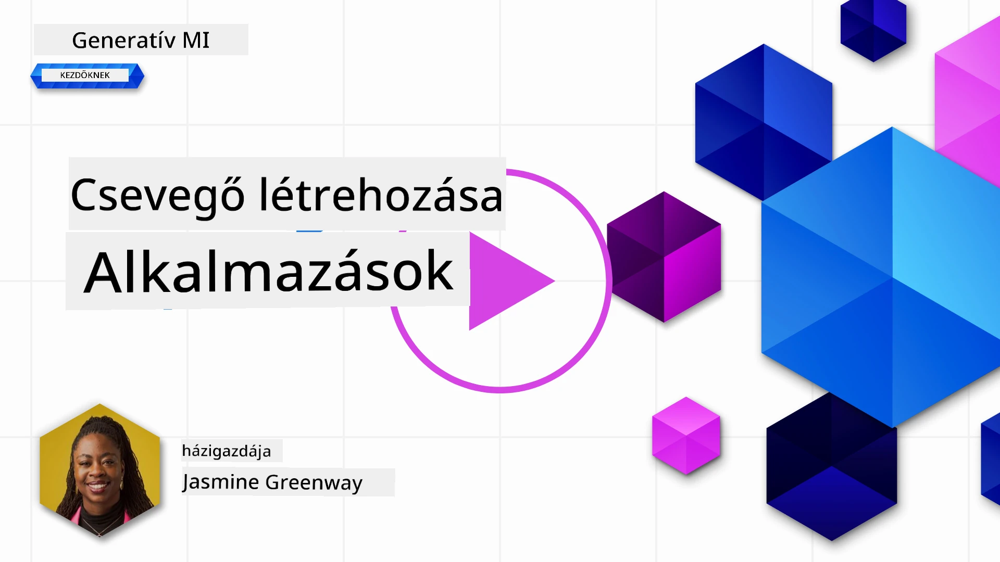
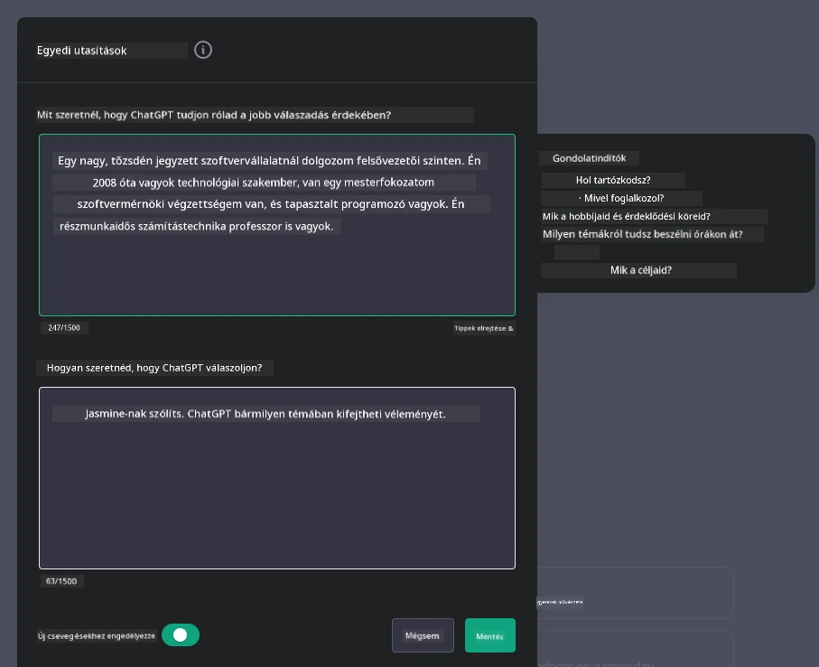
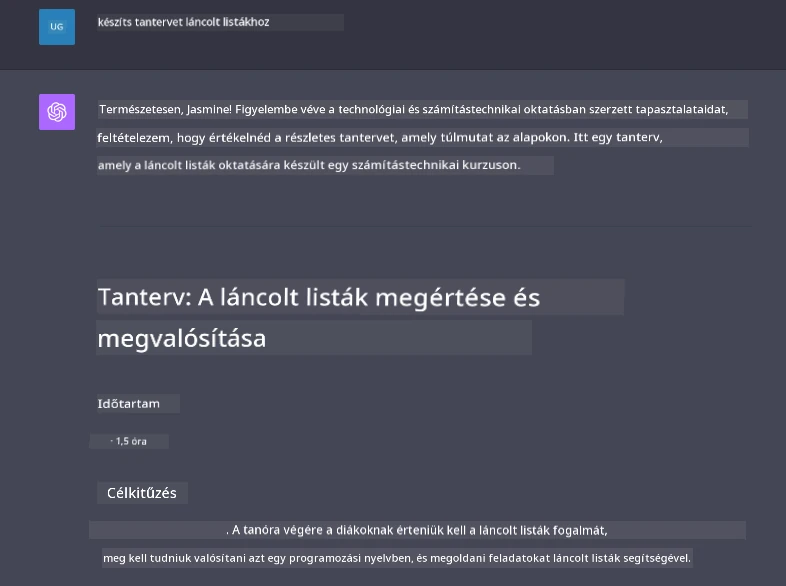

# Generatív MI-vezérelt csevegőalkalmazások építése

[](https://youtu.be/R9V0ZY1BEQo?si=IHuU-fS9YWT8s4sA)

> _(A fenti képre kattintva megtekintheti a lecke videóját)_

Most, hogy megnéztük, hogyan építhetünk szöveg-generáló alkalmazásokat, nézzük meg a csevegőalkalmazásokat.

A csevegőalkalmazások beépültek a mindennapi életünkbe, és többet nyújtanak, mint egy egyszerű szabadidős beszélgetés eszköze. Szerves részei az ügyfélszolgálatnak, a műszaki támogatásnak és akár kifinomult tanácsadó rendszereknek is. Valószínűleg nemrégiben már kaptál segítséget egy csevegőalkalmazáson keresztül. Ahogy ezeket a platformokat egyre fejlettebb generatív MI-technológiákkal integráljuk, nő a komplexitás, és vele együtt a kihívások is.

Néhány kérdés, amit meg kell válaszolnunk:

- **Az alkalmazás építése**. Hogyan építsük fel hatékonyan és integráljuk zökkenőmentesen ezeket a MI-vezérelt alkalmazásokat specifikus felhasználási esetekhez?
- **Megfigyelés**. Miután üzembe helyeztük, hogyan tudjuk figyelni és biztosítani, hogy az alkalmazások a legmagasabb szinten működjenek, mind funkció szempontjából, mind az [a felelős MI hat alapelveinek](https://www.microsoft.com/ai/responsible-ai?WT.mc_id=academic-105485-koreyst) való megfelelés terén?

Ahogy egy automatizálás és zökkenőmentes ember-gép interakciók által meghatározott korszak felé haladunk, elengedhetetlen megérteni, hogyan alakítja át a generatív MI a csevegőalkalmazások terjedelmét, mélységét és alkalmazkodóképességét. Ez a lecke megvizsgálja azokat az architekturális szempontokat, amelyek ezeket a bonyolult rendszereket támogatják, belemerül a domain-specifikus feladatokhoz való finomhangolási módszertanba, valamint értékeli a felelős MI bevezetését biztosító metrikákat és megfontolásokat.

## Bevezetés

Ez a lecke a következőket fedi le:

- Technológiák a csevegőalkalmazások hatékony építésére és integrálására.
- Hogyan alkalmazzuk a testreszabást és a finomhangolást az alkalmazásokban.
- Stratégiák és megfontolások a csevegőalkalmazások hatékony megfigyeléséhez.

## Tanulási célok

A lecke végére képes leszel:

- Leírni a csevegőalkalmazások építésével és meglévő rendszerekbe való integrálásával kapcsolatos megfontolásokat.
- Testreszabni a csevegőalkalmazásokat specifikus felhasználási esetekhez.
- Azonosítani a kulcsfontosságú metrikákat és megfontolásokat a MI-vezérelt csevegőalkalmazások minőségének hatékony figyeléséhez és fenntartásához.
- Biztosítani, hogy a csevegőalkalmazások felelősen használják az MI-t.

## Generatív MI integrálása csevegőalkalmazásokba

A csevegőalkalmazások generatív MI-vel való fejlesztése nem csupán az intelligensebbé tételükről szól; az architektúrájuk, teljesítményük és felhasználói felületük optimalizálásáról is, hogy minőségi felhasználói élményt nyújtsanak. Ez magában foglalja az architekturális alapok, az API-integrációk és a felhasználói felület szempontjainak vizsgálatát. Ez a szakasz átfogó iránymutatást nyújt a komplex tájak navigálásához, akár meglévő rendszerekbe csatlakoztatod őket, akár önálló platformként építed fel.

Ennek a szakasznak a végére meglesz a tudásod ahhoz, hogy hatékonyan építsd és építsd be a csevegőalkalmazásokat.

### Chatbot vagy csevegőalkalmazás?

Mielőtt belevágnánk a csevegőalkalmazások építésébe, hasonlítsuk össze a „chatbotokat” és az „MI-vezérelt csevegőalkalmazásokat”, amelyek különböző szerepeket és funkciókat töltenek be. A chatbot fő célja egy adott beszélgetési feladat automatizálása, például gyakori kérdések megválaszolása vagy egy csomag követése. Ez jellemzően szabályalapú logikával vagy összetett MI-algoritmusokkal működik. Ezzel szemben az MI-vezérelt csevegőalkalmazás egy sokkal tágabb környezet, amely különböző digitális kommunikációs formákat támogat, például szöveges, hang- és videócsevegéseket emberi felhasználók között. Meghatározó jellemzője egy generatív MI modell integrálása, amely árnyalt, emberi szintű beszélgetéseket szimulál, válaszokat generálva különféle bemenetek és kontextuális jelek alapján. Egy generatív MI-vezérelt csevegőalkalmazás nyílt témájú beszélgetésekre képes, alkalmazkodik a fejlődő beszélgetési kontextusokhoz, sőt kreatív vagy összetett párbeszédet is előállíthat.

Az alábbi táblázat a fő különbségeket és hasonlóságokat foglalja össze, hogy megértsük egyedi szerepüket a digitális kommunikációban.

| Chatbot                               | Generatív MI-vezérelt csevegőalkalmazás |
| ------------------------------------- | ---------------------------------------- |
| Feladatorientált és szabályalapú     | Kontextus-érzékeny                      |
| Gyakran nagyobb rendszerekbe integrált | Egy vagy több chatbotot is hosztolhat    |
| Csak programozott funkciókra korlátozódik | Generatív MI modelleket tartalmaz       |
| Specializált és strukturált interakciók | Képes nyílt témájú beszélgetésekre       |

### Előre megépített funkciók kihasználása SDK-k és API-k segítségével

Csevegőalkalmazás építésekor az első lépések egyike, hogy felmérjük, mi már létezik. Az SDK-k és API-k használata előnyt jelent számos okból. Ha jól dokumentált SDK-kat és API-kat integrálsz, stratégiád hosszú távon sikeres lesz, kezelve a skálázhatósági és karbantartási kihívásokat.

- **Gyorsabb fejlesztés és alacsonyabb ráfordítás**: Előre megépített funkciókra támaszkodni ahelyett, hogy drágán magad építenéd őket, lehetővé teszi, hogy az alkalmazásod más részeire fókuszálj, amelyeket fontosabbnak találsz, például az üzleti logikára.
- **Jobb teljesítmény**: Ha nulláról építesz funkciókat, előbb-utóbb felteszed magadnak a kérdést: „Hogyan skálázódik? Képes ez az alkalmazás hirtelen felhasználói rohamot kezelni?” A jól karbantartott SDK-k és API-k gyakran beépített megoldásokat kínálnak ezekre.
- **Könnyebb karbantartás**: A frissítések és fejlesztések kezelése egyszerűbb, mivel a legtöbb API és SDK esetében elég egy könyvtár frissítése, amikor új verzió jelenik meg.
- **Hozzáférés élvonalbeli technológiához**: Olyan modellek használata, amelyeket sok adatfelhasználással hangoltak finomra, természetes nyelvi képességeket biztosítanak az alkalmazásnak.

Az SDK vagy API funkcionalitásának eléréséhez jellemzően engedélyt kell szerezni a szolgáltatások használatára, ami általában egy egyedi kulcs vagy hitelesítési token használatán keresztül történik. Az OpenAI Python Könyvtár segítségével megnézzük, hogyan néz ki ez a gyakorlatban. A saját kipróbálásodat az alábbi [OpenAI notebookban](./python/oai-assignment.ipynb?WT.mc_id=academic-105485-koreyst) vagy az [Azure OpenAI Services notebookban](./python/aoai-assignment.ipynb?WT.mc_id=academic-105485-koreys) teheted meg ehhez a leckéhez.

```python
import os
from openai import OpenAI

API_KEY = os.getenv("OPENAI_API_KEY","")

client = OpenAI(
    api_key=API_KEY
    )

chat_completion = client.chat.completions.create(model="gpt-3.5-turbo", messages=[{"role": "user", "content": "Suggest two titles for an instructional lesson on chat applications for generative AI."}])
```

A fenti példa a GPT-3.5 Turbo modellt használja a prompt befejezésére, de vegyük észre, hogy az API kulcsot előzetesen kell beállítani. Hibaüzenetet kapnál, ha nem állítanád be a kulcsot.

## Felhasználói élmény (UX)

Az általános UX elvek érvényesek a csevegőalkalmazásokra, de vannak további megfontolások, amelyek különösen fontosak a gépi tanulási komponensek miatt.

- **Homályosság kezelési mechanizmusa**: A generatív MI modellek néha homályos válaszokat adnak. Egy olyan funkció, amely lehetővé teszi a felhasználók számára a tisztázás kérését, hasznos lehet ilyen helyzetekben.
- **Kontekstus megőrzése**: A fejlett generatív MI modellek képesek emlékezni a beszélgetés kontextusára, ami fontos eszköz lehet a felhasználói élményben. A felhasználók számára a kontextus kezelésének lehetősége javítja az élményt, de bevezeti az érzékeny információk megőrzésének kockázatát is. Fontos mérlegelni, hogy mennyi ideig tároljuk az információkat, például egy megtartási politika bevezetésével, hogy egyensúlyba hozzuk a kontextus szükségességét és a magánélet védelmét.
- **Személyre szabás**: Az AI modellek tanulási és alkalmazkodási képességével személyre szabott élményt nyújtanak a felhasználónak. A felhasználói profilokhoz hasonló funkciókon keresztül történő élmény testreszabása nemcsak azt érzékelteti, hogy a felhasználót megértik, hanem segíti abban is, hogy gyorsabban és hatékonyabban találjon válaszokat, így kielégítőbb az interakció.

Erre egy példa az OpenAI ChatGPT "Egyéni utasítások" beállítása. Ez lehetővé teszi, hogy megadj információkat magadról, amelyek fontos kontextust jelenthetnek a promptjaidhoz. Íme egy példa egy egyéni utasításra.



Ez a „profil” arra ösztönzi a ChatGPT-t, hogy elkészítsen egy tananyagot a láncolt listákról. Látjuk, hogy a ChatGPT figyelembe veszi, hogy a felhasználó mélyebb anyagot szeretne tapasztalatai alapján.



### A Microsoft nagy nyelvi modellekhez készült rendszerüzenet-keretrendszere

[A Microsoft útmutatást adott](https://learn.microsoft.com/azure/ai-services/openai/concepts/system-message#define-the-models-output-format?WT.mc_id=academic-105485-koreyst) hatékony rendszerüzenetek írásához, amikor LLM-ekből generálunk válaszokat, négy területre bontva:

1. Meghatározni, hogy ki számára készül a modell, valamint annak képességeit és korlátait.
2. Meghatározni a modell kimeneti formátumát.
3. Konkrét példákat adni, amelyek bemutatják a modell kívánt viselkedését.
4. További viselkedési határok biztosítása.

### Akadálymentesség

Akár a felhasználónak vizuális, hallási, mozgásbeli vagy kognitív sérülése van, egy jól megtervezett csevegőalkalmazásnak mindenki számára használhatónak kell lennie. Az alábbi lista azokat a speciális funkciókat sorolja fel, melyek különböző fogyatékosságok esetére javítják az akadálymentességet.

- **Vizuális sérültek számára**: Magas kontrasztú témák és átméretezhető szöveg, képernyőolvasó kompatibilitás.
- **Hallási sérültek számára**: Szöveg-beszéddé és beszéd-szöveggé alakító funkciók, vizuális jelzések hangértesítésekhez.
- **Mozgáskorlátozottak számára**: Billentyűzet kezelői támogatás, hangparancsok.
- **Kognitív sérültek számára**: Egyszerűsített nyelvi opciók.

## Testreszabás és finomhangolás domain-specifikus nyelvi modellekhez

Képzelj el egy csevegőalkalmazást, amely érti a céged zsargonját és előre látja a felhasználói bázis gyakori kérdéseit. Néhány megközelítés, amit érdemes megemlíteni:

- **DSL modellek alkalmazása**. A DSL a domain-specifikus nyelvet jelenti. Olyan DSL modellt használhatsz, amely egy adott szakterületre tanították, így érti annak fogalmait és helyzeteit.
- **Finomhangolás alkalmazása**. A finomhangolás a meglévő modell további speciális adatokkal való betanítása.

## Testreszabás: DSL használata

A domain-specifikus nyelvi modellek (DSL modellek) javíthatják a felhasználói aktivitást, mivel specializált, kontextusban releváns interakciókat kínálnak. Olyan modellről van szó, amelyet egy adott szakterület, iparág vagy téma megértésére vagy generálására képeztek ki vagy finomhangoltak. A DSL modellek használatának lehetőségei változóak, a nulláról való tanítástól a meglévő modellek SDK-kon és API-kon keresztüli használatáig. Egy másik lehetőség a finomhangolás, amely során egy létező előtanított modellt alkalmaznak egy adott domainre.

## Testreszabás: Finomhangolás alkalmazása

A finomhangolás gyakran szóba kerül, amikor egy előtanított modell nem elég jó egy speciális domainben vagy adott feladatnál.

Például az orvosi kérdések komplexek és sok kontextust igényelnek. Amikor egy orvos diagnosztizál, különféle tényezőket vesz figyelembe, mint az életmód vagy előző betegségek, és akár a legfrissebb orvosi folyóiratokat is, hogy alátámassza diagnózisát. Ilyen árnyalt esetekben egy általános MI-alkalmazás nem lehet megbízható forrás.

### Forgatókönyv: orvosi alkalmazás

Gondolj egy csevegőalkalmazásra, amely orvosok segítésére készült, gyors hivatkozásokat adva a kezelési irányelvekre, gyógyszerkölcsönhatásokra vagy legújabb kutatási eredményekre.

Egy általános modell megfelelő lehet alapvető orvosi kérdések megválaszolására vagy általános tanácsadásra, de nehezen birkózik meg az alábbiakkal:

- **Nagyon specifikus vagy komplex esetek**. Például egy neurológus megkérdezheti: „Mik a jelenlegi legjobb gyakorlatok a gyógyszerrezisztens epilepszia kezelésére gyermekkorú betegeknél?”
- **Hiányzó legfrissebb eredmények**. Egy általános modell nehezen adhat válaszokat, amelyek a neurológia és farmakológia legújabb eredményeit is tartalmazzák.

Ilyen esetekben a modell finomhangolása egy szakosított orvosi adatkészlettel jelentősen javíthatja a képességet arra, hogy pontosabb és megbízhatóbb választ adjon ezekre a bonyolult kérdésekre. Ehhez nagy és releváns adatkészletre van szükség, amely lefedi a domain-specifikus kihívásokat és kérdéseket.

## Megfontolások a magas minőségű MI-vezérelt csevegőélményhez

Ez a rész a "magas minőségű" csevegőalkalmazások kritériumait vázolja fel, melyek közé tartozik az akcióképes metrikák rögzítése és egy felelős MI technológiát alkalmazó keretrendszer betartása.

### Kulcsmetrikák

Ahhoz, hogy fenntartsuk egy alkalmazás magas szintű teljesítményét, alapvető kulcsmetrikákat és megfontolásokat kell nyomon követni. Ezek az értékek nemcsak az alkalmazás működését biztosítják, hanem értékelik az MI modell és a felhasználói élmény minőségét is. Az alábbi lista alapvető, MI- és felhasználói élmény-metrikákat tartalmaz.

| Metrika                       | Definíció                                                                                                            | Megfontolások a csevegőfejlesztőnek                             |
| ----------------------------- | ------------------------------------------------------------------------------------------------------------------- | ---------------------------------------------------------------- |
| **Üzemidő**                   | Az idő mérése, amíg az alkalmazás működik és elérhető a felhasználók számára.                                       | Hogyan minimalizálod az állásidőt?                               |
| **Válaszidő**                 | Az az idő, amely alatt az alkalmazás válaszol a felhasználó kérdésére.                                              | Hogyan optimalizálod a lekérdezések feldolgozását a gyorsabb válasz érdekében? |
| **Precizitás**                | Az igaz pozitív előrejelzések aránya az összes pozitív előrejelzéshez képest.                                      | Hogyan ellenőrzöd az modell precizitását?                        |
| **Jóllehetőség (Érzékenység)** | Az igaz pozitív előrejelzések aránya a valódi pozitív esetekhez viszonyítva.                                      | Hogyan méred és javítod az érzékenységet?                       |
| **F1 pontszám**               | A precizitás és a jóllehetőség harmonikus átlaga, amely egyensúlyt teremt a kettő között.                           | Mi a célzott F1 pontszámod? Hogyan egyensúlyozod a precizitást és az érzékenységet? |
| **Perplexitás**               | Méri, hogy a modell hogyan illeszkedik az adat tényleges eloszlásához a valószínűség-eloszlás alapján.              | Hogyan csökkented a perplexitást?                               |
| **Felhasználói elégedettségi mutatók** | A felhasználók által az alkalmazásról alkotott vélemény mérése, gyakran kérdőíveken keresztül.                  | Milyen gyakran gyűjtesz visszajelzést? Hogyan alkalmazkodsz hozzá?            |
| **Hibaarány**                | Az a ráta, amellyel a modell hibákat követ el a megértésben vagy a kimenetben.                                    | Milyen stratégiákat alkalmazol a hibaarány csökkentésére?        |
| **Újraképzési ciklusok**      | A modell frissítési gyakorisága, amelybe új adatok és ismeretek kerülnek.                                          | Milyen gyakran képzed újra a modellt? Mi indítja el az újraképzési ciklust? |
| **Anomáliaészlelés**         | Eszközök és technikák szokatlan mintázatok azonosítására, amelyek nem felelnek meg a várható viselkedésnek.                        | Hogyan fogsz reagálni az anomáliákra?                                        |

### Felelős mesterséges intelligencia gyakorlatok bevezetése csevegőalkalmazásokban

A Microsoft Felelős MI megközelítése hat elvet azonosított, amelyeknek irányítaniuk kell az MI fejlesztését és használatát. Az alábbiakban az elvek, azok meghatározása, valamint azt, amit egy csevegőfejlesztőnek figyelembe kell vennie, és miért kell ezt komolyan vennie.

| Elvek             | A Microsoft meghatározása                                | Szempontok a csevegőfejlesztő számára                                      | Miért fontos                                                                     |
| ---------------------- | ----------------------------------------------------- | ---------------------------------------------------------------------- | -------------------------------------------------------------------------------------- |
| Méltányosság               | Az MI rendszereknek igazságosan kell bánniuk minden emberrel.            | Biztosítani kell, hogy a csevegőalkalmazás ne diszkrimináljon a felhasználói adatok alapján.  | A felhasználók közti bizalom és befogadás építéséhez; jogi következmények elkerülésére.                |
| Megbízhatóság és biztonság | Az MI rendszereknek megbízhatóan és biztonságosan kell működniük.        | Tesztelést és hibaelhárító intézkedéseket kell bevezetni a hibák és kockázatok minimalizálására.         | A felhasználók elégedettségének biztosítása és potenciális károk megelőzése.                                 |
| Adatvédelem és biztonság   | Az MI rendszereknek biztonságosnak kell lenniük, és tiszteletben kell tartaniuk az adatvédelmet.      | Erős titkosítást és adatvédelmi intézkedéseket kell bevezetni.              | Az érzékeny felhasználói adatok védelme és az adatvédelmi törvények betartása érdekében.                         |
| Befogadás          | Az MI rendszereknek mindenkit képessé kell tenniük és be kell vonniuk az embereket. | Olyan UI/UX-tervezést kell készíteni, amely mindenféle közönség számára elérhető és könnyen használható. | Biztosítja, hogy szélesebb körű emberek hatékonyan használhassák az alkalmazást.                   |
| Átláthatóság           | Az MI rendszereknek érthetőnek kell lenniük.                  | Világos dokumentációt és indoklást kell adni az MI válaszaihoz.            | A felhasználók könnyebben megbíznak egy rendszerben, ha megértik, hogyan születnek a döntések. |
| Felelősség         | Az embereknek felelősséget kell vállalniuk az MI rendszerekért.          | Világos folyamatot kell meghatározni az MI döntések auditálására és fejlesztésére.     | Lehetővé teszi a folyamatos fejlesztést és a hibák esetén a javító intézkedéseket.               |

## Feladat

Lásd [assignment](../../../07-building-chat-applications/python). Ez egy sor gyakorlaton vezet végig, az első csevegőparancsoktól kezdve a szövegek osztályozásán és összefoglalásán át még sok másig. Figyeld meg, hogy a feladatok különböző programozási nyelveken érhetők el!

## Remek munka! Folytasd az utat

A leckét követően nézd meg generatív MI tanulási gyűjteményünket a [Generative AI Learning collection](https://aka.ms/genai-collection?WT.mc_id=academic-105485-koreyst) oldalon, hogy tovább fejleszd generatív MI tudásodat!

Látogass el a 8. leckéhez, hogy megtudd, hogyan kezdhetsz el [keresőalkalmazásokat építeni](../08-building-search-applications/README.md?WT.mc_id=academic-105485-koreyst)!

---

<!-- CO-OP TRANSLATOR DISCLAIMER START -->
**Jogi nyilatkozat**:
Ez a dokumentum az AI fordítási szolgáltatás, a [Co-op Translator](https://github.com/Azure/co-op-translator) segítségével készült. Bár az pontosságra törekszünk, kérjük, vegye figyelembe, hogy az automatikus fordítások hibákat vagy pontatlanságokat tartalmazhatnak. Az eredeti dokumentum az anyanyelvén tekintendő hiteles forrásnak. Fontos információk esetén professzionális emberi fordítást javasolunk. Nem vállalunk felelősséget semmilyen félreértésért vagy téves értelmezésért, amely ebből a fordításból ered.
<!-- CO-OP TRANSLATOR DISCLAIMER END -->