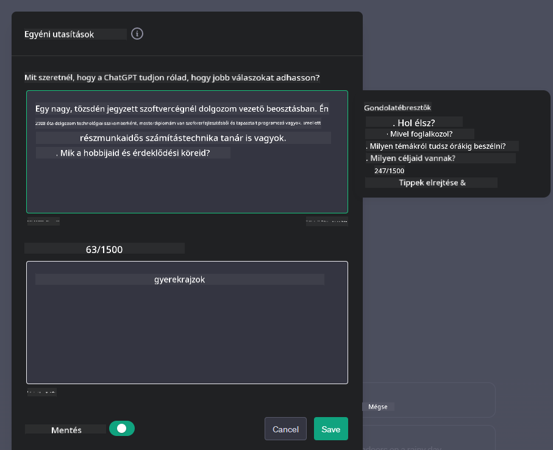
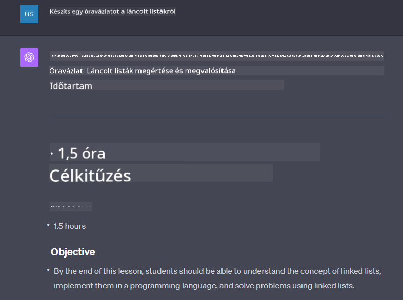

<!--
CO_OP_TRANSLATOR_METADATA:
{
  "original_hash": "a5308963a56cfbad2d73b0fa99fe84b3",
  "translation_date": "2025-10-17T21:30:49+00:00",
  "source_file": "07-building-chat-applications/README.md",
  "language_code": "hu"
}
-->
# Generatív AI-alapú chatalkalmazások építése

[](https://youtu.be/R9V0ZY1BEQo?si=IHuU-fS9YWT8s4sA)

> _(Kattints a fenti képre a leckéhez tartozó videó megtekintéséhez)_

Miután láttuk, hogyan építhetünk szöveg-generáló alkalmazásokat, nézzük meg a chatalkalmazásokat.

A chatalkalmazások szerves részévé váltak mindennapi életünknek, nem csupán alkalmi beszélgetések eszközeként szolgálnak. Fontos szerepet töltenek be az ügyfélszolgálatban, technikai támogatásban, sőt, még kifinomult tanácsadó rendszerekben is. Valószínű, hogy nemrégiben már kapott segítséget egy chatalkalmazástól. Ahogy egyre fejlettebb technológiákat, például generatív AI-t integrálunk ezekbe a platformokba, a komplexitás növekszik, és vele együtt a kihívások is.

Néhány kérdés, amelyet meg kell válaszolnunk:

- **Az alkalmazás építése**. Hogyan építhetjük hatékonyan és integrálhatjuk zökkenőmentesen ezeket az AI-alapú alkalmazásokat konkrét felhasználási esetekhez?
- **Felügyelet**. Miután bevezettük, hogyan tudjuk figyelemmel kísérni és biztosítani, hogy az alkalmazások a legmagasabb szintű minőségben működjenek, mind funkcióik, mind pedig a [felelős AI hat alapelveinek](https://www.microsoft.com/ai/responsible-ai?WT.mc_id=academic-105485-koreyst) betartása szempontjából?

Ahogy egyre inkább az automatizáció és az ember-gép interakciók korszakába lépünk, elengedhetetlen megérteni, hogyan alakítja át a generatív AI a chatalkalmazások hatókörét, mélységét és alkalmazkodóképességét. Ez a lecke megvizsgálja azokat az architekturális szempontokat, amelyek támogatják ezeket az összetett rendszereket, bemutatja a módszereket, amelyekkel finomhangolhatók az adott területekhez, és értékeli azokat a mérőszámokat és megfontolásokat, amelyek a felelős AI bevezetéséhez szükségesek.

## Bevezetés

Ez a lecke az alábbiakat tárgyalja:

- Hatékony technikák chatalkalmazások építéséhez és integrálásához.
- Hogyan alkalmazzuk a testreszabást és finomhangolást az alkalmazásokban.
- Stratégiák és megfontolások a chatalkalmazások hatékony felügyeletéhez.

## Tanulási célok

A lecke végére képes leszel:

- Ismertetni a chatalkalmazások meglévő rendszerekbe történő integrálásának szempontjait.
- Testreszabni chatalkalmazásokat konkrét felhasználási esetekhez.
- Azonosítani a kulcsfontosságú mérőszámokat és megfontolásokat az AI-alapú chatalkalmazások minőségének hatékony felügyeletéhez és fenntartásához.
- Biztosítani, hogy a chatalkalmazások felelősségteljesen használják az AI-t.

## Generatív AI integrálása chatalkalmazásokba

A generatív AI által támogatott chatalkalmazások fejlesztése nem csupán arról szól, hogy okosabbá tegyük őket; sokkal inkább az architektúra, a teljesítmény és a felhasználói felület optimalizálásáról, hogy minőségi felhasználói élményt nyújtsanak. Ez magában foglalja az architekturális alapok, API-integrációk és felhasználói felület szempontjainak vizsgálatát. Ez a rész átfogó útmutatót kínál a komplex területek navigálásához, akár meglévő rendszerekbe integrálod őket, akár önálló platformként építed fel.

A rész végére olyan szakértelemmel leszel felvértezve, amely lehetővé teszi, hogy hatékonyan építsd és integráld a chatalkalmazásokat.

### Chatbot vagy chatalkalmazás?

Mielőtt belevágnánk a chatalkalmazások építésébe, hasonlítsuk össze a „chatbotokat” és az „AI-alapú chatalkalmazásokat”, amelyek különböző szerepeket és funkciókat töltenek be. Egy chatbot fő célja, hogy automatizáljon bizonyos beszélgetési feladatokat, például válaszoljon gyakran ismételt kérdésekre vagy nyomon kövesse egy csomagot. Általában szabályalapú logika vagy összetett AI algoritmusok irányítják. Ezzel szemben egy AI-alapú chatalkalmazás sokkal tágabb környezetet kínál, amely különféle digitális kommunikációs formákat tesz lehetővé, például szöveges, hang- és videóbeszélgetéseket emberi felhasználók között. Meghatározó jellemzője egy generatív AI modell integrációja, amely árnyalt, emberi-szerű beszélgetéseket szimulál, és válaszokat generál a különféle bemenetek és kontextuális jelek alapján. Egy generatív AI-alapú chatalkalmazás képes nyílt témájú beszélgetésekre, alkalmazkodik a változó beszélgetési kontextusokhoz, sőt, kreatív vagy összetett párbeszédeket is létrehozhat.

Az alábbi táblázat bemutatja a főbb különbségeket és hasonlóságokat, hogy megértsük ezek egyedi szerepét a digitális kommunikációban.

| Chatbot                               | Generatív AI-alapú chatalkalmazás      |
| ------------------------------------- | -------------------------------------- |
| Feladatra fókuszált és szabályalapú   | Kontextusérzékeny                     |
| Gyakran nagyobb rendszerekbe integrált | Egy vagy több chatbotot is tartalmazhat |
| Korlátozott programozott funkciók     | Generatív AI modelleket integrál       |
| Specializált és strukturált interakciók | Nyílt témájú beszélgetésekre képes     |

### Előre elkészített funkciók használata SDK-k és API-k segítségével

Amikor chatalkalmazást építünk, jó kiindulópont, ha felmérjük, mi áll már rendelkezésre. Az SDK-k és API-k használata chatalkalmazások építéséhez számos előnnyel jár. Jól dokumentált SDK-k és API-k integrálásával stratégiailag pozícionálod az alkalmazásodat a hosszú távú siker érdekében, kezelve a skálázhatósági és karbantartási problémákat.

- **Felgyorsítja a fejlesztési folyamatot és csökkenti a költségeket**: Az előre elkészített funkciókra támaszkodva, ahelyett hogy drága folyamatokkal magad építenéd fel őket, lehetőséged nyílik az alkalmazás más fontos aspektusaira koncentrálni, például az üzleti logikára.
- **Jobb teljesítmény**: Ha a funkciókat a semmiből építed, előbb-utóbb felmerül a kérdés: „Hogyan skálázódik? Képes-e az alkalmazás kezelni a hirtelen felhasználói áradatot?” A jól karbantartott SDK-k és API-k gyakran beépített megoldásokat kínálnak ezekre a problémákra.
- **Könnyebb karbantartás**: A frissítések és fejlesztések könnyebben kezelhetők, mivel a legtöbb API és SDK egyszerűen egy könyvtár frissítését igényli, amikor újabb verzió jelenik meg.
- **Hozzáférés a legmodernebb technológiához**: Olyan modellek használata, amelyek kiterjedt adathalmazokon lettek finomhangolva és betanítva, természetes nyelvi képességekkel ruházza fel az alkalmazásodat.

Egy SDK vagy API funkcióinak elérése általában a szolgáltatások használatára való engedély megszerzését igényli, amely gyakran egy egyedi kulcs vagy hitelesítési token használatával történik. Az OpenAI Python könyvtárat fogjuk használni, hogy bemutassuk, hogyan néz ki ez. Te is kipróbálhatod a következő [OpenAI notebookban](./python/oai-assignment.ipynb?WT.mc_id=academic-105485-koreyst) vagy az [Azure OpenAI Services notebookban](./python/aoai-assignment.ipynb?WT.mc_id=academic-105485-koreys) ehhez a leckéhez.

```python
import os
from openai import OpenAI

API_KEY = os.getenv("OPENAI_API_KEY","")

client = OpenAI(
    api_key=API_KEY
    )

chat_completion = client.chat.completions.create(model="gpt-3.5-turbo", messages=[{"role": "user", "content": "Suggest two titles for an instructional lesson on chat applications for generative AI."}])
```

A fenti példa a GPT-3.5 Turbo modellt használja a prompt teljesítéséhez, de vedd észre, hogy az API kulcsot előzetesen beállították. Hibát kapnál, ha nem állítanád be a kulcsot.

## Felhasználói élmény (UX)

Általános UX elvek érvényesek a chatalkalmazásokra, de itt van néhány további szempont, amelyek különösen fontosak a gépi tanulási komponensek miatt.

- **Mechanizmus a kétértelműség kezelésére**: A generatív AI modellek időnként kétértelmű válaszokat generálnak. Egy olyan funkció, amely lehetővé teszi a felhasználók számára, hogy tisztázást kérjenek, hasznos lehet, ha ilyen problémával találkoznak.
- **Kontextus megőrzése**: A fejlett generatív AI modellek képesek megjegyezni a beszélgetés kontextusát, ami szükséges eszköz lehet a felhasználói élményhez. A felhasználók számára a kontextus kezelésének és irányításának lehetősége javítja az élményt, de növeli az érzékeny felhasználói információk megőrzésének kockázatát. Az információ tárolásának időtartamára vonatkozó megfontolások, például egy megőrzési politika bevezetése, egyensúlyt teremthetnek a kontextus szükségessége és a magánélet között.
- **Személyre szabás**: Az AI modellek tanulási és alkalmazkodási képessége révén egyéni élményt kínálnak a felhasználók számára. A felhasználói élmény testreszabása olyan funkciókkal, mint például a felhasználói profilok, nemcsak azt az érzést kelti, hogy a felhasználó megértett, hanem segíti őt konkrét válaszok megtalálásában, hatékonyabbá és kielégítőbbé téve az interakciót.

Egy ilyen személyre szabási példa az OpenAI ChatGPT „Egyéni utasítások” beállítása. Ez lehetővé teszi, hogy megadjon magáról olyan információkat, amelyek fontos kontextust jelenthetnek a promptjaihoz. Íme egy példa egy egyéni utasításra.



Ez a „profil” arra készteti a ChatGPT-t, hogy készítsen egy lecketervezetet a láncolt listákról. Figyeld meg, hogy a ChatGPT figyelembe veszi, hogy a felhasználó talán mélyebb lecketervezetet szeretne a tapasztalata alapján.



### Microsoft rendszerüzenet-keretrendszere nagy nyelvi modellekhez

[A Microsoft útmutatást nyújtott](https://learn.microsoft.com/azure/ai-services/openai/concepts/system-message#define-the-models-output-format?WT.mc_id=academic-105485-koreyst) a hatékony rendszerüzenetek írásához, amikor LLM-ekből generálunk válaszokat, négy területre bontva:

1. Meghatározni, hogy ki számára készült a modell, valamint annak képességeit és korlátait.
2. Meghatározni a modell kimeneti formátumát.
3. Konkrét példák megadása, amelyek bemutatják a modell kívánt viselkedését.
4. További viselkedési korlátok megadása.

### Hozzáférhetőség

Akár vizuális, hallási, motoros vagy kognitív fogyatékossággal élő felhasználóról van szó, egy jól tervezett chatalkalmazásnak mindenki számára használhatónak kell lennie. Az alábbi lista a különböző fogyatékosságokkal élő felhasználók hozzáférhetőségét javító konkrét funkciókat sorolja fel.

- **Funkciók látássérültek számára**: Nagy kontrasztú témák és átméretezhető szöveg, képernyőolvasó kompatibilitás.
- **Funkciók hallássérültek számára**: Szöveg-beszéd és beszéd-szöveg funkciók, vizuális jelzések hangértesítésekhez.
- **Funkciók mozgássérültek számára**: Billentyűzet-navigáció támogatása, hangparancsok.
- **Funkciók kognitív fogyatékossággal élők számára**: Egyszerűsített nyelvi opciók.

## Testreszabás és finomhangolás területspecifikus nyelvi modellekhez

Képzelj el egy chatalkalmazást, amely érti a céged szakzsargonját, és előre látja a felhasználói bázis által gyakran feltett kérdéseket. Két megközelítést érdemes megemlíteni:

- **DSL modellek használata**. A DSL a területspecifikus nyelvet jelenti. Egy úgynevezett DSL modell használatával, amely egy adott területre van betanítva, megértheted annak fogalmait és szcenárióit.
- **Finomhangolás alkalmazása**. A finomhangolás folyamata a modell további betanítását jelenti specifikus adatokkal.

## Testreszabás: DSL használata

A területspecifikus nyelvi modellek (DSL modellek) használata növelheti a felhasználói elköteleződést azáltal, hogy specializált, kontextusban releváns interakciókat biztosít. Ez egy olyan modell, amelyet egy adott területhez, iparághoz vagy témához kapcsolódó szöveg megértésére és generálására képeztek ki vagy finomhangoltak. A DSL modell használatának lehetőségei a nulláról történő betanítástól kezdve a meglévők SDK-kon és API-kon keresztüli használatáig terjednek. Egy másik lehetőség a finomhangolás, amely egy meglévő előre betanított modell adaptálását jelenti egy adott területhez.

## Testreszabás: Finomhangolás alkalmazása

A finomhangolást gyakran akkor alkalmazzák, amikor egy előre betanított modell nem elég egy specializált területen vagy konkrét feladatban.

Például az orvosi kérdések összetettek, és sok kontextust igényelnek. Amikor egy orvosi szakember diagnosztizál egy beteget, az számos tényezőn alapul, például életmódon vagy meglévő állapotokon, és akár a legújabb orvosi folyóiratokra is támaszkodhat a diagnózis megerősítéséhez. Ilyen árnyalt szcenáriókban egy általános célú AI chatalkalmazás nem lehet megbízható forrás.

### Szcenárió: egy orvosi alkalmazás

Képzelj el egy chatalkalmazást, amely segíti az orvosi szakembereket azzal, hogy gyorsan hozzáférést biztosít kezelési irányelvekhez, gyógyszerkölcsönhatásokhoz vagy legújabb kutatási eredményekhez.

Egy általános célú modell megfelelő lehet alapvető orvosi kérdések megválaszolására vagy általános tanácsadásra, de nehézségekbe ütközhet az alábbiakban:

- **Nagyon specifikus vagy összetett esetek**. Például egy neurológus megkérdezheti az alkalmazást: „Melyek a jelenlegi legjobb gyakorlatok a gyógyszer-rezisztens epilepszia kezelésére gyermekeknél?”
- **Legújabb fejlemények hiánya**
| **Anomáliaészlelés**         | Eszközök és technikák a szokatlan minták azonosítására, amelyek nem felelnek meg a várt viselkedésnek.                        | Hogyan reagálsz az anomáliákra?                                        |

### Felelős AI gyakorlatok megvalósítása chatalkalmazásokban

A Microsoft Felelős AI megközelítése hat alapelvet azonosított, amelyeknek irányítaniuk kell az AI fejlesztését és használatát. Az alábbiakban bemutatjuk az alapelveket, azok meghatározását, valamint a chatfejlesztők számára fontos szempontokat és az okokat, hogy miért kell ezeket komolyan venni.

| Alapelvek              | Microsoft meghatározása                               | Szempontok a chatfejlesztő számára                                      | Miért fontos?                                                                     |
| ---------------------- | ----------------------------------------------------- | ---------------------------------------------------------------------- | --------------------------------------------------------------------------------- |
| Méltányosság           | Az AI rendszereknek minden embert méltányosan kell kezelniük. | Biztosítsd, hogy a chatalkalmazás ne diszkrimináljon a felhasználói adatok alapján. | A felhasználói bizalom és befogadás építése érdekében; elkerüli a jogi következményeket. |
| Megbízhatóság és biztonság | Az AI rendszereknek megbízhatóan és biztonságosan kell működniük. | Tesztelés és biztonsági mechanizmusok bevezetése a hibák és kockázatok minimalizálása érdekében. | Biztosítja a felhasználói elégedettséget és megelőzi a potenciális károkat.       |
| Adatvédelem és biztonság | Az AI rendszereknek biztonságosnak kell lenniük, és tiszteletben kell tartaniuk az adatvédelmet. | Erős titkosítás és adatvédelmi intézkedések bevezetése.              | Az érzékeny felhasználói adatok védelme és az adatvédelmi törvények betartása érdekében. |
| Befogadás              | Az AI rendszereknek mindenkit támogatniuk kell, és be kell vonniuk az embereket. | Olyan UI/UX tervezése, amely hozzáférhető és könnyen használható a különböző közönségek számára. | Biztosítja, hogy szélesebb körű emberek hatékonyan használhassák az alkalmazást.  |
| Átláthatóság           | Az AI rendszereknek érthetőnek kell lenniük.          | Világos dokumentáció és az AI válaszainak indoklása biztosítása.       | A felhasználók nagyobb valószínűséggel bíznak egy rendszerben, ha megértik, hogyan születnek a döntések. |
| Felelősség             | Az embereknek felelősséget kell vállalniuk az AI rendszerekért. | Egyértelmű folyamat létrehozása az AI döntések auditálására és javítására. | Lehetővé teszi a folyamatos fejlesztést és a hibák esetén a korrekciós intézkedéseket. |

## Feladat

Lásd [feladat](../../../07-building-chat-applications/python). Ez végigvezet egy sor gyakorlaton, az első chatparancsok futtatásától kezdve a szöveg osztályozásán és összegzésén át, és még sok másig. Figyeld meg, hogy a feladatok különböző programozási nyelveken érhetők el!

## Szép munka! Folytasd az utat

A leckét befejezve nézd meg a [Generatív AI tanulási gyűjteményt](https://aka.ms/genai-collection?WT.mc_id=academic-105485-koreyst), hogy tovább fejleszthesd a Generatív AI ismereteidet!

Lépj tovább a 8. leckére, hogy megtudd, hogyan kezdhetsz el [keresési alkalmazásokat építeni](../08-building-search-applications/README.md?WT.mc_id=academic-105485-koreyst)!

---

**Felelősség kizárása**:  
Ez a dokumentum az [Co-op Translator](https://github.com/Azure/co-op-translator) AI fordítási szolgáltatás segítségével lett lefordítva. Bár törekszünk a pontosságra, kérjük, vegye figyelembe, hogy az automatikus fordítások hibákat vagy pontatlanságokat tartalmazhatnak. Az eredeti dokumentum az eredeti nyelvén tekintendő hiteles forrásnak. Fontos információk esetén javasolt professzionális emberi fordítást igénybe venni. Nem vállalunk felelősséget semmilyen félreértésért vagy téves értelmezésért, amely a fordítás használatából eredhet.