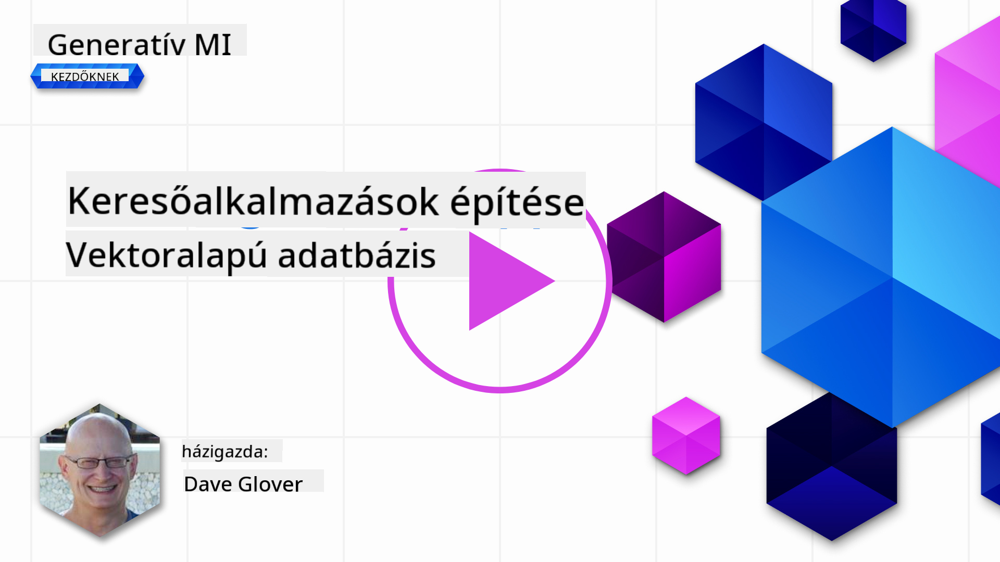

<!--
CO_OP_TRANSLATOR_METADATA:
{
  "original_hash": "d46aad0917a1a342d613e2c13d457da5",
  "translation_date": "2025-05-19T18:40:20+00:00",
  "source_file": "08-building-search-applications/README.md",
  "language_code": "hu"
}
-->
# Keresési alkalmazás építése

[](https://aka.ms/gen-ai-lesson8-gh?WT.mc_id=academic-105485-koreyst)

> > _Kattints a fenti képre, hogy megnézd a leckéhez tartozó videót_

Az LLM-ek többek, mint chatbotok és szöveg generálás. Lehetőség van keresési alkalmazások építésére is Embeddings segítségével. Az Embeddings numerikus adatábrázolások, más néven vektorok, amelyeket szemantikai keresésre használhatunk.

Ebben a leckében egy keresési alkalmazást fogsz építeni az oktatási startupunk számára. A startupunk egy non-profit szervezet, amely ingyenes oktatást biztosít diákoknak fejlődő országokban. Számos YouTube videónk van, amelyeket a diákok használhatnak az AI tanulására. A startupunk szeretne egy keresési alkalmazást építeni, amely lehetővé teszi a diákok számára, hogy kérdések beírásával keressenek YouTube videókat.

Például egy diák beírhatja, hogy 'Mik azok a Jupyter Notebookok?' vagy 'Mi az az Azure ML', és a keresési alkalmazás visszaad egy listát a kérdéshez kapcsolódó YouTube videókról, sőt, még a videó azon részéhez is egy linket, ahol a kérdésre adott válasz található.

## Bevezetés

Ebben a leckében szó lesz:

- Szemantikai vs Kulcsszó keresés.
- Mik azok a Szöveg Embeddings.
- Szöveg Embeddings Index létrehozása.
- Szöveg Embeddings Index keresése.

## Tanulási célok

A lecke befejezése után képes leszel:

- Megkülönböztetni a szemantikai és kulcsszó keresést.
- Elmagyarázni, mik azok a Szöveg Embeddings.
- Alkalmazást létrehozni Embeddings használatával az adatok keresésére.

## Miért építsünk keresési alkalmazást?

Egy keresési alkalmazás létrehozása segít megérteni, hogyan használhatók az Embeddings az adatok keresésére. Megtanulod, hogyan építhetsz keresési alkalmazást, amelyet a diákok gyorsan használhatnak információk megtalálására.

A lecke tartalmazza a Microsoft [AI Show](https://www.youtube.com/playlist?list=PLlrxD0HtieHi0mwteKBOfEeOYf0LJU4O1) YouTube csatornájának átiratainak Embedding Indexét. Az AI Show egy YouTube csatorna, amely az AI-ról és gépi tanulásról tanít. Az Embedding Index tartalmazza a YouTube átiratok Embeddings-ét 2023 októberéig. Az Embedding Indexet fogod használni, hogy keresési alkalmazást építs a startupunk számára. A keresési alkalmazás visszaad egy linket a videó azon részéhez, ahol a kérdésre adott válasz található. Ez egy nagyszerű mód a diákok számára, hogy gyorsan megtalálják a szükséges információkat.

Az alábbi egy példa egy szemantikai lekérdezésre a 'használható-e az rstudio az azure ml-lel?' kérdésre. Nézd meg a YouTube URL-t, látni fogod, hogy az URL tartalmaz egy időbélyeget, amely a videó azon részére visz, ahol a kérdésre adott válasz található.


## Mi az a szemantikai keresés?

Most talán azon gondolkodsz, mi az a szemantikai keresés? A szemantikai keresés egy olyan keresési technika, amely a lekérdezés szavainak szemantikáját, vagy jelentését használja, hogy releváns eredményeket adjon vissza.

Itt van egy példa a szemantikai keresésre. Tegyük fel, hogy autót szeretnél vásárolni, kereshetsz úgy, hogy 'álmaim autója', a szemantikai keresés megérti, hogy nem `dreaming` az autóról, hanem inkább vásárolni szeretnél egy `ideal` autót. A szemantikai keresés megérti a szándékodat, és releváns eredményeket ad vissza. Az alternatíva a `keyword search`, amely szó szerint keres álmokat az autókról, és gyakran irreleváns eredményeket ad vissza.

## Mik azok a Szöveg Embeddings?

[A szöveg embeddings](https://en.wikipedia.org/wiki/Word_embedding?WT.mc_id=academic-105485-koreyst) egy szöveg ábrázolási technika, amelyet a [természetes nyelv feldolgozásban](https://en.wikipedia.org/wiki/Natural_language_processing?WT.mc_id=academic-105485-koreyst) használnak. A szöveg embeddings a szöveg szemantikai numerikus ábrázolásai. Az Embeddings-eket az adatok olyan módon történő ábrázolására használják, amelyet a gép könnyen megérthet. Számos modell létezik a szöveg embeddings építésére, ebben a leckében az OpenAI Embedding Model segítségével generált embeddings-re fogunk összpontosítani.

Itt van egy példa, képzeld el, hogy a következő szöveg egy átirat az AI Show YouTube csatorna egyik epizódjából:

```text
Today we are going to learn about Azure Machine Learning.
```

A szöveget átadnánk az OpenAI Embedding API-nak, és az visszaadná a következő, 1536 számot tartalmazó embeddinget, más néven vektort. A vektor minden egyes száma a szöveg egy más aspektusát képviseli. Rövidség kedvéért itt van a vektor első 10 száma.

```python
[-0.006655829958617687, 0.0026128944009542465, 0.008792596869170666, -0.02446001023054123, -0.008540431968867779, 0.022071078419685364, -0.010703742504119873, 0.003311325330287218, -0.011632772162556648, -0.02187200076878071, ...]
```

## Hogyan készül az Embedding index?

Az Embedding indexet ehhez a leckéhez egy sor Python szkript segítségével hozták létre. A szkripteket és az utasításokat megtalálod a [README](./scripts/README.md?WT.mc_id=academic-105485-koreyst) fájlban a 'scripts' mappában ehhez a leckéhez. Nem szükséges futtatnod ezeket a szkripteket a lecke teljesítéséhez, mivel az Embedding Index rendelkezésre áll számodra.

A szkriptek a következő műveleteket hajtják végre:

1. Letöltik az átiratot az [AI Show](https://www.youtube.com/playlist?list=PLlrxD0HtieHi0mwteKBOfEeOYf0LJU4O1) lejátszási lista minden YouTube videójához.
2. Az [OpenAI Functions](https://learn.microsoft.com/azure/ai-services/openai/how-to/function-calling?WT.mc_id=academic-105485-koreyst) segítségével megpróbálják kinyerni a beszélő nevét az első 3 percben a YouTube átiratból. A beszélő neve minden videóhoz az Embedding Indexben tárolódik `embedding_index_3m.json` néven.
3. Az átirat szövegét **3 perces szöveg szegmensekre** bontják. A szegmens körülbelül 20 szót átfed a következő szegmensből, hogy biztosítsa, hogy a szegmens Embeddingje ne legyen levágva, és jobb keresési kontextust biztosítson.
4. Minden szöveg szegmenst átadnak az OpenAI Chat API-nak, hogy 60 szóban összefoglalja a szöveget. Az összefoglaló szintén tárolódik az Embedding Indexben `embedding_index_3m.json` néven.
5. Végül a szegmens szöveget átadják az OpenAI Embedding API-nak. Az Embedding API visszaad egy 1536 számot tartalmazó vektort, amely a szegmens szemantikai jelentését képviseli. A szegmens az OpenAI Embedding vektorral együtt tárolódik az Embedding Indexben `embedding_index_3m.json` néven.

### Vektor Adatbázisok

A lecke egyszerűsítése érdekében az Embedding Index egy JSON fájlban van tárolva `embedding_index_3m.json` néven, és Pandas DataFrame-be van betöltve. Azonban a gyakorlatban az Embedding Index egy vektor adatbázisban lenne tárolva, mint például az [Azure Cognitive Search](https://learn.microsoft.com/training/modules/improve-search-results-vector-search?WT.mc_id=academic-105485-koreyst), [Redis](https://cookbook.openai.com/examples/vector_databases/redis/readme?WT.mc_id=academic-105485-koreyst), [Pinecone](https://cookbook.openai.com/examples/vector_databases/pinecone/readme?WT.mc_id=academic-105485-koreyst), [Weaviate](https://cookbook.openai.com/examples/vector_databases/weaviate/readme?WT.mc_id=academic-105485-koreyst), hogy csak néhányat említsünk.

## A koszinusz hasonlóság megértése

Megtanultunk a szöveg embeddings-ről, a következő lépés az, hogy megtanuljuk, hogyan használjuk a szöveg embeddings-et az adatok keresésére, és különösen a leginkább hasonló embeddings megtalálására egy adott lekérdezéshez a koszinusz hasonlóság segítségével.

### Mi az a koszinusz hasonlóság?

A koszinusz hasonlóság két vektor közötti hasonlóság mértéke, amit gyakran hallhatsz `nearest neighbor search` néven is. A koszinusz hasonlóság kereséséhez szükséges, hogy _vektorizáljuk_ a _lekérdezés_ szöveget az OpenAI Embedding API segítségével. Ezután kiszámoljuk a _koszinusz hasonlóságot_ a lekérdezési vektor és az Embedding Index minden vektora között. Ne feledd, az Embedding Indexnek van egy vektora minden YouTube átirat szöveg szegmenséhez. Végül rendezzük az eredményeket koszinusz hasonlóság szerint, és a legmagasabb koszinusz hasonlósággal rendelkező szöveg szegmensek a leginkább hasonlóak a lekérdezéshez.

Matematikai szempontból a koszinusz hasonlóság a két vektor közötti szög koszinuszát méri egy többdimenziós térben. Ez a mérés hasznos, mert ha két dokumentum messze van egymástól euklideszi távolság alapján a méret miatt, akkor is lehet kisebb szög köztük, és ezért magasabb koszinusz hasonlóság. További információ a koszinusz hasonlóság egyenleteiről: [Koszinusz hasonlóság](https://en.wikipedia.org/wiki/Cosine_similarity?WT.mc_id=academic-105485-koreyst).

## Az első keresési alkalmazásod építése

Most megtanuljuk, hogyan építsünk keresési alkalmazást Embeddings segítségével. A keresési alkalmazás lehetővé teszi a diákok számára, hogy kérdés beírásával keressenek videókat. A keresési alkalmazás visszaad egy listát a kérdéshez kapcsolódó videókról. A keresési alkalmazás egy linket is visszaad a videó azon részéhez, ahol a kérdésre adott válasz található.

Ez a megoldás Windows 11, macOS és Ubuntu 22.04 rendszereken lett építve és tesztelve Python 3.10 vagy újabb verzióval. A Python letölthető a [python.org](https://www.python.org/downloads/?WT.mc_id=academic-105485-koreyst) oldalról.

## Feladat - keresési alkalmazás építése, hogy a diákoknak segítsen

A lecke elején bemutattuk a startupunkat. Most itt az idő, hogy lehetővé tegyük a diákok számára, hogy keresési alkalmazást építsenek a feladataikhoz.

Ebben a feladatban létrehozod az Azure OpenAI Szolgáltatásokat, amelyeket a keresési alkalmazás építéséhez használnak. Létrehozod a következő Azure OpenAI Szolgáltatásokat. Szükséged lesz egy Azure előfizetésre a feladat teljesítéséhez.

### Az Azure Cloud Shell indítása

1. Jelentkezz be az [Azure portálra](https://portal.azure.com/?WT.mc_id=academic-105485-koreyst).
2. Válaszd ki a Cloud Shell ikont az Azure portál jobb felső sarkában.
3. Válaszd a **Bash** környezet típust.

#### Hozz létre egy erőforráscsoportot

> Ezekhez az utasításokhoz az "semantic-video-search" nevű erőforráscsoportot használjuk az East US területen.
> Megváltoztathatod az erőforráscsoport nevét, de ha megváltoztatod az erőforrások helyét,
> ellenőrizd a [modell elérhetőségi táblázatot](https://aka.ms/oai/models?WT.mc_id=academic-105485-koreyst).

```shell
az group create --name semantic-video-search --location eastus
```

#### Hozz létre egy Azure OpenAI Szolgáltatás erőforrást

Az Azure Cloud Shell-ből futtasd a következő parancsot egy Azure OpenAI Szolgáltatás erőforrás létrehozásához.

```shell
az cognitiveservices account create --name semantic-video-openai --resource-group semantic-video-search \
    --location eastus --kind OpenAI --sku s0
```

#### Szerezd meg a végpontot és a kulcsokat ennek az alkalmazásnak a használatához

Az Azure Cloud Shell-ből futtasd a következő parancsokat, hogy megszerezd a végpontot és a kulcsokat az Azure OpenAI Szolgáltatás erőforráshoz.

```shell
az cognitiveservices account show --name semantic-video-openai \
   --resource-group  semantic-video-search | jq -r .properties.endpoint
az cognitiveservices account keys list --name semantic-video-openai \
   --resource-group semantic-video-search | jq -r .key1
```

#### Telepítsd az OpenAI Embedding modellt

Az Azure Cloud Shell-ből futtasd a következő parancsot az OpenAI Embedding modell telepítéséhez.

```shell
az cognitiveservices account deployment create \
    --name semantic-video-openai \
    --resource-group  semantic-video-search \
    --deployment-name text-embedding-ada-002 \
    --model-name text-embedding-ada-002 \
    --model-version "2"  \
    --model-format OpenAI \
    --sku-capacity 100 --sku-name "Standard"
```

## Megoldás

Nyisd meg a [megoldás notebookot](../../../08-building-search-applications/python/aoai-solution.ipynb) a GitHub Codespaces-ben, és kövesd az utasításokat a Jupyter Notebookban.

Amikor futtatod a notebookot, kérni fogja, hogy adj meg egy lekérdezést. A beviteli mező így fog kinézni:


## Nagyszerű munka! Folytasd a tanulást

A lecke befejezése után nézd meg a [Generatív AI Tanulási gyűjteményünket](https://aka.ms/genai-collection?WT.mc_id=academic-105485-koreyst), hogy tovább fejleszd a Generatív AI tudásodat!

Haladj tovább a 9. leckére, ahol megnézzük, hogyan [építhetünk kép generáló alkalmazásokat](../09-building-image-applications/README.md?WT.mc_id=academic-105485-koreyst)!

**Felelősség kizárása**:  
Ez a dokumentum az [Co-op Translator](https://github.com/Azure/co-op-translator) AI fordítási szolgáltatás használatával lett lefordítva. Bár törekszünk a pontosságra, kérjük, vegye figyelembe, hogy az automatikus fordítások hibákat vagy pontatlanságokat tartalmazhatnak. Az eredeti dokumentum a saját nyelvén tekintendő hiteles forrásnak. Kritikus információk esetén javasolt professzionális emberi fordítást igénybe venni. Nem vállalunk felelősséget a fordítás használatából eredő félreértésekért vagy félremagyarázásokért.