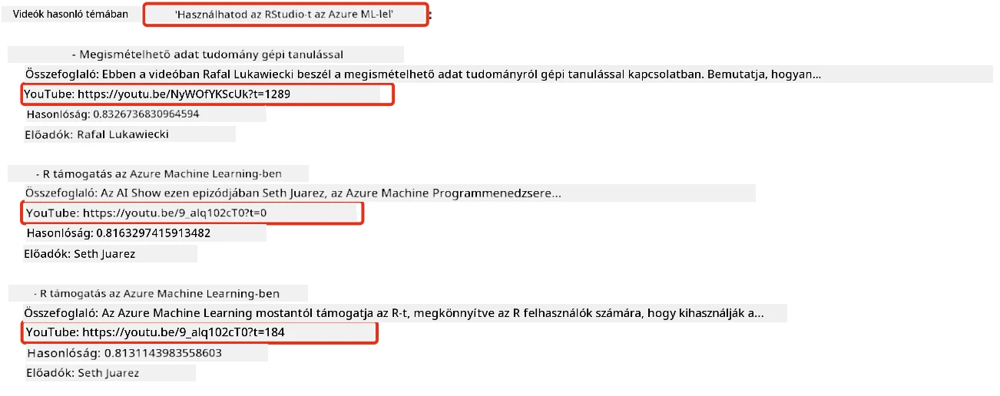
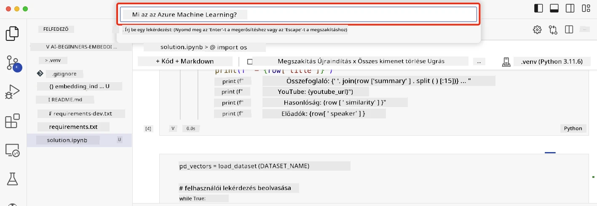

# Keresőalkalmazások építése

[](https://youtu.be/W0-nzXjOjr0?si=GcsqiTTvd7RKbo7V)

> > _Kattints a fenti képre a lecke videójának megtekintéséhez_

A nagy nyelvi modelleken túl több is van, mint chatbotok és szöveg generálása. Beágyazások segítségével keresőalkalmazásokat is lehet építeni. A beágyazások az adatok numerikus ábrázolásai, más néven vektorok, és használhatók szemantikus kereséshez adatokat illetően.

Ebben a leckében egy keresőalkalmazást építesz az oktatási startupunk számára. Startupunk egy nonprofit szervezet, amely ingyenes oktatást nyújt fejlődő országok diákjainak. Sok YouTube videónk van, amiket a diákok használhatnak az MI tanulására. A startupunk egy keresőalkalmazást szeretne építeni, amely lehetővé teszi a diákok számára, hogy kérdés beírásával keressenek YouTube videókat.

Például egy diák beírhatja, hogy 'Mik a Jupyter Notebookok?' vagy 'Mi az Azure ML', és a keresőalkalmazás visszaadja a kérdéshez releváns YouTube videók listáját, és még jobb, hogy a keresőalkalmazás egy linket is ad arra a helyre a videóban, ahol a kérdésre adott válasz található.

## Bevezetés

Ebben a leckében a következőkről lesz szó:

- Szemantikus és kulcsszavas keresés.
- Mik azok a text beágyazások.
- Text beágyazás index létrehozása.
- Text beágyazás index keresése.

## Tanulási célok

A lecke elvégzése után képes leszel:

- Megkülönböztetni a szemantikus és kulcsszavas keresést.
- Elmagyarázni, mik azok a text beágyazások.
- Beágyazásokat használva alkalmazást létrehozni adatkereséshez.

## Miért érdemes keresőalkalmazást építeni?

Egy keresőalkalmazás építése segít megérteni, hogyan lehet beágyazásokat használni adatkereséshez. Megtanulod, hogyan kell olyan keresőalkalmazást építeni, amit a diákok gyors információkeresésre használhatnak.

A lecke tartalmazza a Microsoft [AI Show](https://www.youtube.com/playlist?list=PLlrxD0HtieHi0mwteKBOfEeOYf0LJU4O1) YouTube csatorna átiratainak beágyazás indexét. Az AI Show egy YouTube csatorna, amely MI-ről és gépi tanulásról tanít. Az index tartalmazza az átiratok beágyazásait 2023 októberéig. Ezt az indexet használod majd a keresőalkalmazás építéséhez. A keresőalkalmazás linket is ad arra a helyre a videóban, ahol a válasz található, ami remek módja annak, hogy a diákok gyorsan megtalálják a szükséges információt.

Az alábbi példa egy szemantikus lekérdezés a kérdésre: 'használható-e az rstudio az azure ml-hez?'. Nézd meg a YouTube URL-t, látni fogod, hogy az URL tartalmaz egy időbélyeget, ami átirányít arra a pontra a videóban, ahol a kérdés válasza található.



## Mi az a szemantikus keresés?

Talán most azon gondolkozol, mi az a szemantikus keresés? A szemantikus keresés egy olyan keresési technika, amely a lekérdezésben szereplő szavak jelentését, vagy szemantikáját használja, hogy releváns találatokat adjon vissza.

Íme egy példa a szemantikus keresésre. Tegyük fel, autót szeretnél venni, kereshetnél rá például a „álom autóm” kifejezésre. A szemantikus keresés megérti, hogy nem arról van szó, hogy álmodozol egy autóról, hanem arról, hogy meg szeretnéd venni az „ideális” autódat. A szemantikus keresés megérti a szándékodat és releváns találatokat ad. Alternatívaként a kulcsszavas keresés szó szerint „autókról szóló álmokat” keresne, és gyakran irreleváns eredményeket ad vissza.

## Mik azok a Text Embeddings?

A [szöveges beágyazások](https://en.wikipedia.org/wiki/Word_embedding?WT.mc_id=academic-105485-koreyst) egy szövegábrázolási technika a [természetes nyelvfeldolgozásban](https://en.wikipedia.org/wiki/Natural_language_processing?WT.mc_id=academic-105485-koreyst). A text beágyazások szemantikus, numerikus ábrázolások. A beágyazásokat arra használják, hogy az adatokat gép számára érthető módon reprezentálják. Sok modell létezik szöveges beágyazások létrehozására, ebben a leckében a OpenAI beágyazás modell generálására összpontosítunk.

Íme egy példa, képzeld el, hogy a következő szöveg egy felvétel átiratából származik az AI Show YouTube csatornájáról:

```text
Today we are going to learn about Azure Machine Learning.
```

A szöveget elküldjük az OpenAI Beágyazás API-nak, és az visszaad egy 1536 számot tartalmazó beágyazást, vagyis egy vektort. A vektor minden egyes száma a szöveg egy-egy különböző aspektusát képviseli. Rövidség kedvéért itt a vektor első 10 száma.

```python
[-0.006655829958617687, 0.0026128944009542465, 0.008792596869170666, -0.02446001023054123, -0.008540431968867779, 0.022071078419685364, -0.010703742504119873, 0.003311325330287218, -0.011632772162556648, -0.02187200076878071, ...]
```

## Hogyan készül az Embedding index?

Ennek a leckének az embedding indexét egy sor Python szkript hozta létre. A szkripteket és utasításokat megtalálod a [README](./scripts/README.md?WT.mc_id=academic-105485-koreyst) fájlban a `scripts` mappában. Ezeket a szkripteket nem kell lefuttatnod a lecke elvégzéséhez, mert az embedding index rendelkezésre áll.

A szkriptek a következő műveleteket végzik:

1. Letöltik az [AI Show](https://www.youtube.com/playlist?list=PLlrxD0HtieHi0mwteKBOfEeOYf0LJU4O1) lejátszási lista minden videójának átiratát.
2. [OpenAI Functions](https://learn.microsoft.com/azure/ai-foundry/openai/how-to/function-calling?WT.mc_id=academic-105485-koreyst) segítségével megpróbálják azonosítani a beszélő nevét a videó átiratának első 3 percéből. A beszélő nevét az `embedding_index_3m.json` néven tárolják az embedding indexben.
3. Az átiratot **3 perces szövegszakaszokra** bontják. A szakasz átfedéssel kb. 20 szóval túl nyúlik a következő szakaszig, hogy a szakasz beágyazása ne legyen megszakítva és jobb keresési kontextust biztosítson.
4. Minden szakaszt az OpenAI Chat API-nak küldenek, hogy 60 szavas összefoglalót készítsen. Az összefoglaló szintén az `embedding_index_3m.json` részét képezi.
5. Végül a szövegszakaszt az OpenAI Beágyazás API-nak küldik, amely visszaad egy 1536 számból álló vektort, ami a szakasz szemantikus jelentését reprezentálja. A szakasz és a vektor együtt kerül tárolásra az `embedding_index_3m.json` fájlban.

### Vektor adatbázisok

A lecke egyszerűsége érdekében az embedding index egy `embedding_index_3m.json` nevű JSON fájlban van tárolva és betöltve egy Pandas DataFrame-be. Viszont éles környezetben az embedding indexet egy vektor adatbázisban tárolnák, mint például az [Azure Cognitive Search](https://learn.microsoft.com/training/modules/improve-search-results-vector-search?WT.mc_id=academic-105485-koreyst), [Redis](https://cookbook.openai.com/examples/vector_databases/redis/readme?WT.mc_id=academic-105485-koreyst), [Pinecone](https://cookbook.openai.com/examples/vector_databases/pinecone/readme?WT.mc_id=academic-105485-koreyst), vagy [Weaviate](https://cookbook.openai.com/examples/vector_databases/weaviate/readme?WT.mc_id=academic-105485-koreyst) és mások.

## A koszinusz hasonlóság megértése

Megtanultuk a szöveges beágyazásokat, a következő lépés, hogy megtanuljuk, hogyan használjuk őket adatkeresésre, különösen, hogyan találjunk a lekérdezéshez leginkább hasonló beágyazásokat koszinusz hasonlóság segítségével.

### Mi az a koszinusz hasonlóság?

A koszinusz hasonlóság a hasonlóság mértéke két vektor között, ezt a `legközelebbi szomszéd keresés` kifejezéssel is illetik. A koszinusz hasonlóság kereséshez vektorrá kell alakítani a lekérdezés szövegét az OpenAI Beágyazás API segítségével. Ezután kiszámítjuk a lekérdezés vektora és az embedding index minden vektora közti koszinusz hasonlóságot. Az embedding indexben minden YouTube átírás szövegszakaszának van egy vektora. Végül az eredményeket koszinusz hasonlóság szerint sorba rendezzük és a legmagasabb koszinusz hasonlósággal rendelkező szövegszakaszok a leginkább hasonlóak a lekérdezéshez.

Matematikailag a koszinusz hasonlóság a két vektor közötti szög koszinuszát méri egy többdimenziós térben. Ez hasznos, mert két dokumentum lehet nagy távolságra Európa távolság szerint mérethatás miatt, mégis lehet kisebb szög köztük, tehát magasabb koszinusz hasonlóságuk. További információk a koszinusz hasonlóságról a [Koszinusz hasonlóság](https://en.wikipedia.org/wiki/Cosine_similarity?WT.mc_id=academic-105485-koreyst) oldalon.

## Az első keresőalkalmazásod építése

Ezután megtanuljuk, hogyan építsünk keresőalkalmazást beágyazások segítségével. A keresőalkalmazás lehetővé teszi a diákoknak, hogy kérdéssel keressenek videót. A keresőalkalmazás releváns videók listáját adja vissza a kérdésre. Továbbá visszaadja a linket arra a helyre a videóban, ahol a kérdésre adott válasz található.

Ez a megoldás Windows 11, macOS és Ubuntu 22.04 rendszereken lett építve és tesztelve Python 3.10 vagy újabb verzióval. Python letölthető innen: [python.org](https://www.python.org/downloads/?WT.mc_id=academic-105485-koreyst).

## Feladat - keresőalkalmazás építése a diákok számára

Bemutattuk a startupunkat a lecke elején. Most eljött az idő, hogy a diákokat képessé tegyük keresőalkalmazást építeni az értékeléseikhez.

Ebben a feladatban az Azure OpenAI szolgáltatásokat hozod létre, amelyek a keresőalkalmazás építéséhez kellenek. Létrehozod a következő Azure OpenAI szolgáltatásokat. Az előfeltétel egy Azure előfizetés a feladat elvégzéséhez.

### Indítsd el az Azure Cloud Shellt

1. Jelentkezz be az [Azure portálba](https://portal.azure.com/?WT.mc_id=academic-105485-koreyst).
2. Kattints a Cloud Shell ikonra a portál jobb felső sarkában.
3. Válaszd a **Bash** környezetet.

#### Létrehozás: erőforráscsoport

> Ehhez az utasításhoz az "semantic-video-search" nevű erőforráscsoportot használjuk az East US régióban.
> Az erőforráscsoport nevét megváltoztathatod, de ha változtatod az erőforrások helyét,
> nézd meg a [modelltámogatottság táblázatot](https://aka.ms/oai/models?WT.mc_id=academic-105485-koreyst).

```shell
az group create --name semantic-video-search --location eastus
```

#### Azure OpenAI szolgáltatás létrehozása

Az Azure Cloud Shellből futtasd az alábbi parancsot az Azure OpenAI szolgáltatás létrehozásához.

```shell
az cognitiveservices account create --name semantic-video-openai --resource-group semantic-video-search \
    --location eastus --kind OpenAI --sku s0
```

#### Endpoint és kulcsok lekérése az alkalmazás használatához

Az Azure Cloud Shellből futtasd az alábbi parancsokat az Azure OpenAI szolgáltatás endpointjának és kulcsainak lekéréséhez.

```shell
az cognitiveservices account show --name semantic-video-openai \
   --resource-group  semantic-video-search | jq -r .properties.endpoint
az cognitiveservices account keys list --name semantic-video-openai \
   --resource-group semantic-video-search | jq -r .key1
```

#### OpenAI Beágyazás modell telepítése

Az Azure Cloud Shellből futtasd az alábbi parancsot az OpenAI Beágyazás modell telepítéséhez.

```shell
az cognitiveservices account deployment create \
    --name semantic-video-openai \
    --resource-group  semantic-video-search \
    --deployment-name text-embedding-ada-002 \
    --model-name text-embedding-ada-002 \
    --model-version "2"  \
    --model-format OpenAI \
    --sku-capacity 100 --sku-name "Standard"
```

## Megoldás

Nyisd meg a [megoldás noteszt](./python/aoai-solution.ipynb?WT.mc_id=academic-105485-koreyst) a GitHub Codespaces-ben és kövesd a Jupyter Notebook utasításait.

A notesz futtatásakor megkér, hogy adj meg egy lekérdezést. A bevitel mező így fog kinézni:



## Remek munka! Folytasd a tanulást

A lecke elvégzése után nézd meg a [Generatív MI tanulási gyűjteményünket](https://aka.ms/genai-collection?WT.mc_id=academic-105485-koreyst), hogy tovább fejleszd generatív MI tudásod!

Lépj tovább a 9. leckére, ahol azt nézzük meg, hogyan lehet [képgeneráló alkalmazásokat építeni](../09-building-image-applications/README.md?WT.mc_id=academic-105485-koreyst)!

---

<!-- CO-OP TRANSLATOR DISCLAIMER START -->
**Jogi nyilatkozat**:
Ez a dokumentum az AI fordítási szolgáltatás, a [Co-op Translator](https://github.com/Azure/co-op-translator) segítségével készült. Bár az pontosságra törekszünk, kérjük, vegye figyelembe, hogy az automatikus fordítások hibákat vagy pontatlanságokat tartalmazhatnak. Az eredeti dokumentum az anyanyelvén tekintendő hiteles forrásnak. Fontos információk esetén professzionális emberi fordítást javasolunk. Nem vállalunk felelősséget semmilyen félreértésért vagy téves értelmezésért, amely ebből a fordításból ered.
<!-- CO-OP TRANSLATOR DISCLAIMER END -->