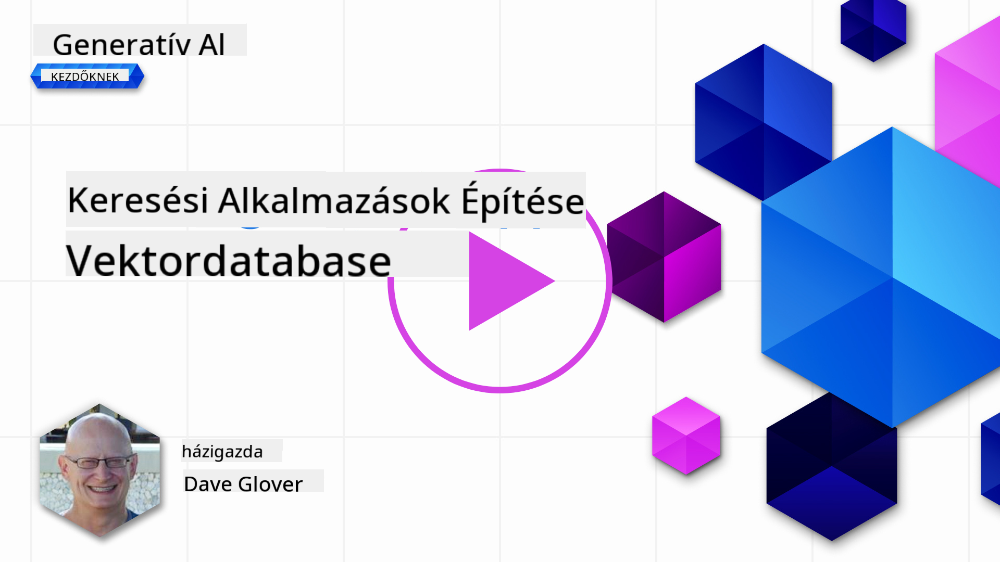
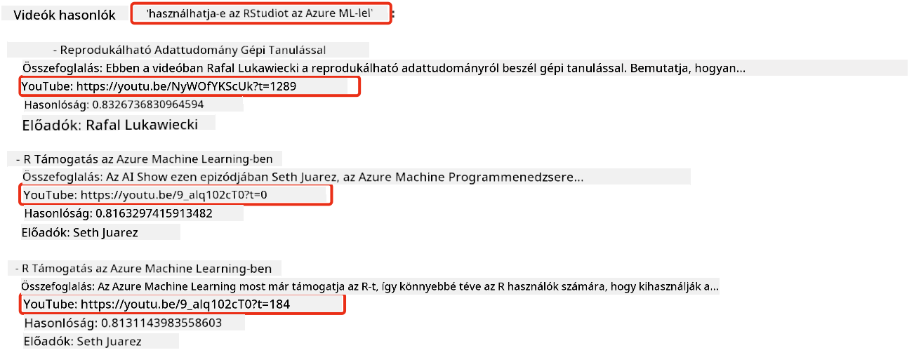
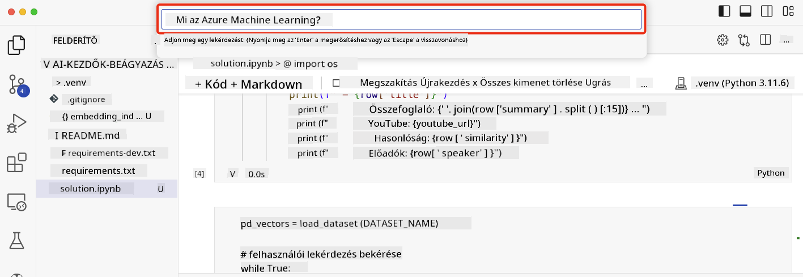

<!--
CO_OP_TRANSLATOR_METADATA:
{
  "original_hash": "d46aad0917a1a342d613e2c13d457da5",
  "translation_date": "2025-06-25T16:39:56+00:00",
  "source_file": "08-building-search-applications/README.md",
  "language_code": "hu"
}
-->
# Keresőalkalmazások építése

[](https://aka.ms/gen-ai-lesson8-gh?WT.mc_id=academic-105485-koreyst)

> > _Kattints a fenti képre a leckéhez tartozó videó megtekintéséhez_

A nagy nyelvi modellek (LLM) nem csak chatbotok és szöveggenerálás céljára használhatók. Lehetőség van keresőalkalmazások építésére is beágyazások (Embeddings) segítségével. A beágyazások a numerikus adatreprezentációk, más néven vektorok, amelyek szemiantikus kereséshez használhatók az adatokban.

Ebben a leckében egy keresőalkalmazást fogsz építeni oktatási startupunk számára. A startupunk egy non-profit szervezet, amely ingyenes oktatást biztosít a fejlődő országok diákjainak. Számos YouTube videónk van, amelyeket a diákok az AI megismerésére használhatnak. A startupunk szeretne egy keresőalkalmazást építeni, amely lehetővé teszi a diákok számára, hogy kérdések beírásával keressenek YouTube videókat.

Például egy diák beírhatja, hogy 'Mik azok a Jupyter Notebookok?' vagy 'Mi az az Azure ML?', és a keresőalkalmazás releváns YouTube videókat fog visszaadni a kérdésre, sőt, még azt a videóhelyet is megmutatja, ahol a válasz található.

## Bevezetés

Ebben a leckében az alábbi témákat fogjuk átvenni:

- Szemiantikus vs kulcsszavas keresés.
- Mik azok a szövegbeágyazások.
- Szövegbeágyazási index létrehozása.
- Szövegbeágyazási index keresése.

## Tanulási célok

A lecke befejezése után képes leszel:

- Megkülönböztetni a szemiantikus és kulcsszavas keresést.
- Elmagyarázni, mik azok a szövegbeágyazások.
- Alkalmazást létrehozni beágyazások segítségével az adatok keresésére.

## Miért építsünk keresőalkalmazást?

Keresőalkalmazás létrehozása segít megérteni, hogyan használhatók a beágyazások az adatok keresésére. Megtanulod azt is, hogyan építs egy keresőalkalmazást, amelyet a diákok használhatnak az információk gyors megtalálására.

A lecke tartalmaz egy beágyazási indexet a Microsoft [AI Show](https://www.youtube.com/playlist?list=PLlrxD0HtieHi0mwteKBOfEeOYf0LJU4O1) YouTube csatorna átiratairól. Az AI Show egy YouTube csatorna, amely az AI-ról és a gépi tanulásról tanít. A beágyazási index tartalmazza az összes YouTube átirat beágyazását 2023 októberéig. Az indexet felhasználva fogsz keresőalkalmazást építeni a startupunk számára. A keresőalkalmazás egy linket ad vissza a videó azon részéhez, ahol a kérdésre adott válasz található. Ez nagyszerű módja annak, hogy a diákok gyorsan megtalálják a szükséges információkat.

Az alábbi példa egy szemiantikus lekérdezés a 'használható-e az rstudio az azure ml-vel?' kérdésre. Nézd meg a YouTube URL-t, és látni fogod, hogy az URL tartalmaz egy időbélyeget, amely a videó azon helyére vezet, ahol a kérdésre adott válasz található.



## Mi a szemiantikus keresés?

Talán kíváncsi vagy, mi is az a szemiantikus keresés? A szemiantikus keresés egy olyan keresési technika, amely a lekérdezésben szereplő szavak jelentését használja a releváns eredmények visszaadására.

Íme egy példa a szemiantikus keresésre. Tegyük fel, hogy autót szeretnél vásárolni, és keresel a 'álomautóm' kifejezésre, a szemiantikus keresés megérti, hogy nem álmaid autójáról, hanem a vásárolni kívánt autódról van szó. A szemiantikus keresés megérti a szándékodat, és releváns eredményeket ad vissza. Az alternatíva a `keyword search`, amely szó szerint az autókról szóló álmokat keresné, és gyakran irreleváns eredményeket adna vissza.

## Mik azok a szövegbeágyazások?

A [szövegbeágyazások](https://en.wikipedia.org/wiki/Word_embedding?WT.mc_id=academic-105485-koreyst) a szövegreprezentáció egyik technikája a [természetes nyelvfeldolgozásban](https://en.wikipedia.org/wiki/Natural_language_processing?WT.mc_id=academic-105485-koreyst). A szövegbeágyazások a szöveg szemiantikus numerikus reprezentációi. A beágyazások az adatok olyan módon történő ábrázolására szolgálnak, amely könnyen érthető a gép számára. Számos modell létezik a szövegbeágyazások építésére, ebben a leckében az OpenAI beágyazási modell használatára koncentrálunk.

Íme egy példa, képzeld el, hogy a következő szöveg egy átiratból származik az AI Show YouTube csatorna egyik epizódjában:

```text
Today we are going to learn about Azure Machine Learning.
```

A szöveget elküldjük az OpenAI beágyazási API-nak, és az a következő beágyazást adja vissza, amely 1536 számot tartalmaz, más néven egy vektort. A vektor minden száma a szöveg egy-egy aspektusát képviseli. Rövidség kedvéért itt vannak a vektor első 10 száma.

```python
[-0.006655829958617687, 0.0026128944009542465, 0.008792596869170666, -0.02446001023054123, -0.008540431968867779, 0.022071078419685364, -0.010703742504119873, 0.003311325330287218, -0.011632772162556648, -0.02187200076878071, ...]
```

## Hogyan készül a beágyazási index?

A beágyazási indexet ehhez a leckéhez egy sor Python szkripttel készítettük. A szkripteket és az utasításokat megtalálod a [README](./scripts/README.md?WT.mc_id=academic-105485-koreyst) fájlban a 'scripts' mappában ehhez a leckéhez. Nem szükséges futtatnod ezeket a szkripteket a lecke teljesítéséhez, mivel a beágyazási index rendelkezésre áll.

A szkriptek a következő műveleteket hajtják végre:

1. Letöltik az [AI Show](https://www.youtube.com/playlist?list=PLlrxD0HtieHi0mwteKBOfEeOYf0LJU4O1) lejátszási listájának minden YouTube videójának átiratát.
2. Az [OpenAI Funkciók](https://learn.microsoft.com/azure/ai-services/openai/how-to/function-calling?WT.mc_id=academic-105485-koreyst) használatával megpróbálják kinyerni az előadó nevét a YouTube átirat első 3 percéből. Az előadó nevét minden videóhoz elmentik a beágyazási indexbe `embedding_index_3m.json` néven.
3. Az átirat szövegét **3 perces szövegszegmensekre** bontják. A szegmens körülbelül 20 szó átfedést tartalmaz a következő szegmensből, hogy biztosítsa, hogy a szegmens beágyazása ne legyen levágva, és jobb keresési kontextust biztosítson.
4. Minden szövegszegmenst az OpenAI Chat API-nak küldenek, hogy a szöveget 60 szóra összefoglalják. Az összefoglalót szintén elmentik a beágyazási indexbe `embedding_index_3m.json` néven.
5. Végül a szegmens szövegét az OpenAI beágyazási API-nak küldik. A beágyazási API visszaad egy 1536 számot tartalmazó vektort, amely a szegmens szemiantikus jelentését képviseli. A szegmenst az OpenAI beágyazási vektorral együtt elmentik a beágyazási indexbe `embedding_index_3m.json` néven.

### Vektor adatbázisok

A lecke egyszerűsítése érdekében a beágyazási indexet egy JSON fájlban tároljuk `embedding_index_3m.json` néven, és betöltjük egy Pandas DataFrame-be. Azonban a gyakorlatban a beágyazási indexet vektor adatbázisban tárolnák, például [Azure Cognitive Search](https://learn.microsoft.com/training/modules/improve-search-results-vector-search?WT.mc_id=academic-105485-koreyst), [Redis](https://cookbook.openai.com/examples/vector_databases/redis/readme?WT.mc_id=academic-105485-koreyst), [Pinecone](https://cookbook.openai.com/examples/vector_databases/pinecone/readme?WT.mc_id=academic-105485-koreyst), [Weaviate](https://cookbook.openai.com/examples/vector_databases/weaviate/readme?WT.mc_id=academic-105485-koreyst) stb.

## A koszinusz hasonlóság megértése

Megtanultunk a szövegbeágyazásokról, a következő lépés az, hogy megtanuljuk, hogyan használjuk a szövegbeágyazásokat az adatok keresésére, és különösen hogyan találjuk meg a leginkább hasonló beágyazásokat egy adott lekérdezéshez a koszinusz hasonlóság segítségével.

### Mi a koszinusz hasonlóság?

A koszinusz hasonlóság két vektor közötti hasonlóság mértéke, ezt gyakran `nearest neighbor search`-ként is emlegetik. Ahhoz, hogy koszinusz hasonlóság keresést végezzünk, a _lekérdezés_ szövegét _vektorizálni_ kell az OpenAI beágyazási API segítségével. Ezután kiszámítjuk a _koszinusz hasonlóságot_ a lekérdezés vektora és az összes vektor között a beágyazási indexben. Ne feledd, a beágyazási index minden YouTube átirat szövegszegmenséhez tartalmaz egy vektort. Végül rendezd az eredményeket koszinusz hasonlóság szerint, és azok a szövegszegmensek, amelyek a legmagasabb koszinusz hasonlósággal rendelkeznek, a leginkább hasonlóak a lekérdezéshez.

Matematikai szempontból a koszinusz hasonlóság két vektor közötti szög koszinuszát méri egy többdimenziós térben. Ez a mérés előnyös, mert ha két dokumentum távol van egymástól az euklideszi távolság miatt a méretük miatt, még mindig lehet kisebb szög közöttük, és így magasabb koszinusz hasonlóságuk lehet. További információért a koszinusz hasonlóság egyenleteiről lásd: [Koszinusz hasonlóság](https://en.wikipedia.org/wiki/Cosine_similarity?WT.mc_id=academic-105485-koreyst).

## Az első keresőalkalmazásod építése

Most megtanuljuk, hogyan építsünk keresőalkalmazást beágyazások segítségével. A keresőalkalmazás lehetővé teszi a diákok számára, hogy kérdés beírásával keressenek egy videót. A keresőalkalmazás egy listát ad vissza a kérdésre releváns videókról. A keresőalkalmazás egy linket is visszaad a videó azon részéhez, ahol a kérdésre adott válasz található.

Ez a megoldás Windows 11, macOS és Ubuntu 22.04 rendszeren lett építve és tesztelve Python 3.10 vagy újabb verzióval. A Python letölthető a [python.org](https://www.python.org/downloads/?WT.mc_id=academic-105485-koreyst) oldalról.

## Feladat - keresőalkalmazás építése, hogy segítsük a diákokat

A lecke elején bemutattuk a startupunkat. Most itt az ideje, hogy lehetővé tegyük a diákok számára, hogy keresőalkalmazást építsenek a feladataikhoz.

Ebben a feladatban létrehozod az Azure OpenAI Szolgáltatásokat, amelyeket a keresőalkalmazás építéséhez használsz. Az alábbi Azure OpenAI Szolgáltatásokat fogod létrehozni. Azure előfizetésre lesz szükséged a feladat teljesítéséhez.

### Indítsd el az Azure Cloud Shellt

1. Jelentkezz be az [Azure portálra](https://portal.azure.com/?WT.mc_id=academic-105485-koreyst).
2. Válaszd ki a Cloud Shell ikont az Azure portál jobb felső sarkában.
3. Válaszd a **Bash** környezettípust.

#### Hozz létre egy erőforráscsoportot

> Ezekhez az utasításokhoz az "semantic-video-search" nevű erőforráscsoportot használjuk Kelet-USA-ban.
> Megváltoztathatod az erőforráscsoport nevét, de amikor a helyet változtatod, ellenőrizd a [modell elérhetőségi táblázatot](https://aka.ms/oai/models?WT.mc_id=academic-105485-koreyst).

```shell
az group create --name semantic-video-search --location eastus
```

#### Hozz létre egy Azure OpenAI Szolgáltatás erőforrást

Az Azure Cloud Shellből futtasd az alábbi parancsot egy Azure OpenAI Szolgáltatás erőforrás létrehozásához.

```shell
az cognitiveservices account create --name semantic-video-openai --resource-group semantic-video-search \
    --location eastus --kind OpenAI --sku s0
```

#### Szerezd meg a végpontot és kulcsokat az alkalmazás használatához

Az Azure Cloud Shellből futtasd az alábbi parancsokat a végpont és kulcsok megszerzéséhez az Azure OpenAI Szolgáltatás erőforráshoz.

```shell
az cognitiveservices account show --name semantic-video-openai \
   --resource-group  semantic-video-search | jq -r .properties.endpoint
az cognitiveservices account keys list --name semantic-video-openai \
   --resource-group semantic-video-search | jq -r .key1
```

#### Telepítsd az OpenAI beágyazási modellt

Az Azure Cloud Shellből futtasd az alábbi parancsot az OpenAI beágyazási modell telepítéséhez.

```shell
az cognitiveservices account deployment create \
    --name semantic-video-openai \
    --resource-group  semantic-video-search \
    --deployment-name text-embedding-ada-002 \
    --model-name text-embedding-ada-002 \
    --model-version "2"  \
    --model-format OpenAI \
    --sku-capacity 100 --sku-name "Standard"
```

## Megoldás

Nyisd meg a [megoldás notebookot](../../../08-building-search-applications/python/aoai-solution.ipynb) a GitHub Codespaces-ben, és kövesd az utasításokat a Jupyter Notebookban.

Amikor futtatod a notebookot, egy lekérdezés beírására kér fel. A bemeneti mező így néz ki:



## Nagyszerű munka! Folytasd a tanulást

A lecke befejezése után nézd meg a [Generatív AI tanulási gyűjteményünket](https://aka.ms/genai-collection?WT.mc_id=academic-105485-koreyst), hogy tovább fejleszd a generatív AI ismereteidet!

Látogass el a 9. leckére, ahol megnézzük, hogyan lehet [kép generálási alkalmazásokat építeni](../09-building-image-applications/README.md?WT.mc_id=academic-105485-koreyst)!

**Felelősségkizárás**:  
Ezt a dokumentumot az AI fordítási szolgáltatás, a [Co-op Translator](https://github.com/Azure/co-op-translator) segítségével fordították le. Bár igyekszünk pontosságra törekedni, kérjük, vegye figyelembe, hogy az automatikus fordítások hibákat vagy pontatlanságokat tartalmazhatnak. Az eredeti dokumentum az anyanyelvén tekintendő hiteles forrásnak. Fontos információk esetén javasolt a professzionális emberi fordítás igénybevétele. Nem vállalunk felelősséget a fordítás használatából eredő félreértésekért vagy téves értelmezésekért.