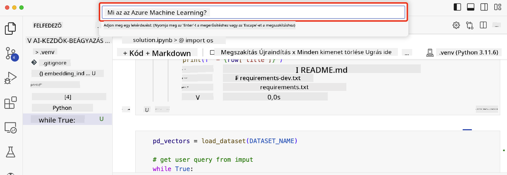

<!--
CO_OP_TRANSLATOR_METADATA:
{
  "original_hash": "58953c08b8ba7073b836d4270ea0fe86",
  "translation_date": "2025-10-17T21:23:35+00:00",
  "source_file": "08-building-search-applications/README.md",
  "language_code": "hu"
}
-->
# Keresési alkalmazások építése

[](https://youtu.be/W0-nzXjOjr0?si=GcsqiTTvd7RKbo7V)

> > _Kattints a fenti képre, hogy megnézd az óra videóját_

A nagy nyelvi modellek (LLM-ek) nem csak chatbotokról és szövegalkotásról szólnak. Lehetőség van keresési alkalmazások építésére is Embeddingek segítségével. Az Embeddingek a data numerikus reprezentációi, más néven vektorok, és használhatók szemantikus keresésre.

Ebben az órában egy keresési alkalmazást fogsz építeni oktatási startupunk számára. A startupunk egy non-profit szervezet, amely ingyenes oktatást biztosít diákoknak fejlődő országokban. A startupunknak rengeteg YouTube videója van, amelyeket a diákok az AI-ról való tanuláshoz használhatnak. A startupunk egy olyan keresési alkalmazást szeretne építeni, amely lehetővé teszi a diákok számára, hogy kérdés beírásával keressenek YouTube videókat.

Például egy diák beírhatja, hogy 'Mik azok a Jupyter Notebookok?' vagy 'Mi az az Azure ML?', és a keresési alkalmazás egy listát ad vissza a kérdéshez kapcsolódó YouTube videókról, sőt, még jobb, hogy a keresési alkalmazás visszaadja a videó azon részének linkjét, ahol a kérdésre adott válasz található.

## Bevezetés

Ebben az órában az alábbiakat fogjuk áttekinteni:

- Szemantikus vs kulcsszavas keresés.
- Mik azok a szöveg embeddingek.
- Szöveg embedding index létrehozása.
- Szöveg embedding index keresése.

## Tanulási célok

Az óra elvégzése után képes leszel:

- Megkülönböztetni a szemantikus és kulcsszavas keresést.
- Elmagyarázni, mik azok a szöveg embeddingek.
- Alkalmazást létrehozni Embeddingek segítségével adatok keresésére.

## Miért építsünk keresési alkalmazást?

Egy keresési alkalmazás létrehozása segít megérteni, hogyan lehet Embeddingek segítségével adatokat keresni. Emellett megtanulhatod, hogyan építs olyan keresési alkalmazást, amely segíti a diákokat az információ gyors megtalálásában.

Az óra tartalmazza a Microsoft [AI Show](https://www.youtube.com/playlist?list=PLlrxD0HtieHi0mwteKBOfEeOYf0LJU4O1) YouTube csatorna átiratainak Embedding indexét. Az AI Show egy YouTube csatorna, amely az AI-ról és a gépi tanulásról tanít. Az Embedding index tartalmazza az összes YouTube átirat Embeddingjeit 2023 októberéig. Az Embedding indexet fogod használni, hogy keresési alkalmazást építs a startupunk számára. A keresési alkalmazás visszaadja a videó azon részének linkjét, ahol a kérdésre adott válasz található. Ez nagyszerű módja annak, hogy a diákok gyorsan megtalálják a szükséges információt.

Az alábbi példa egy szemantikus keresésre a 'Használható-e az rstudio az Azure ML-lel?' kérdésre. Nézd meg a YouTube URL-t, látni fogod, hogy az URL tartalmaz egy időbélyeget, amely a videó azon részére visz, ahol a kérdésre adott válasz található.


## Mi az a szemantikus keresés?

Most talán azon gondolkodsz, hogy mi az a szemantikus keresés? A szemantikus keresés egy olyan keresési technika, amely a szavak jelentését használja a lekérdezésben, hogy releváns eredményeket adjon vissza.

Íme egy példa a szemantikus keresésre. Tegyük fel, hogy autót szeretnél vásárolni, és beírod a keresőbe, hogy 'álmaim autója'. A szemantikus keresés megérti, hogy nem az autókról álmodsz, hanem az ideális autódat keresed. A szemantikus keresés megérti a szándékodat, és releváns eredményeket ad vissza. Az alternatíva a 'kulcsszavas keresés', amely szó szerint az autókról szóló álmokat keresné, és gyakran irreleváns eredményeket adna vissza.

## Mik azok a szöveg embeddingek?

[Szöveg embeddingek](https://en.wikipedia.org/wiki/Word_embedding?WT.mc_id=academic-105485-koreyst) egy szöveg reprezentációs technika, amelyet a [természetes nyelvfeldolgozásban](https://en.wikipedia.org/wiki/Natural_language_processing?WT.mc_id=academic-105485-koreyst) használnak. A szöveg embeddingek a szöveg szemantikus numerikus reprezentációi. Az embeddingek arra szolgálnak, hogy az adatokat olyan módon reprezentálják, amelyet a gép könnyen megért. Számos modell létezik a szöveg embeddingek létrehozására, ebben az órában az OpenAI Embedding Model segítségével történő embeddingek generálására fogunk összpontosítani.

Íme egy példa: képzeld el, hogy az alábbi szöveg az AI Show YouTube csatorna egyik epizódjának átiratában szerepel:

```text
Today we are going to learn about Azure Machine Learning.
```

A szöveget átadnánk az OpenAI Embedding API-nak, és az API visszaadná a következő embeddinget, amely 1536 számot tartalmaz, más néven vektort. A vektor minden egyes száma a szöveg egy-egy aspektusát képviseli. Rövidség kedvéért itt van a vektor első 10 száma.

```python
[-0.006655829958617687, 0.0026128944009542465, 0.008792596869170666, -0.02446001023054123, -0.008540431968867779, 0.022071078419685364, -0.010703742504119873, 0.003311325330287218, -0.011632772162556648, -0.02187200076878071, ...]
```

## Hogyan készül az Embedding index?

Az óra Embedding indexét Python szkriptek sorozatával hozták létre. A szkripteket és az utasításokat megtalálod a [README](./scripts/README.md?WT.mc_id=academic-105485-koreyst) fájlban az óra 'scripts' mappájában. Nem szükséges futtatnod ezeket a szkripteket az óra elvégzéséhez, mivel az Embedding index biztosítva van számodra.

A szkriptek a következő műveleteket hajtják végre:

1. Letöltik az [AI Show](https://www.youtube.com/playlist?list=PLlrxD0HtieHi0mwteKBOfEeOYf0LJU4O1) lejátszási lista minden YouTube videójának átiratát.
2. Az [OpenAI Functions](https://learn.microsoft.com/azure/ai-services/openai/how-to/function-calling?WT.mc_id=academic-105485-koreyst) segítségével megpróbálják kinyerni a beszélő nevét az átirat első 3 percéből. A beszélő neve minden videóhoz az `embedding_index_3m.json` nevű Embedding indexben kerül tárolásra.
3. Az átirat szövegét **3 perces szövegszegmensekre** bontják. A szegmens körülbelül 20 szó átfedést tartalmaz a következő szegmensből, hogy biztosítsák, hogy a szegmens embeddingje ne legyen levágva, és jobb keresési kontextust nyújtson.
4. Minden szövegszegmenst átadnak az OpenAI Chat API-nak, hogy a szöveget 60 szavas összefoglalóvá tömörítse. Az összefoglaló szintén az `embedding_index_3m.json` Embedding indexben kerül tárolásra.
5. Végül a szegmens szövegét átadják az OpenAI Embedding API-nak. Az Embedding API visszaad egy 1536 számot tartalmazó vektort, amely a szegmens szemantikus jelentését képviseli. A szegmens az OpenAI Embedding vektorral együtt az `embedding_index_3m.json` Embedding indexben kerül tárolásra.

### Vektor adatbázisok

Az óra egyszerűsége érdekében az Embedding index egy `embedding_index_3m.json` nevű JSON fájlban van tárolva, és Pandas DataFrame-be van betöltve. Azonban a gyakorlatban az Embedding indexet egy vektor adatbázisban tárolnák, mint például [Azure Cognitive Search](https://learn.microsoft.com/training/modules/improve-search-results-vector-search?WT.mc_id=academic-105485-koreyst), [Redis](https://cookbook.openai.com/examples/vector_databases/redis/readme?WT.mc_id=academic-105485-koreyst), [Pinecone](https://cookbook.openai.com/examples/vector_databases/pinecone/readme?WT.mc_id=academic-105485-koreyst), [Weaviate](https://cookbook.openai.com/examples/vector_databases/weaviate/readme?WT.mc_id=academic-105485-koreyst), hogy csak néhányat említsünk.

## A koszinusz hasonlóság megértése

Megtanultuk, mik azok a szöveg embeddingek, a következő lépés az, hogy megtanuljuk, hogyan használjuk a szöveg embeddingeket adatok keresésére, különösen a leginkább hasonló embeddingek megtalálására egy adott lekérdezéshez koszinusz hasonlóság segítségével.

### Mi az a koszinusz hasonlóság?

A koszinusz hasonlóság két vektor közötti hasonlóság mértéke, amelyet gyakran `legközelebbi szomszéd keresésnek` is neveznek. A koszinusz hasonlóság kereséshez először _vektorizálni_ kell a _lekérdezés_ szövegét az OpenAI Embedding API segítségével. Ezután ki kell számítani a _koszinusz hasonlóságot_ a lekérdezés vektora és az Embedding index minden vektora között. Ne feledd, az Embedding index minden YouTube átirat szövegszegmenséhez tartalmaz egy vektort. Végül az eredményeket koszinusz hasonlóság szerint kell rendezni, és a legmagasabb koszinusz hasonlóságú szövegszegmensek a leginkább hasonlóak a lekérdezéshez.

Matematikai szempontból a koszinusz hasonlóság a két vektor közötti szög koszinuszát méri, amelyeket egy többdimenziós térben vetítenek ki. Ez a mérés előnyös, mert ha két dokumentum távol van egymástól euklideszi távolságban a méretük miatt, akkor még mindig lehet kisebb szög közöttük, és így magasabb koszinusz hasonlóságuk. További információért a koszinusz hasonlóság egyenleteiről, lásd [Koszinusz hasonlóság](https://en.wikipedia.org/wiki/Cosine_similarity?WT.mc_id=academic-105485-koreyst).

## Az első keresési alkalmazásod építése

Most megtanuljuk, hogyan építsünk keresési alkalmazást Embeddingek segítségével. A keresési alkalmazás lehetővé teszi a diákok számára, hogy kérdés beírásával keressenek videót. A keresési alkalmazás visszaad egy listát a kérdéshez kapcsolódó videókról. A keresési alkalmazás visszaadja a videó azon részének linkjét is, ahol a kérdésre adott válasz található.

Ezt a megoldást Windows 11, macOS és Ubuntu 22.04 rendszeren tesztelték Python 3.10 vagy újabb verzióval. A Python letölthető a [python.org](https://www.python.org/downloads/?WT.mc_id=academic-105485-koreyst) weboldalról.

## Feladat - keresési alkalmazás építése, hogy segítse a diákokat

Az óra elején bemutattuk a startupunkat. Most itt az ideje, hogy a diákok számára lehetőséget adjunk egy keresési alkalmazás építésére a feladataikhoz.

Ebben a feladatban létrehozod az Azure OpenAI szolgáltatásokat, amelyeket a keresési alkalmazás építéséhez fogsz használni. Az alábbi Azure OpenAI szolgáltatásokat fogod létrehozni. Az Azure előfizetés szükséges a feladat elvégzéséhez.

### Indítsd el az Azure Cloud Shell-t

1. Jelentkezz be az [Azure portálra](https://portal.azure.com/?WT.mc_id=academic-105485-koreyst).
2. Válaszd ki a Cloud Shell ikont az Azure portál jobb felső sarkában.
3. Válaszd a **Bash** környezet típust.

#### Hozz létre egy erőforráscsoportot

> Ezekhez az utasításokhoz az "semantic-video-search" nevű erőforráscsoportot használjuk Kelet-USA-ban.
> Megváltoztathatod az erőforráscsoport nevét, de ha megváltoztatod az erőforrások helyét,
> ellenőrizd a [modell elérhetőségi táblázatot](https://aka.ms/oai/models?WT.mc_id=academic-105485-koreyst).

```shell
az group create --name semantic-video-search --location eastus
```

#### Hozz létre egy Azure OpenAI Service erőforrást

Az Azure Cloud Shell-ből futtasd az alábbi parancsot, hogy létrehozz egy Azure OpenAI Service erőforrást.

```shell
az cognitiveservices account create --name semantic-video-openai --resource-group semantic-video-search \
    --location eastus --kind OpenAI --sku s0
```

#### Szerezd meg az alkalmazás használatához szükséges végpontot és kulcsokat

Az Azure Cloud Shell-ből futtasd az alábbi parancsokat, hogy megszerezd az Azure OpenAI Service erőforrás végpontját és kulcsait.

```shell
az cognitiveservices account show --name semantic-video-openai \
   --resource-group  semantic-video-search | jq -r .properties.endpoint
az cognitiveservices account keys list --name semantic-video-openai \
   --resource-group semantic-video-search | jq -r .key1
```

#### Telepítsd az OpenAI Embedding modellt

Az Azure Cloud Shell-ből futtasd az alábbi parancsot, hogy telepítsd az OpenAI Embedding modellt.

```shell
az cognitiveservices account deployment create \
    --name semantic-video-openai \
    --resource-group  semantic-video-search \
    --deployment-name text-embedding-ada-002 \
    --model-name text-embedding-ada-002 \
    --model-version "2"  \
    --model-format OpenAI \
    --sku-capacity 100 --sku-name "Standard"
```

## Megoldás

Nyisd meg a [megoldási notebookot](./python/aoai-solution.ipynb?WT.mc_id=academic-105485-koreyst) a GitHub Codespaces-ben, és kövesd a Jupyter Notebook utasításait.

Amikor futtatod a notebookot, megjelenik egy mező, ahová beírhatod a lekérdezést. Az input mező így néz ki:



## Szép munka! Folytasd a tanulást

Az óra elvégzése után nézd meg a [Generatív AI tanulási gyűjteményünket](https://aka.ms/genai-collection?WT.mc_id=academic-105485-koreyst), hogy tovább fejleszd a generatív AI tudásodat!

Lépj tovább a 9. órára, ahol azt fogjuk megvizsgálni, hogyan lehet [képgeneráló alkalmazásokat építeni](../09-building-image-applications/README.md?WT.mc_id=academic-105485-koreyst)!

---

**Felelősségi nyilatkozat**:  
Ez a dokumentum az [Co-op Translator](https://github.com/Azure/co-op-translator) AI fordítási szolgáltatás segítségével lett lefordítva. Bár törekszünk a pontosságra, kérjük, vegye figyelembe, hogy az automatikus fordítások hibákat vagy pontatlanságokat tartalmazhatnak. Az eredeti dokumentum az eredeti nyelvén tekintendő hiteles forrásnak. Kritikus információk esetén javasolt professzionális emberi fordítást igénybe venni. Nem vállalunk felelősséget az ebből a fordításból eredő félreértésekért vagy téves értelmezésekért.