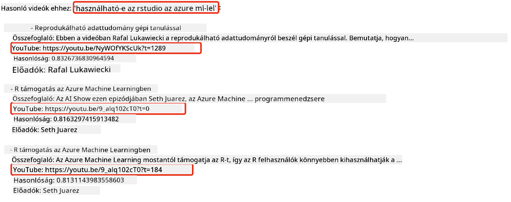

<!--
CO_OP_TRANSLATOR_METADATA:
{
  "original_hash": "d46aad0917a1a342d613e2c13d457da5",
  "translation_date": "2025-07-09T13:00:43+00:00",
  "source_file": "08-building-search-applications/README.md",
  "language_code": "hu"
}
-->
# Keresőalkalmazások építése

[](https://aka.ms/gen-ai-lesson8-gh?WT.mc_id=academic-105485-koreyst)

> > _Kattints a fenti képre a lecke videójának megtekintéséhez_

A nagy nyelvi modellek (LLM-ek) nem csak chatbotok és szöveggenerálás céljára használhatók. Beágyazások (Embeddings) segítségével keresőalkalmazásokat is építhetünk. A beágyazások numerikus adatábrázolások, más néven vektorok, amelyeket szemantikus keresésre használhatunk.

Ebben a leckében egy keresőalkalmazást fogsz építeni az oktatási startupunk számára. A startupunk egy nonprofit szervezet, amely ingyenes oktatást biztosít fejlődő országok diákjai számára. Nagyszámú YouTube videónk van, amelyeket a diákok az MI tanulásához használhatnak. A startup szeretne egy keresőalkalmazást készíteni, amely lehetővé teszi a diákok számára, hogy kérdés beírásával keressenek YouTube videókat.

Például egy diák beírhatja, hogy „Mik azok a Jupyter Notebookok?” vagy „Mi az az Azure ML?”, és a keresőalkalmazás releváns YouTube videók listáját adja vissza, sőt, még azt a videórészletet is megmutatja, ahol a kérdésre adott válasz található.

## Bevezetés

Ebben a leckében a következőkről lesz szó:

- Szemantikus és kulcsszavas keresés közötti különbség.
- Mi az a szövegbeágyazás (Text Embeddings).
- Szövegbeágyazás index létrehozása.
- Szövegbeágyazás index keresése.

## Tanulási célok

A lecke elvégzése után képes leszel:

- Megkülönböztetni a szemantikus és kulcsszavas keresést.
- Elmagyarázni, mi az a szövegbeágyazás.
- Olyan alkalmazást készíteni, amely beágyazások segítségével keres adatokat.

## Miért érdemes keresőalkalmazást építeni?

Egy keresőalkalmazás elkészítése segít megérteni, hogyan használhatók a beágyazások az adatok keresésére. Emellett megtanulod, hogyan építs olyan keresőalkalmazást, amely gyorsan segíti a diákokat az információ megtalálásában.

A lecke tartalmaz egy beágyazás indexet a Microsoft [AI Show](https://www.youtube.com/playlist?list=PLlrxD0HtieHi0mwteKBOfEeOYf0LJU4O1) YouTube csatorna átirataiból. Az AI Show egy olyan YouTube csatorna, amely az MI-ről és gépi tanulásról tanít. Az index tartalmazza az összes átirat beágyazását 2023 októberéig. Ezt az indexet fogod használni a keresőalkalmazás építéséhez. Az alkalmazás visszaad egy linket a videó azon részéhez, ahol a kérdésre adott válasz található. Ez nagyszerű módja annak, hogy a diákok gyorsan megtalálják a szükséges információt.

Az alábbi példa egy szemantikus lekérdezés a „can you use rstudio with azure ml?” kérdésre. Nézd meg a YouTube URL-t, amely tartalmaz egy időbélyeget, ami a videó azon részére visz, ahol a válasz található.



## Mi az a szemantikus keresés?

Most talán azon tűnődsz, mi is az a szemantikus keresés? A szemantikus keresés egy olyan keresési technika, amely a lekérdezés szavainak jelentését használja a releváns találatok visszaadásához.

Íme egy példa a szemantikus keresésre. Tegyük fel, hogy autót szeretnél venni, és beírod, hogy „az álomautóm”. A szemantikus keresés megérti, hogy nem az autókról álmodozol, hanem a „tökéletes” autót keresed. A szemantikus keresés megérti a szándékodat, és releváns találatokat ad. Ezzel szemben a kulcsszavas keresés szó szerint az „álom” és „autó” szavakat keresi, ami gyakran irreleváns találatokat eredményez.

## Mik azok a szövegbeágyazások?

A [szövegbeágyazások](https://en.wikipedia.org/wiki/Word_embedding?WT.mc_id=academic-105485-koreyst) egy szövegábrázolási technika a [természetes nyelvfeldolgozásban](https://en.wikipedia.org/wiki/Natural_language_processing?WT.mc_id=academic-105485-koreyst). A szövegbeágyazások szemantikus, numerikus ábrázolásai a szövegnek. Ezek segítségével az adatokat olyan formában lehet megjeleníteni, amelyet a gép könnyen értelmez. Számos modell létezik szövegbeágyazások létrehozására, ebben a leckében az OpenAI Embedding Model használatára fókuszálunk.

Például képzeld el, hogy a következő szöveg egy AI Show epizód átiratából származik:

```text
Today we are going to learn about Azure Machine Learning.
```

A szöveget átadjuk az OpenAI Embedding API-nak, amely visszaad egy 1536 számból álló beágyazást, azaz egy vektort. A vektor minden egyes száma a szöveg egy-egy aspektusát reprezentálja. Rövidség kedvéért itt az első 10 szám a vektorban.

```python
[-0.006655829958617687, 0.0026128944009542465, 0.008792596869170666, -0.02446001023054123, -0.008540431968867779, 0.022071078419685364, -0.010703742504119873, 0.003311325330287218, -0.011632772162556648, -0.02187200076878071, ...]
```

## Hogyan jön létre a beágyazás index?

A lecke beágyazás indexét egy sor Python szkript segítségével hozták létre. A szkripteket és az utasításokat megtalálod a [README](./scripts/README.md?WT.mc_id=academic-105485-koreyst) fájlban, a lecke `scripts` mappájában. Ezeket a szkripteket nem kell lefuttatnod a lecke elvégzéséhez, mert az index már rendelkezésre áll.

A szkriptek a következő műveleteket végzik el:

1. Letöltik az összes YouTube videó átiratát az [AI Show](https://www.youtube.com/playlist?list=PLlrxD0HtieHi0mwteKBOfEeOYf0LJU4O1) lejátszási listából.
2. Az [OpenAI Functions](https://learn.microsoft.com/azure/ai-services/openai/how-to/function-calling?WT.mc_id=academic-105485-koreyst) segítségével megpróbálják kinyerni az előadó nevét az átirat első 3 percéből. Az előadó neveket az `embedding_index_3m.json` nevű beágyazás indexben tárolják.
3. Az átiratot **3 perces szövegszegmensekre** bontják. A szegmensek között kb. 20 szó átfedés van, hogy a beágyazás ne legyen megszakítva, és jobb keresési kontextust biztosítson.
4. Minden szegmenst az OpenAI Chat API-nak adnak át, amely 60 szavas összefoglalót készít. Az összefoglaló szintén az `embedding_index_3m.json` indexben tárolódik.
5. Végül a szegmens szövegét átadják az OpenAI Embedding API-nak, amely egy 1536 számból álló vektort ad vissza, ami a szegmens szemantikus jelentését reprezentálja. A szegmens és a vektor együtt kerül az `embedding_index_3m.json` indexbe.

### Vektoradatbázisok

A lecke egyszerűsége miatt az index egy JSON fájlban (`embedding_index_3m.json`) van tárolva, és Pandas DataFrame-be töltve. Azonban éles környezetben az indexet vektoradatbázisban tárolnánk, például az [Azure Cognitive Search](https://learn.microsoft.com/training/modules/improve-search-results-vector-search?WT.mc_id=academic-105485-koreyst), [Redis](https://cookbook.openai.com/examples/vector_databases/redis/readme?WT.mc_id=academic-105485-koreyst), [Pinecone](https://cookbook.openai.com/examples/vector_databases/pinecone/readme?WT.mc_id=academic-105485-koreyst), vagy [Weaviate](https://cookbook.openai.com/examples/vector_databases/weaviate/readme?WT.mc_id=academic-105485-koreyst) használatával, hogy csak néhányat említsünk.

## A koszinusz hasonlóság megértése

Megismertük a szövegbeágyazásokat, a következő lépés, hogy megtanuljuk, hogyan használjuk őket adatkeresésre, különösen, hogyan találjuk meg a lekérdezéshez leginkább hasonló beágyazásokat koszinusz hasonlóság segítségével.

### Mi az a koszinusz hasonlóság?

A koszinusz hasonlóság két vektor közötti hasonlóság mértéke, más néven `legközelebbi szomszéd keresés`. A koszinusz hasonlóság kereséshez először a lekérdezést vektorrá kell alakítani az OpenAI Embedding API segítségével. Ezután kiszámoljuk a lekérdezés vektora és az indexben lévő minden vektor közötti koszinusz hasonlóságot. Ne feledd, az index minden YouTube átirat szövegszegmenséhez tartalmaz egy vektort. Végül a találatokat koszinusz hasonlóság szerint rendezzük, és a legmagasabb értékű szegmensek a leginkább hasonlóak a lekérdezéshez.

Matematikailag a koszinusz hasonlóság a két vektor által bezárt szög koszinuszát méri egy többdimenziós térben. Ez azért hasznos, mert ha két dokumentum távol van egymástól euklideszi távolságban a méretük miatt, mégis lehet kisebb szög közöttük, így magasabb koszinusz hasonlóságuk. További információkért lásd a [Koszinusz hasonlóság](https://en.wikipedia.org/wiki/Cosine_similarity?WT.mc_id=academic-105485-koreyst) oldalt.

## Első keresőalkalmazásod építése

Most megtanuljuk, hogyan építsünk keresőalkalmazást beágyazások segítségével. Az alkalmazás lehetővé teszi, hogy a diákok kérdés beírásával keressenek videókat. Az alkalmazás releváns videók listáját adja vissza, és megmutatja a videó azon részét, ahol a kérdésre adott válasz található.

A megoldást Windows 11, macOS és Ubuntu 22.04 rendszereken teszteltük Python 3.10 vagy újabb verzióval. A Python letölthető a [python.org](https://www.python.org/downloads/?WT.mc_id=academic-105485-koreyst) oldalról.

## Feladat – keresőalkalmazás építése a diákok számára

A lecke elején bemutattuk a startupunkat. Most itt az ideje, hogy a diákok számára lehetőséget adjunk egy keresőalkalmazás elkészítésére a feladataikhoz.

Ebben a feladatban létrehozod az Azure OpenAI szolgáltatásokat, amelyeket a keresőalkalmazás építéséhez használsz. A következő Azure OpenAI szolgáltatásokat kell létrehoznod. Ehhez szükséged lesz egy Azure előfizetésre.

### Indítsd el az Azure Cloud Shellt

1. Jelentkezz be az [Azure portálba](https://portal.azure.com/?WT.mc_id=academic-105485-koreyst).
2. Kattints a Cloud Shell ikonra az Azure portál jobb felső sarkában.
3. Válaszd a **Bash** környezetet.

#### Erőforráscsoport létrehozása

> Ezekhez az utasításokhoz az „semantic-video-search” nevű erőforráscsoportot használjuk az East US régióban.
> Az erőforráscsoport nevét megváltoztathatod, de ha a régiót módosítod,
> ellenőrizd a [modell elérhetőségi táblázatot](https://aka.ms/oai/models?WT.mc_id=academic-105485-koreyst).

```shell
az group create --name semantic-video-search --location eastus
```

#### Azure OpenAI szolgáltatás létrehozása

Az Azure Cloud Shellből futtasd a következő parancsot az Azure OpenAI szolgáltatás létrehozásához.

```shell
az cognitiveservices account create --name semantic-video-openai --resource-group semantic-video-search \
    --location eastus --kind OpenAI --sku s0
```

#### Az endpoint és kulcsok lekérése az alkalmazáshoz

Az Azure Cloud Shellből futtasd a következő parancsokat az Azure OpenAI szolgáltatás endpointjának és kulcsainak lekéréséhez.

```shell
az cognitiveservices account show --name semantic-video-openai \
   --resource-group  semantic-video-search | jq -r .properties.endpoint
az cognitiveservices account keys list --name semantic-video-openai \
   --resource-group semantic-video-search | jq -r .key1
```

#### OpenAI Embedding modell telepítése

Az Azure Cloud Shellből futtasd a következő parancsot az OpenAI Embedding modell telepítéséhez.

```shell
az cognitiveservices account deployment create \
    --name semantic-video-openai \
    --resource-group  semantic-video-search \
    --deployment-name text-embedding-ada-002 \
    --model-name text-embedding-ada-002 \
    --model-version "2"  \
    --model-format OpenAI \
    --sku-capacity 100 --sku-name "Standard"
```

## Megoldás

Nyisd meg a [megoldás jegyzetfüzetet](python/aoai-solution.ipynb) a GitHub Codespaces-ben, és kövesd a Jupyter Notebook utasításait.

A jegyzetfüzet futtatásakor megkérdezi a lekérdezést. A beviteli mező így fog kinézni:


## Szép munka! Folytasd a tanulást

A lecke elvégzése után nézd meg a [Generatív MI tanulási gyűjteményünket](https://aka.ms/genai-collection?WT.mc_id=academic-105485-koreyst), hogy tovább fejleszd a generatív MI ismereteidet!

Lépj tovább a 9. leckére, ahol megnézzük, hogyan lehet [képgeneráló alkalmazásokat építeni](../09-building-image-applications/README.md?WT.mc_id=academic-105485-koreyst)!

**Jogi nyilatkozat**:  
Ez a dokumentum az AI fordító szolgáltatás, a [Co-op Translator](https://github.com/Azure/co-op-translator) segítségével készült. Bár a pontosságra törekszünk, kérjük, vegye figyelembe, hogy az automatikus fordítások hibákat vagy pontatlanságokat tartalmazhatnak. Az eredeti dokumentum az anyanyelvén tekintendő hiteles forrásnak. Fontos információk esetén szakmai, emberi fordítást javaslunk. Nem vállalunk felelősséget a fordítás használatából eredő félreértésekért vagy téves értelmezésekért.