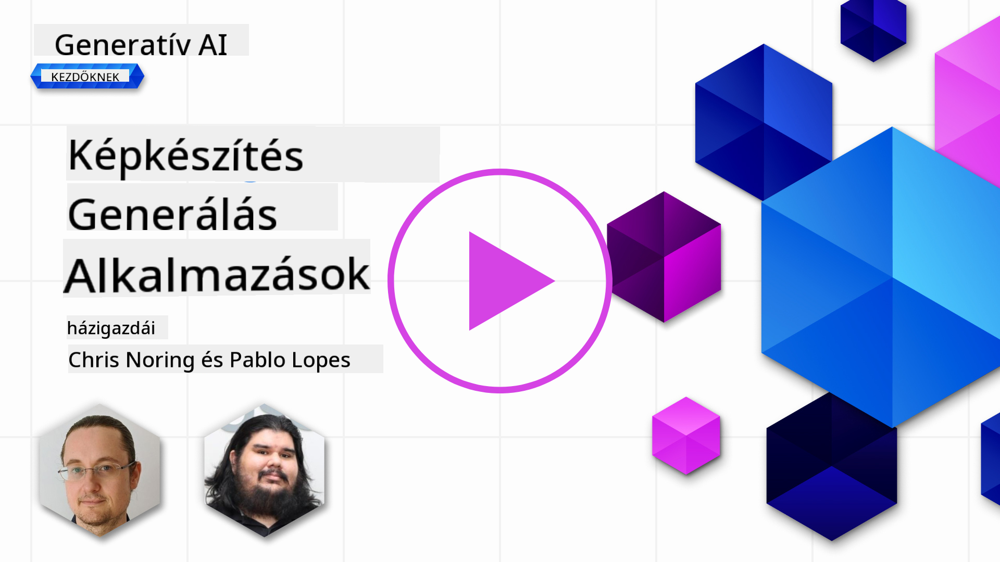
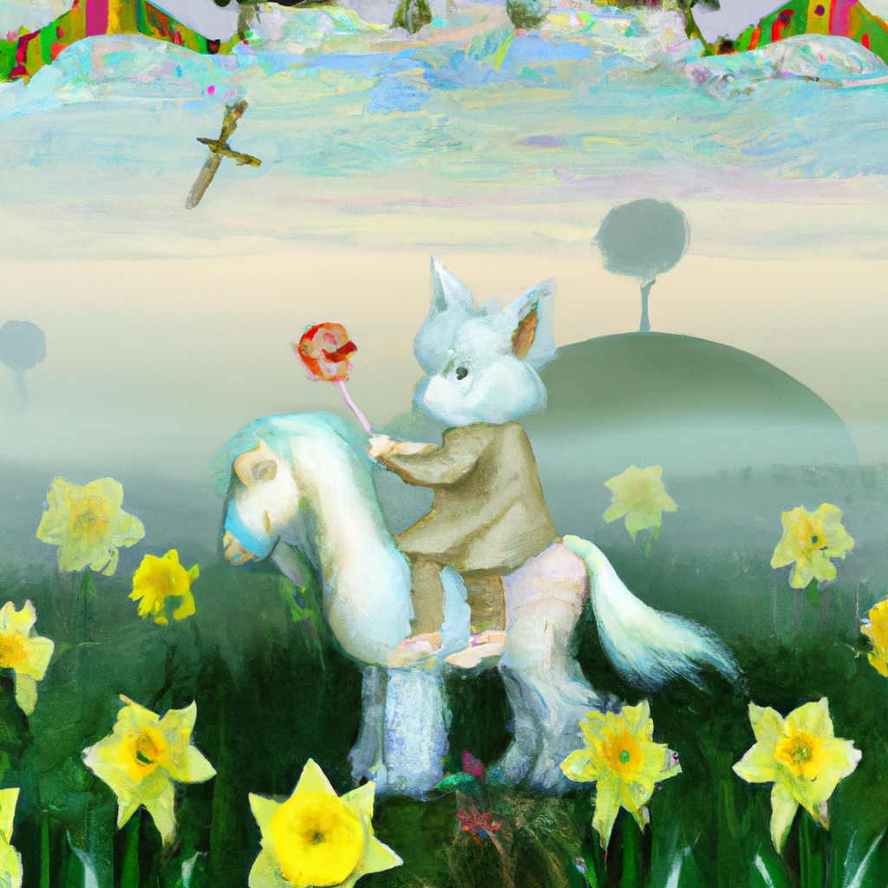

<!--
CO_OP_TRANSLATOR_METADATA:
{
  "original_hash": "ef74ad58fc01f7ad80788f79505f9816",
  "translation_date": "2025-08-26T18:54:24+00:00",
  "source_file": "09-building-image-applications/README.md",
  "language_code": "hu"
}
-->
# Képgeneráló alkalmazások készítése

[](https://aka.ms/gen-ai-lesson9-gh?WT.mc_id=academic-105485-koreyst)

Az LLM-ek nem csak szöveggenerálásra alkalmasak. Lehetőség van képek generálására is szöveges leírások alapján. A képek, mint modalitás, számos területen rendkívül hasznosak lehetnek, például az egészségügyben, építészetben, turizmusban, játékfejlesztésben és még sok másban. Ebben a fejezetben a két legnépszerűbb képgeneráló modellt, a DALL-E-t és a Midjourney-t fogjuk megvizsgálni.

## Bevezetés

Ebben a leckében szó lesz az alábbiakról:

- Képgenerálás és annak hasznossága.
- DALL-E és Midjourney: mik ezek, és hogyan működnek.
- Hogyan építhetsz képgeneráló alkalmazást.

## Tanulási célok

A lecke elvégzése után képes leszel:

- Képgeneráló alkalmazást készíteni.
- Meghatározni az alkalmazásod határait metapromptokkal.
- Dolgozni a DALL-E és a Midjourney modellekkel.

## Miért érdemes képgeneráló alkalmazást készíteni?

A képgeneráló alkalmazások remek lehetőséget adnak a Generatív MI képességeinek felfedezésére. Például az alábbiakra használhatók:

- **Képszerkesztés és szintézis**. Különféle felhasználási esetekhez generálhatsz képeket, például képszerkesztéshez vagy képszintézishez.

- **Számos iparágban alkalmazható**. Képek generálására használhatók különböző iparágakban, mint például egészségügy, turizmus, játékfejlesztés és még sok más.

## Példa: Edu4All

Ebben a leckében továbbra is az Edu4All nevű startupunkkal dolgozunk. A diákok képeket készítenek a feladataikhoz – hogy pontosan milyen képeket, az a diákokra van bízva, lehet például saját meséjükhöz illusztráció, új karakter megalkotása a történetükhöz, vagy ötleteik, elképzeléseik vizualizálása.

Például, ha az Edu4All diákjai az órán műemlékekkel foglalkoznak, ilyen képet generálhatnak:


egy ilyen prompttal:

> „Kutya az Eiffel-torony mellett, kora reggeli napfényben”

## Mi az a DALL-E és a Midjourney?

A [DALL-E](https://openai.com/dall-e-2?WT.mc_id=academic-105485-koreyst) és a [Midjourney](https://www.midjourney.com/?WT.mc_id=academic-105485-koreyst) a két legnépszerűbb képgeneráló modell, amelyek lehetővé teszik, hogy promptok segítségével képeket hozzunk létre.

### DALL-E

Kezdjük a DALL-E-vel, amely egy generatív MI modell, amely szöveges leírásokból képeket generál.

> [A DALL-E két modell, a CLIP és a diffused attention kombinációja](https://towardsdatascience.com/openais-dall-e-and-clip-101-a-brief-introduction-3a4367280d4e?WT.mc_id=academic-105485-koreyst).

- **CLIP**: Ez a modell beágyazásokat (embeddingeket) generál, vagyis numerikus adat-reprezentációkat képekből és szövegekből.

- **Diffused attention**: Ez a modell a beágyazásokból képeket generál. A DALL-E-t képekből és szövegekből álló adathalmazon tanították, így képes szöveges leírásokból képeket készíteni. Például generálhatunk vele egy kalapos macskát vagy egy punk frizurás kutyát.

### Midjourney

A Midjourney hasonlóan működik, mint a DALL-E: szöveges promptokból generál képeket. A Midjourney-vel is lehet például „kalapos macskát” vagy „punk frizurás kutyát” készíteni.


_Kép forrása: Wikipedia, a képet a Midjourney generálta_

## Hogyan működik a DALL-E és a Midjourney

Először is, [DALL-E](https://arxiv.org/pdf/2102.12092.pdf?WT.mc_id=academic-105485-koreyst). A DALL-E egy generatív MI modell, amely a transformer architektúrán alapul, _autoregresszív transformerrel_.

Az _autoregresszív transformer_ meghatározza, hogyan generál a modell képeket szöveges leírásokból: egyszerre egy pixelt hoz létre, majd a már elkészült pixeleket felhasználva generálja a következőt. Ez a folyamat többször végigmegy a neurális hálózat rétegein, amíg a kép el nem készül.

Ezzel a folyamattal a DALL-E képes szabályozni a generált képen megjelenő attribútumokat, tárgyakat, jellemzőket és egyebeket. A DALL-E 2 és 3 verziók még nagyobb kontrollt adnak a generált kép felett.

## Az első képgeneráló alkalmazásod elkészítése

Mit kell tenned, hogy képgeneráló alkalmazást készíts? Az alábbi könyvtárakra lesz szükséged:

- **python-dotenv**: Erősen ajánlott ezt használni, hogy a titkos adataidat a _.env_ fájlban tartsd, távol a kódtól.
- **openai**: Ezzel a könyvtárral tudsz kommunikálni az OpenAI API-val.
- **pillow**: Képek kezeléséhez Pythonban.
- **requests**: HTTP kérések küldéséhez.

## Azure OpenAI modell létrehozása és telepítése

Ha még nem tetted meg, kövesd a [Microsoft Learn](https://learn.microsoft.com/azure/ai-foundry/openai/how-to/create-resource?pivots=web-portal) oldalon található útmutatót,
hogy létrehozz egy Azure OpenAI erőforrást és modellt. Válaszd a DALL-E 3 modellt.  

## Az alkalmazás elkészítése

1. Hozz létre egy _.env_ fájlt a következő tartalommal:

   ```text
   AZURE_OPENAI_ENDPOINT=<your endpoint>
   AZURE_OPENAI_API_KEY=<your key>
   AZURE_OPENAI_DEPLOYMENT="dall-e-3"
   ```

   Ezt az információt az Azure OpenAI Foundry Portálon, az erőforrásod "Deployments" szekciójában találod.

1. Gyűjtsd össze a fenti könyvtárakat egy _requirements.txt_ nevű fájlba, így:

   ```text
   python-dotenv
   openai
   pillow
   requests
   ```

1. Ezután hozz létre egy virtuális környezetet, és telepítsd a könyvtárakat:

   ```bash
   python3 -m venv venv
   source venv/bin/activate
   pip install -r requirements.txt
   ```

   Windows esetén az alábbi parancsokat használd a virtuális környezet létrehozásához és aktiválásához:

   ```bash
   python3 -m venv venv
   venv\Scripts\activate.bat
   ```

1. Add hozzá a következő kódot egy _app.py_ nevű fájlba:

    ```python
    import openai
    import os
    import requests
    from PIL import Image
    import dotenv
    from openai import OpenAI, AzureOpenAI
    
    # import dotenv
    dotenv.load_dotenv()
    
    # configure Azure OpenAI service client 
    client = AzureOpenAI(
      azure_endpoint = os.environ["AZURE_OPENAI_ENDPOINT"],
      api_key=os.environ['AZURE_OPENAI_API_KEY'],
      api_version = "2024-02-01"
      )
    try:
        # Create an image by using the image generation API
        generation_response = client.images.generate(
                                prompt='Bunny on horse, holding a lollipop, on a foggy meadow where it grows daffodils',
                                size='1024x1024', n=1,
                                model=os.environ['AZURE_OPENAI_DEPLOYMENT']
                              )

        # Set the directory for the stored image
        image_dir = os.path.join(os.curdir, 'images')

        # If the directory doesn't exist, create it
        if not os.path.isdir(image_dir):
            os.mkdir(image_dir)

        # Initialize the image path (note the filetype should be png)
        image_path = os.path.join(image_dir, 'generated-image.png')

        # Retrieve the generated image
        image_url = generation_response.data[0].url  # extract image URL from response
        generated_image = requests.get(image_url).content  # download the image
        with open(image_path, "wb") as image_file:
            image_file.write(generated_image)

        # Display the image in the default image viewer
        image = Image.open(image_path)
        image.show()

    # catch exceptions
    except openai.InvalidRequestError as err:
        print(err)
   ```

Nézzük meg, mit csinál ez a kód:

- Először importáljuk a szükséges könyvtárakat, köztük az OpenAI, a dotenv, a requests és a Pillow könyvtárakat.

  ```python
  import openai
  import os
  import requests
  from PIL import Image
  import dotenv
  ```

- Ezután betöltjük a környezeti változókat a _.env_ fájlból.

  ```python
  # import dotenv
  dotenv.load_dotenv()
  ```

- Utána konfiguráljuk az Azure OpenAI szolgáltatás kliensét.

  ```python
  # Get endpoint and key from environment variables
  client = AzureOpenAI(
      azure_endpoint = os.environ["AZURE_OPENAI_ENDPOINT"],
      api_key=os.environ['AZURE_OPENAI_API_KEY'],
      api_version = "2024-02-01"
      )
  ```

- Ezután generáljuk a képet:

  ```python
  # Create an image by using the image generation API
  generation_response = client.images.generate(
                        prompt='Bunny on horse, holding a lollipop, on a foggy meadow where it grows daffodils',
                        size='1024x1024', n=1,
                        model=os.environ['AZURE_OPENAI_DEPLOYMENT']
                      )
  ```

  A fenti kód egy JSON objektummal válaszol, amely tartalmazza a generált kép URL-jét. Ezt az URL-t felhasználhatjuk a kép letöltésére és fájlba mentésére.

- Végül megnyitjuk a képet, és a szokásos képnézegetővel megjelenítjük:

  ```python
  image = Image.open(image_path)
  image.show()
  ```

### Részletesebben a kép generálásáról

Nézzük meg részletesebben a képgeneráló kódot:

    ```python
      generation_response = client.images.generate(
                                prompt='Bunny on horse, holding a lollipop, on a foggy meadow where it grows daffodils',
                                size='1024x1024', n=1,
                                model=os.environ['AZURE_OPENAI_DEPLOYMENT']
                            )
    ```

- **prompt**: Ez az a szöveges prompt, amely alapján a kép készül. Ebben a példában a prompt: „Nyuszi lovon, nyalókát tart, ködös réten, ahol nárciszok nőnek”.
- **size**: A generált kép mérete. Ebben az esetben 1024x1024 pixeles képet készítünk.
- **n**: A generált képek száma. Itt két képet generálunk.
- **temperature**: Ez a paraméter szabályozza a generatív MI modell kimenetének véletlenszerűségét. Az értéke 0 és 1 között lehet, ahol 0 determinisztikus, 1 pedig teljesen véletlenszerű kimenetet jelent. Az alapértelmezett érték 0,7.

A képekkel még sok mindent lehet csinálni, ezekről a következő részben lesz szó.

## A képgenerálás további lehetőségei

Láthattad, hogy néhány sornyi Python kóddal képet tudtunk generálni. Azonban a képekkel még több mindent is lehet csinálni.

Például az alábbiakat:

- **Szerkesztés**. Ha megadsz egy meglévő képet, egy maszkot és egy promptot, módosíthatod a képet. Például hozzáadhatsz valamit a kép egy részéhez. Képzeld el a nyuszis képet: rátehetsz egy kalapot a nyuszira. Ehhez meg kell adnod a képet, egy maszkot (amely kijelöli a módosítandó területet), és egy szöveges promptot, amely leírja, mit szeretnél. 
> Megjegyzés: ez a funkció a DALL-E 3-ban nem támogatott.
 
Íme egy példa a GPT Image használatával:

    ```python
    response = client.images.edit(
        model="gpt-image-1",
        image=open("sunlit_lounge.png", "rb"),
        mask=open("mask.png", "rb"),
        prompt="A sunlit indoor lounge area with a pool containing a flamingo"
    )
    image_url = response.data[0].url
    ```

  Az alap kép csak a medencés lounge-t tartalmazza, de a végső képen már lesz egy flamingó is:

<div style="display: flex; justify-content: space-between; align-items: center; margin: 20px 0;">
  
  
  
</div>


- **Variációk készítése**. A lényeg, hogy egy meglévő képből variációkat készítesz. Ehhez megadsz egy képet, egy szöveges promptot, és például az alábbi kódot használod:

  ```python
  response = openai.Image.create_variation(
    image=open("bunny-lollipop.png", "rb"),
    n=1,
    size="1024x1024"
  )
  image_url = response['data'][0]['url']
  ```

  > Megjegyzés: ez csak az OpenAI-nál támogatott

## Temperature

A temperature egy olyan paraméter, amely a generatív MI modell kimenetének véletlenszerűségét szabályozza. Az értéke 0 és 1 között lehet, ahol 0 determinisztikus, 1 pedig teljesen véletlenszerű kimenetet jelent. Az alapértelmezett érték 0,7.

Nézzünk egy példát arra, hogyan működik a temperature, ha kétszer futtatjuk ezt a promptot:

> Prompt: „Nyuszi lovon, nyalókát tart, ködös réten, ahol nárciszok nőnek”



Most futtassuk le ugyanezt a promptot még egyszer, hogy lássuk, nem ugyanazt a képet kapjuk:


Látható, hogy a képek hasonlóak, de nem teljesen egyformák. Próbáljuk ki, mi történik, ha a temperature értékét 0,1-re állítjuk:

```python
 generation_response = client.images.create(
        prompt='Bunny on horse, holding a lollipop, on a foggy meadow where it grows daffodils',    # Enter your prompt text here
        size='1024x1024',
        n=2
    )
```

### A temperature értékének módosítása

Próbáljuk meg a választ determinisztikusabbá tenni. Az előző két képből láthattuk, hogy az elsőn van nyuszi, a másodikon ló, tehát a képek jelentősen eltérnek.

Ezért módosítsuk a kódot, és állítsuk a temperature értékét 0-ra, így:

```python
generation_response = client.images.create(
        prompt='Bunny on horse, holding a lollipop, on a foggy meadow where it grows daffodils',    # Enter your prompt text here
        size='1024x1024',
        n=2,
        temperature=0
    )
```

Most, ha lefuttatod ezt a kódot, az alábbi két képet kapod:

- 
- 

Itt jól látható, hogy a képek sokkal jobban hasonlítanak egymásra.

## Hogyan határozzuk meg az alkalmazásunk határait metapromptokkal

A demónkkal már képesek vagyunk képeket generálni az ügyfeleinknek. Azonban szükség van arra, hogy bizonyos határokat szabjunk az alkalmazásunknak.

Például nem szeretnénk olyan képeket generálni, amelyek nem munkahelyre valók, vagy nem gyerekeknek valók.

Ezt _metapromptokkal_ tudjuk megtenni. A metapromptok olyan szöveges promptok, amelyekkel szabályozhatjuk a generatív MI modell kimenetét. Például metapromptokkal biztosíthatjuk, hogy a generált képek munkahelyre alkalmasak vagy gyerekek számára megfelelőek legyenek.

### Hogyan működik?

Hogyan működnek a metapromptok?

A metapromptok olyan szöveges promptok, amelyekkel szabályozhatjuk a generatív MI modell kimenetét. Ezeket a prompt elé helyezzük, és az alkalmazásban beágyazva szabályozzák a modell válaszát. A prompt bemenetet és a metaprompt bemenetet egyetlen szöveges promptban egyesítjük.

Egy példa metaprompt lehet például:

```text
You are an assistant designer that creates images for children.

The image needs to be safe for work and appropriate for children.

The image needs to be in color.

The image needs to be in landscape orientation.

The image needs to be in a 16:9 aspect ratio.

Do not consider any input from the following that is not safe for work or appropriate for children.

(Input)

```

Most nézzük meg, hogyan használhatunk metapromptokat a demónkban.

```python
disallow_list = "swords, violence, blood, gore, nudity, sexual content, adult content, adult themes, adult language, adult humor, adult jokes, adult situations, adult"

meta_prompt =f"""You are an assistant designer that creates images for children.

The image needs to be safe for work and appropriate for children.

The image needs to be in color.

The image needs to be in landscape orientation.

The image needs to be in a 16:9 aspect ratio.

Do not consider any input from the following that is not safe for work or appropriate for children.
{disallow_list}
"""

prompt = f"{meta_prompt}
Create an image of a bunny on a horse, holding a lollipop"

# TODO add request to generate image
```

A fenti promptból látható, hogy minden generált kép figyelembe veszi a metapromptot.

## Feladat – Engedjük szabadjára a diákokat

A lecke elején bemutattuk az Edu4All-t. Most itt az idő, hogy a diákok képeket generáljanak a feladataikhoz.

A diákok olyan képeket készítenek, amelyek műemlékeket tartalmaznak – hogy pontosan mely műemlékeket, az a diákokra van bízva. A diákokat arra kérjük, hogy kreatívan helyezzék el ezeket a műemlékeket különböző kontextusokban.

## Megoldás

Íme egy lehetséges megoldás:

```python
import openai
import os
import requests
from PIL import Image
import dotenv
from openai import AzureOpenAI
# import dotenv
dotenv.load_dotenv()

# Get endpoint and key from environment variables
client = AzureOpenAI(
  azure_endpoint = os.environ["AZURE_OPENAI_ENDPOINT"],
  api_key=os.environ['AZURE_OPENAI_API_KEY'],
  api_version = "2024-02-01"
  )


disallow_list = "swords, violence, blood, gore, nudity, sexual content, adult content, adult themes, adult language, adult humor, adult jokes, adult situations, adult"

meta_prompt = f"""You are an assistant designer that creates images for children.

The image needs to be safe for work and appropriate for children.

The image needs to be in color.

The image needs to be in landscape orientation.

The image needs to be in a 16:9 aspect ratio.

Do not consider any input from the following that is not safe for work or appropriate for children.
{disallow_list}
"""

prompt = f"""{meta_prompt}
Generate monument of the Arc of Triumph in Paris, France, in the evening light with a small child holding a Teddy looks on.
""""

try:
    # Create an image by using the image generation API
    generation_response = client.images.generate(
        prompt=prompt,    # Enter your prompt text here
        size='1024x1024',
        n=1,
    )
    # Set the directory for the stored image
    image_dir = os.path.join(os.curdir, 'images')

    # If the directory doesn't exist, create it
    if not os.path.isdir(image_dir):
        os.mkdir(image_dir)

    # Initialize the image path (note the filetype should be png)
    image_path = os.path.join(image_dir, 'generated-image.png')

    # Retrieve the generated image
    image_url = generation_response.data[0].url  # extract image URL from response
    generated_image = requests.get(image_url).content  # download the image
    with open(image_path, "wb") as image_file:
        image_file.write(generated_image)

    # Display the image in the default image viewer
    image = Image.open(image_path)
    image.show()

# catch exceptions
except openai.BadRequestError as err:
    print(err)
```

## Szép munka! Folytasd a tanulást!
Miután befejezted ezt a leckét, nézd meg a [Generatív MI tanulási gyűjteményünket](https://aka.ms/genai-collection?WT.mc_id=academic-105485-koreyst), hogy tovább fejleszd a generatív MI tudásodat!

Folytasd a 10. leckével, ahol megnézzük, hogyan lehet [alacsony kódú MI alkalmazásokat készíteni](../10-building-low-code-ai-applications/README.md?WT.mc_id=academic-105485-koreyst)

---

**Jogi nyilatkozat**:
Ez a dokumentum AI fordítási szolgáltatás, a [Co-op Translator](https://github.com/Azure/co-op-translator) segítségével készült. Bár törekszünk a pontosságra, kérjük, vegye figyelembe, hogy az automatikus fordítások hibákat vagy pontatlanságokat tartalmazhatnak. Az eredeti dokumentum eredeti nyelvén tekintendő hiteles forrásnak. Kritikus információk esetén javasoljuk a professzionális, emberi fordítást. Nem vállalunk felelősséget a fordítás használatából eredő félreértésekért vagy félreértelmezésekért.