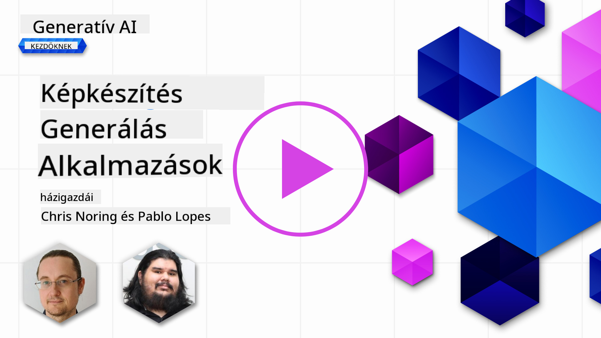

<!--
CO_OP_TRANSLATOR_METADATA:
{
  "original_hash": "7a655f30d1dcbdfe6eff2558eff249af",
  "translation_date": "2025-06-25T17:32:10+00:00",
  "source_file": "09-building-image-applications/README.md",
  "language_code": "hu"
}
-->
# Képalkotó alkalmazások készítése

[](https://aka.ms/gen-ai-lesson9-gh?WT.mc_id=academic-105485-koreyst)

Az LLM-ek nem csak szöveg generálására képesek. Lehetőség van képek generálására is szöveges leírások alapján. A képek mint modalitás számos területen hasznosak lehetnek, mint például a MedTech, építészet, turizmus, játékfejlesztés és még sok más. Ebben a fejezetben megvizsgáljuk a két legnépszerűbb képgeneráló modellt, a DALL-E-t és a Midjourney-t.

## Bevezetés

Ebben a leckében szó lesz:

- Képalkotás és miért hasznos.
- DALL-E és Midjourney, mik ezek, és hogyan működnek.
- Hogyan építhetsz képalkotó alkalmazást.

## Tanulási célok

A lecke befejezése után képes leszel:

- Képalkotó alkalmazás készítésére.
- Az alkalmazásod határainak meghatározására meta promptokkal.
- A DALL-E és Midjourney használatára.

## Miért készítsünk képalkotó alkalmazást?

A képalkotó alkalmazások nagyszerű módjai a Generatív AI képességeinek felfedezésére. Használhatók például:

- **Képszerkesztés és szintézis**. Különféle felhasználási esetekhez generálhatsz képeket, mint például képszerkesztés és képszintézis.

- **Számos iparágban alkalmazható**. Használhatók képek generálására különféle iparágak számára, mint a MedTech, turizmus, játékfejlesztés és még sok más.

## Szcenárió: Edu4All

Ennek a leckének a részeként folytatjuk a munkát a startupunkkal, az Edu4All-lal. A diákok képeket készítenek a feladataikhoz, pontosan milyen képeket, az a diákokon múlik, de lehetnek illusztrációk saját meséjükhöz, új karakterek a történetükhöz, vagy segíthetnek megjeleníteni ötleteiket és koncepcióikat.

Például, ha az Edu4All diákjai éppen emlékműveken dolgoznak az órán, ilyeneket generálhatnak:


egy ilyen prompt használatával

> "Kutya az Eiffel-torony mellett kora reggeli napsütésben"

## Mi a DALL-E és Midjourney?

A [DALL-E](https://openai.com/dall-e-2?WT.mc_id=academic-105485-koreyst) és a [Midjourney](https://www.midjourney.com/?WT.mc_id=academic-105485-koreyst) a két legnépszerűbb képgeneráló modell, amelyek lehetővé teszik, hogy promptok segítségével képeket generáljunk.

### DALL-E

Kezdjük a DALL-E-val, amely egy Generatív AI modell, amely képeket generál szöveges leírásokból.

> [A DALL-E két modell, a CLIP és a diffúz figyelem kombinációja](https://towardsdatascience.com/openais-dall-e-and-clip-101-a-brief-introduction-3a4367280d4e?WT.mc_id=academic-105485-koreyst).

- **CLIP**, egy modell, amely beágyazásokat generál, amelyek az adatok numerikus reprezentációi, képekből és szövegekből.

- **Diffúz figyelem**, egy modell, amely képeket generál a beágyazásokból. A DALL-E-t képek és szövegek adathalmazán képezték ki, és szöveges leírások alapján képeket generálhatunk vele. Például a DALL-E használható macska kalapban vagy mohawk frizurás kutya képének generálására.

### Midjourney

A Midjourney hasonló módon működik, mint a DALL-E, szöveges promptokból generál képeket. A Midjourney is használható képek generálására olyan promptokkal, mint "macska kalapban" vagy "mohawk frizurás kutya".


_Kép forrása Wikipedia, a képet a Midjourney generálta_

## Hogyan működik a DALL-E és a Midjourney

Először is, a [DALL-E](https://arxiv.org/pdf/2102.12092.pdf?WT.mc_id=academic-105485-koreyst). A DALL-E egy Generatív AI modell, amely a transzformátor architektúrán alapul, egy _autoregresszív transzformátorral_.

Az _autoregresszív transzformátor_ meghatározza, hogyan generál a modell képeket szöveges leírásokból, egyesével generálja a pixeleket, majd a generált pixeleket használja a következő pixel generálásához. Több rétegen keresztül halad egy neurális hálózatban, amíg a kép elkészül.

Ezzel a folyamattal a DALL-E szabályozza a generált kép attribútumait, tárgyait, jellemzőit és még sok mást. Azonban a DALL-E 2 és 3 nagyobb kontrollt biztosít a generált kép felett.

## Az első képalkotó alkalmazásod elkészítése

Mit is kell tenni egy képalkotó alkalmazás elkészítéséhez? Az alábbi könyvtárakra van szükséged:

- **python-dotenv**, erősen ajánlott ezt a könyvtárat használni, hogy a titkos adataidat egy _.env_ fájlban tartsd távol a kódtól.
- **openai**, ezt a könyvtárat fogod használni az OpenAI API-val való interakcióhoz.
- **pillow**, képekkel való munkához Pythonban.
- **requests**, hogy segítsen HTTP kéréseket készíteni.

1. Hozz létre egy _.env_ fájlt a következő tartalommal:

   ```text
   AZURE_OPENAI_ENDPOINT=<your endpoint>
   AZURE_OPENAI_API_KEY=<your key>
   ```

   Ezt az információt az Azure Portálon találod meg az erőforrásod "Keys and Endpoint" szakaszában.

1. Gyűjtsd össze a fenti könyvtárakat egy _requirements.txt_ nevű fájlban így:

   ```text
   python-dotenv
   openai
   pillow
   requests
   ```

1. Ezután hozz létre egy virtuális környezetet és telepítsd a könyvtárakat:

   ```bash
   python3 -m venv venv
   source venv/bin/activate
   pip install -r requirements.txt
   ```

   Windows esetén használd a következő parancsokat a virtuális környezet létrehozásához és aktiválásához:

   ```bash
   python3 -m venv venv
   venv\Scripts\activate.bat
   ```

1. Add hozzá a következő kódot egy _app.py_ nevű fájlba:

   ```python
   import openai
   import os
   import requests
   from PIL import Image
   import dotenv

   # import dotenv
   dotenv.load_dotenv()

   # Get endpoint and key from environment variables
   openai.api_base = os.environ['AZURE_OPENAI_ENDPOINT']
   openai.api_key = os.environ['AZURE_OPENAI_API_KEY']

   # Assign the API version (DALL-E is currently supported for the 2023-06-01-preview API version only)
   openai.api_version = '2023-06-01-preview'
   openai.api_type = 'azure'


   try:
       # Create an image by using the image generation API
       generation_response = openai.Image.create(
           prompt='Bunny on horse, holding a lollipop, on a foggy meadow where it grows daffodils',    # Enter your prompt text here
           size='1024x1024',
           n=2,
           temperature=0,
       )
       # Set the directory for the stored image
       image_dir = os.path.join(os.curdir, 'images')

       # If the directory doesn't exist, create it
       if not os.path.isdir(image_dir):
           os.mkdir(image_dir)

       # Initialize the image path (note the filetype should be png)
       image_path = os.path.join(image_dir, 'generated-image.png')

       # Retrieve the generated image
       image_url = generation_response["data"][0]["url"]  # extract image URL from response
       generated_image = requests.get(image_url).content  # download the image
       with open(image_path, "wb") as image_file:
           image_file.write(generated_image)

       # Display the image in the default image viewer
       image = Image.open(image_path)
       image.show()

   # catch exceptions
   except openai.InvalidRequestError as err:
       print(err)

   ```

Magyarázzuk el ezt a kódot:

- Először importáljuk a szükséges könyvtárakat, beleértve az OpenAI könyvtárat, a dotenv könyvtárat, a requests könyvtárat és a Pillow könyvtárat.

  ```python
  import openai
  import os
  import requests
  from PIL import Image
  import dotenv
  ```

- Ezután betöltjük a környezeti változókat a _.env_ fájlból.

  ```python
  # import dotenv
  dotenv.load_dotenv()
  ```

- Ezt követően beállítjuk az OpenAI API végpontját, kulcsát, verzióját és típusát.

  ```python
  # Get endpoint and key from environment variables
  openai.api_base = os.environ['AZURE_OPENAI_ENDPOINT']
  openai.api_key = os.environ['AZURE_OPENAI_API_KEY']

  # add version and type, Azure specific
  openai.api_version = '2023-06-01-preview'
  openai.api_type = 'azure'
  ```

- Ezután generáljuk a képet:

  ```python
  # Create an image by using the image generation API
  generation_response = openai.Image.create(
      prompt='Bunny on horse, holding a lollipop, on a foggy meadow where it grows daffodils',    # Enter your prompt text here
      size='1024x1024',
      n=2,
      temperature=0,
  )
  ```

  A fenti kód egy JSON objektummal válaszol, amely tartalmazza a generált kép URL-jét. Az URL segítségével letölthetjük a képet és elmenthetjük egy fájlba.

- Végül megnyitjuk a képet és a standard képnézegetővel megjelenítjük:

  ```python
  image = Image.open(image_path)
  image.show()
  ```

### További részletek a kép generálásáról

Nézzük meg részletesebben a kép generálásához használt kódot:

```python
generation_response = openai.Image.create(
        prompt='Bunny on horse, holding a lollipop, on a foggy meadow where it grows daffodils',    # Enter your prompt text here
        size='1024x1024',
        n=2,
        temperature=0,
    )
```

- **prompt**, a szöveges prompt, amelyet a kép generálására használnak. Ebben az esetben a "Nyuszi lovon, nyalókát tartva, ködös réten, ahol nárciszok nőnek" promptot használjuk.
- **size**, a generált kép mérete. Ebben az esetben egy 1024x1024 pixeles képet generálunk.
- **n**, a generált képek száma. Ebben az esetben két képet generálunk.
- **temperature**, egy paraméter, amely a Generatív AI modell kimenetének véletlenszerűségét szabályozza. A hőmérséklet egy 0 és 1 közötti érték, ahol 0 azt jelenti, hogy a kimenet determinisztikus, és 1 azt jelenti, hogy a kimenet véletlenszerű. Az alapértelmezett érték 0,7.

További dolgokat is tehetünk a képekkel, amelyeket a következő részben tárgyalunk.

## A képalkotás további képességei

Eddig láthattad, hogyan tudtunk képet generálni néhány sor Python kóddal. Azonban ennél több dolgot is tehetsz a képekkel.

Ezeket is megteheted:

- **Szerkesztés végrehajtása**. Meglévő kép, maszk és prompt megadásával módosíthatod a képet. Például hozzáadhatsz valamit a kép egy részéhez. Képzeld el a nyuszi képünket, adhatsz egy kalapot a nyuszinak. Ezt úgy teheted meg, hogy megadod a képet, egy maszkot (ami azonosítja a változtatandó területet) és egy szöveges promptot, amely megmondja, mit kell tenni.

  ```python
  response = openai.Image.create_edit(
    image=open("base_image.png", "rb"),
    mask=open("mask.png", "rb"),
    prompt="An image of a rabbit with a hat on its head.",
    n=1,
    size="1024x1024"
  )
  image_url = response['data'][0]['url']
  ```

  Az alap kép csak a nyulat tartalmazná, de a végső kép már a kalapot is a nyúlra helyezné.

- **Variációk létrehozása**. Az ötlet az, hogy egy meglévő képet veszünk, és variációkat kérünk. A variáció létrehozásához megadod a képet és egy szöveges promptot, majd a kódot így:

  ```python
  response = openai.Image.create_variation(
    image=open("bunny-lollipop.png", "rb"),
    n=1,
    size="1024x1024"
  )
  image_url = response['data'][0]['url']
  ```

  > Megjegyzés, ez csak az OpenAI-n támogatott

## Hőmérséklet

A hőmérséklet egy paraméter, amely a Generatív AI modell kimenetének véletlenszerűségét szabályozza. A hőmérséklet egy 0 és 1 közötti érték, ahol 0 azt jelenti, hogy a kimenet determinisztikus, és 1 azt jelenti, hogy a kimenet véletlenszerű. Az alapértelmezett érték 0,7.

Nézzük meg a hőmérséklet működésének példáját, ha kétszer futtatjuk ezt a promptot:

> Prompt: "Nyuszi lovon, nyalókát tartva, ködös réten, ahol nárciszok nőnek"


Most futtassuk újra ugyanazt a promptot, hogy lássuk, nem kapjuk meg kétszer ugyanazt a képet:


Ahogy látod, a képek hasonlóak, de nem ugyanazok. Próbáljuk meg a hőmérséklet értékét 0,1-re változtatni, és nézzük meg, mi történik:

```python
 generation_response = openai.Image.create(
        prompt='Bunny on horse, holding a lollipop, on a foggy meadow where it grows daffodils',    # Enter your prompt text here
        size='1024x1024',
        n=2
    )
```

### A hőmérséklet változtatása

Próbáljuk meg a választ determinisztikusabbá tenni. Megfigyelhettük a két generált képből, hogy az első képen van egy nyuszi, a második képen pedig egy ló, tehát a képek jelentősen eltérnek.

Ezért változtassuk meg a kódunkat, és állítsuk be a hőmérsékletet 0-ra, így:

```python
generation_response = openai.Image.create(
        prompt='Bunny on horse, holding a lollipop, on a foggy meadow where it grows daffodils',    # Enter your prompt text here
        size='1024x1024',
        n=2,
        temperature=0
    )
```

Most, amikor futtatod ezt a kódot, ezeket a két képet kapod:

- 
- 

Itt egyértelműen láthatod, hogy a képek sokkal jobban hasonlítanak egymásra.

## Hogyan határozd meg az alkalmazásod határait metapromptokkal

A demónkkal már képeket tudunk generálni az ügyfeleink számára. Azonban létre kell hoznunk néhány határt az alkalmazásunk számára.

Például nem szeretnénk olyan képeket generálni, amelyek nem biztonságosak a munkahelyen, vagy nem megfelelőek gyerekek számára.

Ezt megtehetjük _metapromptokkal_. A metapromptok olyan szöveges promptok, amelyek a Generatív AI modell kimenetének szabályozására szolgálnak. Például metapromptokkal szabályozhatjuk a kimenetet, és biztosíthatjuk, hogy a generált képek biztonságosak legyenek a munkahelyen, vagy megfelelőek legyenek gyerekek számára.

### Hogyan működik?

Most, hogyan működnek a metapromptok?

A metapromptok olyan szöveges promptok, amelyek a Generatív AI modell kimenetének szabályozására szolgálnak, a szöveges prompt előtt helyezkednek el, és a modell kimenetének szabályozására szolgálnak, beágyazva az alkalmazásokba, hogy szabályozzák a modell kimenetét. A prompt bemenetet és a metaprompt bemenetet egyetlen szöveges promptba ágyazzák be.

Egy példa metaprompt lehet a következő:

```text
You are an assistant designer that creates images for children.

The image needs to be safe for work and appropriate for children.

The image needs to be in color.

The image needs to be in landscape orientation.

The image needs to be in a 16:9 aspect ratio.

Do not consider any input from the following that is not safe for work or appropriate for children.

(Input)

```

Most nézzük meg, hogyan használhatjuk a metapromptokat a demónkban.

```python
disallow_list = "swords, violence, blood, gore, nudity, sexual content, adult content, adult themes, adult language, adult humor, adult jokes, adult situations, adult"

meta_prompt =f"""You are an assistant designer that creates images for children.

The image needs to be safe for work and appropriate for children.

The image needs to be in color.

The image needs to be in landscape orientation.

The image needs to be in a 16:9 aspect ratio.

Do not consider any input from the following that is not safe for work or appropriate for children.
{disallow_list}
"""

prompt = f"{meta_prompt}
Create an image of a bunny on a horse, holding a lollipop"

# TODO add request to generate image
```

A fenti promptból láthatod, hogy az összes létrehozott kép figyelembe veszi a metapromptot.

## Feladat - engedélyezzük a diákokat

A lecke elején bemutattuk az Edu4All-t. Most itt az ideje, hogy lehetővé tegyük a diákok számára, hogy képeket generáljanak a feladataikhoz.

A diákok képeket készítenek a feladataikhoz, amelyek emlékműveket tartalmaznak, pontosan milyen emlékműveket, az a diákokon múlik. A diákokat arra kérik, hogy használják kreativitásukat ebben a feladatban, hogy ezeket az emlékműveket különböző kontextusokba helyezzék.

## Megoldás

Íme egy lehetséges megoldás:

```python
import openai
import os
import requests
from PIL import Image
import dotenv

# import dotenv
dotenv.load_dotenv()

# Get endpoint and key from environment variables
openai.api_base = "<replace with endpoint>"
openai.api_key = "<replace with api key>"

# Assign the API version (DALL-E is currently supported for the 2023-06-01-preview API version only)
openai.api_version = '2023-06-01-preview'
openai.api_type = 'azure'

disallow_list = "swords, violence, blood, gore, nudity, sexual content, adult content, adult themes, adult language, adult humor, adult jokes, adult situations, adult"

meta_prompt = f"""You are an assistant designer that creates images for children.

The image needs to be safe for work and appropriate for children.

The image needs to be in color.

The image needs to be in landscape orientation.

The image needs to be in a 16:9 aspect ratio.

Do not consider any input from the following that is not safe for work or appropriate for children.
{disallow_list}"""

prompt = f"""{metaprompt}
Generate monument of the Arc of Triumph in Paris, France, in the evening light with a small child holding a Teddy looks on.
""""

try:
    # Create an image by using the image generation API
    generation_response = openai.Image.create(
        prompt=prompt,    # Enter your prompt text here
        size='1024x1024',
        n=2,
        temperature=0,
    )
    # Set the directory for the stored image
    image_dir = os.path.join(os.curdir, 'images')

    # If the directory doesn't exist, create it
    if not os.path.isdir(image_dir):
        os.mkdir(image_dir)

    # Initialize the image path (note the filetype should be png)
    image_path = os.path.join(image_dir, 'generated-image.png')

    # Retrieve the generated image
    image_url = generation_response["data"][0]["url"]  # extract image URL from response
    generated_image = requests.get(image_url).content  # download the image
    with open(image_path, "wb") as image_file:
        image_file.write(generated_image)

    # Display the image in the default image viewer
    image = Image.open(image_path)
    image.show()

# catch exceptions
except openai.InvalidRequestError as err:
    print(err)
```

## Nagyszerű munka! Folytasd a tanulást

A lecke befejezése után nézd meg a [Generatív AI Tanulási gyűjteményünket](https://aka.ms/genai-collection?WT.mc_id=academic-105485-koreyst), hogy tovább fejleszd Generatív AI ismereteidet!

Lépj tovább a 10. leckére, ahol megvizsgáljuk, hogyan [építsünk AI alkalmazásokat alacsony kódolással](../10-building-low-code-ai-applications/README.md?WT.mc_id=academic-105485-koreyst).

**Felelősség kizárása**:  
Ezt a dokumentumot az [Co-op Translator](https://github.com/Azure/co-op-translator) AI fordítási szolgáltatással fordították le. Bár törekszünk a pontosságra, kérjük, vegye figyelembe, hogy az automatikus fordítások hibákat vagy pontatlanságokat tartalmazhatnak. Az eredeti dokumentum az eredeti nyelvén tekintendő hiteles forrásnak. Kritikus információk esetén javasolt a professzionális emberi fordítás igénybevétele. Nem vállalunk felelősséget a fordítás használatából eredő félreértésekért vagy félremagyarázásokért.