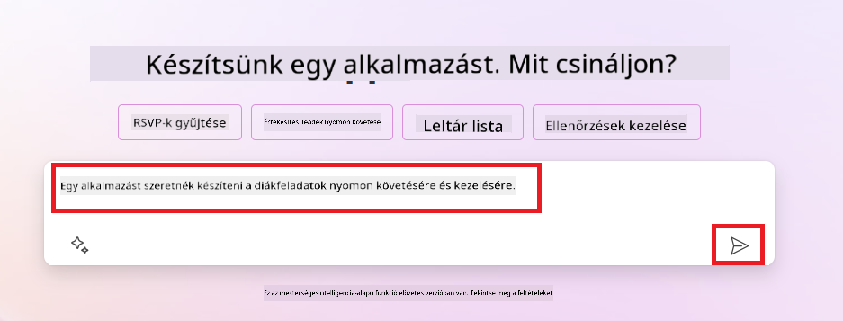
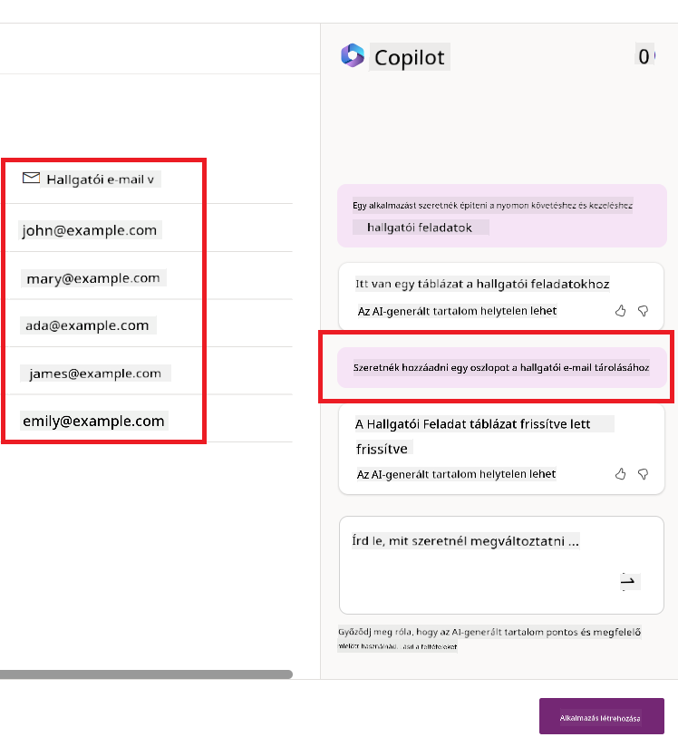
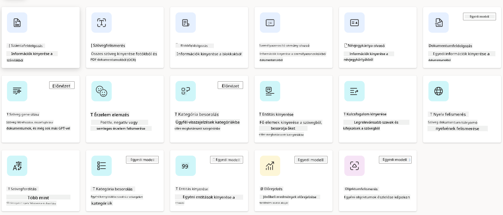
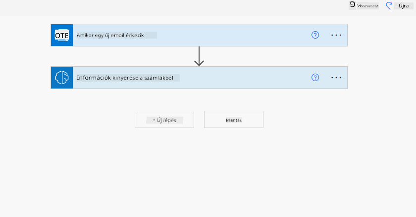
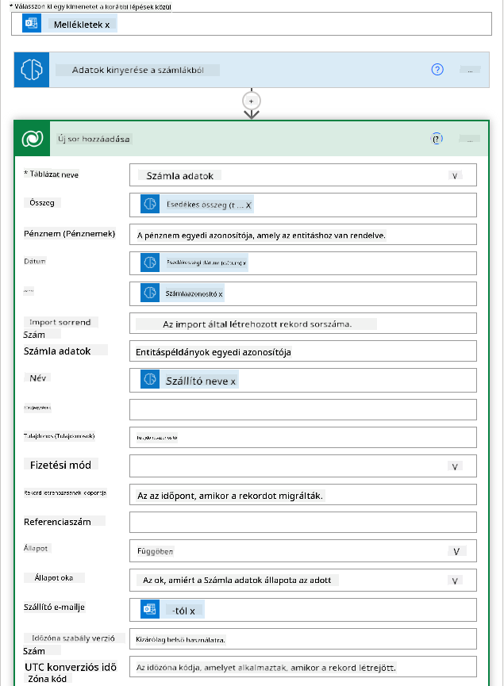
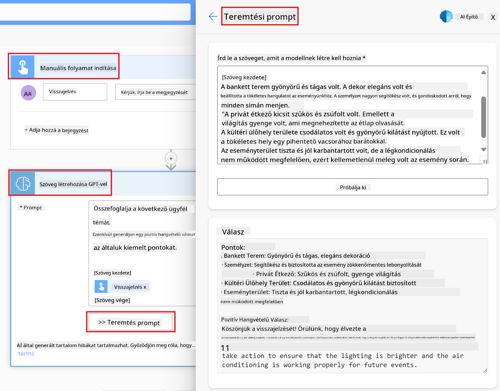

<!--
CO_OP_TRANSLATOR_METADATA:
{
  "original_hash": "f5ff3b6204a695a117d6f452403c95f7",
  "translation_date": "2025-05-19T20:57:57+00:00",
  "source_file": "10-building-low-code-ai-applications/README.md",
  "language_code": "hu"
}
-->
# Alacsony kódú AI alkalmazások építése

> _(Kattints a fenti képre, hogy megtekintsd az óra videóját)_

## Bevezetés

Most, hogy megtanultuk, hogyan építsünk képgeneráló alkalmazásokat, beszéljünk az alacsony kódról. A generatív AI számos különböző területen használható, beleértve az alacsony kódot is, de mi az az alacsony kód, és hogyan adhatunk AI-t hozzá?

Az alkalmazások és megoldások építése könnyebbé vált a hagyományos fejlesztők és nem-fejlesztők számára az alacsony kódú fejlesztési platformok használatával. Az alacsony kódú fejlesztési platformok lehetővé teszik, hogy kevés vagy semmi kóddal építsünk alkalmazásokat és megoldásokat. Ezt úgy érjük el, hogy vizuális fejlesztési környezetet biztosítunk, amely lehetővé teszi a komponensek húzását és dobását az alkalmazások és megoldások építéséhez. Ez lehetővé teszi, hogy gyorsabban és kevesebb erőforrással építsünk alkalmazásokat és megoldásokat. Ebben az órában mélyebben elmerülünk abban, hogyan használhatjuk az alacsony kódot, és hogyan fejleszthetjük az alacsony kódú fejlesztést AI segítségével a Power Platform használatával.

A Power Platform lehetőséget biztosít a szervezeteknek, hogy felhatalmazzák csapataikat saját megoldásaik építésére egy intuitív alacsony kódú vagy kód nélküli környezetben. Ez a környezet segít egyszerűsíteni a megoldások építésének folyamatát. A Power Platformmal a megoldások napok vagy hetek alatt építhetők, hónapok vagy évek helyett. A Power Platform öt kulcsfontosságú termékből áll: Power Apps, Power Automate, Power BI, Power Pages és Copilot Studio.

Ez az óra az alábbiakat tartalmazza:

- Bevezetés a generatív AI-ba a Power Platformban
- Bevezetés a Copilotba és annak használata
- Generatív AI használata alkalmazások és folyamatok építésére a Power Platformban
- Az AI modellek megértése a Power Platformban az AI Builder segítségével

## Tanulási célok

Az óra végére képes leszel:

- Megérteni, hogyan működik a Copilot a Power Platformban.

- Építeni egy Diák Feladatkövető Alkalmazást az oktatási startupunk számára.

- Építeni egy Számlafeldolgozó Folyamatot, amely AI-t használ a számlákból származó információk kinyerésére.

- Alkalmazni a legjobb gyakorlatokat a GPT AI Modell szövegkészítésének használatakor.

Az eszközök és technológiák, amelyeket az órán használni fogsz:

- **Power Apps**, a Diák Feladatkövető alkalmazás számára, amely alacsony kódú fejlesztési környezetet biztosít az alkalmazások építéséhez az adatok követésére, kezelésére és interakciójára.

- **Dataverse**, az adatok tárolására a Diák Feladatkövető alkalmazás számára, ahol a Dataverse alacsony kódú adatplatformot biztosít az alkalmazás adatai tárolásához.

- **Power Automate**, a Számlafeldolgozó folyamat számára, ahol alacsony kódú fejlesztési környezetet kapsz a munkafolyamatok építéséhez a Számlafeldolgozási folyamat automatizálásához.

- **AI Builder**, a Számlafeldolgozó AI Modell számára, ahol előre elkészített AI modelleket fogsz használni a startupunk számláinak feldolgozására.

## Generatív AI a Power Platformban

Az alacsony kódú fejlesztés és alkalmazás generatív AI-val való fejlesztése kulcsfontosságú terület a Power Platform számára. A cél az, hogy mindenki képes legyen AI-vezérelt alkalmazásokat, webhelyeket, irányítópultokat építeni és folyamatokat automatizálni AI-val, _anélkül, hogy bármilyen adat-tudományi szakértelemre lenne szüksége_. Ezt a célt úgy érjük el, hogy integráljuk a generatív AI-t az alacsony kódú fejlesztési élménybe a Power Platformban a Copilot és az AI Builder formájában.

### Hogyan működik ez?

A Copilot egy AI asszisztens, amely lehetővé teszi, hogy a Power Platform megoldásokat építsünk úgy, hogy természetes nyelven megfogalmazott követelmények sorozatával írjuk le azokat. Például utasíthatod az AI asszisztenst, hogy adja meg, milyen mezőket fog használni az alkalmazásod, és az megalkotja az alkalmazást és az alatta lévő adatmodellt, vagy megadhatod, hogyan állítsd be a folyamatot a Power Automate-ban.

A Copilot által vezérelt funkciókat használhatod az alkalmazás képernyőin, hogy lehetővé tedd a felhasználók számára, hogy beszélgetésen keresztül fedezzék fel a betekintéseket.

Az AI Builder egy alacsony kódú AI képesség, amely elérhető a Power Platformban, és lehetővé teszi, hogy AI modelleket használj a folyamatok automatizálására és eredmények előrejelzésére. Az AI Builderrel AI-t hozhatsz az alkalmazásaidba és folyamataidba, amelyek kapcsolódnak az adataidhoz a Dataverse-ben vagy különböző felhőalapú adatforrásokban, mint például a SharePoint, OneDrive vagy Azure.

A Copilot elérhető a Power Platform összes termékében: Power Apps, Power Automate, Power BI, Power Pages és Power Virtual Agents. Az AI Builder elérhető a Power Apps-ban és a Power Automate-ban. Ebben az órában arra összpontosítunk, hogyan használhatjuk a Copilotot és az AI Buildert a Power Apps-ban és a Power Automate-ban, hogy megoldást építsünk az oktatási startupunk számára.

### Copilot a Power Apps-ban

A Power Platform részeként a Power Apps alacsony kódú fejlesztési környezetet biztosít az alkalmazások építéséhez az adatok követésére, kezelésére és interakciójára. Ez egy alkalmazásfejlesztési szolgáltatáskészlet, amely skálázható adatplatformmal és felhőszolgáltatásokhoz és helyi adatokhoz való csatlakozás képességével rendelkezik. A Power Apps lehetővé teszi, hogy böngészőkön, táblagépeken és telefonokon futó alkalmazásokat építs, amelyeket megoszthatsz munkatársaiddal. A Power Apps egyszerű felülettel könnyíti meg a felhasználókat az alkalmazásfejlesztésbe, így minden üzleti felhasználó vagy profi fejlesztő képes egyedi alkalmazásokat építeni. Az alkalmazásfejlesztési élményt a Generatív AI is javítja a Copilot segítségével.

A Copilot AI asszisztens funkció a Power Apps-ban lehetővé teszi, hogy leírd, milyen típusú alkalmazásra van szükséged, és milyen információkat szeretnél, hogy az alkalmazásod kövessen, gyűjtsön vagy megjelenítsen. A Copilot aztán egy reszponzív Canvas alkalmazást generál a leírásod alapján. Az alkalmazást ezután testre szabhatod, hogy megfeleljen az igényeidnek. Az AI Copilot azt is generálja és javasolja, hogy milyen Dataverse táblát használj az adatok tárolásához, amelyeket követni szeretnél, valamint néhány mintaadatot. Ebben az órában később megnézzük, mi az a Dataverse és hogyan használhatod a Power Apps-ban. Ezután testre szabhatod a táblát, hogy megfeleljen az igényeidnek az AI Copilot asszisztens funkció segítségével beszélgetési lépések során. Ez a funkció könnyen elérhető a Power Apps kezdőképernyőjéről.

### Copilot a Power Automate-ban

A Power Platform részeként a Power Automate lehetővé teszi a felhasználók számára, hogy automatizált munkafolyamatokat hozzanak létre az alkalmazások és szolgáltatások között. Segít automatizálni az ismétlődő üzleti folyamatokat, például a kommunikációt, adatgyűjtést és döntési jóváhagyásokat. Egyszerű felülete lehetővé teszi, hogy minden technikai kompetenciával rendelkező felhasználó (a kezdőktől a tapasztalt fejlesztőkig) automatizálja a munkafeladatokat. A munkafolyamat-fejlesztési élményt a Generatív AI is javítja a Copilot segítségével.

A Copilot AI asszisztens funkció a Power Automate-ban lehetővé teszi, hogy leírd, milyen típusú folyamatra van szükséged, és milyen műveleteket szeretnél, hogy a folyamatod végrehajtson. A Copilot aztán egy folyamatot generál a leírásod alapján. A folyamatot ezután testre szabhatod, hogy megfeleljen az igényeidnek. Az AI Copilot azt is generálja és javasolja, hogy milyen műveleteket kell végrehajtanod a feladat automatizálásához. Ebben az órában később megnézzük, mi az a folyamat és hogyan használhatod a Power Automate-ban. Ezután testre szabhatod a műveleteket, hogy megfeleljenek az igényeidnek az AI Copilot asszisztens funkció segítségével beszélgetési lépések során. Ez a funkció könnyen elérhető a Power Automate kezdőképernyőjéről.

## Feladat: Diák feladatok és számlák kezelése a startupunk számára, Copilot használatával

Startupunk online kurzusokat biztosít a diákoknak. A startup gyorsan növekedett, és most küzd, hogy lépést tartson a kurzusai iránti kereslettel. A startup felvett téged Power Platform fejlesztőként, hogy segíts neki egy alacsony kódú megoldás építésében, amely segít neki a diák feladatok és számlák kezelésében. A megoldásnak képesnek kell lennie segíteni a diák feladatok követésében és kezelésében egy alkalmazás révén, valamint automatizálni a számlafeldolgozási folyamatot egy munkafolyamat révén. Felkértek, hogy Generatív AI-t használj a megoldás fejlesztésére.

Amikor elkezded használni a Copilotot, használhatod a [Power Platform Copilot Prompt Library](https://github.com/pnp/powerplatform-prompts?WT.mc_id=academic-109639-somelezediko) könyvtárat, hogy elkezdhesd a promptokat. Ez a könyvtár tartalmaz egy listát a promptokról, amelyeket használhatsz alkalmazások és folyamatok építésére a Copilot segítségével. A könyvtárban található promptokat is használhatod, hogy ötletet kapj arról, hogyan írhatod le a követelményeket a Copilotnak.

### Építs egy Diák Feladatkövető Alkalmazást a Startupunk számára

Az oktatók a startupunknál küzdenek a diák feladatok nyomon követésével. Egy táblázatot használnak a feladatok követésére, de ez nehezen kezelhetővé vált, mivel a diákok száma nőtt. Felkértek, hogy építs egy alkalmazást, amely segít nekik nyomon követni és kezelni a diák feladatokat. Az alkalmazásnak lehetővé kell tennie számukra, hogy új feladatokat adjanak hozzá, feladatokat tekintsenek meg, feladatokat frissítsenek és feladatokat töröljenek. Az alkalmazásnak lehetővé kell tennie az oktatók és diákok számára, hogy megtekintsék a feladatokat, amelyeket osztályoztak és azokat, amelyeket nem osztályoztak.

Az alkalmazást a Copilot segítségével fogod építeni a Power Apps-ban a következő lépések szerint:

1. Navigálj a [Power Apps](https://make.powerapps.com?WT.mc_id=academic-105485-koreyst) kezdőképernyőjére.

1. Használd a szövegterületet a kezdőképernyőn, hogy leírd az alkalmazást, amit építeni szeretnél. Például, **_Egy alkalmazást szeretnék építeni a diák feladatok követésére és kezelésére_**. Kattints a **Küldés** gombra, hogy elküldd a promptot az AI Copilotnak.

1. Az AI Copilot javasol egy Dataverse táblát a mezőkkel, amikre szükséged van az adatok tárolásához, amelyeket követni szeretnél, valamint néhány mintaadatot. Ezután testre szabhatod a táblát, hogy megfeleljen az igényeidnek az AI Copilot asszisztens funkció segítségével beszélgetési lépések során.

   > **Fontos**: A Dataverse a Power Platform alapvető adatplatformja. Ez egy alacsony kódú adatplatform az alkalmazás adatai tárolásához. Ez egy teljesen kezelt szolgáltatás, amely biztonságosan tárolja az adatokat a Microsoft Cloudban, és a Power Platform környezetedben van telepítve. Beépített adatirányítási képességekkel rendelkezik, mint például adatklasszifikáció, adatvonal, finomhangolt hozzáférés-szabályozás és még sok más. További információt a Dataverse-ről [itt](https://docs.microsoft.com/powerapps/maker/data-platform/data-platform-intro?WT.mc_id=academic-109639-somelezediko) találhatsz.

   

1. Az oktatók szeretnének e-maileket küldeni a diákoknak, akik beküldték a feladataikat, hogy naprakészen tartsák őket a feladataik előrehaladásával. A Copilot segítségével hozzáadhatsz egy új mezőt a táblához a diák e-mail tárolásához. Például használhatod a következő promptot egy új mező hozzáadásához a táblához: **_Egy oszlopot szeretnék hozzáadni a diák e-mail tárolásához_**. Kattints a **Küldés** gombra, hogy elküldd a promptot az AI Copilotnak.

1. Az AI Copilot generál egy új mezőt, és ezt követően testre szabhatod a mezőt, hogy megfeleljen az igényeidnek.

1. Miután elkészültél a táblával, kattints a **Alkalmazás létrehozása** gombra az alkalmazás létrehozásához.

1. Az AI Copilot egy reszponzív Canvas alkalmazást generál a leírásod alapján. Az alkalmazást ezután testre szabhatod, hogy megfeleljen az igényeidnek.

1. Az oktatók számára, hogy e-maileket küldjenek a diákoknak, a Copilot segítségével hozzáadhatsz egy új képernyőt az alkalmazáshoz. Például használhatod a következő promptot egy új képernyő hozzáadásához az alkalmazáshoz: **_Egy képernyőt szeretnék hozzáadni, hogy e-maileket küldjek a diákoknak_**. Kattints a **Küldés** gombra, hogy elküldd a promptot az AI Copilotnak.

1. Az AI Copilot generál egy új képernyőt, és ezt követően testre szabhatod a képernyőt, hogy megfeleljen az igényeidnek.

1. Miután elkészültél az alkalmazással, kattints a **Mentés** gombra az alkalmazás mentéséhez.

1. Az alkalmazás megosztásához az oktatókkal kattints a **Megoszt
egy szöveg. - **Érzelmi Elemzés**: Ez a modell pozitív, negatív, semleges vagy vegyes érzelmeket érzékel a szövegben. - **Névjegykártya Olvasó**: Ez a modell információt nyer ki névjegykártyákból. - **Szövegfelismerés**: Ez a modell szöveget nyer ki képekből. - **Tárgyfelismerés**: Ez a modell tárgyakat érzékel és nyer ki képekből. - **Dokumentumfeldolgozás**: Ez a modell információt nyer ki űrlapokból. - **Számlafeldolgozás**: Ez a modell információt nyer ki számlákból. A Saját AI Modellek segítségével saját modellt hozhatsz be az AI Builderbe, hogy úgy működjön, mint bármely AI Builder egyedi modell, lehetővé téve a modell saját adatokkal történő betanítását. Ezeket a modelleket használhatod folyamatok automatizálására és eredmények előrejelzésére mind a Power Apps, mind a Power Automate alkalmazásban. Saját modell használatakor korlátozások érvényesek. Olvass tovább ezekről a [korlátozásokról](https://learn.microsoft.com/ai-builder/byo-model#limitations?WT.mc_id=academic-105485-koreyst). 

## 2. Feladat - Számlafeldolgozó Folyamat Létrehozása a Startupunk Számára

A pénzügyi csapat küzd a számlák feldolgozásával. Egy táblázatot használnak a számlák nyomon követésére, de ez nehézkessé vált a számlák számának növekedése miatt. Arra kértek, hogy építs egy munkafolyamatot, amely segíti őket a számlák AI segítségével történő feldolgozásában. A munkafolyamatnak lehetővé kell tennie, hogy információt nyerjenek ki a számlákból és az információt egy Dataverse táblába tárolják. A munkafolyamatnak lehetővé kell tennie, hogy e-mailt küldjenek a pénzügyi csapatnak a kinyert információkkal.

Most, hogy tudod, mi az AI Builder és miért érdemes használni, nézzük meg, hogyan használhatod az AI Builder Számlafeldolgozó AI Modelljét, amelyet korábban tárgyaltunk, hogy egy munkafolyamatot építs, amely segíti a pénzügyi csapatot a számlák feldolgozásában.

A munkafolyamat létrehozásához, amely segíti a pénzügyi csapatot a számlák feldolgozásában az AI Builder Számlafeldolgozó AI Modelljének segítségével, kövesd az alábbi lépéseket:

1. Navigálj a [Power Automate](https://make.powerautomate.com?WT.mc_id=academic-105485-koreyst) kezdőképernyőjére.
2. Használd a szövegmezőt a kezdőképernyőn, hogy leírd a létrehozni kívánt munkafolyamatot. Például, **_Feldolgozz egy számlát, amikor megérkezik a postaládámba_**. Kattints a **Küldés** gombra, hogy elküldd az utasítást az AI Copilotnak. 
3. Az AI Copilot javaslatot tesz azokra az akciókra, amelyeket el kell végezned az automatizálni kívánt feladat során. Kattinthatsz a **Következő** gombra, hogy továbblépj a következő lépésekre.
4. A következő lépésben a Power Automate arra kér, hogy állítsd be a folyamathoz szükséges kapcsolódásokat. Ha végeztél, kattints a **Folyamat létrehozása** gombra a folyamat létrehozásához.
5. Az AI Copilot generál egy folyamatot, amelyet testre szabhatod az igényeid szerint.
6. Frissítsd a folyamat indítóját, és állítsd be a **Mappa** opciót arra a mappára, ahol a számlák tárolva lesznek. Például beállíthatod a mappát **Bejövő** mappára. Kattints a **További beállítások megjelenítése** gombra, és állítsd a **Csak mellékletekkel** opciót **Igen** értékre. Ez biztosítja, hogy a folyamat csak akkor fusson, amikor egy mellékletet tartalmazó e-mail érkezik a mappába.
7. Távolítsd el a következő akciókat a folyamatból: **HTML szöveggé**, **Összeállítás**, **Összeállítás 2**, **Összeállítás 3** és **Összeállítás 4**, mert nem fogod használni őket.
8. Távolítsd el a **Feltétel** akciót a folyamatból, mert nem fogod használni. Ennek a következő képernyőképhez kell hasonlítania: 
9. Kattints az **Akció hozzáadása** gombra, és keress rá a **Dataverse**-re. Válaszd az **Új sor hozzáadása** akciót.
10. Az **Információ kinyerése a számlákból** akciónál frissítsd a **Számla fájlt**, hogy az e-mailből származó **Melléklet tartalom**-ra mutasson. Ez biztosítja, hogy a folyamat információt nyerjen ki a számla mellékletéből.
11. Válaszd ki a korábban létrehozott **Táblát**. Például választhatod az **Számla információ** táblát. Válaszd ki a dinamikus tartalmat az előző akcióból, hogy kitöltsd a következő mezőket: - ID - Összeg - Dátum - Név - Állapot - Állítsd az **Állapot**-ot **Függőben** értékre. - Szállító e-mail - Használd az **Feladó** dinamikus tartalmat az **Amikor új e-mail érkezik** indítóból. 
12. Miután elkészültél a folyamattal, kattints a **Mentés** gombra a folyamat mentéséhez. Ezután tesztelheted a folyamatot, ha küldesz egy e-mailt számlával a triggerben megadott mappába.

> **Házi feladatod**: A folyamat, amit éppen létrehoztál, jó kezdet, most gondolkodnod kell azon, hogyan építhetsz egy automatizálást, amely lehetővé teszi pénzügyi csapatunk számára, hogy e-mailt küldjenek a szállítónak, hogy tájékoztassák őket a számla aktuális állapotáról. Tipp: a folyamatnak akkor kell futnia, amikor a számla állapota megváltozik.

## Szöveg Generálása AI Modellel a Power Automate-ben

A GPT AI Modellel való Szöveg Létrehozása az AI Builderben lehetővé teszi, hogy szöveget generálj egy utasítás alapján, és a Microsoft Azure OpenAI Service hajtja. Ezzel a képességgel beépítheted a GPT (Generative Pre-Trained Transformer) technológiát az alkalmazásaidba és folyamataidba, hogy különféle automatizált folyamatokat és értékes alkalmazásokat hozz létre.

A GPT modellek kiterjedt képzést kapnak hatalmas mennyiségű adaton, lehetővé téve számukra, hogy olyan szöveget hozzanak létre, amely szorosan hasonlít az emberi nyelvre, amikor utasítást kapnak. Amikor munkafolyamat-automatizálással integrálják, az AI modellek, mint a GPT, felhasználhatók a feladatok széles körének egyszerűsítésére és automatizálására.

Például létrehozhatsz folyamatokat, amelyek automatikusan szöveget generálnak különféle felhasználási esetekre, mint például: e-mail vázlatok, termékleírások és még sok más. A modellt arra is használhatod, hogy szöveget generálj különféle alkalmazásokhoz, mint például chatbotok és ügyfélszolgálati alkalmazások, amelyek lehetővé teszik az ügyfélszolgálati ügynökök számára, hogy hatékonyan és eredményesen válaszoljanak az ügyfélkérdésekre.

Ha szeretnéd megtanulni, hogyan használhatod ezt az AI Modellt a Power Automate-ben, menj végig az [Intelligencia hozzáadása az AI Builderrel és GPT-vel](https://learn.microsoft.com/training/modules/ai-builder-text-generation/?WT.mc_id=academic-109639-somelezediko) modulon.

## Nagyszerű Munka! Folytasd a Tanulást

A lecke befejezése után nézd meg a [Generatív AI Tanulási gyűjteményünket](https://aka.ms/genai-collection?WT.mc_id=academic-105485-koreyst), hogy tovább fejleszd a Generatív AI tudásodat!

Lépj tovább a 11. leckére, ahol megnézzük, hogyan lehet [integrálni a Generatív AI-t a Funkcióhívással](../11-integrating-with-function-calling/README.md?WT.mc_id=academic-105485-koreyst)!

**Felelősség kizárása**:  
Ez a dokumentum AI fordítószolgáltatás, a [Co-op Translator](https://github.com/Azure/co-op-translator) segítségével került lefordításra. Bár igyekszünk a pontosságra, kérjük, vegye figyelembe, hogy az automatikus fordítások hibákat vagy pontatlanságokat tartalmazhatnak. Az eredeti dokumentum saját nyelvén tekintendő hiteles forrásnak. Kritikus információk esetén javasolt a professzionális emberi fordítás. Nem vállalunk felelősséget a fordítás használatából eredő félreértésekért vagy félremagyarázásokért.