# Alacsony kódú MI alkalmazások építése

[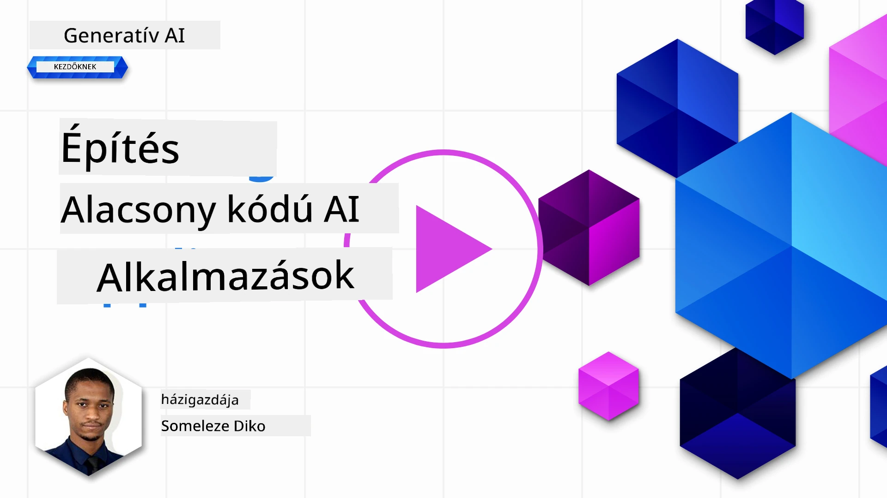](https://youtu.be/1vzq3Nd8GBA?si=h6LHWJXdmqf6mhDg)

> _(Kattintson a fenti képre a lecke videójának megtekintéséhez)_

## Bevezetés

Most, hogy megtanultuk, hogyan építsünk képgeneráló alkalmazásokat, beszéljünk az alacsony kódról. A generatív MI különféle területeken használható, beleértve az alacsony kódot is, de mi az az alacsony kód, és hogyan adhatunk hozzá MIt?

Alkalmazások és megoldások építése könnyebbé vált a hagyományos fejlesztők és nem fejlesztők számára az Alacsony Kód Fejlesztési Platformok használatával. Az Alacsony Kód Fejlesztési Platformok lehetővé teszik, hogy kevés vagy semmilyen kód írása nélkül építsünk alkalmazásokat és megoldásokat. Ezt egy vizuális fejlesztői környezet biztosításával érik el, amely lehetővé teszi komponensek húzását és ejtését az alkalmazások és megoldások építéséhez. Ez gyorsabb és kevesebb erőforrással történő alkalmazás- és megoldásépítést tesz lehetővé. Ebben a leckében mélyebben belemerülünk, hogyan használjuk az Alacsony Kódot, és hogyan fokozhatjuk azt MI-vel a Power Platform segítségével.

A Power Platform lehetőséget nyújt a szervezeteknek, hogy csapatukat felhatalmazzák saját megoldásaik felépítésére egy intuitív alacsony vagy kód nélküli környezetben. Ez a környezet egyszerűsíti a megoldások építésének folyamatát. A Power Platform segítségével a megoldások napok vagy hetek alatt építhetők, hónapok vagy évek helyett. A Power Platform öt kulcsfontosságú termékből áll: Power Apps, Power Automate, Power BI, Power Pages és Copilot Studio.

Ez a lecke a következőket fedi le:

- Bevezetés a generatív MI-be a Power Platformon belül
- Bevezetés a Copilot-ba és használatának módja
- Generatív MI használata alkalmazások és folyamatok építéséhez a Power Platformon
- Az MI modellek megértése a Power Platformon az AI Builder segítségével
- Intelligens ügynökök építése a Microsoft Copilot Studio-val

## Tanulási célok

A lecke végére képes leszel:

- Megérteni, hogyan működik a Copilot a Power Platformon.

- Egy diákmunkakövető alkalmazás fejlesztése oktatási startupunk számára.

- Számlafeldolgozó folyam létrehozása, amely MI segítségével kinyeri az adatokat a számlákból.

- Legjobb gyakorlatok alkalmazása a Create Text with GPT AI Model használatakor.

- Megérteni, mi az a Microsoft Copilot Studio és hogyan lehet intelligens ügynököket építeni vele.

Az eszközök és technológiák, amelyeket ebben a leckében használsz:

- **Power Apps**, a Diákmunkakövető alkalmazáshoz, amely egy alacsony kódú fejlesztői környezetet biztosít az adatok követésére, kezelésére és kezelésére szolgáló alkalmazások építéséhez.

- **Dataverse**, az alkalmazás adatainak tárolására szolgáló adatplatform a Diákmunkakövető alkalmazáshoz, amely kód nélküli adattárolási platformot biztosít.

- **Power Automate**, a számlafeldolgozó folyamhoz, amely alacsony kódú fejlesztői környezetet ad a számlafeldolgozás folyamatának automatizálásához.

- **AI Builder**, a számlafeldolgozó MI modellhez, ahol előre elkészített MI modelleket használsz a startup számláinak feldolgozására.

## Generatív MI a Power Platformon

Az alacsony kódú fejlesztés és alkalmazás generatív MI-vel történő fokozása a Power Platform egyik központi fókusza. A cél, hogy bárki építhessen MI-vezérelt alkalmazásokat, webhelyeket, irányítópultokat és automatizálhasson folyamatokat MI-vel, _anélkül, hogy adatkutatói szakértelemre lenne szükség_. Ezt úgy érik el, hogy a generatív MI-t integrálják az alacsony kódú fejlesztési élménybe a Power Platformon a Copilot és az AI Builder segítségével.

### Hogyan működik ez?

A Copilot egy MI asszisztens, amely lehetővé teszi a Power Platform megoldások építését úgy, hogy természetes nyelven, egy sor beszélgetéses lépésben leírod az igényeidet. Például megkérheted az MI asszisztenst, hogy mondja meg, mely mezőket fogja használni az alkalmazás, és az létrehozza az alkalmazást és az alatta lévő adatmodellt, vagy megadhatod, hogyan állíts be egy folyamatot a Power Automatében.

A Copilot-vezérelt funkciókat alkalmazásod képernyőin is használhatod, hogy lehetővé tedd a felhasználók számára, hogy beszélgetéses interakciók révén felfedezzék az összefüggéseket.

Az AI Builder alacsony kódú MI lehetőség a Power Platformon, amely lehetővé teszi MI modellek használatát a folyamatok automatizálására és kimenetek előrejelzésére. Az AI Builder-rel MI-t vihetsz alkalmazásaidba és folyamataidba, amelyek csatlakoznak a Dataverse adatbázishoz vagy különböző felhőalapú adatforrásokhoz, például SharePointhoz, OneDrive-hoz vagy Azure-hoz.

A Copilot elérhető a Power Platform összes termékében: Power Apps, Power Automate, Power BI, Power Pages és Copilot Studio (korábban Power Virtual Agents). Az AI Builder a Power Apps-ban és Power Automatében érhető el. Ebben a leckében arra koncentrálunk, hogyan használjuk a Copilotot és az AI Buildert Power Apps-ban és Power Automatében egy oktatási startup megoldásának építéséhez.

### Copilot a Power Apps-ban

A Power Platform részeként a Power Apps alacsony kódú fejlesztői környezetet biztosít alkalmazások építéséhez, amelyek követik, kezelik és interakcióba lépnek az adatokkal. Ez egy alkalmazásfejlesztő szolgáltatások összessége, egy skálázható adatplatformmal és a képességgel, hogy felhőszolgáltatásokhoz és helyszíni adatokhoz csatlakozzon. A Power Apps lehetővé teszi, hogy böngészőkön, táblagépeken és telefonokon futó alkalmazásokat építs, amelyeket megoszthatsz kollégáiddal. A Power Apps egyszerű felülettel vezeti be a felhasználókat az alkalmazásfejlesztésbe, így minden üzleti felhasználó vagy profi fejlesztő egyedi alkalmazásokat hozhat létre. Az alkalmazásfejlesztési élményt tovább fokozza a generatív MI a Copilot révén.

A Power Apps-ban elérhető Copilot MI asszisztens funkció lehetővé teszi, hogy leírd, milyen típusú alkalmazásra van szükséged, és milyen információkat szeretnél az alkalmazásodban követni, gyűjteni vagy megjeleníteni. A Copilot ezt követően egy reszponzív Canvas alkalmazást generál a leírásod alapján. Ezt követően testreszabhatod az alkalmazást az igényeidnek megfelelően. Az MI Copilot továbbá generál és javasol egy Dataverse táblát a szükséges mezőkkel az adatok tárolásához és néhány mintaadatot. Megnézzük, mi az a Dataverse és hogyan használhatod azt a Power Apps-ban a későbbiekben ebben a leckében. Ezután testreszabhatod a táblát az MI Copilot asszisztens funkción keresztüli beszélgetéses lépések segítségével. Ez a funkció közvetlenül elérhető a Power Apps kezdőképernyőjén.

### Copilot a Power Automatében

A Power Platform részeként a Power Automate lehetővé teszi, hogy felhasználók automatizált munkafolyamatokat hozzanak létre alkalmazások és szolgáltatások között. Segít az ismétlődő üzleti folyamatok, mint például kommunikáció, adatgyűjtés és döntési jóváhagyások automatizálásában. Egyszerű felülete révén minden technikai tudással rendelkező felhasználó (kezdőtől tapasztalt fejlesztőig) képes automatizálni munkafeladatokat. A munkafolyamat-fejlesztési élményt generatív MI is fokozza a Copilot révén.

A Power Automatében elérhető Copilot MI asszisztens funkció lehetővé teszi, hogy leírd, milyen típusú folyamatra van szükséged, és milyen műveleteket szeretnél, hogy a folyamatod végrehajtson. A Copilot ezután létrehozza a folyamatot a leírásod alapján. Ezután testreszabhatod a folyamatot az igényeidnek megfelelően. Az MI Copilot generál és javasolja azokat a műveleteket, amelyek szükségesek a kívánt feladat automatizálásához. Megnézzük, mik azok a folyamatok és hogyan használhatod őket a Power Automatében a későbbiekben ebben a leckében. Ezután testreszabhatod a műveleteket az MI Copilot asszisztens funkción keresztül, beszélgetéses lépések segítségével. Ez a funkció is közvetlenül elérhető a Power Automate kezdőképernyőjén.

## Intelligens ügynökök építése a Microsoft Copilot Studioval

A [Microsoft Copilot Studio](https://learn.microsoft.com/microsoft-copilot-studio/fundamentals-what-is-copilot-studio?WT.mc_id=academic-105485-koreyst) (korábban Power Virtual Agents) a Power Platform alacsony kódú tagja az **MI ügynökök** – beszélgetős kopilotok – építésére, amelyek képesek kérdések megválaszolására, műveletek végrehajtására és feladatok automatizálására a felhasználóid nevében. A Power Platform többi részéhez hasonlóan ezeket az ügynököket vizuális, természetes nyelvre összpontosító élményben építed: leírod, mit szeretnél, hogy az ügynök tegyen, és a Copilot Studio segít az utasítások, ismeretek és műveletek megalkotásában.

Oktatási startupunk számára építhetsz olyan ügynököt, amely válaszol a diákok kurzusokkal kapcsolatos kérdéseire, ellenőrzi a beadási határidőket, és akár e-mailt is küld az oktatónak – mindezt kódírás nélkül.

Íme néhány a legújabb képességek közül, amelyek a Copilot Studiot erőssé teszik:

- **Generatív válaszok tudásanyagodból**. Ahelyett, hogy minden beszélgetést kézzel írnál, csatlakoztathatsz **tudásforrásokat** – nyilvános webhelyeket, SharePointot, OneDrive-ot, Dataverse-t, feltöltött fájlokat vagy vállalati adatokat csatlakozókon keresztül –, és az ügynök ezekből megalapozott válaszokat generál.

- **Generatív összehangolás**. A merev indító kifejezések helyett az ügynök MI segítségével érti a kérést, és dinamikusan dönti el, mely tudásokat, témákat és műveleteket kapcsolja össze a teljesítéshez, több lépést is összekapcsolva.

- **Műveletek és csatlakozók**. Az ügynökök tudnak *tenni* dolgokat, nem csak csevegni. Az ügynökök műveleteket kapnak az 1 500+ előre elkészített Power Platform csatlakozóval, Power Automate folyamatokkal, egyedi REST API-kkal, felkérésekkel vagy a **Model Context Protocol (MCP)** szerverekkel.

- **Autonóm ügynökök**. Az ügynökök nem csak chat ablakban válaszolnak. Építhetsz **autonóm ügynököket**, amelyek események – például új e-mail, új rekord a Dataverse-ben vagy fájlfeltöltés – hatására aktiválódnak, majd háttérben működnek egy feladat elvégzéséhez.

- **Több ügynök összehangolása**. Az ügynökök képesek más ügynököket hívni. Egy Copilot Studio ügynök átadhat, vagy kibővíthető más ügynökökkel, beleértve a Microsoft 365 Copilotba publikáltakat és a Microsoft Foundry-ban építetteket.

- **Modellválasztás**. A beépített modelleken túl a Microsoft Foundry modellkatalógusából is behozhatsz modelleket, hogy személyre szabhasd, hogyan érveljen és válaszoljon az ügynököd.

- **Publikálás bárhol**. Az elkészült ügynök több csatornára publikálható – Microsoft Teams, Microsoft 365 Copilot, weboldal vagy egyedi alkalmazás és mások –, miközben a biztonság, hitelesítés és elemzés a Power Platform adminisztrációs élményén keresztül kezelhető.

Első ügynököd építését a [copilotstudio.microsoft.com](https://copilotstudio.microsoft.com?WT.mc_id=academic-105485-koreyst) oldalon kezdheted, és bővebb információt találsz a [Microsoft Copilot Studio dokumentációjában](https://learn.microsoft.com/microsoft-copilot-studio/?WT.mc_id=academic-105485-koreyst).

## Feladat: Kezeld a diákok feladatait és számláit a startupunk számára a Copilot használatával

Startupunk online tanfolyamokat kínál diákoknak. A startup gyorsan növekedett, és most nehéz lépést tartani a tanfolyamok iránti kereslettel. Felkértek, hogy Power Platform fejlesztőként segíts egy alacsony kódú megoldás építésében, amely segít a diákfeladatok és a számlák kezelésében. A megoldásnak képesnek kell lennie a diákfeladatok követésére és kezelésére egy alkalmazáson keresztül, valamint a számlafeldolgozás automatizálására egy munkafolyamat segítségével. Kérték, hogy a megoldás fejlesztéséhez generatív MI-t használj.

A Copilot használatának megkezdéséhez használhatod a [Power Platform Copilot Prompt Könyvtárat](https://github.com/pnp/powerplatform-prompts?WT.mc_id=academic-109639-somelezediko), amely számos promptot tartalmaz, amellyel alkalmazásokat és folyamatokat építhetsz Copilot segítségével. A könyvtár promptjai ötletet adnak a Copilot-nak adott igények leírására is.

### Diákmunkakövető alkalmazás építése startupunk számára

Oktatóinknak nehézséget okoz a diákfeladatok követése. Korábban táblázatkezelőt használtak a feladatok nyomon követésére, de ez kezelhetetlenné vált a diákok számának növekedésével. Ezért kértek téged, hogy építs egy alkalmazást, amely segít a diákfeladatok követésében és kezelésében. Az alkalmazásnak lehetővé kell tennie új feladatok hozzáadását, a feladatok megtekintését, frissítését és törlését. Az alkalmazásnak azt is lehetővé kell tennie az oktatók és a diákok számára, hogy megtekintsék az értékelt és az értékelésre váró feladatokat.

Az alkalmazást a Power Apps Copilot segítségével az alábbi lépéseket követve építed meg:

1. Navigálj a [Power Apps](https://make.powerapps.com?WT.mc_id=academic-105485-koreyst) kezdőképernyőjére.

1. Használd a kezdőképernyő szövegterületét az építeni kívánt alkalmazás leírására. Például, **_Szeretnék egy alkalmazást építeni, hogy kövessem és kezeljem a diákfeladatokat_**. Kattints a **Küldés** gombra, hogy elküldd a promptot az MI Copilotnak.

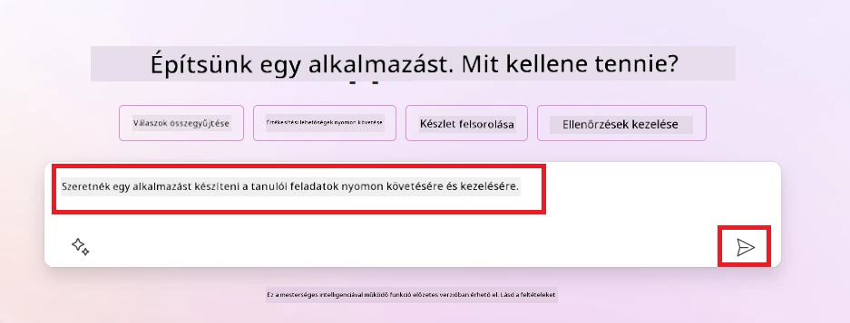

1. Az MI Copilot javasolni fog egy Dataverse táblát a szükséges mezőkkel az adatok tárolásához és néhány mintaadatot. Ezután testre szabhatod a táblát az MI Copilot asszisztens funkción keresztül beszélgetéses lépésekben.

   > **Fontos**: A Dataverse a Power Platform alatti adatplatform. Ez egy alacsony kódú adatplatform az alkalmazás adatainak tárolására. Teljesen kezelt szolgáltatás, amely biztonságosan tárolja az adatokat a Microsoft felhőjében és a Power Platform környezetedben van kiosztva. Beépített adatkezelési funkciókat kínál, mint például adat-osztályozás, adatszármaztatás, finomhangolt hozzáférés-vezérlés és még sok más. További információt a Dataverse-ről [itt](https://learn.microsoft.com/power-apps/maker/data-platform/data-platform-intro?WT.mc_id=academic-109639-somelezediko) találsz.

   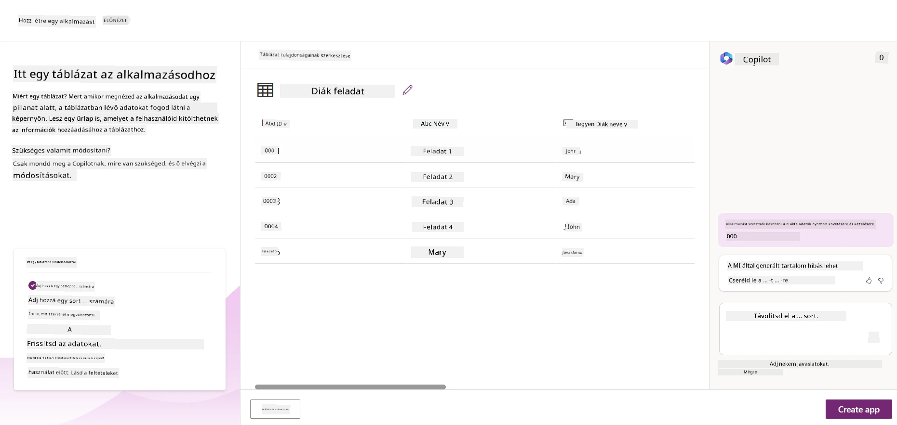

1. Az oktatók e-maileket szeretnének küldeni azoknak a diákoknak, akik leadták a feladatokat, hogy tájékoztassák őket a feladatok állapotáról. Használhatod a Copilotot, hogy új mezőt adj a táblához a diák e-mail címének tárolására. Például használhatod a következő promptot: **_Olyan oszlopot szeretnék hozzáadni, amely a diák e-mail címét tárolja_**. Kattints a **Küldés** gombra a prompt elküldéséhez az MI Copilotnak.

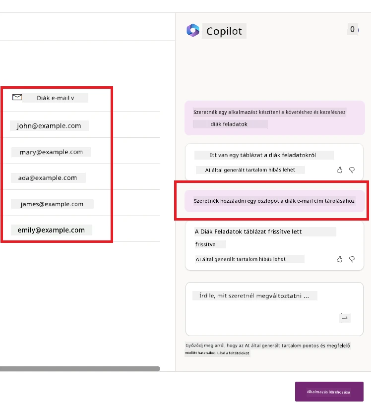

1. Az MI Copilot létrehozza az új mezőt, és utána testre szabhatod azt az igényeid szerint.

1. Miután elkészült a táblázattal, kattintson a **Alkalmazás létrehozása** gombra az alkalmazás létrehozásához.

1. Az AI Copilot a leírása alapján generál egy reszponzív Canvas alkalmazást. Ezután testre szabhatja az alkalmazást az igényeinek megfelelően.

1. Oktatók számára, akik emailt szeretnének küldeni a diákoknak, használhatják a Copilotot egy új képernyő hozzáadásához az alkalmazáshoz. Például az alábbi utasítást használhatja egy új képernyő hozzáadásához az alkalmazásban: **_Szeretnék egy képernyőt hozzáadni, hogy emailt küldhessek a diákoknak_**. Kattintson a **Küldés** gombra, hogy elküldje az utasítást az AI Copilotnak.

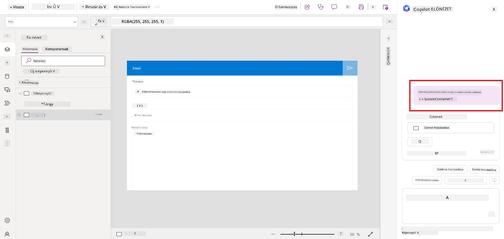

1. Az AI Copilot létrehoz egy új képernyőt, amelyet aztán testre szabhat az igényeinek megfelelően.

1. Miután elkészült az alkalmazással, kattintson a **Mentés** gombra az alkalmazás mentéséhez.

1. Az alkalmazás megosztásához az oktatókkal kattintson a **Megosztás** gombra, majd ismét kattintson a **Megosztás** gombra. Ezt követően megoszthatja az alkalmazást az oktatókkal, ha megadja az email címüket.

> **Házi feladat:** Az imént elkészített alkalmazás jó kezdet, de tovább fejleszthető. Az email funkcióval az oktatók csak manuálisan tudnak emailt küldeni a diákoknak, az email címek beírásával. Tudja használni a Copilotot egy olyan automatizálás létrehozásához, amely lehetővé teszi, hogy az oktatók automatikusan küldjenek emailt a diákoknak, amikor beadják a feladataikat? A tipp: a megfelelő utasítással használhatja a Copilotot a Power Automate-ban erre a célra.

### Számlainformációs tábla létrehozása a startupunk számára

A startup pénzügyi csapata problémákkal küzd a számlák nyomon követésében. Egy táblázatot használnak a számlák kezelésére, de ahogy a számlák száma nőtt, az irányítás egyre nehezebbé vált. Kérték öntől egy olyan tábla elkészítését, amely segít tárolni, nyomon követni és kezelni a beérkező számlák adatait. A táblázatot egy automatizálás alapjaként kell használni, amely kinyeri az összes számla információt és tárolja őket a táblázatban. A táblázatnak lehetővé kell tennie a pénzügyi csapat számára, hogy megtekinthessék a kifizetett és a kifizetésre váró számlákat egyaránt.

A Power Platform mögött egy adatplatform, a Dataverse áll, amely lehetővé teszi, hogy az alkalmazásokhoz és megoldásokhoz adatokat tároljon. A Dataverse egy alacsony kódú adatplatform az alkalmazások adatainak tárolásához. Teljesen kezelt szolgáltatás, amely biztonságosan tárolja az adatokat a Microsoft Cloud-ban, és a Power Platform környezetén belül kerül kiépítésre. Beépített adatkezelési képességekkel rendelkezik, mint például adat-osztályozás, adatok eredetének követése, finomhangolt hozzáférés-ellenőrzés és mások. További információkat talál [itt a Dataverse-ről](https://learn.microsoft.com/power-apps/maker/data-platform/data-platform-intro?WT.mc_id=academic-109639-somelezediko).

Miért érdemes Dataverse-t használni a startupunkban? A szabványos és egyedi táblák a Dataverse-ben biztonságos, felhőalapú tárhelyet biztosítanak az adatoknak. A táblák segítségével különböző típusú adatokat tárolhat, hasonlóan ahhoz, ahogy több munkalapot használ egyetlen Excel munkafüzetben. Használhat táblákat specifikus adatok tárolására a szervezet vagy üzleti igények szerint. A Dataverse használatából eredő előnyök startupunk számára többek között, de nem kizárólagosan:

- **Könnyen kezelhető**: Mind a metaadatokat, mind az adatokat a felhőben tárolják, így nem kell aggódnia, hogyan tárolják vagy kezelik őket. Az alkalmazások és megoldások építésére koncentrálhat.

- **Biztonságos**: A Dataverse biztonságos, felhőalapú tárhelyet biztosít az adatoknak. Szabályozhatja, ki férhet hozzá az adatokhoz a táblázataiban és hogyan férhet hozzájuk a szerepalapú biztonság segítségével.

- **Gazdag metaadatok**: Az adattípusok és kapcsolatok közvetlenül használhatók a Power Apps-ben.

- **Logika és érvényesítés**: Használhat üzleti szabályokat, számított mezőket és érvényesítési szabályokat az üzleti logika érvényesítésére és az adatok pontosságának fenntartására.

Most, hogy tudja, mi az a Dataverse és miért érdemes használni, nézzük meg, hogyan használhatja a Copilotot egy tábla létrehozásához a Dataverse-ben, amely megfelel a pénzügyi csapat igényeinek.

> **Megjegyzés** : A következő szakaszban ezt a táblát fogja használni egy automatizálás létrehozásához, amely kinyeri az összes számlainformációt és tárolja a táblázatban.

A Copilot segítségével a Dataverse-ben táblázat létrehozásához kövesse az alábbi lépéseket:

1. Navigáljon a [Power Apps](https://make.powerapps.com?WT.mc_id=academic-105485-koreyst) kezdőképernyőjére.

2. A bal oldali navigációs sávon válassza a **Táblázatok** menüpontot, majd kattintson a **Új táblázat leírása** gombra.

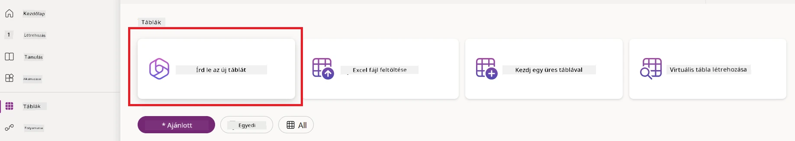

1. Az **Új tábla leírása** képernyőn a szövegmezőbe írja le a létrehozni kívánt táblázatot. Például: **_Egy számlainformációkat tároló táblát szeretnék létrehozni_**. Kattintson a **Küldés** gombra az utasítás elküldéséhez az AI Copilotnak.

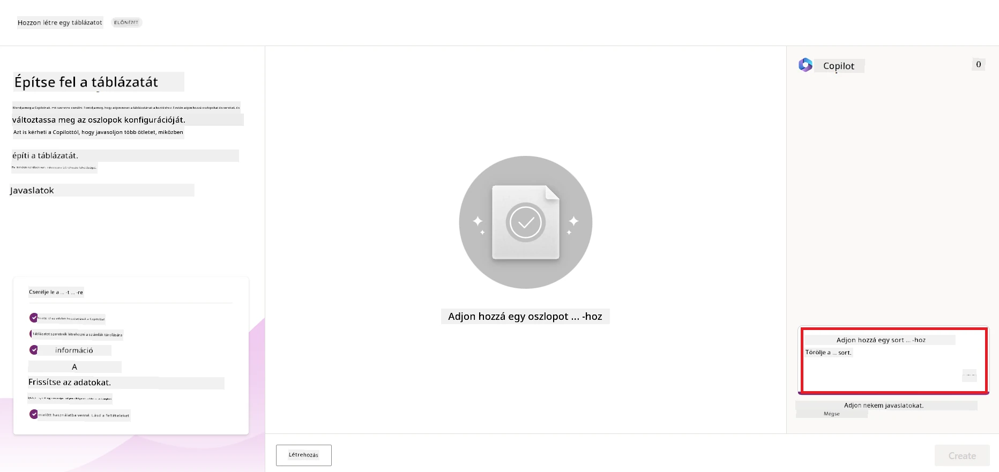

1. Az AI Copilot javasol egy Dataverse táblát a szükséges mezőkkel, hogy tárolja a követni kívánt adatokat, és néhány mintaadatot is bemutat. Ezután a Copilot asszisztens funkciójával párbeszédes lépésekben testre szabhatja a táblázatot az igényeinek megfelelően.

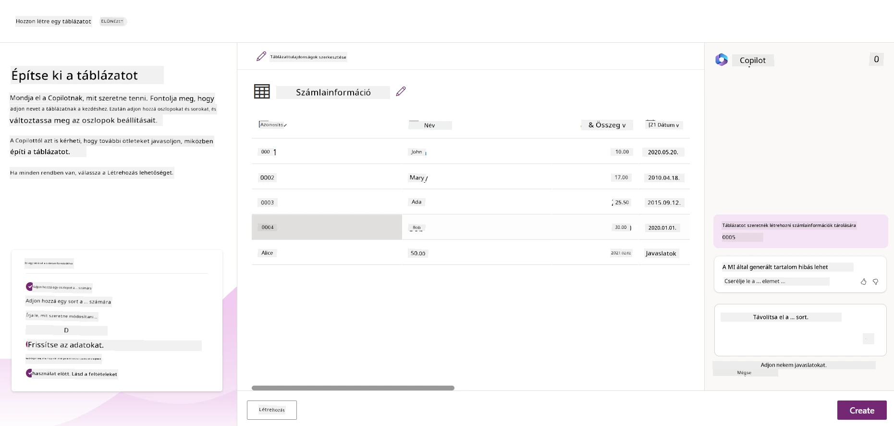

1. A pénzügyi csapat szeretne egy emailt küldeni a beszállítónak, hogy tájékoztassák a számla aktuális állapotáról. Használhatja a Copilotot, hogy egy új mezőt adjon a táblázathoz a beszállító email címének tárolására. Például az alábbi utasítást adhatja meg a mező hozzáadásához: **_Szeretnék egy oszlopot hozzáadni a beszállító email címének tárolásához_**. Kattintson a **Küldés** gombra az utasítás elküldéséhez az AI Copilotnak.

1. Az AI Copilot hozzáadja az új mezőt, amelyet aztán testre szabhat az igényeinek megfelelően.

1. Miután végzett a táblázattal, kattintson a **Létrehozás** gombra a tábla létrehozásához.

## AI modellek a Power Platform-ban az AI Builder-rel

Az AI Builder egy alacsony kódú AI funkció a Power Platformban, amely lehetővé teszi AI modellek használatát a folyamatok automatizálásához és eredmények előrejelzéséhez. Az AI Builder-rel AI-t hozhat létre az alkalmazásaiban és folyamataiban, amelyek adatokhoz csatlakoznak a Dataverse-ben vagy különböző felhőalapú adatforrásokban, mint például a SharePoint, OneDrive vagy Azure.

## Előre elkészített AI modellek vs Egyedi AI modellek

Az AI Builder kétféle AI modellt kínál: előre elkészített AI modelleket és egyedi AI modelleket. Az előre elkészített AI modellek készen állnak a használatra, a Microsoft által vannak betanítva és elérhetőek a Power Platformban. Ezek segítenek intelligenciát adni az alkalmazásokhoz és folyamatokhoz anélkül, hogy adatokat kellene gyűjtenie, majd saját modelleket építenie, tanítania és közzétennie. Ezekkel az automatizálhat folyamatokat és előre jelezhet eredményeket.

Néhány az előre elkészített AI modellek közül, amelyek elérhetőek a Power Platformban:

- **Kulcsfontosságú kifejezés kinyerése**: Ez a modell kulcsfontosságú kifejezéseket emel ki szövegből.
- **Nyelvfelismerés**: Ez a modell felismeri a szöveg nyelvét.
- **Hangulatelemzés**: Ez a modell azonosítja a pozitív, negatív, semleges vagy vegyes érzelmeket a szövegben.
- **Névjegykártya olvasó**: Ez a modell információkat emel ki névjegykártyákról.
- **Szövegfelismerés**: Ez a modell szöveget emel ki képekből.
- **Objektumfelismerés**: Ez a modell azonosít és emel ki objektumokat képekből.
- **Dokumentum feldolgozás**: Ez a modell űrlapokból emel ki információkat.
- **Számla feldolgozás**: Ez a modell számlákból emel ki információkat.

Egyedi AI modellekkel behozhatja saját modelljét az AI Builderbe, hogy úgy működjön, mint bármely egyedi AI Builder modell, lehetővé téve, hogy a modellt saját adataival tanítsa. Ezeket a modelleket használhatja folyamatok automatizálására és eredmények előrejelzésére a Power Apps és Power Automate-ben egyaránt. Saját modell használatakor bizonyos korlátok érvényesek. További információ a [korlátokról](https://learn.microsoft.com/ai-builder/byo-model#limitations?WT.mc_id=academic-105485-koreyst).

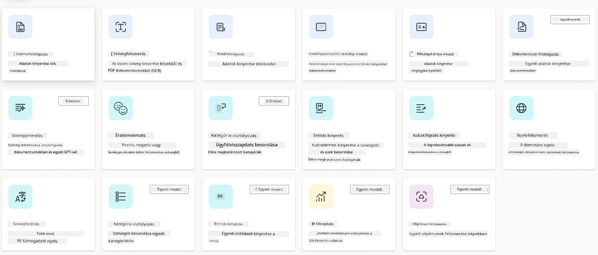

## 2. feladat - Számlafeldolgozó folyamat létrehozása our startupunk számára

A pénzügyi csapat problémákkal küzd a számlák feldolgozásában. Táblázatot használnak a számlák nyomon követésére, de amint a számlák száma nőtt, a kezelés egyre bonyolultabbá vált. Arra kértek, hogy építsen egy munkafolyamatot, amely segít a számlák feldolgozásában AI segítségével. A munkafolyamatnak lehetővé kell tennie az információ kinyerését a számlákból és az adatok tárolását egy Dataverse táblázatban. Továbbá a munkafolyamatnak lehetővé kell tennie, hogy emailt küldjenek a pénzügyi csapatnak a kinyert információkkal.

Most, hogy tudja, mi az az AI Builder és miért érdemes használni, nézzük meg, hogyan használhatja a Számlafeldolgozó AI modellt az AI Builderben, amelyről korábban már beszéltünk, a munkafolyamat létrehozásához, amely segít a pénzügyi csapatnak a számlák feldolgozásában.

A pénzügyi csapat számláit feldolgozó munkafolyamat létrehozásához az AI Builder Számlafeldolgozó AI modelljével az alábbi lépéseket kövesse:

1. Navigáljon a [Power Automate](https://make.powerautomate.com?WT.mc_id=academic-105485-koreyst) kezdőképernyőjére.

2. A kezdőképernyőn lévő szövegmezőben írja le a létrehozni kívánt munkafolyamatot. Például: **_Számla feldolgozása, amikor megérkezik a postafiókomba_**. Kattintson a **Küldés** gombra az utasítás elküldéséhez az AI Copilot-nak.

   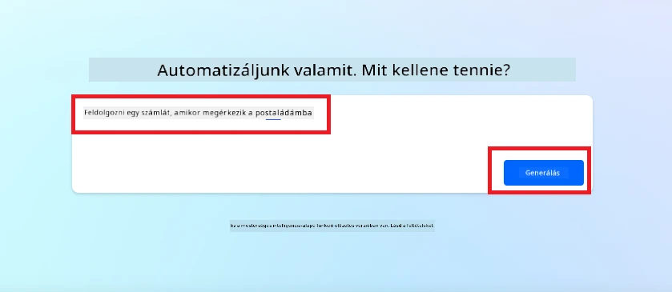

3. Az AI Copilot javasolja azokat a műveleteket, amelyeket el kell végeznie a feladat automatizálásához. Kattintson a **Tovább** gombra a következő lépések megtekintéséhez.

4. A következő lépésben a Power Automate felszólítja a munkafolyamathoz szükséges kapcsolatok beállítására. Miután elkészült, kattintson a **Folyamat létrehozása** gombra.

5. Az AI Copilot létrehozza a folyamatot, amelyet aztán testre szabhat az igényeinek megfelelően.

6. Frissítse a folyamat indítóját és állítsa be a **Mappa** értékét arra a mappára, ahol a számlák tárolva lesznek. Például állítsa a mappát a **Beérkezett üzenetek**-re. Kattintson a **Speciális beállítások megjelenítése** pontra, és állítsa a **Csak mellékletes levelek** opciót **Igen** értékre. Ez biztosítja, hogy a folyamat csak akkor fusson, ha mellékletet tartalmazó email érkezik a mappába.

7. Távolítsa el a következő műveleteket a folyamatból: **HTML szöveggé**, **Összeállítás**, **Összeállítás 2**, **Összeállítás 3** és **Összeállítás 4**, mert ezekre nem lesz szüksége.

8. Távolítsa el a **Feltétel** műveletet is a folyamatból, mert azt sem fogja használni. Az alábbi képernyőképhez hasonlóan kell kinéznie:

   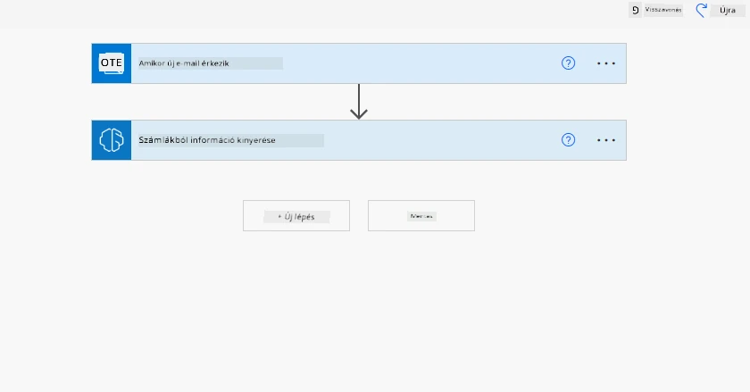

9. Kattintson az **Új művelet hozzáadása** gombra, majd keressen rá a **Dataverse** kifejezésre. Válassza az **Új sor hozzáadása** műveletet.

10. Az **Információk kinyerése számlákból** műveletben frissítse a **Számla fájl** beállítást úgy, hogy a **Melléklet tartalma** legyen megadva az emailből. Ez biztosítja, hogy a folyamat a számla mellékletéből nyerje ki az információkat.

11. Válassza ki az előzőleg létrehozott **Táblázatot**. Például választhatja a **Számlainformáció** táblát. Az előző művelet dinamikus tartalmát használja az alábbi mezők kitöltésére:

    - Azonosító (ID)
    - Összeg
    - Dátum
    - Név
    - Állapot - Állítsa az **Állapot** mezőt **Függőben** értékre.
    - Beszállító email cím - Használja a **Feladó** dinamikus tartalmat az **Új email érkezésekor** indítóból.

    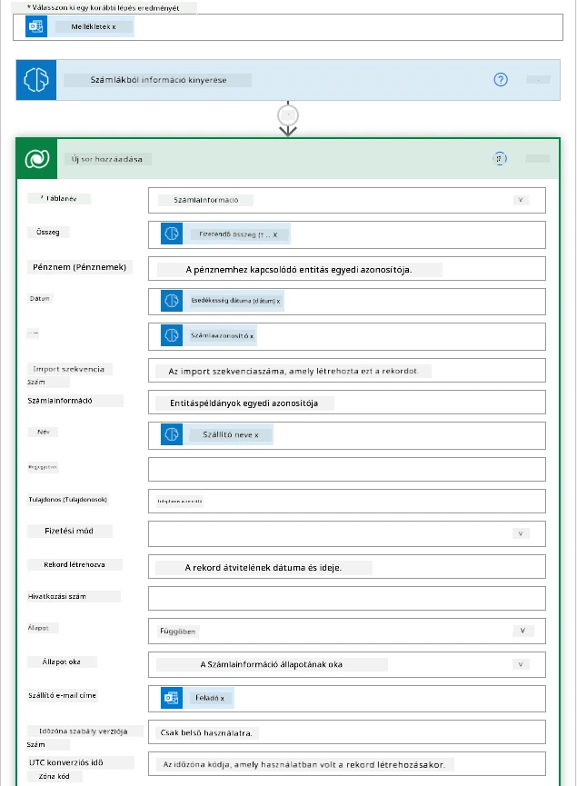

12. Miután elkészült a folyamattal, kattintson a **Mentés** gombra az elmentéshez. Ezután tesztelheti a folyamatot, ha a megadott mappába számlát tartalmazó emailt küld.

> **Házi feladat:** Az imént elkészített folyamat jó kezdet, most pedig gondolkodjon el azon, hogy hogyan készíthet olyan automatizálást, amely lehetővé teszi a pénzügyi csapat számára, hogy emailt küldjenek a beszállítónak a számla aktuális állapotáról. Tipp: a folyamatnak akkor kell futnia, amikor a számla állapota megváltozik.

## Szöveg generálása AI modellel a Power Automate-ban

Az AI Builder Create Text with GPT AI modellje lehetővé teszi, hogy bemeneti utasítás alapján szöveget generáljon, és a Microsoft Azure OpenAI Service hajtja végre. Ezzel a képességgel GPT (Generatív Előzetesen Betanított Transformer) technológiát építhet be az alkalmazásaiba és folyamataiba, hogy számos automatizált folyamatot és hasznos alkalmazást hozzon létre.

A GPT modelleket hatalmas adatmennyiségen tanítják, ami lehetővé teszi számukra, hogy bemeneti utasítás esetén olyan szövegeket állítsanak elő, amelyek nagyon hasonlítanak az emberi nyelvre. A munkafolyamat automatizációval integrálva az olyan AI modellek, mint a GPT, széles körű feladatok egyszerűsítésére és automatizálására használhatók.

Például létrehozhat olyan folyamatokat, amelyek automatikusan szöveget generálnak különféle célokra, például email tervezetekhez, termékleírásokhoz és még sok máshoz. A modellt használhatja különféle alkalmazásokban is, például chatbotokban és ügyfélszolgálati alkalmazásokban, amelyek lehetővé teszik az ügyfélszolgálati munkatársak számára, hogy hatékonyan és eredményesen válaszoljanak az ügyfélmegkeresésekre.

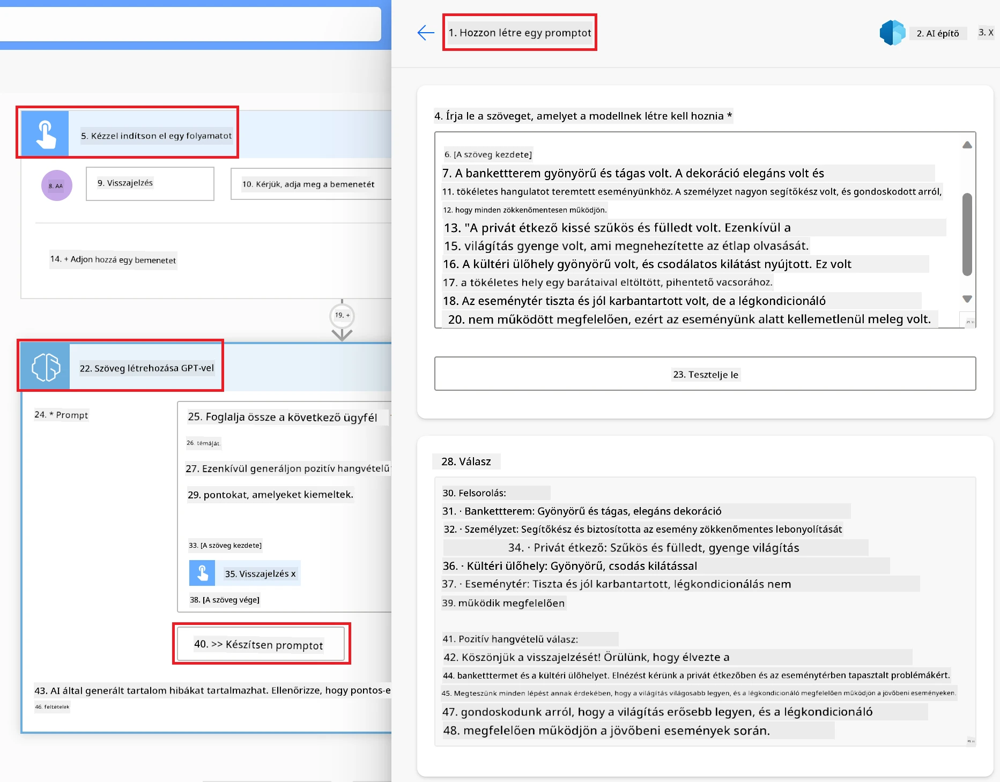

Ha meg szeretné tanulni, hogyan használja ezt a mesterséges intelligencia modellt a Power Automatében, tekintse át az [Add intelligence with AI Builder and GPT](https://learn.microsoft.com/training/modules/ai-builder-text-generation/?WT.mc_id=academic-109639-somelezediko) modult.

## Remek munka! Folytassa a tanulást

A lecke elvégzése után nézze meg a [Generatív MI tanulási gyűjteményünket](https://aka.ms/genai-collection?WT.mc_id=academic-105485-koreyst), hogy tovább fejlessze generatív MI tudását!

Szeretné testre szabni és többet kihozni a Copilotból? Fedezze fel az [Awesome Copilot](https://github.com/github/awesome-copilot?WT.mc_id=academic-105485-koreyst) gyűjteményt — egy közösség által hozzájárult utasítások, ügynökök, készségek és konfigurációk gyűjteményét, amely segít a GitHub Copilot maximális kihasználásában.

Ugorjon át a 11. leckére, ahol megnézzük, hogyan lehet [integrálni a generatív MI-t függvényhívással](../11-integrating-with-function-calling/README.md?WT.mc_id=academic-105485-koreyst)!

---

<!-- CO-OP TRANSLATOR DISCLAIMER START -->
**Jogi nyilatkozat**:
Ez a dokumentum az AI fordítási szolgáltatás, a [Co-op Translator](https://github.com/Azure/co-op-translator) segítségével készült. Bár az pontosságra törekszünk, kérjük, vegye figyelembe, hogy az automatikus fordítások hibákat vagy pontatlanságokat tartalmazhatnak. Az eredeti dokumentum az anyanyelvén tekintendő hiteles forrásnak. Fontos információk esetén professzionális emberi fordítást javasolunk. Nem vállalunk felelősséget semmilyen félreértésért vagy téves értelmezésért, amely ebből a fordításból ered.
<!-- CO-OP TRANSLATOR DISCLAIMER END -->