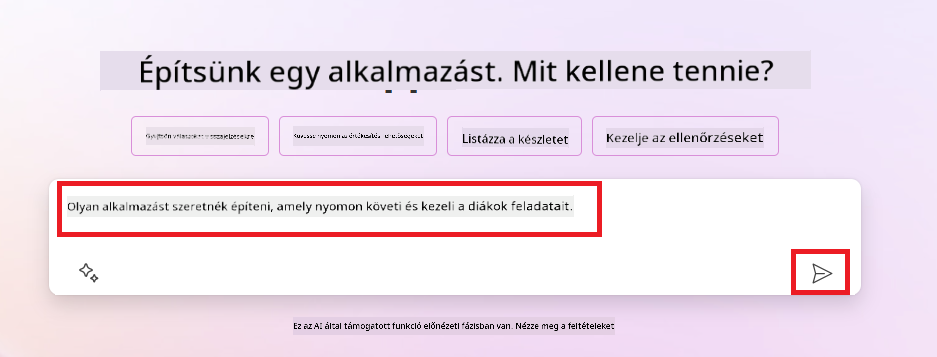
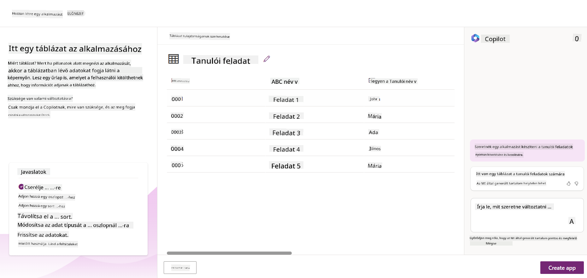
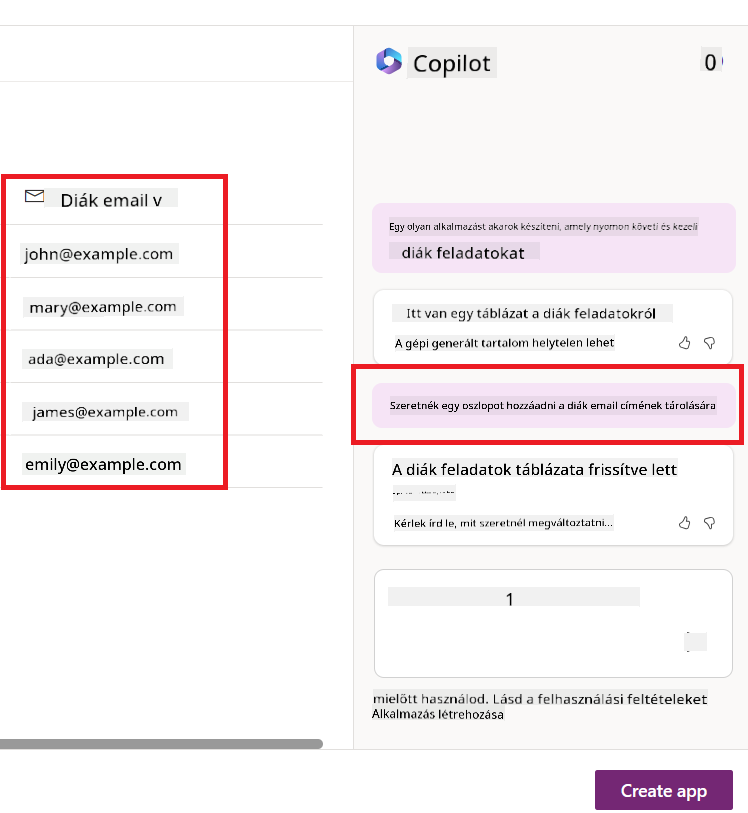
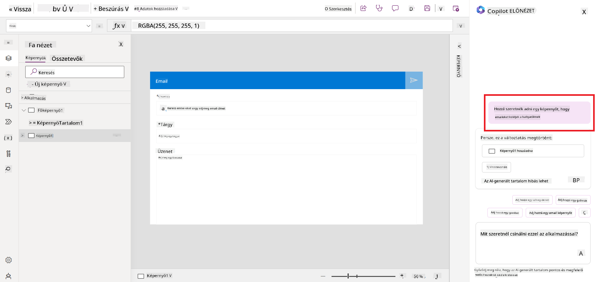

<!--
CO_OP_TRANSLATOR_METADATA:
{
  "original_hash": "f5ff3b6204a695a117d6f452403c95f7",
  "translation_date": "2025-06-25T19:16:28+00:00",
  "source_file": "10-building-low-code-ai-applications/README.md",
  "language_code": "hu"
}
-->
# Alacsony kódú AI alkalmazások építése

> _(Kattints a fenti képre a leckéhez tartozó videó megtekintéséhez)_

## Bevezetés

Most, hogy megtanultuk, hogyan építsünk képgeneráló alkalmazásokat, beszéljünk az alacsony kódról. A generatív AI számos területen alkalmazható, beleértve az alacsony kódot is, de mi is az az alacsony kód, és hogyan adhatunk hozzá AI-t?

Az alkalmazások és megoldások építése könnyebbé vált a hagyományos fejlesztők és nem fejlesztők számára az alacsony kódú fejlesztési platformok használatával. Az alacsony kódú fejlesztési platformok lehetővé teszik, hogy kevés vagy semmilyen kód használatával építsünk alkalmazásokat és megoldásokat. Ezt úgy érik el, hogy egy vizuális fejlesztési környezetet biztosítanak, amely lehetővé teszi a komponensek húzását és dobását az alkalmazások és megoldások építéséhez. Ezáltal gyorsabban és kevesebb erőforrással építhetünk alkalmazásokat és megoldásokat. Ebben a leckében mélyebben belemerülünk az alacsony kód használatába és az alacsony kódú fejlesztés AI-val való fejlesztésébe a Power Platform használatával.

A Power Platform lehetőséget biztosít a szervezetek számára, hogy csapataik saját megoldásokat építsenek egy intuitív alacsony kódú vagy kódmentes környezetben. Ez a környezet segít egyszerűsíteni a megoldások építésének folyamatát. A Power Platformmal a megoldások napok vagy hetek alatt építhetők, hónapok vagy évek helyett. A Power Platform öt kulcsfontosságú termékből áll: Power Apps, Power Automate, Power BI, Power Pages és Copilot Studio.

Ez a lecke a következőket tartalmazza:

- Bevezetés a generatív AI-ba a Power Platformban
- Bevezetés a Copilotba és annak használata
- Generatív AI használata alkalmazások és folyamatok építésére a Power Platformban
- AI modellek megértése a Power Platformban az AI Builderrel

## Tanulási célok

A lecke végére képes leszel:

- Megérteni, hogyan működik a Copilot a Power Platformban.

- Építeni egy diákfeladat nyomkövető alkalmazást oktatási startupunk számára.

- Építeni egy számlafeldolgozó folyamatot, amely AI-t használ a számlákból származó információk kinyerésére.

- Alkalmazni a legjobb gyakorlatokat a GPT AI modellel való szöveg létrehozásakor.

Az eszközök és technológiák, amelyeket ebben a leckében használni fogsz:

- **Power Apps**, a diákfeladat nyomkövető alkalmazáshoz, amely alacsony kódú fejlesztési környezetet biztosít az alkalmazások építéséhez, hogy nyomon követhessük, kezeljük és interakcióba lépjünk az adatokkal.

- **Dataverse**, az adatok tárolására a diákfeladat nyomkövető alkalmazáshoz, ahol a Dataverse alacsony kódú adatplatformot biztosít az alkalmazás adatainak tárolására.

- **Power Automate**, a számlafeldolgozó folyamathoz, ahol alacsony kódú fejlesztési környezetet kapsz a munkafolyamatok építéséhez a számlafeldolgozási folyamat automatizálásához.

- **AI Builder**, a számlafeldolgozó AI modellhez, ahol előre elkészített AI modelleket használsz a startupunk számláinak feldolgozására.

## Generatív AI a Power Platformban

Az alacsony kódú fejlesztés és alkalmazások generatív AI-val való fejlesztése kulcsfontosságú terület a Power Platform számára. A cél az, hogy mindenki képes legyen AI-val ellátott alkalmazásokat, weboldalakat, irányítópultokat építeni és automatizálni folyamatokat AI-val, _anélkül, hogy bármilyen adat tudományi szakértelemre lenne szükség_. Ezt a célt úgy érik el, hogy a generatív AI-t integrálják az alacsony kódú fejlesztési élménybe a Power Platformban a Copilot és az AI Builder formájában.

### Hogyan működik ez?

A Copilot egy AI asszisztens, amely lehetővé teszi, hogy a Power Platform megoldásait építsd meg úgy, hogy természetes nyelven leírod a követelményeidet egy sor beszélgetési lépésben. Például utasíthatod az AI asszisztenst, hogy mondja meg, milyen mezőket fog használni az alkalmazásod, és létrehozza az alkalmazást és az alatta lévő adatmodellt, vagy megadhatod, hogyan állítsd be a folyamatot a Power Automate-ban.

A Copilot által vezérelt funkciókat használhatod az alkalmazás képernyőin, hogy a felhasználók felfedezhessék az információkat beszélgetési interakciók révén.

Az AI Builder egy alacsony kódú AI képesség, amely elérhető a Power Platformban, és lehetővé teszi, hogy AI modelleket használj a folyamatok automatizálására és az eredmények előrejelzésére. Az AI Builderrel AI-t hozhatsz az alkalmazásaidba és folyamataidba, amelyek csatlakoznak a Dataverse-ben vagy különböző felhőalapú adatforrásokban, például SharePoint, OneDrive vagy Azure.

A Copilot elérhető a Power Platform összes termékében: Power Apps, Power Automate, Power BI, Power Pages és Power Virtual Agents. Az AI Builder elérhető a Power Apps és a Power Automate-ban. Ebben a leckében arra összpontosítunk, hogyan használhatjuk a Copilotot és az AI Builder-t a Power Apps-ban és a Power Automate-ban, hogy megoldást építsünk oktatási startupunk számára.

### Copilot a Power Apps-ban

A Power Platform részeként a Power Apps alacsony kódú fejlesztési környezetet biztosít az alkalmazások építéséhez, hogy nyomon követhessük, kezeljük és interakcióba lépjünk az adatokkal. Ez egy alkalmazásfejlesztési szolgáltatáscsomag, amely skálázható adatplatformmal rendelkezik, és képes csatlakozni felhőszolgáltatásokhoz és helyszíni adatokhoz. A Power Apps lehetővé teszi, hogy böngészőkön, táblagépeken és telefonokon futó alkalmazásokat építs, és megoszthasd azokat munkatársaiddal. A Power Apps egyszerű felülettel vezeti be a felhasználókat az alkalmazásfejlesztésbe, így minden üzleti felhasználó vagy profi fejlesztő egyedi alkalmazásokat építhet. Az alkalmazásfejlesztési élményt a Copilot generatív AI is javítja.

A Copilot AI asszisztens funkció a Power Apps-ban lehetővé teszi, hogy leírd, milyen típusú alkalmazásra van szükséged, és milyen információkat szeretnél, hogy az alkalmazásod kövesse, gyűjtse vagy megjelenítse. A Copilot ezután egy reszponzív Canvas alkalmazást generál a leírásod alapján. Ezután testre szabhatod az alkalmazást, hogy megfeleljen az igényeidnek. Az AI Copilot azt is generálja és javasolja, hogy milyen Dataverse táblát használj a szükséges mezőkkel, hogy tárolhasd az adatokat, amelyeket nyomon szeretnél követni, és néhány mintaadatot. Később megnézzük, mi az a Dataverse és hogyan használhatod a Power Apps-ban ebben a leckében. Ezután testre szabhatod a táblát, hogy megfeleljen az igényeidnek az AI Copilot asszisztens funkció használatával beszélgetési lépéseken keresztül. Ez a funkció könnyen elérhető a Power Apps kezdőképernyőjéről.

### Copilot a Power Automate-ban

A Power Platform részeként a Power Automate lehetővé teszi a felhasználók számára, hogy automatizált munkafolyamatokat hozzanak létre az alkalmazások és szolgáltatások között. Segít automatizálni az ismétlődő üzleti folyamatokat, mint például a kommunikáció, adatgyűjtés és döntési jóváhagyások. Egyszerű felülete lehetővé teszi, hogy minden technikai képességgel rendelkező felhasználó (a kezdőktől a tapasztalt fejlesztőkig) automatizálja a munkafeladatokat. A munkafolyamat-fejlesztési élményt a Copilot generatív AI is javítja.

A Copilot AI asszisztens funkció a Power Automate-ban lehetővé teszi, hogy leírd, milyen típusú folyamatra van szükséged, és milyen műveleteket szeretnél, hogy a folyamatod végrehajtson. A Copilot ezután egy folyamatot generál a leírásod alapján. Ezután testre szabhatod a folyamatot, hogy megfeleljen az igényeidnek. Az AI Copilot azt is generálja és javasolja, hogy milyen műveletekre van szükséged a feladat végrehajtásához, amelyet automatizálni szeretnél. Később megnézzük, mi az a folyamat és hogyan használhatod a Power Automate-ban ebben a leckében. Ezután testre szabhatod a műveleteket, hogy megfeleljenek az igényeidnek az AI Copilot asszisztens funkció használatával beszélgetési lépéseken keresztül. Ez a funkció könnyen elérhető a Power Automate kezdőképernyőjéről.

## Feladat: Diákfeladatok és számlák kezelése startupunk számára, Copilot használatával

Startupunk online kurzusokat kínál diákoknak. A startup gyorsan növekedett, és most már nehezen tud lépést tartani a kurzusok iránti kereslettel. A startup felvett téged, mint Power Platform fejlesztőt, hogy segíts nekik egy alacsony kódú megoldás építésében, amely segít nekik kezelni a diákfeladatokat és számlákat. A megoldásnak képesnek kell lennie arra, hogy nyomon kövesse és kezelje a diákfeladatokat egy alkalmazáson keresztül, és automatizálja a számlafeldolgozási folyamatot egy munkafolyamaton keresztül. Kérték, hogy generatív AI-t használj a megoldás fejlesztéséhez.

Amikor elkezdesz dolgozni a Copilot használatával, használhatod a [Power Platform Copilot Prompt Library](https://github.com/pnp/powerplatform-prompts?WT.mc_id=academic-109639-somelezediko) könyvtárat, hogy elkezdj dolgozni az utasításokkal. Ez a könyvtár tartalmaz egy listát az utasításokról, amelyeket használhatsz az alkalmazások és folyamatok építéséhez a Copilot segítségével. Az utasításokat a könyvtárban is használhatod, hogy ötletet kapj arról, hogyan írd le a követelményeidet a Copilotnak.

### Építs diákfeladat nyomkövető alkalmazást startupunk számára

A startup oktatói nehezen tudják nyomon követni a diákfeladatokat. Eddig egy táblázatot használtak a feladatok nyomon követésére, de ez nehézkessé vált, ahogy a diákok száma növekedett. Megkértek, hogy építs egy alkalmazást, amely segít nekik nyomon követni és kezelni a diákfeladatokat. Az alkalmazásnak lehetővé kell tennie számukra, hogy új feladatokat adjanak hozzá, megtekintsék a feladatokat, frissítsék a feladatokat és töröljék a feladatokat. Az alkalmazásnak azt is lehetővé kell tennie az oktatók és diákok számára, hogy megtekintsék az értékelt és nem értékelt feladatokat.

Az alkalmazást a Copilot segítségével fogod építeni a Power Apps-ban az alábbi lépések követésével:

1. Navigálj a [Power Apps](https://make.powerapps.com?WT.mc_id=academic-105485-koreyst) kezdőképernyőjére.

1. Használd a szövegterületet a kezdőképernyőn, hogy leírd, milyen alkalmazást szeretnél építeni. Például, **_Szeretnék egy alkalmazást építeni a diákfeladatok nyomon követésére és kezelésére_**. Kattints a **Küldés** gombra, hogy elküldd az utasítást az AI Copilotnak.

1. Az AI Copilot javasolni fog egy Dataverse táblát a szükséges mezőkkel, hogy tárolhasd az adatokat, amelyeket nyomon szeretnél követni, és néhány mintaadatot. Ezután testre szabhatod a táblát, hogy megfeleljen az igényeidnek az AI Copilot asszisztens funkció használatával beszélgetési lépéseken keresztül.

   > **Fontos**: A Dataverse a Power Platform alatta lévő adatplatformja. Ez egy alacsony kódú adatplatform az alkalmazás adatainak tárolására. Ez egy teljesen kezelt szolgáltatás, amely biztonságosan tárolja az adatokat a Microsoft Cloud-ban, és a Power Platform környezetedben van kiépítve. Beépített adatirányítási képességekkel rendelkezik, mint például adatbesorolás, adatszármazás, finomhangolt hozzáférés-vezérlés és mások. További információt a Dataverse-ről [itt](https://docs.microsoft.com/powerapps/maker/data-platform/data-platform-intro?WT.mc_id=academic-109639-somelezediko) találhatsz.

   

1. Az oktatók szeretnének e-maileket küldeni a diákoknak, akik benyújtották a feladataikat, hogy tájékoztassák őket a feladataik előrehaladásáról. Használhatod a Copilotot, hogy hozzáadj egy új mezőt a táblához a diák e-mail tárolására. Például, használhatod a következő utasítást egy új mező hozzáadásához a táblához: **_Szeretnék hozzáadni egy oszlopot a diák e-mail tárolására_**. Kattints a **Küldés** gombra, hogy elküldd az utasítást az AI Copilotnak.

1. Az AI Copilot generál egy új mezőt, és ezután testre szabhatod a mezőt, hogy megfeleljen az igényeidnek.

1. Ha kész vagy a táblával, kattints a **Alkalmazás létrehozása** gombra, hogy létrehozd az alkalmazást.

1. Az AI Copilot generál egy reszponzív Canvas alkalmazást a leírásod alapján. Ezután testre szabhatod az alkalmazást, hogy megfeleljen az igényeidnek.

1. Az oktatók számára, hogy e-maileket küldhessenek a diákoknak, használhatod a Copilotot, hogy hozzáadj egy új képernyőt az alkalmazáshoz. Például, használhatod a következő utasítást egy új képernyő hozzáadásához az alkalmazáshoz: **_Szeretnék hozzáadni egy képernyőt, hogy e-maileket küldhessek a diákoknak_**. Kattints a **Küldés** gombra, hogy elküldd az utasítást az AI Copilotnak.

1. Az AI Copilot generál egy új képernyőt, és ezután testre szabhatod a képernyőt, hogy megfeleljen az igényeidnek.

1. Ha kész vagy az alkalmazással, kattints a **Ment
- **Érzelemfelismerés**: Ez a modell pozitív, negatív, semleges vagy vegyes érzelmeket azonosít a szövegben.
- **Névjegykártya-olvasó**: Ez a modell információt nyer ki névjegykártyákról.
- **Szövegfelismerés**: Ez a modell szöveget nyer ki képekből.
- **Tárgyfelismerés**: Ez a modell tárgyakat azonosít és nyer ki képekből.
- **Dokumentumfeldolgozás**: Ez a modell űrlapokból nyer ki információt.
- **Számlafeldolgozás**: Ez a modell számlákból nyer ki információt.

A Custom AI Models segítségével saját modelljét beviheti az AI Builderbe, így az bármely AI Builder egyéni modellként működhet, lehetővé téve, hogy a saját adataival képezze ki a modellt. Ezeket a modelleket használhatja folyamatok automatizálására és eredmények előrejelzésére mind a Power Apps, mind a Power Automate esetében. Saját modell használata esetén korlátozások érvényesek. Olvasson többet ezekről a [korlátozásokról](https://learn.microsoft.com/ai-builder/byo-model#limitations?WT.mc_id=academic-105485-koreyst).

## Feladat #2 - Számlafeldolgozó folyamat építése a startupunk számára

A pénzügyi csapat nehézségekbe ütközött a számlák feldolgozása során. Táblázatot használtak a számlák nyomon követésére, de ez kezelhetetlenné vált a számlák számának növekedésével. Kértek, hogy építsen egy munkafolyamatot, amely segít nekik a számlák AI-alapú feldolgozásában. A munkafolyamatnak lehetővé kell tennie számukra, hogy információt nyerjenek ki a számlákból, és tárolják azt egy Dataverse táblában. A munkafolyamatnak lehetővé kell tennie azt is, hogy e-mailt küldjenek a pénzügyi csapatnak a kinyert információkkal.

Most, hogy tudja, mi az AI Builder és miért érdemes használni, nézzük meg, hogyan használhatja a Számlafeldolgozó AI modellt az AI Builderben, amelyről korábban már szó volt, hogy építsen egy munkafolyamatot, amely segít a pénzügyi csapatnak a számlák feldolgozásában.

A következő lépéseket követve építhet munkafolyamatot, amely segít a pénzügyi csapatnak a számlák feldolgozásában az AI Builder Számlafeldolgozó AI modelljének használatával:

1. Navigáljon a [Power Automate](https://make.powerautomate.com?WT.mc_id=academic-105485-koreyst) kezdőképernyőjére.
2. Használja a kezdőképernyőn található szövegmezőt a létrehozni kívánt munkafolyamat leírására. Például: **_Feldolgozzon egy számlát, amikor megérkezik a postafiókomba_**. Kattintson a **Küldés** gombra, hogy elküldje a kérést az AI Copilotnak.
3. Az AI Copilot javaslatot tesz azokra a lépésekre, amelyeket végre kell hajtania a feladat automatizálásához. Kattinthat a **Következő** gombra a további lépések megtekintéséhez.
4. A következő lépésben a Power Automate felkéri, hogy állítsa be a folyamathoz szükséges kapcsolatokat. Ha végzett, kattintson a **Folyamat létrehozása** gombra a folyamat létrehozásához.
5. Az AI Copilot generál egy folyamatot, és testre szabhatja a saját igényeinek megfelelően.
6. Frissítse a folyamat indítóját, és állítsa be a **Mappa** elemet arra a mappára, ahol a számlák tárolva lesznek. Például beállíthatja a mappát **Bejövő üzenetek**-re. Kattintson a **Speciális beállítások megjelenítése** gombra, és állítsa be a **Csak mellékletekkel** opciót **Igen**-re. Ez biztosítja, hogy a folyamat csak akkor fusson, ha egy melléklettel ellátott e-mail érkezik a mappába.
7. Távolítsa el a következő műveleteket a folyamatból: **HTML szöveggé**, **Összeállítás**, **Összeállítás 2**, **Összeállítás 3** és **Összeállítás 4**, mert nem fogja használni őket.
8. Távolítsa el a **Feltétel** műveletet a folyamatból, mert nem fogja használni. Így kell kinéznie, mint az alábbi képernyőképen:
9. Kattintson a **Művelet hozzáadása** gombra, és keressen rá a **Dataverse** kifejezésre. Válassza ki az **Új sor hozzáadása** műveletet.
10. A **Kinyerés számlákból** műveletnél frissítse a **Számlafájl** elemet, hogy az az e-mail melléklet tartalmára mutasson. Ez biztosítja, hogy a folyamat kinyerje az információt a számla mellékletéből.
11. Válassza ki a korábban létrehozott **Táblát**. Például választhatja a **Számlainformáció** táblát. Válassza ki a dinamikus tartalmat az előző műveletből a következő mezők kitöltéséhez:
    - Azonosító
    - Összeg
    - Dátum
    - Név
    - Állapot
    - Állítsa az **Állapotot** **Függőben** állapotra.
    - Szállító e-mail
    - Használja a **Feladó** dinamikus tartalmat a **Mikor új e-mail érkezik** indítóból.
12. Ha végzett a folyamattal, kattintson a **Mentés** gombra a folyamat mentéséhez. Ezután tesztelheti a folyamatot úgy, hogy egy számlát tartalmazó e-mailt küld a megadott mappába.

> **A házi feladatod**: Az elkészített folyamat jó kezdet, most gondolkodjon el azon, hogyan építhetne egy automatizációt, amely lehetővé teszi a pénzügyi csapat számára, hogy e-mailt küldjön a szállítónak, hogy tájékoztassa őket számlájuk aktuális állapotáról. Tipp: a folyamatnak akkor kell futnia, amikor a számla állapota megváltozik.

## Szöveggeneráló AI Modell használata a Power Automate-ben

A GPT AI Modell szöveg létrehozása az AI Builderben lehetővé teszi, hogy egy kérés alapján szöveget generáljon, és a Microsoft Azure OpenAI Service hajtja végre. Ezzel a képességgel beépítheti a GPT (Generative Pre-Trained Transformer) technológiát alkalmazásaiba és folyamataiba, hogy különféle automatizált folyamatokat és betekintő alkalmazásokat építsen.

A GPT modellek kiterjedt képzésen esnek át hatalmas adatmennyiségeken, lehetővé téve számukra, hogy az emberi nyelvet szorosan megközelítő szöveget hozzanak létre, amikor kérés érkezik hozzájuk. Amikor a munkafolyamat automatizálással integrálják, az AI modellek, mint a GPT, kihasználhatók a feladatok széles körének egyszerűsítésére és automatizálására.

Például készíthet folyamatokat, amelyek automatikusan generálnak szöveget különféle felhasználási esetekhez, mint például: e-mail vázlatok, termékleírások és még sok más. A modellt használhatja szöveg generálására különféle alkalmazásokhoz is, például chatbotokhoz és ügyfélszolgálati alkalmazásokhoz, amelyek lehetővé teszik az ügyfélszolgálati munkatársak számára, hogy hatékonyan és eredményesen válaszoljanak az ügyfél kérdéseire.

A GPT AI Modell Power Automate-ben való használatának megtanulásához nézze át az [Intelligencia hozzáadása az AI Builderrel és GPT-vel](https://learn.microsoft.com/training/modules/ai-builder-text-generation/?WT.mc_id=academic-109639-somelezediko) modult.

## Nagyszerű munka! Folytassa a tanulást

A lecke befejezése után nézze meg [Generatív AI tanulási gyűjteményünket](https://aka.ms/genai-collection?WT.mc_id=academic-105485-koreyst), hogy tovább fejlessze Generatív AI ismereteit!

Lépjen át a 11. leckére, ahol megvizsgáljuk, hogyan [integrálhatjuk a Generatív AI-t a funkcióhívásokkal](../11-integrating-with-function-calling/README.md?WT.mc_id=academic-105485-koreyst)!

**Jogi nyilatkozat**:  
Ezt a dokumentumot az AI fordítószolgáltatás, a [Co-op Translator](https://github.com/Azure/co-op-translator) segítségével fordították le. Bár törekszünk a pontosságra, kérjük, vegye figyelembe, hogy az automatikus fordítások hibákat vagy pontatlanságokat tartalmazhatnak. Az eredeti dokumentumot annak eredeti nyelvén kell tekinteni a hiteles forrásnak. Kritikus információk esetén ajánlott a professzionális emberi fordítás. Nem vállalunk felelősséget a fordítás használatából eredő félreértésekért vagy félreértelmezésekért.