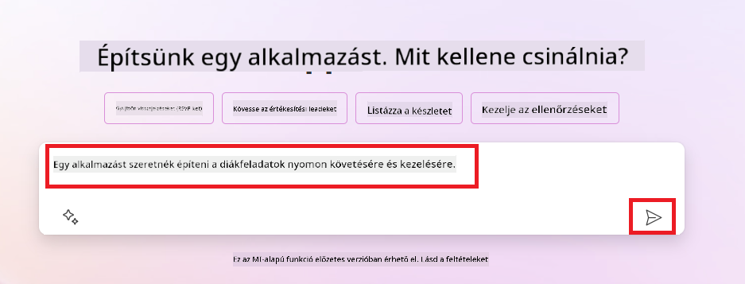
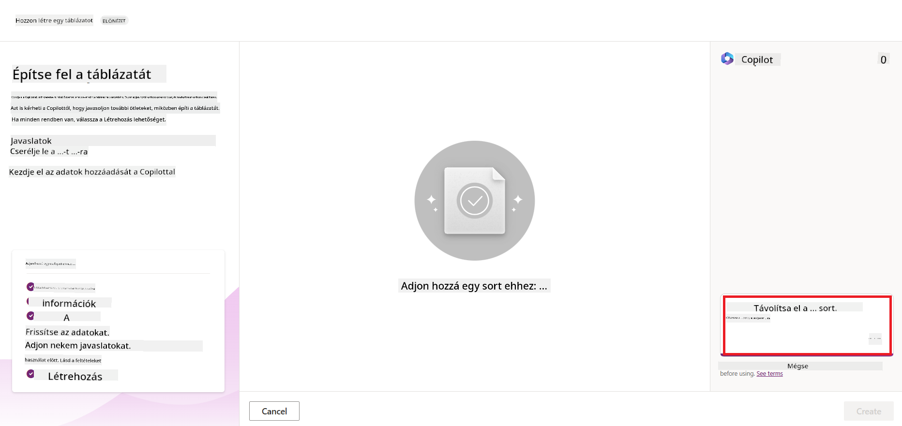
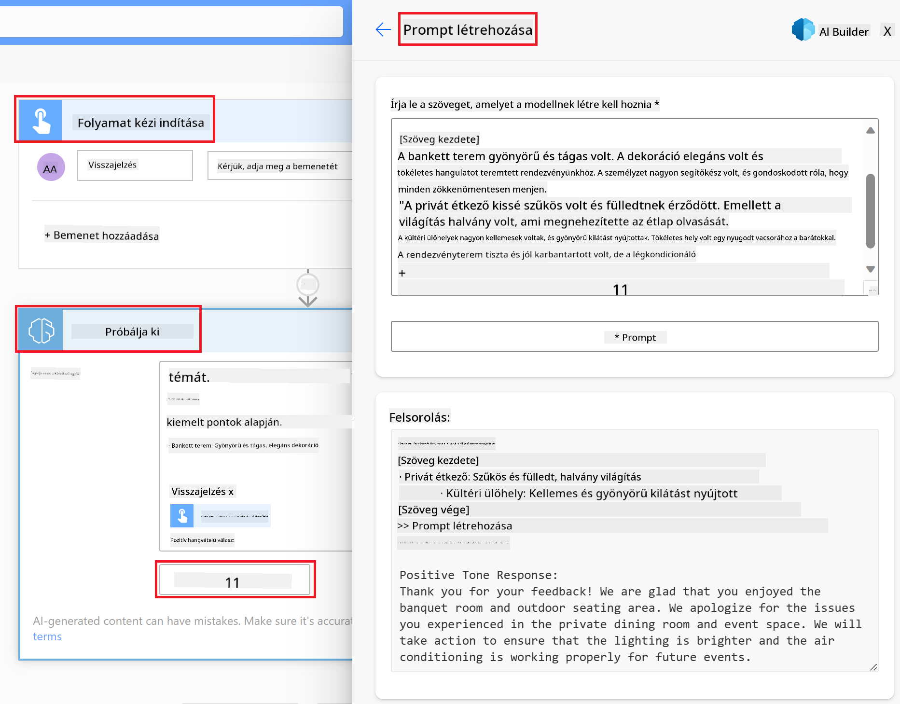

<!--
CO_OP_TRANSLATOR_METADATA:
{
  "original_hash": "f5ff3b6204a695a117d6f452403c95f7",
  "translation_date": "2025-07-09T14:10:42+00:00",
  "source_file": "10-building-low-code-ai-applications/README.md",
  "language_code": "hu"
}
-->
# Alacsony kódú AI alkalmazások fejlesztése

> _(Kattints a fenti képre a lecke videójának megtekintéséhez)_

## Bevezetés

Most, hogy megtanultuk, hogyan készítsünk képgeneráló alkalmazásokat, beszéljünk az alacsony kódról. A generatív AI számos területen alkalmazható, beleértve az alacsony kódot is, de mi is az az alacsony kód, és hogyan lehet AI-t hozzáadni?

Az alkalmazások és megoldások fejlesztése egyszerűbbé vált a hagyományos fejlesztők és nem fejlesztők számára egyaránt az Alacsony Kódú Fejlesztői Platformok használatával. Ezek a platformok lehetővé teszik, hogy kevés vagy egyáltalán nem szükséges kódolással építsünk alkalmazásokat és megoldásokat. Ez egy vizuális fejlesztői környezet biztosításával valósul meg, ahol komponenseket húzhatunk és dobhatunk az alkalmazások és megoldások létrehozásához. Ez gyorsabb és kevesebb erőforrást igénylő fejlesztést tesz lehetővé. Ebben a leckében mélyebben megvizsgáljuk, hogyan használhatjuk az alacsony kódot, és hogyan fejleszthetjük tovább AI segítségével a Power Platform használatával.

A Power Platform lehetőséget ad a szervezeteknek, hogy csapataikat felhatalmazzák saját megoldásaik létrehozására egy intuitív alacsony vagy nulla kódú környezetben. Ez a környezet leegyszerűsíti a megoldások fejlesztésének folyamatát. A Power Platform segítségével a megoldások napok vagy hetek alatt elkészülhetnek hónapok vagy évek helyett. A Power Platform öt kulcsfontosságú termékből áll: Power Apps, Power Automate, Power BI, Power Pages és Copilot Studio.

Ez a lecke a következőket tartalmazza:

- Bevezetés a generatív AI-ba a Power Platformban  
- Bevezetés a Copilot használatába  
- Generatív AI alkalmazása alkalmazások és folyamatok építéséhez a Power Platformban  
- AI modellek megértése a Power Platformban az AI Builder segítségével  

## Tanulási célok

A lecke végére képes leszel:

- Megérteni, hogyan működik a Copilot a Power Platformban.  
- Elkészíteni egy Diák Feladatkövető alkalmazást az oktatási startupunk számára.  
- Létrehozni egy Számlafeldolgozó folyamatot, amely AI segítségével kinyeri az adatokat a számlákból.  
- Alkalmazni a legjobb gyakorlatokat a Create Text with GPT AI Model használatakor.  

A lecke során használt eszközök és technológiák:

- **Power Apps**, a Diák Feladatkövető alkalmazáshoz, amely egy alacsony kódú fejlesztői környezet az adatok nyomon követésére, kezelésére és interakcióra.  
- **Dataverse**, az alkalmazás adatainak tárolására, amely egy alacsony kódú adatplatform az alkalmazás adatainak tárolásához.  
- **Power Automate**, a Számlafeldolgozó folyamathoz, amely egy alacsony kódú fejlesztői környezet munkafolyamatok automatizálásához.  
- **AI Builder**, a Számlafeldolgozó AI modellhez, amely előre elkészített AI modelleket használ a számlák feldolgozásához.  

## Generatív AI a Power Platformban

Az alacsony kódú fejlesztés és alkalmazás generatív AI-val való fejlesztése a Power Platform egyik fő fókuszterülete. A cél, hogy mindenki képes legyen AI-alapú alkalmazásokat, webhelyeket, irányítópultokat építeni, és AI segítségével automatizálni folyamatokat, _anélkül, hogy adatkutatói szakértelemre lenne szükség_. Ezt a célt úgy érik el, hogy a generatív AI-t integrálják az alacsony kódú fejlesztési élménybe a Power Platformban, Copilot és AI Builder formájában.

### Hogyan működik ez?

A Copilot egy AI asszisztens, amely lehetővé teszi, hogy a Power Platform megoldásokat természetes nyelvű, beszélgetés alapú lépésekben írd le. Például megmondhatod az AI asszisztensnek, hogy milyen mezőket használjon az alkalmazásod, és az létrehozza az alkalmazást és az alapul szolgáló adatmodellt, vagy megadhatod, hogyan állítsa be a folyamatot a Power Automate-ben.

A Copilot által vezérelt funkciókat beépítheted az alkalmazás képernyőibe, hogy a felhasználók beszélgetés alapú interakciókon keresztül fedezhessenek fel adatokat.

Az AI Builder egy alacsony kódú AI képesség a Power Platformban, amely lehetővé teszi AI modellek használatát a folyamatok automatizálására és eredmények előrejelzésére. Az AI Builderrel AI-t hozhatsz az alkalmazásaidba és folyamataidba, amelyek kapcsolódnak a Dataverse-ben vagy különböző felhőalapú adatforrásokban, például SharePoint, OneDrive vagy Azure.

A Copilot elérhető a Power Platform összes termékében: Power Apps, Power Automate, Power BI, Power Pages és Power Virtual Agents. Az AI Builder a Power Apps-ben és Power Automate-ben érhető el. Ebben a leckében a Copilot és AI Builder használatára fókuszálunk a Power Apps-ben és Power Automate-ben, hogy megoldást építsünk az oktatási startupunk számára.

### Copilot a Power Apps-ben

A Power Platform részeként a Power Apps egy alacsony kódú fejlesztői környezet alkalmazások építéséhez, amelyekkel adatokat követhetsz, kezelhetsz és használhatsz. Ez egy alkalmazásfejlesztő szolgáltatáscsomag, amely skálázható adatplatformmal és felhőszolgáltatásokhoz, valamint helyszíni adatokhoz való kapcsolódási lehetőséggel rendelkezik. A Power Apps segítségével böngészőben, táblagépen és telefonon futtatható alkalmazásokat építhetsz, amelyeket megoszthatsz kollégáiddal. A Power Apps egyszerű felületével minden üzleti felhasználó vagy profi fejlesztő könnyedén készíthet egyedi alkalmazásokat. Az alkalmazásfejlesztési élményt a generatív AI is támogatja a Copilot segítségével.

A Power Apps Copilot AI asszisztens funkciója lehetővé teszi, hogy leírd, milyen alkalmazásra van szükséged, és milyen információkat szeretnél követni, gyűjteni vagy megjeleníteni. A Copilot ez alapján egy reszponzív Canvas alkalmazást generál. Ezt az alkalmazást aztán testre szabhatod az igényeid szerint. Az AI Copilot javasol egy Dataverse táblát is a szükséges mezőkkel az adatok tárolásához, valamint néhány mintaadatot. A leckében később megnézzük, mi az a Dataverse és hogyan használhatod a Power Apps-ben. A táblát a Copilot asszisztenssel, beszélgetés alapú lépéseken keresztül testre szabhatod. Ez a funkció könnyen elérhető a Power Apps kezdőképernyőjéről.

### Copilot a Power Automate-ben

A Power Platform részeként a Power Automate lehetővé teszi automatizált munkafolyamatok létrehozását alkalmazások és szolgáltatások között. Segít ismétlődő üzleti folyamatok, például kommunikáció, adatgyűjtés és döntési jóváhagyások automatizálásában. Egyszerű felületének köszönhetően minden technikai szinten álló felhasználó (kezdőtől a tapasztalt fejlesztőig) automatizálhat munkafolyamatokat. A munkafolyamat-fejlesztési élményt a generatív AI is támogatja a Copilot segítségével.

A Power Automate Copilot AI asszisztens funkciója lehetővé teszi, hogy leírd, milyen folyamatra van szükséged, és milyen műveleteket szeretnél végrehajtani. A Copilot ez alapján létrehoz egy folyamatot, amelyet aztán testre szabhatsz. Az AI Copilot javasolja a szükséges műveleteket a feladat automatizálásához. A leckében később megnézzük, mik azok a folyamatok és hogyan használhatod őket a Power Automate-ben. A műveleteket a Copilot asszisztenssel, beszélgetés alapú lépéseken keresztül testre szabhatod. Ez a funkció könnyen elérhető a Power Automate kezdőképernyőjéről.

## Feladat: Diákfeladatok és számlák kezelése a startupunk számára Copilot segítségével

A startupunk online tanfolyamokat kínál diákoknak. A vállalkozás gyorsan növekedett, és most nehéz lépést tartani a tanfolyamok iránti kereslettel. Felvettek téged Power Platform fejlesztőnek, hogy segíts egy alacsony kódú megoldás létrehozásában, amely segít a diákfeladatok és számlák kezelésében. A megoldásnak képesnek kell lennie az diákfeladatok nyomon követésére és kezelésére egy alkalmazáson keresztül, valamint a számlafeldolgozás automatizálására egy munkafolyamat segítségével. A generatív AI használatát kérték a megoldás fejlesztéséhez.

A Copilot használatának megkezdéséhez használhatod a [Power Platform Copilot Prompt Library](https://github.com/pnp/powerplatform-prompts?WT.mc_id=academic-109639-somelezediko) könyvtárat, amely promptokat tartalmaz alkalmazások és folyamatok építéséhez Copilot segítségével. Ezek a promptok ötletet adhatnak, hogyan írd le az igényeidet a Copilot számára.

### Diákfeladat-követő alkalmazás építése a startupunk számára

A startupunk oktatói nehezen tudják nyomon követni a diákfeladatokat. Egy táblázatot használtak a feladatok követésére, de ez egyre nehezebben kezelhető a diákok számának növekedésével. Egy olyan alkalmazást kértek, amely segít a diákfeladatok nyomon követésében és kezelésében. Az alkalmazásnak lehetővé kell tennie új feladatok hozzáadását, megtekintését, frissítését és törlését. Az oktatók és diákok számára is láthatóvá kell tenni, mely feladatokat értékelték és melyeket nem.

Az alkalmazást a Power Apps Copilot segítségével építed az alábbi lépések szerint:

1. Navigálj a [Power Apps](https://make.powerapps.com?WT.mc_id=academic-105485-koreyst) kezdőképernyőjére.

2. Használd a kezdőképernyő szövegmezőjét az alkalmazás leírására. Például: **_Szeretnék egy alkalmazást építeni a diákfeladatok nyomon követésére és kezelésére_**. Kattints a **Küldés** gombra, hogy elküldd a promptot az AI Copilotnak.

3. Az AI Copilot javasol egy Dataverse táblát a szükséges mezőkkel az adatok tárolásához, valamint néhány mintaadatot. A táblát a Copilot asszisztenssel, beszélgetés alapú lépéseken keresztül testre szabhatod.

   > **Fontos**: A Dataverse a Power Platform alapjául szolgáló adatplatform. Ez egy alacsony kódú adatplatform az alkalmazás adatainak tárolására. Teljesen kezelt szolgáltatás, amely biztonságosan tárolja az adatokat a Microsoft felhőjében, és a Power Platform környezetedben van elérhető. Beépített adatkezelési képességekkel rendelkezik, mint például adat-osztályozás, adatfolyamat követés, finomhangolt hozzáférés-vezérlés és még sok más. További információkat találsz a Dataverse-ről [itt](https://docs.microsoft.com/powerapps/maker/data-platform/data-platform-intro?WT.mc_id=academic-109639-somelezediko).

   

4. Az oktatók szeretnének e-maileket küldeni azoknak a diákoknak, akik leadták a feladataikat, hogy tájékoztassák őket a feladatok állapotáról. Copilot segítségével hozzáadhatsz egy új mezőt a táblához a diák e-mail címének tárolására. Például a következő promptot használhatod: **_Szeretnék egy oszlopot hozzáadni a diák e-mail címének tárolásához_**. Kattints a **Küldés** gombra a prompt elküldéséhez az AI Copilotnak.

5. Az AI Copilot létrehozza az új mezőt, amelyet aztán testre szabhatsz az igényeid szerint.

6. Ha elkészültél a táblával, kattints a **Alkalmazás létrehozása** gombra az alkalmazás elkészítéséhez.

7. Az AI Copilot a leírásod alapján generál egy reszponzív Canvas alkalmazást, amelyet aztán testre szabhatsz.

8. Az oktatók számára, hogy e-maileket küldhessenek a diákoknak, Copilot segítségével hozzáadhatsz egy új képernyőt az alkalmazáshoz. Például a következő promptot használhatod: **_Szeretnék egy képernyőt hozzáadni, amelyen e-maileket küldhetünk a diákoknak_**. Kattints a **Küldés** gombra a prompt elküldéséhez az AI Copilotnak.

9. Az AI Copilot létrehozza az új képernyőt, amelyet aztán testre szabhatsz.

10. Ha elkészültél az alkalmazással, kattints a **Mentés** gombra az alkalmazás mentéséhez.

11. Az alkalmazás megosztásához az oktatókkal kattints a **Megosztás** gombra, majd ismét a **Megosztás** gombra. Ezután megadhatod az oktatók e-mail címeit az alkalmazás megosztásához.

> **Házi feladat**: Az alkalmazás, amit most építettél, jó kiindulópont, de tovább fejleszthető. Az e-mail funkcióval az oktatók csak manuálisan tudnak e-maileket küldeni a diákoknak, be kell gépelniük az e-mail címeket. Tudsz Copilot segítségével egy automatizálást készíteni, amely automatikusan küld e-maileket a diákoknak, amikor leadják a feladataikat? Tipp: a megfelelő prompt segítségével a Power Automate-ben is használhatod a Copilotot ennek megvalósításához.

### Számlainformációs tábla létrehozása a startupunk számára

A startup pénzügyi csapata nehezen tudja nyomon követni a számlákat. Egy táblázatot használtak a számlák követésére, de ez egyre nehezebben kezelhető a számlák számának növekedésével. Egy olyan táblát kértek, amely segít tárolni, nyomon követni és kezelni a beérkezett számlák adatait. A táblát egy automatizáláshoz is használni fogják, amely kinyeri az összes számlainformációt és tárolja azt a táblában. A tábla segítségével a pénzügyi csapat meg tudja nézni, mely számlákat fizették ki és melyeket nem.

A Power Platform alapjául szolgáló adatplatform a Dataverse, amely lehetővé teszi az alkalmazások és megoldások adatainak tárolását. A Dataverse egy alacsony kódú adatplatform az alkalmazásadatok tárolására. Teljesen kezelt szolgáltatás,
- **Könnyen kezelhető**: Mind a metaadatok, mind az adatok a felhőben tárolódnak, így nem kell aggódnod a tárolás vagy kezelés részletei miatt. Az alkalmazásaid és megoldásaid fejlesztésére koncentrálhatsz.

- **Biztonságos**: A Dataverse biztonságos, felhőalapú tárolási lehetőséget kínál az adataid számára. Szerepalapú biztonság segítségével szabályozhatod, hogy ki férhet hozzá a tábláid adataihoz, és hogyan használhatja azokat.

- **Gazdag metaadatok**: Az adattípusok és kapcsolatok közvetlenül használhatók a Power Apps-ben.

- **Logika és érvényesítés**: Üzleti szabályokat, számított mezőket és érvényesítési szabályokat alkalmazhatsz az üzleti logika érvényesítésére és az adatok pontosságának fenntartására.

Most, hogy tudod, mi az a Dataverse és miért érdemes használni, nézzük meg, hogyan használhatod a Copilotot egy tábla létrehozásához a Dataverse-ben, hogy megfeleljen a pénzügyi csapatunk igényeinek.

> **Note** : A következő részben ezt a táblát fogod használni egy automatizálás létrehozásához, amely kinyeri az összes számlainformációt, és eltárolja a táblában.

A Dataverse-ben tábla létrehozásához a Copilot segítségével kövesd az alábbi lépéseket:

1. Navigálj a [Power Apps](https://make.powerapps.com?WT.mc_id=academic-105485-koreyst) kezdőképernyőjére.

2. A bal oldali navigációs sávon válaszd a **Tables** menüpontot, majd kattints a **Describe the new Table** lehetőségre.

3. A **Describe the new Table** képernyőn használd a szövegmezőt a létrehozni kívánt tábla leírására. Például: **_Szeretnék létrehozni egy táblát a számlainformációk tárolására_**. Kattints a **Send** gombra, hogy elküldd a promptot az AI Copilotnak.

4. Az AI Copilot javasolni fog egy Dataverse táblát a szükséges mezőkkel az adatok tárolásához, valamint néhány mintaadatot. Ezután testre szabhatod a táblát az AI Copilot asszisztens funkcióján keresztül, párbeszédes lépésekben.

5. A pénzügyi csapat szeretne e-mailt küldeni a beszállítónak, hogy tájékoztassa őket a számla aktuális állapotáról. A Copilot segítségével hozzáadhatsz egy új mezőt a táblához a beszállító e-mail címének tárolására. Például használhatod a következő promptot: **_Szeretnék egy oszlopot hozzáadni a beszállító e-mail címének tárolására_**. Kattints a **Send** gombra a prompt elküldéséhez az AI Copilotnak.

6. Az AI Copilot létrehoz egy új mezőt, amelyet aztán testre szabhatsz az igényeid szerint.

7. Ha elkészültél a táblával, kattints a **Create** gombra a tábla létrehozásához.

## AI modellek a Power Platformban az AI Builderrel

Az AI Builder egy alacsony kódú AI képesség a Power Platformban, amely lehetővé teszi, hogy AI modelleket használj folyamatok automatizálására és eredmények előrejelzésére. Az AI Builderrel AI-t hozhatsz az alkalmazásaidba és folyamataidba, amelyek kapcsolódnak a Dataverse-ben vagy különböző felhőalapú adatforrásokban, például SharePointban, OneDrive-ban vagy Azure-ban tárolt adatokhoz.

## Előre elkészített AI modellek vs Egyedi AI modellek

Az AI Builder kétféle AI modellt kínál: Előre elkészített AI modelleket és Egyedi AI modelleket. Az előre elkészített AI modelleket a Microsoft tanította be, és készen állnak a használatra a Power Platformban. Ezek segítenek intelligenciát adni az alkalmazásaidhoz és folyamataidhoz anélkül, hogy adatokat kellene gyűjtened, majd saját modelleket építened, tanítanod és közzétenned. Ezekkel a modellekkel automatizálhatod a folyamatokat és előre jelezheted az eredményeket.

Néhány elérhető előre elkészített AI modell a Power Platformban:

- **Kulcskifejezés-kivonatolás**: Ez a modell kulcskifejezéseket emel ki a szövegből.
- **Nyelvfelismerés**: Ez a modell felismeri a szöveg nyelvét.
- **Hangulatelemzés**: Ez a modell pozitív, negatív, semleges vagy vegyes hangulatot azonosít a szövegben.
- **Névjegykártya-olvasó**: Ez a modell információkat emel ki névjegykártyákról.
- **Szövegfelismerés**: Ez a modell képekből emel ki szöveget.
- **Objektumfelismerés**: Ez a modell képekből azonosít és emel ki objektumokat.
- **Dokumentumfeldolgozás**: Ez a modell űrlapokból emel ki információkat.
- **Számlafeldolgozás**: Ez a modell számlákból emel ki információkat.

Egyedi AI modellekkel saját modellt hozhatsz be az AI Builderbe, amely így ugyanúgy működik, mint bármely AI Builder egyedi modell, lehetővé téve, hogy a modellt a saját adataiddal tanítsd. Ezekkel a modellekkel automatizálhatod a folyamatokat és előre jelezheted az eredményeket mind a Power Apps-ben, mind a Power Automate-ban. Saját modell használatakor bizonyos korlátozások érvényesek. További információk a [korlátozásokról](https://learn.microsoft.com/ai-builder/byo-model#limitations?WT.mc_id=academic-105485-koreyst).

## Feladat #2 – Számlafeldolgozó folyamat létrehozása a startupunk számára

A pénzügyi csapat nehezen boldogul a számlák feldolgozásával. Egy táblázatot használtak a számlák nyomon követésére, de ez egyre nehezebben kezelhető a számlák számának növekedésével. Megkértek, hogy építs egy munkafolyamatot, amely segíti őket a számlák feldolgozásában AI segítségével. A munkafolyamatnak lehetővé kell tennie az információk kinyerését a számlákból, és az adatok tárolását egy Dataverse táblában. Emellett lehetővé kell tennie, hogy e-mailt küldjenek a pénzügyi csapatnak a kinyert információkkal.

Most, hogy tudod, mi az az AI Builder és miért érdemes használni, nézzük meg, hogyan használhatod a korábban bemutatott Számlafeldolgozó AI modellt az AI Builderben, hogy létrehozz egy munkafolyamatot, amely segíti a pénzügyi csapatot a számlák feldolgozásában.

A Számlafeldolgozó AI modell használatával a pénzügyi csapat munkafolyamatának létrehozásához kövesd az alábbi lépéseket:

1. Navigálj a [Power Automate](https://make.powerautomate.com?WT.mc_id=academic-105485-koreyst) kezdőképernyőjére.

2. Használd a kezdőképernyőn található szövegmezőt a létrehozni kívánt munkafolyamat leírására. Például: **_Számla feldolgozása, amikor megérkezik a postaládámba_**. Kattints a **Send** gombra a prompt elküldéséhez az AI Copilotnak.

   

3. Az AI Copilot javasolja a szükséges műveleteket a feladat automatizálásához. Kattints a **Next** gombra a következő lépések megtekintéséhez.

4. A következő lépésben a Power Automate kéri, hogy állítsd be a munkafolyamathoz szükséges kapcsolatokat. Ha kész vagy, kattints a **Create flow** gombra a munkafolyamat létrehozásához.

5. Az AI Copilot létrehoz egy munkafolyamatot, amelyet aztán testre szabhatsz az igényeid szerint.

6. Frissítsd a munkafolyamat indítóját, és állítsd be a **Folder** mezőt arra a mappára, ahol a számlák tárolódnak. Például állítsd be a mappát **Inbox**-ra. Kattints a **Show advanced options** lehetőségre, és állítsd a **Only with Attachments** opciót **Yes**-re. Ez biztosítja, hogy a munkafolyamat csak akkor fusson, ha a mappába csatolmányos e-mail érkezik.

7. Távolítsd el a következő műveleteket a munkafolyamatból: **HTML to text**, **Compose**, **Compose 2**, **Compose 3** és **Compose 4**, mert ezekre nem lesz szükséged.

8. Távolítsd el a **Condition** műveletet is, mert azt sem fogod használni. A munkafolyamatnak így kell kinéznie:

   

9. Kattints az **Add an action** gombra, és keress rá a **Dataverse** kifejezésre. Válaszd az **Add a new row** műveletet.

10. Az **Extract Information from invoices** műveletnél frissítsd az **Invoice File** mezőt úgy, hogy az az e-mailből származó **Attachment Content** legyen. Ez biztosítja, hogy a munkafolyamat a számla csatolmányából nyerje ki az információkat.

11. Válaszd ki a korábban létrehozott **Table**-t. Például választhatod az **Invoice Information** táblát. A dinamikus tartalomból töltsd ki a következő mezőket:

    - ID
    - Amount
    - Date
    - Name
    - Status – Állítsd a **Status** mezőt **Pending** értékre.
    - Supplier Email – Használd a **From** dinamikus tartalmat a **When a new email arrives** indítóból.

    

12. Ha elkészültél a munkafolyamattal, kattints a **Save** gombra a mentéshez. Ezután tesztelheted a munkafolyamatot úgy, hogy küldesz egy e-mailt számlával a triggerben megadott mappába.

> **Házi feladatod**: Az imént létrehozott munkafolyamat jó kiindulópont, most gondold át, hogyan építhetsz egy automatizálást, amely lehetővé teszi a pénzügyi csapat számára, hogy e-mailt küldjenek a beszállítónak a számla aktuális állapotáról. Tipp: a munkafolyamatnak akkor kell futnia, amikor a számla állapota megváltozik.

## Szöveg generáló AI modell használata a Power Automate-ban

Az AI Builderben elérhető Create Text with GPT AI modell lehetővé teszi, hogy egy prompt alapján szöveget generálj, és a Microsoft Azure OpenAI szolgáltatás hajtja. Ezzel a képességgel GPT (Generative Pre-Trained Transformer) technológiát építhetsz be az alkalmazásaidba és folyamataidba, hogy különféle automatizált munkafolyamatokat és hasznos alkalmazásokat hozz létre.

A GPT modelleket hatalmas mennyiségű adat alapján tanították be, így képesek emberi nyelvhez hasonló szöveget előállítani egy adott prompt alapján. A munkafolyamat-automatizálással integrálva az olyan AI modellek, mint a GPT, széles körű feladatok egyszerűsítésére és automatizálására használhatók.

Például készíthetsz olyan munkafolyamatokat, amelyek automatikusan generálnak szöveget különféle célokra, például e-mail tervezetekhez, termékleírásokhoz és még sok máshoz. A modellt használhatod chatbotokhoz és ügyfélszolgálati alkalmazásokhoz is, amelyek segítik az ügyfélszolgálati munkatársakat, hogy hatékonyan és gyorsan válaszoljanak az ügyfelek kérdéseire.

Ha szeretnéd megtanulni, hogyan használd ezt az AI modellt a Power Automate-ban, nézd meg az [Add intelligence with AI Builder and GPT](https://learn.microsoft.com/training/modules/ai-builder-text-generation/?WT.mc_id=academic-109639-somelezediko) modult.

## Szép munka! Folytasd a tanulást

A lecke elvégzése után nézd meg a [Generative AI Learning collection](https://aka.ms/genai-collection?WT.mc_id=academic-105485-koreyst) gyűjteményünket, hogy tovább fejleszd a generatív AI ismereteidet!

Lépj tovább a 11. leckébe, ahol megnézzük, hogyan [integrálhatod a generatív AI-t a Function Calling-gel](../11-integrating-with-function-calling/README.md?WT.mc_id=academic-105485-koreyst)!

**Jogi nyilatkozat**:  
Ez a dokumentum az AI fordító szolgáltatás, a [Co-op Translator](https://github.com/Azure/co-op-translator) segítségével készült. Bár a pontosságra törekszünk, kérjük, vegye figyelembe, hogy az automatikus fordítások hibákat vagy pontatlanságokat tartalmazhatnak. Az eredeti dokumentum az anyanyelvén tekintendő hiteles forrásnak. Fontos információk esetén szakmai, emberi fordítást javaslunk. Nem vállalunk felelősséget a fordítás használatából eredő félreértésekért vagy téves értelmezésekért.