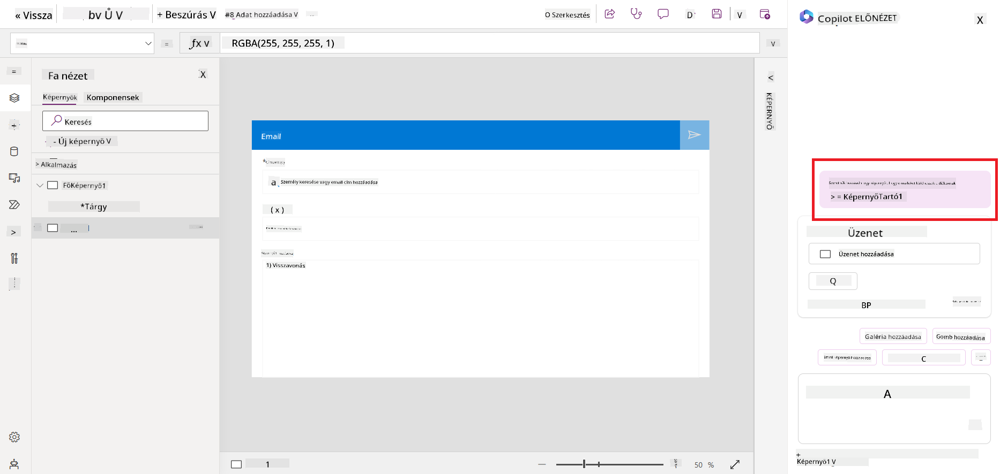
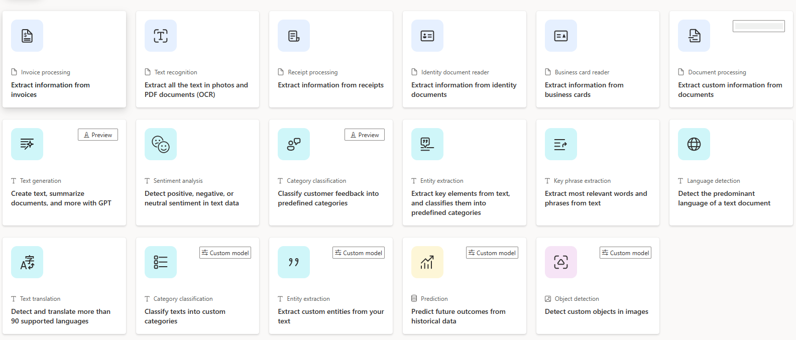
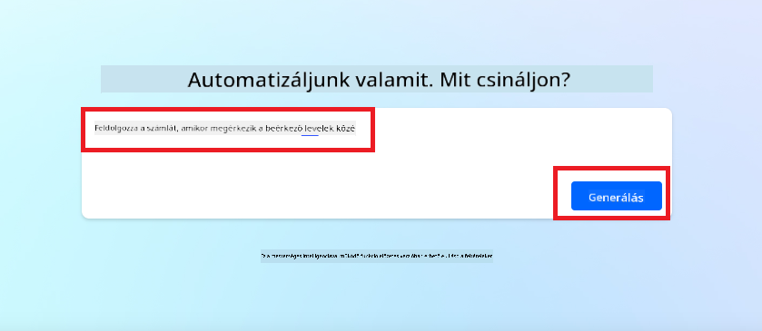
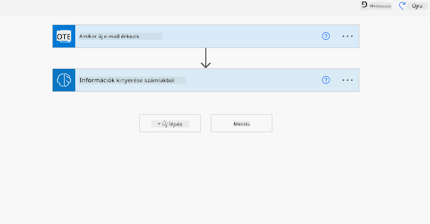
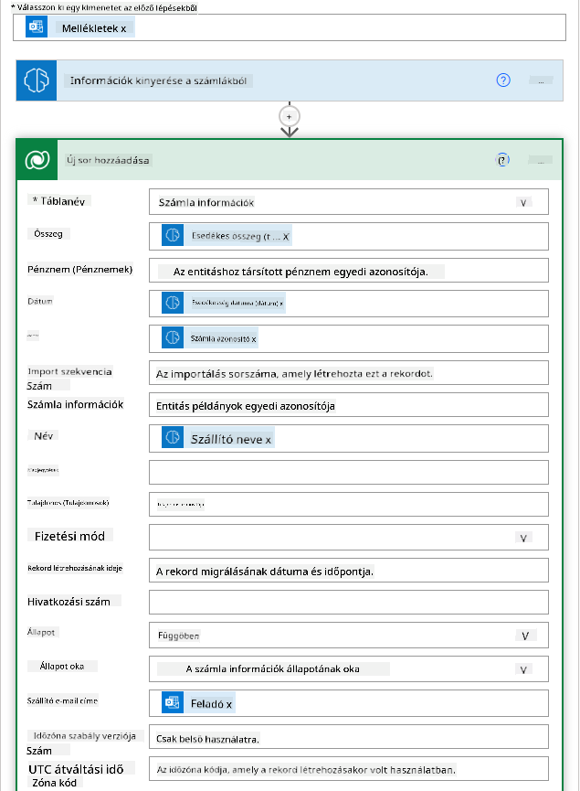

<!--
CO_OP_TRANSLATOR_METADATA:
{
  "original_hash": "846ac8e3b7dcfb697d3309fec05f0fea",
  "translation_date": "2025-10-17T21:28:27+00:00",
  "source_file": "10-building-low-code-ai-applications/README.md",
  "language_code": "hu"
}
-->
# Alacsony kódú AI alkalmazások építése

> _(Kattints a fenti képre a lecke videójának megtekintéséhez)_

## Bevezetés

Most, hogy megtanultuk, hogyan készítsünk képgeneráló alkalmazásokat, beszéljünk az alacsony kódról. A generatív AI számos különböző területen alkalmazható, beleértve az alacsony kódot is, de mi is az az alacsony kód, és hogyan adhatunk hozzá AI-t?

Az alkalmazások és megoldások építése könnyebbé vált a hagyományos fejlesztők és nem fejlesztők számára az alacsony kódú fejlesztési platformok használatával. Az alacsony kódú fejlesztési platformok lehetővé teszik, hogy kevés vagy semmilyen kódolással építsünk alkalmazásokat és megoldásokat. Ez egy vizuális fejlesztési környezet biztosításával érhető el, amely lehetővé teszi, hogy komponenseket húzzunk és ejtsünk az alkalmazások és megoldások építéséhez. Ezáltal gyorsabban és kevesebb erőforrással építhetünk alkalmazásokat és megoldásokat. Ebben a leckében mélyebben belemerülünk az alacsony kód használatába, és abba, hogyan lehet az alacsony kódú fejlesztést AI-val fejleszteni a Power Platform segítségével.

A Power Platform lehetőséget nyújt a szervezetek számára, hogy csapataikat felhatalmazzák saját megoldásaik megépítésére egy intuitív alacsony kódú vagy kódmentes környezetben. Ez a környezet egyszerűsíti a megoldások építésének folyamatát. A Power Platform segítségével a megoldások napok vagy hetek alatt építhetők fel, nem hónapok vagy évek alatt. A Power Platform öt kulcsfontosságú termékből áll: Power Apps, Power Automate, Power BI, Power Pages és Copilot Studio.

Ez a lecke az alábbiakat tartalmazza:

- Bevezetés a generatív AI-ba a Power Platformon
- Bevezetés a Copilotba és annak használatába
- Generatív AI használata alkalmazások és folyamatok építéséhez a Power Platformon
- Az AI modellek megértése a Power Platformon az AI Builder segítségével

## Tanulási célok

A lecke végére képes leszel:

- Megérteni, hogyan működik a Copilot a Power Platformon.

- Felépíteni egy Diák Feladatkövető Alkalmazást az oktatási startupunk számára.

- Felépíteni egy Számla Feldolgozó Folyamatot, amely AI-t használ az információk kinyerésére a számlákból.

- Alkalmazni a legjobb gyakorlatokat a GPT AI Modell szövegalkotási funkciójának használatakor.

Az eszközök és technológiák, amelyeket ebben a leckében használni fogsz:

- **Power Apps**, a Diák Feladatkövető Alkalmazáshoz, amely alacsony kódú fejlesztési környezetet biztosít az alkalmazások építéséhez, amelyek adatokat követnek, kezelnek és interakcióba lépnek velük.

- **Dataverse**, az adatok tárolásához a Diák Feladatkövető Alkalmazás számára, ahol a Dataverse alacsony kódú adatplatformot biztosít az alkalmazás adatainak tárolásához.

- **Power Automate**, a Számla Feldolgozó Folyamathoz, ahol alacsony kódú fejlesztési környezetet kapsz a munkafolyamatok építéséhez, amelyek automatizálják a számla feldolgozási folyamatot.

- **AI Builder**, a Számla Feldolgozó AI Modellhez, ahol előre elkészített AI modelleket használsz a startupunk számláinak feldolgozásához.

## Generatív AI a Power Platformon

Az alacsony kódú fejlesztés és alkalmazások generatív AI-val való fejlesztése kulcsfontosságú terület a Power Platform számára. A cél az, hogy mindenki képes legyen AI-alapú alkalmazásokat, weboldalakat, irányítópultokat építeni és folyamatokat automatizálni AI-val, _anélkül, hogy adat-tudományi szakértelemre lenne szükség_. Ezt a célt úgy érjük el, hogy a generatív AI-t integráljuk az alacsony kódú fejlesztési élménybe a Power Platformon, Copilot és AI Builder formájában.

### Hogyan működik ez?

A Copilot egy AI asszisztens, amely lehetővé teszi, hogy Power Platform megoldásokat építsünk az igényeink természetes nyelven történő leírásával, egy sor beszélgetési lépésben. Például utasíthatjuk az AI asszisztenst, hogy adja meg, milyen mezőket használjon az alkalmazásunk, és az létrehozza az alkalmazást és az alapjául szolgáló adatmodellt, vagy megadhatjuk, hogyan állítsunk be egy folyamatot a Power Automate-ben.

A Copilot által vezérelt funkciókat alkalmazásképernyőkön is használhatjuk, hogy a felhasználók beszélgetésen keresztül fedezhessék fel az információkat.

Az AI Builder egy alacsony kódú AI képesség, amely elérhető a Power Platformon, és lehetővé teszi, hogy AI modelleket használjunk folyamatok automatizálására és eredmények előrejelzésére. Az AI Builder segítségével AI-t hozhatunk az alkalmazásainkba és folyamainkba, amelyek kapcsolódnak a Dataverse-ben vagy különböző felhőalapú adatforrásokban, például SharePoint, OneDrive vagy Azure tárolt adatainkhoz.

A Copilot elérhető a Power Platform összes termékében: Power Apps, Power Automate, Power BI, Power Pages és Power Virtual Agents. Az AI Builder elérhető a Power Appsben és a Power Automate-ben. Ebben a leckében arra összpontosítunk, hogyan használjuk a Copilotot és az AI Builder-t a Power Appsben és a Power Automate-ben, hogy megoldást építsünk oktatási startupunk számára.

### Copilot a Power Appsben

A Power Platform részeként a Power Apps alacsony kódú fejlesztési környezetet biztosít az alkalmazások építéséhez, amelyek adatokat követnek, kezelnek és interakcióba lépnek velük. Ez egy alkalmazásfejlesztési szolgáltatásokból álló csomag, amely skálázható adatplatformot és a felhőszolgáltatásokhoz és helyszíni adatokhoz való csatlakozás képességét kínálja. A Power Apps lehetővé teszi, hogy böngészőkön, táblagépeken és telefonokon futó alkalmazásokat építsünk, amelyeket megoszthatunk munkatársainkkal. A Power Apps egyszerű felületével könnyíti meg az alkalmazásfejlesztést, így minden üzleti felhasználó vagy profi fejlesztő egyedi alkalmazásokat építhet. Az alkalmazásfejlesztési élményt a Generatív AI is javítja a Copilot segítségével.

A Copilot AI asszisztens funkció a Power Appsben lehetővé teszi, hogy leírjuk, milyen típusú alkalmazásra van szükségünk, és milyen információkat szeretnénk, hogy az alkalmazásunk kövessen, gyűjtsön vagy mutasson. A Copilot ezután egy reszponzív Canvas alkalmazást generál a leírásunk alapján. Ezután testre szabhatjuk az alkalmazást az igényeink szerint. Az AI Copilot emellett generál és javasol egy Dataverse táblát a szükséges mezőkkel, hogy tárolja azokat az adatokat, amelyeket követni szeretnénk, valamint néhány mintaadatot. Ebben a leckében később megnézzük, mi az a Dataverse, és hogyan használhatjuk a Power Appsben. Ezután testre szabhatjuk a táblát az igényeink szerint az AI Copilot asszisztens funkcióval, beszélgetési lépések segítségével. Ez a funkció könnyen elérhető a Power Apps kezdőképernyőjéről.

### Copilot a Power Automate-ben

A Power Platform részeként a Power Automate lehetővé teszi a felhasználók számára, hogy automatizált munkafolyamatokat hozzanak létre alkalmazások és szolgáltatások között. Segít automatizálni az ismétlődő üzleti folyamatokat, például a kommunikációt, adatgyűjtést és döntési jóváhagyásokat. Egyszerű felülete lehetővé teszi, hogy minden technikai kompetenciával rendelkező felhasználó (kezdőktől a tapasztalt fejlesztőkig) automatizálja a munkafeladatokat. A munkafolyamat-fejlesztési élményt a Generatív AI is javítja a Copilot segítségével.

A Copilot AI asszisztens funkció a Power Automate-ben lehetővé teszi, hogy leírjuk, milyen típusú folyamatra van szükségünk, és milyen műveleteket szeretnénk, hogy a folyamatunk végrehajtson. A Copilot ezután egy folyamatot generál a leírásunk alapján. Ezután testre szabhatjuk a folyamatot az igényeink szerint. Az AI Copilot emellett generál és javasolja azokat a műveleteket, amelyek szükségesek a feladat automatizálásához. Ebben a leckében később megnézzük, mik azok a folyamatok, és hogyan használhatjuk őket a Power Automate-ben. Ezután testre szabhatjuk a műveleteket az igényeink szerint az AI Copilot asszisztens funkcióval, beszélgetési lépések segítségével. Ez a funkció könnyen elérhető a Power Automate kezdőképernyőjéről.

## Feladat: Diákfeladatok és számlák kezelése startupunk számára, Copilot használatával

Startupunk online kurzusokat kínál diákoknak. A startup gyorsan növekedett, és most nehezen tud lépést tartani a kurzusok iránti kereslettel. A startup felvett téged, mint Power Platform fejlesztőt, hogy segíts neki egy alacsony kódú megoldás építésében, amely segít a diákfeladatok és számlák kezelésében. A megoldásnak képesnek kell lennie arra, hogy nyomon kövesse és kezelje a diákfeladatokat egy alkalmazáson keresztül, valamint automatizálja a számlafeldolgozási folyamatot egy munkafolyamaton keresztül. Megkértek, hogy generatív AI-t használj a megoldás fejlesztéséhez.

Amikor elkezded használni a Copilotot, használhatod a [Power Platform Copilot Prompt Library](https://github.com/pnp/powerplatform-prompts?WT.mc_id=academic-109639-somelezediko) könyvtárat, hogy elkezdhesd a promptok használatát. Ez a könyvtár tartalmaz egy listát a promptokról, amelyeket használhatsz alkalmazások és folyamatok építéséhez a Copilot segítségével. A könyvtárban található promptokat arra is használhatod, hogy ötletet kapj arról, hogyan írd le az igényeidet a Copilotnak.

### Építs egy Diák Feladatkövető Alkalmazást a Startupunk számára

Startupunk oktatói nehezen tudják nyomon követni a diákfeladatokat. Egy táblázatot használtak a feladatok nyomon követésére, de ez nehezen kezelhetővé vált, ahogy a diákok száma növekedett. Megkértek, hogy építs egy alkalmazást, amely segít nekik nyomon követni és kezelni a diákfeladatokat. Az alkalmazásnak lehetővé kell tennie számukra, hogy új feladatokat adjanak hozzá, megtekintsék a feladatokat, frissítsék a feladatokat és töröljék a feladatokat. Az alkalmazásnak lehetővé kell tennie az oktatók és diákok számára, hogy megtekintsék azokat a feladatokat, amelyeket már értékeltek, és azokat, amelyeket még nem értékeltek.

Az alkalmazást a Power Appsben, Copilot segítségével fogod megépíteni az alábbi lépések követésével:

1. Navigálj a [Power Apps](https://make.powerapps.com?WT.mc_id=academic-105485-koreyst) kezdőképernyőjére.

1. Használd a kezdőképernyő szövegmezőjét, hogy leírd, milyen alkalmazást szeretnél építeni. Például: **_Egy alkalmazást szeretnék építeni a diákfeladatok nyomon követésére és kezelésére_**. Kattints a **Küldés** gombra, hogy elküldd a promptot az AI Copilotnak.

1. Az AI Copilot javasolni fog egy Dataverse táblát a szükséges mezőkkel, hogy tárolja azokat az adatokat, amelyeket követni szeretnél, valamint néhány mintaadatot. Ezután testre szabhatod a táblát az igényeid szerint az AI Copilot asszisztens funkcióval, beszélgetési lépések segítségével.

   > **Fontos**: A Dataverse a Power Platform alapjául szolgáló adatplatform. Ez egy alacsony kódú adatplatform az alkalmazás adatainak tárolásához. Ez egy teljesen kezelt szolgáltatás, amely biztonságosan tárolja az adatokat a Microsoft Cloudban, és a Power Platform környezetedben van telepítve. Beépített adatirányítási képességekkel rendelkezik, mint például adatklasszifikáció, adatvonal, finomhangolt hozzáférés-vezérlés és még sok más. További információt a Dataverse-ről [itt találhatsz](https://docs.microsoft.com/powerapps/maker/data-platform/data-platform-intro?WT.mc_id=academic-109639-somelezediko).

   

1. Az oktatók szeretnének e-maileket küldeni azoknak a diákoknak, akik leadták a feladataikat, hogy tájékoztassák őket a feladataik állapotáról. Használhatod a Copilotot, hogy új mezőt adj hozzá a táblához a diák e-mail címének tárolásához. Például használhatod a következő promptot, hogy új mezőt adj hozzá a táblához: **_Egy oszlopot szeretnék hozzáadni a diák e-mail címének tárolásához_**. Kattints a **Küldés** gombra, hogy elküldd a promptot az AI Copilotnak.

1. Az AI Copilot generálni fog egy új mezőt, és ezután testre szabhatod a mezőt az igényeid szerint.

1. Miután elkészültél a táblával, kattints a **Alkalmazás létrehozása** gombra, hogy létrehozd az alkalmazást.

1. Az AI Copilot egy reszponzív Canvas alkalmazást generál a leírásod alapján. Ezután testre szabhatod az alkalmazást az igényeid szerint.

1. Az oktatók számára, hogy e-maileket küldjenek a diákoknak, használhatod a Copilotot, hogy új képernyőt adj hozzá az alkalmazáshoz. Például használhatod a következő promptot, hogy új képernyőt adj hozzá az alkalmazáshoz: **_Egy képernyőt szeretnék hozzáadni, hogy e-maileket küldhessek a diákoknak_**. Kattints a **Küldés** gombra, hogy elküldd a promptot az AI Copilotnak.

1. Az AI Copilot generálni fog egy új képernyőt, és ezután testre szabhatod a képernyőt az igényeid szerint.

1. Miután elkészültél az alkalmazással, kattints a **Mentés** gombra, hogy elmentsd az alkalmazást.

1. Az alkalmazás megosztásához az oktatókkal kattints a **Megosztás** gombra,
Miért érdemes a Dataverse-t használni a startupunkhoz? A Dataverse szabványos és egyedi táblái biztonságos és felhőalapú tárolási lehetőséget kínálnak az adatok számára. A táblák lehetővé teszik különböző típusú adatok tárolását, hasonlóan ahhoz, ahogy egy Excel munkafüzetben több munkalapot használhatunk. A táblák segítségével tárolhatja azokat az adatokat, amelyek kifejezetten az Ön szervezetének vagy üzleti igényeinek felelnek meg. A Dataverse használatával startupunk számos előnyhöz juthat, többek között:

- **Könnyen kezelhető**: Mind a metaadatok, mind az adatok a felhőben tárolódnak, így nem kell aggódnia amiatt, hogy hogyan tárolja vagy kezeli őket. Ön az alkalmazások és megoldások fejlesztésére koncentrálhat.

- **Biztonságos**: A Dataverse biztonságos és felhőalapú tárolási lehetőséget kínál az adatok számára. Szerepkör-alapú biztonság segítségével szabályozhatja, hogy ki férhet hozzá az adatokhoz a táblákban, és hogyan férhet hozzájuk.

- **Gazdag metaadatok**: Az adattípusok és kapcsolatok közvetlenül használhatók a Power Apps-ben.

- **Logika és validáció**: Üzleti szabályokat, számított mezőket és validációs szabályokat használhat az üzleti logika érvényesítésére és az adatok pontosságának fenntartására.

Most, hogy tudja, mi az a Dataverse és miért érdemes használni, nézzük meg, hogyan használhatja a Copilotot egy tábla létrehozásához a Dataverse-ben, hogy megfeleljen pénzügyi csapatunk igényeinek.

> **Note**: Ezt a táblát a következő szakaszban fogja használni egy automatizálás létrehozásához, amely az összes számla információt kinyeri és tárolja a táblában.

A Dataverse-ben történő tábla létrehozásához a Copilot segítségével kövesse az alábbi lépéseket:

1. Lépjen a [Power Apps](https://make.powerapps.com?WT.mc_id=academic-105485-koreyst) kezdőképernyőjére.

2. A bal oldali navigációs sávban válassza a **Táblák** lehetőséget, majd kattintson az **Új tábla leírása** gombra.

3. Az **Új tábla leírása** képernyőn használja a szövegmezőt a létrehozni kívánt tábla leírására. Például: **_Egy táblát szeretnék létrehozni a számlainformációk tárolására_**. Kattintson a **Küldés** gombra, hogy elküldje a kérést az AI Copilotnak.

4. Az AI Copilot javasolni fog egy Dataverse táblát a szükséges mezőkkel, amelyekkel tárolhatja a nyomon követni kívánt adatokat, valamint néhány mintaadatot. Ezután testre szabhatja a táblát az AI Copilot asszisztens funkció segítségével, beszélgetéses lépések révén.

5. A pénzügyi csapat szeretne e-mailt küldeni a beszállítónak, hogy tájékoztassa őket számlájuk aktuális állapotáról. A Copilot segítségével új mezőt adhat a táblához a beszállító e-mail címének tárolására. Például használhatja a következő kérést egy új mező hozzáadásához a táblához: **_Egy oszlopot szeretnék hozzáadni a beszállító e-mail címének tárolására_**. Kattintson a **Küldés** gombra, hogy elküldje a kérést az AI Copilotnak.

6. Az AI Copilot létrehoz egy új mezőt, amelyet aztán testre szabhat az igényeinek megfelelően.

7. Miután elkészült a táblával, kattintson a **Létrehozás** gombra a tábla létrehozásához.

## AI modellek a Power Platformban az AI Builder segítségével

Az AI Builder egy alacsony kódú AI képesség, amely elérhető a Power Platformban, és lehetővé teszi AI modellek használatát folyamatok automatizálására és eredmények előrejelzésére. Az AI Builder segítségével AI-t hozhat az alkalmazásaiba és folyamataiba, amelyek kapcsolódnak a Dataverse-ben vagy különböző felhőalapú adatforrásokban, például SharePointban, OneDrive-ban vagy Azure-ban tárolt adatokhoz.

## Előre elkészített AI modellek vs Egyedi AI modellek

Az AI Builder kétféle AI modellt kínál: előre elkészített AI modelleket és egyedi AI modelleket. Az előre elkészített AI modellek olyan kész AI modellek, amelyeket a Microsoft képezett ki, és elérhetők a Power Platformban. Ezek segítenek intelligenciát adni az alkalmazásokhoz és folyamatokhoz anélkül, hogy adatokat kellene gyűjteni, majd saját modelleket építeni, képezni és közzétenni. Ezeket a modelleket folyamatok automatizálására és eredmények előrejelzésére használhatja.

Néhány előre elkészített AI modell, amely elérhető a Power Platformban:

- **Kulcsszó kinyerés**: Ez a modell kulcsszavakat nyer ki szövegből.
- **Nyelvfelismerés**: Ez a modell felismeri a szöveg nyelvét.
- **Hangulat elemzés**: Ez a modell pozitív, negatív, semleges vagy vegyes hangulatot érzékel a szövegben.
- **Névjegykártya olvasó**: Ez a modell információt nyer ki névjegykártyákból.
- **Szövegfelismerés**: Ez a modell szöveget nyer ki képekből.
- **Objektumfelismerés**: Ez a modell objektumokat érzékel és nyer ki képekből.
- **Dokumentumfeldolgozás**: Ez a modell információt nyer ki űrlapokból.
- **Számlafeldolgozás**: Ez a modell információt nyer ki számlákból.

Az egyedi AI modellekkel saját modellt hozhat az AI Builderbe, hogy az úgy működjön, mint bármely AI Builder egyedi modell, lehetővé téve a modell képzését saját adatokkal. Ezeket a modelleket folyamatok automatizálására és eredmények előrejelzésére használhatja mind a Power Apps-ben, mind a Power Automate-ben. Saját modell használata esetén bizonyos korlátozások érvényesek. További információért olvassa el ezeket a [korlátozásokat](https://learn.microsoft.com/ai-builder/byo-model#limitations?WT.mc_id=academic-105485-koreyst).

## 2. feladat - Számlafeldolgozási folyamat létrehozása a startupunk számára

A pénzügyi csapat nehézségekbe ütközik a számlák feldolgozása során. Egy táblázatot használnak a számlák nyomon követésére, de ez egyre nehezebbé válik, ahogy a számlák száma növekszik. Arra kértek, hogy hozzon létre egy munkafolyamatot, amely segít nekik a számlák AI segítségével történő feldolgozásában. A munkafolyamatnak lehetővé kell tennie, hogy a számlákból információt nyerjen ki, és tárolja az információt egy Dataverse táblában. A munkafolyamatnak azt is lehetővé kell tennie, hogy e-mailt küldjenek a pénzügyi csapatnak a kinyert információkkal.

Most, hogy tudja, mi az AI Builder és miért érdemes használni, nézzük meg, hogyan használhatja az AI Builderben korábban bemutatott Számlafeldolgozási AI modellt egy munkafolyamat létrehozásához, amely segít a pénzügyi csapatnak a számlák feldolgozásában.

A Számlafeldolgozási AI Modell használatával történő munkafolyamat létrehozásához kövesse az alábbi lépéseket:

1. Lépjen a [Power Automate](https://make.powerautomate.com?WT.mc_id=academic-105485-koreyst) kezdőképernyőjére.

2. Használja a kezdőképernyőn található szövegmezőt a létrehozni kívánt munkafolyamat leírására. Például: **_Feldolgozzon egy számlát, amikor az megérkezik a postafiókomba_**. Kattintson a **Küldés** gombra, hogy elküldje a kérést az AI Copilotnak.

   

3. Az AI Copilot javasolni fogja azokat a lépéseket, amelyek szükségesek az automatizálni kívánt feladat elvégzéséhez. Kattintson a **Tovább** gombra, hogy végigmenjen a következő lépéseken.

4. A következő lépésben a Power Automate megkéri, hogy állítsa be a folyamat végrehajtásához szükséges kapcsolatokat. Miután elkészült, kattintson a **Folyamat létrehozása** gombra a folyamat létrehozásához.

5. Az AI Copilot létrehoz egy folyamatot, amelyet aztán testre szabhat az igényeinek megfelelően.

6. Frissítse a folyamat indítóját, és állítsa be a **Mappa** mezőt arra a mappára, ahol a számlák tárolva lesznek. Például beállíthatja a mappát **Beérkezett üzenetek**-re. Kattintson a **További beállítások megjelenítése** gombra, és állítsa a **Csak mellékletekkel** opciót **Igen**-re. Ez biztosítja, hogy a folyamat csak akkor fusson, ha egy mellékletet tartalmazó e-mail érkezik a mappába.

7. Távolítsa el a következő műveleteket a folyamatból: **HTML szöveggé**, **Összeállítás**, **Összeállítás 2**, **Összeállítás 3** és **Összeállítás 4**, mivel ezeket nem fogja használni.

8. Távolítsa el a **Feltétel** műveletet a folyamatból, mivel ezt nem fogja használni. A folyamatnak a következő képernyőképhez hasonlóan kell kinéznie:

   

9. Kattintson az **Új művelet hozzáadása** gombra, és keressen rá a **Dataverse**-re. Válassza az **Új sor hozzáadása** műveletet.

10. Az **Információk kinyerése a számlákból** műveletnél frissítse a **Számlafájl** mezőt, hogy az az e-mail **Melléklet tartalmára** mutasson. Ez biztosítja, hogy a folyamat a számla mellékletéből nyerje ki az információkat.

11. Válassza ki a korábban létrehozott **Táblát**. Például válassza az **Számlainformáció** táblát. Válassza ki a dinamikus tartalmat az előző műveletből, hogy kitöltse a következő mezőket:

    - ID
    - Összeg
    - Dátum
    - Név
    - Állapot - Állítsa az **Állapotot** **Függőben**-re.
    - Beszállító e-mail - Használja a **Feladó** dinamikus tartalmat a **Amikor új e-mail érkezik** indítóból.

    

12. Miután elkészült a folyamattal, kattintson a **Mentés** gombra a folyamat mentéséhez. Ezután tesztelheti a folyamatot úgy, hogy küld egy e-mailt egy számlával a triggerben megadott mappába.

> **Házi feladat**: Az éppen elkészített folyamat jó kezdet, most gondolja át, hogyan tudna egy olyan automatizálást létrehozni, amely lehetővé teszi pénzügyi csapatunk számára, hogy e-mailt küldjenek a beszállítónak, hogy tájékoztassák őket számlájuk aktuális állapotáról. Tipp: a folyamatnak akkor kell futnia, amikor a számla állapota megváltozik.

## Szöveg generálása AI modellel a Power Automate-ben

Az AI Builderben elérhető Create Text with GPT AI Model lehetővé teszi szöveg generálását egy kérés alapján, és a Microsoft Azure OpenAI Service által működik. Ezzel a képességgel a GPT (Generative Pre-Trained Transformer) technológiát integrálhatja az alkalmazásaiba és folyamataiba, hogy különféle automatizált folyamatokat és hasznos alkalmazásokat hozzon létre.

A GPT modellek hatalmas mennyiségű adaton történő kiterjedt képzésen mennek keresztül, lehetővé téve számukra, hogy olyan szöveget állítsanak elő, amely szorosan hasonlít az emberi nyelvre, amikor egy kérés érkezik. A munkafolyamat-automatizálással kombinálva az AI modellek, mint például a GPT, széles körű feladatok egyszerűsítésére és automatizálására használhatók.

Például létrehozhat folyamatokat, amelyek automatikusan generálnak szöveget különféle felhasználási esetekhez, például e-mail vázlatokhoz, termékleírásokhoz és más célokra. A modellt arra is használhatja, hogy szöveget generáljon különféle alkalmazásokhoz, például chatbotokhoz és ügyfélszolgálati alkalmazásokhoz, amelyek lehetővé teszik az ügyfélszolgálati munkatársak számára, hogy hatékonyan és eredményesen válaszoljanak az ügyfélkérdésekre.

Ha szeretne többet megtudni ennek az AI Modellnek a Power Automate-ben történő használatáról, tekintse meg az [Add intelligence with AI Builder and GPT](https://learn.microsoft.com/training/modules/ai-builder-text-generation/?WT.mc_id=academic-109639-somelezediko) modult.

## Szép munka! Folytassa a tanulást

A lecke befejezése után nézze meg a [Generative AI Learning gyűjteményt](https://aka.ms/genai-collection?WT.mc_id=academic-105485-koreyst), hogy tovább fejlessze generatív AI ismereteit!

Lépjen tovább a 11. leckére, ahol megvizsgáljuk, hogyan lehet [integrálni a generatív AI-t funkcióhívással](../11-integrating-with-function-calling/README.md?WT.mc_id=academic-105485-koreyst)!

---

**Felelősség kizárása**:  
Ez a dokumentum az [Co-op Translator](https://github.com/Azure/co-op-translator) AI fordítási szolgáltatás segítségével lett lefordítva. Bár törekszünk a pontosságra, kérjük, vegye figyelembe, hogy az automatikus fordítások hibákat vagy pontatlanságokat tartalmazhatnak. Az eredeti dokumentum az eredeti nyelvén tekintendő hiteles forrásnak. Kritikus információk esetén javasolt professzionális emberi fordítást igénybe venni. Nem vállalunk felelősséget semmilyen félreértésért vagy téves értelmezésért, amely a fordítás használatából eredhet.