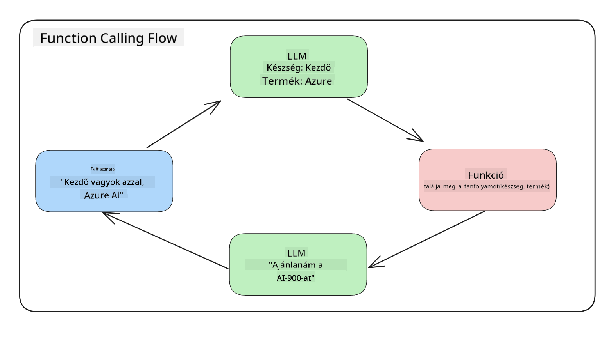
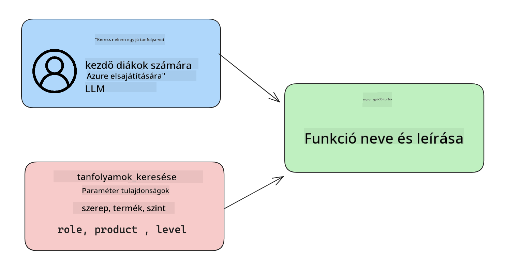

<!--
CO_OP_TRANSLATOR_METADATA:
{
  "original_hash": "77a48a201447be19aa7560706d6f93a0",
  "translation_date": "2025-05-19T21:36:02+00:00",
  "source_file": "11-integrating-with-function-calling/README.md",
  "language_code": "hu"
}
-->
# Funkcióhívás integrálása

[](https://aka.ms/gen-ai-lesson11-gh?WT.mc_id=academic-105485-koreyst)

Eddig már sok mindent megtanultál az előző leckékben. Azonban még tovább tudunk fejlődni. Néhány dolgot, amiket kezelhetünk, az, hogyan kaphatunk egy egységesebb válaszformátumot, hogy könnyebb legyen a válaszokkal dolgozni a későbbi feldolgozás során. Emellett lehet, hogy szeretnénk más forrásokból származó adatokat hozzáadni, hogy tovább gazdagítsuk alkalmazásunkat.

A fent említett problémákat igyekszik ez a fejezet kezelni.

## Bevezetés

Ez a lecke foglalkozik:

- Megmagyarázni, mi a funkcióhívás és milyen esetekben használható.
- Funkcióhívás létrehozása az Azure OpenAI segítségével.
- Hogyan integráljunk egy funkcióhívást egy alkalmazásba.

## Tanulási célok

A lecke végére képes leszel:

- Megmagyarázni a funkcióhívás használatának célját.
- Funkcióhívás beállítása az Azure OpenAI Szolgáltatás használatával.
- Hatékony funkcióhívások tervezése az alkalmazásod céljára.

## Szcenárió: Chatbotunk fejlesztése funkciókkal

Ebben a leckében szeretnénk létrehozni egy funkciót oktatási startupunk számára, amely lehetővé teszi a felhasználók számára, hogy chatbotot használjanak technikai kurzusok megtalálásához. Ajánlunk majd kurzusokat, amelyek megfelelnek a felhasználó készségszintjének, jelenlegi szerepének és érdeklődési technológiájának.

A szcenárió teljesítéséhez a következőket használjuk:

- `Azure OpenAI` a chat élmény létrehozásához a felhasználó számára.
- `Microsoft Learn Catalog API` a kurzusok megtalálásának segítésére a felhasználói kérés alapján.
- `Function Calling` a felhasználói kérés továbbítására egy funkcióhoz, hogy API kérés történjen.

Kezdjük azzal, hogy megnézzük, miért is szeretnénk használni a funkcióhívást:

## Miért Funkcióhívás

A funkcióhívás előtt az LLM válaszai struktúrálatlanok és következetlenek voltak. A fejlesztőknek bonyolult validációs kódot kellett írniuk, hogy biztosítsák a válaszok különböző változatainak kezelését. A felhasználók nem kaphattak olyan válaszokat, mint "Mi a jelenlegi időjárás Stockholmban?". Ennek oka, hogy a modellek korlátozottak voltak az adatok képzésének időpontjára.

A Funkcióhívás az Azure OpenAI Szolgáltatás egyik funkciója, amely a következő korlátokat hivatott leküzdeni:

- **Konzisztens válaszformátum**. Ha jobban tudjuk irányítani a válaszformátumot, könnyebben integrálhatjuk a választ más rendszerekbe.
- **Külső adatok**. Képesség arra, hogy más alkalmazásokból származó adatokat használjunk chat kontextusban.

## A probléma illusztrálása egy szcenárióval

> Javasoljuk, hogy használja a [mellékelt notebookot](../../../11-integrating-with-function-calling/python/aoai-assignment.ipynb), ha futtatni szeretné az alábbi szcenáriót. Olvashatja is, ahogy megpróbálunk egy problémát illusztrálni, ahol a funkciók segíthetnek a probléma megoldásában.

Nézzük meg a példát, amely a válaszformátum problémáját illusztrálja:

Tegyük fel, hogy létre akarunk hozni egy adatbázist a diákok adatairól, hogy a megfelelő kurzust javasolhassuk nekik. Az alábbiakban két leírást találunk a diákokról, amelyek nagyon hasonlóak az általuk tartalmazott adatokban.

1. Kapcsolat létrehozása az Azure OpenAI erőforrásunkkal:

   ```python
   import os
   import json
   from openai import AzureOpenAI
   from dotenv import load_dotenv
   load_dotenv()

   client = AzureOpenAI(
   api_key=os.environ['AZURE_OPENAI_API_KEY'],  # this is also the default, it can be omitted
   api_version = "2023-07-01-preview"
   )

   deployment=os.environ['AZURE_OPENAI_DEPLOYMENT']
   ```

   Az alábbiakban néhány Python kódot találunk az Azure OpenAI-hoz való kapcsolatunk konfigurálásához, ahol beállítjuk `api_type`, `api_base`, `api_version` and `api_key`.

1. Creating two student descriptions using variables `student_1_description` and `student_2_description`.

   ```python
   student_1_description="Emily Johnson is a sophomore majoring in computer science at Duke University. She has a 3.7 GPA. Emily is an active member of the university's Chess Club and Debate Team. She hopes to pursue a career in software engineering after graduating."

   student_2_description = "Michael Lee is a sophomore majoring in computer science at Stanford University. He has a 3.8 GPA. Michael is known for his programming skills and is an active member of the university's Robotics Club. He hopes to pursue a career in artificial intelligence after finishing his studies."
   ```

   Szeretnénk elküldeni a fenti diák leírásokat egy LLM-nek, hogy elemezze az adatokat. Ezeket az adatokat később felhasználhatjuk az alkalmazásunkban, és elküldhetjük egy API-hoz vagy tárolhatjuk egy adatbázisban.

1. Készítsünk két azonos promptot, amelyekben utasítjuk az LLM-et, hogy milyen információk érdekelnek minket:

   ```python
   prompt1 = f'''
   Please extract the following information from the given text and return it as a JSON object:

   name
   major
   school
   grades
   club

   This is the body of text to extract the information from:
   {student_1_description}
   '''

   prompt2 = f'''
   Please extract the following information from the given text and return it as a JSON object:

   name
   major
   school
   grades
   club

   This is the body of text to extract the information from:
   {student_2_description}
   '''
   ```

   A fenti promptok utasítják az LLM-et, hogy vonja ki az információkat és adja vissza a választ JSON formátumban.

1. Miután beállítottuk a promptokat és a kapcsolatot az Azure OpenAI-hoz, most elküldjük a promptokat az LLM-nek az `openai.ChatCompletion`. We store the prompt in the `messages` variable and assign the role to `user` használatával. Ez a felhasználói üzenet chatbotba írásának szimulálására szolgál.

   ```python
   # response from prompt one
   openai_response1 = client.chat.completions.create(
   model=deployment,
   messages = [{'role': 'user', 'content': prompt1}]
   )
   openai_response1.choices[0].message.content

   # response from prompt two
   openai_response2 = client.chat.completions.create(
   model=deployment,
   messages = [{'role': 'user', 'content': prompt2}]
   )
   openai_response2.choices[0].message.content
   ```

Most elküldhetjük mindkét kérést az LLM-nek, és megvizsgálhatjuk a kapott választ, úgy hogy megtaláljuk mint `openai_response1['choices'][0]['message']['content']`.

1. Lastly, we can convert the response to JSON format by calling `json.loads`:

   ```python
   # Loading the response as a JSON object
   json_response1 = json.loads(openai_response1.choices[0].message.content)
   json_response1
   ```

   Válasz 1:

   ```json
   {
     "name": "Emily Johnson",
     "major": "computer science",
     "school": "Duke University",
     "grades": "3.7",
     "club": "Chess Club"
   }
   ```

   Válasz 2:

   ```json
   {
     "name": "Michael Lee",
     "major": "computer science",
     "school": "Stanford University",
     "grades": "3.8 GPA",
     "club": "Robotics Club"
   }
   ```

   Annak ellenére, hogy a promptok ugyanazok és a leírások hasonlóak, látjuk a `Grades` property formatted differently, as we can sometimes get the format `3.7` or `3.7 GPA` for example.

   This result is because the LLM takes unstructured data in the form of the written prompt and returns also unstructured data. We need to have a structured format so that we know what to expect when storing or using this data

So how do we solve the formatting problem then? By using functional calling, we can make sure that we receive structured data back. When using function calling, the LLM does not actually call or run any functions. Instead, we create a structure for the LLM to follow for its responses. We then use those structured responses to know what function to run in our applications.



We can then take what is returned from the function and send this back to the LLM. The LLM will then respond using natural language to answer the user's query.

## Use Cases for using function calls

There are many different use cases where function calls can improve your app like:

- **Calling External Tools**. Chatbots are great at providing answers to questions from users. By using function calling, the chatbots can use messages from users to complete certain tasks. For example, a student can ask the chatbot to "Send an email to my instructor saying I need more assistance with this subject". This can make a function call to `send_email(to: string, body: string)`

- **Create API or Database Queries**. Users can find information using natural language that gets converted into a formatted query or API request. An example of this could be a teacher who requests "Who are the students that completed the last assignment" which could call a function named `get_completed(student_name: string, assignment: int, current_status: string)`

- **Creating Structured Data**. Users can take a block of text or CSV and use the LLM to extract important information from it. For example, a student can convert a Wikipedia article about peace agreements to create AI flashcards. This can be done by using a function called `get_important_facts(agreement_name: string, date_signed: string, parties_involved: list)`

## Creating Your First Function Call

The process of creating a function call includes 3 main steps:

1. **Calling** the Chat Completions API with a list of your functions and a user message.
2. **Reading** the model's response to perform an action i.e. execute a function or API Call.
3. **Making** another call to Chat Completions API with the response from your function to use that information to create a response to the user.



### Step 1 - creating messages

The first step is to create a user message. This can be dynamically assigned by taking the value of a text input or you can assign a value here. If this is your first time working with the Chat Completions API, we need to define the `role` and the `content` of the message.

The `role` can be either `system` (creating rules), `assistant` (the model) or `user` (the end-user). For function calling, we will assign this as `user` és egy példa kérdés értékeit.

```python
messages= [ {"role": "user", "content": "Find me a good course for a beginner student to learn Azure."} ]
```

Különböző szerepek hozzárendelésével világossá válik az LLM számára, hogy a rendszer mond valamit vagy a felhasználó, ami segít a beszélgetési történelem felépítésében, amit az LLM tovább építhet.

### 2. lépés - funkciók létrehozása

Ezután definiálunk egy funkciót és annak paramétereit. Csak egy funkciót fogunk használni itt, amelyet `search_courses` but you can create multiple functions.

> **Important** : Functions are included in the system message to the LLM and will be included in the amount of available tokens you have available.

Below, we create the functions as an array of items. Each item is a function and has properties `name`, `description` and `parameters`-nek nevezünk:

```python
functions = [
   {
      "name":"search_courses",
      "description":"Retrieves courses from the search index based on the parameters provided",
      "parameters":{
         "type":"object",
         "properties":{
            "role":{
               "type":"string",
               "description":"The role of the learner (i.e. developer, data scientist, student, etc.)"
            },
            "product":{
               "type":"string",
               "description":"The product that the lesson is covering (i.e. Azure, Power BI, etc.)"
            },
            "level":{
               "type":"string",
               "description":"The level of experience the learner has prior to taking the course (i.e. beginner, intermediate, advanced)"
            }
         },
         "required":[
            "role"
         ]
      }
   }
]
```

Az alábbiakban részletesebben leírjuk az egyes funkció példányokat:

- `name` - The name of the function that we want to have called.
- `description` - This is the description of how the function works. Here it's important to be specific and clear.
- `parameters` - A list of values and format that you want the model to produce in its response. The parameters array consists of items where the items have the following properties:
  1.  `type` - The data type of the properties will be stored in.
  1.  `properties` - List of the specific values that the model will use for its response
      1. `name` - The key is the name of the property that the model will use in its formatted response, for example, `product`.
      1. `type` - The data type of this property, for example, `string`.
      1. `description` - Description of the specific property.

There's also an optional property `required` - required property for the function call to be completed.

### Step 3 - Making the function call

After defining a function, we now need to include it in the call to the Chat Completion API. We do this by adding `functions` to the request. In this case `functions=functions`.

There is also an option to set `function_call` to `auto`. This means we will let the LLM decide which function should be called based on the user message rather than assigning it ourselves.

Here's some code below where we call `ChatCompletion.create`, note how we set `functions=functions` and `function_call="auto"` és így az LLM-nek adva a választást, mikor hívja meg az általunk biztosított funkciókat:

```python
response = client.chat.completions.create(model=deployment,
                                        messages=messages,
                                        functions=functions,
                                        function_call="auto")

print(response.choices[0].message)
```

A visszaérkező válasz most így néz ki:

```json
{
  "role": "assistant",
  "function_call": {
    "name": "search_courses",
    "arguments": "{\n  \"role\": \"student\",\n  \"product\": \"Azure\",\n  \"level\": \"beginner\"\n}"
  }
}
```

Itt láthatjuk, hogyan hívja meg a `search_courses` was called and with what arguments, as listed in the `arguments` property in the JSON response.

The conclusion the LLM was able to find the data to fit the arguments of the function as it was extracting it from the value provided to the `messages` parameter in the chat completion call. Below is a reminder of the `messages` értékű funkciót:

```python
messages= [ {"role": "user", "content": "Find me a good course for a beginner student to learn Azure."} ]
```

Ahogy látod, `student`, `Azure` and `beginner` was extracted from `messages` and set as input to the function. Using functions this way is a great way to extract information from a prompt but also to provide structure to the LLM and have reusable functionality.

Next, we need to see how we can use this in our app.

## Integrating Function Calls into an Application

After we have tested the formatted response from the LLM, we can now integrate this into an application.

### Managing the flow

To integrate this into our application, let's take the following steps:

1. First, let's make the call to the OpenAI services and store the message in a variable called `response_message`.

   ```python
   response_message = response.choices[0].message
   ```

1. Most definiáljuk a funkciót, amely a Microsoft Learn API-t fogja hívni, hogy kurzusok listáját kapja:

   ```python
   import requests

   def search_courses(role, product, level):
     url = "https://learn.microsoft.com/api/catalog/"
     params = {
        "role": role,
        "product": product,
        "level": level
     }
     response = requests.get(url, params=params)
     modules = response.json()["modules"]
     results = []
     for module in modules[:5]:
        title = module["title"]
        url = module["url"]
        results.append({"title": title, "url": url})
     return str(results)
   ```

   Figyeld meg, hogyan hozunk létre egy tényleges Python funkciót, amely a `functions` variable. We're also making real external API calls to fetch the data we need. In this case, we go against the Microsoft Learn API to search for training modules.

Ok, so we created `functions` variables and a corresponding Python function, how do we tell the LLM how to map these two together so our Python function is called?

1. To see if we need to call a Python function, we need to look into the LLM response and see if `function_call` része, és meghívja a kijelölt funkciót. Így teheted meg az említett ellenőrzést alább:

   ```python
   # Check if the model wants to call a function
   if response_message.function_call.name:
    print("Recommended Function call:")
    print(response_message.function_call.name)
    print()

    # Call the function.
    function_name = response_message.function_call.name

    available_functions = {
            "search_courses": search_courses,
    }
    function_to_call = available_functions[function_name]

    function_args = json.loads(response_message.function_call.arguments)
    function_response = function_to_call(**function_args)

    print("Output of function call:")
    print(function_response)
    print(type(function_response))


    # Add the assistant response and function response to the messages
    messages.append( # adding assistant response to messages
        {
            "role": response_message.role,
            "function_call": {
                "name": function_name,
                "arguments": response_message.function_call.arguments,
            },
            "content": None
        }
    )
    messages.append( # adding function response to messages
        {
            "role": "function",
            "name": function_name,
            "content":function_response,
        }
    )
   ```

   Ez a három sor biztosítja, hogy kinyerjük a funkció nevét, az argumentumokat, és végrehajtjuk a hívást:

   ```python
   function_to_call = available_functions[function_name]

   function_args = json.loads(response_message.function_call.arguments)
   function_response = function_to_call(**function_args)
   ```

   Az alábbiakban látható a kódunk futtatásának kimenete:

   **Kimenet**

   ```Recommended Function call:
   {
     "name": "search_courses",
     "arguments": "{\n  \"role\": \"student\",\n  \"product\": \"Azure\",\n  \"level\": \"beginner\"\n}"
   }

   Output of function call:
   [{'title': 'Describe concepts of cryptography', 'url': 'https://learn.microsoft.com/training/modules/describe-concepts-of-cryptography/?
   WT.mc_id=api_CatalogApi'}, {'title': 'Introduction to audio classification with TensorFlow', 'url': 'https://learn.microsoft.com/en-
   us/training/modules/intro-audio-classification-tensorflow/?WT.mc_id=api_CatalogApi'}, {'title': 'Design a Performant Data Model in Azure SQL
   Database with Azure Data Studio', 'url': 'https://learn.microsoft.com/training/modules/design-a-data-model-with-ads/?
   WT.mc_id=api_CatalogApi'}, {'title': 'Getting started with the Microsoft Cloud Adoption Framework for Azure', 'url':
   'https://learn.microsoft.com/training/modules/cloud-adoption-framework-getting-started/?WT.mc_id=api_CatalogApi'}, {'title': 'Set up the
   Rust development environment', 'url': 'https://learn.microsoft.com/training/modules/rust-set-up-environment/?WT.mc_id=api_CatalogApi'}]
   <class 'str'>
   ```

1. Most elküldjük a frissített üzenetet, `messages`, az LLM-nek, hogy természetes nyelvi választ kapjunk API JSON formátumú válasz helyett.

   ```python
   print("Messages in next request:")
   print(messages)
   print()

   second_response = client.chat.completions.create(
      messages=messages,
      model=deployment,
      function_call="auto",
      functions=functions,
      temperature=0
         )  # get a new response from GPT where it can see the function response


   print(second_response.choices[0].message)
   ```

   **Kimenet**

   ```python
   {
     "role": "assistant",
     "content": "I found some good courses for beginner students to learn Azure:\n\n1. [Describe concepts of cryptography] (https://learn.microsoft.com/training/modules/describe-concepts-of-cryptography/?WT.mc_id=api_CatalogApi)\n2. [Introduction to audio classification with TensorFlow](https://learn.microsoft.com/training/modules/intro-audio-classification-tensorflow/?WT.mc_id=api_CatalogApi)\n3. [Design a Performant Data Model in Azure SQL Database with Azure Data Studio](https://learn.microsoft.com/training/modules/design-a-data-model-with-ads/?WT.mc_id=api_CatalogApi)\n4. [Getting started with the Microsoft Cloud Adoption Framework for Azure](https://learn.microsoft.com/training/modules/cloud-adoption-framework-getting-started/?WT.mc_id=api_CatalogApi)\n5. [Set up the Rust development environment](https://learn.microsoft.com/training/modules/rust-set-up-environment/?WT.mc_id=api_CatalogApi)\n\nYou can click on the links to access the courses."
   }

   ```

## Feladat

Az Azure OpenAI Funkcióhívás tanulásának folytatásához létrehozhatsz:

- Több paramétert a funkcióhoz, amelyek segíthetnek a tanulóknak több kurzus megtalálásában.
- Hozz létre egy másik funkcióhívást, amely több információt vesz fel a tanulótól, például az anyanyelvét.
- Hozz létre hibakezelést, ha a funkcióhívás és/vagy API hívás nem ad vissza megfelelő kurzusokat.

Tipp: Kövesd a [Learn API referencia dokumentáció](https://learn.microsoft.com/training/support/catalog-api-developer-reference?WT.mc_id=academic-105485-koreyst) oldalt, hogy láthasd, hogyan és hol érhetők el ezek az adatok.

## Nagyszerű munka! Folytasd az utazást

A lecke elvégzése után nézd meg a [Generatív AI Tanulási gyűjteményünket](https://aka.ms/genai-collection?WT.mc_id=academic-105485-koreyst), hogy tovább növeld generatív AI tudásodat!

Látogass el a 12. leckére, ahol megnézzük, hogyan [tervezhetünk UX-et AI alkalmazásokhoz](../12-designing-ux-for-ai-applications/README.md?WT.mc_id=academic-105485-koreyst)!

**Felelősség kizárása**:  
Ezt a dokumentumot AI fordítási szolgáltatással, a [Co-op Translator](https://github.com/Azure/co-op-translator) segítségével fordították le. Bár törekszünk a pontosságra, kérjük, vegye figyelembe, hogy az automatikus fordítások hibákat vagy pontatlanságokat tartalmazhatnak. Az eredeti dokumentum saját nyelvén tekintendő a hiteles forrásnak. Kritikus információk esetén professzionális emberi fordítást ajánlunk. Nem vállalunk felelősséget a fordítás használatából eredő félreértésekért vagy félremagyarázásokért.