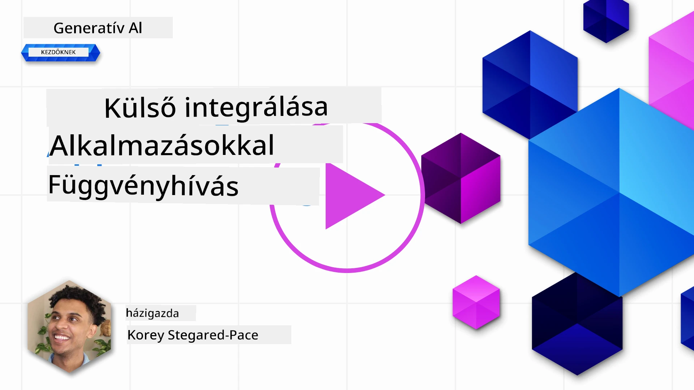
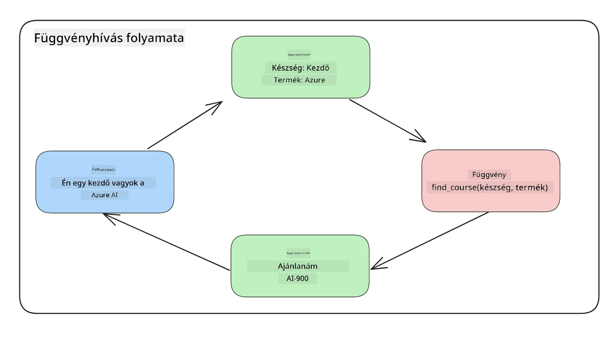
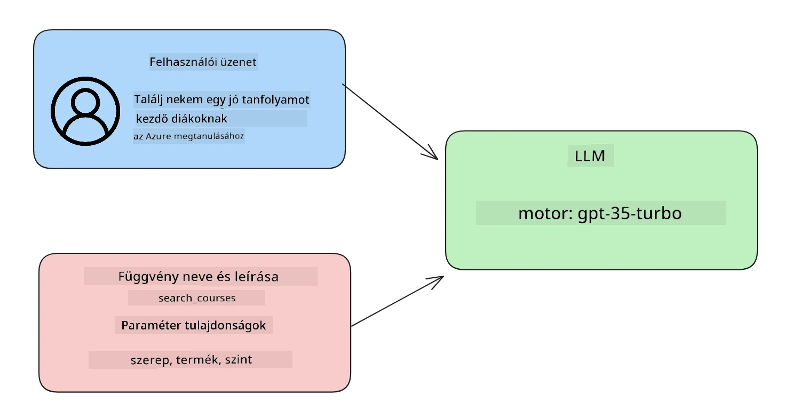

# Függvényhívás integrálása

[](https://youtu.be/DgUdCLX8qYQ?si=f1ouQU5HQx6F8Gl2)

Eddig meglehetősen sok mindent tanultál a korábbi leckék során. Azonban tovább javíthatunk. Néhány dolgot megoldhatunk, például hogyan szerezhetünk be egységesebb válaszformátumot, hogy megkönnyítsük a válasz utólagos feldolgozását. Emellett adatokat vehetünk fel más forrásokból is, hogy még gazdagabbá tegyük alkalmazásunkat.

A fentebb említett problémákat ez a fejezet kívánja megoldani.

## Bevezetés

Ez a lecke a következőket fedi le:

- Magyarázat arról, hogy mi a függvényhívás és milyen esetei vannak.
- Függvényhívás létrehozása az Azure OpenAI segítségével.
- Hogyan integráljunk egy függvényhívást egy alkalmazásba.

## Tanulási célok

A lecke végére képes leszel:

- Elmagyarázni, miért használunk függvényhívást.
- Beállítani a Függvényhívást az Azure OpenAI szolgáltatás segítségével.
- Hatékony függvényhívásokat tervezni az alkalmazásod esetéhez.

## Forgatókönyv: Chatbotunk fejlesztése függvényekkel

Ehhez a leckéhez egy olyan funkciót szeretnénk építeni oktatási startupunk számára, amely lehetővé teszi a felhasználók számára, hogy egy chatbot segítségével keressenek technikai tanfolyamokat. Olyan tanfolyamokat ajánlunk, amelyek megfelelnek készségszintjüknek, jelenlegi pozíciójuknak és az érdeklődési technológiának.

Ehhez a forgatókönyvhöz a következők kombinációját fogjuk használni:

- `Azure OpenAI`, hogy chat élményt hozzunk létre a felhasználó számára.
- `Microsoft Learn Catalog API`, hogy segítsen a felhasználóknak tanfolyamokat találni a kérésük alapján.
- `Függvényhívás`, hogy a felhasználó lekérdezését egy függvénynek küldjük az API kérés elküldéséhez.

Kezdésként nézzük meg, miért akarunk egyáltalán függvényhívást használni:

## Miért Függvényhívás

A függvényhívás előtt a LLM válaszai szerkezetlenek és következetlenek voltak. A fejlesztőknek bonyolult ellenőrző kódot kellett írniuk, hogy minden válaszvariációt kezelni tudjanak. A felhasználók nem tudtak olyan kérdésekre választ kapni, mint "Milyen az aktuális időjárás Stockholmban?". Ez azért volt, mert a modellek csak a tanítás időpontjáig rendelkeztek adatokkal.

A függvényhívás az Azure OpenAI szolgáltatás egy funkciója, hogy leküzdje a következő korlátokat:

- **Következetes válaszformátum**. Ha jobban tudjuk kontrollálni a válaszformátumot, könnyebben integrálhatjuk az eredményt más rendszerekbe.
- **Külső adatok**. Lehetőség arra, hogy alkalmazás más forrásaiból származó adatokat használjunk egy chat kontextusban.

## A probléma szemléltetése egy forgatókönyvön keresztül

> Ajánljuk, hogy használd a [mellékelt jegyzetfüzetet](./python/aoai-assignment.ipynb?WT.mc_id=academic-105485-koreyst), ha futtatni szeretnéd az alábbi forgatókönyvet. Vagy csak olvashatod is, mert egy olyan problémát próbálunk bemutatni, melyet a függvények segítenek megoldani.

Nézzük meg az alábbi példát, amely a válaszformátum problémáját szemlélteti:

Tegyük fel, hogy szeretnénk létrehozni egy adatbázist diákok adataival, hogy a megfelelő tanfolyamokat ajánlhassuk nekik. Lent két leírást látunk diákokról, akik rendkívül hasonló adatokat tartalmaznak.

1. Hozzunk létre kapcsolatot Azure OpenAI erőforrásunkhoz:

   ```python
   import os
   import json
   from openai import AzureOpenAI
   from dotenv import load_dotenv
   load_dotenv()

   client = AzureOpenAI(
   api_key=os.environ['AZURE_OPENAI_API_KEY'],  # ez az alapértelmezett is, elhagyható
   api_version = "2023-07-01-preview"
   )

   deployment=os.environ['AZURE_OPENAI_DEPLOYMENT']
   ```

   Lent néhány Python kód található az Azure OpenAI kapcsolat beállításához, ahol megadjuk az `api_type`-ot, `api_base`-t, `api_version`-t és `api_key`-t.

1. Két diák leírásának létrehozása a `student_1_description` és `student_2_description` változókkal.

   ```python
   student_1_description="Emily Johnson is a sophomore majoring in computer science at Duke University. She has a 3.7 GPA. Emily is an active member of the university's Chess Club and Debate Team. She hopes to pursue a career in software engineering after graduating."

   student_2_description = "Michael Lee is a sophomore majoring in computer science at Stanford University. He has a 3.8 GPA. Michael is known for his programming skills and is an active member of the university's Robotics Club. He hopes to pursue a career in artificial intelligence after finishing his studies."
   ```

   A fenti diák leírásokat szeretnénk az LLM-nek elküldeni, hogy az adatokat kinyerje. Ezek az adatok később az alkalmazásban is felhasználhatók lesznek, továbbíthatók API-nak vagy eltárolhatók adatbázisban.

1. Hozzuk létre két azonos promptot, amelyekben megmondjuk az LLM-nek, milyen információkra vagyunk kíváncsiak:

   ```python
   prompt1 = f'''
   Please extract the following information from the given text and return it as a JSON object:

   name
   major
   school
   grades
   club

   This is the body of text to extract the information from:
   {student_1_description}
   '''

   prompt2 = f'''
   Please extract the following information from the given text and return it as a JSON object:

   name
   major
   school
   grades
   club

   This is the body of text to extract the information from:
   {student_2_description}
   '''
   ```

   A fenti promptok arra utasítják az LLM-et, hogy az adatokat kivonja és válaszát JSON formátumban adja vissza.

1. A promptok és Azure OpenAI kapcsolat beállítása után most elküldjük a promptokat az LLM-nek a `openai.ChatCompletion` segítségével. A promptot a `messages` változóba tesszük, a szerepet `user`-nek állítjuk. Ez azért van, hogy utánozzuk a felhasználótól érkező üzenetet, amelyet egy chatbotnak írnak.

   ```python
   # válasz az első kérésre
   openai_response1 = client.chat.completions.create(
   model=deployment,
   messages = [{'role': 'user', 'content': prompt1}]
   )
   openai_response1.choices[0].message.content

   # válasz a második kérésre
   openai_response2 = client.chat.completions.create(
   model=deployment,
   messages = [{'role': 'user', 'content': prompt2}]
   )
   openai_response2.choices[0].message.content
   ```

Most elküldhetjük mindkét kérést az LLM-nek, és megnézhetjük a választ úgy, hogy lekérjük `openai_response1['choices'][0]['message']['content']` révén.

1. Végül JSON formátumra alakíthatjuk a választ a `json.loads` hívásával:

   ```python
   # A válasz betöltése JSON objektumként
   json_response1 = json.loads(openai_response1.choices[0].message.content)
   json_response1
   ```

   Válasz 1:

   ```json
   {
     "name": "Emily Johnson",
     "major": "computer science",
     "school": "Duke University",
     "grades": "3.7",
     "club": "Chess Club"
   }
   ```

   Válasz 2:

   ```json
   {
     "name": "Michael Lee",
     "major": "computer science",
     "school": "Stanford University",
     "grades": "3.8 GPA",
     "club": "Robotics Club"
   }
   ```

   Bár a promptok azonosak és a leírások hasonlóak, a `Grades` tulajdonság értékei különböző formátumban jelennek meg: néha `3.7`, máskor `3.7 GPA`.

   Ez azért van, mert az LLM nem strukturált adatot kapott a prompt formájában, és szintén nem strukturált adatot adott vissza. Szükségünk van egy strukturált formátumra, hogy tudjuk, mit várhatunk az adatok tárolásakor vagy használatakor.

De akkor hogyan oldjuk meg a formátum problémát? Függvényhívással biztosíthatjuk, hogy strukturált adatot kapjunk vissza. Függvényhívás használatakor az LLM nem futtat ténylegesen függvényeket. Ehelyett létrehozunk egy szerkezetet, amit az LLM követni fog a válaszaiban. Ezeket a strukturált válaszokat használjuk aztán annak meghatározására, melyik függvényt futtatjuk alkalmazásunkban.



Ezután a függvényből kapott eredményt visszaküldhetjük az LLM-nek. Az LLM természetes nyelven válaszol, hogy válaszoljon a felhasználó kérdésére.

## Függvényhívások felhasználási esetei

Számos eset létezik, amikor függvényhívások javíthatják az alkalmazásodat, mint például:

- **Külső eszközök hívása**. A chatbotok nagyszerűek arra, hogy válaszokat adjanak a felhasználók kérdéseire. Függvényhívás használatával a chatbotok a felhasználói üzenetek alapján bizonyos feladatokat teljesíthetnek. Például egy diák megkérheti a chatbotot, hogy "Küldj egy e-mailt az oktatómnak, hogy több segítségre van szükségem a tárggyal kapcsolatban." Ez egy `send_email(to: string, body: string)` nevű függvényhívást eredményezhet.

- **API vagy adatbázis lekérdezések létrehozása**. A felhasználók természetes nyelv segítségével találhatnak információkat, amit egy formázott lekérdezéssé vagy API kérésé alakítanak át. Például egy tanár kérdezheti: "Kik a diákok, akik teljesítették az utolsó feladatot?", ami egy `get_completed(student_name: string, assignment: int, current_status: string)` nevű függvényt hívhat meg.

- **Strukturált adatok létrehozása**. A felhasználók egy szövegrészt vagy CSV fájlt adhatnak meg, és az LLM segítségével fontos adatokat nyerhetnek ki belőle. Például egy diák egy Wikipédia cikket alakíthat át békeegyezményekről AI-flashcardokká. Ez megvalósítható egy `get_important_facts(agreement_name: string, date_signed: string, parties_involved: list)` nevű függvénnyel.

## Első függvényhívás létrehozása

A függvényhívás létrehozásának folyamata három fő lépésből áll:

1. Meghívni a Chat Completions API-t a függvények listájával és egy felhasználói üzenettel.
2. Elolvasni a modell válaszát, hogy végrehajtsunk egy műveletet, azaz futtassunk egy függvényt vagy API hívást.
3. További hívás indítása a Chat Completions API-hoz az általad végrehajtott függvény válaszával, hogy ezt az információt felhasználjuk a felhasználó válaszának létrehozásához.



### 1. lépés - üzenetek létrehozása

Az első lépés a felhasználói üzenet létrehozása. Ezt dinamikusan is hozzárendelhetjük egy szövegbeviteli mező értékéből, vagy itt is megadhatjuk. Ha először dolgozol a Chat Completions API-val, meg kell adnunk az üzenet `role` és `content` értékét.

A `role` lehet `system` (szabályok létrehozása), `assistant` (a modell) vagy `user` (végfelhasználó). Függvényhívásnál ezt `user`-nek állítjuk például egy kérdéssel.

```python
messages= [ {"role": "user", "content": "Find me a good course for a beginner student to learn Azure."} ]
```

Különböző szerepek hozzárendelésével az LLM számára világossá válik, hogy a rendszer vagy a felhasználó szólal meg, ami segít beszélgetés előzményeinek építésében az LLM számára.

### 2. lépés - függvények létrehozása

Ezután definiálunk egy függvényt és annak paramétereit. Itt csak egyetlen függvényt használunk `search_courses` névvel, de több függvényt is létrehozhatunk.

> **Fontos**: A függvények a rendszerüzenetben lesznek megadva az LLM számára, és beleszámítanak a rendelkezésre álló tokenek számába.

Lent létrehozzuk a függvényeket egy elemekből álló tömbként. Minden elem egy függvény, amely `name`, `description` és `parameters` tulajdonságokkal rendelkezik:

```python
functions = [
   {
      "name":"search_courses",
      "description":"Retrieves courses from the search index based on the parameters provided",
      "parameters":{
         "type":"object",
         "properties":{
            "role":{
               "type":"string",
               "description":"The role of the learner (i.e. developer, data scientist, student, etc.)"
            },
            "product":{
               "type":"string",
               "description":"The product that the lesson is covering (i.e. Azure, Power BI, etc.)"
            },
            "level":{
               "type":"string",
               "description":"The level of experience the learner has prior to taking the course (i.e. beginner, intermediate, advanced)"
            }
         },
         "required":[
            "role"
         ]
      }
   }
]
```

Nézzük részletesebben az egyes függvény példányokat:

- `name` – a függvény neve, amit hívni akarunk.
- `description` – a függvény működésének leírása. Fontos, hogy világos és pontos legyen.
- `parameters` – egy lista azokról az értékekről és formátumról, amelyeket a modellnek a válaszban el kell készítenie. A paraméterek tömbje elemekből áll, amelyek a következő tulajdonságokkal rendelkeznek:
  1. `type` – az adott tulajdonság adattípusa.
  1. `properties` – a konkrét értékek listája, amelyeket a modell használni fog a válaszának elkészítéséhez:
     1. `name` – a kulcs, az adott válaszban szereplő tulajdonság neve (pl. `product`).
     1. `type` – az adott tulajdonság adattípusa, pl. `string`.
     1. `description` – a konkrét tulajdonság leírása.

Van egy opcionális tulajdonság is, a `required`, amely megjelöli a kötelező paramétereket a függvényhíváshoz.

### 3. lépés - a függvényhívás végrehajtása

Miután meghatároztuk a függvényt, be kell építenünk a hívásba a Chat Completion API használatakor. Ezt úgy tesszük, hogy a kérésbe beszúrjuk a `functions` attribútumot, konkrétan `functions=functions` értékkel.

Van egy lehetőség a `function_call` beállítására `auto` értékre is. Ez azt jelenti, hogy az LLM döntheti el, melyik függvényt kell hívni a felhasználói üzenet alapján, nem nekünk kell megadnunk.

Lent egy kódpélda, ahol hívjuk a `ChatCompletion.create` metódust, megfigyelheted, hogy `functions=functions` és `function_call="auto"` van beállítva, így az LLM választhatja ki, mikor hívjon meg egy adott függvényt:

```python
response = client.chat.completions.create(model=deployment,
                                        messages=messages,
                                        functions=functions,
                                        function_call="auto")

print(response.choices[0].message)
```

A visszakapott válasz most így néz ki:

```json
{
  "role": "assistant",
  "function_call": {
    "name": "search_courses",
    "arguments": "{\n  \"role\": \"student\",\n  \"product\": \"Azure\",\n  \"level\": \"beginner\"\n}"
  }
}
```

Itt látható, hogy a `search_courses` függvényt hívták, és milyen argumentumokkal, amik a JSON válasz `arguments` tulajdonságában vannak feltüntetve.

A konklúzió az, hogy az LLM megtalálta az adatot az argumentumokhoz, mert azt kinyerte a `messages` paraméternek átadott értékből a chat completion hívásában. Lent egy emlékeztető a `messages` értékéről:

```python
messages= [ {"role": "user", "content": "Find me a good course for a beginner student to learn Azure."} ]
```

Ahogy látod, a `student`, az `Azure` és a `beginner` értékek ki lettek emelve a `messages`-ből és a függvény bemenetévé lettek téve. Függvények ilyen módon való használata nagyszerű módja az információk kinyerésének egy promptból, valamint struktúrát ad az LLM-nek és újrahasználható funkcionalitást hoz létre.

Most nézzük meg, hogyan használhatjuk mindezt alkalmazásban.

## Függvényhívások integrálása alkalmazásba

Miután teszteltük az LLM formázott válaszát, most integrálhatjuk azt az alkalmazásba.

### A folyamat kezelése

Az alkalmazásba való integráláshoz kövessük a következő lépéseket:

1. Először tegyük meg a hívást az OpenAI szolgáltatásnak, és tároljuk az üzenetet egy `response_message` nevű változóban.

   ```python
   response_message = response.choices[0].message
   ```

1. Ezután definiáljuk azt a függvényt, amely meghívja a Microsoft Learn API-t a tanfolyamok listázásáért:

   ```python
   import requests

   def search_courses(role, product, level):
     url = "https://learn.microsoft.com/api/catalog/"
     params = {
        "role": role,
        "product": product,
        "level": level
     }
     response = requests.get(url, params=params)
     modules = response.json()["modules"]
     results = []
     for module in modules[:5]:
        title = module["title"]
        url = module["url"]
        results.append({"title": title, "url": url})
     return str(results)
   ```

   Megfigyelheted, hogy egy valódi Python függvényt hozunk létre, amely megfelel a `functions` változóban megadott függvényneveknek. Valódi külső API hívásokat hajtunk végre az adatok lekéréséhez. Ebben az esetben a Microsoft Learn API-hoz megyünk, hogy képzési modulokat keressünk.

Rendben, tehát megvan a `functions` változó és a megfelelő Python függvény, hogyan tudjuk az LLM-nek megmondani, hogyan párosítsa őket, hogy a Python függvényünk hívódjon?

1. Ahhoz, hogy megtudjuk, van-e szükség Python függvény hívásra, meg kell vizsgálnunk az LLM választ, hogy tartalmazza-e a `function_call`-t és ha igen, meghívni a rá mutató függvényt. Íme az ellenőrzés, amelyet elvégezhetsz:

   ```python
   # Ellenőrizze, hogy a modell szeretne-e funkciót hívni
   if response_message.function_call.name:
    print("Recommended Function call:")
    print(response_message.function_call.name)
    print()

    # Hívja meg a funkciót.
    function_name = response_message.function_call.name

    available_functions = {
            "search_courses": search_courses,
    }
    function_to_call = available_functions[function_name]

    function_args = json.loads(response_message.function_call.arguments)
    function_response = function_to_call(**function_args)

    print("Output of function call:")
    print(function_response)
    print(type(function_response))


    # Add hozzá a segítő válaszát és a funkció válaszát az üzenetekhez
    messages.append( # segítő válasz hozzáadása az üzenetekhez
        {
            "role": response_message.role,
            "function_call": {
                "name": function_name,
                "arguments": response_message.function_call.arguments,
            },
            "content": None
        }
    )
    messages.append( # funkció válaszának hozzáadása az üzenetekhez
        {
            "role": "function",
            "name": function_name,
            "content":function_response,
        }
    )
   ```

   Ez a három sor biztosítja, hogy kinyerjük a függvény nevét, az argumentumokat, és végrehajtjuk a hívást:

   ```python
   function_to_call = available_functions[function_name]

   function_args = json.loads(response_message.function_call.arguments)
   function_response = function_to_call(**function_args)
   ```

   Lent a kód futtatásának kimenete:

   **Kimenet**

   ```Recommended Function call:
   {
     "name": "search_courses",
     "arguments": "{\n  \"role\": \"student\",\n  \"product\": \"Azure\",\n  \"level\": \"beginner\"\n}"
   }

   Output of function call:
   [{'title': 'Describe concepts of cryptography', 'url': 'https://learn.microsoft.com/training/modules/describe-concepts-of-cryptography/?
   WT.mc_id=api_CatalogApi'}, {'title': 'Introduction to audio classification with TensorFlow', 'url': 'https://learn.microsoft.com/en-
   us/training/modules/intro-audio-classification-tensorflow/?WT.mc_id=api_CatalogApi'}, {'title': 'Design a Performant Data Model in Azure SQL
   Database with Azure Data Studio', 'url': 'https://learn.microsoft.com/training/modules/design-a-data-model-with-ads/?
   WT.mc_id=api_CatalogApi'}, {'title': 'Getting started with the Microsoft Cloud Adoption Framework for Azure', 'url':
   'https://learn.microsoft.com/training/modules/cloud-adoption-framework-getting-started/?WT.mc_id=api_CatalogApi'}, {'title': 'Set up the
   Rust development environment', 'url': 'https://learn.microsoft.com/training/modules/rust-set-up-environment/?WT.mc_id=api_CatalogApi'}]
   <class 'str'>
   ```

1. Most elküldjük a frissített `messages` üzenetet az LLM-nek, hogy természetes nyelvű választ kapjunk API JSON formátumú helyett.

   ```python
   print("Messages in next request:")
   print(messages)
   print()

   second_response = client.chat.completions.create(
      messages=messages,
      model=deployment,
      function_call="auto",
      functions=functions,
      temperature=0
         )  # szerezz egy új választ a GPT-től, ahol láthatja a függvény választ


   print(second_response.choices[0].message)
   ```

   **Kimenet**

   ```python
   {
     "role": "assistant",
     "content": "I found some good courses for beginner students to learn Azure:\n\n1. [Describe concepts of cryptography] (https://learn.microsoft.com/training/modules/describe-concepts-of-cryptography/?WT.mc_id=api_CatalogApi)\n2. [Introduction to audio classification with TensorFlow](https://learn.microsoft.com/training/modules/intro-audio-classification-tensorflow/?WT.mc_id=api_CatalogApi)\n3. [Design a Performant Data Model in Azure SQL Database with Azure Data Studio](https://learn.microsoft.com/training/modules/design-a-data-model-with-ads/?WT.mc_id=api_CatalogApi)\n4. [Getting started with the Microsoft Cloud Adoption Framework for Azure](https://learn.microsoft.com/training/modules/cloud-adoption-framework-getting-started/?WT.mc_id=api_CatalogApi)\n5. [Set up the Rust development environment](https://learn.microsoft.com/training/modules/rust-set-up-environment/?WT.mc_id=api_CatalogApi)\n\nYou can click on the links to access the courses."
   }

   ```

## Feladat

Ahhoz, hogy folytasd az Azure OpenAI Függvényhívás tanulását, építhetsz:

- Több paramétert a függvényhez, amelyek segíthetnek a tanulóknak több tanfolyam megtalálásában.
- Egy újabb függvényhívást, amely a tanulóktól további információkat kér, például anyanyelvüket.
- Hibakezelést arra az esetre, ha a függvényhívás és/vagy az API hívás nem ad vissza megfelelő tanfolyamokat.
Tipp: Kövesd a [API referencia dokumentáció tanulását](https://learn.microsoft.com/training/support/catalog-api-developer-reference?WT.mc_id=academic-105485-koreyst) az oldal segítségével, hogy megtudd, hogyan és hol érhető el ez az adat.

## Nagyszerű munka! Folytasd az utazást

A lecke befejezése után nézd meg a [Generatív MI tanulási gyűjteményünket](https://aka.ms/genai-collection?WT.mc_id=academic-105485-koreyst), hogy tovább fejleszd generatív mesterséges intelligencia ismereteidet!

Lépj tovább a 12. leckéhez, ahol megnézzük, hogyan [tervezhetsz UX-et MI alkalmazásokhoz](../12-designing-ux-for-ai-applications/README.md?WT.mc_id=academic-105485-koreyst)!

---

<!-- CO-OP TRANSLATOR DISCLAIMER START -->
**Jogi nyilatkozat**:
Ez a dokumentum az AI fordítási szolgáltatás, a [Co-op Translator](https://github.com/Azure/co-op-translator) segítségével készült. Bár az pontosságra törekszünk, kérjük, vegye figyelembe, hogy az automatikus fordítások hibákat vagy pontatlanságokat tartalmazhatnak. Az eredeti dokumentum az anyanyelvén tekintendő hiteles forrásnak. Fontos információk esetén professzionális emberi fordítást javasolunk. Nem vállalunk felelősséget semmilyen félreértésért vagy téves értelmezésért, amely ebből a fordításból ered.
<!-- CO-OP TRANSLATOR DISCLAIMER END -->