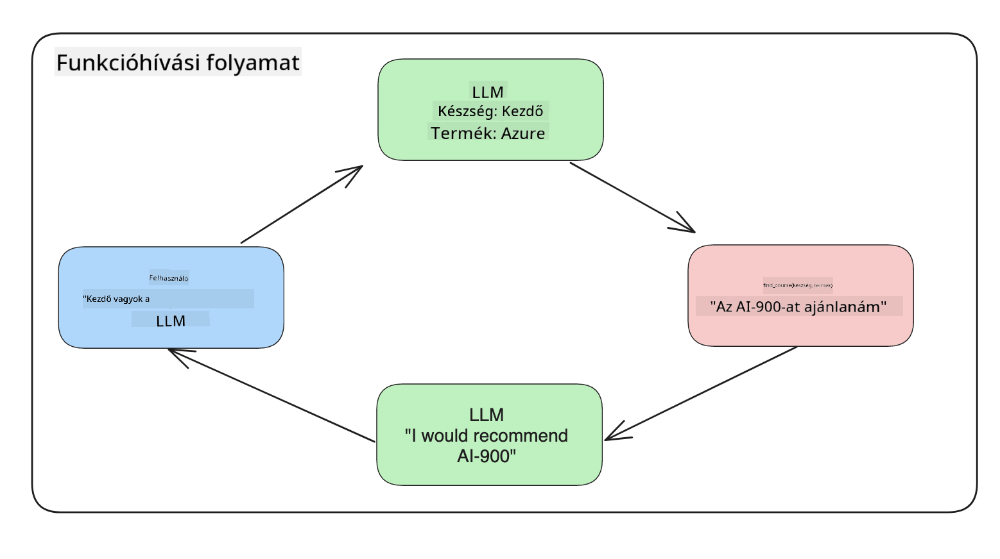
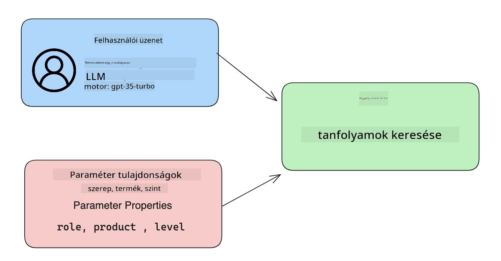

<!--
CO_OP_TRANSLATOR_METADATA:
{
  "original_hash": "77a48a201447be19aa7560706d6f93a0",
  "translation_date": "2025-07-09T14:41:14+00:00",
  "source_file": "11-integrating-with-function-calling/README.md",
  "language_code": "hu"
}
-->
# Integráció a function calling-gel

[](https://aka.ms/gen-ai-lesson11-gh?WT.mc_id=academic-105485-koreyst)

Eddig már sok mindent megtanultál az előző leckék során. Azonban tovább javíthatunk. Néhány dolog, amivel foglalkozhatunk, az a válaszformátum egységesítése, hogy könnyebben lehessen dolgozni a válasszal később. Emellett szeretnénk más forrásokból származó adatokat is hozzáadni, hogy még gazdagabbá tegyük az alkalmazásunkat.

A fent említett problémák azok, amelyeket ez a fejezet kíván megoldani.

## Bevezetés

Ebben a leckében a következőkről lesz szó:

- Mi az a function calling és milyen esetekben használjuk.
- Hogyan hozzunk létre function call-t az Azure OpenAI segítségével.
- Hogyan integráljuk a function call-t egy alkalmazásba.

## Tanulási célok

A lecke végére képes leszel:

- Elmagyarázni a function calling használatának célját.
- Beállítani a Function Call-t az Azure OpenAI szolgáltatásban.
- Hatékony function call-okat tervezni az alkalmazásod igényeihez.

## Forgatókönyv: Chatbotunk fejlesztése funkciókkal

Ebben a leckében egy olyan funkciót szeretnénk létrehozni az oktatási startupunk számára, amely lehetővé teszi a felhasználók számára, hogy chatbot segítségével technikai kurzusokat találjanak. Ajánlani fogunk olyan kurzusokat, amelyek megfelelnek a felhasználó képzettségi szintjének, jelenlegi szerepének és érdeklődési technológiájának.

A forgatókönyv megvalósításához a következőket használjuk:

- `Azure OpenAI` a felhasználói chat élmény létrehozásához.
- `Microsoft Learn Catalog API` a kurzusok kereséséhez a felhasználó kérésének megfelelően.
- `Function Calling` a felhasználói lekérdezés feldolgozásához és az API kérés elküldéséhez.

Kezdésként nézzük meg, miért is szeretnénk egyáltalán function calling-et használni:

## Miért Function Calling?

A function calling előtt az LLM válaszai rendezetlenek és következetlenek voltak. A fejlesztőknek bonyolult érvényesítő kódot kellett írniuk, hogy kezelni tudják a válaszok különböző változatait. A felhasználók nem kaphattak olyan válaszokat, mint például: „Milyen az aktuális időjárás Stockholmban?”. Ez azért volt, mert a modellek csak a tanítási adatok idejéig voltak korlátozva.

A Function Calling az Azure OpenAI szolgáltatás egy olyan funkciója, amely a következő korlátokat segít leküzdeni:

- **Következetes válaszformátum**. Ha jobban tudjuk szabályozni a válasz formátumát, könnyebben integrálhatjuk azt más rendszerekbe.
- **Külső adatok**. Lehetőség arra, hogy az alkalmazás más forrásaiból származó adatokat is használjunk a chat kontextusában.

## A probléma szemléltetése egy példán keresztül

> Ajánljuk, hogy a [mellékelt notebookot](python/aoai-assignment.ipynb) használd, ha szeretnéd lefuttatni az alábbi forgatókönyvet. De akár csak olvashatod is, mert egy olyan problémát mutatunk be, amelynél a funkciók segíthetnek a megoldásban.

Nézzük meg a példát, amely a válaszformátum problémáját illusztrálja:

Tegyük fel, hogy létre akarunk hozni egy adatbázist diákadatokkal, hogy a megfelelő kurzust tudjuk ajánlani nekik. Lent két diák leírását látjuk, amelyek nagyon hasonló adatokat tartalmaznak.

1. Hozzunk létre kapcsolatot az Azure OpenAI erőforrásunkhoz:

   ```python
   import os
   import json
   from openai import AzureOpenAI
   from dotenv import load_dotenv
   load_dotenv()

   client = AzureOpenAI(
   api_key=os.environ['AZURE_OPENAI_API_KEY'],  # this is also the default, it can be omitted
   api_version = "2023-07-01-preview"
   )

   deployment=os.environ['AZURE_OPENAI_DEPLOYMENT']
   ```

   Lent egy Python kódot látsz az Azure OpenAI kapcsolat beállításához, ahol megadjuk az `api_type`, `api_base`, `api_version` és `api_key` értékeket.

1. Két diák leírásának létrehozása a `student_1_description` és `student_2_description` változókkal.

   ```python
   student_1_description="Emily Johnson is a sophomore majoring in computer science at Duke University. She has a 3.7 GPA. Emily is an active member of the university's Chess Club and Debate Team. She hopes to pursue a career in software engineering after graduating."

   student_2_description = "Michael Lee is a sophomore majoring in computer science at Stanford University. He has a 3.8 GPA. Michael is known for his programming skills and is an active member of the university's Robotics Club. He hopes to pursue a career in artificial intelligence after finishing his studies."
   ```

   Ezeket a diák leírásokat szeretnénk elküldeni az LLM-nek, hogy feldolgozza az adatokat. Ezek az adatok később felhasználhatók lesznek az alkalmazásban, API-nak küldhetők vagy adatbázisban tárolhatók.

1. Készítsünk két azonos promptot, amelyekben megmondjuk az LLM-nek, milyen információkat szeretnénk kinyerni:

   ```python
   prompt1 = f'''
   Please extract the following information from the given text and return it as a JSON object:

   name
   major
   school
   grades
   club

   This is the body of text to extract the information from:
   {student_1_description}
   '''

   prompt2 = f'''
   Please extract the following information from the given text and return it as a JSON object:

   name
   major
   school
   grades
   club

   This is the body of text to extract the information from:
   {student_2_description}
   '''
   ```

   A fenti promptok arra utasítják az LLM-et, hogy vonja ki az információkat és JSON formátumban adja vissza a választ.

1. Miután beállítottuk a promptokat és a kapcsolatot az Azure OpenAI-hoz, elküldjük a promptokat az LLM-nek az `openai.ChatCompletion` segítségével. A promptot a `messages` változóban tároljuk, és a szerepet `user`-re állítjuk. Ez azt szimulálja, mintha egy felhasználó írna egy üzenetet a chatbotnak.

   ```python
   # response from prompt one
   openai_response1 = client.chat.completions.create(
   model=deployment,
   messages = [{'role': 'user', 'content': prompt1}]
   )
   openai_response1.choices[0].message.content

   # response from prompt two
   openai_response2 = client.chat.completions.create(
   model=deployment,
   messages = [{'role': 'user', 'content': prompt2}]
   )
   openai_response2.choices[0].message.content
   ```

Most elküldhetjük mindkét kérést az LLM-nek, és megvizsgálhatjuk a választ úgy, hogy lekérjük `openai_response1['choices'][0]['message']['content']`.

1. Végül a választ JSON formátumra alakíthatjuk a `json.loads` hívásával:

   ```python
   # Loading the response as a JSON object
   json_response1 = json.loads(openai_response1.choices[0].message.content)
   json_response1
   ```

   Válasz 1:

   ```json
   {
     "name": "Emily Johnson",
     "major": "computer science",
     "school": "Duke University",
     "grades": "3.7",
     "club": "Chess Club"
   }
   ```

   Válasz 2:

   ```json
   {
     "name": "Michael Lee",
     "major": "computer science",
     "school": "Stanford University",
     "grades": "3.8 GPA",
     "club": "Robotics Club"
   }
   ```

   Bár a promptok ugyanazok és a leírások hasonlóak, a `Grades` tulajdonság értékei eltérő formátumban jelennek meg, például néha `3.7`, máskor `3.7 GPA`.

   Ez azért van, mert az LLM a promptban lévő rendezetlen adatokat is rendezetlen formában adja vissza. Szükségünk van egy strukturált formátumra, hogy tudjuk, mire számíthatunk az adatok tárolásakor vagy használatakor.

Tehát hogyan oldjuk meg a formázási problémát? A function calling segítségével biztosíthatjuk, hogy strukturált adatot kapjunk vissza. A function calling használatakor az LLM valójában nem hív meg vagy futtat funkciókat. Ehelyett létrehozunk egy struktúrát, amelyet az LLM követ a válaszai során. Ezeket a strukturált válaszokat használjuk arra, hogy tudjuk, melyik funkciót kell meghívni az alkalmazásunkban.



A funkcióból visszakapott adatokat visszaküldhetjük az LLM-nek, amely természetes nyelven válaszol a felhasználó kérdésére.

## A function call használatának esetei

Számos olyan eset van, amikor a function call javíthatja az alkalmazásodat, például:

- **Külső eszközök hívása**. A chatbotok remekül válaszolnak a felhasználók kérdéseire. A function calling segítségével a chatbotok képesek bizonyos feladatokat elvégezni a felhasználói üzenetek alapján. Például egy diák megkérheti a chatbotot, hogy „Küldj egy e-mailt az oktatómnak, hogy több segítségre van szükségem ebben a témában”. Ez egy `send_email(to: string, body: string)` nevű funkcióhívást eredményezhet.

- **API vagy adatbázis lekérdezések létrehozása**. A felhasználók természetes nyelven kereshetnek információkat, amelyeket lekérdezéssé vagy API kérésé alakítunk. Például egy tanár megkérdezheti: „Kik azok a diákok, akik befejezték az utolsó feladatot?”, ami meghívhat egy `get_completed(student_name: string, assignment: int, current_status: string)` nevű funkciót.

- **Strukturált adatok létrehozása**. A felhasználók egy szövegrészt vagy CSV-t használhatnak arra, hogy az LLM segítségével fontos információkat vonjanak ki. Például egy diák egy Wikipedia cikket alakíthat át AI flashcardokká a békeegyezményekről. Ehhez használható egy `get_important_facts(agreement_name: string, date_signed: string, parties_involved: list)` nevű funkció.

## Az első function call létrehozása

A function call létrehozásának folyamata három fő lépésből áll:

1. Meghívjuk a Chat Completions API-t a funkciók listájával és egy felhasználói üzenettel.
2. Kiolvassuk a modell válaszát, hogy végrehajtsunk egy műveletet, például egy funkció vagy API hívást.
3. Egy újabb hívást teszünk a Chat Completions API-hoz a funkció válaszával, hogy ezt az információt felhasználva válaszoljunk a felhasználónak.



### 1. lépés – üzenetek létrehozása

Az első lépés egy felhasználói üzenet létrehozása. Ezt dinamikusan is megadhatjuk egy szövegbeviteli mező értékéből, vagy itt is beállíthatunk egy értéket. Ha először dolgozol a Chat Completions API-val, meg kell határoznunk az üzenet `role` és `content` értékét.

A `role` lehet `system` (szabályok létrehozása), `assistant` (a modell) vagy `user` (a végfelhasználó). A function calling esetén ezt `user`-re állítjuk, és megadunk egy példakérdést.

```python
messages= [ {"role": "user", "content": "Find me a good course for a beginner student to learn Azure."} ]
```

A különböző szerepek hozzárendelésével az LLM számára egyértelművé válik, hogy a rendszer vagy a felhasználó mond valamit, ami segít a beszélgetés előzményeinek felépítésében.

### 2. lépés – funkciók létrehozása

Ezután definiálunk egy funkciót és annak paramétereit. Itt csak egy `search_courses` nevű funkciót használunk, de több funkciót is létrehozhatsz.

> **Fontos**: A funkciók a rendszerüzenet részeként kerülnek az LLM-hez, és beleszámítanak a rendelkezésre álló tokenek számába.

Lent a funkciókat egy tömbként hozzuk létre. Minden elem egy funkció, amelynek vannak `name`, `description` és `parameters` tulajdonságai:

```python
functions = [
   {
      "name":"search_courses",
      "description":"Retrieves courses from the search index based on the parameters provided",
      "parameters":{
         "type":"object",
         "properties":{
            "role":{
               "type":"string",
               "description":"The role of the learner (i.e. developer, data scientist, student, etc.)"
            },
            "product":{
               "type":"string",
               "description":"The product that the lesson is covering (i.e. Azure, Power BI, etc.)"
            },
            "level":{
               "type":"string",
               "description":"The level of experience the learner has prior to taking the course (i.e. beginner, intermediate, advanced)"
            }
         },
         "required":[
            "role"
         ]
      }
   }
]
```

Nézzük meg részletesebben a funkcióelemeket:

- `name` – A funkció neve, amelyet hívni szeretnénk.
- `description` – A funkció működésének leírása. Fontos, hogy itt pontos és világos legyen.
- `parameters` – Az értékek és formátumok listája, amelyeket a modellnek a válaszában elő kell állítania. A paraméterek tömbje elemekből áll, amelyek a következő tulajdonságokkal rendelkeznek:
  1. `type` – Az adattípus, amelyben az értékek tárolódnak.
  2. `properties` – A konkrét értékek listája, amelyeket a modell a válaszában használ.
      1. `name` – A kulcs, amely a válaszban szereplő tulajdonság neve, például `product`.
      2. `type` – A tulajdonság adattípusa, például `string`.
      3. `description` – A tulajdonság leírása.

Van egy opcionális `required` tulajdonság is, amely megadja, hogy mely paraméterek kötelezőek a funkcióhívás sikeréhez.

### 3. lépés – a funkcióhívás végrehajtása

A funkció definiálása után be kell illesztenünk azt a Chat Completion API hívásába. Ezt úgy tesszük, hogy a kéréshez hozzáadjuk a `functions` paramétert. Ebben az esetben `functions=functions`.

Van lehetőség a `function_call` paramétert `auto` értékre állítani, ami azt jelenti, hogy az LLM döntheti el, melyik funkciót hívja meg a felhasználói üzenet alapján, nem nekünk kell ezt megadni.

Lent egy kódot látsz, ahol meghívjuk a `ChatCompletion.create`-t, és beállítjuk `functions=functions` és `function_call="auto"` értékeket, így az LLM választhat, mikor hívja meg a megadott funkciókat:

```python
response = client.chat.completions.create(model=deployment,
                                        messages=messages,
                                        functions=functions,
                                        function_call="auto")

print(response.choices[0].message)
```

A visszakapott válasz így néz ki:

```json
{
  "role": "assistant",
  "function_call": {
    "name": "search_courses",
    "arguments": "{\n  \"role\": \"student\",\n  \"product\": \"Azure\",\n  \"level\": \"beginner\"\n}"
  }
}
```

Itt látható, hogy a `search_courses` funkciót hívtuk meg, és milyen argumentumokkal, amelyek az `arguments` tulajdonságban szerepelnek a JSON válaszban.

Az LLM képes volt kinyerni az adatokat a `messages` paraméterben megadott értékből, és ezek alapján illeszteni az argumentumokat a funkcióhoz. Lent emlékeztetőül a `messages` értéke:

```python
messages= [ {"role": "user", "content": "Find me a good course for a beginner student to learn Azure."} ]
```

Ahogy láthatod, a `student`, `Azure` és `beginner` értékeket kinyerte a `messages`-ből, és bemenetként adta át a funkciónak. A funkciók ilyen használata nagyszerű módja az információk kinyerésének egy promptból, ugyanakkor struktúrát ad az LLM-nek és újrahasznosítható funkciókat biztosít.

Most nézzük meg, hogyan használhatjuk ezt az alkalmazásunkban.

## Function call integrálása alkalmazásba

Miután teszteltük az LLM által visszaadott formázott választ, most integrálhatjuk azt egy alkalmazásba.

### A folyamat kezelése

Az alkalmazásba való integráláshoz tegyük meg a következő lépéseket:

1. Először hívjuk meg az OpenAI szolgáltatást, és tároljuk el a választ egy `response_message` nevű változóban.

   ```python
   response_message = response.choices[0].message
   ```

1. Most definiáljuk azt a funkciót, amely meghívja a Microsoft Learn API-t, hogy lekérje a kurzusok listáját:

   ```python
   import requests

   def search_courses(role, product, level):
     url = "https://learn.microsoft.com/api/catalog/"
     params = {
        "role": role,
        "product": product,
        "level": level
     }
     response = requests.get(url, params=params)
     modules = response.json()["modules"]
     results = []
     for module in modules[:5]:
        title = module["title"]
        url = module["url"]
        results.append({"title": title, "url": url})
     return str(results)
   ```

   Figyeld meg, hogy most egy valódi Python függvényt hozunk létre, amely megfelel a `functions` változóban megadott funkcióneveknek. Valódi külső API hívásokat végzünk, hogy lekérjük a szükséges adatokat. Ebben az esetben a Microsoft Learn API-t használjuk képzési modulok keresésére.

Rendben, létrehoztuk a `functions` változót és a hozzá tartozó Python függvényt, hogyan mondjuk meg az LLM-nek, hogy hogyan kapcsolja össze ezt a kettőt, hogy a Python függvényünk hívódjon meg?

1. Ahhoz, hogy megtudjuk, szükséges-e Python függvényt hívni, meg kell néznünk az LLM válaszát, és ellenőrizni, hogy tartalmazza-e a `function_call` részt, majd meghívni a megjelölt funkciót. Íme, hogyan végezheted el ezt az ellenőrzést:

   ```python
   # Check if the model wants to call a function
   if response_message.function_call.name:
    print("Recommended Function call:")
    print(response_message.function_call.name)
    print()

    # Call the function.
    function_name = response_message.function_call.name

    available_functions = {
            "search_courses": search_courses,
    }
    function_to_call = available_functions[function_name]

    function_args = json.loads(response_message.function_call.arguments)
    function_response = function_to_call(**function_args)

    print("Output of function call:")
    print(function_response)
    print(type(function_response))


    # Add the assistant response and function response to the messages
    messages.append( # adding assistant response to messages
        {
            "role": response_message.role,
            "function_call": {
                "name": function_name,
                "arguments": response_message.function_call.arguments,
            },
            "content": None
        }
    )
    messages.append( # adding function response to messages
        {
            "role": "function",
            "name": function_name,
            "content":function_response,
        }
    )
   ```

   Ezek a három sor biztosítja, hogy kinyerjük a funkció nevét, az argumentumokat, és meghívjuk a funkciót:

   ```python
   function_to_call = available_functions[function_name]

   function_args = json.loads(response_message.function_call.arguments)
   function_response = function_to_call(**function_args)
   ```

   Lent látható a kód futtatásának eredménye:

   **Kimenet**

   ```Recommended Function call:
   {
     "name": "search_courses",
     "arguments": "{\n  \"role\": \"student\",\n  \"product\": \"Azure\",\n  \"level\": \"beginner\"\n}"
   }

   Output of function call:
   [{'title': 'Describe concepts of cryptography', 'url': 'https://learn.microsoft.com/training/modules/describe-concepts-of-cryptography/?
   WT.mc_id=api_CatalogApi'}, {'title': 'Introduction to audio classification with TensorFlow', 'url': 'https://learn.microsoft.com/en-
   us/training/modules/intro-audio-classification-tensorflow/?WT.mc_id=api_CatalogApi'}, {'title': 'Design a Performant Data Model in Azure SQL
   Database with Azure Data Studio', 'url': 'https://learn.microsoft.com/training/modules/design-a-data-model-with-ads/?
   WT.mc_id=api_CatalogApi'}, {'title': 'Getting started with the Microsoft Cloud Adoption Framework for Azure', 'url':
   'https://learn.microsoft.com/training/modules/cloud-adoption-framework-getting-started/?WT.mc_id=api_CatalogApi'}, {'title': 'Set up the
   Rust development environment', 'url': 'https://learn.microsoft.com/training/modules/rust-set-up-environment/?WT.mc_id=api_CatalogApi'}]
   <class 'str'>
   ```

1. Most elküldjük az frissített `messages` változót az LLM-nek, hogy természetes nyelvű választ kapjunk az API JSON formátumú válasza helyett.

   ```python
   print("Messages in next request:")
   print(messages)
   print()

   second_response = client.chat.completions.create(
      messages=messages,
      model=deployment,
      function_call="auto",
      functions=functions,
      temperature=0
         )  # get a new response from GPT where it can see the function response


   print(second_response.choices[0].message)
   ```

   **Kimenet**

   ```python
   {
     "role": "assistant",
     "content": "I found some good courses for beginner students to learn Azure:\n\n1. [Describe concepts of cryptography] (https://learn.microsoft.com/training/modules/describe-concepts-of-cryptography/?WT.mc_id=api_CatalogApi)\n2. [Introduction to audio classification with TensorFlow](https://learn.microsoft.com/training/modules/intro-audio-classification-tensorflow/?WT.mc_id=api_CatalogApi)\n3. [Design a Performant Data Model in Azure SQL Database with Azure Data Studio](https://learn.microsoft.com/training/modules/design-a-data-model-with-ads/?WT.mc_id=api_CatalogApi)\n4. [Getting started with the Microsoft Cloud Adoption Framework for Azure](https://learn.microsoft.com/training/modules/cloud-adoption-framework-getting-started/?WT.mc_id=api_CatalogApi)\n5. [Set up the Rust development environment](https://learn.microsoft.com/training/modules/rust-set-up-environment/?WT.mc_id=api_CatalogApi)\n\nYou can click on the links to access the courses."
   }

   ```

## Feladat

Az Azure OpenAI Function Calling további tanulásához építhetsz:

- Több paramétert a funkcióhoz, amelyek segíthetnek a tanulóknak több kurzus megtalálásában.
- Egy másik function call-t, amely több információt kér a tanulótól, például az anyanyelvét.
-
## Nagyszerű munka! Folytasd az utat

A lecke befejezése után nézd meg a [Generatív AI tanulási gyűjteményünket](https://aka.ms/genai-collection?WT.mc_id=academic-105485-koreyst), hogy tovább fejleszthesd generatív AI ismereteidet!

Lépj tovább a 12. leckébe, ahol megnézzük, hogyan lehet [AI alkalmazások UX-ét tervezni](../12-designing-ux-for-ai-applications/README.md?WT.mc_id=academic-105485-koreyst)!

**Jogi nyilatkozat**:  
Ez a dokumentum az AI fordító szolgáltatás, a [Co-op Translator](https://github.com/Azure/co-op-translator) segítségével készült. Bár a pontosságra törekszünk, kérjük, vegye figyelembe, hogy az automatikus fordítások hibákat vagy pontatlanságokat tartalmazhatnak. Az eredeti dokumentum az anyanyelvén tekintendő hiteles forrásnak. Fontos információk esetén szakmai, emberi fordítást javaslunk. Nem vállalunk felelősséget a fordítás használatából eredő félreértésekért vagy téves értelmezésekért.