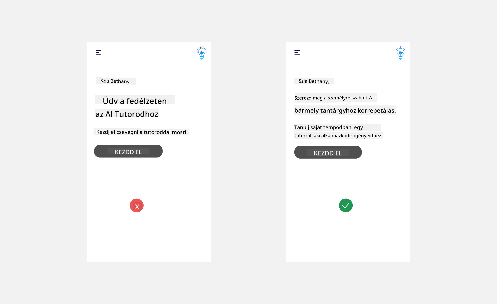
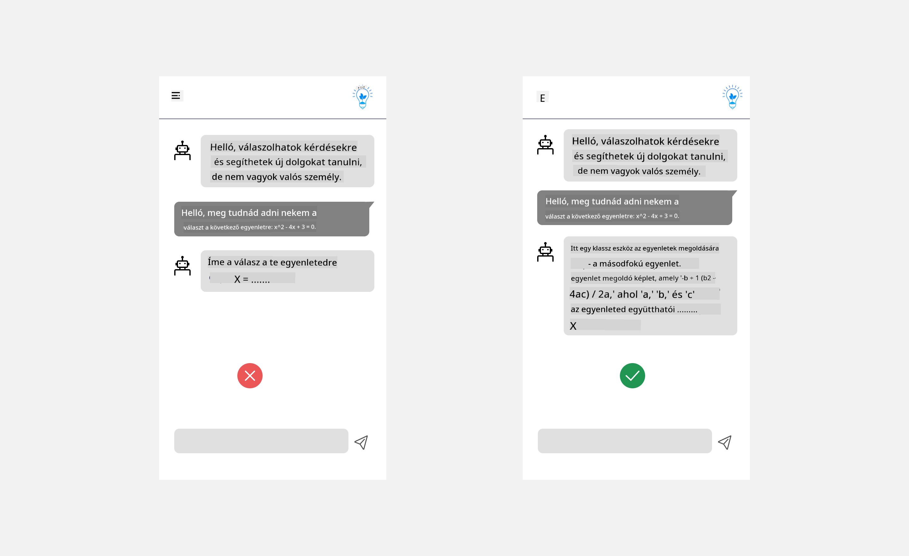
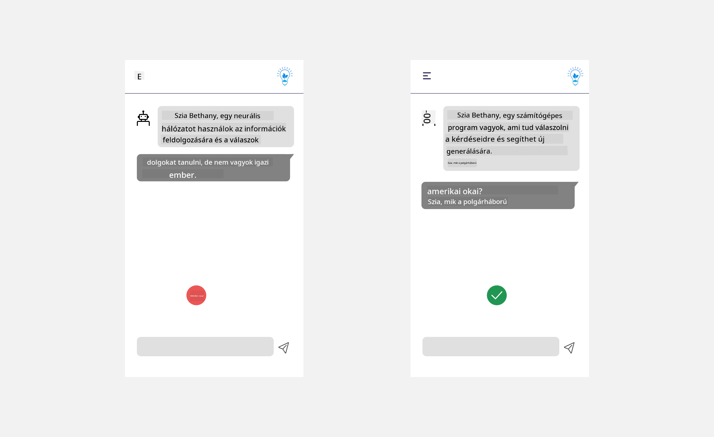
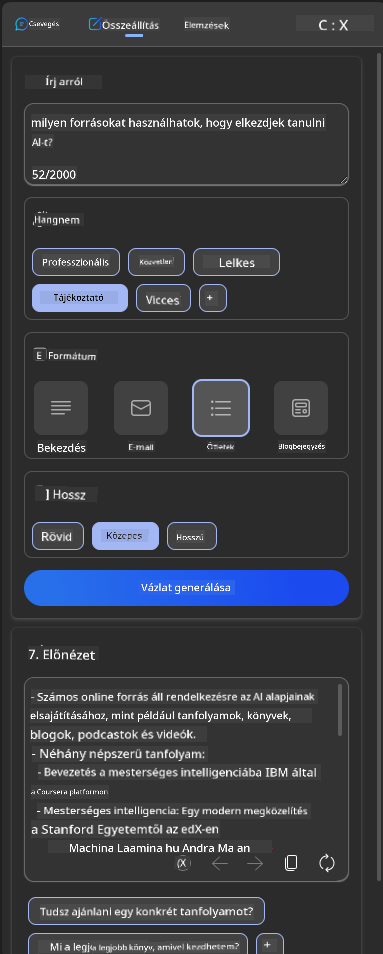
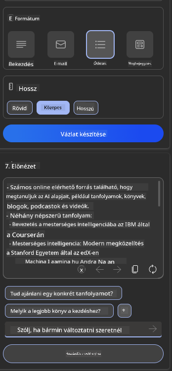
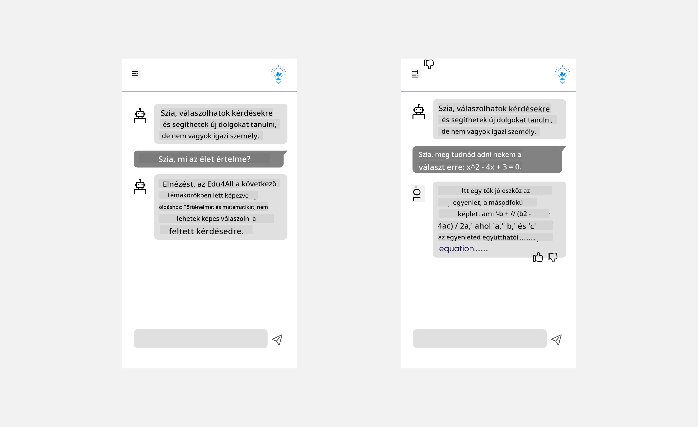

<!--
CO_OP_TRANSLATOR_METADATA:
{
  "original_hash": "ec385b41ee50579025d50cc03bfb3a25",
  "translation_date": "2025-05-19T22:03:26+00:00",
  "source_file": "12-designing-ux-for-ai-applications/README.md",
  "language_code": "hu"
}
-->
# UX tervezése AI alkalmazásokhoz

> _(Kattints a fenti képre az óra videójának megtekintéséhez)_

A felhasználói élmény nagyon fontos aspektusa az alkalmazások építésének. A felhasználóknak hatékonyan kell tudniuk használni az alkalmazást a feladatok elvégzéséhez. A hatékonyság fontos, de az alkalmazásokat úgy is kell tervezni, hogy mindenki használni tudja őket, hogy _hozzáférhetőek_ legyenek. Ez a fejezet erre a területre összpontosít, hogy végül olyan alkalmazást tervezhess, amelyet az emberek használni akarnak és tudnak.

## Bevezetés

A felhasználói élmény az, ahogyan a felhasználó interakcióba lép és használ egy adott terméket vagy szolgáltatást, legyen az rendszer, eszköz vagy dizájn. Amikor AI alkalmazásokat fejlesztenek, a fejlesztők nemcsak arra összpontosítanak, hogy a felhasználói élmény hatékony legyen, hanem arra is, hogy etikus legyen. Ebben az órában azt tárgyaljuk, hogyan építsünk mesterséges intelligencia (AI) alkalmazásokat, amelyek a felhasználói igényeket szolgálják.

Az óra a következő területeket fedi le:

- Bevezetés a felhasználói élménybe és a felhasználói igények megértésébe
- AI alkalmazások tervezése bizalom és átláthatóság érdekében
- AI alkalmazások tervezése együttműködés és visszajelzés érdekében

## Tanulási célok

Az óra elvégzése után képes leszel:

- Megérteni, hogyan építs AI alkalmazásokat, amelyek megfelelnek a felhasználói igényeknek.
- AI alkalmazásokat tervezni, amelyek elősegítik a bizalmat és az együttműködést.

### Előfeltétel

Szánj időt arra, hogy többet olvass a [felhasználói élményről és a dizájn gondolkodásról.](https://learn.microsoft.com/training/modules/ux-design?WT.mc_id=academic-105485-koreyst)

## Bevezetés a felhasználói élménybe és a felhasználói igények megértésébe

Képzeletbeli oktatási startupunkban két fő felhasználónk van, tanárok és diákok. Mindkét felhasználónak egyedi igényei vannak. A felhasználóközpontú tervezés a felhasználót helyezi előtérbe, biztosítva, hogy a termékek relevánsak és hasznosak legyenek azok számára, akiknek szánják.

Az alkalmazásnak **hasznosnak, megbízhatónak, hozzáférhetőnek és kellemesnek** kell lennie, hogy jó felhasználói élményt nyújtson.

### Használhatóság

Hasznosnak lenni azt jelenti, hogy az alkalmazás olyan funkciókkal rendelkezik, amelyek megfelelnek a tervezett célnak, például az értékelési folyamat automatizálása vagy villámkártyák létrehozása a felkészüléshez. Az alkalmazásnak, amely automatizálja az értékelési folyamatot, képesnek kell lennie arra, hogy pontosan és hatékonyan osztályozza a diákok munkáját előre meghatározott kritériumok alapján. Hasonlóképpen, az alkalmazásnak, amely villámkártyákat generál, képesnek kell lennie releváns és változatos kérdéseket létrehozni az adatai alapján.

### Megbízhatóság

Megbízhatónak lenni azt jelenti, hogy az alkalmazás képes következetesen és hibamentesen végrehajtani a feladatát. Az AI azonban, akárcsak az emberek, nem tökéletes, és hajlamos lehet hibákra. Az alkalmazások találkozhatnak hibákkal vagy váratlan helyzetekkel, amelyek emberi beavatkozást vagy korrekciót igényelnek. Hogyan kezeljük a hibákat? Az óra utolsó részében arról fogunk beszélni, hogyan tervezik az AI rendszereket és alkalmazásokat együttműködés és visszajelzés érdekében.

### Hozzáférhetőség

Hozzáférhetőnek lenni azt jelenti, hogy a felhasználói élményt kiterjesztjük különböző képességű felhasználókra, beleértve a fogyatékkal élőket is, biztosítva, hogy senki ne maradjon ki. Az akadálymentességi irányelvek és elvek követésével az AI megoldások inkluzívabbá, használhatóbbá és hasznosabbá válnak minden felhasználó számára.

### Kellemes

Kellemesnek lenni azt jelenti, hogy az alkalmazás élvezetes a használat során. Egy vonzó felhasználói élmény pozitív hatással lehet a felhasználóra, ösztönözve őket arra, hogy visszatérjenek az alkalmazáshoz, és növeljék az üzleti bevételt.

Nem minden kihívást lehet AI-val megoldani. Az AI kiegészíti a felhasználói élményt, legyen szó manuális feladatok automatizálásáról vagy felhasználói élmények személyre szabásáról.

## AI alkalmazások tervezése bizalom és átláthatóság érdekében

A bizalom építése kulcsfontosságú az AI alkalmazások tervezésekor. A bizalom biztosítja, hogy a felhasználó magabiztosan bízik abban, hogy az alkalmazás elvégzi a munkát, következetesen szállítja az eredményeket, és az eredmények megfelelnek a felhasználó igényeinek. A bizalommal kapcsolatos kockázat a bizalmatlanság és a túlzott bizalom. A bizalmatlanság akkor fordul elő, amikor a felhasználó kevés vagy nincs bizalma egy AI rendszer iránt, ami az alkalmazás elutasításához vezet. A túlzott bizalom akkor fordul elő, amikor a felhasználó túlbecsüli egy AI rendszer képességeit, ami ahhoz vezet, hogy a felhasználók túlzottan bíznak az AI rendszerben. Például egy automatizált értékelési rendszer esetében a túlzott bizalom azt eredményezheti, hogy a tanár nem ellenőrzi néhány dolgozatot, hogy megbizonyosodjon arról, hogy az értékelési rendszer jól működik. Ez igazságtalan vagy pontatlan osztályzatokat eredményezhet a diákok számára, vagy elmaradt lehetőségeket a visszajelzésre és a fejlődésre.

Két módja annak, hogy a bizalom központi szerepet kapjon a tervezésben, az a magyarázhatóság és az ellenőrzés.

### Magyarázhatóság

Amikor az AI segít döntéseket hozni, például a jövő generációinak tudásának átadásában, fontos, hogy a tanárok és a szülők megértsék, hogyan születnek az AI döntések. Ez a magyarázhatóság - megérteni, hogyan hoznak döntéseket az AI alkalmazások. A magyarázhatóság tervezése magában foglalja az AI alkalmazás példáinak részleteinek hozzáadását. Például a "Kezdje az AI tanárral" helyett a rendszer használhatja: "Összegezze jegyzeteit könnyebb felkészüléshez az AI segítségével."

Egy másik példa arra, hogyan használja az AI a felhasználói és személyes adatokat. Például egy diák szerepkörrel rendelkező felhasználónak korlátozásai lehetnek szerepköre alapján. Az AI nem tud válaszokat adni a kérdésekre, de segíthet a felhasználónak átgondolni, hogyan tudják megoldani a problémát.

A magyarázhatóság utolsó kulcsfontosságú része a magyarázatok egyszerűsítése. A diákok és tanárok nem feltétlenül AI szakértők, ezért az alkalmazás képességeinek és korlátainak magyarázata egyszerű és könnyen érthető legyen.

### Ellenőrzés

A generatív AI létrehoz egy együttműködést az AI és a felhasználó között, ahol például a felhasználó módosíthatja az utasításokat különböző eredmények érdekében. Ezenkívül, ha egy eredmény generálódik, a felhasználók képesek legyenek módosítani az eredményeket, így érzik a kontrollt. Például a Bing használatakor testre szabhatod az utasítást formátum, hangnem és hossz alapján. Ezenkívül változtatásokat adhatsz hozzá az eredményhez, és módosíthatod az eredményt, ahogy az alább látható:

A Bing egy másik funkciója, amely lehetővé teszi a felhasználó számára, hogy ellenőrzést gyakoroljon az alkalmazás felett, az a képesség, hogy bekapcsolja vagy kikapcsolja az AI által használt adatokat. Egy iskolai alkalmazás esetében egy diák szeretné használni jegyzeteit, valamint a tanárok forrásait felkészülési anyagként.

> Az AI alkalmazások tervezésekor a szándékosság kulcsfontosságú annak biztosításában, hogy a felhasználók ne bízzanak túlzottan az AI-ban, irreális elvárásokat támasztva annak képességeivel szemben. Ennek egyik módja a súrlódás létrehozása az utasítások és az eredmények között. Emlékeztetve a felhasználót arra, hogy ez AI és nem egy másik ember

## AI alkalmazások tervezése együttműködés és visszajelzés érdekében

Ahogy korábban említettük, a generatív AI létrehoz egy együttműködést a felhasználó és az AI között. A legtöbb interakció a felhasználó által beírt utasításokkal és az AI által generált eredményekkel történik. Mi van, ha az eredmény helytelen? Hogyan kezeli az alkalmazás a hibákat, ha előfordulnak? Az AI hibáztatja a felhasználót, vagy szán időt a hiba magyarázatára?

Az AI alkalmazásokat úgy kell építeni, hogy képesek legyenek visszajelzést fogadni és adni. Ez nemcsak az AI rendszer javítását segíti, hanem a felhasználókkal való bizalomépítést is. Egy visszajelzési ciklusnak szerepelnie kell a tervezésben, például egy egyszerű felfelé vagy lefelé mutató hüvelykujj az eredményen.

Egy másik módja ennek kezelésére a rendszer képességeinek és korlátainak egyértelmű kommunikálása. Ha a felhasználó hibát követ el, kérve valamit az AI képességein túl, ennek kezelésére is legyen mód, ahogy az alább látható.

Rendszerhibák gyakoriak olyan alkalmazásokban, ahol a felhasználónak szüksége lehet segítségre az AI hatókörén kívüli információkkal kapcsolatban, vagy az alkalmazás korlátozhatja, hogy hány kérdést/témát generálhat összefoglalókat. Például egy AI alkalmazás, amely korlátozott tárgyakra van kiképezve, például történelem és matematika, nem biztos, hogy tud kezelni földrajzi kérdéseket. Ennek enyhítésére az AI rendszer adhat olyan választ, mint: "Sajnálom, termékünket az alábbi tárgyak adataival képeztük ki....., nem tudok válaszolni a kérdésre, amit feltettél."

Az AI alkalmazások nem tökéletesek, ezért hibákat követhetnek el. Az alkalmazások tervezésekor biztosítani kell, hogy a felhasználói visszajelzésekre és a hibakezelésre helyet biztosítsanak egyszerű és könnyen érthető módon.

## Feladat

Vegyél bármilyen AI alkalmazást, amit eddig építettél, és fontold meg, hogy beépíted az alábbi lépéseket az alkalmazásodba:

- **Kellemes:** Fontold meg, hogyan teheted kellemesebbé az alkalmazásodat. Mindenhol adsz magyarázatokat? Ösztönzöd a felhasználót a felfedezésre? Hogyan fogalmazod meg a hibaüzeneteidet?

- **Használhatóság:** Webes alkalmazás építése. Biztosítsd, hogy az alkalmazásod egérrel és billentyűzettel is navigálható legyen.

- **Bizalom és átláthatóság:** Ne bízz teljesen az AI-ban és annak eredményeiben, fontold meg, hogyan adhatnál hozzá egy embert a folyamatba az eredmények ellenőrzésére. Fontold meg és valósíts meg más módokat a bizalom és átláthatóság elérésére.

- **Ellenőrzés:** Adj a felhasználónak ellenőrzést az alkalmazásnak megadott adatok felett. Valósíts meg egy módot, amely lehetővé teszi a felhasználó számára, hogy bekapcsolja vagy kikapcsolja az adatgyűjtést az AI alkalmazásban.

## Folytasd a tanulást!

Az óra elvégzése után nézd meg a [Generatív AI tanulási gyűjteményünket](https://aka.ms/genai-collection?WT.mc_id=academic-105485-koreyst), hogy tovább fejleszd a Generatív AI ismereteidet!

Lépj tovább a 13. órára, ahol megvizsgáljuk, hogyan [biztosítsuk az AI alkalmazásokat](../13-securing-ai-applications/README.md?WT.mc_id=academic-105485-koreyst)!

**Felelősségkizárás**:  
Ezt a dokumentumot AI fordítási szolgáltatással, a [Co-op Translator](https://github.com/Azure/co-op-translator) segítségével fordították le. Bár törekszünk a pontosságra, kérjük, vegye figyelembe, hogy az automatikus fordítások hibákat vagy pontatlanságokat tartalmazhatnak. Az eredeti dokumentum az eredeti nyelvén tekintendő hiteles forrásnak. Kritikus információk esetén javasolt a professzionális emberi fordítás. Nem vállalunk felelősséget a fordítás használatából eredő félreértésekért vagy téves értelmezésekért.