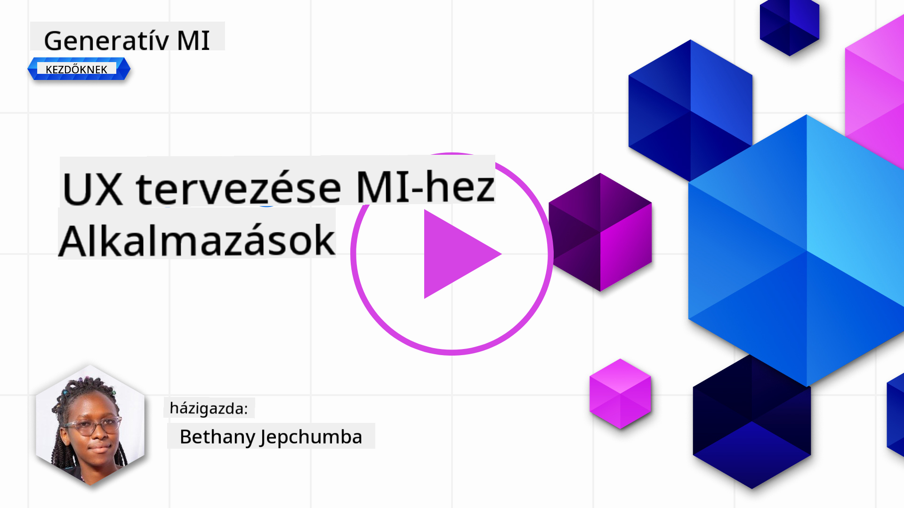
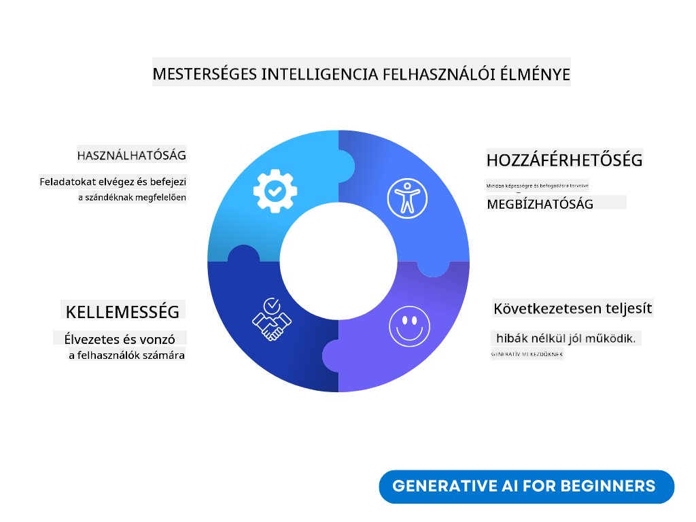
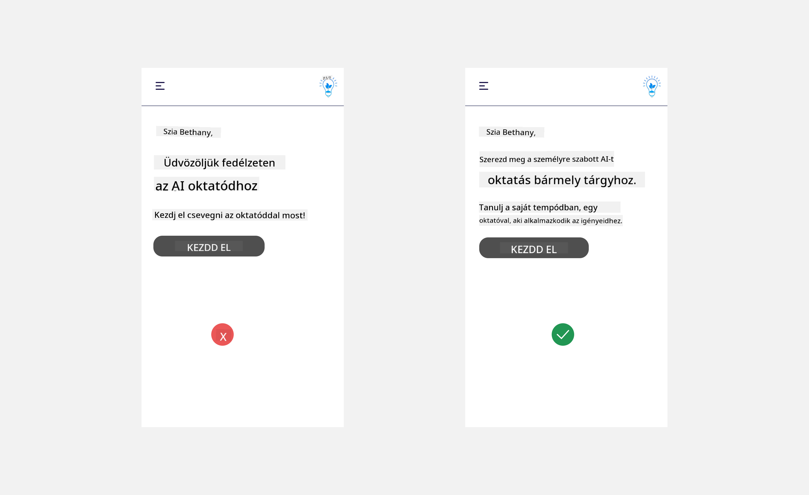
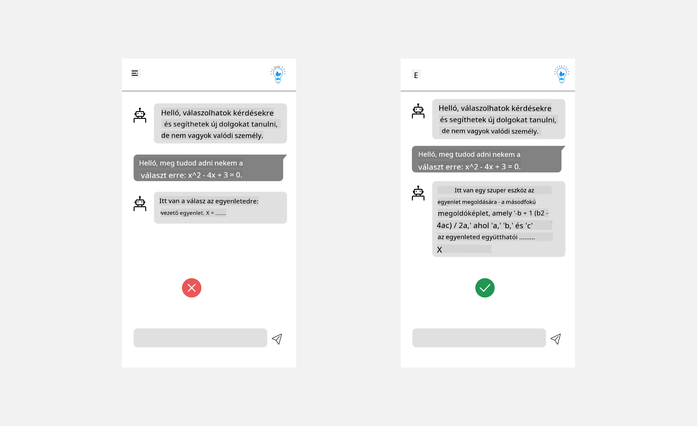
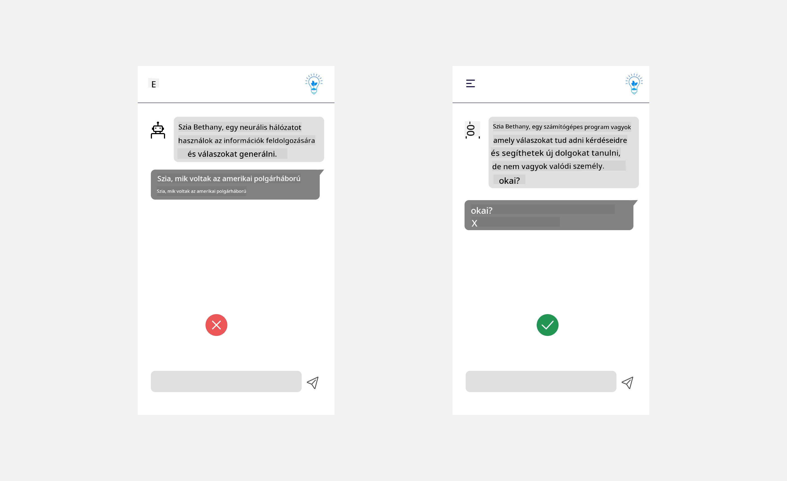
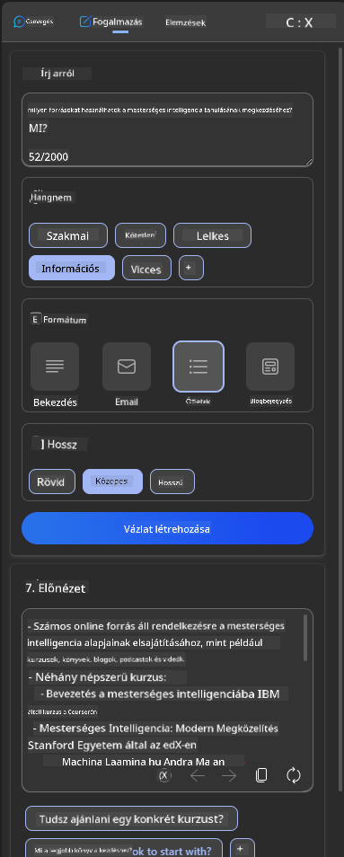
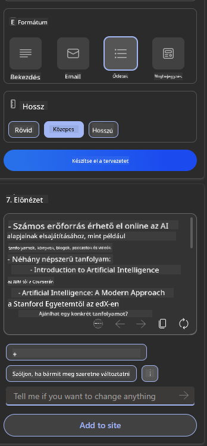
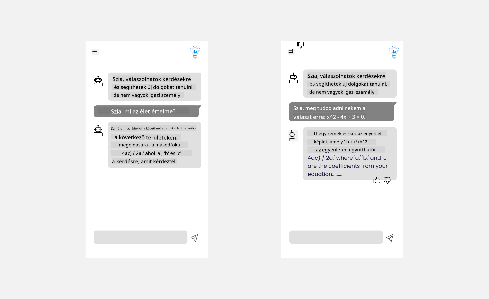

<!--
CO_OP_TRANSLATOR_METADATA:
{
  "original_hash": "ec385b41ee50579025d50cc03bfb3a25",
  "translation_date": "2025-06-25T20:31:11+00:00",
  "source_file": "12-designing-ux-for-ai-applications/README.md",
  "language_code": "hu"
}
-->
# AI alkalmazások felhasználói élményének tervezése

> _(Kattints a fenti képre az óra videójának megtekintéséhez)_

A felhasználói élmény nagyon fontos szempont az alkalmazások építésénél. A felhasználóknak hatékonyan kell tudniuk használni az alkalmazást a feladatok elvégzéséhez. Az egyik dolog, hogy hatékony legyen, de az alkalmazásokat úgy is kell tervezni, hogy mindenki számára használhatóak legyenek, hogy _hozzáférhetőek_ legyenek. Ez a fejezet erre a területre összpontosít, így remélhetőleg olyan alkalmazást tervezhetsz, amelyet az emberek tudnak és akarnak is használni.

## Bevezetés

A felhasználói élmény az, ahogyan a felhasználó egy adott terméket vagy szolgáltatást, legyen az rendszer, eszköz vagy dizájn, használ. AI alkalmazások fejlesztésekor a fejlesztők nemcsak arra összpontosítanak, hogy a felhasználói élmény hatékony legyen, hanem etikus is. Ebben az órában arról lesz szó, hogyan építsünk mesterséges intelligencia (AI) alkalmazásokat, amelyek megfelelnek a felhasználói igényeknek.

Az óra az alábbi területeket fedi le:

- Bevezetés a felhasználói élménybe és a felhasználói igények megértésébe
- AI alkalmazások tervezése bizalom és átláthatóság érdekében
- AI alkalmazások tervezése együttműködés és visszajelzés céljából

## Tanulási célok

Az óra elvégzése után képes leszel:

- Megérteni, hogyan építsünk AI alkalmazásokat, amelyek megfelelnek a felhasználói igényeknek.
- AI alkalmazásokat tervezni, amelyek elősegítik a bizalmat és az együttműködést.

### Előfeltétel

Szánj időt arra, hogy többet olvass a [felhasználói élményről és a dizájn gondolkodásról.](https://learn.microsoft.com/training/modules/ux-design?WT.mc_id=academic-105485-koreyst)

## Bevezetés a felhasználói élménybe és a felhasználói igények megértésébe

Fiktív oktatási startupunkban két elsődleges felhasználónk van, a tanárok és a diákok. Mindkét felhasználónak egyedi igényei vannak. A felhasználóközpontú tervezés a felhasználót helyezi előtérbe, biztosítva, hogy a termékek relevánsak és hasznosak legyenek azok számára, akiknek szánják.

Az alkalmazásnak **hasznosnak, megbízhatónak, hozzáférhetőnek és kellemesnek** kell lennie, hogy jó felhasználói élményt nyújtson.

### Használhatóság

Hasznosnak lenni azt jelenti, hogy az alkalmazás olyan funkcióval rendelkezik, amely megfelel a céljának, például automatizálja az értékelési folyamatot vagy létrehoz tanulókártyákat a felkészüléshez. Az alkalmazásnak, amely automatizálja az értékelési folyamatot, pontosan és hatékonyan kell tudnia pontokat adni a diákok munkájára előre meghatározott kritériumok alapján. Hasonlóképpen, egy alkalmazásnak, amely tanulókártyákat generál, releváns és változatos kérdéseket kell tudnia létrehozni az adatai alapján.

### Megbízhatóság

Megbízhatónak lenni azt jelenti, hogy az alkalmazás következetesen és hibák nélkül tudja elvégezni a feladatát. Az AI azonban, akárcsak az emberek, nem tökéletes, és hajlamos lehet hibákra. Az alkalmazások találkozhatnak hibákkal vagy váratlan helyzetekkel, amelyek emberi beavatkozást vagy korrekciót igényelnek. Hogyan kezeljük a hibákat? Az óra utolsó részében arról lesz szó, hogyan tervezik az AI rendszereket és alkalmazásokat együttműködés és visszajelzés céljából.

### Hozzáférhetőség

Hozzáférhetőnek lenni azt jelenti, hogy a felhasználói élményt kiterjesztjük különböző képességekkel rendelkező felhasználókra, beleértve a fogyatékkal élőket is, biztosítva, hogy senki ne maradjon ki. A hozzáférhetőségi irányelvek és elvek követésével az AI megoldások inkluzívabbá, használhatóbbá és hasznosabbá válnak minden felhasználó számára.

### Kellemes

Kellemesnek lenni azt jelenti, hogy az alkalmazás élvezetes a használat során. Egy vonzó felhasználói élmény pozitív hatással lehet a felhasználóra, ösztönözve őt az alkalmazás újbóli használatára és növelve az üzleti bevételt.

Nem minden kihívást lehet megoldani AI-val. Az AI azért jön, hogy kiegészítse a felhasználói élményt, legyen az manuális feladatok automatizálása vagy személyre szabott felhasználói élmények.

## AI alkalmazások tervezése bizalom és átláthatóság érdekében

A bizalom kiépítése kritikus fontosságú az AI alkalmazások tervezésekor. A bizalom biztosítja, hogy a felhasználó magabiztosan hiszi, hogy az alkalmazás elvégzi a munkát, következetesen szállítja az eredményeket, és az eredmények megfelelnek a felhasználó igényeinek. A bizalomhiány és a túlzott bizalom kockázatot jelent ezen a területen. A bizalomhiány akkor fordul elő, amikor a felhasználó kevés vagy semmilyen bizalmat nem érez egy AI rendszer iránt, ami az alkalmazás elutasításához vezet. A túlzott bizalom akkor fordul elő, amikor a felhasználó túlbecsüli egy AI rendszer képességeit, ami ahhoz vezet, hogy a felhasználók túlzottan bíznak az AI rendszerben. Például egy automatizált értékelési rendszer esetében a túlzott bizalom azt eredményezheti, hogy a tanár nem ellenőrzi néhány dolgozatot, hogy megbizonyosodjon arról, hogy az értékelési rendszer jól működik. Ez igazságtalan vagy pontatlan osztályzatokat eredményezhet a diákok számára, vagy elmulasztott lehetőségeket a visszajelzésre és a fejlődésre.

Két módja annak, hogy a bizalom a tervezés középpontjában álljon, a magyarázhatóság és az ellenőrzés.

### Magyarázhatóság

Amikor az AI segít döntéseket hozni, például tudást átadni a jövő generációinak, fontos, hogy a tanárok és a szülők megértsék, hogyan születnek az AI döntések. Ez a magyarázhatóság - annak megértése, hogyan hoznak döntéseket az AI alkalmazások. A magyarázhatóság tervezése magában foglalja az AI alkalmazás példáinak részleteinek hozzáadását. Például ahelyett, hogy "AI tanár indítása", a rendszer használhatja: "Foglalja össze a jegyzeteit könnyebb felkészülés érdekében AI segítségével."

Egy másik példa az, hogyan használja az AI a felhasználói és személyes adatokat. Például egy diák személyiségű felhasználó korlátozásokkal rendelkezhet a személyisége alapján. Az AI nem tudja megmutatni a kérdésekre adott válaszokat, de segíthet a felhasználónak átgondolni, hogyan oldhatja meg a problémát.

A magyarázhatóság egy utolsó kulcsfontosságú része a magyarázatok egyszerűsítése. A diákok és tanárok nem feltétlenül AI szakértők, ezért az alkalmazás lehetőségeinek és korlátainak magyarázatát egyszerűvé és könnyen érthetővé kell tenni.

### Ellenőrzés

A generatív AI együttműködést hoz létre az AI és a felhasználó között, ahol például a felhasználó módosíthatja a promptokat különböző eredményekért. Ezenkívül, miután egy eredmény létrejött, a felhasználóknak képesnek kell lenniük módosítani az eredményeket, megadva nekik az ellenőrzés érzését. Például a Bing használatakor testreszabhatja a promptját a formátum, a hangnem és a hossz alapján. Ezenkívül hozzáadhat változtatásokat az eredményhez és módosíthatja az eredményt, ahogyan az alább látható:

A Bing egy másik funkciója, amely lehetővé teszi a felhasználónak az alkalmazás feletti ellenőrzést, az AI által használt adatokba való be- és kilépés képessége. Egy iskolai alkalmazás esetében egy diák szeretné használni a jegyzeteit, valamint a tanárok forrásait felkészülési anyagként.

> AI alkalmazások tervezésekor a szándékosság kulcsfontosságú annak biztosításában, hogy a felhasználók ne bízzanak túlzottan, irreális elvárásokat állítva a képességeivel szemben. Ennek egyik módja a súrlódás létrehozása a promptok és az eredmények között. Emlékeztetve a felhasználót, hogy ez AI, nem pedig egy emberi társ

## AI alkalmazások tervezése együttműködés és visszajelzés céljából

Mint korábban említettük, a generatív AI együttműködést hoz létre a felhasználó és az AI között. A legtöbb interakció egy felhasználói prompt bevitelével és az AI által generált eredménnyel történik. Mi van, ha az eredmény helytelen? Hogyan kezeli az alkalmazás a hibákat, ha előfordulnak? Az AI hibáztatja a felhasználót, vagy időt szán az eredmény megmagyarázására?

Az AI alkalmazásokat úgy kell építeni, hogy fogadjanak és adjanak visszajelzést. Ez nemcsak az AI rendszer javítását segíti elő, hanem a felhasználókkal való bizalom építését is. A visszajelzési körnek szerepelnie kell a tervezésben, például egy egyszerű hüvelykujj fel vagy le az eredményen.

Egy másik módja ennek kezelésére a rendszer képességeinek és korlátainak egyértelmű kommunikációja. Amikor a felhasználó hibát követ el, és olyan dolgot kér, amely túlmutat az AI képességein, ennek kezelésére is kell egy mód, ahogy az alább látható.

Rendszerhibák gyakoriak az alkalmazásokban, ahol a felhasználónak szüksége lehet információra az AI hatókörén kívül, vagy az alkalmazásnak lehet korlátja arra, hogy hány kérdést/tantárgyat generálhat összefoglalókat. Például egy AI alkalmazás, amely korlátozott tantárgyakra van kiképezve, például történelem és matematika, nem biztos, hogy képes kezelni a földrajzi kérdéseket. Ennek enyhítésére az AI rendszer olyan válaszokat adhat, mint: "Sajnálom, a termékünk az alábbi tantárgyak adataival van kiképezve....., nem tudok válaszolni az általad feltett kérdésre."

Az AI alkalmazások nem tökéletesek, ezért hajlamosak hibázni. Az alkalmazások tervezésekor biztosítanod kell, hogy helyet adsz a felhasználói visszajelzéseknek és a hibakezelésnek olyan módon, amely egyszerű és könnyen érthető.

## Feladat

Vegyél bármilyen AI alkalmazást, amit eddig építettél, és fontold meg, hogy az alábbi lépéseket megvalósítod az alkalmazásodban:

- **Kellemes:** Gondold át, hogyan teheted az alkalmazásodat kellemesebbé. Mindenhol adsz magyarázatot? Bátorítod a felhasználót a felfedezésre? Hogyan fogalmazod meg a hibaüzeneteidet?

- **Használhatóság:** Építs webes alkalmazást. Győződj meg róla, hogy az alkalmazásodat egérrel és billentyűzettel is navigálható.

- **Bizalom és átláthatóság:** Ne bízz teljesen az AI-ban és annak eredményeiben, gondold át, hogyan adhatnál egy embert a folyamatba az eredmények ellenőrzéséhez. Fontold meg és valósíts meg más módokat a bizalom és átláthatóság elérésére.

- **Ellenőrzés:** Adj a felhasználónak ellenőrzést az alkalmazásnak megadott adataik felett. Valósíts meg egy módot, ahogyan a felhasználó be- és kiléphet az adatok gyűjtéséből az AI alkalmazásban.

## Folytasd a tanulást!

Az óra elvégzése után nézd meg a [Generatív AI Tanulási gyűjteményünket](https://aka.ms/genai-collection?WT.mc_id=academic-105485-koreyst), hogy tovább fejleszd generatív AI ismereteidet!

Lépj tovább a 13. leckére, ahol arról lesz szó, hogyan [biztosítsuk az AI alkalmazásokat](../13-securing-ai-applications/README.md?WT.mc_id=academic-105485-koreyst)!

**Jogi nyilatkozat**:  
Ez a dokumentum az AI fordítási szolgáltatás [Co-op Translator](https://github.com/Azure/co-op-translator) segítségével került lefordításra. Bár törekszünk a pontosságra, kérjük, vegye figyelembe, hogy az automatikus fordítások hibákat vagy pontatlanságokat tartalmazhatnak. Az eredeti dokumentum a saját nyelvén tekintendő hiteles forrásnak. Kritikus információk esetén javasolt a professzionális emberi fordítás. Nem vállalunk felelősséget a fordítás használatából eredő félreértésekért vagy téves értelmezésekért.