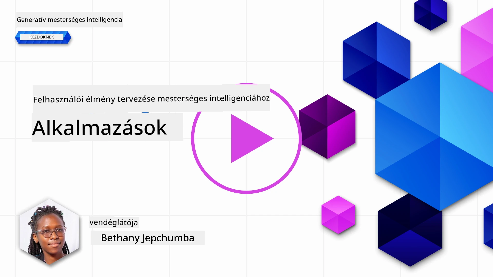
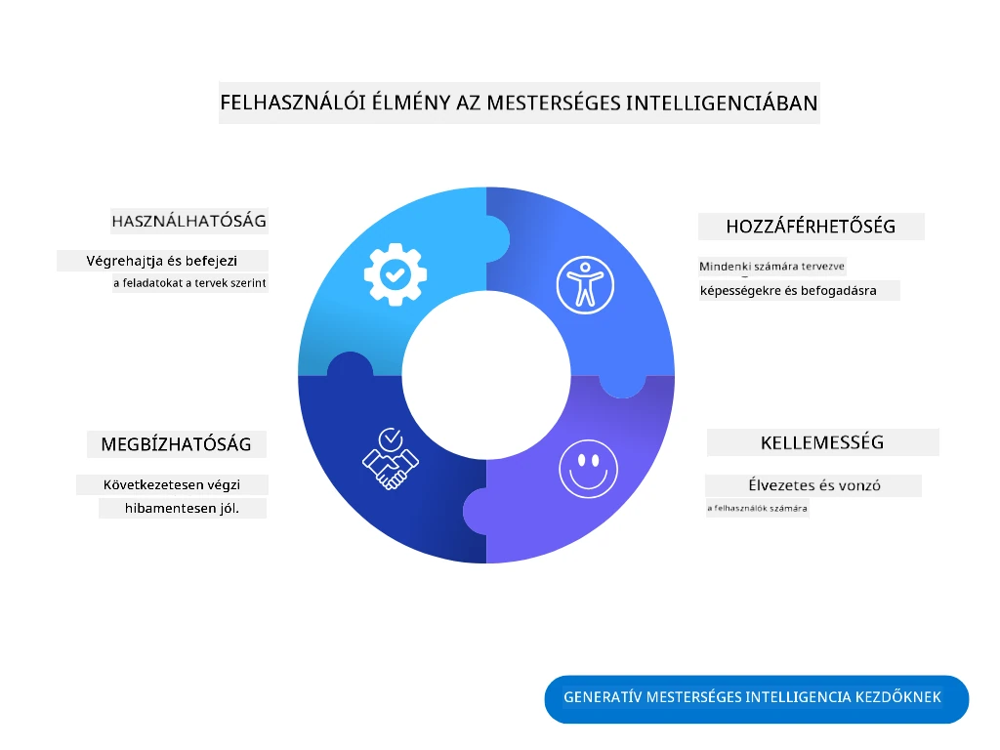
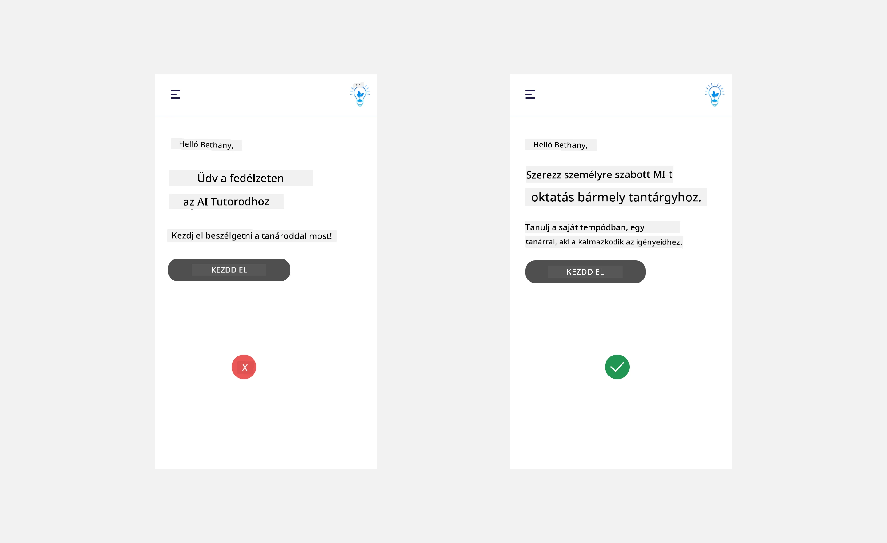
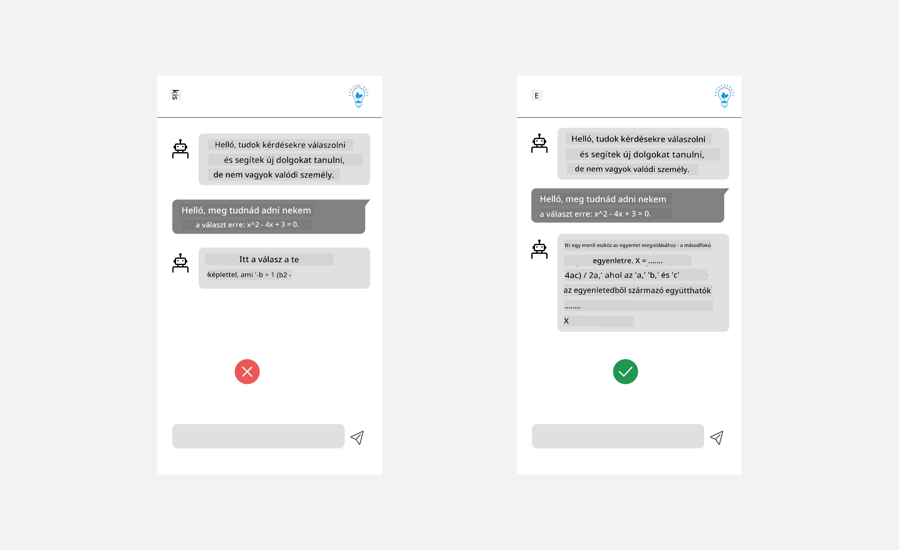
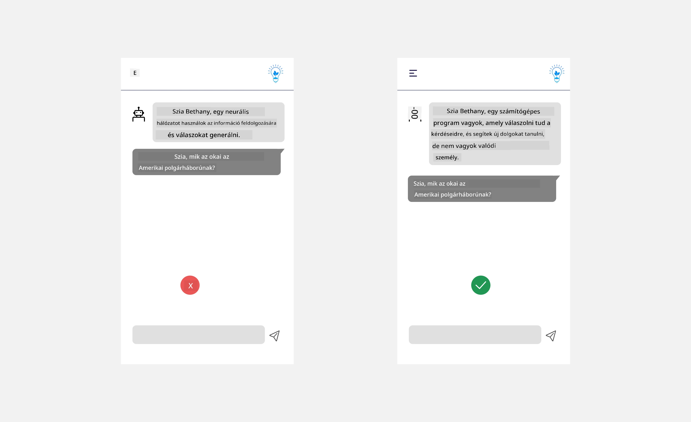
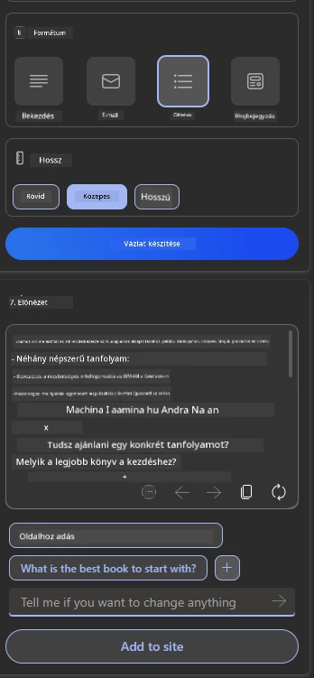
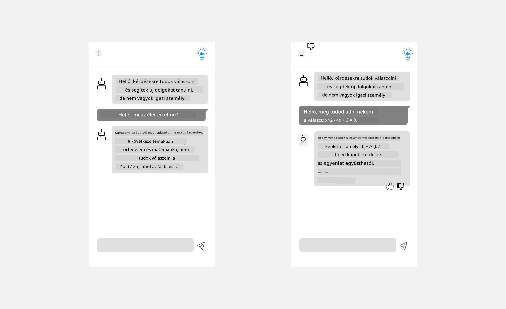

# UX tervezése AI alkalmazásokhoz

> _(Kattints a fenti képre a lecke videójának megtekintéséhez)_

A felhasználói élmény nagyon fontos szempont az alkalmazások fejlesztésében. A felhasználóknak hatékonyan kell tudniuk használni az alkalmazásodat a feladatok elvégzéséhez. A hatékonyság egy dolog, de az alkalmazásokat úgy is kell tervezni, hogy mindenki használni tudja, vagyis _akadálymentesek_ legyenek. Ez a fejezet erre a területre fókuszál, hogy remélhetőleg egy olyan alkalmazást tervezz, amit az emberek használni tudnak és akarnak is.

## Bevezetés

A felhasználói élmény azt jelenti, hogy miként lép kapcsolatba egy felhasználó egy adott termékkel vagy szolgáltatással, legyen az rendszer, eszköz vagy dizájn. AI alkalmazások fejlesztésekor a fejlesztők nemcsak a hatékony felhasználói élmény biztosítására összpontosítanak, hanem az etikus működésre is. Ebben a leckében azt tárgyaljuk, hogyan lehet olyan mesterséges intelligencia (AI) alkalmazásokat építeni, amelyek kielégítik a felhasználói igényeket.

A lecke az alábbi területeket fogja érinteni:

- Bevezetés a felhasználói élménybe és a felhasználói igények megértése
- AI alkalmazások tervezése bizalom és átláthatóság szempontjából
- AI alkalmazások tervezése együttműködés és visszacsatolás céljából

## Tanulási célok

A lecke elvégzése után képes leszel:

- Megérteni, hogyan építs olyan AI alkalmazásokat, amelyek megfelelnek a felhasználói igényeknek.
- Olyan AI alkalmazásokat tervezni, amelyek elősegítik a bizalmat és az együttműködést.

### Előfeltétel

Szánj egy kis időt, és olvass többet a [felhasználói élményről és a design thinkingről.](https://learn.microsoft.com/training/modules/ux-design?WT.mc_id=academic-105485-koreyst)

## Bevezetés a felhasználói élménybe és a felhasználói igények megértése

A képzeletbeli oktatási startupunkban két fő felhasználó van, tanárok és diákok. Mindkettőjüknek egyedi igényei vannak. Egy felhasználó-központú dizájn a felhasználót helyezi előtérbe, biztosítva, hogy a termékek relevánsak és előnyösek legyenek azok számára, akiknek szánják.

Az alkalmazásnak **hasznosnak, megbízhatónak, akadálymentesnek és kellemesnek** kell lennie, hogy jó felhasználói élményt nyújtson.

### Használhatóság

Hasznosnak lenni azt jelenti, hogy az alkalmazás olyan funkciókat tartalmaz, amelyek megfelelnek a célnak, például az értékelési folyamat automatizálása vagy ismétlő kártyák generálása a tanuláshoz. Egy olyan alkalmazás, amely automatizálja az értékelését, pontosan és hatékonyan kell, hogy osztályozza a diákok munkáit előre meghatározott kritériumok alapján. Hasonlóképpen, egy ismétlő kártyákat generáló alkalmazásnak releváns és változatos kérdéseket kell tudnia készíteni az adatai alapján.

### Megbízhatóság

Megbízhatónak lenni azt jelenti, hogy az alkalmazás konzisztensen és hibamentesen tudja ellátni a feladatát. Azonban az AI – éppúgy, mint az ember – nem tökéletes, és előfordulhatnak hibák. Az alkalmazások hibákkal vagy váratlan helyzetekkel találkozhatnak, amelyek emberi beavatkozást vagy javítást igényelnek. Hogyan kezeled a hibákat? A lecke utolsó részében foglalkozunk azzal, hogy hogyan tervezzük meg AI rendszereket és alkalmazásokat együttműködésre és visszacsatolásra.

### Akadálymentesség

Akadálymentesnek lenni azt jelenti, hogy a felhasználói élményt kiterjesztjük különböző képességű felhasználókra, beleértve a fogyatékkal élőket is, így senki nem marad ki. Az akadálymentességi irányelvek és elvek követésével az AI megoldások befogadóbbá, használhatóbbá és előnyösebbé válnak minden felhasználó számára.

### Kellemes

Kellemesnek lenni azt jelenti, hogy az alkalmazás használata örömet okoz. Egy vonzó felhasználói élmény pozitív hatással lehet a felhasználókra, ösztönözve őket az alkalmazás visszatérő használatára, ezzel növelve az üzleti bevételeket.

Nem minden kihívás oldható meg AI-val. Az AI célja, hogy kiegészítse a felhasználói élményt, például manuális feladatok automatizálásával vagy személyre szabott élményekkel.

## AI alkalmazások tervezése bizalom és átláthatóság céljából

A bizalom kiépítése kritikus az AI alkalmazások tervezésekor. A bizalom biztosítja, hogy a felhasználó bízni tudjon abban, hogy az alkalmazás elvégzi a feladatot, következetesen szolgáltatja az eredményeket, és az eredmények megfelelnek a felhasználó igényeinek. Egy kockázat ebben a területen a bizalmatlanság és a túlzott bizalom. A bizalmatlanság akkor jelentkezik, amikor a felhasználónak kevés vagy semmilyen bizalma nincs az AI rendszer iránt, ez az alkalmazás elutasításához vezet. A túlzott bizalom pedig akkor, amikor a felhasználó túlbecsüli az AI rendszer képességeit, ez túlzott bizalmat eredményez. Például egy automatikus értékelési rendszer esetén a túlzott bizalom miatt a tanár nem ellenőrizheti át a dolgozatokat, így az értékelési rendszer hibás vagy igazságtalan jegyeket adhat, vagy így elmaradhat a visszacsatolás és fejlesztési lehetőség.

Két módja annak, hogy a bizalom központi szerepet kapjon a tervezésben, az érthetőség és az irányítás.

### Érthetőség

Amikor az AI döntéseket támogat, például a jövő nemzedékek tudásának átadásában, elengedhetetlen, hogy a tanárok és a szülők megértsék, hogyan születnek az AI döntések. Ez az érthetőség – az AI alkalmazások döntéshozatalának megértése. Az érthetőség tervezése magában foglalja azokat a részleteket, amelyek kiemelik, hogyan jutott az AI az eredményhez. A közönségnek tudatában kell lennie annak, hogy az eredményt AI generálta és nem ember. Például ahelyett, hogy azt mondanánk: "Kezd el most beszélgetni a tutoroddal", azt mondjuk: "Használd az AI tutorát, amely alkalmazkodik az igényeidhez és segít a saját tempódban tanulni."

Egy másik példa az, hogy az AI hogyan használja a felhasználói és személyes adatokat. Például egy diákokat megjelenítő személyiségű felhasználónak lehetnek korlátozásai a személyisége alapján. Az AI nem adhat választ a kérdésekre, de segíthet irányítani a felhasználót abban, hogy végiggondolja, hogyan oldhat meg egy problémát.

Az érthetőség egy utolsó kulcsfontosságú része az egyszerűsítés. A diákok és tanárok nem feltétlenül AI szakértők, ezért az alkalmazás képességeiről szóló magyarázatokat egyszerűen és könnyen érthetően kell bemutatni.

### Irányítás

A generatív AI együttműködést hoz létre az AI és a felhasználó között, ahol például a felhasználó a kéréseket különböző eredmények érdekében módosíthatja. Továbbá, miután egy eredmény generálásra került, a felhasználók módosíthatják a kimenetet, így uralmat kapnak. Például a Microsoft Copilot (korábban Bing Chat) használatakor a kérést formátum, hangnem és hossz alapján testre szabhatod. Emellett módosíthatod az eredményt, ahogy az alábbi példák mutatják:

Egy másik Microsoft Copilot funkció, amely lehetőséget ad a felhasználónak az alkalmazás feletti kontrollra, az a lehetőség, hogy be- és kikapcsolhatja az AI által használt adatokat. Egy iskolai alkalmazás esetében a diák szeretné használni a saját jegyzeteit, valamint a tanárok forrásait ismétlési anyagként.

> AI alkalmazások tervezésekor a szándékosság kulcsfontosságú annak biztosításában, hogy a felhasználók ne bízzanak túlságosan az AI képességeiben és ne legyenek irreális elvárásaik. Ennek egyik módja, ha súrlódást teremtünk a kérések és az eredmények között, emlékeztetve a felhasználót, hogy ez AI és nem egy hús-vér ember.

## AI alkalmazások tervezése együttműködés és visszacsatolás céljából

Mint korábban említettük, a generatív AI együttműködést hoz létre a felhasználó és az AI között. A legtöbb interakció azon alapul, hogy a felhasználó beír egy kérést, és az AI generál egy választ. Mi történik, ha a válasz helytelen? Hogyan kezeli az alkalmazás a hibákat, ha előfordulnak? Az AI a felhasználót hibáztatja vagy időt szán a hiba magyarázatára?

Az AI alkalmazásoknak be kell építeniük a visszajelzések fogadásának és adásának lehetőségét. Ez nemcsak az AI rendszer fejlesztését segíti elő, hanem bizalmat is épít a felhasználók között. A tervezésbe visszacsatolási ciklust kell beépíteni, például egyszerű hüvelykujj fel vagy le az eredményeken.

Egy másik módja ennek a rendszer képességeinek és korlátainak világos kommunikálása. Ha a felhasználó olyan kérést tesz, amely meghaladja az AI képességeit, arra is legyen mód a kezelésére, az alábbiak szerint.

A rendszerhibák gyakoriak lehetnek olyan alkalmazásoknál, ahol a felhasználónak olyan információra van szüksége, ami kívül esik az AI hatáskörén, vagy az alkalmazás korlátozza, hogy hány kérdés/tárgy esetében generálhat összefoglalót. Például egy olyan AI alkalmazás, amely csak limitált tantárgyakból (például történelem és matematika) kapott képzést, nem tud kérdéseket kezelni földrajzból. Ennek mérséklésére az AI rendszer válaszolhat például így: "Sajnálom, termékünket az alábbi tantárgyak adatai alapján képezték..., nem tudok válaszolni az általad feltett kérdésre."

Az AI alkalmazások nem tökéletesek, ezért hibázhatnak. Alkalmazásaid tervezésekor biztosíts lehetőséget a felhasználói visszajelzésre és hibakezelésre úgy, hogy az egyszerű és könnyen érthető legyen.

## Feladat

Vegyél bármely AI alkalmazást, amit eddig építettél, és fontold meg az alábbi lépések megvalósítását:

- **Kellemes:** Gondold át, hogyan teheted az alkalmazást élvezetesebbé. Mindenhol adsz magyarázatokat? Bátorítod a felhasználót a felfedezésre? Hogyan fogalmazod meg a hibaüzeneteket?

- **Használhatóság:** Webalkalmazást építesz? Győződj meg róla, hogy az alkalmazás navigálható egérrel és billentyűzettel is.

- **Bizalom és átláthatóság:** Ne bízz teljesen az AI-ban és annak eredményeiben, gondold át, hogyan vonnál be egy embert az eredmény ellenőrzésére. Emellett érdemes más módokat is megvalósítani a bizalom és átláthatóság elérésére.

- **Irányítás:** Biztosítsd a felhasználónak az adatai feletti kontrollt. Alkalmazz olyan megoldást, amely lehetővé teszi a felhasználó számára, hogy be- és kikapcsolhassa az adatgyűjtést az AI alkalmazásban.

<!-- ## [Előadás utáni kvíz](../../../12-designing-ux-for-ai-applications/quiz-url) -->

## Folytasd a tanulást!

A lecke elvégzése után nézd meg a [Generatív AI tanulási gyűjteményünket](https://aka.ms/genai-collection?WT.mc_id=academic-105485-koreyst), hogy tovább fejleszd generatív AI tudásodat!

Lépj át a 13. leckére, ahol azzal foglalkozunk, hogyan lehet [biztonságossá tenni AI alkalmazásokat](../13-securing-ai-applications/README.md?WT.mc_id=academic-105485-koreyst)!

---

<!-- CO-OP TRANSLATOR DISCLAIMER START -->
**Jogi nyilatkozat**:
Ez a dokumentum az AI fordítási szolgáltatás, a [Co-op Translator](https://github.com/Azure/co-op-translator) segítségével készült. Bár az pontosságra törekszünk, kérjük, vegye figyelembe, hogy az automatikus fordítások hibákat vagy pontatlanságokat tartalmazhatnak. Az eredeti dokumentum az anyanyelvén tekintendő hiteles forrásnak. Fontos információk esetén professzionális emberi fordítást javasolunk. Nem vállalunk felelősséget semmilyen félreértésért vagy téves értelmezésért, amely ebből a fordításból ered.
<!-- CO-OP TRANSLATOR DISCLAIMER END -->