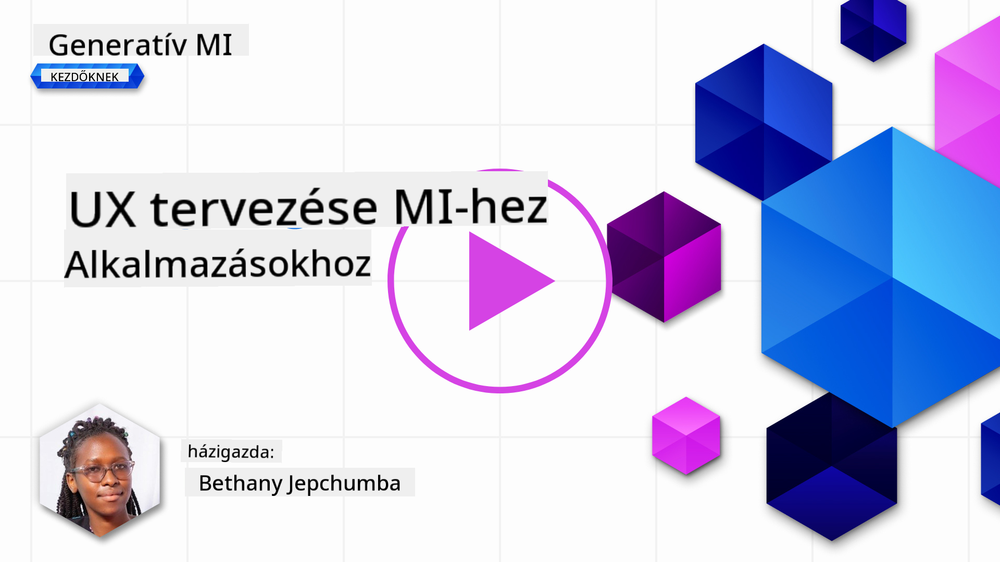
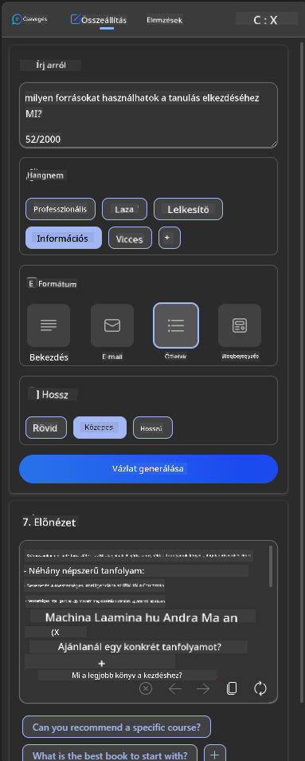

<!--
CO_OP_TRANSLATOR_METADATA:
{
  "original_hash": "747668e4c53d067369f06e9ec2e6313e",
  "translation_date": "2025-08-26T18:55:23+00:00",
  "source_file": "12-designing-ux-for-ai-applications/README.md",
  "language_code": "hu"
}
-->
# UX tervezése AI alkalmazásokhoz

> _(Kattints a fenti képre a lecke videójáért)_

A felhasználói élmény nagyon fontos szempont alkalmazások fejlesztésekor. A felhasználóknak hatékonyan kell tudniuk használni az alkalmazást a feladataik elvégzéséhez. A hatékonyság önmagában nem elég, az alkalmazásokat úgy kell megtervezni, hogy mindenki használni tudja őket, vagyis _hozzáférhetőnek_ kell lenniük. Ez a fejezet erre a területre fókuszál, hogy végül olyan alkalmazást tervezz, amit az emberek tényleg használni akarnak.

## Bevezetés

A felhasználói élmény azt jelenti, hogyan lép kapcsolatba és használ egy felhasználó egy adott terméket vagy szolgáltatást, legyen az rendszer, eszköz vagy dizájn. AI alkalmazások fejlesztésekor a fejlesztők nemcsak a hatékony felhasználói élményre, hanem az etikus működésre is figyelnek. Ebben a leckében azt vesszük át, hogyan lehet olyan mesterséges intelligencia (AI) alkalmazásokat építeni, amelyek valóban a felhasználók igényeit szolgálják.

A lecke az alábbi témákat érinti:

- Bevezetés a felhasználói élménybe és a felhasználói igények megértése
- AI alkalmazások tervezése bizalomra és átláthatóságra
- AI alkalmazások tervezése együttműködésre és visszajelzésre

## Tanulási célok

A lecke elvégzése után képes leszel:

- Megérteni, hogyan lehet AI alkalmazásokat fejleszteni, amelyek megfelelnek a felhasználói igényeknek.
- Olyan AI alkalmazásokat tervezni, amelyek elősegítik a bizalmat és az együttműködést.

### Előfeltétel

Szánj rá időt, és olvass többet a [felhasználói élményről és a design thinkingről.](https://learn.microsoft.com/training/modules/ux-design?WT.mc_id=academic-105485-koreyst)

## Bevezetés a felhasználói élménybe és a felhasználói igények megértése

A képzeletbeli oktatási startupunkban két fő felhasználónk van: tanárok és diákok. Mindkét csoportnak eltérő igényei vannak. A felhasználóközpontú tervezés a felhasználót helyezi előtérbe, biztosítva, hogy a termékek valóban relevánsak és hasznosak legyenek azok számára, akiknek szánják.

Az alkalmazásnak **hasznosnak, megbízhatónak, hozzáférhetőnek és kellemesnek** kell lennie, hogy jó felhasználói élményt nyújtson.

### Használhatóság

A hasznosság azt jelenti, hogy az alkalmazás funkciói megfelelnek a céljának, például automatizálja az értékelési folyamatot vagy tanulókártyákat generál ismétléshez. Egy olyan alkalmazás, amely automatizálja az értékelést, pontosan és hatékonyan kell, hogy pontozza a diákok munkáit előre meghatározott szempontok alapján. Hasonlóan, egy tanulókártyákat generáló alkalmazásnak releváns és változatos kérdéseket kell tudnia létrehozni az adatai alapján.

### Megbízhatóság

A megbízhatóság azt jelenti, hogy az alkalmazás következetesen és hibamentesen végzi a feladatát. Az AI, akárcsak az emberek, nem tökéletes, és előfordulhatnak hibák. Az alkalmazások hibákkal vagy váratlan helyzetekkel találkozhatnak, amelyek emberi beavatkozást vagy javítást igényelnek. Hogyan kezeljük a hibákat? A lecke utolsó részében arról lesz szó, hogyan tervezhetők az AI rendszerek együttműködésre és visszajelzésre.

### Hozzáférhetőség

A hozzáférhetőség azt jelenti, hogy a felhasználói élményt kiterjesztjük különböző képességű felhasználókra, beleértve a fogyatékkal élőket is, hogy senki ne maradjon ki. Ha követjük a hozzáférhetőségi irányelveket és elveket, az AI megoldások befogadóbbak, használhatóbbak és mindenki számára hasznosabbak lesznek.

### Kellemes élmény

A kellemes élmény azt jelenti, hogy az alkalmazás örömteli a használat során. Egy vonzó felhasználói élmény pozitív hatással lehet a felhasználóra, ösztönözve őt arra, hogy visszatérjen az alkalmazáshoz, ami növeli az üzleti bevételt is.

Nem minden problémát lehet AI-jal megoldani. Az AI abban segít, hogy javítsa a felhasználói élményt, például automatizálja a manuális feladatokat vagy személyre szabja a felhasználói élményt.

## AI alkalmazások tervezése bizalomra és átláthatóságra

A bizalom kiépítése kulcsfontosságú AI alkalmazások tervezésekor. A bizalom biztosítja, hogy a felhasználó magabiztosan használja az alkalmazást, elvégzi a feladatokat, következetesen eredményeket hoz, és az eredmények megfelelnek a felhasználó igényeinek. Kockázatot jelenthet a bizalmatlanság vagy a túlzott bizalom. Bizalmatlanság akkor fordul elő, ha a felhasználó kevés vagy semmilyen bizalmat nem érez az AI rendszer iránt, ami miatt elutasíthatja az alkalmazást. Túlzott bizalom esetén a felhasználó túlértékeli az AI képességeit, és túlzottan megbízik benne. Például egy automatikus értékelő rendszer esetén a túlzott bizalom ahhoz vezethet, hogy a tanár nem ellenőrzi a dolgozatokat, hogy megbizonyosodjon az értékelés helyességéről. Ez igazságtalan vagy pontatlan jegyekhez vezethet, vagy elmaradhat a visszajelzés és a fejlődési lehetőség.

Két módja van annak, hogy a bizalom a tervezés középpontjába kerüljön: magyarázhatóság és kontroll.

### Magyarázhatóság

Ha az AI döntéseket támogat, például tudást ad át a jövő generációinak, fontos, hogy a tanárok és szülők megértsék, hogyan születnek az AI döntései. Ez a magyarázhatóság – annak megértése, hogyan hoz döntéseket az AI. A magyarázhatóságra tervezés során részleteket kell hozzáadni, amelyek kiemelik, hogyan jutott az AI az adott eredményhez. A felhasználóknak tudniuk kell, hogy az eredményt AI generálta, nem ember. Például ahelyett, hogy azt mondanánk: "Kezdj el csevegni a tutoroddal!", mondjuk inkább: "Használd az AI tutorodat, amely alkalmazkodik az igényeidhez és segít a saját tempódban tanulni!"

Egy másik példa, hogyan használja az AI a felhasználói és személyes adatokat. Például egy diák szerepkörű felhasználónak lehetnek korlátai a szerepköre miatt. Az AI nem feltétlenül adhatja meg a válaszokat, de segíthet abban, hogy a felhasználó végiggondolja, hogyan oldhatná meg a problémát.

A magyarázhatóság másik fontos része a magyarázatok egyszerűsítése. A diákok és tanárok nem feltétlenül AI szakértők, ezért az alkalmazás képességeiről és korlátairól szóló magyarázatokat egyszerűen és érthetően kell megfogalmazni.

### Kontroll

A generatív AI együttműködést teremt az AI és a felhasználó között, például a felhasználó módosíthatja a promptokat különböző eredményekért. Emellett, ha elkészült egy eredmény, a felhasználó módosíthatja azt, így kontrollt kap a folyamat felett. Például a Bing használatakor testre szabhatod a promptot formátum, hangnem és hossz alapján. Emellett módosíthatod az eredményt, ahogy az alábbi képen látható:

A Bing másik funkciója, amely kontrollt ad a felhasználónak, hogy eldöntheti, hogy az AI milyen adatokat használhat fel. Egy iskolai alkalmazásban például a diák dönthet úgy, hogy a saját jegyzeteit és a tanári anyagokat is felhasználja ismétléshez.

> AI alkalmazások tervezésekor fontos, hogy tudatosan elkerüljük a túlzott bizalmat, amely irreális elvárásokat támaszt az AI képességeivel szemben. Ennek egyik módja, ha "súrlódást" teremtünk a promptok és az eredmények között, emlékeztetve a felhasználót, hogy ez AI, nem egy másik ember.

## AI alkalmazások tervezése együttműködésre és visszajelzésre

Ahogy korábban említettük, a generatív AI együttműködést teremt a felhasználó és az AI között. A legtöbb interakció úgy zajlik, hogy a felhasználó beír egy promptot, az AI pedig eredményt generál. Mi történik, ha az eredmény hibás? Hogyan kezeli az alkalmazás a hibákat? Az AI a felhasználót hibáztatja, vagy időt szán a hiba magyarázatára?

Az AI alkalmazásokat úgy kell megtervezni, hogy képesek legyenek visszajelzést fogadni és adni. Ez nemcsak az AI rendszer fejlődését segíti, hanem a felhasználók bizalmát is növeli. A visszacsatolási körnek része kell legyen a tervezésnek, például egy egyszerű "tetszik/nem tetszik" gomb az eredmény mellett.

Egy másik megoldás, ha világosan kommunikáljuk a rendszer képességeit és korlátait. Ha a felhasználó olyan dolgot kér, ami túlmutat az AI lehetőségein, legyen mód ennek kezelésére, ahogy az alábbi képen látható.

Rendszerhibák gyakoriak olyan alkalmazásoknál, ahol a felhasználónak az AI hatókörén kívüli információra van szüksége, vagy az alkalmazás korlátozza, hány kérdést/témát lehet összefoglalni. Például egy AI alkalmazás, amely csak történelem és matematika témákban van betanítva, nem tud földrajzi kérdésekre válaszolni. Ilyenkor az AI rendszer válaszolhat például így: "Sajnálom, a termékünk az alábbi témákban lett betanítva..., nem tudok válaszolni a kérdésedre."

Az AI alkalmazások nem tökéletesek, ezért előfordulnak hibák. Amikor alkalmazást tervezel, gondoskodj arról, hogy legyen lehetőség visszajelzésre és a hibák egyszerű, érthető kezelésére.

## Feladat

Válassz ki egy AI alkalmazást, amit eddig készítettél, és gondold át, hogyan tudnád beépíteni az alábbi lépéseket:

- **Kellemes élmény:** Gondold át, hogyan tehetnéd kellemesebbé az alkalmazásodat. Mindenhol adsz magyarázatot? Bátorítod a felhasználót a felfedezésre? Hogyan fogalmazod meg a hibaüzeneteket?

- **Használhatóság:** Ha webalkalmazást építesz, ügyelj rá, hogy egérrel és billentyűzettel is navigálható legyen.

- **Bizalom és átláthatóság:** Ne bízz meg teljesen az AI-ban és az eredményeiben, gondold át, hogyan vonnál be embert az eredmények ellenőrzésébe. Gondolj ki és valósíts meg más módszereket is a bizalom és átláthatóság elérésére.

- **Kontroll:** Adj a felhasználónak kontrollt az alkalmazásnak megadott adatai felett. Valósíts meg olyan lehetőséget, amellyel a felhasználó eldöntheti, hogy részt vesz-e az adatgyűjtésben vagy sem az AI alkalmazásban.

## Folytasd a tanulást!

A lecke elvégzése után nézd meg a [Generatív AI tanulási gyűjteményünket](https://aka.ms/genai-collection?WT.mc_id=academic-105485-koreyst), hogy tovább fejleszd a generatív AI tudásodat!

Lépj tovább a 13. leckére, ahol azt nézzük meg, hogyan [védheted meg az AI alkalmazásokat](../13-securing-ai-applications/README.md?WT.mc_id=academic-105485-koreyst)!

---

**Jogi nyilatkozat**:
Ez a dokumentum az AI fordítási szolgáltatás, a [Co-op Translator](https://github.com/Azure/co-op-translator) segítségével készült. Bár törekszünk a pontosságra, kérjük, vegye figyelembe, hogy az automatikus fordítások hibákat vagy pontatlanságokat tartalmazhatnak. Az eredeti dokumentum eredeti nyelvén tekintendő hiteles forrásnak. Kritikus információk esetén javasoljuk a professzionális, emberi fordítást. Nem vállalunk felelősséget a fordítás használatából eredő félreértésekért vagy félreértelmezésekért.