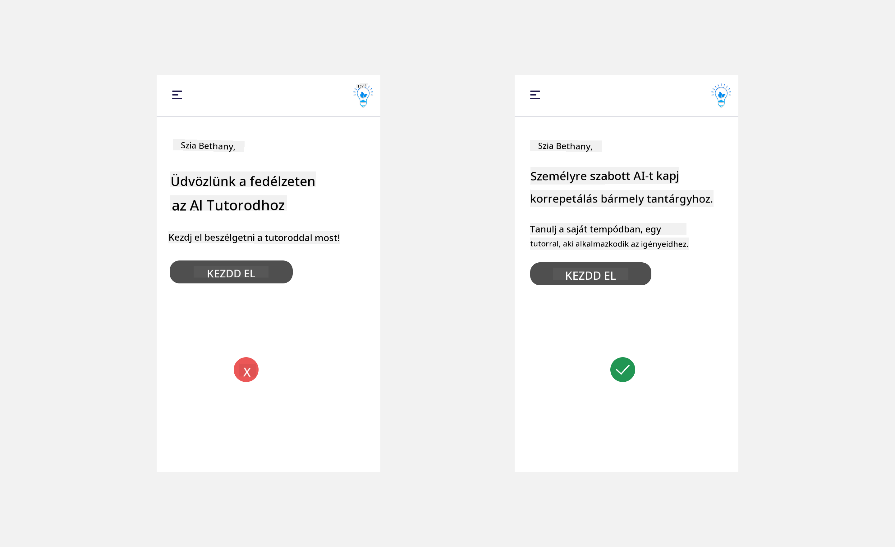

<!--
CO_OP_TRANSLATOR_METADATA:
{
  "original_hash": "78bbeed50fd4dc9fdee931f5daf98cb3",
  "translation_date": "2025-10-17T21:23:03+00:00",
  "source_file": "12-designing-ux-for-ai-applications/README.md",
  "language_code": "hu"
}
-->
# UX tervezése AI alkalmazásokhoz

> _(Kattints a fenti képre a leckéhez tartozó videó megtekintéséhez)_

A felhasználói élmény kulcsfontosságú az alkalmazások fejlesztésében. A felhasználóknak hatékonyan kell tudniuk használni az alkalmazást a feladatok elvégzéséhez. A hatékonyság egy dolog, de az alkalmazásokat úgy is kell tervezni, hogy mindenki számára használhatóak legyenek, azaz _hozzáférhetőek_. Ez a fejezet erre a területre összpontosít, hogy végül olyan alkalmazást tervezhess, amelyet az emberek használni tudnak és akarnak.

## Bevezetés

A felhasználói élmény azt jelenti, hogy a felhasználó hogyan lép kapcsolatba és használ egy adott terméket vagy szolgáltatást, legyen az rendszer, eszköz vagy dizájn. Az AI alkalmazások fejlesztésekor a fejlesztők nemcsak arra összpontosítanak, hogy a felhasználói élmény hatékony legyen, hanem arra is, hogy etikus legyen. Ebben a leckében arról lesz szó, hogyan lehet olyan mesterséges intelligencia (AI) alkalmazásokat építeni, amelyek megfelelnek a felhasználói igényeknek.

A lecke az alábbi területeket fogja lefedni:

- Bevezetés a felhasználói élménybe és a felhasználói igények megértése
- AI alkalmazások tervezése bizalom és átláthatóság érdekében
- AI alkalmazások tervezése együttműködés és visszajelzés érdekében

## Tanulási célok

A lecke elvégzése után képes leszel:

- Megérteni, hogyan lehet olyan AI alkalmazásokat építeni, amelyek megfelelnek a felhasználói igényeknek.
- Olyan AI alkalmazásokat tervezni, amelyek elősegítik a bizalmat és az együttműködést.

### Előfeltétel

Szánj időt arra, hogy többet olvass a [felhasználói élményről és a dizájn gondolkodásról.](https://learn.microsoft.com/training/modules/ux-design?WT.mc_id=academic-105485-koreyst)

## Bevezetés a felhasználói élménybe és a felhasználói igények megértése

Képzeletbeli oktatási startupunkban két elsődleges felhasználónk van: tanárok és diákok. Mindkét felhasználónak egyedi igényei vannak. A felhasználóközpontú tervezés prioritásként kezeli a felhasználót, biztosítva, hogy a termékek relevánsak és hasznosak legyenek azok számára, akiknek szánják őket.

Az alkalmazásnak **hasznosnak, megbízhatónak, hozzáférhetőnek és kellemesnek** kell lennie ahhoz, hogy jó felhasználói élményt nyújtson.

### Használhatóság

A hasznosság azt jelenti, hogy az alkalmazás olyan funkciókkal rendelkezik, amelyek megfelelnek a céljának, például az osztályozási folyamat automatizálása vagy tanulókártyák generálása ismétléshez. Egy olyan alkalmazásnak, amely automatizálja az osztályozási folyamatot, pontosan és hatékonyan kell pontokat kiosztania a diákok munkájára előre meghatározott kritériumok alapján. Hasonlóképpen, egy olyan alkalmazásnak, amely tanulókártyákat generál, releváns és változatos kérdéseket kell létrehoznia az adatai alapján.

### Megbízhatóság

A megbízhatóság azt jelenti, hogy az alkalmazás következetesen és hibák nélkül tudja elvégezni a feladatát. Az AI azonban, akárcsak az emberek, nem tökéletes, és hajlamos lehet hibákra. Az alkalmazások találkozhatnak hibákkal vagy váratlan helyzetekkel, amelyek emberi beavatkozást vagy korrekciót igényelnek. Hogyan kezeljük a hibákat? A lecke utolsó részében arról lesz szó, hogyan tervezhetők az AI rendszerek és alkalmazások az együttműködés és visszajelzés érdekében.

### Hozzáférhetőség

A hozzáférhetőség azt jelenti, hogy a felhasználói élményt kiterjesztjük különböző képességekkel rendelkező felhasználókra, beleértve a fogyatékkal élőket is, biztosítva, hogy senki ne maradjon ki. Az akadálymentességi irányelvek és elvek követésével az AI megoldások inkluzívabbá, használhatóbbá és hasznosabbá válnak minden felhasználó számára.

### Kellemes

A kellemes azt jelenti, hogy az alkalmazás élvezetes a használat során. Egy vonzó felhasználói élmény pozitív hatással lehet a felhasználóra, ösztönözve őt arra, hogy visszatérjen az alkalmazáshoz, és növelve az üzleti bevételt.

Nem minden kihívás oldható meg AI-val. Az AI kiegészíti a felhasználói élményt, legyen szó manuális feladatok automatizálásáról vagy a felhasználói élmények személyre szabásáról.

## AI alkalmazások tervezése bizalom és átláthatóság érdekében

A bizalom kiépítése kulcsfontosságú az AI alkalmazások tervezésekor. A bizalom biztosítja, hogy a felhasználó magabiztosan használja az alkalmazást, elvégzi a munkát, következetesen eredményeket szállít, és az eredmények megfelelnek a felhasználó igényeinek. Ebben a területen a kockázat a bizalomhiány és a túlzott bizalom. A bizalomhiány akkor fordul elő, amikor a felhasználó kevés vagy semmilyen bizalmat nem táplál az AI rendszer iránt, ami az alkalmazás elutasításához vezet. A túlzott bizalom akkor fordul elő, amikor a felhasználó túlbecsüli az AI rendszer képességeit, és túlzottan bízik benne. Például egy automatizált osztályozási rendszer esetében a túlzott bizalom ahhoz vezethet, hogy a tanár nem ellenőrzi néhány dolgozatot, hogy megbizonyosodjon arról, hogy az osztályozási rendszer jól működik. Ez igazságtalan vagy pontatlan osztályzatokat eredményezhet a diákok számára, vagy elmulasztott lehetőségeket a visszajelzésre és a fejlődésre.

Két módja van annak, hogy a bizalmat a tervezés középpontjába helyezzük: magyarázhatóság és kontroll.

### Magyarázhatóság

Amikor az AI segít döntéseket hozni, például tudás átadásában a jövő generációinak, kritikus fontosságú, hogy a tanárok és szülők megértsék, hogyan születnek az AI döntései. Ez a magyarázhatóság - annak megértése, hogy az AI alkalmazások hogyan hoznak döntéseket. A magyarázhatóságot szolgáló tervezés magában foglalja azokat a részleteket, amelyek kiemelik, hogyan jutott az AI az eredményhez. A közönségnek tudnia kell, hogy az eredményt AI generálta, nem pedig ember. Például ahelyett, hogy azt mondanánk: "Kezdj el csevegni a tutoroddal most", mondjuk inkább: "Használj AI tutort, amely alkalmazkodik az igényeidhez, és segít a saját tempódban tanulni."

Egy másik példa arra, hogy az AI hogyan használja a felhasználói és személyes adatokat. Például egy diák személyisége korlátozásokat jelenthet az AI számára. Az AI nem tudja megadni a válaszokat a kérdésekre, de segíthet a felhasználónak átgondolni, hogyan oldhatja meg a problémát.

A magyarázhatóság egy másik kulcsfontosságú része az egyszerűsített magyarázatok. A diákok és tanárok nem feltétlenül AI szakértők, ezért az alkalmazás képességeiről és korlátairól szóló magyarázatokat egyszerűvé és könnyen érthetővé kell tenni.

### Kontroll

A generatív AI együttműködést hoz létre az AI és a felhasználó között, ahol például a felhasználó módosíthatja a promptokat különböző eredmények érdekében. Ezenkívül, ha egy eredmény generálódik, a felhasználók módosíthatják az eredményeket, ami kontrollérzetet ad nekik. Például a Bing használatakor a felhasználó testreszabhatja a promptot formátum, hangnem és hossz alapján. Ezenkívül módosíthatja az eredményt, ahogy az alábbiakban látható:

A Bing egy másik funkciója, amely lehetővé teszi a felhasználó számára, hogy kontrollálja az alkalmazást, az adatok használatának be- és kikapcsolásának lehetősége. Egy iskolai alkalmazás esetében egy diák szeretné használni a jegyzeteit, valamint a tanárok forrásait tanulási anyagként.

> AI alkalmazások tervezésekor szándékosságra van szükség annak biztosítására, hogy a felhasználók ne bízzanak túlzottan az AI-ban, irreális elvárásokat támasztva annak képességeivel szemben. Ennek egyik módja a súrlódás létrehozása a promptok és az eredmények között, emlékeztetve a felhasználót arra, hogy ez AI, nem pedig egy másik ember.

## AI alkalmazások tervezése együttműködés és visszajelzés érdekében

Ahogy korábban említettük, a generatív AI együttműködést hoz létre a felhasználó és az AI között. A legtöbb interakció abból áll, hogy a felhasználó beír egy promptot, és az AI generál egy eredményt. Mi történik, ha az eredmény helytelen? Hogyan kezeli az alkalmazás a hibákat, ha előfordulnak? Az AI hibáztatja a felhasználót, vagy időt szán a hiba magyarázatára?

Az AI alkalmazásokat úgy kell megtervezni, hogy képesek legyenek visszajelzést fogadni és adni. Ez nemcsak az AI rendszer fejlődését segíti elő, hanem bizalmat is épít a felhasználókkal. A tervezésbe visszacsatolási hurkot kell beépíteni, például egy egyszerű hüvelykujj fel vagy le az eredményen.

Egy másik módja ennek az, hogy egyértelműen kommunikáljuk a rendszer képességeit és korlátait. Ha a felhasználó hibát követ el, és valami olyat kér, ami túlmutat az AI képességein, ennek kezelésére is legyen mód, ahogy az alábbiakban látható.

Rendszerhibák gyakoriak az alkalmazásoknál, ahol a felhasználónak szüksége lehet olyan információra, amely kívül esik az AI hatókörén, vagy az alkalmazás korlátozhatja, hogy hány kérdést/témát generálhat összefoglalókat. Például egy AI alkalmazás, amely korlátozott tárgyakra, például történelemre és matematikára van kiképezve, nem tud földrajzi kérdéseket kezelni. Ennek enyhítésére az AI rendszer válaszolhat például így: "Sajnálom, termékünk az alábbi tárgyak adataival lett kiképezve....., nem tudok válaszolni az általad feltett kérdésre."

Az AI alkalmazások nem tökéletesek, ezért hajlamosak hibázni. Az alkalmazások tervezésekor biztosítani kell, hogy legyen hely a felhasználói visszajelzéseknek és a hibakezelésnek, egyszerű és könnyen érthető módon.

## Feladat

Vegyél bármilyen AI alkalmazást, amit eddig építettél, és fontold meg az alábbi lépések megvalósítását az alkalmazásodban:

- **Kellemes:** Gondold át, hogyan teheted az alkalmazásodat kellemesebbé. Mindenhol adsz magyarázatokat? Ösztönzöd a felhasználót a felfedezésre? Hogyan fogalmazod meg a hibaüzeneteidet?

- **Használhatóság:** Webalkalmazás építésekor győződj meg róla, hogy az alkalmazás egérrel és billentyűzettel is navigálható.

- **Bizalom és átláthatóság:** Ne bízz teljesen az AI-ban és annak eredményeiben, gondold át, hogyan vonnál be egy embert az eredmények ellenőrzésébe. Fontold meg és valósíts meg más módokat is a bizalom és átláthatóság elérésére.

- **Kontroll:** Adj a felhasználónak kontrollt az alkalmazásnak megadott adatai felett. Valósíts meg egy olyan módot, amely lehetővé teszi a felhasználó számára, hogy be- és kikapcsolja az adatgyűjtést az AI alkalmazásban.

<!-- ## [Utólagos kvíz](../../../12-designing-ux-for-ai-applications/quiz-url) -->

## Folytasd a tanulást!

A lecke elvégzése után nézd meg a [Generatív AI tanulási gyűjteményünket](https://aka.ms/genai-collection?WT.mc_id=academic-105485-koreyst), hogy tovább fejleszd a generatív AI tudásodat!

Látogass el a 13. leckére, ahol arról lesz szó, hogyan [biztosítsuk az AI alkalmazásokat](../13-securing-ai-applications/README.md?WT.mc_id=academic-105485-koreyst)!

---

**Felelősség kizárása**:  
Ez a dokumentum az [Co-op Translator](https://github.com/Azure/co-op-translator) AI fordítási szolgáltatás segítségével lett lefordítva. Bár törekszünk a pontosságra, kérjük, vegye figyelembe, hogy az automatikus fordítások hibákat vagy pontatlanságokat tartalmazhatnak. Az eredeti dokumentum az eredeti nyelvén tekintendő hiteles forrásnak. Kritikus információk esetén javasolt professzionális emberi fordítást igénybe venni. Nem vállalunk felelősséget semmilyen félreértésért vagy téves értelmezésért, amely a fordítás használatából eredhet.