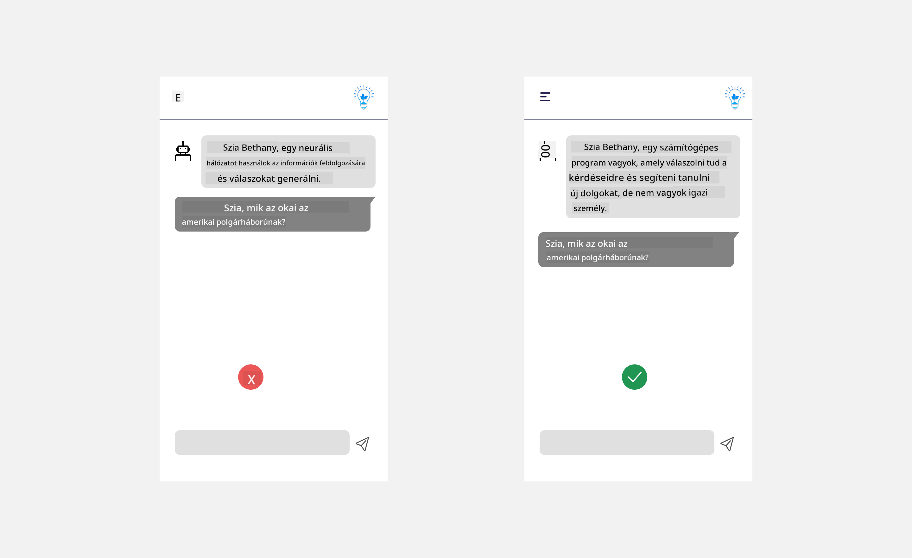
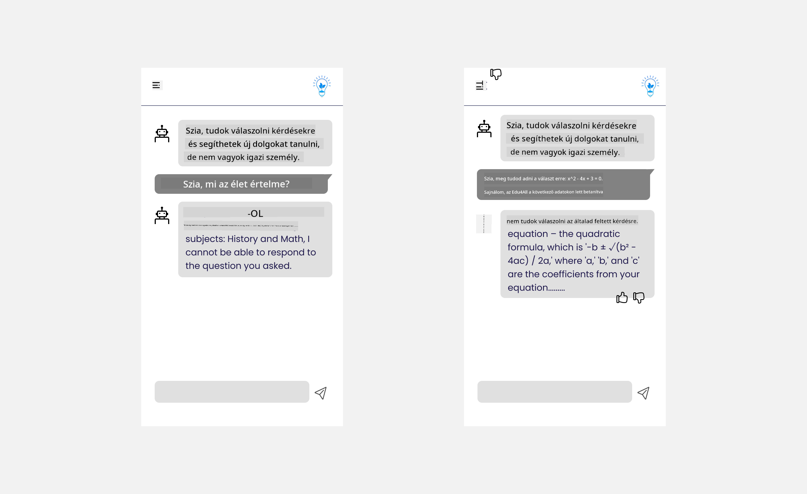

<!--
CO_OP_TRANSLATOR_METADATA:
{
  "original_hash": "ec385b41ee50579025d50cc03bfb3a25",
  "translation_date": "2025-07-09T15:03:09+00:00",
  "source_file": "12-designing-ux-for-ai-applications/README.md",
  "language_code": "hu"
}
-->
# UX tervezése AI alkalmazásokhoz

> _(Kattints a fenti képre a lecke videójának megtekintéséhez)_

A felhasználói élmény nagyon fontos szempont az alkalmazások fejlesztésénél. A felhasználóknak hatékonyan kell tudniuk használni az alkalmazásodat a feladatok elvégzéséhez. A hatékonyság fontos, de az alkalmazásokat úgy is kell tervezni, hogy mindenki számára használhatóak legyenek, vagyis _akadálymentesek_. Ez a fejezet erre a területre fókuszál, hogy végül olyan alkalmazást tervezz, amit az emberek szívesen és könnyen használnak.

## Bevezetés

A felhasználói élmény azt jelenti, hogy a felhasználó hogyan lép kapcsolatba és használ egy adott terméket vagy szolgáltatást, legyen az rendszer, eszköz vagy dizájn. AI alkalmazások fejlesztésekor a fejlesztők nemcsak arra figyelnek, hogy a felhasználói élmény hatékony legyen, hanem arra is, hogy etikus legyen. Ebben a leckében azt tárgyaljuk, hogyan lehet olyan mesterséges intelligencia (AI) alkalmazásokat építeni, amelyek megfelelnek a felhasználók igényeinek.

A lecke a következő területeket fogja érinteni:

- Bevezetés a felhasználói élménybe és a felhasználói igények megértése
- AI alkalmazások tervezése bizalom és átláthatóság jegyében
- AI alkalmazások tervezése együttműködésre és visszacsatolásra

## Tanulási célok

A lecke elvégzése után képes leszel:

- Megérteni, hogyan lehet olyan AI alkalmazásokat építeni, amelyek megfelelnek a felhasználói igényeknek.
- Olyan AI alkalmazásokat tervezni, amelyek elősegítik a bizalmat és az együttműködést.

### Előfeltétel

Szánj időt, és olvass többet a [felhasználói élményről és a design gondolkodásról.](https://learn.microsoft.com/training/modules/ux-design?WT.mc_id=academic-105485-koreyst)

## Bevezetés a felhasználói élménybe és a felhasználói igények megértése

A képzeletbeli oktatási startupunkban két fő felhasználó van: tanárok és diákok. Mindkét felhasználónak egyedi igényei vannak. A felhasználóközpontú tervezés a felhasználót helyezi előtérbe, biztosítva, hogy a termékek relevánsak és hasznosak legyenek azok számára, akiknek szánják őket.

Az alkalmazásnak **hasznosnak, megbízhatónak, akadálymentesnek és kellemesnek** kell lennie, hogy jó felhasználói élményt nyújtson.

### Használhatóság

Hasznosnak lenni azt jelenti, hogy az alkalmazás olyan funkciókkal rendelkezik, amelyek megfelelnek a rendeltetésének, például az értékelési folyamat automatizálása vagy ismétlő kártyák generálása a tanuláshoz. Egy olyan alkalmazás, amely automatizálja az értékelést, pontosan és hatékonyan kell, hogy pontozza a diákok munkáját előre meghatározott kritériumok alapján. Hasonlóképpen, egy ismétlő kártyákat generáló alkalmazásnak releváns és változatos kérdéseket kell tudnia létrehozni az adatai alapján.

### Megbízhatóság

Megbízhatónak lenni azt jelenti, hogy az alkalmazás következetesen és hibamentesen végzi el a feladatát. Azonban az AI, akárcsak az emberek, nem tökéletes, és hibák előfordulhatnak. Az alkalmazások hibákkal vagy váratlan helyzetekkel találkozhatnak, amelyek emberi beavatkozást vagy javítást igényelnek. Hogyan kezeled a hibákat? A lecke utolsó részében bemutatjuk, hogyan terveznek AI rendszereket és alkalmazásokat együttműködésre és visszacsatolásra.

### Akadálymentesség

Akadálymentesnek lenni azt jelenti, hogy a felhasználói élményt kiterjesztjük különböző képességű felhasználókra, beleértve a fogyatékkal élőket is, biztosítva, hogy senki ne maradjon ki. Az akadálymentességi irányelvek és elvek követésével az AI megoldások befogadóbbá, használhatóbbá és minden felhasználó számára előnyösebbé válnak.

### Kellemes

Kellemesnek lenni azt jelenti, hogy az alkalmazás élvezetes a használata. Egy vonzó felhasználói élmény pozitív hatással lehet a felhasználóra, ösztönözve őt az alkalmazás újrahasználatára, ami növeli az üzleti bevételt.

Nem minden kihívás oldható meg AI-val. Az AI arra szolgál, hogy kiegészítse a felhasználói élményt, legyen szó manuális feladatok automatizálásáról vagy a felhasználói élmények személyre szabásáról.

## AI alkalmazások tervezése bizalom és átláthatóság jegyében

A bizalom kiépítése kulcsfontosságú AI alkalmazások tervezésekor. A bizalom biztosítja, hogy a felhasználó bízik abban, hogy az alkalmazás elvégzi a feladatot, következetesen szállítja az eredményeket, és az eredmények megfelelnek a felhasználó igényeinek. Ebben a területben kockázatot jelent a bizalmatlanság és a túlzott bizalom. A bizalmatlanság akkor fordul elő, amikor a felhasználó kevés vagy semmilyen bizalmat nem táplál az AI rendszer iránt, ami az alkalmazás elutasításához vezet. A túlzott bizalom pedig akkor, amikor a felhasználó túlbecsüli az AI rendszer képességeit, és túlzottan megbízik benne. Például egy automatikus értékelő rendszer esetén a túlzott bizalom miatt a tanár nem ellenőrzi át a dolgozatokat, hogy megbizonyosodjon az értékelő rendszer helyességéről. Ez igazságtalan vagy pontatlan jegyekhez, illetve elmaradt visszajelzési és fejlesztési lehetőségekhez vezethet.

Két módja annak, hogy a bizalom a tervezés középpontjába kerüljön: az érthetőség és az irányítás.

### Érthetőség

Amikor az AI döntések meghozatalában segít, például a tudás átadásában a jövő generációinak, fontos, hogy a tanárok és a szülők megértsék, hogyan születnek az AI döntések. Ez az érthetőség – annak megértése, hogyan hoznak döntéseket az AI alkalmazások. Az érthetőség tervezése magában foglalja annak bemutatását, hogy az AI alkalmazás mit tud csinálni példákkal illusztrálva. Például ahelyett, hogy az alkalmazás azt mondaná: „Kezdj el dolgozni az AI tanárral”, inkább így fogalmazhat: „Foglalja össze jegyzeteit az egyszerűbb ismétléshez AI segítségével.”

Egy másik példa arra, hogyan használja az AI a felhasználói és személyes adatokat. Például egy diák személyiségű felhasználónak lehetnek korlátai a személyisége alapján. Az AI nem feltétlenül árulhatja el a válaszokat, de segíthet abban, hogy a felhasználó átgondolja, hogyan oldhat meg egy problémát.

Az érthetőség utolsó fontos eleme a magyarázatok egyszerűsítése. A diákok és tanárok nem feltétlenül AI szakértők, ezért az alkalmazás képességeiről szóló magyarázatoknak egyszerűnek és könnyen érthetőnek kell lenniük.

### Irányítás

A generatív AI együttműködést teremt az AI és a felhasználó között, ahol például a felhasználó módosíthatja a promptokat a különböző eredmények érdekében. Emellett, ha egyszer létrejött egy eredmény, a felhasználók módosíthatják azt, így kontrollt kapnak az eredmény felett. Például a Bing használatakor a promptot formátum, hangnem és hosszúság szerint alakíthatod. Emellett módosíthatod az eredményt is, ahogy az alábbi képen látható:

Egy másik Bing funkció, amely lehetővé teszi a felhasználó számára az irányítást, az az adatfelhasználásra való beleegyezés vagy elutasítás lehetősége. Egy iskolai alkalmazás esetén a diák szeretné használni a saját jegyzeteit, valamint a tanárok anyagait ismétlő anyagként.

> AI alkalmazások tervezésekor a szándékosság kulcsfontosságú annak biztosításában, hogy a felhasználók ne bízzanak túlzottan az AI-ban, és ne állítsanak fel irreális elvárásokat a képességeivel kapcsolatban. Ennek egyik módja, hogy súrlódást teremtsünk a promptok és az eredmények között, emlékeztetve a felhasználót, hogy ez AI, nem pedig egy másik ember.

## AI alkalmazások tervezése együttműködésre és visszacsatolásra

Ahogy korábban említettük, a generatív AI együttműködést teremt a felhasználó és az AI között. A legtöbb interakció úgy zajlik, hogy a felhasználó beír egy promptot, az AI pedig generál egy választ. Mi történik, ha az eredmény hibás? Hogyan kezeli az alkalmazás a hibákat, ha előfordulnak? Az AI a felhasználót hibáztatja, vagy időt szán arra, hogy elmagyarázza a hibát?

Az AI alkalmazásokat úgy kell megépíteni, hogy képesek legyenek visszajelzést fogadni és adni. Ez nemcsak az AI rendszer fejlesztését segíti, hanem növeli a felhasználók bizalmát is. A tervezésbe be kell építeni egy visszacsatolási hurkot, például egy egyszerű „tetszik” vagy „nem tetszik” gombot az eredmény mellett.

Egy másik módja a hibakezelésnek, ha világosan kommunikáljuk a rendszer képességeit és korlátait. Ha a felhasználó olyan kérést tesz, ami meghaladja az AI képességeit, akkor erre is legyen mód a kezelésre, ahogy az alábbi ábra mutatja.

A rendszerhibák gyakoriak olyan alkalmazásoknál, ahol a felhasználónak olyan információra lehet szüksége, ami kívül esik az AI hatókörén, vagy az alkalmazás korlátozhatja, hogy hány kérdésre vagy témára lehet összefoglalót generálni. Például egy AI alkalmazás, amely csak történelem és matematika témakörében van betanítva, nem biztos, hogy képes földrajzi kérdésekre válaszolni. Ennek elkerülésére az AI rendszer válasza lehet például: „Sajnálom, termékünket az alábbi tantárgyak adatai alapján képeztük ki..., nem tudok válaszolni a feltett kérdésre.”

Az AI alkalmazások nem tökéletesek, ezért hibázhatnak. Az alkalmazás tervezésekor biztosítani kell, hogy legyen hely a felhasználói visszajelzéseknek és a hibakezelésnek, egyszerű és könnyen érthető módon.

## Feladat

Vegyél elő bármilyen AI alkalmazást, amit eddig készítettél, és fontold meg az alábbi lépések beépítését az alkalmazásodba:

- **Kellemes:** Gondold át, hogyan tehetnéd az alkalmazásodat élvezetesebbé. Mindenhol adsz magyarázatokat? Bátorítod a felhasználót a felfedezésre? Hogyan fogalmazod meg a hibajelzéseket?

- **Használhatóság:** Webalkalmazás építésekor ügyelj arra, hogy az alkalmazás egérrel és billentyűzettel egyaránt navigálható legyen.

- **Bizalom és átláthatóság:** Ne bízz teljesen az AI-ban és az általa adott eredményekben, gondold át, hogyan vonhatnál be egy embert az eredmények ellenőrzésére. Emellett fontold meg és valósíts meg más módszereket is a bizalom és átláthatóság növelésére.

- **Irányítás:** Adj a felhasználónak kontrollt az általa az alkalmazásnak megadott adatok felett. Valósíts meg olyan megoldást, amely lehetővé teszi a felhasználó számára, hogy beleegyezzen vagy elutasítsa az adatgyűjtést az AI alkalmazásban.

## Folytasd a tanulást!

A lecke elvégzése után nézd meg a [Generatív AI tanulási gyűjteményünket](https://aka.ms/genai-collection?WT.mc_id=academic-105485-koreyst), hogy tovább fejleszd generatív AI ismereteidet!

Lépj tovább a 13. leckére, ahol az AI alkalmazások [biztonságáról](../13-securing-ai-applications/README.md?WT.mc_id=academic-105485-koreyst) lesz szó!

**Jogi nyilatkozat**:  
Ez a dokumentum az AI fordító szolgáltatás, a [Co-op Translator](https://github.com/Azure/co-op-translator) segítségével készült. Bár a pontosságra törekszünk, kérjük, vegye figyelembe, hogy az automatikus fordítások hibákat vagy pontatlanságokat tartalmazhatnak. Az eredeti dokumentum az anyanyelvén tekintendő hiteles forrásnak. Fontos információk esetén szakmai, emberi fordítást javaslunk. Nem vállalunk felelősséget a fordítás használatából eredő félreértésekért vagy téves értelmezésekért.