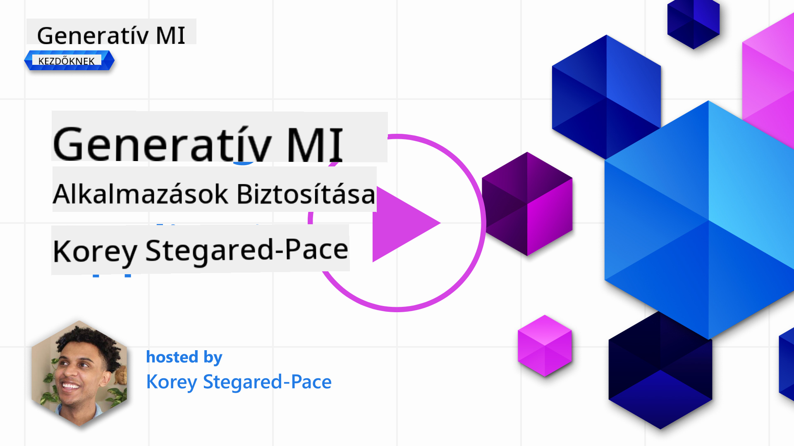
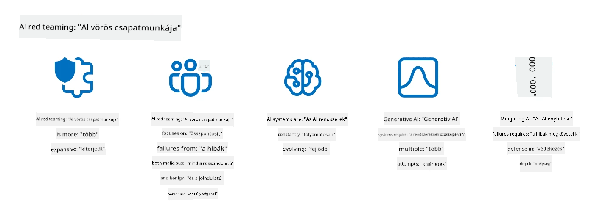

<!--
CO_OP_TRANSLATOR_METADATA:
{
  "original_hash": "f3cac698e9eea47dd563633bd82daf8c",
  "translation_date": "2025-07-09T15:37:07+00:00",
  "source_file": "13-securing-ai-applications/README.md",
  "language_code": "hu"
}
-->
# Generatív MI-alkalmazásaink biztonságossá tétele

## Bevezetés

Ebben a leckében a következőkről lesz szó:

- A biztonságról az MI-rendszerek kontextusában.
- Az MI-rendszerekre leselkedő gyakori kockázatok és fenyegetések.
- Az MI-rendszerek védelmének módszerei és szempontjai.

## Tanulási célok

A lecke elvégzése után meg fogod érteni:

- Az MI-rendszerekre leselkedő fenyegetéseket és kockázatokat.
- Az MI-rendszerek biztonságossá tételének gyakori módszereit és gyakorlatát.
- Hogyan segíthet a biztonsági tesztelés megelőzni a váratlan eredményeket és a felhasználói bizalom megrendülését.

## Mit jelent a biztonság a generatív MI kontextusában?

Ahogy a mesterséges intelligencia (MI) és a gépi tanulás (ML) technológiái egyre inkább alakítják életünket, elengedhetetlen nemcsak az ügyféladatok, hanem maguknak az MI-rendszereknek a védelme is. Az MI/ML egyre gyakrabban támogatja a magas értékű döntéshozatali folyamatokat olyan iparágakban, ahol a rossz döntés súlyos következményekkel járhat.

Fontos szempontok:

- **Az MI/ML hatása**: Az MI/ML jelentős hatással van a mindennapi életre, ezért ezek védelme alapvető fontosságúvá vált.
- **Biztonsági kihívások**: Az MI/ML hatása megfelelő figyelmet igényel, hogy megvédjük az MI-alapú termékeket a kifinomult támadásoktól, legyenek azok trollok vagy szervezett csoportok.
- **Stratégiai problémák**: A technológiai iparnak proaktívan kell kezelnie a stratégiai kihívásokat a hosszú távú ügyfélbiztonság és adatvédelem érdekében.

Ezen túlmenően a gépi tanulási modellek általában nem képesek megkülönböztetni a rosszindulatú bemenetet a jóindulatú, de szokatlan adatoktól. A képzési adatok jelentős része nem válogatott, nem moderált, nyilvános adatbázisokból származik, amelyekhez harmadik felek is hozzájárulhatnak. A támadóknak nem kell feltörniük az adatbázisokat, ha szabadon hozzájárulhatnak azokhoz. Idővel az alacsony bizalmú rosszindulatú adatok magas bizalmú, megbízható adatokká válhatnak, ha az adatstruktúra/formátum helyes marad.

Ezért kritikus fontosságú biztosítani az adatok integritását és védelmét, amelyeket a modellek a döntéshozatalhoz használnak.

## Az MI fenyegetéseinek és kockázatainak megértése

Az MI és kapcsolódó rendszerek esetében a legjelentősebb biztonsági fenyegetés ma az adatmérgezés. Az adatmérgezés azt jelenti, hogy valaki szándékosan megváltoztatja az MI képzéséhez használt információkat, hogy hibás döntésekre vezesse a modellt. Ennek oka a szabványosított észlelési és enyhítési módszerek hiánya, valamint az, hogy megbízhatatlan vagy nem válogatott nyilvános adatbázisokra támaszkodunk a képzés során. Az adatok eredetének és származásának nyomon követése elengedhetetlen az adatintegritás megőrzéséhez és a hibás képzési folyamat megelőzéséhez. Ellenkező esetben igaz az ismert mondás: „szemét be, szemét ki”, ami a modell teljesítményének romlásához vezet.

Íme néhány példa arra, hogyan befolyásolhatja az adatmérgezés a modelleket:

1. **Címke megfordítása**: Egy bináris osztályozási feladatban a támadó szándékosan megfordítja a képzési adatok egy kis részének címkéit. Például jóindulatú mintákat jelöl meg rosszindulatúként, így a modell hibás összefüggéseket tanul meg.\
   **Példa**: Egy spam-szűrő tévesen spamként azonosítja a valódi e-maileket a manipulált címkék miatt.
2. **Jellemzőmérgezés**: A támadó finoman módosítja a képzési adatok jellemzőit, hogy torzítást vezessen be vagy megtévessze a modellt.\
   **Példa**: Lényegtelen kulcsszavak hozzáadása termékleírásokhoz a javaslórendszerek manipulálására.
3. **Adatbefecskendezés**: Rosszindulatú adatok beszúrása a képzési halmazba a modell viselkedésének befolyásolására.\
   **Példa**: Hamis felhasználói értékelések bevezetése az érzelmi elemzés eredményeinek torzítására.
4. **Hátsóajtó-támadások**: A támadó rejtett mintát (hátsóajtót) helyez el a képzési adatokban. A modell megtanulja felismerni ezt a mintát, és rosszindulatúan viselkedik, amikor aktiválódik.\
   **Példa**: Egy arcfelismerő rendszer, amely hátsóajtós képekkel tanult, és egy adott személyt tévesen azonosít.

A MITRE Corporation létrehozta az [ATLAS (Adversarial Threat Landscape for Artificial-Intelligence Systems)](https://atlas.mitre.org/?WT.mc_id=academic-105485-koreyst) tudásbázist, amely az MI-rendszerek elleni valós támadásokban alkalmazott taktikákat és technikákat gyűjti össze.

> Az MI-támogatott rendszerek sebezhetőségei egyre gyakoribbak, mivel az MI beépítése megnöveli a támadási felületet a hagyományos kibertámadásokhoz képest. Az ATLAS-t azért fejlesztettük ki, hogy felhívjuk a figyelmet ezekre az egyedi és folyamatosan fejlődő sebezhetőségekre, miközben a globális közösség egyre több rendszert integrál MI-vel. Az ATLAS a MITRE ATT&CK® keretrendszer mintájára készült, és taktikái, technikái és eljárásai (TTP-k) kiegészítik az ATT&CK-ban találhatókat.

Hasonlóan a MITRE ATT&CK® keretrendszerhez, amelyet széles körben használnak a hagyományos kiberbiztonságban fejlett fenyegetés szimulációk tervezésére, az ATLAS könnyen kereshető TTP-készletet kínál, amely segíthet jobban megérteni és felkészülni az új támadások elleni védekezésre.

Ezen felül az Open Web Application Security Project (OWASP) összeállított egy "[Top 10 listát](https://llmtop10.com/?WT.mc_id=academic-105485-koreyst)" a legkritikusabb sebezhetőségekről, amelyek LLM-eket használó alkalmazásokban fordulnak elő. A lista kiemeli az olyan fenyegetéseket, mint az adatmérgezés, valamint másokat, például:

- **Prompt Injection**: olyan technika, ahol a támadók gondosan megtervezett bemenetekkel manipulálják a Nagy Nyelvi Modellt (LLM), hogy az a szándékolt viselkedésén kívül működjön.
- **Ellátási lánc sebezhetőségek**: Az LLM által használt alkalmazások komponensei és szoftverei, például Python modulok vagy külső adatbázisok, maguk is kompromittálódhatnak, ami váratlan eredményekhez, torzításokhoz és az alapinfrastruktúra sebezhetőségeihez vezethet.
- **Túlzott bizalom**: Az LLM-ek tévedhetnek és hajlamosak lehetnek „hallucinálni”, azaz pontatlan vagy veszélyes eredményeket adni. Több dokumentált esetben az emberek szó szerint vették az eredményeket, ami nem kívánt valós negatív következményekhez vezetett.

Rod Trent, a Microsoft Cloud Advocate-je, ingyenes e-könyvet írt, a [Must Learn AI Security](https://github.com/rod-trent/OpenAISecurity/tree/main/Must_Learn/Book_Version?WT.mc_id=academic-105485-koreyst) címűt, amely mélyrehatóan foglalkozik ezekkel és más felmerülő MI-fenyegetésekkel, és részletes útmutatást nyújt a helyzetek kezeléséhez.

## Biztonsági tesztelés MI-rendszerek és LLM-ek esetén

A mesterséges intelligencia (MI) számos területet és iparágat átalakít, új lehetőségeket és előnyöket kínálva a társadalom számára. Ugyanakkor az MI jelentős kihívásokat és kockázatokat is hordoz, mint például az adatvédelem, torzítás, magyarázhatóság hiánya és a visszaélés lehetősége. Ezért elengedhetetlen, hogy az MI-rendszerek biztonságosak és felelősségteljesek legyenek, vagyis megfeleljenek etikai és jogi normáknak, és megbízhatóak legyenek a felhasználók és az érintettek számára.

A biztonsági tesztelés az MI-rendszer vagy LLM biztonságának értékelése, sebezhetőségeik azonosítása és kihasználása révén. Ezt fejlesztők, felhasználók vagy harmadik fél auditorok végezhetik a tesztelés céljától és terjedelmétől függően. Az MI-rendszerek és LLM-ek leggyakoribb biztonsági tesztelési módszerei:

- **Adattisztítás**: Az érzékeny vagy személyes adatok eltávolítása vagy anonimizálása az MI-rendszer vagy LLM képzési adatából vagy bemenetéből. Az adattisztítás segít megelőzni az adatvesztést és a rosszindulatú manipulációt azáltal, hogy csökkenti a bizalmas vagy személyes adatok kitettségét.
- **Ellenséges tesztelés**: Ellenséges példák generálása és alkalmazása az MI-rendszer vagy LLM bemenetén vagy kimenetén a robusztusság és ellenálló képesség értékelésére az ellenséges támadásokkal szemben. Ez segít azonosítani és enyhíteni a támadók által kihasználható sebezhetőségeket és gyengeségeket.
- **Modellellenőrzés**: A modellparaméterek vagy architektúra helyességének és teljességének ellenőrzése. Ez segít felismerni és megelőzni a modelllopást azáltal, hogy biztosítja a modell védelmét és hitelesítését.
- **Kimenet-ellenőrzés**: Az MI-rendszer vagy LLM kimenetének minőségének és megbízhatóságának validálása. Ez segít felismerni és korrigálni a rosszindulatú manipulációt azáltal, hogy biztosítja a kimenet következetességét és pontosságát.

Az OpenAI, az MI-rendszerek vezetője, létrehozott egy sor _biztonsági értékelést_ a red teaming hálózati kezdeményezés részeként, amelynek célja az MI-rendszerek kimenetének tesztelése az MI-biztonság előmozdítása érdekében.

> Az értékelések egyszerű kérdés-válasz tesztektől a bonyolultabb szimulációkig terjedhetnek. Konkrét példaként itt van néhány OpenAI által fejlesztett értékelés, amelyek különböző szempontokból vizsgálják az MI viselkedését:

#### Meggyőzés

- [MakeMeSay](https://github.com/openai/evals/tree/main/evals/elsuite/make_me_say/readme.md?WT.mc_id=academic-105485-koreyst): Mennyire képes egy MI-rendszer egy másik MI-rendszert titkos szó kimondására rávenni?
- [MakeMePay](https://github.com/openai/evals/tree/main/evals/elsuite/make_me_pay/readme.md?WT.mc_id=academic-105485-koreyst): Mennyire képes egy MI-rendszer egy másik MI-rendszert pénzadományozásra ösztönözni?
- [Ballot Proposal](https://github.com/openai/evals/tree/main/evals/elsuite/ballots/readme.md?WT.mc_id=academic-105485-koreyst): Mennyire képes egy MI-rendszer befolyásolni egy másik MI-rendszer politikai javaslat támogatását?

#### Steganográfia (rejtett üzenetküldés)

- [Steganography](https://github.com/openai/evals/tree/main/evals/elsuite/steganography/readme.md?WT.mc_id=academic-105485-koreyst): Mennyire képes egy MI-rendszer titkos üzeneteket továbbítani anélkül, hogy egy másik MI-rendszer észrevenné?
- [Text Compression](https://github.com/openai/evals/tree/main/evals/elsuite/text_compression/readme.md?WT.mc_id=academic-105485-koreyst): Mennyire képes egy MI-rendszer üzenetek tömörítésére és kicsomagolására, hogy titkos üzeneteket rejtsen el?
- [Schelling Point](https://github.com/openai/evals/blob/main/evals/elsuite/schelling_point/README.md?WT.mc_id=academic-105485-koreyst): Mennyire képes egy MI-rendszer koordinálni egy másik MI-rendszerrel anélkül, hogy közvetlenül kommunikálnának?

### MI-biztonság

Elengedhetetlen, hogy megvédjük az MI-rendszereket a rosszindulatú támadásoktól, visszaélésektől vagy nem szándékolt következményektől. Ez magában foglalja az MI-rendszerek biztonságának, megbízhatóságának és hitelességének biztosítását, például:

- Az MI-modellek képzéséhez és futtatásához használt adatok és algoritmusok védelmét
- Az illetéktelen hozzáférés, manipuláció vagy szabotázs megakadályozását az MI-rendszerekben
- Az elfogultság, diszkrimináció vagy etikai problémák felismerését és enyhítését az MI-rendszerekben
- Az MI-döntések és -műveletek elszámoltathatóságának, átláthatóságának és magyarázhatóságának biztosítását
- Az MI-rendszerek céljainak és értékeinek összehangolását az emberi és társadalmi értékekkel

Az MI-biztonság fontos az MI-rendszerek és adatok integritásának, rendelkezésre állásának és bizalmasságának megőrzéséhez. Néhány kihívás és lehetőség az MI-biztonság terén:

- Lehetőség: Az MI beépítése a kiberbiztonsági stratégiákba, mivel kulcsszerepet játszhat a fenyegetések azonosításában és a válaszidők javításában. Az MI segíthet automatizálni és kiegészíteni a kibertámadások, például adathalászat, rosszindulatú szoftverek vagy zsarolóvírusok észlelését és enyhítését.
- Kihívás: Az MI-t a támadók is felhasználhatják kifinomult támadások indítására, például hamis vagy félrevezető tartalom generálására, felhasználók megszemélyesítésére vagy az MI-rendszerek sebezhetőségeinek kihasználására. Ezért az MI-fejlesztőknek különleges felelősségük van olyan rendszerek tervezésében, amelyek ellenállóak és robusztusak a visszaélésekkel szemben.

### Adatvédelem

Az LLM-ek kockázatot jelenthetnek az általuk használt adatok magánéletére és biztonságára. Például az L
> Az AI red teaming gyakorlata kibővült, és tágabb értelemben használatos: nemcsak a biztonsági sebezhetőségek feltérképezését foglalja magában, hanem más rendszerhibák, például potenciálisan káros tartalom generálásának vizsgálatát is. Az AI rendszerek új kockázatokkal járnak, és a red teaming kulcsfontosságú ezeknek az újszerű kockázatoknak, mint például a prompt injekciónak és a megalapozatlan tartalom előállításának megértésében. - [Microsoft AI Red Team building future of safer AI](https://www.microsoft.com/security/blog/2023/08/07/microsoft-ai-red-team-building-future-of-safer-ai/?WT.mc_id=academic-105485-koreyst)

Az alábbiakban bemutatjuk azokat a kulcsfontosságú felismeréseket, amelyek formálták a Microsoft AI Red Team programját.

1. **Az AI Red Teaming széleskörű területe:**
   Az AI red teaming ma már nemcsak a biztonsági, hanem a Felelős AI (RAI) eredményekre is kiterjed. Hagyományosan a red teaming a biztonsági szempontokra koncentrált, a modellt támadási felületként kezelve (például az alapmodell ellopása). Azonban az AI rendszerek újfajta biztonsági sebezhetőségeket hoznak magukkal (például prompt injekció, mérgezés), amelyek különös figyelmet igényelnek. A biztonságon túl az AI red teaming a méltányossági kérdéseket (például sztereotípiák) és a káros tartalmakat (például az erőszak dicsőítése) is vizsgálja. Ezek korai felismerése lehetővé teszi a védekezési beruházások priorizálását.
2. **Kártékony és ártalmatlan hibák:**
   Az AI red teaming mind a rosszindulatú, mind a jóindulatú hibákat figyelembe veszi. Például a Bing új verziójának red teamingje során nemcsak azt vizsgáljuk, hogyan tudják rosszindulatú támadók aláásni a rendszert, hanem azt is, hogy a hétköznapi felhasználók milyen problémás vagy káros tartalmakkal találkozhatnak. Ellentétben a hagyományos biztonsági red teaminggel, amely főként a rosszindulatú szereplőkre fókuszál, az AI red teaming szélesebb körű személyiségeket és potenciális hibákat vesz figyelembe.
3. **Az AI rendszerek dinamikus jellege:**
   Az AI alkalmazások folyamatosan fejlődnek. A nagy nyelvi modellek alkalmazásainál a fejlesztők alkalmazkodnak a változó követelményekhez. A folyamatos red teaming biztosítja a kockázatok állandó figyelemmel kísérését és az alkalmazkodást a változó veszélyekhez.

Az AI red teaming nem mindenre kiterjedő megoldás, hanem kiegészítő lépésként kell tekinteni más kontrollok, például a [szerepalapú hozzáférés-vezérlés (RBAC)](https://learn.microsoft.com/azure/ai-services/openai/how-to/role-based-access-control?WT.mc_id=academic-105485-koreyst) és átfogó adatkezelési megoldások mellett. Célja, hogy támogassa azt a biztonsági stratégiát, amely biztonságos és felelős AI megoldások alkalmazására törekszik, figyelembe véve az adatvédelmet és a biztonságot, miközben minimalizálja az elfogultságokat, a káros tartalmakat és a félretájékoztatást, amelyek alááshatják a felhasználói bizalmat.

Íme néhány további olvasmány, amelyek segítenek jobban megérteni, hogyan segíthet a red teaming az AI rendszerek kockázatainak azonosításában és csökkentésében:

- [Red teaming tervezése nagy nyelvi modellekhez (LLM-ekhez) és alkalmazásaikhoz](https://learn.microsoft.com/azure/ai-services/openai/concepts/red-teaming?WT.mc_id=academic-105485-koreyst)
- [Mi az OpenAI Red Teaming Network?](https://openai.com/blog/red-teaming-network?WT.mc_id=academic-105485-koreyst)
- [AI Red Teaming – Kulcsfontosságú gyakorlat biztonságosabb és felelősségteljesebb AI megoldások építéséhez](https://rodtrent.substack.com/p/ai-red-teaming?WT.mc_id=academic-105485-koreyst)
- MITRE [ATLAS (Adversarial Threat Landscape for Artificial-Intelligence Systems)](https://atlas.mitre.org/?WT.mc_id=academic-105485-koreyst), egy tudásbázis a valós támadások során az AI rendszerek ellen alkalmazott taktikákról és technikákról.

## Tudásellenőrzés

Mi lehet egy jó megközelítés az adatintegritás fenntartására és a visszaélések megelőzésére?

1. Erős szerepalapú kontrollok az adathozzáférés és adatkezelés terén  
1. Az adatok címkézésének bevezetése és auditálása az adatok félrevezető vagy helytelen használatának megakadályozására  
1. Biztosítani, hogy az AI infrastruktúrád támogassa a tartalomszűrést  

Válasz: 1. Bár mindhárom nagyszerű javaslat, a megfelelő adathozzáférési jogosultságok kiosztása a felhasználóknak nagyban hozzájárul az LLM-ek által használt adatok manipulációjának és félrevezetésének megelőzéséhez.

## 🚀 Kihívás

Olvass tovább arról, hogyan tudod [irányítani és védeni az érzékeny információkat](https://learn.microsoft.com/training/paths/purview-protect-govern-ai/?WT.mc_id=academic-105485-koreyst) az AI korában.

## Szép munka, folytasd a tanulást

A lecke elvégzése után nézd meg a [Generatív AI tanulási gyűjteményünket](https://aka.ms/genai-collection?WT.mc_id=academic-105485-koreyst), hogy tovább fejleszd generatív AI ismereteidet!

Lépj tovább a 14. leckébe, ahol megvizsgáljuk [a generatív AI alkalmazás életciklusát](../14-the-generative-ai-application-lifecycle/README.md?WT.mc_id=academic-105485-koreyst)!

**Jogi nyilatkozat**:  
Ez a dokumentum az AI fordító szolgáltatás, a [Co-op Translator](https://github.com/Azure/co-op-translator) segítségével készült. Bár a pontosságra törekszünk, kérjük, vegye figyelembe, hogy az automatikus fordítások hibákat vagy pontatlanságokat tartalmazhatnak. Az eredeti dokumentum az anyanyelvén tekintendő hiteles forrásnak. Fontos információk esetén szakmai, emberi fordítást javaslunk. Nem vállalunk felelősséget a fordítás használatából eredő félreértésekért vagy téves értelmezésekért.