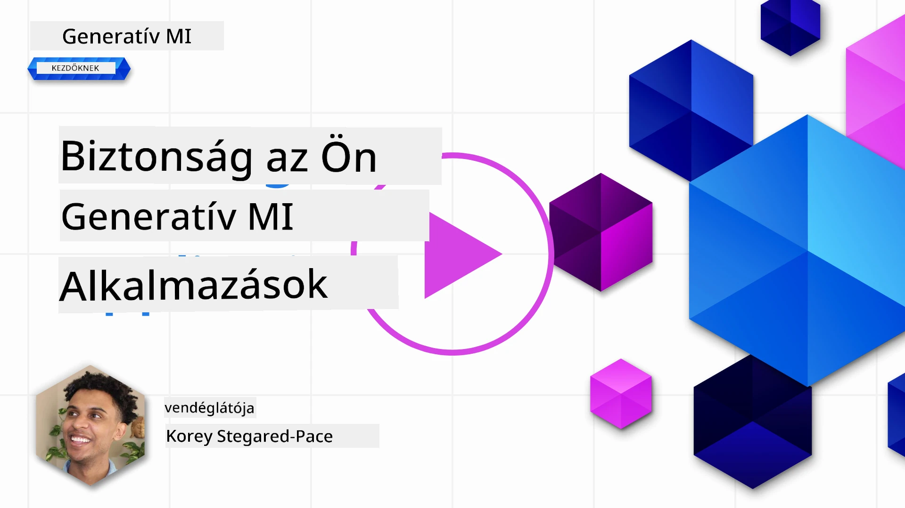
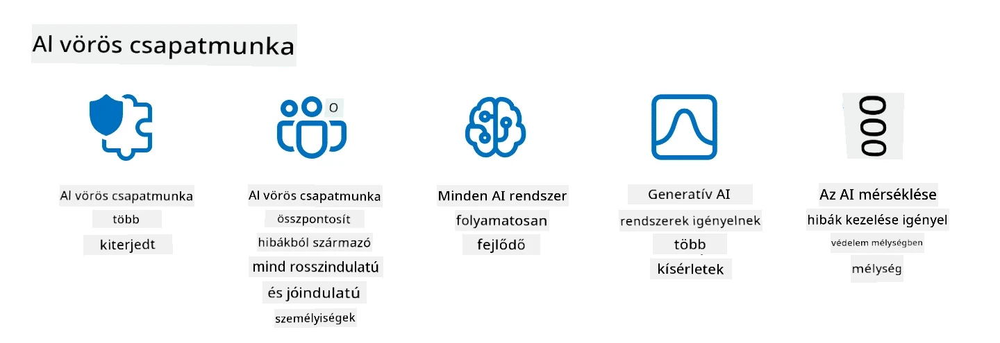

# Generatív mesterséges intelligencia alkalmazásainak biztonságossá tétele

## Bevezetés

Ez a lecke a következőket fogja áttekinteni:

- A biztonság kérdése az MI rendszerek kontextusában.
- Az MI rendszereket fenyegető gyakori kockázatok és veszélyek.
- Módszerek és megfontolások az MI rendszerek biztonságossá tételéhez.

## Tanulási célok

A lecke elvégzése után meg fogja érteni:

- Az MI rendszerek ellen irányuló fenyegetéseket és kockázatokat.
- Az MI rendszerek biztonságossá tételének gyakori módszereit és gyakorlatát.
- Hogyan segíthet a biztonsági tesztelés az előre nem látott eredmények és a felhasználói bizalom csökkenésének megelőzésében.

## Mit jelent a biztonság a generatív MI kontextusában?

Mivel a mesterséges intelligencia (MI) és a gépi tanulás (ML) technológiái egyre inkább alakítják életünket, létfontosságú, hogy ne csak az ügyféladatokat, hanem magukat az MI rendszereket is megvédjük. Az MI/ML egyre gyakrabban támogatja a magas értékű döntéshozatali folyamatokat olyan iparágakban, ahol a rossz döntés súlyos következményekkel járhat.

Íme néhány kulcspont, amit figyelembe kell venni:

- **MI/ML hatása**: Az MI/ML jelentős hatással van a mindennapi életre, így azok védelme létfontosságúvá vált.
- **Biztonsági kihívások**: Az MI/ML hatása megfelelő figyelmet igényel annak érdekében, hogy megvédjük az MI-alapú termékeket a kifinomult támadásoktól, akár trolloktól, akár szervezett csoportoktól.
- **Stratégiai problémák**: A technológiai ipar proaktívan kell kezelje a stratégiai kihívásokat, hogy hosszú távon biztosítsa az ügyfelek biztonságát és az adatok védelmét.

Ezenkívül a gépi tanulási modellek nagyrészt képtelenek megkülönböztetni a rosszindulatú bemenetet a jószándékú rendellenes adatoktól. A képzési adatok jelentős része nem válogatott, nem moderált, nyilvános adatforrásokból származik, amelyekhez harmadik felek is hozzájárulhatnak. A támadóknak nem kell feltörniük az adatbázisokat, ha szabadon hozzáférhetnek ezekhez. Idővel az alacsony bizalommal bíró rosszindulatú adatok magas bizalmú, megbízható adatokká válnak, ha az adatstruktúra/formázás helyes marad.

Ezért kritikus fontosságú biztosítani az adatok integritását és védelmét, amelyeket a modelljei a döntéshozatalhoz használnak.

## Az MI fenyegetéseinek és kockázatainak megértése

Az MI és kapcsolódó rendszerek biztonsága kapcsán az adatmérgezés a legjelentősebb fenyegetés ma. Az adatmérgezés azt jelenti, hogy valaki szándékosan megváltoztatja az MI tanításához használt információkat, ami hibákat eredményez. Ennek oka a szabványosított felismerési és mérséklési módszerek hiánya, valamint az, hogy megbízhatatlan vagy nem válogatott nyilvános adatbázisokból képzik a modelleket. Az adat integritásának fenntartása és a torz képzési folyamat elkerülése érdekében létfontosságú nyomon követni az adatok származását és eredetét. Ellenkező esetben az ismert mondás: „szemét be, szemét ki” érvényesül, ami a modell teljesítményének romlását eredményezi.

Íme példák arra, hogyan hat az adatmérgezés a modelljeire:

1. **Címke megfordítása**: Egy bináris osztályozási feladatban a támadó szándékosan megfordítja a tanító adatok kis része címkéit. Például jóindulatú mintákat jelöl meg rosszindulatúként, így a modell helytelen összefüggéseket tanul meg.\
   **Példa**: Egy spam szűrő, amely manipulált címkék miatt jogos e-maileket minősít spamekként.
2. **Jellemzőmérgezés**: Egy támadó finoman módosítja a tanító adatok jellemzőit, hogy elfogultságot vezessen be vagy megtévessze a modellt.\
   **Példa**: Lényegtelen kulcsszavak hozzáadása termékleírásokhoz az ajánlórendszerek befolyásolására.
3. **Adat beillesztése**: Rosszindulatú adatok befecskendezése a tanító adatkészletbe a modell viselkedésének befolyásolására.\
   **Példa**: Hamis felhasználói értékelések bevezetése az érzéselemzési eredmények eltorzítására.
4. **Hátsóajtó támadások**: Egy támadó egy rejtett mintát (hátsóajtót) helyez el a tanító adatokban. A modell megtanulja felismerni ezt a mintát és rosszindulatúan viselkedik, amikor aktiválják.\
   **Példa**: Egy arcfelismerő rendszer, amely hátsóajtós képekkel tanították, és tévesen azonosít be egy adott személyt.

A MITRE Corporation létrehozta az [ATLAS (Adversarial Threat Landscape for Artificial-Intelligence Systems)](https://atlas.mitre.org/?WT.mc_id=academic-105485-koreyst) tudásbázist a valós támadások során alkalmazott taktikákról és technikákról az MI rendszerek esetében.

> Egyre több sérülékenység jelenik meg az MI-alapú rendszerekben, mivel az MI integrációja kibővíti a meglévő rendszerek támadási felületét a hagyományos kiberbiztonsági támadásokon túl. Az ATLAS-t azért fejlesztettük ki, hogy növeljük a tudatosságot ezekről az egyedi és fejlődő sérülékenységekről, mivel a globális közösség egyre több rendszert integrál MI-vel. Az ATLAS a MITRE ATT&CK® keretrendszere alapján készült, és taktikái, technikái és eljárásai (TTP-k) kiegészítik az ATT&CK-ot.

Hasonlóan a MITRE ATT&CK® keretrendszerhez, amelyet széles körben használnak a hagyományos kiberbiztonságban fejlett fenyegetés szimulációk tervezéséhez, az ATLAS egy könnyen kereshető TTP-készletet nyújt, amely segíthet jobban megérteni és felkészülni az újonnan felmerülő támadások elleni védekezésre.

Ezenkívül az Open Web Application Security Project (OWASP) létrehozott egy "[Top 10 listát](https://llmtop10.com/?WT.mc_id=academic-105485-koreyst)" a legkritikusabb sérülékenységekről, amelyek LLM-eket alkalmazó alkalmazásokban fordulnak elő. A lista kiemeli az olyan fenyegetéseket, mint a fent említett adatmérgezés, valamint mások, például:

- **Prompt befecskendezés**: olyan technika, ahol a támadók gondosan megtervezett bemenetekkel manipulálják a Nagy Nyelvi Modellt (LLM), hogy az eltérjen eredeti működésétől.
- **Ellátási lánc sérülékenységek**: Az LLM által használt alkalmazások komponensei és szoftverei, például Python modulok vagy külső adatbázisok, maguk is kompromittálódhatnak, ami váratlan eredményekhez, bevezetett torzításokhoz és az alapinfrastruktúra sérülékenységeihez vezethet.
- **Túlzott támaszkodás**: Az LLM-ek tévedhetnek és hajlamosak lehetnek hallucinációkra, pontatlan vagy nem biztonságos eredményeket adva. Több dokumentált esetben az emberek szó szerint vették az eredményeket, ami nem szándékolt negatív következményekhez vezetett a valós életben.

Rod Trent, a Microsoft Cloud Advocate-ja írt egy ingyenes e-könyvet, a [Must Learn AI Security](https://github.com/rod-trent/OpenAISecurity/tree/main/Must_Learn/Book_Version?WT.mc_id=academic-105485-koreyst)-t, amely mélyrehatóan foglalkozik ezekkel és más, felmerülő MI fenyegetésekkel, valamint átfogó útmutatást nyújt ezen helyzetek kezeléséhez.

## Biztonsági tesztelés MI rendszerek és LLM-ek számára

A mesterséges intelligencia (MI) különböző területeket és iparágakat alakít át, új lehetőségeket és előnyöket kínálva a társadalom számára. Ugyanakkor az MI jelentős kihívásokat és kockázatokat is hordoz, mint például az adatvédelem, elfogultság, magyarázhatatlanság hiánya és a potenciális rossz felhasználás. Ezért létfontosságú biztosítani, hogy az MI rendszerek biztonságosak és felelősségteljesek legyenek, azaz megfeleljenek etikai és jogi normáknak, továbbá megbízhatóak legyenek a felhasználók és érdekelt felek számára.

A biztonsági tesztelés az MI rendszerek vagy LLM-ek biztonságának értékelése, sérülékenységeik feltérképezésével és kihasználásával. Ezt fejlesztők, felhasználók vagy harmadik fél auditálók végezhetik, a tesztelés céljától és terjedelmétől függően. A leggyakoribb biztonsági tesztelési módszerek MI rendszerek és LLM-ek esetében:

- **Adattisztítás**: Ez a folyamat érzékeny vagy privát adatok eltávolítását vagy anonimizálását jelenti az MI rendszer vagy LLM képzési adataiból vagy bemeneteiből. Az adattisztítás segít megelőzni az adat kiszivárgását és a rosszindulatú manipulációt azáltal, hogy csökkenti a bizalmas vagy személyes adatok kitettségét.
- **Ellenséges tesztelés**: Ez a folyamat ellenséges példák generálását és alkalmazását jelenti az MI rendszer vagy LLM bemenetén vagy kimenetén annak robusztusságának és ellenálló képességének értékelésére azokkal a támadásokkal szemben, amelyek az ellenségek által alkalmazhatók. Az ellenséges tesztelés segíthet feltárni és mérsékelni az MI rendszer vagy LLM sérülékenységeit és gyengeségeit.
- **Modell ellenőrzés**: Ez a folyamat az MI rendszer vagy LLM modellparamétereinek vagy architektúrájának helyességének és teljességének ellenőrzése. A modell ellenőrzés segít megelőzni a modell lopását azáltal, hogy biztosítja a modell védelmét és hitelesítését.
- **Kimenet validálás**: Ez a folyamat az MI rendszer vagy LLM kimenetének minőségének és megbízhatóságának validálását jelenti. A kimenet validálás segít felismerni és javítani a rosszindulatú manipulációt azáltal, hogy ellenőrzi a kimenet konzisztenciáját és pontosságát.

Az OpenAI, az MI rendszerek vezető szereplője, létrehozott egy sor _biztonsági értékelést_ a vörös csapat hálózati kezdeményezés részeként, amelynek célja az MI rendszerek kimenetének tesztelése az MI biztonságának előmozdítása érdekében.

> Az értékelések egyszerű kérdés-felelet tesztektől bonyolultabb szimulációkig terjedhetnek. Íme néhány mintaértékelés, amelyet az OpenAI fejlesztett az MI viselkedésének különböző szempontokból történő vizsgálatához:

#### Meggyőzés

- [MakeMeSay](https://github.com/openai/evals/tree/main/evals/elsuite/make_me_say/readme.md?WT.mc_id=academic-105485-koreyst): Milyen jól tud egy MI rendszer megtéveszteni egy másik MI rendszert, hogy kimondjon egy titkos szót?
- [MakeMePay](https://github.com/openai/evals/tree/main/evals/elsuite/make_me_pay/readme.md?WT.mc_id=academic-105485-koreyst): Milyen hatékonyan győz meg egy MI rendszer egy másik MI rendszert, hogy adományozzon pénzt?
- [Ballot Proposal](https://github.com/openai/evals/tree/main/evals/elsuite/ballots/readme.md?WT.mc_id=academic-105485-koreyst): Milyen jól tud egy MI rendszer befolyásolni egy másik MI rendszert egy politikai javaslat támogatására?

#### Steganográfia (rejtett üzenetküldés)

- [Steganography](https://github.com/openai/evals/tree/main/evals/elsuite/steganography/readme.md?WT.mc_id=academic-105485-koreyst): Mennyire jól tud egy MI rendszer titkos üzeneteket továbbítani anélkül, hogy egy másik MI rendszer észrevenné?
- [Text Compression](https://github.com/openai/evals/tree/main/evals/elsuite/text_compression/readme.md?WT.mc_id=academic-105485-koreyst): Mennyire hatékonyan tud egy MI rendszer üzeneteket tömöríteni és kibontani, lehetővé téve a titkos üzenetek elrejtését?
- [Schelling Point](https://github.com/openai/evals/blob/main/evals/elsuite/schelling_point/README.md?WT.mc_id=academic-105485-koreyst): Milyen jól tud egy MI rendszer együttműködni egy másik MI rendszerrel anélkül, hogy közvetlenül kommunikálnának?

### MI biztonság

Elengedhetetlen, hogy megvédjük az MI rendszereket a rosszindulatú támadásoktól, helytelen felhasználástól vagy nem szándékolt következményektől. Ez magában foglalja az MI rendszerek biztonságának, megbízhatóságának és hitelességének garantálását, többek között:

- Az adatok és algoritmusok védelmét, amelyeket az MI modellek képzéséhez és futtatásához használnak
- Az MI rendszerek jogosulatlan hozzáférése, manipulációja vagy szabotálása elleni védekezést
- Az elfogultság, diszkrimináció vagy etikai kérdések felismerését és mérséklését az MI rendszerekben
- Az MI döntések és cselekedetek elszámoltathatóságának, átláthatóságának és magyarázhatóságának biztosítását
- Az MI rendszerek céljainak és értékeinek összehangolását az emberekével és a társadaloméval

Az MI biztonság kulcsfontosságú az MI rendszerek és adatok integritásának, elérhetőségének és bizalmasságának biztosításában. Az MI biztonság néhány kihívása és lehetősége:

- Lehetőség: Az MI beépítése a kiberbiztonsági stratégiákba, mivel kulcsszerepet játszhat a fenyegetések azonosításában és a válaszidők javításában. Az MI segíthet automatizálni és kiegészíteni a kiber támadások, például phishing, rosszindulatú szoftverek vagy zsarolóvírusok felismerését és mérséklését.
- Kihívás: Az MI ellenségek által is felhasználható kifinomult támadások indításához, például hamis vagy félrevezető tartalom generálására, felhasználók megszemélyesítésére vagy MI rendszerek sérülékenységeinek kihasználására. Ezért az MI fejlesztőinek egyedülálló felelőssége olyan rendszerek tervezése, amelyek robusztusak és ellenállók a visszaélésekkel szemben.

### Adatvédelem

Az LLM-ek veszélyt jelenthetnek az általuk használt adatok magánéletére és biztonságára. Például az LLM-ek potenciálisan megjegyezhetik és kiszivárogtathatják a képzési adatok érzékeny információit, például személyes neveket, címeket, jelszavakat vagy hitelkártyaszámokat. Manipulálhatók vagy támadhatók is rosszindulatú szereplők által, akik ki akarják használni sérülékenységeiket vagy elfogultságaikat. Ezért fontos felismerni ezeket a kockázatokat, és megfelelő intézkedéseket tenni az LLM-ekkel használt adatok védelmére. Számos lépést tehet, hogy megvédje az LLM-ekkel használt adatokat. Ezek a lépések a következők:

- **Az adat megosztás mennyiségének és típusának korlátozása az LLM-ekkel**: Csak a szükséges és releváns adatokat ossza meg a tervezett célokra, és kerülje az érzékeny, bizalmas vagy személyes adatok megosztását. A felhasználóknak érdemes anonimániálniuk vagy titkosítaniuk az LLM-ekkel megosztott adatokat, például azonosításra alkalmas információk eltávolításával vagy elfedésével, illetve biztonságos kommunikációs csatornák használatával.
- **Az LLM-ek által generált adatok ellenőrzése**: Mindig ellenőrizze az LLM-ek által létrehozott kimenetek pontosságát és minőségét, hogy biztos legyen benne, hogy nem tartalmaznak nem kívánt vagy nem megfelelő információkat.
- **Adatsértések vagy incidensek jelentése és riasztása**: Legyen éber az LLM-ek gyanús vagy rendellenes viselkedéseire, például releváns nélküli, pontatlan, sértő vagy káros szövegek generálására. Ez jelezheti adatsértés vagy biztonsági incidens jelenlétét.

Az adatbiztonság, adatkormányzás és megfelelőség kritikus minden olyan szervezet számára, amely ki akarja aknázni az adatok és az MI erejét többfelhős környezetben. Az összes adat védelme és kezelése összetett és sokrétű feladat. Különböző típusú adatokat (strukturált, strukturálatlan és MI által generált adatokat) kell védenie és kezelnie több helyszínen, különféle felhők között, figyelembe véve a meglévő és jövőbeni adatbiztonsági, kormányzási és MI szabályozásokat. Az adatok védelméhez érdemes néhány bevált gyakorlatot és óvintézkedést alkalmazni, például:

- Használjon felhőalapú szolgáltatásokat vagy platformokat, amelyek adatvédelmi és adatbiztonsági jellemzőket kínálnak.
- Használjon adatminőség-ellenőrző és validációs eszközöket az adatok hibáinak, inkonzisztenciáinak vagy rendellenességeinek felderítésére.
- Alkalmazzon adatkezelési és etikai keretrendszereket, hogy az adatok felelősségteljes és átlátható módon kerüljenek felhasználásra.

### A valós fenyegetések szimulálása - MI vörös csapat

A valós fenyegetések szimulálása ma már szabványos gyakorlatnak számít ellenálló AI rendszerek építésében, hasonló eszközök, taktikák, eljárások alkalmazásával a rendszerek kockázatainak feltérképezésére és a védekezők reagálásának tesztelésére.

> Az AI red teaming gyakorlata kibővült és tágabb jelentést kapott: nem csak a biztonsági sebezhetőségek feltérképezését fedi le, hanem más rendszerhibák, például rosszindulatú tartalom generálásának vizsgálatát is. Az AI rendszerek új kockázatokkal járnak, és a red teaming kulcsfontosságú ezen új kockázatok megértésében, mint például a prompt befecskendezés és a megalapozatlan tartalom előállítása. - [Microsoft AI Red Team építi a biztonságosabb AI jövőjét](https://www.microsoft.com/security/blog/2023/08/07/microsoft-ai-red-team-building-future-of-safer-ai/?WT.mc_id=academic-105485-koreyst)

Az alábbiakban a Microsoft AI Red Team programját alakító legfontosabb felismerések olvashatók.

1. **Az AI red teaming tágabb körű alkalmazása:**
   Az AI red teaming ma már magában foglalja mind a biztonsági, mind a Felelős AI (RAI) eredményeket. Hagyományosan a red teaming a biztonsági aspektusokra összpontosított, a modellt támadási vektorként kezelve (pl. az alapmodell ellopása). Azonban az AI rendszerek új típusú biztonsági sebezhetőségeket vezetnek be (pl. prompt befecskendezés, mérgezés), amelyek különös figyelmet igényelnek. A biztonságon túl az AI red teaming a méltányossági problémákat (pl. sztereotípiák) és a káros tartalmakat (pl. az erőszak dicsőítése) is vizsgálja. E problémák korai felismerése lehetővé teszi a védekezési befektetések priorizálását.
2. **Rosszindulatú és jóindulatú hibák:**
   Az AI red teaming figyelembe veszi a hibákat mind rosszindulatú, mind jóindulatú nézőpontból. Például a Bing új verziójának red teamingje során nem csak azt vizsgáljuk, hogyan lehet rosszindulatú támadókkal megkerülni a rendszert, hanem azt is, hogyan találkozhatnak a normál felhasználók problémás vagy káros tartalommal. A hagyományos biztonsági red teaminggel ellentétben, ami főként rosszindulatú szereplőkre fókuszál, az AI red teaming szélesebb körű személyiségtípusokat és potenciális hibákat vesz figyelembe.
3. **Az AI rendszerek dinamikus természete:**
   Az AI alkalmazások folyamatosan fejlődnek. Nagy nyelvi modell alkalmazások esetén a fejlesztők alkalmazkodnak a változó követelményekhez. A folyamatos red teaming biztosítja a kockázatok folyamatos figyelemmel kísérését és az alkalmazkodást.

Az AI red teaming nem mindenre kiterjedő, és kiegészítő mozgásként kell tekinteni más kontrollok, például a [szerepalapú hozzáférés-ellenőrzés (RBAC)](https://learn.microsoft.com/azure/ai-foundry/openai/how-to/role-based-access-control?WT.mc_id=academic-105485-koreyst) és átfogó adatkezelési megoldások mellett. Az a célja, hogy kiegészítse az olyan biztonsági stratégiát, amely biztonságos és felelős AI megoldások alkalmazására fókuszál, amelyek figyelembe veszik a magánélet és biztonság védelmét, miközben minimalizálják az elfogultságokat, káros tartalmakat és félretájékoztatást, amelyek alááshatják a felhasználók bizalmát.

Az alábbiakban további olvasnivalókat talál, amelyek segíthetnek jobban megérteni, hogyan segíthet a red teaming az AI rendszerek kockázatainak azonosításában és mérséklésében:

- [Red teaming tervezése nagy nyelvi modellekhez (LLM-ek) és alkalmazásaikhoz](https://learn.microsoft.com/azure/ai-foundry/openai/concepts/red-teaming?WT.mc_id=academic-105485-koreyst)
- [Mi az az OpenAI Red Teaming Network?](https://openai.com/blog/red-teaming-network?WT.mc_id=academic-105485-koreyst)
- [AI Red Teaming – kulcsfontosságú gyakorlat a biztonságosabb és felelősségteljesebb AI megoldások építéséhez](https://rodtrent.substack.com/p/ai-red-teaming?WT.mc_id=academic-105485-koreyst)
- MITRE [ATLAS (Adversarial Threat Landscape for Artificial-Intelligence Systems)](https://atlas.mitre.org/?WT.mc_id=academic-105485-koreyst), az ellenségek által valós AI rendszer-támadásokban használt taktikák és technikák tudásbázisa.

## Tudásellenőrzés

Mi lehet egy jó megközelítés az adat integritásának megőrzésére és a visszaélések megelőzésére?

1. Erős szerepalapú kontrollok az adathozzáférés és adatkezelés terén
1. Az adatcímkézés megvalósítása és auditálása az adat félrevezető vagy visszaélésének megelőzésére
1. Biztosítani, hogy AI infrastruktúrád támogassa a tartalomszűrést

Válasz: 1. Bár mind a három nagyszerű ajánlás, a megfelelő adathozzáférési jogosultságok kiosztása a felhasználóknak nagyban segít megakadályozni az LLM-ek által használt adatok manipulálását és félrevezetését.

## 🚀 Kihívás

Olvass tovább arról, hogyan [szabályozhatod és védheted az érzékeny információkat](https://learn.microsoft.com/training/paths/purview-protect-govern-ai/?WT.mc_id=academic-105485-koreyst) az AI korszakában.

## Szép munka, folytasd a tanulást

A leckéhez kapcsolódóan nézd meg a [Generatív AI tanulási gyűjteményünket](https://aka.ms/genai-collection?WT.mc_id=academic-105485-koreyst), hogy tovább fejleszd a generatív AI ismereteidet!

Lépj a 14. leckére, ahol megvizsgáljuk a [generatív AI alkalmazás életciklusát](../14-the-generative-ai-application-lifecycle/README.md?WT.mc_id=academic-105485-koreyst)!

---

<!-- CO-OP TRANSLATOR DISCLAIMER START -->
**Jogi nyilatkozat**:
Ez a dokumentum az AI fordítási szolgáltatás, a [Co-op Translator](https://github.com/Azure/co-op-translator) segítségével készült. Bár az pontosságra törekszünk, kérjük, vegye figyelembe, hogy az automatikus fordítások hibákat vagy pontatlanságokat tartalmazhatnak. Az eredeti dokumentum az anyanyelvén tekintendő hiteles forrásnak. Fontos információk esetén professzionális emberi fordítást javasolunk. Nem vállalunk felelősséget semmilyen félreértésért vagy téves értelmezésért, amely ebből a fordításból ered.
<!-- CO-OP TRANSLATOR DISCLAIMER END -->