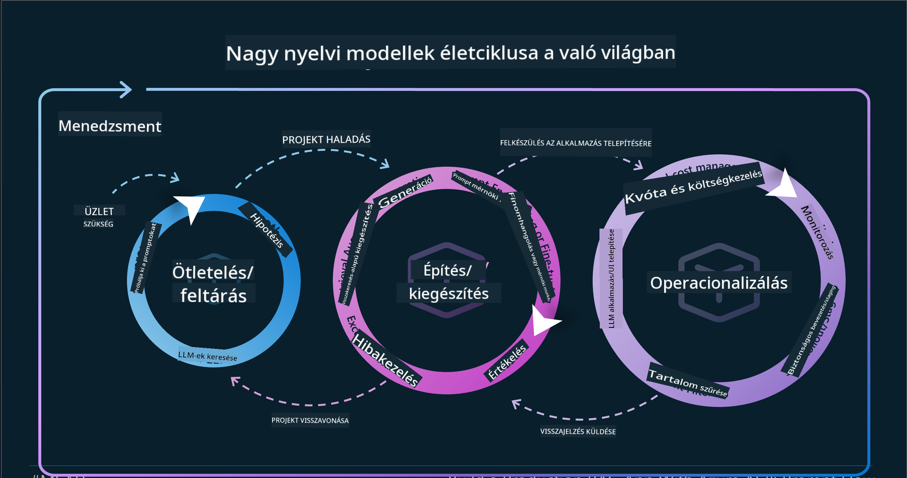
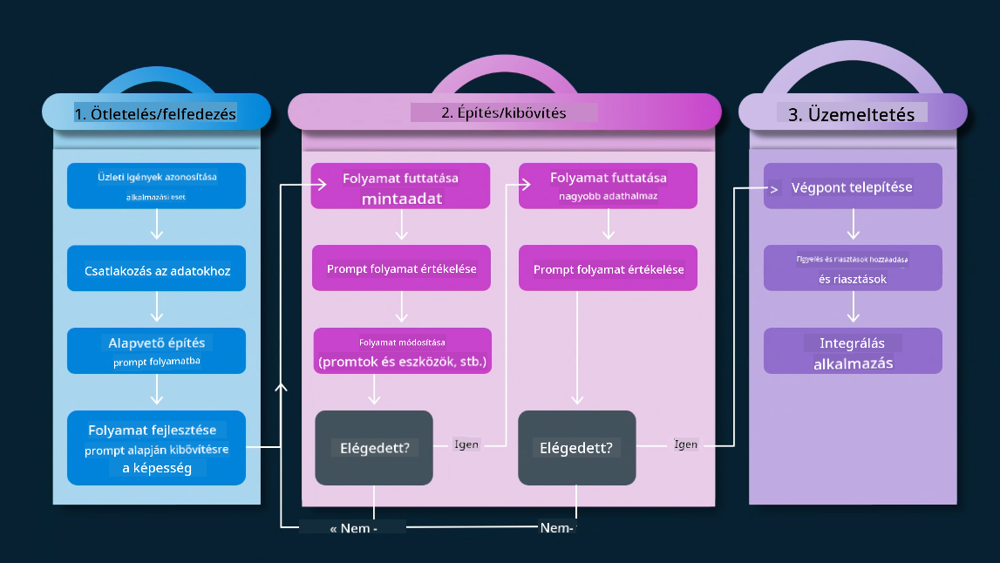
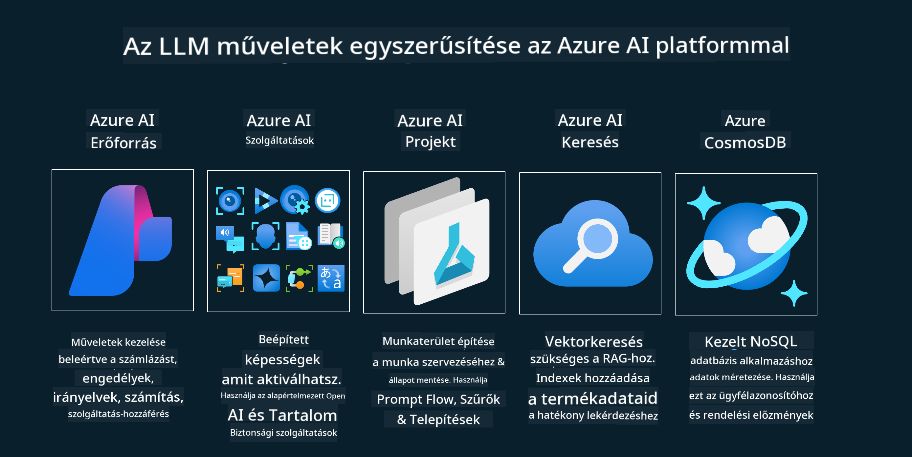
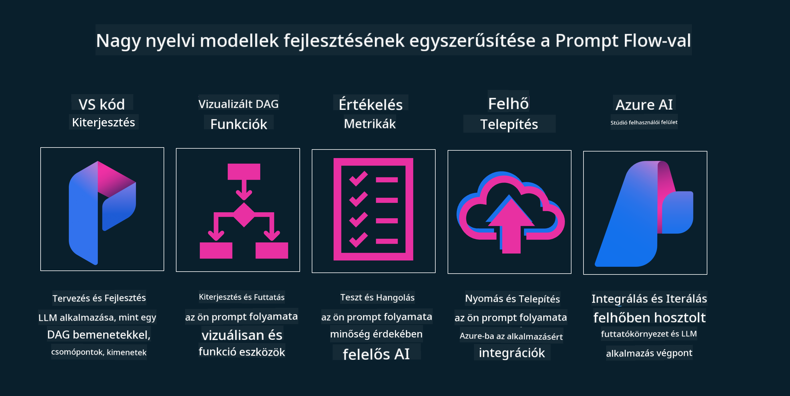

<!--
CO_OP_TRANSLATOR_METADATA:
{
  "original_hash": "27a5347a5022d5ef0a72ab029b03526a",
  "translation_date": "2025-05-20T00:54:45+00:00",
  "source_file": "14-the-generative-ai-application-lifecycle/README.md",
  "language_code": "hu"
}
-->

# A Generatív AI Alkalmazás Életciklusa

Minden AI alkalmazás esetében fontos kérdés az AI funkciók relevanciája, mivel az AI gyorsan fejlődő terület. Annak érdekében, hogy az alkalmazásod releváns, megbízható és robusztus maradjon, folyamatosan figyelemmel kell kísérned, értékelned és fejlesztened kell azt. Itt jön képbe a generatív AI életciklusa.

A generatív AI életciklusa egy keretrendszer, amely végigvezet a generatív AI alkalmazás fejlesztésének, telepítésének és karbantartásának szakaszain. Segít meghatározni a céljaidat, mérni a teljesítményedet, azonosítani a kihívásokat, és megvalósítani a megoldásaidat. Segít abban is, hogy alkalmazásodat összehangold a területed és az érintett felek etikai és jogi normáival. A generatív AI életciklus követésével biztosíthatod, hogy alkalmazásod mindig értéket nyújtson és kielégítse a felhasználóid igényeit.

## Bevezetés

Ebben a fejezetben:

- Megérted a Paradigmaváltást az MLOps-ról az LLMOps-ra
- Az LLM Életciklus
- Életciklus Eszközök
- Életciklus Metrikáció és Értékelés

## Megérteni a Paradigmaváltást az MLOps-ról az LLMOps-ra

Az LLM-ek az AI arzenál új eszközei, hihetetlenül erősek az alkalmazások elemzési és generálási feladataiban, de ez az erő némi következményekkel jár az AI és a Klasszikus Gépi Tanulás feladatok áramvonalasításában.

Ehhez új Paradigmára van szükség, hogy ezt az eszközt dinamikusan, a megfelelő ösztönzőkkel adaptáljuk. A régebbi AI alkalmazásokat "ML Alkalmazásokként", az újabb AI Alkalmazásokat "GenAI Alkalmazásokként" vagy egyszerűen "AI Alkalmazásokként" kategorizálhatjuk, tükrözve az adott időszakban használt mainstream technológiát és technikákat. Ez többféleképpen is megváltoztatja a narratívánkat, nézd meg az alábbi összehasonlítást.

Észre fogod venni, hogy az LLMOps-ban nagyobb hangsúlyt fektetünk az alkalmazásfejlesztőkre, az integrációk kulcspontként való használatára, a "Modellek mint Szolgáltatás" alkalmazására, és a következő pontok figyelembevételére a metrikák szempontjából.

- Minőség: Válasz minősége
- Kár: Felelős AI
- Őszinteség: Válasz megalapozottsága (Van értelme? Helyes?)
- Költség: Megoldás költségvetése
- Késleltetés: Átlagos idő a token válaszra

## Az LLM Életciklus

Először, hogy megértsük az életciklust és a módosításokat, vegyük szemügyre a következő infografikát.

Ahogy észreveheted, ez különbözik a szokásos MLOps életciklusoktól. Az LLM-eknek sok új követelményük van, mint a Prompting, különböző technikák a minőség javítására (Finomhangolás, RAG, Meta-Prompts), különböző értékelés és felelősség a felelős AI-val kapcsolatban, végül pedig új értékelési metrikák (Minőség, Kár, Őszinteség, Költség és Késleltetés).

Például, nézd meg, hogyan ötletelünk. Prompt engineering használatával kísérletezünk különböző LLM-ekkel, hogy feltérképezzük a lehetőségeket, és teszteljük, hogy a hipotézisük helyes lehet-e.

Jegyezd meg, hogy ez nem lineáris, hanem integrált hurkok, iteratív és egy átfogó ciklussal.

Hogyan tudnánk felfedezni ezeket a lépéseket? Nézzük meg részletesen, hogyan építhetnénk fel egy életciklust.

Ez kissé bonyolultnak tűnhet, koncentráljunk először a három nagy lépésre.

1. Ötletelés/Felfedezés: Felfedezés, itt az üzleti igényeink szerint fedezhetjük fel. Prototípus készítés, [PromptFlow](https://microsoft.github.io/promptflow/index.html?WT.mc_id=academic-105485-koreyst) létrehozása és tesztelése, hogy elég hatékony-e a hipotézisünk számára.
2. Építés/Bővítés: Megvalósítás, most kezdjük el értékelni nagyobb adathalmazokkal, alkalmazni technikákat, mint a finomhangolás és RAG, hogy ellenőrizzük megoldásunk robusztusságát. Ha nem, az újraimplementálás, új lépések hozzáadása a folyamatunkhoz vagy az adatok átszervezése segíthet. Miután teszteltük a folyamatunkat és méretünket, ha működik, és ellenőrizzük a metrikáinkat, készen áll a következő lépésre.
3. Üzemeltetés: Integráció, most hozzáadjuk a felügyeleti és riasztási rendszereket a rendszerünkhöz, telepítjük és integráljuk az alkalmazásunkba.

Ezután van az átfogó menedzsment ciklus, amely a biztonságra, a megfelelőségre és az irányításra összpontosít.

Gratulálok, most az AI alkalmazásod készen áll az indulásra és működésre. Gyakorlati tapasztalatért nézd meg a [Contoso Chat Demót.](https://nitya.github.io/contoso-chat/?WT.mc_id=academic-105485-koreys)

Most, milyen eszközöket használhatnánk?

## Életciklus Eszközök

Az eszközökhöz a Microsoft biztosítja az [Azure AI Platformot](https://azure.microsoft.com/solutions/ai/?WT.mc_id=academic-105485-koreys) és a [PromptFlow](https://microsoft.github.io/promptflow/index.html?WT.mc_id=academic-105485-koreyst) megkönnyíti és egyszerűvé teszi az életciklus megvalósítását és beindítását.

Az [Azure AI Platform](https://azure.microsoft.com/solutions/ai/?WT.mc_id=academic-105485-koreys) lehetővé teszi az [AI Studio](https://ai.azure.com/?WT.mc_id=academic-105485-koreys) használatát. Az AI Studio egy webes portál, amely lehetővé teszi a modellek, minták és eszközök felfedezését. Erőforrásaid kezelését, a UI fejlesztési folyamatokat és SDK/CLI opciókat a Kód-első fejlesztéshez.

Az Azure AI lehetővé teszi, hogy több erőforrást használj, hogy kezelhesd műveleteidet, szolgáltatásaidat, projektjeidet, vektorkeresést és adatbázis igényeidet.

Építs, a Proof-of-Concept-től (POC) a nagyméretű alkalmazásokig a PromptFlow-val:

- Tervezd és építsd meg az alkalmazásokat a VS Code-ból, vizuális és funkcionális eszközökkel
- Teszteld és finomhangold az alkalmazásaidat a minőségi AI-ért, könnyedén.
- Használd az Azure AI Studiot az integrációhoz és iterációhoz a felhővel, Push és Deploy gyors integrációhoz.

## Remek! Folytasd a tanulást!

Csodálatos, most tanulj többet arról, hogyan struktúrálunk egy alkalmazást a fogalmak használatára a [Contoso Chat Alkalmazással](https://nitya.github.io/contoso-chat/?WT.mc_id=academic-105485-koreys), hogy megnézd, hogyan alkalmazza a Cloud Advocacy ezeket a fogalmakat bemutatókban. További tartalomért nézd meg az [Ignite breakout session!
](https://www.youtube.com/watch?v=DdOylyrTOWg)

Most nézd meg a 15. leckét, hogy megértsd, hogyan hat a [Retrieval Augmented Generation és a Vektor Adatbázisok](../15-rag-and-vector-databases/README.md?WT.mc_id=academic-105485-koreyst) a Generatív AI-re, és hogyan tehetik az alkalmazásokat még vonzóbbá!

**Felelősség kizárása**:  
Ez a dokumentum az AI fordítási szolgáltatás [Co-op Translator](https://github.com/Azure/co-op-translator) segítségével került lefordításra. Bár igyekszünk pontosságra törekedni, kérjük, vegye figyelembe, hogy az automatikus fordítások hibákat vagy pontatlanságokat tartalmazhatnak. Az eredeti dokumentum az eredeti nyelvén tekintendő hiteles forrásnak. Fontos információk esetén javasolt a professzionális emberi fordítás. Nem vállalunk felelősséget semmilyen félreértésért vagy félreértelmezésért, amely a fordítás használatából ered.