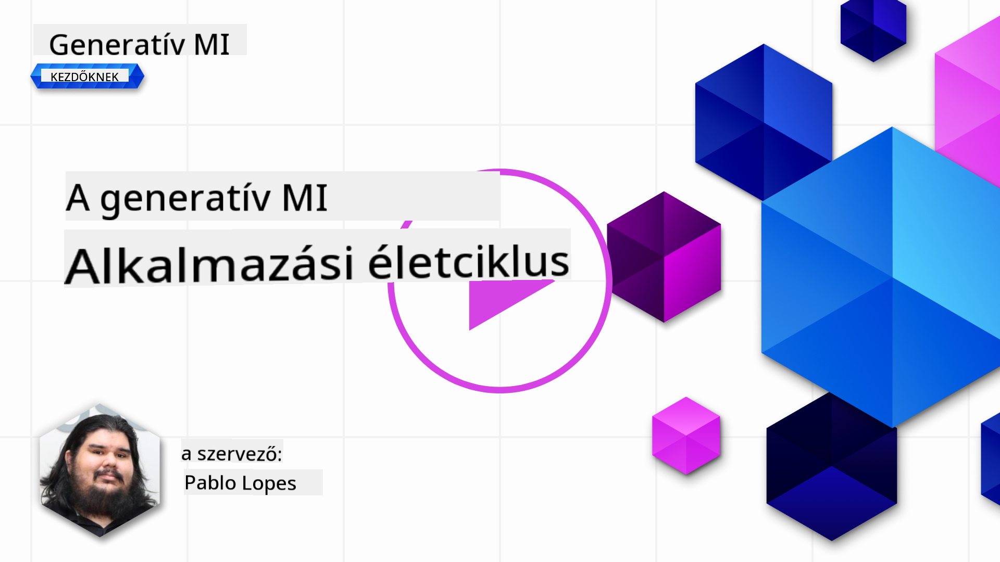
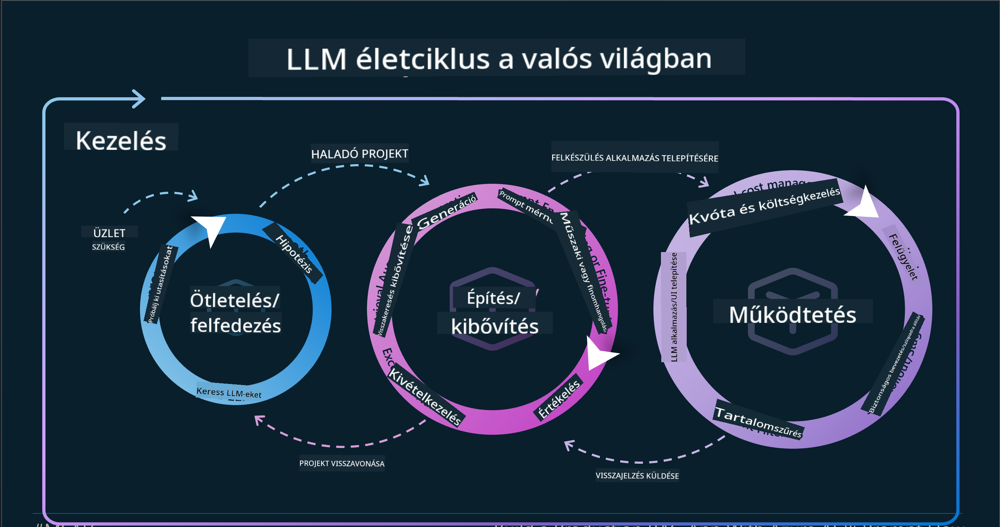
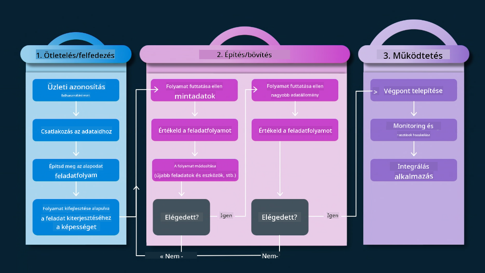
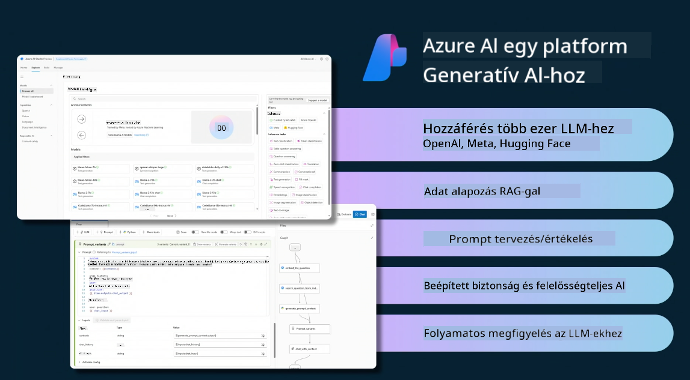
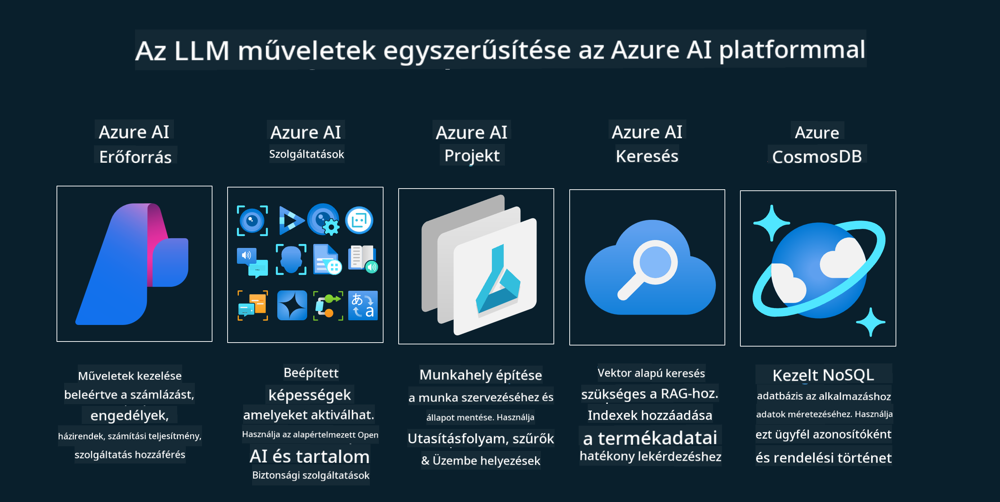
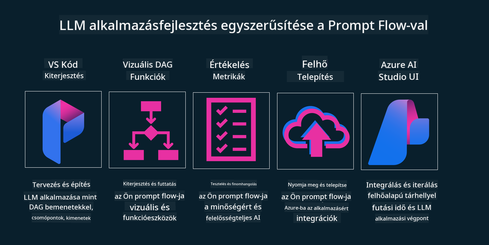

<!--
CO_OP_TRANSLATOR_METADATA:
{
  "original_hash": "27a5347a5022d5ef0a72ab029b03526a",
  "translation_date": "2025-06-25T22:08:57+00:00",
  "source_file": "14-the-generative-ai-application-lifecycle/README.md",
  "language_code": "hu"
}
-->

# A Generatív AI Alkalmazás Életciklusa

Minden AI alkalmazás számára fontos kérdés az AI funkciók relevanciája, mivel az AI gyorsan fejlődő terület. Annak érdekében, hogy az alkalmazásod releváns, megbízható és robusztus maradjon, folyamatosan figyelemmel kell kísérned, értékelned és fejlesztened kell azt. Itt jön képbe a generatív AI életciklusa.

A generatív AI életciklusa egy keretrendszer, amely végigvezet a generatív AI alkalmazás fejlesztésének, telepítésének és karbantartásának szakaszain. Segít meghatározni a céljaidat, mérni a teljesítményedet, azonosítani a kihívásaidat és megvalósítani a megoldásaidat. Segít abban is, hogy az alkalmazásod összhangban legyen a területed és az érintett felek etikai és jogi normáival. A generatív AI életciklus követésével biztosíthatod, hogy az alkalmazásod mindig értéket nyújtson és kielégítse a felhasználóid igényeit.

## Bevezetés

Ebben a fejezetben:

- Megérted az MLOps-ról az LLMOps-ra való Paradigmaváltást
- Az LLM Életciklusát
- Életciklus Eszközök
- Életciklus Metrifikáció és Értékelés

## Megérteni az MLOps-ról az LLMOps-ra való Paradigmaváltást

Az LLM-ek az AI eszköztárának új eszközei, rendkívül erősek elemzési és generálási feladatokban az alkalmazások számára, azonban ez az erő bizonyos következményekkel jár az AI és a klasszikus gépi tanulási feladatok áramvonalasításában.

Ehhez új Paradigmára van szükség, hogy ezt az eszközt dinamikusan alkalmazzuk a megfelelő ösztönzőkkel. Az idősebb AI alkalmazásokat "ML Alkalmazásokként", az újabb AI Alkalmazásokat pedig "GenAI Alkalmazásokként" vagy egyszerűen "AI Alkalmazásokként" kategorizálhatjuk, tükrözve az akkoriban használt mainstream technológiákat és technikákat. Ez többféleképpen is megváltoztatja a narratívánkat, nézd meg a következő összehasonlítást.

Figyeld meg, hogy az LLMOps-ban inkább az Alkalmazásfejlesztőkre koncentrálunk, az integrációkat kulcspontként használjuk, a "Modellek mint Szolgáltatás" használatával és az alábbi pontokra gondolva a metrikákhoz.

- Minőség: Válasz minősége
- Kár: Felelős AI
- Őszinteség: Válasz megalapozottsága (Van értelme? Helyes?)
- Költség: Megoldás költségvetése
- Késleltetés: Átlagos idő a token válaszhoz

## Az LLM Életciklusa

Először, hogy megértsük az életciklust és a módosításokat, nézzük meg a következő infografikát.

Ahogy észreveheted, ez eltér a szokásos MLOps életciklusoktól. Az LLM-eknek sok új követelménye van, mint a Prompting, különböző technikák a minőség javítására (Fine-Tuning, RAG, Meta-Prompts), különböző értékelés és felelősség a felelős AI-val, végül új értékelési metrikák (Minőség, Kár, Őszinteség, Költség és Késleltetés).

Például, nézd meg, hogyan ötletelünk. Prompt engineering használatával különböző LLM-ekkel kísérletezünk, hogy felfedezzük a lehetőségeket, és teszteljük, hogy a hipotézisük helyes lehet-e.

Figyeld meg, hogy ez nem lineáris, hanem integrált hurkok, iteratív és egy átfogó ciklussal.

Hogyan tudnánk felfedezni ezeket a lépéseket? Lépjünk részletekbe, hogyan építhetünk fel egy életciklust.

Ez kissé bonyolultnak tűnhet, koncentráljunk először a három nagy lépésre.

1. Ötletelés/Felfedezés: Felfedezés, itt a vállalati igényeink szerint fedezhetünk fel. Prototípus készítés, egy [PromptFlow](https://microsoft.github.io/promptflow/index.html?WT.mc_id=academic-105485-koreyst) létrehozása és tesztelése, hogy elég hatékony-e a hipotézisünk számára.
2. Építés/Bővítés: Megvalósítás, most nagyobb adathalmazok értékelését kezdjük megvalósítani, mint például a Fine-tuning és RAG technikák, hogy ellenőrizzük a megoldásunk robusztusságát. Ha nem, az újraimplementálás, új lépések hozzáadása a folyamatunkba vagy az adatok átszervezése segíthet. A folyamatunk és a méretünk tesztelése után, ha működik és ellenőrzi a metrikáinkat, készen áll a következő lépésre.
3. Operacionalizálás: Integráció, most hozzáadjuk a monitorozási és figyelmeztetési rendszereket a rendszerünkhöz, telepítjük és integráljuk az alkalmazásunkhoz.

Ezután van az átfogó menedzsment ciklus, amely a biztonságra, a megfelelésre és a kormányzásra összpontosít.

Gratulálok, most az AI alkalmazásod készen áll az indulásra és üzemképes. Gyakorlati tapasztalatért nézd meg a [Contoso Chat Demót.](https://nitya.github.io/contoso-chat/?WT.mc_id=academic-105485-koreys)

Most, milyen eszközöket használhatnánk?

## Életciklus Eszközök

Az eszközökhöz a Microsoft biztosítja az [Azure AI Platformot](https://azure.microsoft.com/solutions/ai/?WT.mc_id=academic-105485-koreys) és a [PromptFlow](https://microsoft.github.io/promptflow/index.html?WT.mc_id=academic-105485-koreyst) eszközt, amelyek megkönnyítik és készen állnak az életciklus egyszerű megvalósítására.

Az [Azure AI Platform](https://azure.microsoft.com/solutions/ai/?WT.mc_id=academic-105485-koreys) lehetővé teszi az [AI Studio](https://ai.azure.com/?WT.mc_id=academic-105485-koreys) használatát. Az AI Studio egy webes portál, amely lehetővé teszi a modellek, minták és eszközök felfedezését. Az erőforrásaid, a felhasználói felület fejlesztési folyamatainak és az SDK/CLI lehetőségek kezelését a kódalapú fejlesztéshez.

Az Azure AI lehetővé teszi, hogy több erőforrást használj, hogy kezelhesd a műveleteidet, szolgáltatásaidat, projektjeidet, vektor kereséseidet és adatbázis szükségleteidet.

Építsd meg, a Proof-of-Concept (POC) tól a nagy léptékű alkalmazásokig a PromptFlow-val:

- Tervezd meg és építsd meg az alkalmazásokat a VS Code-ból, vizuális és funkcionális eszközökkel
- Teszteld és finomhangold az alkalmazásaidat a minőségi AI érdekében, könnyedén.
- Használd az Azure AI Studiot a felhővel való integrációhoz és iterációhoz, telepítsd és hajtsd végre a gyors integráció érdekében.

## Nagyszerű! Folytasd a tanulást!

Csodálatos, most tanulj többet arról, hogyan struktúrálunk egy alkalmazást, hogy használjuk a fogalmakat a [Contoso Chat App](https://nitya.github.io/contoso-chat/?WT.mc_id=academic-105485-koreyst) segítségével, hogy megnézd, hogyan adja hozzá a Cloud Advocacy ezeket a fogalmakat a bemutatókban. További tartalmakért nézd meg az [Ignite kitörési szekciót!
](https://www.youtube.com/watch?v=DdOylyrTOWg)

Most nézd meg a 15. leckét, hogy megértsd, hogyan hatnak a [Visszakeresés Alapú Generálás és a Vektor Adatbázisok](../15-rag-and-vector-databases/README.md?WT.mc_id=academic-105485-koreyst) a Generatív AI-re és hogyan készíthetőek vonzóbb alkalmazások!

**Felelősségkizárás**:  
Ez a dokumentum a [Co-op Translator](https://github.com/Azure/co-op-translator) mesterséges intelligencia fordítószolgáltatással készült fordítás. Bár törekszünk a pontosságra, kérjük, vegye figyelembe, hogy az automatikus fordítások hibákat vagy pontatlanságokat tartalmazhatnak. Az eredeti dokumentum anyanyelvén tekintendő hiteles forrásnak. Kritikus információk esetén professzionális emberi fordítás ajánlott. Nem vállalunk felelősséget a fordítás használatából eredő félreértésekért vagy téves értelmezésekért.