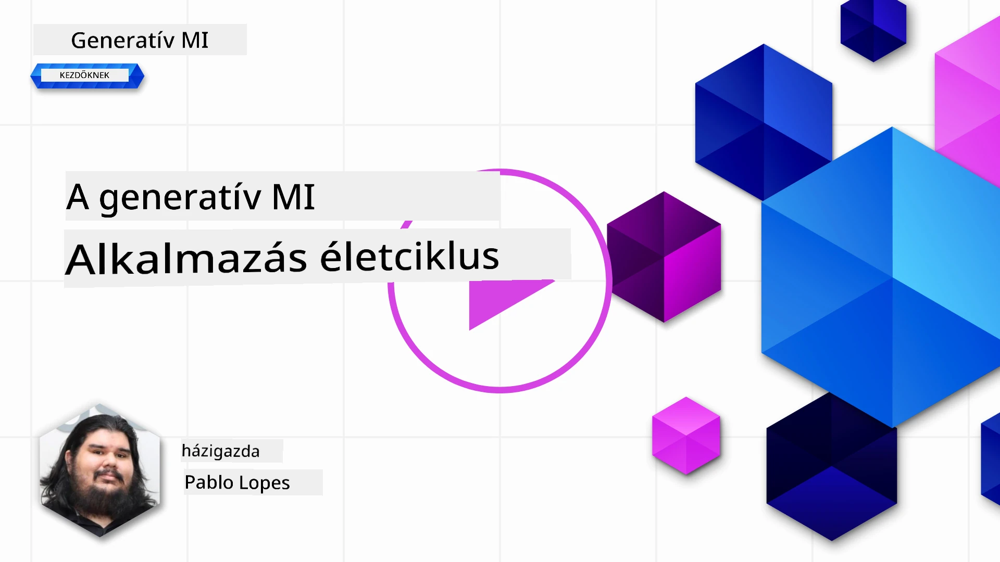
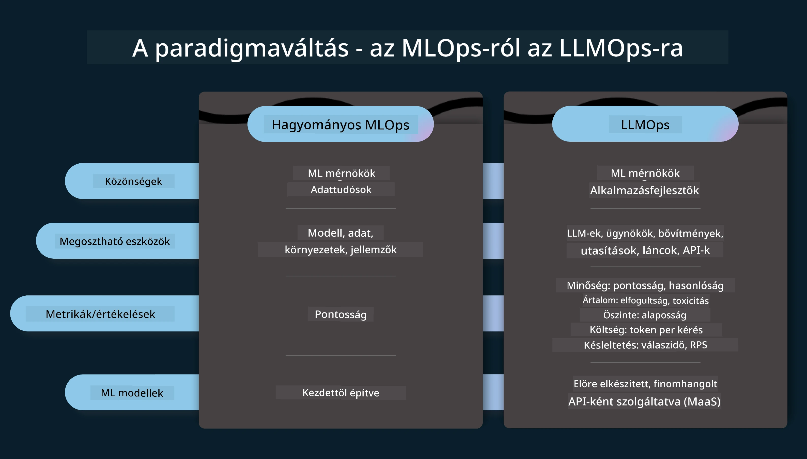
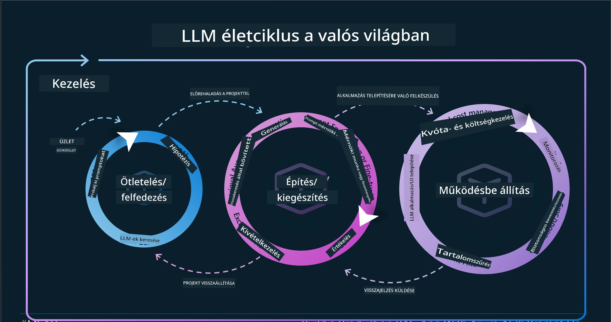
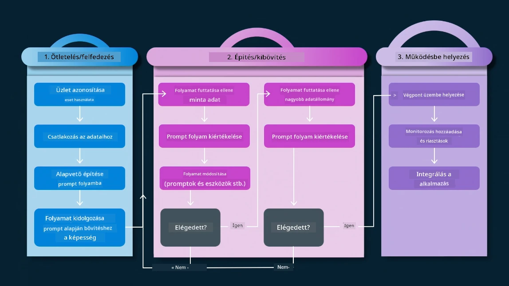
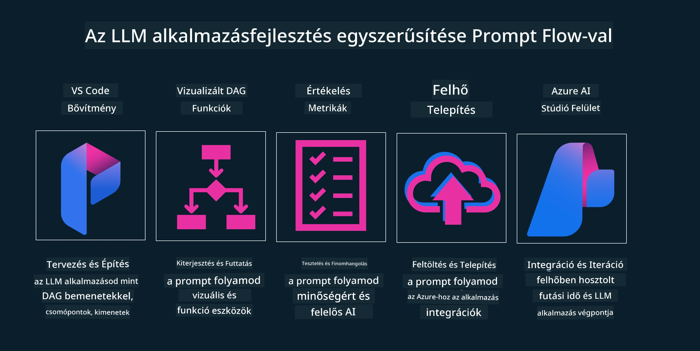

# A generatív mesterséges intelligencia alkalmazásának életciklusa

Minden MI-alkalmazás számára fontos kérdés az MI-funkciók relevanciája, mivel az MI egy gyorsan fejlődő terület. Ahhoz, hogy alkalmazásod releváns, megbízható és robusztus maradjon, folyamatosan nyomon kell követned, értékelned és fejlesztened kell azt. Ebben segít a generatív MI életciklus.

A generatív MI életciklus egy olyan keretrendszer, amely végigvezeti az alkalmazás fejlesztésének, bevezetésének és karbantartásának szakaszain. Segít meghatározni a céljaidat, mérni a teljesítményedet, azonosítani a kihívásokat és megvalósítani a megoldásokat. Emellett támogatja az alkalmazás összehangolását az adott terület etikai és jogi szabványaival, valamint az érintett felekkel. A generatív MI életciklus követésével biztosíthatod, hogy alkalmazásod mindig értéket nyújtson és elégedetté tegye a felhasználókat.

## Bevezetés

Ebben a fejezetben megtanulod:

- Megérteni az MLOps-ról LLMOps-ra történő paradigma váltást
- Az LLM életciklust
- Életciklus eszközöket
- Életciklus metrikázást és értékelést

## Megérteni az MLOps-ról LLMOps-ra történő paradigma váltást

Az LLM-ek az Mesterséges Intelligencia új eszközei, hihetetlenül erősek az elemző és generáló feladatokban, azonban ez az erő befolyásolja, hogyan optimalizáljuk az MI és a klasszikus gépi tanulás feladatokat.

Ehhez új paradigma szükséges, amely dinamikusan alkalmazkodik ehhez az eszközhöz, a megfelelő ösztönzőkkel. Régebbi MI-alkalmazásokat "ML Apps"-ként, míg újabbakat "GenAI Apps"-ként vagy egyszerűen "AI Apps"-ként kategorizálhatunk, tükrözve az adott időszak népszerű technológiáit és módszereit. Ez többféleképpen módosítja a narratívánkat, tekintsük meg az alábbi összehasonlítást.

Figyeld meg, hogy az LLMOps során inkább az alkalmazásfejlesztőkre fókuszálunk, az integrációkat kulcspontként kezelve, "Models-as-a-Service" használatával és a következő szempontok alapján gondolkodva a metrikákról.

- Minőség: válasz minősége
- Káros hatás: felelős MI
- Őszinteség: válasz megalapozottsága (Értelmes? Helyes?)
- Költség: megoldás költségvetése
- Késleltetés: átlagos válaszidő tokenenként

## Az LLM életciklusa

Először is, hogy megértsük az életciklust és a módosításokat, vegyük figyelembe a következő ábrát.

Mint látható, ez eltér az MLOps megszokott életciklusaitól. Az LLM-ek számos új követelménynek felelnek meg, mint a Prompting, különféle minőségjavító technikák (Finomhangolás, RAG, Meta-Promptok), más értékelési és felelősségi vonatkozások a felelős MI miatt, valamint új értékelési metrikák (Minőség, Káros hatás, Őszinteség, Költség és Késleltetés).

Például nézd meg, hogyan ötletelünk. Prompt engineering segítségével különböző LLM-ekkel kísérletezünk, hogy feltérképezzük a lehetőségeket és teszteljük, vajon a hipotézisünk helyes lehet-e.

Fontos, hogy ez nem lineáris, hanem integrált ciklusokból, ismétlődő folyamatokból áll, egy átfogó ciklussal körülvéve.

Hogyan vizsgálhatnánk meg ezeket a lépéseket? Részletezzük, hogyan lehet életciklust építeni.

Ez kicsit bonyolultnak tűnhet, fókuszáljunk először a három fő lépésre.

1. Ötletelés/Felfedezés: Felfedezés, ahol üzleti igényeink szerint kísérletezhetünk. Prototípuskészítés, egy [PromptFlow](https://microsoft.github.io/promptflow/index.html?WT.mc_id=academic-105485-koreyst) létrehozása és tesztelése, hogy eléggé hatékony-e a hipotézisünkhöz.
1. Építés/Kibővítés: Megvalósítás, most nagyobb adatkészleteken értékeljük és implementálunk technikákat, mint a Finomhangolás és RAG, hogy ellenőrizzük megoldásunk robusztusságát. Ha nem működik, újra implementáljuk, új lépéseket adunk a folyamatunkhoz vagy átszervezzük az adatokat. Ha sikerül, és megfelelünk a metrikáknak, készen áll a következő lépésre.
1. Üzemeltetés: Integráció, most figyelőrendszereket és riasztásokat adunk a rendszerünkhöz, telepítés és az alkalmazás integrálása.

Aztán van egy átfogó menedzsment ciklus, amely a biztonságra, megfelelőségre és kormányzásra összpontosít.

Gratulálunk, most már az AI-alkalmazásod készen áll az üzemeltetésre. Gyakorlati tapasztalatért nézd meg a [Contoso Chat Demo.](https://nitya.github.io/contoso-chat/?WT.mc_id=academic-105485-koreyst)

Most, milyen eszközöket használhatunk?

## Életciklus eszközök

Az eszközökhöz a Microsoft biztosítja az [Azure AI Platformot](https://azure.microsoft.com/solutions/ai/?WT.mc_id=academic-105485-koreyst) és a [PromptFlow-t](https://microsoft.github.io/promptflow/index.html?WT.mc_id=academic-105485-koreyst), amelyek megkönnyítik és egyszerűvé teszik az életciklus bevezetését.

Az [Azure AI Platform](https://azure.microsoft.com/solutions/ai/?WT.mc_id=academic-105485-koreyst) lehetőséget ad az [AI Studio](https://ai.azure.com/?WT.mc_id=academic-105485-koreyst) használatára. Az AI Studio egy webes portál, ahol modelleket, példákat és eszközöket fedezhetsz fel. Erőforrásaidat kezelheted, vizuális fejlesztési folyamatokat végezhetsz és SDK/CLI opciókat használhatsz kódorientált fejlesztéshez.

Az Azure AI segítségével több erőforrást használhatsz műveleteid, szolgáltatásaid, projektjeid, vektoros keresési és adatbázis igényeid kezelésére.

Építs a Proof-of-Concept-től (POC) a nagyszabású alkalmazásokig a PromptFlow-val:

- Tervezz és építs alkalmazásokat VS Code-ban, vizuális és funkcionális eszközökkel
- Teszteld és finomhangold alkalmazásod a minőségi MI érdekében, könnyedén.
- Használd az Azure AI Studiot az integrációhoz és iterációhoz a felhővel, gördülékeny integráció és gyors telepítés céljából.

## Nagyszerű! Folytasd a tanulást!

Csodálatos, most tanuld meg, hogyan strukturálunk egy alkalmazást a fogalmak használatához a [Contoso Chat App](https://nitya.github.io/contoso-chat/?WT.mc_id=academic-105485-koreyst) segítségével, hogy megtekinthesd, hogyan alkalmazza a Cloud Advocacy ezeket a fogalmakat bemutatókban. További tartalmakért nézd meg az [Ignite breakout szekciónkat!](https://www.youtube.com/watch?v=DdOylyrTOWg)

Most pedig nézd meg a 15. leckét, hogy megértsd, hogyan hat az [Retrieval Augmented Generation és a Vektor adatbázisok](../15-rag-and-vector-databases/README.md?WT.mc_id=academic-105485-koreyst) a generatív MI-re és hogyan teheted még vonzóbbá az alkalmazásokat!

---

<!-- CO-OP TRANSLATOR DISCLAIMER START -->
**Felelősség kizárása**:
Ez a dokumentum az AI fordító szolgáltatás, a [Co-op Translator](https://github.com/Azure/co-op-translator) segítségével készült. Bár igyekszünk pontosságra törekedni, kérjük, vegye figyelembe, hogy az automatikus fordítások tartalmazhatnak hibákat vagy pontatlanságokat. Az eredeti dokumentum az anyanyelvén tekinthető hivatalos forrásnak. Fontos információk esetén profi, emberi fordítást javaslunk. Nem vállalunk felelősséget a fordítás használatából eredő félreértésekért vagy értelmezési problémákért.
<!-- CO-OP TRANSLATOR DISCLAIMER END -->