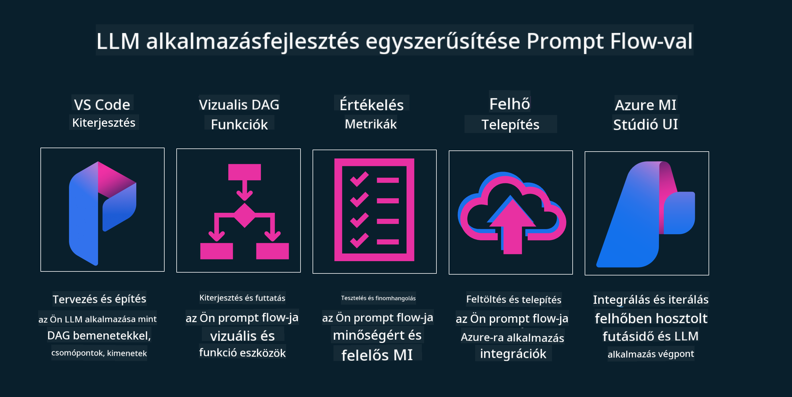

<!--
CO_OP_TRANSLATOR_METADATA:
{
  "original_hash": "27a5347a5022d5ef0a72ab029b03526a",
  "translation_date": "2025-07-09T15:57:35+00:00",
  "source_file": "14-the-generative-ai-application-lifecycle/README.md",
  "language_code": "hu"
}
-->

# A generatív MI alkalmazás életciklusa

Minden MI alkalmazás számára fontos kérdés az MI funkciók relevanciája, hiszen az MI gyorsan fejlődő terület. Ahhoz, hogy az alkalmazásod releváns, megbízható és stabil maradjon, folyamatosan figyelni, értékelni és fejleszteni kell. Ebben segít a generatív MI életciklus.

A generatív MI életciklus egy keretrendszer, amely végigvezet a generatív MI alkalmazás fejlesztésének, bevezetésének és karbantartásának szakaszain. Segít meghatározni a céljaidat, mérni a teljesítményt, azonosítani a kihívásokat és megvalósítani a megoldásokat. Emellett támogat abban is, hogy az alkalmazásod összhangban legyen az adott terület etikai és jogi normáival, valamint az érintettek elvárásaival. Ha követed a generatív MI életciklust, biztosíthatod, hogy az alkalmazásod mindig értéket nyújtson és elégedetté tegye a felhasználókat.

## Bevezetés

Ebben a fejezetben:

- Megérted az MLOps-ról LLMOps-ra való paradigmaváltást
- Megismered az LLM életciklust
- Megtudod, milyen eszközök segítik az életciklust
- Megtanulod az életciklus mérését és értékelését

## Megérteni az MLOps-ról LLMOps-ra való paradigmaváltást

Az LLM-ek új eszközök a mesterséges intelligencia arzenáljában, rendkívül erősek elemzési és generálási feladatokban az alkalmazások számára, azonban ez az erő bizonyos következményekkel jár az MI és a klasszikus gépi tanulási feladatok egyszerűsítésében.

Ezért szükség van egy új paradigmára, hogy dinamikusan, a megfelelő ösztönzőkkel alkalmazzuk ezt az eszközt. A régebbi MI alkalmazásokat "ML alkalmazásoknak", az újabbakat pedig "GenAI alkalmazásoknak" vagy egyszerűen "MI alkalmazásoknak" nevezzük, tükrözve az adott időszak fő technológiáit és módszereit. Ez több szempontból is megváltoztatja a narratívánkat, nézd meg az alábbi összehasonlítást.

Figyeld meg, hogy az LLMOps esetén inkább az alkalmazásfejlesztőkre fókuszálunk, az integrációkat kulcspontként kezeljük, "Modellek mint szolgáltatás" megközelítést alkalmazunk, és a következő szempontokat vesszük figyelembe a mérőszámoknál:

- Minőség: Válasz minősége
- Káros hatás: Felelős MI
- Őszinteség: Válasz megalapozottsága (Értelmes? Helyes?)
- Költség: Megoldás költségvetése
- Késleltetés: Átlagos válaszidő tokenenként

## Az LLM életciklus

Először is, hogy megértsük az életciklust és a módosításokat, nézzük meg a következő infografikát.

Ahogy láthatod, ez eltér a megszokott MLOps életciklusoktól. Az LLM-eknek sok új követelménye van, mint például a promptolás, különböző minőségjavító technikák (finomhangolás, RAG, meta-promptok), más értékelési és felelősségi szempontok a felelős MI kapcsán, végül pedig új értékelési mutatók (minőség, káros hatás, őszinteség, költség és késleltetés).

Például nézd meg, hogyan ötletelünk. Prompt engineering segítségével különböző LLM-ekkel kísérletezünk, hogy felfedezzük a lehetőségeket és teszteljük, vajon a hipotézisünk helyes lehet-e.

Fontos megjegyezni, hogy ez nem lineáris folyamat, hanem integrált, iteratív hurkokból áll, egy átfogó ciklussal.

Hogyan vizsgálhatjuk meg ezeket a lépéseket? Nézzük meg részletesen, hogyan építhetünk fel egy életciklust.

Ez talán bonyolultnak tűnhet, először koncentráljunk a három fő lépésre.

1. Ötletelés/Felfedezés: Itt a vállalkozás igényei szerint fedezhetünk fel lehetőségeket. Prototípus készítése, egy [PromptFlow](https://microsoft.github.io/promptflow/index.html?WT.mc_id=academic-105485-koreyst) létrehozása és tesztelése, hogy elég hatékony-e a hipotézisünkhez.
1. Építés/Bővítés: Megvalósítás, ekkor nagyobb adathalmazokon kezdjük el értékelni, alkalmazunk technikákat, mint a finomhangolás és a RAG, hogy ellenőrizzük a megoldásunk robosztusságát. Ha nem működik, újra kell implementálni, új lépéseket hozzáadni a folyamatba vagy átszervezni az adatokat. Ha a folyamat és a skálázás működik, és a mérőszámok is rendben vannak, készen áll a következő lépésre.
1. Üzemeltetés: Integráció, ekkor hozzáadjuk a monitorozó és riasztó rendszereket, bevezetjük és integráljuk az alkalmazásba.

Ezután következik az átfogó menedzsment ciklus, amely a biztonságra, megfelelőségre és irányításra fókuszál.

Gratulálunk, most már készen áll az MI alkalmazásod az éles használatra. Ha gyakorlati tapasztalatot szeretnél, nézd meg a [Contoso Chat Demo-t](https://nitya.github.io/contoso-chat/?WT.mc_id=academic-105485-koreys).

Most pedig, milyen eszközöket használhatunk?

## Életciklus eszközök

Az eszközök terén a Microsoft az [Azure AI Platformot](https://azure.microsoft.com/solutions/ai/?WT.mc_id=academic-105485-koreys) és a [PromptFlow-t](https://microsoft.github.io/promptflow/index.html?WT.mc_id=academic-105485-koreyst) kínálja, amelyek megkönnyítik és egyszerűvé teszik az életciklus megvalósítását.

Az [Azure AI Platform](https://azure.microsoft.com/solutions/ai/?WT.mc_id=academic-105485-koreys) lehetővé teszi az [AI Studio](https://ai.azure.com/?WT.mc_id=academic-105485-koreys) használatát. Az AI Studio egy webes portál, ahol modelleket, példákat és eszközöket fedezhetsz fel, kezelheted az erőforrásaidat, fejlesztheted a felhasználói felületeket, valamint SDK/CLI lehetőségeket kínál kód-alapú fejlesztéshez.

Az Azure AI segítségével többféle erőforrást használhatsz az üzemeltetés, szolgáltatások, projektek, vektoros keresés és adatbázisok kezelésére.

A Proof-of-Concepttől (POC) a nagyszabású alkalmazásokig építhetsz a PromptFlow segítségével:

- Tervezd és építsd az alkalmazásokat VS Code-ból, vizuális és funkcionális eszközökkel
- Teszteld és finomhangold az alkalmazásokat a minőségi MI érdekében, könnyedén
- Használd az Azure AI Studiot az integrációhoz és iterációhoz a felhővel, gyors integráció érdekében push és deploy funkciókkal

## Remek! Folytasd a tanulást!

Szuper, most tanulj meg többet arról, hogyan építünk fel egy alkalmazást, hogy alkalmazd a fogalmakat a [Contoso Chat App](https://nitya.github.io/contoso-chat/?WT.mc_id=academic-105485-koreyst) segítségével, és nézd meg, hogyan használja a Cloud Advocacy ezeket a koncepciókat a bemutatókban. További tartalmakért nézd meg az [Ignite breakout sessiont!](https://www.youtube.com/watch?v=DdOylyrTOWg)

Most pedig nézd meg a 15. leckét, hogy megértsd, hogyan hat a [Retrieval Augmented Generation és a vektoros adatbázisok](../15-rag-and-vector-databases/README.md?WT.mc_id=academic-105485-koreyst) a generatív MI-re, és hogyan teheted az alkalmazásokat még vonzóbbá!

**Jogi nyilatkozat**:  
Ez a dokumentum az AI fordító szolgáltatás, a [Co-op Translator](https://github.com/Azure/co-op-translator) segítségével készült. Bár a pontosságra törekszünk, kérjük, vegye figyelembe, hogy az automatikus fordítások hibákat vagy pontatlanságokat tartalmazhatnak. Az eredeti dokumentum az anyanyelvén tekintendő hiteles forrásnak. Fontos információk esetén szakmai, emberi fordítást javaslunk. Nem vállalunk felelősséget a fordítás használatából eredő félreértésekért vagy téves értelmezésekért.