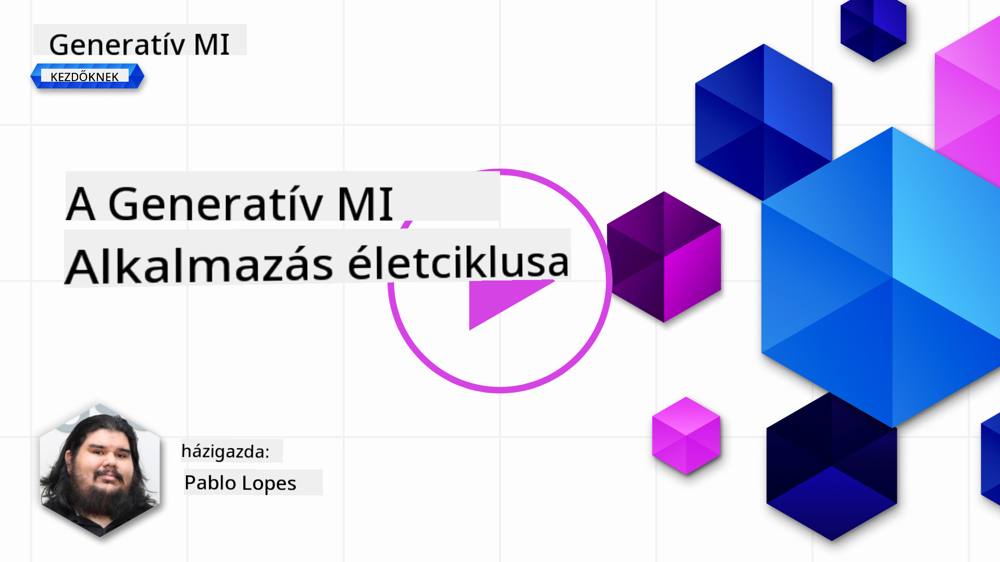

<!--
CO_OP_TRANSLATOR_METADATA:
{
  "original_hash": "b9d32511b27373a1b21b5789d4fda057",
  "translation_date": "2025-10-17T21:29:59+00:00",
  "source_file": "14-the-generative-ai-application-lifecycle/README.md",
  "language_code": "hu"
}
-->

# A Generatív AI Alkalmazás Életciklusa

Minden AI alkalmazás esetében fontos kérdés az AI funkciók relevanciája, mivel az AI gyorsan fejlődő terület. Annak érdekében, hogy az alkalmazásod releváns, megbízható és robusztus maradjon, folyamatosan monitorozni, értékelni és fejleszteni kell. Ebben segít a generatív AI életciklusa.

A generatív AI életciklusa egy keretrendszer, amely végigvezet a generatív AI alkalmazás fejlesztésének, bevezetésének és fenntartásának szakaszain. Segít meghatározni a céljaidat, mérni a teljesítményedet, azonosítani a kihívásokat, és megvalósítani a megoldásokat. Emellett segít az alkalmazásodat összehangolni a szakterületed és az érintettek etikai és jogi normáival. A generatív AI életciklus követésével biztosíthatod, hogy az alkalmazásod mindig értéket nyújtson és kielégítse a felhasználóid igényeit.

## Bevezetés

Ebben a fejezetben:

- Megérted az MLOps és LLMOps közötti paradigmaváltást
- Az LLM életciklusát
- Életciklus eszközöket
- Életciklus metrikákat és értékelést

## Az MLOps és LLMOps közötti paradigmaváltás megértése

Az LLM-ek az AI eszköztárának új elemei, amelyek rendkívül hatékonyak az elemzési és generálási feladatokban. Ez az erő azonban következményekkel jár az AI és a klasszikus gépi tanulási feladatok optimalizálásában.

Ezért új paradigmára van szükségünk, hogy ezt az eszközt dinamikusan, megfelelő ösztönzőkkel alkalmazzuk. A régebbi AI alkalmazásokat "ML alkalmazásoknak", míg az újabbakat "GenAI alkalmazásoknak" vagy egyszerűen "AI alkalmazásoknak" nevezhetjük, tükrözve az adott időszakban használt mainstream technológiát és technikákat. Ez több szempontból is megváltoztatja a narratívánkat, nézd meg az alábbi összehasonlítást.

Figyeld meg, hogy az LLMOps esetében nagyobb hangsúlyt fektetünk az alkalmazásfejlesztőkre, az integrációkat kulcspontként használva, a "Modellek mint szolgáltatás" koncepcióval, és az alábbi metrikákra gondolva:

- Minőség: Válasz minősége
- Kár: Felelős AI
- Őszinteség: Válasz megalapozottsága (Van értelme? Helyes?)
- Költség: Megoldás költségvetése
- Késleltetés: Átlagos válaszidő tokenekre

## Az LLM életciklusa

Először, hogy megértsük az életciklust és a módosításokat, nézzük meg a következő infografikát.

Ahogy láthatod, ez eltér a szokásos MLOps életciklusoktól. Az LLM-eknek számos új követelménye van, mint például a Prompting, különböző technikák a minőség javítására (Fine-Tuning, RAG, Meta-Prompts), különböző értékelési és felelősségi szempontok a felelős AI-val kapcsolatban, végül pedig új értékelési metrikák (Minőség, Kár, Őszinteség, Költség és Késleltetés).

Például nézd meg, hogyan ötletelünk. Prompt engineering használatával különböző LLM-ekkel kísérletezünk, hogy felfedezzük a lehetőségeket, és teszteljük, hogy a hipotézisük helyes lehet-e.

Figyeld meg, hogy ez nem lineáris, hanem integrált hurkok, iteratív és egy átfogó ciklussal.

Hogyan tudnánk felfedezni ezeket a lépéseket? Nézzük meg részletesen, hogyan építhetünk életciklust.

Ez kissé bonyolultnak tűnhet, koncentráljunk először a három nagy lépésre.

1. Ötletelés/Felfedezés: Felfedezés, itt az üzleti igényeink szerint kutathatunk. Prototípus készítése, [PromptFlow](https://microsoft.github.io/promptflow/index.html?WT.mc_id=academic-105485-koreyst) létrehozása és tesztelése, hogy elég hatékony-e a hipotézisünk számára.
2. Építés/Bővítés: Megvalósítás, most nagyobb adathalmazokat értékelünk, technikákat alkalmazunk, mint például Fine-tuning és RAG, hogy ellenőrizzük a megoldásunk robusztusságát. Ha nem működik, újraimplementálás, új lépések hozzáadása a folyamatunkhoz vagy az adatok átszervezése segíthet. Miután teszteltük a folyamatunkat és a skálánkat, ha működik és ellenőriztük a metrikáinkat, készen áll a következő lépésre.
3. Üzemeltetés: Integráció, most Monitoring és Riasztási Rendszerek hozzáadása a rendszerünkhöz, telepítés és alkalmazás integráció az alkalmazásunkhoz.

Ezután jön a menedzsment átfogó ciklusa, amely a biztonságra, megfelelőségre és irányításra összpontosít.

Gratulálunk, most az AI alkalmazásod készen áll az üzemeltetésre. Ha gyakorlati tapasztalatot szeretnél, nézd meg a [Contoso Chat Demót.](https://nitya.github.io/contoso-chat/?WT.mc_id=academic-105485-koreys)

Most, milyen eszközöket használhatunk?

## Életciklus eszközök

Az eszközök tekintetében a Microsoft biztosítja az [Azure AI Platformot](https://azure.microsoft.com/solutions/ai/?WT.mc_id=academic-105485-koreys) és a [PromptFlow-t](https://microsoft.github.io/promptflow/index.html?WT.mc_id=academic-105485-koreyst), amelyek megkönnyítik az életciklus megvalósítását és gyors bevezetését.

Az [Azure AI Platform](https://azure.microsoft.com/solutions/ai/?WT.mc_id=academic-105485-koreys) lehetővé teszi az [AI Studio](https://ai.azure.com/?WT.mc_id=academic-105485-koreys) használatát. Az AI Studio egy webes portál, amely lehetővé teszi modellek, minták és eszközök felfedezését. Erőforrások kezelését, UI fejlesztési folyamatokat és SDK/CLI opciókat kínál a kód-alapú fejlesztéshez.

Az Azure AI lehetővé teszi, hogy több erőforrást használj, az operációk, szolgáltatások, projektek, vektor keresés és adatbázis igények kezelésére.

Építs Proof-of-Concept (POC) megoldástól egészen nagy léptékű alkalmazásokig a PromptFlow segítségével:

- Tervezd és építsd meg az alkalmazásokat a VS Code-ban, vizuális és funkcionális eszközökkel
- Teszteld és finomhangold az alkalmazásaidat a minőségi AI érdekében, egyszerűen.
- Használd az Azure AI Studio-t az integrációhoz és iterációhoz a felhővel, gyors telepítéshez és integrációhoz.

## Szuper! Folytasd a tanulást!

Nagyszerű, most tanulj többet arról, hogyan strukturálunk egy alkalmazást, hogy használhassuk ezeket a koncepciókat a [Contoso Chat App](https://nitya.github.io/contoso-chat/?WT.mc_id=academic-105485-koreyst) segítségével, és nézd meg, hogyan alkalmazza a Cloud Advocacy ezeket a koncepciókat a bemutatókban. További tartalmakért nézd meg az [Ignite breakout session-t!
](https://www.youtube.com/watch?v=DdOylyrTOWg)

Most pedig nézd meg a 15. leckét, hogy megértsd, hogyan hat a [Retrieval Augmented Generation és a Vektor Adatbázisok](../15-rag-and-vector-databases/README.md?WT.mc_id=academic-105485-koreyst) a generatív AI-ra, és hogyan készíthetsz még vonzóbb alkalmazásokat!

---

**Felelősség kizárása**:  
Ez a dokumentum az [Co-op Translator](https://github.com/Azure/co-op-translator) AI fordítási szolgáltatás segítségével lett lefordítva. Bár törekszünk a pontosságra, kérjük, vegye figyelembe, hogy az automatikus fordítások hibákat vagy pontatlanságokat tartalmazhatnak. Az eredeti dokumentum az eredeti nyelvén tekintendő hiteles forrásnak. Kritikus információk esetén javasolt professzionális emberi fordítást igénybe venni. Nem vállalunk felelősséget semmilyen félreértésért vagy téves értelmezésért, amely a fordítás használatából eredhet.