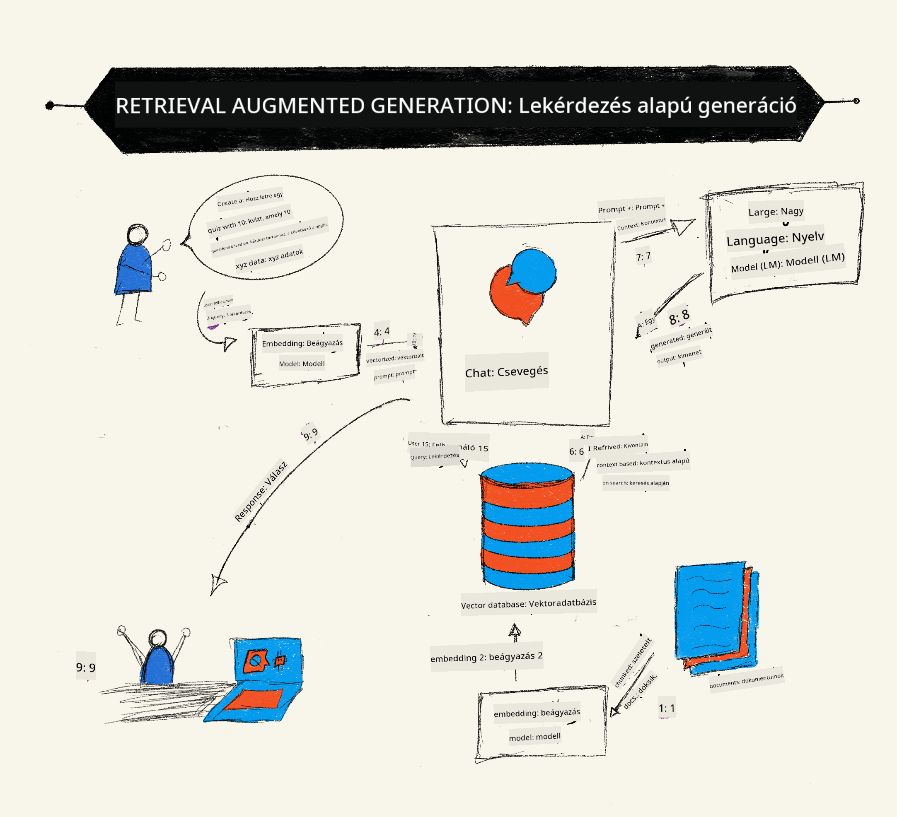
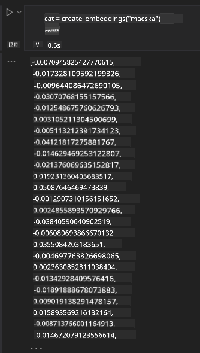

<!--
CO_OP_TRANSLATOR_METADATA:
{
  "original_hash": "e2861bbca91c0567ef32bc77fe054f9e",
  "translation_date": "2025-05-20T01:39:37+00:00",
  "source_file": "15-rag-and-vector-databases/README.md",
  "language_code": "hu"
}
-->
# Visszakeresés-kiegészített generálás (RAG) és vektoradatbázisok

[](https://aka.ms/gen-ai-lesson15-gh?WT.mc_id=academic-105485-koreyst)

A keresési alkalmazások leckéjében röviden megtanultuk, hogyan integrálhatjuk saját adatainkat a nagy nyelvi modellekbe (LLM-ek). Ebben a leckében mélyebben belemerülünk abba, hogyan alapozhatjuk meg az adatainkat az LLM alkalmazásunkban, a folyamat mechanikájába és az adatok tárolásának módszereibe, beleértve a beágyazásokat és a szöveget is.

> **Videó hamarosan**

## Bevezetés

Ebben a leckében az alábbiakat fogjuk áttekinteni:

- Bevezetés a RAG-ba, mi az és miért használják a mesterséges intelligenciában (AI).

- Megértjük, mik azok a vektoradatbázisok, és létrehozunk egyet az alkalmazásunkhoz.

- Egy gyakorlati példa arra, hogyan integráljuk a RAG-ot egy alkalmazásba.

## Tanulási célok

A lecke befejezése után képes leszel:

- Megmagyarázni a RAG jelentőségét az adatvisszakeresésben és feldolgozásban.

- Beállítani a RAG alkalmazást, és megalapozni az adataidat egy LLM-hez.

- Hatékonyan integrálni a RAG-ot és vektoradatbázisokat LLM alkalmazásokba.

## A mi forgatókönyvünk: LLM-ek fejlesztése saját adatainkkal

Ebben a leckében szeretnénk hozzáadni saját jegyzeteinket az oktatási startuphoz, amely lehetővé teszi a chatbot számára, hogy több információt kapjon a különböző témákról. A jegyzetek segítségével a tanulók jobban tudnak tanulni és megérteni a különböző témákat, így könnyebb lesz a vizsgákra való felkészülés. A forgatókönyvünk létrehozásához használni fogjuk:

- `Azure OpenAI:` az LLM-et, amelyet a chatbotunk létrehozásához fogunk használni

- `AI for beginners' lesson on Neural Networks`: ez lesz az az adat, amelyre az LLM-ünket alapozzuk

- `Azure AI Search` és `Azure Cosmos DB:` vektoradatbázis az adataink tárolására és keresési index létrehozására

A felhasználók képesek lesznek gyakorló kvízeket készíteni a jegyzeteikből, felülvizsgálati villámkártyákat és összefoglalni azokat rövid áttekintésekbe. Kezdjük azzal, hogy megnézzük, mi is az a RAG és hogyan működik:

## Visszakeresés-kiegészített generálás (RAG)

Egy LLM által működtetett chatbot feldolgozza a felhasználói kéréseket, hogy válaszokat generáljon. Úgy van tervezve, hogy interaktív legyen, és széles körű témákban foglalkozzon a felhasználókkal. Azonban a válaszai korlátozottak az adott kontextusra és az alapvető tanulási adataira. Például a GPT-4 tudásának határideje 2021. szeptember, ami azt jelenti, hogy nincs ismerete az ezt követően történt eseményekről. Ezen kívül az LLM-ek tanításához használt adatok kizárják a bizalmas információkat, mint például személyes jegyzeteket vagy egy vállalat termékkézikönyvét.

### Hogyan működnek a RAG-ok (Visszakeresés-kiegészített generálás)



Tegyük fel, hogy szeretnél telepíteni egy chatbotot, amely kvízeket készít a jegyzeteidből, szükséged lesz egy kapcsolatra a tudásbázissal. Itt jön a RAG segítségére. A RAG-ok így működnek:

- **Tudásbázis:** A visszakeresés előtt ezeket a dokumentumokat be kell venni és elő kell készíteni, általában nagy dokumentumokat kisebb darabokra bontva, szövegbeágyazásra átalakítva és adatbázisban tárolva.

- **Felhasználói kérdés:** a felhasználó feltesz egy kérdést

- **Visszakeresés:** Amikor a felhasználó kérdést tesz fel, a beágyazási modell releváns információkat keres a tudásbázisunkból, hogy több kontextust biztosítson, amelyet beépítenek a kérésbe.

- **Kiegészített generálás:** az LLM javítja a válaszát az elért adatok alapján. Lehetővé teszi, hogy a generált válasz ne csak az előre tanított adatokra épüljön, hanem a hozzáadott kontextusból származó releváns információkra is. Az elért adatokkal kiegészítik az LLM válaszait. Az LLM ezután visszaküldi a választ a felhasználó kérdésére.


A RAG-ok architektúrája transzformátorok segítségével valósul meg, amelyek két részből állnak: egy kódolóból és egy dekóderből. Például, amikor a felhasználó kérdést tesz fel, a bemeneti szöveg 'kódolva' van vektorokká, amelyek rögzítik a szavak jelentését, és a vektorok 'dekódolva' vannak a dokumentum indexünkbe, és új szöveget generálnak a felhasználói kérdés alapján. Az LLM mind a kódoló-dekóder modellt használja a kimenet generálásához.

Két megközelítés a RAG megvalósításakor a javasolt cikk szerint: [Retrieval-Augmented Generation for Knowledge intensive NLP (természetes nyelvfeldolgozó szoftver) Tasks](https://arxiv.org/pdf/2005.11401.pdf?WT.mc_id=academic-105485-koreyst) a következők:

- **_RAG-Sequence_** a visszakeresett dokumentumok használata a legjobb lehetséges válasz megjóslására a felhasználói kérdésre

- **RAG-Token** a dokumentumok használata a következő token generálásához, majd visszakeresésük a felhasználói kérdés megválaszolására

### Miért használnál RAG-okat?

- **Információgazdagság:** biztosítja, hogy a szöveges válaszok naprakészek és aktuálisak legyenek. Ezáltal javítja a teljesítményt a domain-specifikus feladatokon azáltal, hogy hozzáfér az belső tudásbázishoz.

- Csökkenti a kitalálást azáltal, hogy **ellenőrizhető adatokat** használ a tudásbázisban, hogy kontextust biztosítson a felhasználói kérdésekhez.

- **Költséghatékony**, mivel gazdaságosabbak, mint egy LLM finomhangolása

## Tudásbázis létrehozása

Alkalmazásunk a személyes adatainkon alapul, azaz a neurális hálózat leckén az AI For Beginners tananyagban.

### Vektoradatbázisok

A vektoradatbázis, a hagyományos adatbázisoktól eltérően, egy speciális adatbázis, amely a beágyazott vektorok tárolására, kezelésére és keresésére van tervezve. Numerikus reprezentációkat tárol a dokumentumokról. Az adatok numerikus beágyazásokra bontása megkönnyíti AI rendszerünk számára az adatok megértését és feldolgozását.

Beágyazásainkat vektoradatbázisokban tároljuk, mivel az LLM-ek korlátozottak az elfogadott bemeneti tokenek számát illetően. Mivel nem tudod átadni az egész beágyazásokat egy LLM-nek, darabokra kell bontanunk őket, és amikor a felhasználó kérdést tesz fel, a kérdéshez leginkább hasonló beágyazások vissza lesznek adva a kérés mellett. A darabolás csökkenti a költségeket is az LLM-en keresztül átadott tokenek számán.

Néhány népszerű vektoradatbázis közé tartozik az Azure Cosmos DB, Clarifyai, Pinecone, Chromadb, ScaNN, Qdrant és DeepLake. Az Azure CLI segítségével létrehozhatsz egy Azure Cosmos DB modellt a következő parancs segítségével:

```bash
az login
az group create -n <resource-group-name> -l <location>
az cosmosdb create -n <cosmos-db-name> -r <resource-group-name>
az cosmosdb list-keys -n <cosmos-db-name> -g <resource-group-name>
```

### Szövegből beágyazások

Mielőtt tárolnánk az adatainkat, vektorbeágyazásokra kell konvertálnunk őket, mielőtt az adatbázisban tárolnánk. Ha nagy dokumentumokkal vagy hosszú szövegekkel dolgozol, darabokra bonthatod őket a várható kérdések alapján. A darabolás mondatszinten vagy bekezdésszinten történhet. Mivel a darabolás a körülöttük lévő szavakból vonja le a jelentéseket, hozzáadhatsz némi kontextust egy darabhoz, például a dokumentum címének hozzáadásával vagy némi szöveg hozzáadásával a darab elé vagy után. Az adatokat az alábbi módon darabolhatod:

```python
def split_text(text, max_length, min_length):
    words = text.split()
    chunks = []
    current_chunk = []

    for word in words:
        current_chunk.append(word)
        if len(' '.join(current_chunk)) < max_length and len(' '.join(current_chunk)) > min_length:
            chunks.append(' '.join(current_chunk))
            current_chunk = []

    # If the last chunk didn't reach the minimum length, add it anyway
    if current_chunk:
        chunks.append(' '.join(current_chunk))

    return chunks
```

Miután daraboltuk, beágyazhatjuk a szövegünket különböző beágyazási modellek segítségével. Néhány modell, amelyet használhatsz: word2vec, ada-002 az OpenAI-tól, Azure Computer Vision és még sok más. A használni kívánt modell kiválasztása attól függ, hogy milyen nyelveket használsz, milyen típusú tartalmat kódolsz (szöveg/képek/hang), milyen méretű bemenetet képes kódolni és milyen hosszú a beágyazás kimenete.

Egy példa az OpenAI `text-embedding-ada-002` modelljével beágyazott szövegre:


## Visszakeresés és vektorkeresés

Amikor a felhasználó kérdést tesz fel, a visszakereső vektorrá alakítja a kérdést a kérés kódoló segítségével, majd keres a dokumentum keresési indexünkben a bemenettel kapcsolatos releváns vektorok után. Miután ez megtörtént, átalakítja mind a bemeneti vektort, mind a dokumentum vektorokat szöveggé, és átadja az LLM-nek.

### Visszakeresés

A visszakeresés akkor történik, amikor a rendszer megpróbál gyorsan megtalálni az indexből azokat a dokumentumokat, amelyek megfelelnek a keresési kritériumoknak. A visszakereső célja az, hogy olyan dokumentumokat kapjon, amelyek kontextust biztosítanak és megalapozzák az LLM-et az adataidon.

Számos módja van a keresésnek az adatbázisunkban, például:

- **Kulcsszó keresés** - szöveges keresésekhez használják

- **Szemantikai keresés** - a szavak szemantikai jelentését használja

- **Vektorkeresés** - a dokumentumokat szövegből vektor reprezentációkra alakítja beágyazási modellek segítségével. A visszakeresés a dokumentumok lekérdezésével történik, amelyek vektor reprezentációi a legközelebb állnak a felhasználói kérdéshez.

- **Hibrid** - a kulcsszó és vektorkeresés kombinációja.

A visszakeresés kihívása akkor merül fel, amikor nincs hasonló válasz a kérdésre az adatbázisban, a rendszer ekkor a legjobb információt fogja visszaadni, amit kaphat, azonban használhatsz taktikákat, mint például a relevancia maximális távolságának beállítása vagy hibrid keresés használata, amely kombinálja a kulcsszavakat és a vektorkeresést. Ebben a leckében hibrid keresést fogunk használni, amely a vektor és kulcsszó keresés kombinációja. Az adatainkat egy adatkeretbe fogjuk tárolni, amely oszlopokat tartalmaz a darabokkal és beágyazásokkal.

### Vektorszerűség

A visszakereső keres a tudásadatbázisban olyan beágyazások után, amelyek közel vannak egymáshoz, a legközelebbi szomszéd, mivel ezek hasonló szövegek. Abban az esetben, amikor a felhasználó kérdést tesz fel, először beágyazódik, majd összevetik hasonló beágyazásokkal. A közös mérés, amelyet használnak a különböző vektorok hasonlóságának megállapítására, a koszinusz hasonlóság, amely a két vektor közötti szög alapján történik.

Mérhetjük a hasonlóságot más alternatívák segítségével is, mint például az euklideszi távolság, amely a vektor végpontjai közötti egyenes vonal, és a pontszorzat, amely a két vektor megfelelő elemeinek szorzatainak összegét méri.

### Keresési index

Amikor visszakeresést végzünk, keresési indexet kell építenünk a tudásbázisunkhoz, mielőtt keresést végeznénk. Egy index tárolja a beágyazásokat, és gyorsan visszakeresheti a legjobban hasonló darabokat még egy nagy adatbázisban is. Létrehozhatjuk az indexünket helyben a következő módon:

```python
from sklearn.neighbors import NearestNeighbors

embeddings = flattened_df['embeddings'].to_list()

# Create the search index
nbrs = NearestNeighbors(n_neighbors=5, algorithm='ball_tree').fit(embeddings)

# To query the index, you can use the kneighbors method
distances, indices = nbrs.kneighbors(embeddings)
```

### Újrarangsorolás

Miután lekérdezted az adatbázist, lehet, hogy szükséged lesz a legrelevánsabb eredmények sorba rendezésére. Egy újrarangsoroló LLM a gépi tanulást használja a keresési eredmények relevanciájának javítására azáltal, hogy azokat a legrelevánsabbtól kezdve rendezi. Az Azure AI Search segítségével az újrarangsorolás automatikusan történik egy szemantikai újrarangsoroló segítségével. Egy példa arra, hogyan működik az újrarangsorolás a legközelebbi szomszédok segítségével:

```python
# Find the most similar documents
distances, indices = nbrs.kneighbors([query_vector])

index = []
# Print the most similar documents
for i in range(3):
    index = indices[0][i]
    for index in indices[0]:
        print(flattened_df['chunks'].iloc[index])
        print(flattened_df['path'].iloc[index])
        print(flattened_df['distances'].iloc[index])
    else:
        print(f"Index {index} not found in DataFrame")
```

## Mindent összefoglalva

Az utolsó lépés az, hogy hozzáadjuk az LLM-ünket a keverékhez, hogy képesek legyünk válaszokat kapni, amelyek az adatainkon alapulnak. A következőképpen valósíthatjuk meg:

```python
user_input = "what is a perceptron?"

def chatbot(user_input):
    # Convert the question to a query vector
    query_vector = create_embeddings(user_input)

    # Find the most similar documents
    distances, indices = nbrs.kneighbors([query_vector])

    # add documents to query  to provide context
    history = []
    for index in indices[0]:
        history.append(flattened_df['chunks'].iloc[index])

    # combine the history and the user input
    history.append(user_input)

    # create a message object
    messages=[
        {"role": "system", "content": "You are an AI assistant that helps with AI questions."},
        {"role": "user", "content": history[-1]}
    ]

    # use chat completion to generate a response
    response = openai.chat.completions.create(
        model="gpt-4",
        temperature=0.7,
        max_tokens=800,
        messages=messages
    )

    return response.choices[0].message

chatbot(user_input)
```

## Az alkalmazásunk értékelése

### Értékelési metrikák

- A válaszok minősége biztosítva, hogy természetesnek, folyékonynak és emberinek hangzanak

- Az adatok megalapozottsága: annak értékelése, hogy a válasz a megadott dokumentumokból származik-e

- Relevancia: annak értékelése, hogy a válasz megfelel-e és kapcsolódik-e a feltett kérdéshez

- Folyékonyság - hogy a válasz nyelvtanilag érthető-e

## Felhasználási esetek a RAG (Visszakeresés-kiegészített generálás) és vektoradatbázisok használatához

Számos különböző felhasználási eset van, ahol a funkcióhívások javíthatják az alkalmazásodat, például:

- Kérdés-válaszolás: a vállalati adatokat egy csevegéshez alapozva, amelyet az alkalmazottak kérdések feltevésére használhatnak.

- Ajánlórendszerek: ahol létrehozhatsz egy rendszert, amely a leginkább hasonló értékeket párosítja, pl. filmek, éttermek és még sok más.

- Chatbot szolgáltatások: tárolhatod a csevegési előzményeket, és személy

**Felelősség kizárása**:  
Ez a dokumentum az AI fordítási szolgáltatás [Co-op Translator](https://github.com/Azure/co-op-translator) használatával készült. Bár törekszünk a pontosságra, kérjük, vegye figyelembe, hogy az automatikus fordítások hibákat vagy pontatlanságokat tartalmazhatnak. Az eredeti dokumentum az eredeti nyelvén tekintendő hiteles forrásnak. Kritikus információk esetén javasolt a professzionális emberi fordítás igénybevétele. Nem vállalunk felelősséget a fordítás használatából eredő félreértésekért vagy félreértelmezésekért.