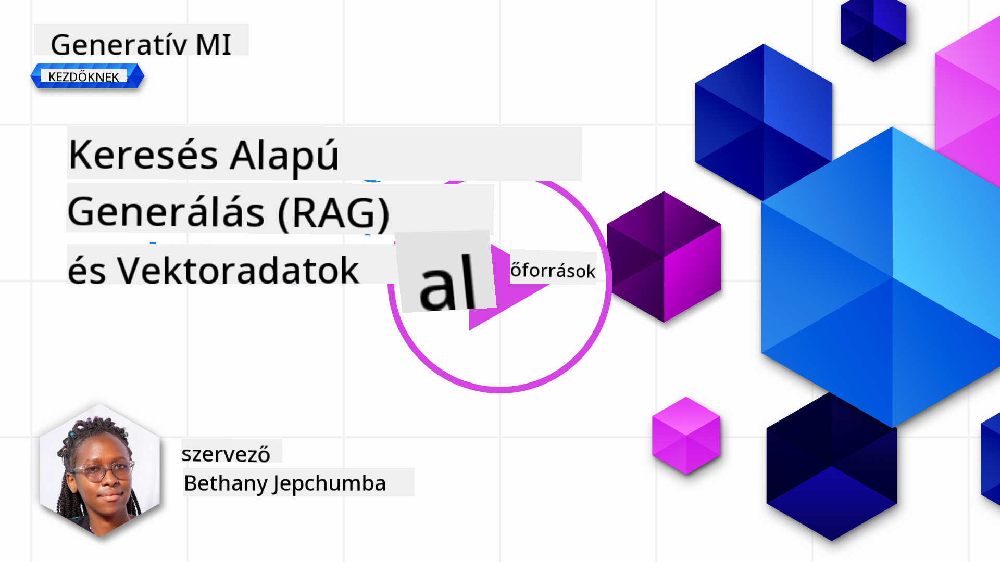
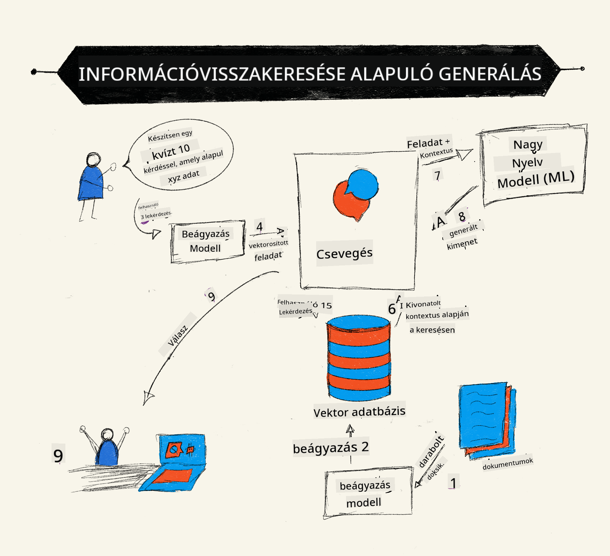
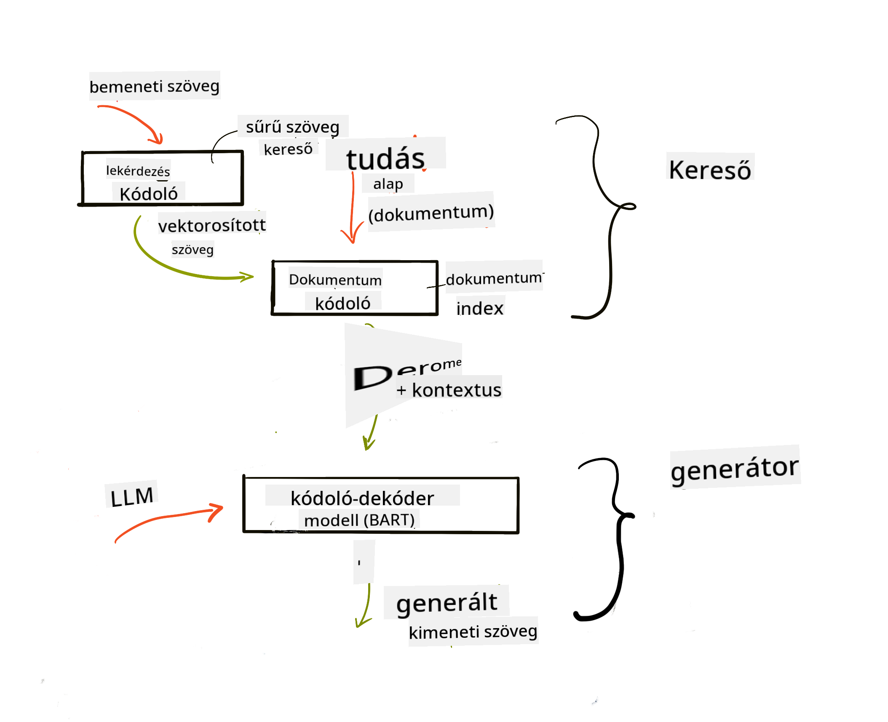
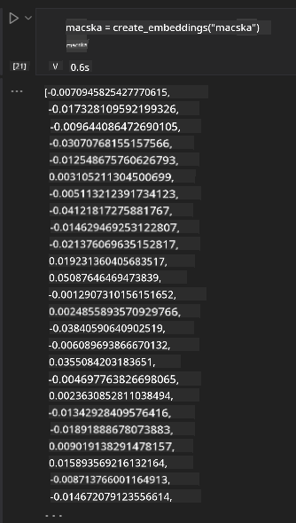

<!--
CO_OP_TRANSLATOR_METADATA:
{
  "original_hash": "e2861bbca91c0567ef32bc77fe054f9e",
  "translation_date": "2025-07-09T16:18:31+00:00",
  "source_file": "15-rag-and-vector-databases/README.md",
  "language_code": "hu"
}
-->
# Retrieval Augmented Generation (RAG) és vektoralapú adatbázisok

[](https://aka.ms/gen-ai-lesson15-gh?WT.mc_id=academic-105485-koreyst)

A keresési alkalmazások leckében röviden megismertük, hogyan lehet saját adatokat integrálni a Nagy Nyelvi Modellekbe (LLM-ekbe). Ebben a leckében mélyebben belemerülünk abba, hogyan lehet az adatokat megalapozni az LLM alkalmazásban, a folyamat működésébe és az adatok tárolásának módszereibe, beleértve az embeddingeket és a szöveget is.

> **Videó hamarosan elérhető**

## Bevezetés

Ebben a leckében a következő témákat tárgyaljuk:

- Bevezetés a RAG-be, mi az és miért használják a mesterséges intelligenciában (AI).

- Megértjük, mik azok a vektoralapú adatbázisok, és létrehozunk egyet az alkalmazásunkhoz.

- Egy gyakorlati példa arra, hogyan integráljuk a RAG-et egy alkalmazásba.

## Tanulási célok

A lecke elvégzése után képes leszel:

- Elmagyarázni a RAG jelentőségét az adatok lekérésében és feldolgozásában.

- Beállítani egy RAG alkalmazást és megalapozni az adataidat egy LLM-ben.

- Hatékonyan integrálni a RAG-et és a vektoralapú adatbázisokat LLM alkalmazásokban.

## A mi esetünk: LLM-jeink fejlesztése saját adatokkal

Ebben a leckében szeretnénk hozzáadni saját jegyzeteinket az oktatási startuphoz, hogy a chatbot több információt kapjon a különböző témákról. A jegyzetek segítségével a tanulók jobban tudnak tanulni és megérteni a különböző témaköröket, így könnyebben tudnak készülni a vizsgáikra. A forgatókönyvünk létrehozásához a következőket használjuk:

- `Azure OpenAI:` az LLM, amellyel a chatbotot készítjük

- `AI for beginners' lesson on Neural Networks:` ez lesz az az adat, amire az LLM-et alapozzuk

- `Azure AI Search` és `Azure Cosmos DB:` vektoralapú adatbázis az adataink tárolására és keresési index létrehozására

A felhasználók képesek lesznek gyakorló kvízeket készíteni a jegyzeteikből, ismétlő kártyákat létrehozni, és összefoglalókat készíteni. Kezdjük azzal, hogy megnézzük, mi az a RAG és hogyan működik:

## Retrieval Augmented Generation (RAG)

Egy LLM-alapú chatbot a felhasználói kérdések feldolgozásával válaszokat generál. Interaktív módon működik, és sokféle témában képes párbeszédet folytatni. Válaszai azonban korlátozottak a rendelkezésre álló kontextusra és az alapul szolgáló tanító adatokra. Például a GPT-4 tudásvágási pontja 2021 szeptember, vagyis nem ismeri az azóta történt eseményeket. Emellett az LLM-ek képzéséhez használt adatok nem tartalmaznak bizalmas információkat, mint például személyes jegyzetek vagy egy cég termékkézikönyve.

### Hogyan működnek a RAG-ek (Retrieval Augmented Generation)



Tegyük fel, hogy egy olyan chatbotot szeretnél bevezetni, amely a jegyzeteidből kvízeket készít, ehhez szükséged lesz egy kapcsolatfelvételre a tudásbázissal. Itt jön képbe a RAG. A RAG-ek a következőképpen működnek:

- **Tudásbázis:** A lekérés előtt ezeket a dokumentumokat be kell olvasni és elő kell készíteni, általában úgy, hogy a nagy dokumentumokat kisebb részekre bontják, átalakítják szöveges embeddingekké, majd eltárolják egy adatbázisban.

- **Felhasználói kérdés:** a felhasználó kérdést tesz fel

- **Lekérés:** Amikor a felhasználó kérdez, az embedding modell releváns információkat keres a tudásbázisból, hogy több kontextust adjon, amely beépül a promptba.

- **Kiterjesztett generálás:** az LLM a lekért adatok alapján javítja a válaszát. Ez lehetővé teszi, hogy a válasz ne csak az előzetesen betanított adatokon alapuljon, hanem a hozzáadott kontextusból származó releváns információkat is felhasználja. Az LLM ezután válaszol a felhasználó kérdésére.



A RAG-ek architektúrája transformer alapú, két részből áll: egy encoderből és egy decoderből. Például amikor a felhasználó kérdez, a bemeneti szöveget vektorokká "kódolják", amelyek a szavak jelentését ragadják meg, majd a vektorokat "dekódolják" a dokumentumindexbe, és új szöveget generálnak a felhasználói kérdés alapján. Az LLM mindkét modellt használja a kimenet előállításához.

A javasolt tanulmány szerint két megközelítés létezik a RAG megvalósítására: [Retrieval-Augmented Generation for Knowledge intensive NLP Tasks](https://arxiv.org/pdf/2005.11401.pdf?WT.mc_id=academic-105485-koreyst):

- **_RAG-Sequence_**: a lekért dokumentumokat használja a legjobb válasz előrejelzésére a felhasználói kérdésre

- **RAG-Token**: a dokumentumokat a következő token generálásához használja, majd lekéri őket a válaszhoz

### Miért érdemes RAG-et használni?

- **Információgazdagság:** biztosítja, hogy a szöveges válaszok naprakészek és aktuálisak legyenek. Ezáltal javítja a teljesítményt az adott szakterületi feladatokban, mivel hozzáfér a belső tudásbázishoz.

- Csökkenti a kitalálásokat azáltal, hogy **ellenőrizhető adatokat** használ a tudásbázisból, hogy kontextust adjon a felhasználói kérdésekhez.

- **Költséghatékony**, mivel gazdaságosabb, mint egy LLM finomhangolása.

## Tudásbázis létrehozása

Az alkalmazásunk személyes adatokon alapul, azaz az AI For Beginners tananyagának Neurális Hálózat leckéjén.

### Vektoralapú adatbázisok

A vektoralapú adatbázis, ellentétben a hagyományos adatbázisokkal, egy speciális adatbázis, amely beágyazott vektorok tárolására, kezelésére és keresésére szolgál. Számértékes reprezentációkat tárol dokumentumokról. Az adatok numerikus embeddingekké bontása megkönnyíti az AI rendszer számára az adatok megértését és feldolgozását.

Az embeddingeket vektoralapú adatbázisokban tároljuk, mivel az LLM-eknek korlátozott a bemeneti tokenek száma. Mivel nem lehet az egész embeddinget egyszerre átadni az LLM-nek, darabokra kell bontani, és amikor a felhasználó kérdez, a kérdéshez leginkább hasonló embeddingeket adjuk vissza a prompttal együtt. A darabolás csökkenti a tokenek számát, így a költségeket is.

Néhány népszerű vektoralapú adatbázis: Azure Cosmos DB, Clarifyai, Pinecone, Chromadb, ScaNN, Qdrant és DeepLake. Azure Cosmos DB modellt az Azure CLI segítségével hozhatsz létre a következő paranccsal:

```bash
az login
az group create -n <resource-group-name> -l <location>
az cosmosdb create -n <cosmos-db-name> -r <resource-group-name>
az cosmosdb list-keys -n <cosmos-db-name> -g <resource-group-name>
```

### Szövegből embeddingekbe

Mielőtt tárolnánk az adatokat, vektorembeddingekké kell alakítani őket. Ha nagy dokumentumokkal vagy hosszú szövegekkel dolgozol, darabolhatod őket a várható lekérdezések alapján. A darabolás történhet mondatszinten vagy bekezdésszinten. Mivel a darabok jelentését a környező szavak adják, adhatsz hozzájuk további kontextust, például a dokumentum címét vagy néhány szöveget a darab előtt vagy után. Az adatokat így darabolhatod:

```python
def split_text(text, max_length, min_length):
    words = text.split()
    chunks = []
    current_chunk = []

    for word in words:
        current_chunk.append(word)
        if len(' '.join(current_chunk)) < max_length and len(' '.join(current_chunk)) > min_length:
            chunks.append(' '.join(current_chunk))
            current_chunk = []

    # If the last chunk didn't reach the minimum length, add it anyway
    if current_chunk:
        chunks.append(' '.join(current_chunk))

    return chunks
```

A darabolás után különböző embedding modellekkel ágyazhatod be a szöveget. Használhatsz például word2vec-et, OpenAI ada-002 modelljét, Azure Computer Vision-t és még sok mást. A modell kiválasztása attól függ, milyen nyelvet használsz, milyen típusú tartalmat kódolsz (szöveg/kép/hang), mekkora bemenetet képes kezelni és milyen hosszú embeddinget ad vissza.

Egy példa az OpenAI `text-embedding-ada-002` modelljével készült embeddingre:


## Lekérés és vektoros keresés

Amikor a felhasználó kérdez, a lekérő a kérdést vektorrá alakítja a lekérdezésenkóder segítségével, majd átkutatja a dokumentumkereső indexünket a releváns vektorok után, amelyek kapcsolódnak a bemenethez. Ezután a bemeneti és dokumentumvektorokat szöveggé alakítja, és átadja az LLM-nek.

### Lekérés

A lekérés akkor történik, amikor a rendszer gyorsan megpróbálja megtalálni azokat a dokumentumokat az indexben, amelyek megfelelnek a keresési feltételeknek. A lekérő célja, hogy olyan dokumentumokat szerezzen, amelyek kontextust adnak és megalapozzák az LLM-et az adataiddal.

Többféle keresési mód létezik az adatbázisban, például:

- **Kulcsszavas keresés** – szöveges keresésekhez

- **Szemantikus keresés** – a szavak jelentését használja

- **Vektoros keresés** – a dokumentumokat embedding modellekkel vektorokká alakítja. A lekérés azokat a dokumentumokat keresi, amelyek vektorai leginkább hasonlítanak a felhasználói kérdés vektorához.

- **Hibrid** – a kulcsszavas és vektoros keresés kombinációja.

A lekérés kihívása, ha nincs hasonló válasz az adatbázisban, a rendszer a legjobb elérhető információt adja vissza. Ilyenkor beállítható a relevancia maximális távolsága, vagy használható hibrid keresés, amely a kulcsszavas és vektoros keresést ötvözi. Ebben a leckében hibrid keresést használunk, azaz a vektoros és kulcsszavas keresés kombinációját. Az adatokat egy dataframe-ben tároljuk, amely oszlopokban tartalmazza a darabokat és az embeddingeket.

### Vektoros hasonlóság

A lekérő a tudásbázisban olyan embeddingeket keres, amelyek közel vannak egymáshoz, azaz a legközelebbi szomszédokat, mert ezek hasonló szövegek. Ha a felhasználó kérdést tesz fel, azt először embeddinggé alakítjuk, majd összevetjük a hasonló embeddingekkel. A leggyakrabban használt mérőszám a koszinusz hasonlóság, amely a két vektor közötti szöget méri.

Más alternatívák a hasonlóság mérésére: az euklideszi távolság, amely a vektorok végpontjai közötti egyenes távolság, illetve a skaláris szorzat, amely a két vektor megfelelő elemeinek szorzatainak összegét méri.

### Keresési index

A lekérés előtt létre kell hoznunk egy keresési indexet a tudásbázisunkhoz. Az index tárolja az embeddingeket, és gyorsan vissza tudja adni a leginkább hasonló darabokat még nagy adatbázis esetén is. Az indexet helyben így hozhatjuk létre:

```python
from sklearn.neighbors import NearestNeighbors

embeddings = flattened_df['embeddings'].to_list()

# Create the search index
nbrs = NearestNeighbors(n_neighbors=5, algorithm='ball_tree').fit(embeddings)

# To query the index, you can use the kneighbors method
distances, indices = nbrs.kneighbors(embeddings)
```

### Újrarendezés (re-ranking)

Miután lekérdeztük az adatbázist, szükség lehet az eredmények relevancia szerinti rendezésére. Egy újrarendező LLM gépi tanulást használ, hogy javítsa a keresési eredmények relevanciáját, és a legrelevánsabbakat előre sorolja. Az Azure AI Search automatikusan elvégzi az újrarendezést szemantikus újrarendezővel. Íme egy példa arra, hogyan működik az újrarendezés a legközelebbi szomszédok alapján:

```python
# Find the most similar documents
distances, indices = nbrs.kneighbors([query_vector])

index = []
# Print the most similar documents
for i in range(3):
    index = indices[0][i]
    for index in indices[0]:
        print(flattened_df['chunks'].iloc[index])
        print(flattened_df['path'].iloc[index])
        print(flattened_df['distances'].iloc[index])
    else:
        print(f"Index {index} not found in DataFrame")
```

## Mindezt összeillesztve

Az utolsó lépés, hogy az LLM-et is bevonjuk, hogy olyan válaszokat kapjunk, amelyek az adatainkon alapulnak. Ezt így valósíthatjuk meg:

```python
user_input = "what is a perceptron?"

def chatbot(user_input):
    # Convert the question to a query vector
    query_vector = create_embeddings(user_input)

    # Find the most similar documents
    distances, indices = nbrs.kneighbors([query_vector])

    # add documents to query  to provide context
    history = []
    for index in indices[0]:
        history.append(flattened_df['chunks'].iloc[index])

    # combine the history and the user input
    history.append(user_input)

    # create a message object
    messages=[
        {"role": "system", "content": "You are an AI assistant that helps with AI questions."},
        {"role": "user", "content": history[-1]}
    ]

    # use chat completion to generate a response
    response = openai.chat.completions.create(
        model="gpt-4",
        temperature=0.7,
        max_tokens=800,
        messages=messages
    )

    return response.choices[0].message

chatbot(user_input)
```

## Az alkalmazás értékelése

### Értékelési mutatók

- A válaszok minősége: természetes, folyékony és emberi hangzású legyen

- Az adatok megalapozottsága: értékelni, hogy a válasz a megadott dokumentumokból származik-e

- Relevancia: a válasz illeszkedik-e és kapcsolódik-e a feltett kérdéshez

- Folyékonyság: a válasz nyelvtanilag értelmes-e

## RAG (Retrieval Augmented Generation) és vektoralapú adatbázisok használati esetei

Számos különböző esetben javíthatják az alkalmazásodat a funkcióhívások, például:

- Kérdés-válasz rendszerek: a céges adatokat alapozhatod egy chatre, amelyet az alkalmazottak kérdések feltevésére használhatnak.

- Ajánlórendszerek: olyan rendszert hozhatsz létre, amely a leginkább hasonló értékeket párosítja össze, pl. filmek, éttermek és még sok más.

- Chatbot szolgáltatások: tárolhatod a beszélgetési előzményeket, és személyre szabhatod a párbeszédet a felhasználói adatok alapján.

- Képkeresés vektorembeddingek alapján, hasznos képfelismeréshez és anomáliaészleléshez.

## Összefoglalás

Áttekintettük a RAG alapvető területeit, az adat hozzáadását az alkalmazáshoz, a felhasználói lekérdezést és a kimenetet. A RAG létrehozásának egyszerűsítésére használhatsz keretrendszereket, mint a Semantic Kernel, Langchain vagy Autogen.

## Feladat

A Retrieval Augmented Generation (RAG) további tanulásához építsd meg:

- Egy front-endet az alkalmazáshoz a választott keretrendszerrel

- Használj egy keretrendszert, például LangChain-et vagy Semantic Kernel-t, és építsd újra az alkalmazásodat.

Gratulálunk a lecke elvégzéséhez 👏.

## A tanulás itt nem ér véget, folytasd az utat

A lecke elvégzése után nézd meg a [Generative AI Learning collection](https://aka.ms/genai-collection?WT.mc_id=academic-105485-koreyst) gyűjteményünket, hogy tovább fejleszd generatív AI ismereteidet!

**Jogi nyilatkozat**:  
Ez a dokumentum az AI fordító szolgáltatás, a [Co-op Translator](https://github.com/Azure/co-op-translator) segítségével készült. Bár a pontosságra törekszünk, kérjük, vegye figyelembe, hogy az automatikus fordítások hibákat vagy pontatlanságokat tartalmazhatnak. Az eredeti dokumentum az anyanyelvén tekintendő hiteles forrásnak. Fontos információk esetén szakmai, emberi fordítást javaslunk. Nem vállalunk felelősséget a fordítás használatából eredő félreértésekért vagy téves értelmezésekért.