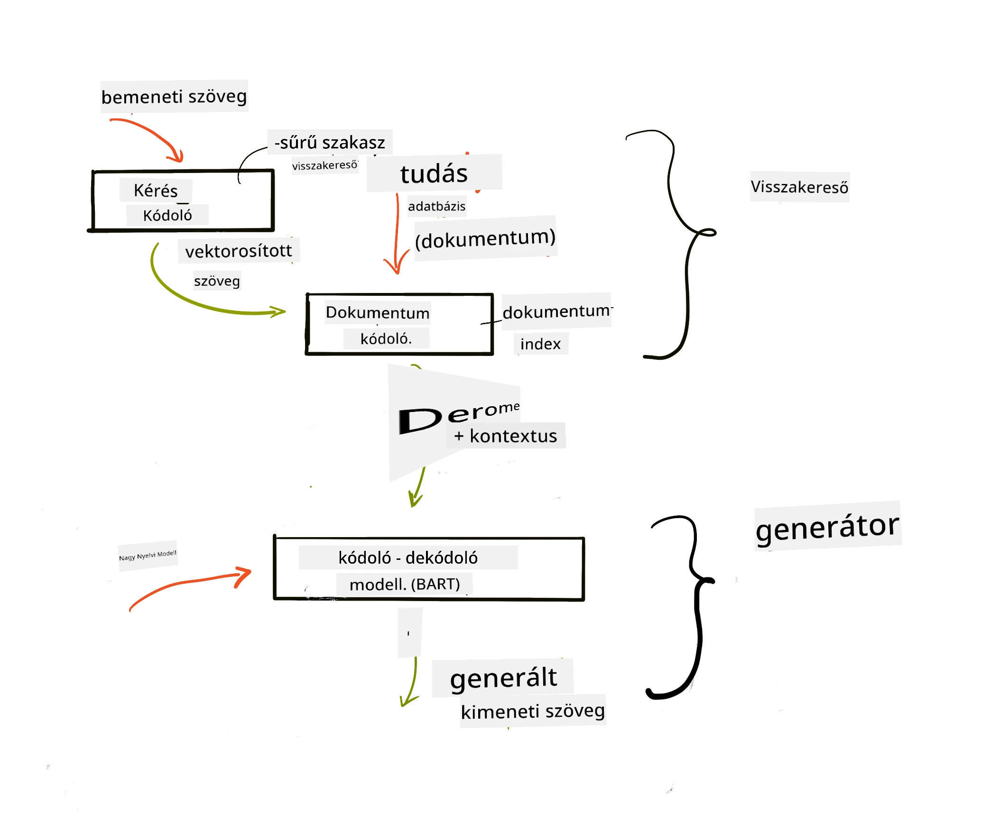
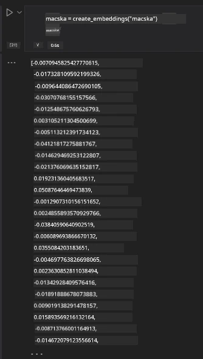

# Lekérdezés-gyorsított generálás (RAG) és vektor adatbázisok

[](https://youtu.be/4l8zhHUBeyI?si=BmvDmL1fnHtgQYkL)

A keresési alkalmazások leckében röviden megismertük, hogyan lehet integrálni a saját adatainkat a nagyméretű nyelvi modellekbe (LLM-ekbe). Ebben a leckében mélyebben bepillantást nyerünk az adatok alapozásának fogalmaiba az LLM alkalmazásaidban, a folyamat mechanikájába és az adattárolási módszerekbe, beleértve a beágyazásokat és a szöveget is.

> **Videó hamarosan elérhető**

## Bevezetés

Ebben a leckében a következőkről lesz szó:

- Bevezetés a RAG-be, mi is az és miért használjuk mesterséges intelligenciában (AI).

- Megértjük, mik azok a vektor adatbázisok, és hogyan hozhatunk létre egyet az alkalmazásunkhoz.

- Gyakorlati példa arra, hogyan integráljuk a RAG-et egy alkalmazásba.

## Tanulási célok

A lecke elvégzése után képes leszel:

- Megmagyarázni a RAG jelentőségét az adatok lekérdezésében és feldolgozásában.

- Beállítani a RAG alkalmazást és az adatokat összekötni egy LLM-mel.

- Hatékonyan integrálni a RAG-et és a vektor adatbázisokat LLM alkalmazásokban.

## A forgatókönyvünk: az LLM-jeink bővítése saját adatainkkal

Ebben a leckében saját jegyzeteinket szeretnénk hozzáadni az oktatási startuphoz, amely lehetővé teszi, hogy a chatbot több információval rendelkezzen a különböző tantárgyakról. A jegyzeteink segítségével a tanulók jobban tanulhatnak és megérthetik a különféle témákat, megkönnyítve a vizsgára való készülést. Forgatókönyvünk elkészítéséhez a következőket használjuk:

- `Azure OpenAI:` az LLM, amelyet chatbot létrehozására használunk

- `AI az kezdőknek lecke a neurális hálózatokról`: ez lesz az adat, amelyhez az LLM-et alapozzuk

- `Azure AI Search` és `Azure Cosmos DB:` vektor adatbázis az adataink tárolására és keresési index létrehozására

A felhasználók gyakoroló kvízeket hozhatnak létre a jegyzeteikből, készíthetnek ismétlő kártyákat és összefoglalókat. Kezdjük azzal, hogy mi az a RAG és hogyan működik:

## Lekérdezés-gyorsított generálás (RAG)

Egy LLM-alapú chatbot felhasználói utasításokat dolgoz fel válaszok generálására. Interaktív kialakítású, és sokféle témában kommunikál a felhasználókkal. Válaszai azonban a rendelkezésre álló kontextusra és az alapképzés adataira korlátozódnak. Például a GPT-4 tudásvágási dátuma 2021 szeptember, vagyis nem ismeri az azóta történt eseményeket. Továbbá, az LLM-ek kiképzéséhez használt adatok nem tartalmaznak bizalmas információkat, mint például személyes jegyzeteket vagy egy cég termékkézikönyvét.

### Hogyan működnek a RAG-ek (Lekérdezés-gyorsított generálás)


Tegyük fel, hogy egy chatbotot szeretnél üzemeltetni, amely a jegyzeteidből hoz létre kvízeket, ehhez kapcsolódni kell a tudásbázishoz. Itt jön a képbe a RAG. A RAG-ek így működnek:

- **Tudásbázis:** A lekérdezés előtt ezeket a dokumentumokat be kell olvasni és elő kell feldolgozni, általában nagy dokumentumokat kisebb részekre bontva, átalakítva őket szöveges beágyazássá, majd tárolva az adatbázisban.

- **Felhasználói lekérdezés:** a felhasználó kérdést tesz fel

- **Lekérdezés:** Amikor a felhasználó kérdez, a beágyazás modell releváns információkat keres a tudásbázisban, hogy több kontextust adjon a prompthoz.

- **Kiterjesztett generálás:** az LLM a lekért adatok alapján javítja válaszát. Ez lehetővé teszi, hogy a válasz ne csak a tanult adatokon alapuljon, hanem a hozzáadott releváns kontextusból is. A lekért adatokat az LLM válaszainak bővítésére használják. Az LLM ezután visszaadja a választ a felhasználó kérdésére.



A RAG architektúrája transformer modell alapján működik, amely két részből áll: egy kódolóból és egy dekódolóból. Például, amikor a felhasználó kérdez, a bemeneti szöveget „kódolják” vektorokká, amelyek a szavak jelentését rögzítik, majd ezeket a vektorokat „dekódolják” a dokumentum indexünkbe, és új szöveget generálnak a kérdés alapján. Az LLM mind a kódoló-dekódoló modellt használja a kimenet létrehozására.

A javasolt tanulmány [Retrieval-Augmented Generation for Knowledge intensive NLP Tasks](https://arxiv.org/pdf/2005.11401.pdf?WT.mc_id=academic-105485-koreyst) szerint a RAG implementálásnak két megközelítése van:

- **_RAG-Sequence_**: a lekért dokumentumokat használja a felhasználói kérdés legjobb válaszának előrejelzésére

- **RAG-Token**: a dokumentumokat használva generálja a következő tokent, majd újra lekéri őket a válaszhoz

### Miért használnál RAG-et?

- **Információ gazdagság:** biztosítja, hogy a szöveges válaszok naprakészek és aktuálisak legyenek. Ezáltal javítja az adott szakterületi feladatok teljesítményét azáltal, hogy hozzáfér az belső tudásbázishoz.

- Csökkenti a kitalálást azzal, hogy **ellenőrizhető adatokat** használ a tudásbázisban a felhasználói kérdések kontextusához.

- **Költséghatékony**, mivel gazdaságosabb, mint egy LLM finomhangolása.

## Tudásbázis létrehozása

Az alkalmazásunk saját adatainkra épül, azaz az AI kezdőknek oktatási anyagának Neurális Hálózatok leckéjére.

### Vektor adatbázisok

A vektor adatbázis egy speciális adatbázis, amely beágyazott vektorok tárolására, kezelésére és keresésére szolgál, szemben a hagyományos adatbázisokkal. A dokumentumok numerikus reprezentációit tárolja. Az adatok numerikus beágyazássá bontása megkönnyíti az MI rendszer számára az adatok megértését és feldolgozását.

A beágyazásainkat vektor adatbázisban tároljuk, mivel az LLM-eknek van bemeneti token korlátjuk. Mivel nem lehet az összes beágyazást egyszerre átadni az LLM-nek, darabokra kell őket bontani, és amikor a felhasználó kérdez, a kérdéshez leginkább illeszkedő beágyazásokat visszaadjuk a prompttal együtt. A darabolás csökkenti az LLM-en átvitt tokenek számát, így költséghatékonyabb.

Néhány népszerű vektor adatbázis: Azure Cosmos DB, Clarifyai, Pinecone, Chromadb, ScaNN, Qdrant és DeepLake. Azure CLI segítségével például így hozhatsz létre Azure Cosmos DB modellt:

```bash
az login
az group create -n <resource-group-name> -l <location>
az cosmosdb create -n <cosmos-db-name> -r <resource-group-name>
az cosmosdb list-keys -n <cosmos-db-name> -g <resource-group-name>
```

### Szövegből beágyazás

Mielőtt adatainkat tárolnánk, vektor beágyazásokká kell alakítani őket. Ha nagy dokumentumokkal vagy hosszú szövegekkel dolgozol, darabolhatod őket a várható lekérdezések szerint. Darabolás történhet mondatszinten vagy bekezdésszinten. Mivel a darabok a környező szavakból nyernek jelentést, adhatunk nekik plusz kontextust, például a dokumentum címét vagy némi szöveget a darab előtt vagy után. A darabolás így történhet:

```python
def split_text(text, max_length, min_length):
    words = text.split()
    chunks = []
    current_chunk = []

    for word in words:
        current_chunk.append(word)
        if len(' '.join(current_chunk)) < max_length and len(' '.join(current_chunk)) > min_length:
            chunks.append(' '.join(current_chunk))
            current_chunk = []

    # Ha az utolsó darab nem érte el a minimális hosszúságot, akkor is add hozzá
    if current_chunk:
        chunks.append(' '.join(current_chunk))

    return chunks
```

Miután daraboltuk, különböző beágyazó modellekkel alakíthatjuk beágyazásokká a szöveget. Használható modellek például: word2vec, OpenAI ada-002, Azure Computer Vision és sok más. A modell választása a használt nyelvektől, a tartalom típusától (szöveg/kép/hang), az input méretétől és a beágyazás hosszától függ.

Példa egy OpenAI `text-embedding-ada-002` modell által készített beágyazásra:


## Lekérdezés és vektor keresés

Amikor a felhasználó kérdez, a kereső lekódolja a kérdést vektorrá, aztán a dokumentum keresési indexünkben keres releváns vektorokat a bemenethez kapcsolódó dokumentumok között. Ezután a bemeneti vektort és a dokumentum vektorokat szöveggé alakítva továbbítja az LLM-nek.

### Lekérdezés

A lekérdezés akkor történik, amikor a rendszer gyorsan megpróbálja megtalálni azokat a dokumentumokat az indexből, amelyek megfelelnek a keresési feltételeknek. A lekérdező célja, hogy olyan dokumentumokat biztosítson, melyek kontextust adnak és alapozzák az LLM-et az adatokra.

Többféle keresési mód létezik az adatbázisban:

- **Kulcsszavas keresés** – szöveges keresésekhez

- **Vektor keresés** – a dokumentumokat beágyazás modellek segítségével alakítja vektor reprezentációvá, lehetővé téve a **szemantikus keresést**, amely a szavak jelentésén alapul. A lekérdezés a legközelebbi vektorok alapján történik.

- **Hibrid** – a kulcsszavas és vektor keresés kombinációja.

A kihívás akkor jelentkezik, ha nincs a kérdéshez hasonló válasz az adatbázisban, ilyenkor a rendszer a legjobb elérhető információt adja vissza. Erre vannak trükkök, mint például relevancia maximális távolságának beállítása vagy hibrid keresés alkalmazása, mely kulcsszavas és vektor keresést egyaránt használ. Ebben a leckében hibrid keresést használunk, adatainkat adatkeretben tárolva, oszlopokban a darabokkal és beágyazásokkal.

### Vektor hasonlóság

A kereső a tudásbázisban az összevethető beágyazások között keresi a legközelebbi szomszédokat, mert ezek a leginkább hasonló szövegek. Ha a felhasználó kérdez, azt először beágyazzuk, majd a hasonló beágyazásokkal illesztjük össze. A leggyakrabban használt mérőszám a vektorok hasonlóságára a koszinusz hasonlóság, amely a két vektor közötti szög alapján működik.

Más alternatívák a hasonlóság mérésére az euklideszi távolság (a két vektor végpontja közötti egyenes vonal) vagy a skaláris szorzat (a két vektor megfelelő elemeinek szorzatainak összege).

### Keresési index

Lekérdezés előtt szükséges keresési indexet építeni tudásbázisunkhoz. Az index tárolja a beágyazásainkat, és gyorsan tudja visszaadni a leginkább hasonló darabokat még nagy adatbázis esetén is. Indexet lokálisan így hozhatsz létre:

```python
from sklearn.neighbors import NearestNeighbors

embeddings = flattened_df['embeddings'].to_list()

# Keresési index létrehozása
nbrs = NearestNeighbors(n_neighbors=5, algorithm='ball_tree').fit(embeddings)

# Az index lekérdezéséhez használhatja a kneighbors metódust
distances, indices = nbrs.kneighbors(embeddings)
```

### Újrarendezés

Miután lekérdezted az adatbázist, szükség lehet az eredmények relevancia szerinti sorrendezésére. Egy újrarendező LLM gépi tanulást használ a keresési eredmények relevanciájának javítására úgy, hogy a legrelevánsabbat helyezi előre. Az Azure AI Search automatikusan végzi az újrarendezést szemantikus újrarendezővel. Íme egy példa arra, hogyan működik az újrarendezés a legközelebbi szomszédok alapján:

```python
# Találd meg a leginkább hasonló dokumentumokat
distances, indices = nbrs.kneighbors([query_vector])

index = []
# Írd ki a leginkább hasonló dokumentumokat
for i in range(3):
    index = indices[0][i]
    for index in indices[0]:
        print(flattened_df['chunks'].iloc[index])
        print(flattened_df['path'].iloc[index])
        print(flattened_df['distances'].iloc[index])
    else:
        print(f"Index {index} not found in DataFrame")
```

## Összeillesztve

Az utolsó lépés, hogy az LLM-et is bevonjuk a folyamatba, hogy az adatainkra alapozott válaszokat kapjunk. Az implementáció a következő lépésekből áll:

```python
user_input = "what is a perceptron?"

def chatbot(user_input):
    # A kérdés átalakítása lekérdezési vektorrá
    query_vector = create_embeddings(user_input)

    # A leginkább hasonló dokumentumok megtalálása
    distances, indices = nbrs.kneighbors([query_vector])

    # dokumentumok hozzáadása a lekérdezéshez a kontextus biztosításához
    history = []
    for index in indices[0]:
        history.append(flattened_df['chunks'].iloc[index])

    # az előzmény és a felhasználói bevitel egyesítése
    history.append(user_input)

    # üzenetobjektum létrehozása
    messages=[
        {"role": "system", "content": "You are an AI assistant that helps with AI questions."},
        {"role": "user", "content": "\n\n".join(history) }
    ]

    # csevegő befejezést használva válasz generálása
    response = openai.chat.completions.create(
        model="gpt-4",
        temperature=0.7,
        max_tokens=800,
        messages=messages
    )

    return response.choices[0].message

chatbot(user_input)
```

## Az alkalmazás kiértékelése

### Kiértékelési mutatók

- A válaszok minősége, hogy természetesnek, folyékonyan és emberinek hangzanak-e

- Adatáhozás (groundedness): annak értékelése, hogy a válasz a megadott dokumentumokból származik-e

- Relevancia: hogy a válasz megegyezik-e és kapcsolódik-e a feltett kérdéshez

- Folyékonyság – hogy a válasz grammatikaileg értelmes-e

## RAG (Lekérdezés-gyorsított generálás) és vektor adatbázisok alkalmazási területei

Számos alkalmazási eset van, ahol a funkcióhívások javíthatják az alkalmazásodat, például:

- Kérdés-válasz rendszerek: összekapcsolni a vállalati adatokat egy chattel, amit az alkalmazottak kérdések megválaszolására használhatnak.

- Ajánlórendszerek: olyan rendszer létrehozása, amely a leginkább hasonló értékeket találja meg, pl. filmek, éttermek stb.

- Chatbot szolgáltatások: tárolhatod a chat előzményeket, és személyre szabhatod a beszélgetést a felhasználói adatok alapján.

- Képes keresés vektor beágyazások alapján, hasznos képfelismerésnél vagy anomália kimutatásnál.

## Összefoglaló

Megismertük a RAG alapjait az adatok hozzáadásától az alkalmazáshoz, a felhasználói kérdéstől a kimenetig. A RAG kialakítását megkönnyítheted olyan keretrendszerekkel, mint a Semantic Kernel, Langchain vagy Autogen.

## Feladat

A lekérdezés-gyorsított generálás (RAG) tanulásának folytatásához építsd meg:

- Egy front-end-et az alkalmazáshoz a saját választott keretrendszereddel

- Használj keretrendszert, például LangChain-et vagy Semantic Kernelet, és készítsd újra az alkalmazásodat.

Gratulálunk a lecke elvégzéséhez 👏.

## A tanulás itt nem ér véget, folytasd az utat

A lecke elvégzése után nézd meg a [Generatív AI tanulási gyűjteményünket](https://aka.ms/genai-collection?WT.mc_id=academic-105485-koreyst), hogy tovább fejleszd a generatív AI ismereteidet!

---

<!-- CO-OP TRANSLATOR DISCLAIMER START -->
**Jogi nyilatkozat**:
Ezt a dokumentumot az AI fordító szolgáltatás, a [Co-op Translator](https://github.com/Azure/co-op-translator) segítségével fordítottuk le. Bár igyekszünk pontosságot biztosítani, kérjük, vegye figyelembe, hogy az automatikus fordítások hibákat vagy pontatlanságokat tartalmazhatnak. Az eredeti dokumentum az eredeti nyelvén tekintendő hiteles forrásnak. Fontos információk esetén szakmai emberi fordítást javaslunk. Nem vállalunk felelősséget az ebből a fordításból eredő félreértésekért vagy félreértelmezésekért.
<!-- CO-OP TRANSLATOR DISCLAIMER END -->