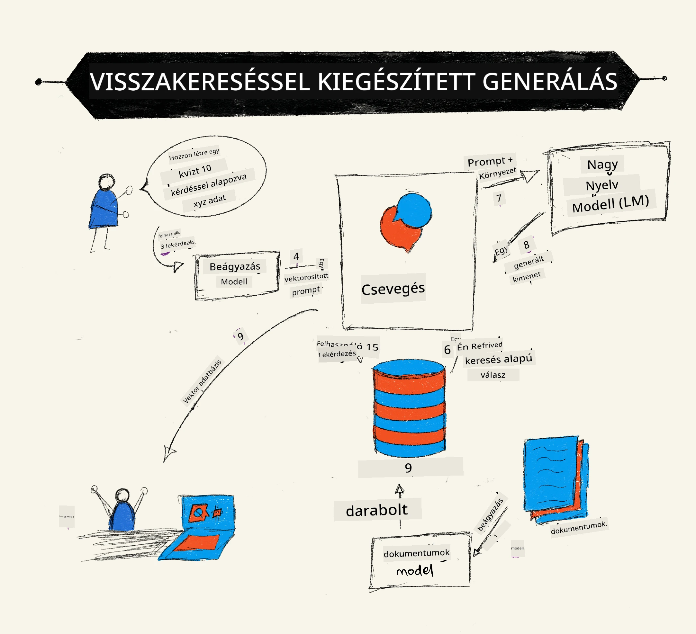
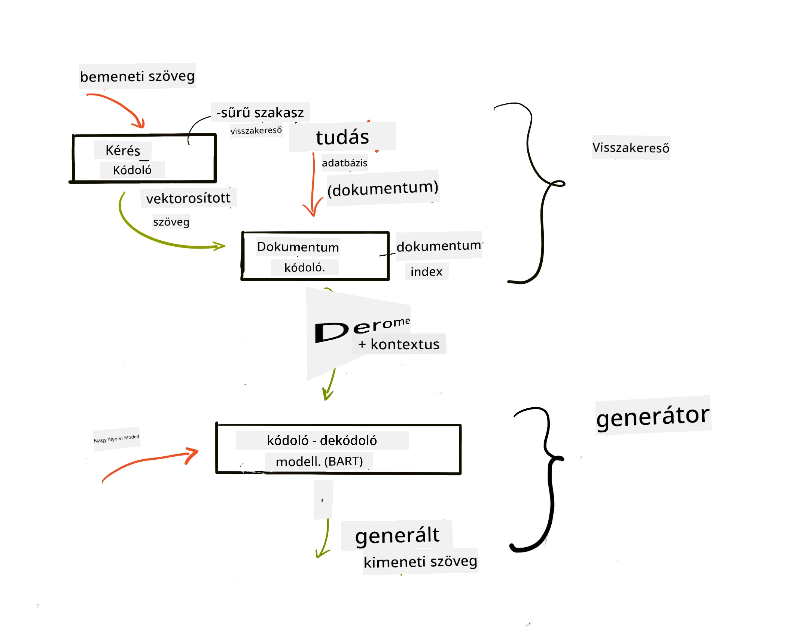
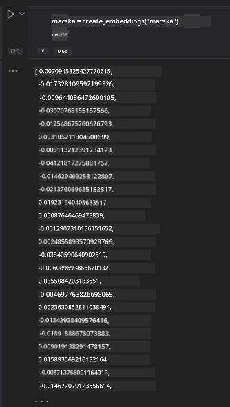

# Retrieval Augmented Generation (RAG) és vektoralapú adatbázisok

[](https://youtu.be/4l8zhHUBeyI?si=BmvDmL1fnHtgQYkL)

A keresési alkalmazások leckében röviden megtanultuk, hogyan lehet a saját adatainkat integrálni a nagynyelvű modellekbe (LLM-ekbe). Ebben a leckében mélyebben belemerülünk az adataink LLM alkalmazásban történő megalapozásának fogalmaiba, a folyamat mechanikájába és az adatok tárolási módszereibe, beleértve mind a beágyazásokat, mind a szöveget.

> **Videó hamarosan**

## Bevezetés

Ebben a leckében a következőkről lesz szó:

- Bevezetés a RAG-ba, mi ez és miért használják a mesterséges intelligenciában (AI).

- Megértjük, mik azok a vektoralapú adatbázisok, és létrehozunk egyet az alkalmazásunkhoz.

- Egy gyakorlati példa arra, hogyan lehet a RAG-ot integrálni egy alkalmazásba.

## Tanulási célok

A lecke elvégzése után képes leszel:

- Megmagyarázni a RAG jelentőségét az adatok visszakeresésében és feldolgozásában.

- Beállítani a RAG alkalmazást és megalapozni az adatokat egy LLM-ben

- Hatékonyan integrálni a RAG-ot és a vektoralapú adatbázisokat LLM alkalmazásokban.

## Forgatókönyvünk: LLM-jeink kiegészítése a saját adatainkkal

Ehhez a leckéhez azt szeretnénk, ha a chatbot a saját jegyzeteink alapján több információt kapna a különböző témákról. Ezen jegyzetek segítségével a tanulók jobban tanulhatnak és jobban megérthetik a különböző témaköröket, így könnyebben készülhetnek a vizsgáikra. Forgatókönyvünk létrehozásához a következőket fogjuk használni:

- `Azure OpenAI:` az LLM, amellyel chatbotunkat létrehozzuk

- `AI kezdőknek' leckéje a neurális hálózatokról`: ezekre az adatokra alapozzuk az LLM-et

- `Azure AI Search` és `Azure Cosmos DB:` vektoralapú adatbázis az adataink tárolásához és keresési index létrehozásához

A felhasználók képesek lesznek gyakorló kvízeket készíteni jegyzeteikből, ismétlő kártyákat létrehozni, és ezekből tömör összefoglalókat készíteni. Kezdésként nézzük meg, hogy mi az a RAG és hogyan működik:

## Retrieval Augmented Generation (RAG)

Egy LLM által működtetett chatbot feldolgozza a felhasználói kérdéseket, hogy válaszokat generáljon. Interaktívnak tervezték, számos témában képes válaszolni a felhasználóknak. Válaszai azonban kizárólag a rendelkezésre álló kontextusra és az alapul szolgáló tanító adatokra korlátozódnak. Például a GPT-4 tudásvágása 2021 szeptemberében van, vagyis nem ismeri az ezután bekövetkezett eseményeket. Emellett a LLM-ek képzéséhez használt adatok nem tartalmaznak bizalmas információkat, például személyes jegyzeteket vagy egy cég termékkézikönyvét.

### Hogyan működnek a RAG-ok (Retrieval Augmented Generation)



Tegyük fel, hogy egy chatbotot szeretnél telepíteni, amely a jegyzeteidből kvízeket készít, ehhez kapcsolat szükséges a tudásbázishoz. Itt jön képbe a RAG. A RAG-ok a következőképpen működnek:

- **Tudásbázis:** A visszakeresés előtt ezeket a dokumentumokat be kell olvasni és elő kell dolgozni, általában nagy dokumentumokat kisebb darabokra bontanak, átalakítják őket szövegbeágyazássá, majd eltárolják egy adatbázisban.

- **Felhasználói kérdés:** a felhasználó kérdést tesz fel

- **Visszakeresés:** Amikor a felhasználó kérdez, a beágyazási modellet használva lekéri a releváns információkat a tudásbázisból, hogy több kontextust biztosítson, amely beépül a kérdésbe.

- **Kiterjesztett generálás:** az LLM a lekért adatok alapján fejleszti a válaszát. Ez lehetővé teszi, hogy a válasz ne csak előre betanított adatokon alapuljon, hanem a hozzáadott kontextusból származó releváns információkon is. A lekért adatokat az LLM válaszaihoz használja. Ezután az LLM visszaadja a választ a felhasználó kérdésére.



A RAG architektúra transformer alapú, két részből áll: egy kódolóból és egy dekódolóból. Például amikor egy felhasználó kérdést tesz fel, a bemeneti szöveget úgy „kódolják” vektorokká, amelyek a szavak jelentését képviselik, majd ezek a vektorok „dekódolódnak” a dokumentumindexbe, és új szöveget generálnak a felhasználói kérdés alapján. Az LLM mind a kódoló-dekódoló modellt használja a kimenet generálásához.

Két megközelítés a RAG implementálására a javasolt cikk alapján: [Retrieval-Augmented Generation for Knowledge intensive NLP (természetes nyelvfeldolgozó feladatok)](https://arxiv.org/pdf/2005.11401.pdf?WT.mc_id=academic-105485-koreyst):

- **_RAG-Sequence_** a lekért dokumentumokat használja a lehető legjobb válasz megjóslásához a felhasználói kérdésre

- **RAG-Token** a következő token generálásához használja a dokumentumokat, majd lekéri azokat a válaszhoz

### Miért használnád a RAG-okat?

- **Információgazdagság:** biztosítja, hogy a szöveges válaszok naprakészek és aktuálisak legyenek. Ezáltal javítja a teljesítményt az adott szakterületi feladatokon, mivel hozzáfér az adott tudásbázishoz.

- Csökkenti a kitalálásokat azzal, hogy **ellenőrizhető adatokat** használ a tudásbázisból a felhasználói kérdések kontextusának biztosításához.

- **Költséghatékony:** mivel gazdaságosabb, mint egy LLM finomhangolása

## Tudásbázis létrehozása

Az alkalmazásunk személyes adatokon alapul, nevezetesen az AI kezdőknek tananyagban a neurális hálózatok leckén.

### Vektoralapú adatbázisok

A vektoralapú adatbázis eltér a hagyományos adatbázisoktól, mivel speciális adatbázis, amely beágyazott vektorok tárolására, kezelésére és keresésére szolgál. Számértékes ábrázolásokat tárol dokumentumokról. Az adatok számértékes beágyazássá bontása megkönnyíti az AI rendszerünk számára az adatok megértését és feldolgozását.

Embeddingjeinket vektoralapú adatbázisokban tároljuk, mivel az LLM-ek korlátozva vannak a bevitt tokenek számában. Nem lehet az egész embeddinget az LLM-nek átadni, ezért fel kell darabolni darabokra, és amikor egy felhasználó kérdez, az embeddingek közül a kérdéshez leginkább hasonlót adjuk vissza a kérdéssel együtt. A darabolás csökkenti a tokeneken alapuló költségeket is.

Néhány népszerű vektoralapú adatbázis az Azure Cosmos DB, Clarifyai, Pinecone, Chromadb, ScaNN, Qdrant és DeepLake. Azure CLI-vel Azure Cosmos DB modellt az alábbi parancs segítségével hozhatsz létre:

```bash
az login
az group create -n <resource-group-name> -l <location>
az cosmosdb create -n <cosmos-db-name> -r <resource-group-name>
az cosmosdb list-keys -n <cosmos-db-name> -g <resource-group-name>
```

### A szövegtől az embeddingekig

Az adatok tárolása előtt vektor embeddingekké kell konvertálnunk őket. Ha nagy dokumentumokkal vagy hosszú szövegekkel dolgozol, a várható lekérdezések alapján felbonthatod őket darabokra. A darabolás történhet mondatszinten vagy bekezdésszinten. Mivel a darabok jelentése a körülötte lévő szavakból származik, adhatsz további kontextust egy darabhoz, például a dokumentum címét, vagy a darab előtt vagy után néhány szöveget. Az adatok darabolása a következőképpen történhet:

```python
def split_text(text, max_length, min_length):
    words = text.split()
    chunks = []
    current_chunk = []

    for word in words:
        current_chunk.append(word)
        if len(' '.join(current_chunk)) < max_length and len(' '.join(current_chunk)) > min_length:
            chunks.append(' '.join(current_chunk))
            current_chunk = []

    # Ha az utolsó darab nem érte el a minimális hosszt, akkor is add hozzá
    if current_chunk:
        chunks.append(' '.join(current_chunk))

    return chunks
```

A darabolás után beágyazhatjuk a szövegünket különféle embedding modellekkel. Használhatsz például word2vec-et, az OpenAI ada-002 modelljét, Azure Computer Visiont és még sok mást. A választott modell attól függ, milyen nyelven dolgozol, milyen típusú tartalmat kódolsz (szöveg/kép/hang), mekkora a bemenet és milyen hosszú a kimeneti embedding.

Egy példája az OpenAI `text-embedding-ada-002` modelljével beágyazott szövegnek:


## Visszakeresés és vektorkeresés

Amikor egy felhasználó kérdést tesz fel, a visszakereső azonos vektorrá alakítja a kérdést a lekérdezés kódolójával, majd átkutatja a dokumentum keresőindexet a releváns vektorok után, amelyek kapcsolódnak a bemenethez. Ezután mind a bemeneti vektort, mind a dokumentum vektorokat szöveggé alakítja és továbbítja az LLM-nek.

### Visszakeresés

A visszakeresés akkor történik, amikor a rendszer gyorsan megpróbálja megtalálni a keresési feltételeknek megfelelő dokumentumokat az indexben. A cél az, hogy olyan dokumentumokat szerezzen be, amelyek kontextust biztosítanak és az LLM-et az adataid alapján alapozzák meg.

Többféleképpen végezhetünk keresést adatbázisunkban, például:

- **Kulcsszavas keresés** - szöveges keresésekhez használatos

- **Vektorkeresés** - a dokumentumokat szövegből vektor ábrázolássá alakítja embedding modellek használatával, lehetővé téve a **szemantikus keresést** a szavak jelentésén alapulva. A visszakeresés olyan dokumentumokat kérdez le, amelyek vektor ábrázolása a legközelebb áll a felhasználói kérdéshez.

- **Hibrid** - a kulcsszavas és vektoros keresés kombinációja.

Problémát jelenthet, ha nincs hasonló válasz az adatbázisban a lekérdezésre, ilyenkor a rendszer a legjobb információt adja vissza, amit talál. Ugyanakkor alkalmazhatsz stratégiákat, például beállíthatod a relevancia maximális távolságát vagy hibrid keresést, amely mind kulcsszavas, mind vektorkeresést kombinál. Ebben a leckében hibrid keresést fogunk használni, amely mindkettőt ötvözi. Adatainkat egy dataframe-ben tároljuk oszlopokkal, amelyek tartalmazzák a darabokat és beágyazásokat.

### Vektorhasonlóság

A visszakereső a tudásbázisban hasonló, azaz egymáshoz közeli embeddingeket keres, mivel ezek hasonló szövegeket jelentenek. Amikor egy felhasználó kérdést tesz fel, először beágyazza azt, majd a hasonló embeddingekhez illeszti. A leggyakrabban használt mérőszám a különböző vektorok hasonlóságának vizsgálatára a koszinusz hasonlóság, amely a két vektor közötti szög alapján számít.

Más mérési alternatívák közé tartozik az euklideszi távolság, amely a vektor végpontjai közötti egyenes távolság, vagy a skaláris szorzat, amely két vektor megfelelő összetevőinek szorzatát összegezi.

### Keresési index

A visszakeresés előtt létre kell hozni egy keresési indexet a tudásbázishoz. Egy index elraktározza az embeddingeket, és képes nagy adatbázisban is gyorsan visszaadni a leginkább hasonló darabokat. Az indexet helyileg is létrehozhatjuk a következő módon:

```python
from sklearn.neighbors import NearestNeighbors

embeddings = flattened_df['embeddings'].to_list()

# Keresési index létrehozása
nbrs = NearestNeighbors(n_neighbors=5, algorithm='ball_tree').fit(embeddings)

# Az index lekérdezéséhez használhatja a kneighbors metódust
distances, indices = nbrs.kneighbors(embeddings)
```

### Újrarendezés

Miután lekérdezted az adatbázist, szükség lehet az eredmények relevancia szerinti rendezésére. Egy újrarendező LLM gépi tanulást használ a keresési eredmények relevanciájának javítására, a legrelevánsabból kezdve. Az Azure AI Search automatikusan végzi el a szemantikus újrarendezést. Példa az újrarendezésre a legközelebbi szomszédok alapján:

```python
# Keresd meg a leginkább hasonló dokumentumokat
distances, indices = nbrs.kneighbors([query_vector])

index = []
# Írd ki a leginkább hasonló dokumentumokat
for i in range(3):
    index = indices[0][i]
    for index in indices[0]:
        print(flattened_df['chunks'].iloc[index])
        print(flattened_df['path'].iloc[index])
        print(flattened_df['distances'].iloc[index])
    else:
        print(f"Index {index} not found in DataFrame")
```

## Mindent összegezve

Az utolsó lépés az LLM bevonása a rendszerbe, hogy válaszokat kapjunk, amelyek az adatainkra alapozottak. Ezt a következőképpen valósíthatjuk meg:

```python
user_input = "what is a perceptron?"

def chatbot(user_input):
    # A kérdést lekérdezési vektorrá alakítani
    query_vector = create_embeddings(user_input)

    # Megtalálni a leginkább hasonló dokumentumokat
    distances, indices = nbrs.kneighbors([query_vector])

    # Dokumentumokat hozzáadni a lekérdezéshez, hogy kontextust biztosítson
    history = []
    for index in indices[0]:
        history.append(flattened_df['chunks'].iloc[index])

    # Összekapcsolni a korábbiakat és a felhasználói bemenetet
    history.append(user_input)

    # Üzenetobjektumot létrehozni
    messages=[
        {"role": "system", "content": "You are an AI assistant that helps with AI questions."},
        {"role": "user", "content": "\n\n".join(history) }
    ]

    # A Responses API-t használni válasz generálásához
    response = client.responses.create(
        model="gpt-5-mini",
        max_output_tokens=800,
        input=messages,
        store=False,
    )

    return response.output_text

chatbot(user_input)
```

## Alkalmazásunk értékelése

### Értékelési metrikák

- A válaszok minősége: természetesnek, folyékonyan és emberinek tűnő válaszok biztosítása

- Az adatok megalapozottsága: annak értékelése, hogy a válasz a megadott dokumentumokból származik-e

- Relevancia: annak értékelése, hogy a válasz megfelel-e és kapcsolódik-e a feltett kérdéshez

- Folyékonyság - hogy a válasz nyelvtanilag értelmes-e

## Használati esetek a RAG (Retrieval Augmented Generation) és vektoralapú adatbázisok használatához

Sokféle alkalmazás létezik, ahol a funkcióhívások javíthatják az alkalmazásodat, például:

- Kérdés-válasz rendszer: alapozd céged adatait egy csetbothoz, amelyet az alkalmazottak kérdések feltevésére használhatnak.

- Ajánlórendszerek: olyan rendszerek létrehozása, amelyek a leginkább hasonló értékeket párosítják, pl. filmek, éttermek és még sok más.

- Csetbot szolgáltatások: csevegési előzmények tárolása és az adott felhasználói adatok alapján személyre szabott beszélgetés.

- Képek keresése vektorembeddingek alapján, hasznos képfelismerésnél és anomália detektálásnál.

## Összefoglalás

Áttekintettük a RAG alapvető területeit az adataink alkalmazáshoz való hozzáadásától, a felhasználói kérdésen át a kimenetig. A RAG létrehozásának egyszerűsítéséhez használhatsz olyan keretrendszereket, mint a Semantic Kernel, Langchain vagy Autogen.

## Feladat

A Retrieval Augmented Generation (RAG) tanulmányozásának folytatásaként:

- Készíts frontendet az alkalmazáshoz a választott keretrendszerrel

- Használj egy keretrendszert, például LangChain vagy Semantic Kernel, és hozd létre újra az alkalmazásodat.

Gratulálunk a lecke elvégzéséhez 👏.

## A tanulás itt nem ér véget, folytasd az utad

A lecke befejezése után böngészd át generatív AI tanulási gyűjteményünket a tudásod további bővítéséhez: [Generative AI Learning collection](https://aka.ms/genai-collection?WT.mc_id=academic-105485-koreyst)

---

<!-- CO-OP TRANSLATOR DISCLAIMER START -->
**Jogi nyilatkozat**:
Ez a dokumentum az AI fordítási szolgáltatás, a [Co-op Translator](https://github.com/Azure/co-op-translator) segítségével készült. Bár az pontosságra törekszünk, kérjük, vegye figyelembe, hogy az automatikus fordítások hibákat vagy pontatlanságokat tartalmazhatnak. Az eredeti dokumentum az anyanyelvén tekintendő hiteles forrásnak. Fontos információk esetén professzionális emberi fordítást javasolunk. Nem vállalunk felelősséget semmilyen félreértésért vagy téves értelmezésért, amely ebből a fordításból ered.
<!-- CO-OP TRANSLATOR DISCLAIMER END -->